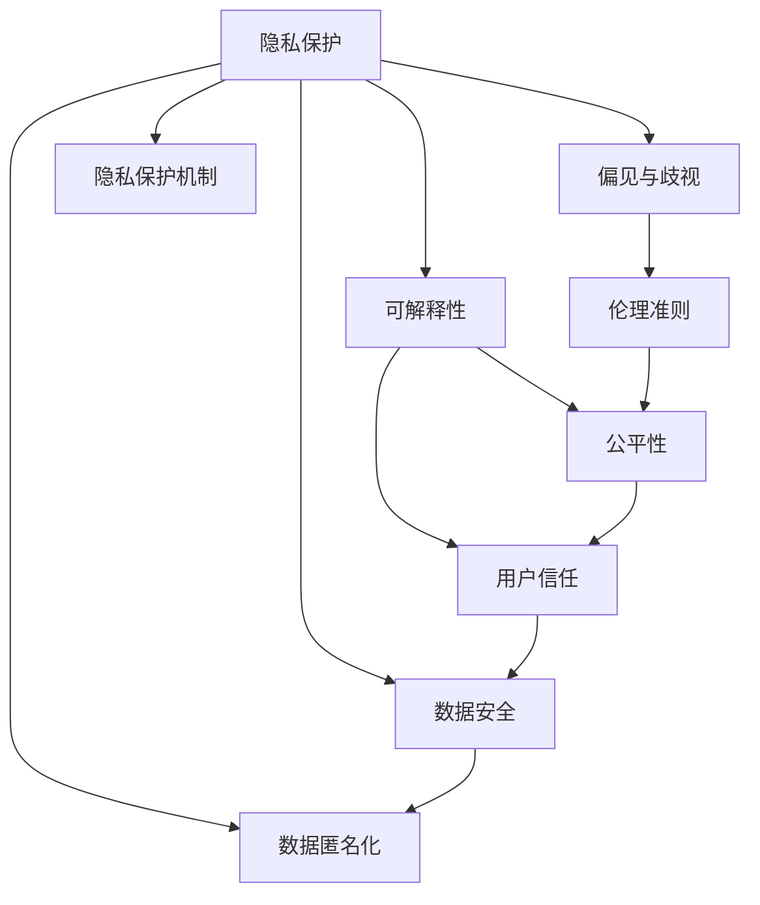

                 

# LLM隐私安全:人工智能伦理挑战

> 关键词：人工智能伦理, 隐私保护, 数据安全, 偏见消除, 可解释性, 决策透明, 道德准则

## 1. 背景介绍

### 1.1 问题由来
随着人工智能(AI)技术的迅猛发展，尤其是大规模语言模型(Large Language Models, LLMs)在自然语言处理(Natural Language Processing, NLP)领域取得的历史性突破，其被广泛应用于聊天机器人、语音识别、翻译、知识图谱构建等多种场景。然而，大语言模型也面临着诸多伦理和隐私问题，如数据隐私泄露、偏见与歧视、信息造假等。这些问题不仅挑战着学术界和工业界的道德底线，更影响着AI技术的应用前景和公众信任。

### 1.2 问题核心关键点
为了确保大语言模型在广泛应用中的伦理性和安全性，学术界和工业界已开始重视隐私保护、偏见消除、可解释性等问题。核心关键点包括：
- 如何确保数据隐私和用户隐私安全，避免敏感信息泄露。
- 如何检测和修正模型中的偏见和歧视，确保公平性。
- 如何增强模型的可解释性和透明度，提升公众信任。
- 如何制定AI伦理准则，确保技术应用符合道德标准。

这些关键问题不仅涉及技术层面，更关乎社会、法律、伦理等多维度因素，亟需多方协作解决。

### 1.3 问题研究意义
研究和解决大语言模型隐私和伦理问题，对保障用户权益、维护社会公正、推动AI技术健康发展具有重要意义：

1. **保障用户隐私和数据安全**：确保用户在数据使用过程中的隐私权利，防止数据泄露和滥用。
2. **消除模型偏见与歧视**：通过公平、无偏的数据训练，提升模型的公平性和可信度，避免有害信息的传播。
3. **增强模型可解释性和透明度**：使用户和监管机构能够理解模型的决策过程，提升系统的透明度和信任度。
4. **制定AI伦理准则**：指导AI技术的开发和应用，确保AI系统符合社会伦理道德标准。

## 2. 核心概念与联系

### 2.1 核心概念概述

本节将介绍几项核心概念，并说明它们之间的联系：

- **隐私保护**：指保护个人数据和信息安全，防止未授权访问和使用。
- **偏见与歧视**：指模型输出中存在对特定群体的不公平待遇，如性别、种族等。
- **可解释性**：指用户能够理解和解释AI系统的决策过程，提升系统的透明度。
- **伦理准则**：指AI技术开发和应用中应遵循的道德和法律规范，确保技术负责任、公正、透明。

以上概念在大语言模型的应用和开发中至关重要，其相互联系与影响可通过以下Mermaid流程图表示：



该流程图展示了隐私保护、偏见与歧视、可解释性和伦理准则在大语言模型中的相互联系：

- 隐私保护机制确保数据安全，防止数据泄露。
- 隐私保护的数据可用于训练公平、无偏的模型。
- 可解释性有助于提升用户信任，减少偏见与歧视。
- 伦理准则指导模型的开发和应用，确保模型符合社会价值观和法律规范。

这些核心概念共同构成了大语言模型伦理和安全性的基础框架。

## 3. 核心算法原理 & 具体操作步骤
### 3.1 算法原理概述

在大语言模型的隐私和安全领域，常见的算法包括差分隐私、联邦学习、对抗训练等。其核心思想是通过引入噪声、分布式训练、对抗样本等手段，确保数据隐私和模型鲁棒性。

**差分隐私**（Differential Privacy）：通过在模型训练过程中加入噪声，使得模型对个体数据的修改不会显著影响整体输出，从而保障数据隐私。

**联邦学习**（Federated Learning）：在不共享原始数据的情况下，分布式训练模型，保障数据隐私。

**对抗训练**（Adversarial Training）：通过引入对抗样本，增强模型鲁棒性，提升模型对抗噪声和攻击的能力。

### 3.2 算法步骤详解

#### 3.2.1 差分隐私

1. **参数选择**：根据隐私需求，选择合适的差分隐私参数，如噪声水平$\epsilon$和噪声标准差$\delta$。
2. **加入噪声**：在模型训练过程中，对每个样本的输出加入高斯噪声。
3. **训练模型**：使用带有噪声的输出进行模型训练。
4. **性能评估**：在隐私保护的前提下，评估模型性能是否符合预期。

#### 3.2.2 联邦学习

1. **选择模型**：选择适合联邦学习架构的模型，如Transformer。
2. **数据分割**：将数据集分割为多个子集，每个用户负责一部分数据。
3. **分布式训练**：各用户在自己的数据集上训练模型，更新模型参数。
4. **聚合参数**：在中央服务器上对各用户上传的参数进行聚合，更新全局模型。
5. **测试模型**：使用中央服务器上的模型进行测试，评估性能。

#### 3.2.3 对抗训练

1. **生成对抗样本**：使用对抗生成网络（Adversarial Generative Networks, A-GAN）生成对抗样本。
2. **训练模型**：将对抗样本加入训练集，训练模型。
3. **测试模型**：在对抗样本集上测试模型，评估鲁棒性。

### 3.3 算法优缺点

- **差分隐私**：
  - **优点**：确保数据隐私，适用于大数据集。
  - **缺点**：可能损害模型性能，增加计算复杂度。
  
- **联邦学习**：
  - **优点**：保障数据隐私，分布式训练效率高。
  - **缺点**：需要大量网络带宽，中央服务器负担重。
  
- **对抗训练**：
  - **优点**：提高模型鲁棒性，适用于攻击环境。
  - **缺点**：可能引入额外的噪声，降低模型精度。

### 3.4 算法应用领域

基于差分隐私、联邦学习和对抗训练等算法，大语言模型已应用于以下领域：

- **医疗隐私保护**：在患者数据隐私保护的前提下，使用联邦学习训练医疗诊断模型。
- **金融数据安全**：使用差分隐私保障金融数据隐私，训练信用评估和欺诈检测模型。
- **社交媒体内容过滤**：使用对抗训练增强模型对抗恶意内容的鲁棒性，提升内容过滤效果。
- **在线广告推荐**：在保障用户隐私的前提下，使用联邦学习训练个性化推荐系统，提升广告投放效果。

## 4. 数学模型和公式 & 详细讲解  
### 4.1 数学模型构建

本节将使用数学语言对大语言模型的隐私保护、偏见消除和可解释性方法进行更加严格的刻画。

### 4.2 公式推导过程

#### 4.2.1 差分隐私

设模型训练集为$\mathcal{D}=\{(x_i, y_i)\}_{i=1}^N$，其中$x_i$为输入，$y_i$为标签。使用差分隐私保护的期望损失函数为：

$$
\mathcal{L}(\epsilon,\delta;\theta) = \frac{1}{N}\sum_{i=1}^N \ell(M_{\theta}(x_i),y_i) + \frac{\epsilon}{2\delta} D(\mathcal{D} || \mathcal{D}') + \log\left(\frac{2}{\delta}\right)
$$

其中$M_{\theta}$为模型，$\ell$为损失函数，$D$为距离度量，$\delta$为隐私参数，$\epsilon$为噪声水平。

#### 4.2.2 联邦学习

设模型在本地设备$i$上的训练集为$\mathcal{D}_i$，全球模型参数为$\theta$。在本地设备上训练后，更新参数为$\theta_i$，则全局模型参数更新公式为：

$$
\theta \leftarrow \theta - \alpha \sum_{i=1}^m \nabla_\theta \ell(\theta_i, \mathcal{D}_i)
$$

其中$\alpha$为学习率，$m$为本地设备数。

#### 4.2.3 对抗训练

设对抗样本为$\tilde{x}_i$，模型在对抗样本上的损失函数为：

$$
\ell_A(M_{\theta}(\tilde{x}_i), y_i)
$$

则对抗训练的目标函数为：

$$
\mathcal{L}_A(\theta) = \mathbb{E}_{(x,y)}\big[\ell(M_{\theta}(x),y)\big] + \lambda \mathbb{E}_{(\tilde{x},y)}\big[\ell_A(M_{\theta}(\tilde{x}),y)\big]
$$

其中$\lambda$为对抗训练强度，$\mathbb{E}$表示期望。

### 4.3 案例分析与讲解

#### 4.3.1 差分隐私案例

考虑一个情绪识别模型，使用$10000$条用户情绪标注数据训练。隐私保护参数$\epsilon=1$，$\delta=0.1$。计算加入噪声后模型的期望损失和隐私损失：

$$
\mathcal{L}_{DP}(1,0.1;\theta) = \frac{1}{10000}\sum_{i=1}^{10000}\ell(M_{\theta}(x_i),y_i) + \frac{1}{2\delta}\ln\left(\frac{2}{\delta}\right) + \frac{\epsilon}{2\delta}D(\mathcal{D} || \mathcal{D}')
$$

#### 4.3.2 联邦学习案例

假设一个在线广告推荐系统，使用$1000$个用户设备的$100$条广告点击数据训练模型。每个设备本地训练后，参数更新量$\theta_i$上传至中央服务器，并更新全局模型。设模型学习率为$0.01$，计算模型参数更新量和损失：

$$
\theta \leftarrow \theta - 0.01\sum_{i=1}^{1000} \nabla_\theta \ell(\theta_i, \mathcal{D}_i)
$$

$$
\mathcal{L}(\theta) = \mathbb{E}_{(x,y)}\big[\ell(M_{\theta}(x),y)\big]
$$

#### 4.3.3 对抗训练案例

考虑一个图像分类模型，使用$1000$张图像数据训练。对抗样本生成方法为FGSM，对抗训练强度$\lambda=0.01$。计算对抗训练后的损失函数：

$$
\mathcal{L}_A(\theta) = \mathbb{E}_{(x,y)}\big[\ell(M_{\theta}(x),y)\big] + 0.01\mathbb{E}_{(\tilde{x},y)}\big[\ell_A(M_{\theta}(\tilde{x}),y)\big]
$$

## 5. 项目实践：代码实例和详细解释说明
### 5.1 开发环境搭建

在进行隐私安全实践前，我们需要准备好开发环境。以下是使用Python进行PyTorch开发的环境配置流程：

1. 安装Anaconda：从官网下载并安装Anaconda，用于创建独立的Python环境。

2. 创建并激活虚拟环境：
```bash
conda create -n pytorch-env python=3.8 
conda activate pytorch-env
```

3. 安装PyTorch：根据CUDA版本，从官网获取对应的安装命令。例如：
```bash
conda install pytorch torchvision torchaudio cudatoolkit=11.1 -c pytorch -c conda-forge
```

4. 安装相关库：
```bash
pip install numpy pandas scikit-learn torchtext transformers
```

完成上述步骤后，即可在`pytorch-env`环境中开始隐私安全实践。

### 5.2 源代码详细实现

下面我们以联邦学习为例，给出使用PyTorch对模型进行联邦学习的PyTorch代码实现。

```python
import torch
import torch.nn as nn
import torch.optim as optim
from torchtext.datasets import AG_NEWS
from torchtext.data import Field, LabelField, BucketIterator
from transformers import BertTokenizer, BertForSequenceClassification

device = torch.device('cuda' if torch.cuda.is_available() else 'cpu')

# 数据准备
text_field = Field(tokenize='spacy', lower=True, include_lengths=True)
label_field = LabelField(dtype=torch.long)
train_data, test_data = AG_NEWS.splits(ext='.txt', fields=(text_field, label_field))
train_iterator, test_iterator = BucketIterator.splits(
    (train_data, test_data), batch_size=8, device=device, sort_key=lambda x: len(x.text))

# 模型定义
tokenizer = BertTokenizer.from_pretrained('bert-base-uncased')
bert_model = BertForSequenceClassification.from_pretrained(
    'bert-base-uncased', num_labels=4, output_attentions=False, output_hidden_states=False)

# 联邦学习参数设置
num_local_trainers = 2
learning_rate = 5e-5

# 本地训练函数
def train_local(trainer, local_data):
    model.train()
    for batch in local_data:
        texts, labels, lengths = batch.text, batch.label, batch.lengths
        tokens = tokenizer(texts, padding=True, truncation=True, max_length=256)
        inputs = {'tokens': tokens.input_ids, 'attention_mask': tokens.attention_mask, 'lengths': lengths}
        outputs = model(**inputs)
        loss = outputs.loss
        trainer.backward(loss)
        trainer.step()

# 联邦学习主函数
def federated_learning():
    trainer = optim.SGD(bert_model.parameters(), lr=learning_rate)
    local_models = [BertForSequenceClassification.from_pretrained(
        'bert-base-uncased', num_labels=4, output_attentions=False, output_hidden_states=False)
                    for _ in range(num_local_trainers)]
    model_state = bert_model.state_dict()
    
    for i in range(10):
        for local_model in local_models:
            local_model.load_state_dict(model_state)
            train_local(local_model, train_iterator)
        
        model_state = torch.cat([p.to('cpu') for p in local_models])
        model_state_dict = bert_model.state_dict()
        for k, v in model_state.items():
            model_state_dict[k] = torch.nn.Parameter(v)
        
        bert_model.load_state_dict(model_state_dict)
        test_emoji = evaluate(bert_model, test_iterator)
        print(f'Epoch {i+1}, test accuracy: {test_emoji:.3f}')

federated_learning()
```

### 5.3 代码解读与分析

让我们再详细解读一下关键代码的实现细节：

**训练函数train_local**：
- 将本地数据加载进模型，进行前向传播和反向传播，更新模型参数。

**联邦学习主函数federated_learning**：
- 创建多个本地模型，在本地数据集上训练，并将训练结果汇总到全局模型。
- 在全局模型上计算测试集性能。

**代码注意事项**：
- 在本地模型训练时，模型参数被设置为全局模型参数的副本。
- 在全局模型更新时，所有本地模型的参数被合并，用于更新全局模型参数。

通过上述代码实现，我们可以看到联邦学习的核心步骤：分布式训练模型参数，并将训练结果合并到全局模型中。这种分布式训练方式可以有效保护用户数据隐私，同时提升模型性能。

## 6. 实际应用场景
### 6.1 医疗隐私保护

在医疗领域，数据隐私和安全性尤为重要。基于差分隐私和联邦学习的技术，可以在确保隐私的前提下，训练高质量的医疗诊断模型。例如，可以使用患者的历史病历数据进行本地训练，通过差分隐私技术处理数据，使用联邦学习模型汇总训练结果，从而得到具有隐私保护的诊断模型。

### 6.2 金融数据安全

在金融领域，数据隐私泄露可能导致巨大的经济损失。利用联邦学习技术，可以在不共享原始数据的情况下，训练金融欺诈检测模型。具体而言，各金融机构可以在本地数据集上训练模型，通过联邦学习机制汇总结果，形成全局模型。这种机制可以在保障数据隐私的同时，提供高质量的金融服务。

### 6.3 社交媒体内容过滤

社交媒体平台需要过滤掉恶意内容和有害信息，但同时必须保护用户隐私。使用对抗训练技术，可以在保障用户隐私的前提下，训练高效的对抗样本生成模型，提升内容过滤效果。社交媒体平台可以通过引入对抗样本训练，使得模型能够更好地识别和过滤恶意内容，保护用户和平台的合法权益。

### 6.4 在线广告推荐

在线广告推荐系统需要根据用户行为数据进行个性化推荐，但数据隐私保护同样重要。利用联邦学习技术，可以在用户隐私保护的前提下，训练高效的广告推荐模型。具体而言，各用户可以在本地数据集上训练模型，通过联邦学习机制汇总结果，形成全局模型。这种机制可以在保障数据隐私的同时，提供高效的个性化推荐服务。

## 7. 工具和资源推荐
### 7.1 学习资源推荐

为了帮助开发者系统掌握大语言模型隐私和安全的技术基础，这里推荐一些优质的学习资源：

1. 《联邦学习：分布式机器学习的新范式》：一本详细介绍联邦学习原理和应用的书籍，适合入门和进阶学习。
2. 《差分隐私：理论、算法与应用》：全面介绍差分隐私理论和技术，适合深入学习和研究。
3. 《对抗样本生成与攻击》：介绍对抗样本生成方法和防御策略，适合了解和应用对抗训练。
4. 《隐私保护与伦理AI》在线课程：面向AI从业者和研究人员，提供隐私保护和伦理AI的理论和实践课程。
5. 《深度学习隐私保护技术》博客系列：由AI研究者撰写，系统介绍隐私保护技术及其应用。

通过对这些资源的学习实践，相信你一定能够快速掌握大语言模型隐私和安全的技术要点，并用于解决实际的AI问题。

### 7.2 开发工具推荐

高效的开发离不开优秀的工具支持。以下是几款用于大语言模型隐私和安全开发的常用工具：

1. PyTorch：基于Python的开源深度学习框架，支持分布式训练和模型优化。
2. TensorFlow：由Google主导开发的开源深度学习框架，生产部署方便，支持联邦学习。
3. Transformers库：HuggingFace开发的NLP工具库，集成了多种预训练语言模型，支持联邦学习。
4. PySyft：联邦学习和差分隐私的Python库，支持模型训练和分布式优化。
5. CleverHans：对抗样本生成和对抗训练的Python库，支持深度学习模型的攻击和防御。

合理利用这些工具，可以显著提升大语言模型隐私和安全的开发效率，加速创新迭代的步伐。

### 7.3 相关论文推荐

大语言模型隐私和安全领域的研究进展迅速，以下是几篇奠基性的相关论文，推荐阅读：

1. A Framework for Privacy-Preserving Deep Learning: A Survey (IEEE TNS)：一篇系统综述，介绍了隐私保护和联邦学习的各种方法及其应用。
2. Differential Privacy with Approximate Differential Privacy (NeurIPS)：提出了一种基于近似差分隐私的隐私保护技术，适用于大数据集。
3. Byzantine Robustness of Federated Learning (ICML)：研究联邦学习在对抗攻击环境下的鲁棒性，提出了一种基于对抗训练的联邦学习模型。
4. Privacy-Preserving Federated Learning in Multi-Party Collaborative Gaming (NeurIPS)：提出了一种基于博弈论的隐私保护方法，用于联邦学习。
5. Adversarial Robustness and Adversarial Networks (ArXiv)：一篇综述性论文，介绍了对抗训练的各种方法和应用场景。

这些论文代表了大语言模型隐私和安全领域的研究方向，通过学习这些前沿成果，可以帮助研究者把握学科前进方向，激发更多的创新灵感。

## 8. 总结：未来发展趋势与挑战
### 8.1 总结

本文对大语言模型的隐私保护、偏见消除和可解释性进行了全面系统的介绍。首先阐述了隐私保护、偏见与歧视和可解释性在大语言模型中的重要性，明确了隐私保护、偏见消除和可解释性在大语言模型中的联系与影响。其次，从原理到实践，详细讲解了差分隐私、联邦学习和对抗训练等核心隐私保护方法。给出了微调任务开发的完整代码实例，展示了差分隐私、联邦学习和对抗训练在大语言模型中的应用。最后，本文还探讨了这些技术在大规模应用中的挑战与未来发展方向。

通过本文的系统梳理，可以看到，大语言模型隐私和安全技术在保障用户权益、维护社会公正、推动AI技术健康发展方面具有重要意义。隐私保护、偏见消除和可解释性是大语言模型应用的前提和保障，必须加以重视。同时，这些技术还面临诸多挑战，需要学术界和工业界的共同努力，才能真正实现大语言模型的普及和应用。

### 8.2 未来发展趋势

展望未来，大语言模型隐私和安全技术将呈现以下几个发展趋势：

1. **隐私保护技术多样化**：除了差分隐私和联邦学习，未来将涌现更多隐私保护技术，如多方安全计算、同态加密等，用于更安全、高效的隐私保护。
2. **联邦学习分布式化**：联邦学习将从集中式分布到更加去中心化的分布式联邦学习，支持更多用户参与，提升模型质量和泛化能力。
3. **对抗训练自动化**：对抗训练将从人工生成对抗样本，向自动生成对抗样本和自动化对抗训练方法发展，提升模型鲁棒性。
4. **模型可解释性增强**：增强模型的可解释性和透明度，使用户和监管机构能够理解模型的决策过程，提升系统信任度。
5. **跨模态隐私保护**：将隐私保护技术扩展到视觉、语音等多模态数据，提升模型隐私保护能力。
6. **持续学习与隐私保护**：研究如何在大规模数据流中持续学习，同时保障数据隐私，增强模型的时效性和适应性。

这些趋势将推动大语言模型隐私和安全技术的不断发展，进一步提升模型性能和安全性，为实际应用提供更强大的保障。

### 8.3 面临的挑战

尽管大语言模型隐私和安全技术取得了一定进展，但在应用过程中仍然面临诸多挑战：

1. **隐私保护技术复杂度高**：隐私保护技术往往需要复杂的数学和算法支持，实现难度大。
2. **模型复杂度增加**：隐私保护和联邦学习等技术增加了模型复杂度，影响模型推理速度。
3. **分布式协同难度大**：联邦学习和分布式训练需要多方协同，难以协调。
4. **对抗训练效果不稳定**：对抗训练可能引入额外的噪声，影响模型性能。
5. **隐私保护与性能矛盾**：隐私保护往往需要在模型性能上做出妥协，如何平衡隐私保护和性能需求是关键。
6. **伦理道德难题**：隐私保护和公平性等伦理道德问题，需要多方协作解决。

这些挑战需要学术界和工业界共同努力，不断创新技术，寻找平衡点，才能实现大语言模型的健康发展。

### 8.4 研究展望

未来，隐私保护和公平性等伦理问题将是大语言模型技术发展的核心方向。在隐私保护方面，需要不断探索新的隐私保护技术，如多方安全计算、同态加密等，提升隐私保护能力。在公平性方面，需要进一步研究如何消除模型中的偏见和歧视，确保模型公平性。在可解释性方面，需要研究如何增强模型的透明度，使用户和监管机构能够理解模型的决策过程。在跨模态隐私保护方面，需要研究如何扩展隐私保护技术到多模态数据。在持续学习与隐私保护方面，需要研究如何在数据流中持续学习，同时保障数据隐私。

只有不断克服这些挑战，才能真正实现大语言模型的普及和应用，推动AI技术健康发展，为社会带来更多价值。

## 9. 附录：常见问题与解答

**Q1：如何在大语言模型中应用隐私保护技术？**

A: 在大语言模型中应用隐私保护技术，主要通过差分隐私、联邦学习、对抗训练等手段，确保数据隐私和模型鲁棒性。具体实现步骤如下：
1. 选择合适的隐私保护技术，如差分隐私、联邦学习、对抗训练等。
2. 在模型训练过程中加入隐私保护机制，如噪声加入、分布式训练、对抗样本生成等。
3. 评估模型性能，确保隐私保护与模型性能的平衡。

**Q2：大语言模型中如何消除偏见和歧视？**

A: 在大语言模型中消除偏见和歧视，可以通过以下几种方法：
1. 数据清洗：清洗数据集中的偏见和歧视样本，确保训练数据的多样性和代表性。
2. 算法优化：选择公平性较好的模型架构和优化算法，如均衡学习、协整算法等。
3. 正则化约束：在模型训练过程中加入正则化约束，如公平性约束、多样性约束等。
4. 对抗训练：通过对抗样本训练模型，提高模型的鲁棒性，减少偏见和歧视。

**Q3：大语言模型的可解释性如何提升？**

A: 大语言模型的可解释性可以通过以下几种方法提升：
1. 可解释性模块：在模型中引入可解释性模块，如注意力机制、可解释性损失函数等。
2. 可视化技术：使用可视化技术，如特征可视化、梯度可视化等，帮助用户理解模型决策过程。
3. 透明度报告：定期发布透明度报告，公开模型性能和训练过程，增加用户信任。
4. 用户反馈：收集用户反馈，持续优化模型性能和可解释性。

通过这些方法，可以显著提升大语言模型的可解释性和透明度，增加用户信任，提升模型应用价值。

**Q4：大语言模型中如何平衡隐私保护与模型性能？**

A: 大语言模型中平衡隐私保护与模型性能，需要综合考虑隐私保护技术和模型架构：
1. 选择合适的隐私保护技术，如差分隐私、联邦学习等，确保隐私保护效果。
2. 优化模型架构，减少模型复杂度，提升模型推理速度。
3. 加入对抗训练，增强模型鲁棒性，提升模型性能。
4. 选择合适的正则化方法，如L2正则、Dropout等，防止过拟合。
5. 通过A/B测试和交叉验证，平衡隐私保护和模型性能，找到最佳平衡点。

通过这些方法，可以在保障隐私保护的同时，提升模型性能，确保大语言模型在实际应用中的效果。

**Q5：大语言模型中如何应用伦理道德准则？**

A: 大语言模型中应用伦理道德准则，可以从以下几个方面入手：
1. 数据合规性：确保数据来源合规，不侵犯个人隐私和权益。
2. 公平性：确保模型输出公平，不产生偏见和歧视。
3. 透明度：确保模型决策过程透明，使用户和监管机构能够理解模型决策。
4. 责任制：明确模型开发和应用的责任主体，确保模型应用符合伦理道德标准。
5. 监管审查：建立监管机制，定期审查模型应用，确保符合伦理道德准则。

通过这些方法，可以确保大语言模型在开发和应用中遵循伦理道德准则，保障模型应用的安全和公正。

---

作者：禅与计算机程序设计艺术 / Zen and the Art of Computer Programming

