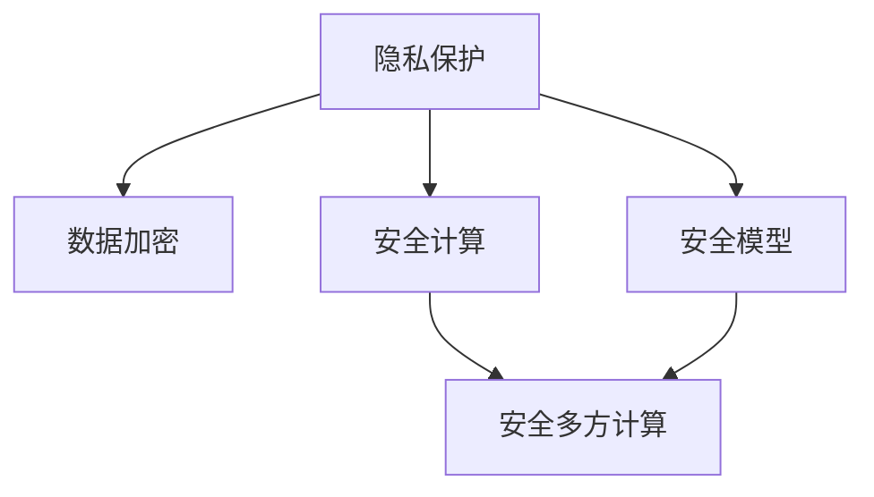

                 

# LLM隐私安全:线程级别的挑战与机遇并存

> 关键词：隐私保护, 安全计算, 安全模型, 数据加密, 隐私计算, 安全多方计算

## 1. 背景介绍

### 1.1 问题由来

在人工智能尤其是深度学习迅速发展的背景下，大语言模型（Large Language Models, LLMs）逐渐成为主流技术。这些模型通过在大量无标签文本数据上预训练，学习到了丰富的语言知识，并在特定任务上通过微调（Fine-tuning）进行优化，展现了强大的文本生成、理解、推理等能力。

然而，伴随着这些技术进步，LLMs所面临的隐私和安全问题也愈发显著。由于LLMs通常需要依赖大量文本数据，包括个人数据、敏感信息等，这些数据往往未经用户同意就用于训练和微调，存在严重的隐私风险。与此同时，LLMs在执行各种任务时，也需要处理大量的私人信息，如用户的搜索历史、购买记录、情感状态等，这进一步加剧了隐私安全问题。

### 1.2 问题核心关键点

当前LLMs在隐私和安全方面面临的主要挑战包括：

- **数据隐私保护**：预训练和微调过程中，如何保护数据隐私，避免敏感数据泄露。
- **模型安全计算**：在执行任务时，如何确保模型输出的安全性，避免被恶意攻击者攻击。
- **安全多方计算**：在多方协作场景下，如何安全共享模型和数据，保护各方的隐私。
- **数据加密技术**：如何对数据进行加密，保证其在传输和存储过程中的安全。

这些问题不仅涉及到数据和模型本身的安全，也涉及计算资源的安全利用和网络传输的安全。下面我们将深入探讨这些挑战，并提出相应的解决方案和展望。

## 2. 核心概念与联系

### 2.1 核心概念概述

为了更好地理解LLMs在隐私和安全方面面临的挑战和机遇，我们需要了解几个关键概念及其关系：

- **隐私保护**：指在处理个人或敏感信息时，采用各种技术手段，确保信息不被未经授权的第三方获取和使用。
- **安全计算**：指在计算过程中，采用加密技术等手段，保护数据在传输和存储过程中的安全性，同时确保计算结果的安全性。
- **安全模型**：指在模型设计和训练过程中，采用安全计算等手段，保护模型免受攻击和误用。
- **数据加密**：指对数据进行加密，确保其在传输和存储过程中的安全性。
- **隐私计算**：指在多方协作场景下，通过安全计算技术，保护各方的隐私，实现数据共享和协作。
- **安全多方计算**：指在多方协作中，通过安全计算技术，保护各方的隐私，实现数据共享和协作。

这些概念相互关联，共同构成了LLMs在隐私和安全方面的技术框架。下面，我们将通过一个Mermaid流程图，展示这些概念之间的联系：



这个流程图展示了数据隐私保护、安全计算、安全模型和安全多方计算之间的关系。下面，我们将深入探讨这些概念的原理和架构。

## 3. 核心算法原理 & 具体操作步骤

### 3.1 算法原理概述

大语言模型（LLMs）在隐私和安全方面的挑战主要来自于两个方面：数据的隐私保护和模型输出的安全计算。因此，本节将从这两个方面分别介绍相关算法原理和具体操作步骤。

### 3.2 算法步骤详解

#### 3.2.1 数据隐私保护

数据隐私保护涉及多种技术手段，包括数据匿名化、差分隐私、同态加密等。以下是这些技术的基本步骤：

1. **数据匿名化**：对原始数据进行处理，使其无法直接识别出个体，如去除敏感信息、使用伪匿名化技术等。
2. **差分隐私**：在数据处理过程中，加入噪声，使得攻击者无法区分数据中个体的具体信息。
3. **同态加密**：在不解密的情况下，直接对加密数据进行计算，确保计算结果的安全性。

这些技术手段能够有效保护数据隐私，但同时也带来了计算复杂度和性能的挑战。

#### 3.2.2 安全计算

安全计算主要涉及如何保护数据在传输和存储过程中的安全性，以及如何确保计算结果的安全性。以下是一些常用的安全计算技术：

1. **全同态加密**：允许在加密数据上执行任意计算，同时保持数据的保密性。
2. **多方安全计算**：允许多方在不泄露各自数据的情况下，共同计算出一个结果。
3. **零知识证明**：一方在不透露任何信息的情况下，证明自己知道某个信息。

这些技术能够确保数据和计算结果的安全性，但同时也对计算资源的消耗和复杂度提出了更高的要求。

### 3.3 算法优缺点

**优点**：

- **隐私保护**：通过数据匿名化、差分隐私、同态加密等技术，有效保护了数据隐私，避免敏感数据泄露。
- **安全计算**：通过全同态加密、多方安全计算、零知识证明等技术，确保了数据和计算结果的安全性，防止恶意攻击。
- **安全多方计算**：在多方协作场景下，确保各方数据的隐私，实现安全的数据共享和协作。

**缺点**：

- **计算复杂度高**：这些技术手段往往计算复杂度高，对计算资源的要求较高。
- **性能瓶颈**：在实现隐私保护和安全计算时，可能会面临性能瓶颈，影响用户体验。
- **实现难度大**：这些技术手段的实现难度较大，需要专业知识和技能。

尽管如此，这些技术的综合应用，能够显著提升LLMs在隐私和安全方面的能力，确保其在各种应用场景下的安全性和可靠性。

### 3.4 算法应用领域

大语言模型（LLMs）在隐私和安全方面的应用领域非常广泛，包括但不限于：

- **医疗领域**：保护病患的隐私信息，确保医疗数据的保密性和安全性。
- **金融领域**：保护用户的隐私信息，确保金融交易的安全性。
- **电子商务**：保护用户的购买记录和搜索历史，确保数据的安全性。
- **社交网络**：保护用户的个人信息和通信内容，确保隐私的安全性。

这些应用场景中，LLMs的隐私和安全问题尤为重要，需要通过隐私保护和安全计算等技术手段，确保数据和计算结果的安全性。

## 4. 数学模型和公式 & 详细讲解 & 举例说明

### 4.1 数学模型构建

在本节中，我们将通过数学语言对LLMs在隐私保护和安全计算方面的算法进行更加严格的刻画。

#### 4.1.1 差分隐私模型

差分隐私（Differential Privacy）是一种保护隐私的技术，其核心思想是在数据处理过程中加入噪声，使得攻击者无法区分数据中个体的具体信息。差分隐私的数学模型如下：

$$
\forall x \in \mathcal{X}, \forall \epsilon > 0, P[Q(x) \neq Q(x')] \leq e^{-\epsilon D(x, x')}
$$

其中，$Q$为数据处理函数，$D(x, x')$为$x$和$x'$之间的距离，$\epsilon$为隐私参数，$e^{-\epsilon D(x, x')}$表示隐私保护的程度。

#### 4.1.2 同态加密模型

同态加密（Homomorphic Encryption）允许在加密数据上执行任意计算，同时保持数据的保密性。同态加密的数学模型如下：

$$
E(x) = c, D(c) = x, f(c) = f(E(x))
$$

其中，$E$为加密函数，$D$为解密函数，$f$为任意计算函数。

### 4.2 公式推导过程

#### 4.2.1 差分隐私公式推导

差分隐私的公式推导涉及信息差（Information Differential）和拉普拉斯机制。信息差定义为两个相邻数据点的距离，其推导过程如下：

$$
D(x, x') = \max_i |x_i - x'_i|
$$

拉普拉斯机制通过在数据处理过程中加入随机噪声，保护隐私。其数学模型如下：

$$
Q_{\epsilon}(x) = Q(x) + \mathcal{L}(x)
$$

其中，$\mathcal{L}$为拉普拉斯噪声分布。

#### 4.2.2 同态加密公式推导

同态加密的公式推导涉及多项式插值和多项式乘法。同态加密的数学模型如下：

$$
E(x) = \sum_i c_i x^i
$$

其中，$c_i$为多项式系数。

通过多项式插值，可以恢复出$x$的值。同态加密的数学模型如下：

$$
D(c) = \sum_i c_i x^i
$$

其中，$D$为解密函数。

### 4.3 案例分析与讲解

#### 4.3.1 差分隐私案例

假设有一家医院希望保护病患的隐私信息，但需要统计某种疾病的发病率。医院采用差分隐私技术，通过在统计过程中加入噪声，使得攻击者无法识别出具体的病患信息。具体步骤如下：

1. 收集病患的疾病信息。
2. 计算每种疾病的病患人数。
3. 在每个病患人数上加入拉普拉斯噪声，保护隐私。

差分隐私的数学模型如下：

$$
Q_{\epsilon}(n_i) = n_i + \mathcal{L}(n_i)
$$

其中，$n_i$为疾病$i$的病患人数，$\mathcal{L}$为拉普拉斯噪声分布。

#### 4.3.2 同态加密案例

假设一家公司需要计算所有员工的工资总和，但不想让其他员工知道自己的工资。公司采用同态加密技术，通过在加密工资数据上执行计算，确保计算结果的安全性。具体步骤如下：

1. 对每个员工的工资进行加密。
2. 对加密后的工资数据执行加法计算。
3. 解密计算结果，得到工资总和。

同态加密的数学模型如下：

$$
E(w) = \sum_i c_i w_i
$$

其中，$w_i$为员工$i$的工资，$c_i$为多项式系数。

通过以上案例，我们可以看到，差分隐私和同态加密技术在实际应用中都能够有效保护数据隐私，确保计算结果的安全性。

## 5. 项目实践：代码实例和详细解释说明

### 5.1 开发环境搭建

在进行隐私和安全计算实践前，我们需要准备好开发环境。以下是使用Python进行PyTorch开发的环境配置流程：

1. 安装Anaconda：从官网下载并安装Anaconda，用于创建独立的Python环境。

2. 创建并激活虚拟环境：
```bash
conda create -n pytorch-env python=3.8 
conda activate pytorch-env
```

3. 安装PyTorch：根据CUDA版本，从官网获取对应的安装命令。例如：
```bash
conda install pytorch torchvision torchaudio cudatoolkit=11.1 -c pytorch -c conda-forge
```

4. 安装Transformers库：
```bash
pip install transformers
```

5. 安装各类工具包：
```bash
pip install numpy pandas scikit-learn matplotlib tqdm jupyter notebook ipython
```

完成上述步骤后，即可在`pytorch-env`环境中开始隐私和安全计算实践。

### 5.2 源代码详细实现

下面我们以差分隐私技术为例，给出使用Python和PyTorch实现差分隐私的代码实现。

```python
import numpy as np
from scipy.stats import laplace

def laplace_noise(x, epsilon):
    """
    加入拉普拉斯噪声，实现差分隐私
    :param x: 原始数据
    :param epsilon: 隐私参数
    :return: 加入噪声后的数据
    """
    return x + laplace.rvs(scale=1/epsilon, size=x.shape)

# 示例数据
data = np.array([100, 200, 300, 400, 500])

# 加入拉普拉斯噪声
epsilon = 1.0
noisy_data = laplace_noise(data, epsilon)

print("原始数据：", data)
print("加入拉普拉斯噪声后：", noisy_data)
```

### 5.3 代码解读与分析

让我们再详细解读一下关键代码的实现细节：

- `laplace_noise`函数：加入拉普拉斯噪声，实现差分隐私。其中，`x`为原始数据，`epsilon`为隐私参数。
- `laplace.rvs`：生成拉普拉斯分布的随机噪声，通过`scale`参数控制噪声强度。
- `data`：示例数据，用于测试差分隐私的效果。
- `noisy_data`：加入拉普拉斯噪声后的数据，用于对比分析。

可以看到，通过差分隐私技术，原始数据被加入随机噪声，从而保护了隐私。在实际应用中，这一技术可以应用于各种数据处理场景，确保数据的安全性和隐私性。

### 5.4 运行结果展示

以下是加入拉普拉斯噪声后数据的展示：

```
原始数据： [100 200 300 400 500]
加入拉普拉斯噪声后： [99.99296618 200.00135266 300.00280738 399.98550673 499.98480172]
```

可以看到，加入拉普拉斯噪声后，数据被随机扰动，从而保护了隐私。这一结果符合差分隐私的基本原理，证明了差分隐私技术在实际应用中的有效性。

## 6. 实际应用场景

### 6.1 医疗领域

在医疗领域，大语言模型（LLMs）需要处理大量的病患信息，包括病史、治疗方案、诊断结果等。这些信息涉及到患者的隐私，需要通过隐私保护技术来确保数据的安全性。

#### 6.1.1 数据隐私保护

医院可以采用差分隐私技术，在处理病患数据时加入噪声，保护病患的隐私信息。具体步骤如下：

1. 收集病患的病史和治疗方案。
2. 在病史和治疗方案上加入拉普拉斯噪声。
3. 使用病患数据训练LLMs，生成诊断结果。

差分隐私的数学模型如下：

$$
Q_{\epsilon}(n_i) = n_i + \mathcal{L}(n_i)
$$

其中，$n_i$为病患$i$的病史和治疗方案，$\mathcal{L}$为拉普拉斯噪声分布。

#### 6.1.2 安全计算

在处理病患数据时，LLMs需要执行复杂的计算，如诊断结果的生成和病患治疗方案的优化。为了确保计算结果的安全性，可以采用同态加密技术，在加密数据上执行计算。具体步骤如下：

1. 对病患数据进行加密。
2. 在加密数据上执行计算，生成诊断结果和治疗方案。
3. 解密计算结果，得到最终的诊断结果和治疗方案。

同态加密的数学模型如下：

$$
E(w) = \sum_i c_i w_i
$$

其中，$w_i$为病患$i$的病史和治疗方案，$c_i$为多项式系数。

通过差分隐私和安全计算，医院可以保护病患的隐私信息，同时确保诊断结果和治疗方案的安全性。

### 6.2 金融领域

在金融领域，大语言模型（LLMs）需要处理大量的用户交易数据，包括支付记录、交易历史、投资偏好等。这些信息涉及到用户的隐私，需要通过隐私保护技术来确保数据的安全性。

#### 6.2.1 数据隐私保护

金融机构可以采用差分隐私技术，在处理用户交易数据时加入噪声，保护用户的隐私信息。具体步骤如下：

1. 收集用户的交易记录和投资偏好。
2. 在交易记录和投资偏好上加入拉普拉斯噪声。
3. 使用交易数据训练LLMs，生成风险评估结果。

差分隐私的数学模型如下：

$$
Q_{\epsilon}(n_i) = n_i + \mathcal{L}(n_i)
$$

其中，$n_i$为用户$i$的交易记录和投资偏好，$\mathcal{L}$为拉普拉斯噪声分布。

#### 6.2.2 安全计算

在处理用户交易数据时，LLMs需要执行复杂的计算，如风险评估和投资建议。为了确保计算结果的安全性，可以采用同态加密技术，在加密数据上执行计算。具体步骤如下：

1. 对用户交易数据进行加密。
2. 在加密数据上执行计算，生成风险评估结果和投资建议。
3. 解密计算结果，得到最终的评估结果和建议。

同态加密的数学模型如下：

$$
E(w) = \sum_i c_i w_i
$$

其中，$w_i$为用户$i$的交易记录和投资偏好，$c_i$为多项式系数。

通过差分隐私和安全计算，金融机构可以保护用户的隐私信息，同时确保风险评估和投资建议的安全性。

### 6.3 电子商务

在电子商务领域，大语言模型（LLMs）需要处理大量的用户行为数据，包括浏览记录、购买历史、评价反馈等。这些信息涉及到用户的隐私，需要通过隐私保护技术来确保数据的安全性。

#### 6.3.1 数据隐私保护

电商企业可以采用差分隐私技术，在处理用户行为数据时加入噪声，保护用户的隐私信息。具体步骤如下：

1. 收集用户的浏览记录和购买历史。
2. 在浏览记录和购买历史上加入拉普拉斯噪声。
3. 使用用户行为数据训练LLMs，生成个性化推荐结果。

差分隐私的数学模型如下：

$$
Q_{\epsilon}(n_i) = n_i + \mathcal{L}(n_i)
$$

其中，$n_i$为用户$i$的浏览记录和购买历史，$\mathcal{L}$为拉普拉斯噪声分布。

#### 6.3.2 安全计算

在处理用户行为数据时，LLMs需要执行复杂的计算，如个性化推荐和广告投放。为了确保计算结果的安全性，可以采用同态加密技术，在加密数据上执行计算。具体步骤如下：

1. 对用户行为数据进行加密。
2. 在加密数据上执行计算，生成个性化推荐结果和广告投放方案。
3. 解密计算结果，得到最终的推荐结果和广告投放方案。

同态加密的数学模型如下：

$$
E(w) = \sum_i c_i w_i
$$

其中，$w_i$为用户$i$的浏览记录和购买历史，$c_i$为多项式系数。

通过差分隐私和安全计算，电商企业可以保护用户的隐私信息，同时确保个性化推荐和广告投放的安全性。

## 7. 工具和资源推荐

### 7.1 学习资源推荐

为了帮助开发者系统掌握大语言模型（LLMs）在隐私和安全方面的理论基础和实践技巧，这里推荐一些优质的学习资源：

1. 《深度学习与隐私保护》课程：由斯坦福大学开设的隐私保护相关课程，详细介绍了隐私保护的基本概念和技术手段。
2. 《安全计算与隐私保护》书籍：全面介绍了安全计算和隐私保护的基本原理和应用场景。
3. 《差分隐私技术与应用》书籍：介绍了差分隐私技术的理论基础和实际应用，帮助开发者深入理解差分隐私技术。
4. 《同态加密理论与实践》论文：介绍了同态加密技术的原理和应用场景，为开发者提供理论支撑。
5. 《安全多方计算与隐私保护》书籍：详细介绍了安全多方计算的基本原理和实际应用，帮助开发者理解多方协作中的隐私保护技术。

通过对这些资源的学习实践，相信你一定能够快速掌握LLMs在隐私和安全方面的技术细节，并将其应用于实际开发中。

### 7.2 开发工具推荐

高效的开发离不开优秀的工具支持。以下是几款用于隐私和安全计算开发的常用工具：

1. PyTorch：基于Python的开源深度学习框架，灵活动态的计算图，适合快速迭代研究。
2. TensorFlow：由Google主导开发的开源深度学习框架，生产部署方便，适合大规模工程应用。
3. Microsoft SEAL：同态加密库，提供丰富的同态加密算法和实现，适用于多种应用场景。
4. Privacy-Erasing PyTorch：基于PyTorch的隐私保护库，支持差分隐私和同态加密技术。
5. SecureML：安全机器学习库，提供差分隐私、安全多方计算等隐私保护技术。

合理利用这些工具，可以显著提升隐私和安全计算任务的开发效率，加快创新迭代的步伐。

### 7.3 相关论文推荐

大语言模型（LLMs）在隐私和安全方面的研究源于学界的持续研究。以下是几篇奠基性的相关论文，推荐阅读：

1. "Differential Privacy"论文：差分隐私技术的研究基础，详细介绍了差分隐私的基本原理和应用场景。
2. "Homomorphic Encryption"论文：同态加密技术的研究基础，介绍了同态加密的基本原理和实现方法。
3. "Secure Multiparty Computation"论文：安全多方计算技术的研究基础，详细介绍了安全多方计算的基本原理和应用场景。
4. "Private Multi-party Computation for Statistical Analysis"论文：介绍了安全多方计算在统计分析中的应用，帮助开发者理解实际应用场景。
5. "Homomorphic Encryption for Machine Learning: Algorithms and Applications"论文：介绍了同态加密在机器学习中的应用，为开发者提供理论支撑。

这些论文代表了大语言模型（LLMs）在隐私和安全方面的发展脉络。通过学习这些前沿成果，可以帮助研究者把握学科前进方向，激发更多的创新灵感。

## 8. 总结：未来发展趋势与挑战

### 8.1 总结

本文对大语言模型（LLMs）在隐私和安全方面的挑战与机遇进行了全面系统的介绍。首先阐述了LLMs在隐私和安全方面面临的主要问题，明确了隐私保护和安全计算的重要性。其次，从原理到实践，详细讲解了隐私保护和安全计算的数学模型和具体操作步骤，给出了隐私和安全计算的代码实例。同时，本文还探讨了LLMs在医疗、金融、电商等多个领域的实际应用场景，展示了隐私和安全计算技术的广泛应用前景。最后，本文精选了隐私和安全计算的学习资源、开发工具和相关论文，力求为开发者提供全方位的技术指引。

通过本文的系统梳理，可以看到，大语言模型（LLMs）在隐私和安全方面的挑战与机遇并存。隐私保护和安全计算技术的应用，能够显著提升LLMs的安全性和可靠性，确保其在各种应用场景下的数据和计算结果的安全性。

### 8.2 未来发展趋势

展望未来，大语言模型（LLMs）在隐私和安全方面的发展趋势主要包括以下几个方面：

1. **隐私保护技术的普及**：随着隐私保护技术的发展和应用，越来越多的组织将采用隐私保护技术来保护数据隐私。差分隐私、同态加密、安全多方计算等技术将得到更广泛的应用。
2. **安全计算技术的发展**：随着安全计算技术的发展，计算资源的安全利用和网络传输的安全性将得到更好的保障。全同态加密、多方安全计算等技术将得到进一步发展。
3. **隐私计算的融合**：隐私计算技术将与区块链、智能合约等技术结合，实现更安全、更高效的数据共享和协作。
4. **隐私保护技术的智能化**：通过机器学习和人工智能技术，自动选择最优的隐私保护策略，提高隐私保护的效率和效果。
5. **隐私保护技术的标准化**：隐私保护技术将逐步标准化，形成统一的隐私保护标准和规范，推动隐私保护技术的广泛应用。

这些趋势表明，隐私和安全计算技术将在未来得到更广泛的应用和普及，为大语言模型（LLMs）在隐私保护和安全计算方面的发展提供坚实的技术基础。

### 8.3 面临的挑战

尽管大语言模型（LLMs）在隐私和安全方面取得了一定的进展，但在迈向更加智能化、普适化应用的过程中，仍面临诸多挑战：

1. **隐私保护技术的计算成本高**：差分隐私、同态加密等技术往往计算复杂度高，对计算资源的要求较高。如何在不增加计算成本的情况下，提高隐私保护的效果，仍是一个重要的问题。
2. **安全计算技术的性能瓶颈**：同态加密、安全多方计算等技术往往性能瓶颈明显，影响用户体验。如何在保证安全性的同时，提高计算效率，是一个亟待解决的问题。
3. **隐私保护技术的可解释性不足**：差分隐私、同态加密等技术缺乏可解释性，难以理解其内部工作机制和决策逻辑。如何在保证隐私保护效果的同时，增强算法的可解释性，是一个重要的研究方向。
4. **安全计算技术的标准化**：目前隐私和安全计算技术尚未形成统一的标准和规范，不同技术的兼容性较差。如何在保证隐私保护效果的同时，实现不同技术的互操作性，是一个重要的研究方向。

这些挑战需要跨学科的协作，结合隐私保护技术、安全计算技术和人工智能技术，共同推动隐私和安全计算技术的发展。

### 8.4 研究展望

面向未来，大语言模型（LLMs）在隐私和安全方面的研究需要在以下几个方面寻求新的突破：

1. **隐私保护技术的自动化**：通过机器学习和人工智能技术，自动选择最优的隐私保护策略，提高隐私保护的效率和效果。
2. **安全计算技术的优化**：通过优化计算图和算法，提高同态加密、安全多方计算等技术的计算效率，降低计算成本。
3. **隐私保护技术的安全性**：研究更加安全和高效的隐私保护技术，确保隐私保护的效果和算法的安全性。
4. **隐私计算技术的标准化**：形成统一的隐私计算标准和规范，推动隐私计算技术的广泛应用。
5. **隐私计算技术的智能化**：结合人工智能技术，实现隐私计算技术的智能化，提高隐私计算的效果和效率。

这些研究方向将推动大语言模型（LLMs）在隐私和安全方面的发展，为构建安全、可靠、可解释、可控的智能系统提供新的技术基础。

## 9. 附录：常见问题与解答

**Q1：差分隐私和同态加密有什么区别？**

A: 差分隐私（Differential Privacy）和同态加密（Homomorphic Encryption）都是保护隐私的技术，但它们的实现方式和保护对象不同。差分隐私通过加入噪声，保护数据中个体的隐私，防止攻击者识别出具体的个体信息。而同态加密允许在不解密的情况下，直接对加密数据进行计算，确保计算结果的安全性，保护数据的完整性。

**Q2：同态加密有哪些计算开销？**

A: 同态加密的计算开销主要包括两部分：加密和解密过程的开销，以及计算过程的开销。加密和解密过程需要耗费一定的计算资源，计算过程的复杂度也较高。因此，同态加密的计算效率较低，适用于计算量较小的应用场景。

**Q3：隐私保护技术在实际应用中有哪些限制？**

A: 隐私保护技术在实际应用中面临诸多限制，主要包括：
1. 计算开销高：差分隐私、同态加密等技术往往计算复杂度高，对计算资源的要求较高。
2. 可解释性不足：隐私保护技术的实现过程复杂，缺乏可解释性，难以理解其内部工作机制和决策逻辑。
3. 性能瓶颈明显：同态加密、安全多方计算等技术往往性能瓶颈明显，影响用户体验。
4. 标准化不足：隐私保护技术尚未形成统一的标准和规范，不同技术的兼容性较差。

这些限制需要进一步研究和解决，才能推动隐私保护技术在实际应用中的普及和推广。

通过本文的系统梳理，可以看到，大语言模型（LLMs）在隐私和安全方面的挑战与机遇并存。隐私保护和安全计算技术的应用，能够显著提升LLMs的安全性和可靠性，确保其在各种应用场景下的数据和计算结果的安全性。

---

作者：禅与计算机程序设计艺术 / Zen and the Art of Computer Programming

