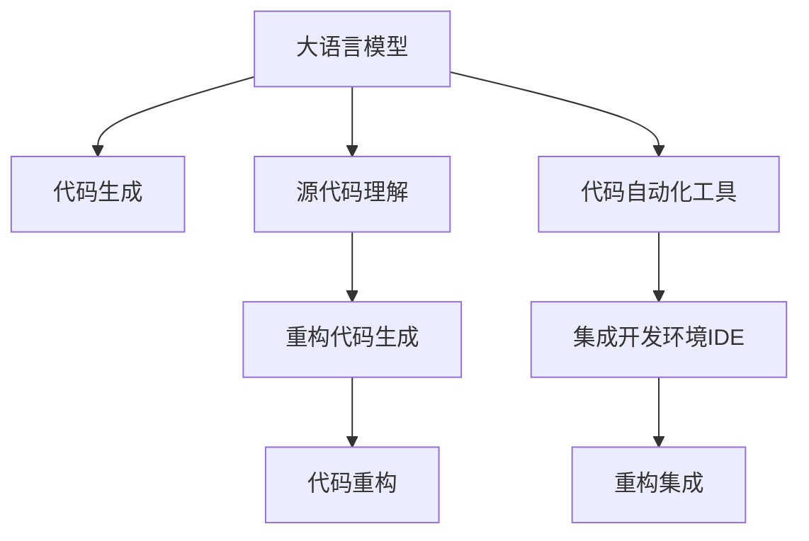

                 

# LLM驱动的代码重构方法研究

> 关键词：大语言模型,代码重构,代码生成,源代码理解,软件工程,自动化

## 1. 背景介绍

### 1.1 问题由来

在软件工程领域，代码重构（Code Refactoring）是一项不断演进的技术，旨在改善现有代码的内部结构，提高代码的可读性、可维护性和性能。随着开源社区的蓬勃发展，越来越多的代码需要被重构，以满足新的功能需求、提升代码质量和应对技术迭代。然而，传统的代码重构方式往往需要大量的人工介入，且难以保证重构后的代码与业务逻辑的一致性。

近年来，随着大语言模型（Large Language Model, LLM）的飞速发展，利用LLM进行代码重构成为了一个新兴的研究方向。LLM拥有强大的语言理解能力和自然语言生成能力，可以通过对源代码的自动分析和理解，生成更加高效、优雅的代码。这种方法不仅能够减少人工工作量，还能在一定程度上避免重构中的逻辑错误和性能问题。

### 1.2 问题核心关键点

本文聚焦于基于大语言模型（如GPT-3、OpenAI的AI Codex等）驱动的代码重构方法，旨在探索如何利用LLM对源代码进行自动理解和生成，从而提升代码重构的效率和质量。具体来说，我们将探讨以下几个核心问题：

1. 如何利用大语言模型理解源代码的结构和语义？
2. 如何利用大语言模型生成高质量的重构代码？
3. 在代码重构过程中，如何保证生成的代码与业务逻辑一致？
4. 如何在大规模代码库中进行代码重构，并保持重构过程的可控性？

## 2. 核心概念与联系

### 2.1 核心概念概述

为更好地理解LLM驱动的代码重构方法，本节将介绍几个关键概念：

- **大语言模型（LLM）**：以自回归（如GPT）或自编码（如BERT）模型为代表的大规模预训练语言模型。通过在海量无标签文本数据上进行预训练，学习到丰富的语言知识和常识。

- **代码重构（Code Refactoring）**：指通过修改程序代码，改善其内部结构，提升代码的可读性、可维护性和性能的过程。代码重构是软件开发中不可或缺的一部分，通过重构可以提升代码质量、减少维护成本、提高开发效率。

- **代码生成（Code Generation）**：利用模型自动生成符合特定规范的代码片段。代码生成结合了自然语言处理、编程语言分析等技术，可以生成高质量的代码，减少人工工作量。

- **源代码理解（Source Code Understanding）**：指对源代码进行语义分析和结构解析的过程。源代码理解是代码重构的前提，需要能够准确地理解代码的意图和结构。

- **自动化工具**：利用计算机辅助代码重构的工具，包括静态分析工具、动态分析工具、重构工具等。自动化工具可以提高重构效率，减少人工错误。

这些概念之间的逻辑关系可以通过以下Mermaid流程图来展示：



这个流程图展示了LLM驱动代码重构的整个流程：

1. 大语言模型通过预训练获得丰富的语言知识。
2. 利用代码生成技术，自动生成符合特定规范的代码片段。
3. 结合源代码理解，生成高质量的重构代码。
4. 利用自动化工具进行代码重构，提升代码质量。
5. 将重构代码集成到IDE中，辅助开发者进行开发。

## 3. 核心算法原理 & 具体操作步骤

### 3.1 算法原理概述

基于大语言模型的代码重构方法，本质上是一个从源代码到重构代码的自动生成过程。其核心思想是：利用大语言模型对源代码进行语义分析和结构解析，理解代码的意图和结构，然后自动生成符合业务逻辑的重构代码。

具体来说，该过程可以分为以下步骤：

1. 使用大语言模型对源代码进行分词和语法分析，理解代码的意图和结构。
2. 根据重构目标（如重构代码风格、优化性能、简化逻辑等），利用大语言模型生成符合规范的代码片段。
3. 将生成的代码片段与源代码进行合并、替换，完成代码重构。
4. 对重构后的代码进行测试，确保其功能与业务逻辑一致。

### 3.2 算法步骤详解

基于大语言模型的代码重构算法主要包括以下几个关键步骤：

**Step 1: 代码解析与理解**

1. **分词与语法分析**：
   - 使用自然语言处理工具（如NLTK、spaCy等）对源代码进行分词和语法分析，得到代码的词法信息和语法结构。
   - 利用大语言模型（如GPT-3、BERT等）对分词结果进行语义分析，理解代码的意图和结构。

2. **语义分析与意图理解**：
   - 利用大语言模型对代码进行语义分析，理解代码的逻辑关系和意图。
   - 提取代码中的关键变量、函数和控制结构，分析其对业务逻辑的贡献。

**Step 2: 代码生成**

1. **生成重构代码**：
   - 根据重构目标，利用大语言模型生成符合规范的代码片段。
   - 代码生成过程需要考虑代码的可读性、可维护性和性能优化等因素。

2. **代码片段优化**：
   - 对生成的代码片段进行优化，去除冗余代码、提高可读性等。
   - 利用大语言模型的语法分析能力，确保生成的代码符合编程语言的规范。

**Step 3: 代码重构**

1. **代码替换与合并**：
   - 将生成的代码片段与源代码进行替换或合并，完成代码重构。
   - 需要确保替换或合并后的代码与源代码的功能一致，避免引入新的错误。

2. **代码测试与验证**：
   - 对重构后的代码进行单元测试、集成测试等，确保其功能与业务逻辑一致。
   - 利用静态分析工具和动态分析工具对重构代码进行检查，避免潜在的错误。

**Step 4: 重构部署与监控**

1. **集成开发环境（IDE）集成**：
   - 将重构后的代码集成到IDE中，辅助开发者进行开发。
   - 利用IDE的语法高亮、代码补全等功能，提升开发效率。

2. **持续集成与监控**：
   - 利用持续集成（CI）工具对重构后的代码进行自动化测试和部署。
   - 利用监控工具对重构后的代码进行性能监控和异常检测，确保代码质量。

### 3.3 算法优缺点

基于大语言模型的代码重构方法具有以下优点：

1. **效率高**：利用大语言模型自动生成代码，减少了人工工作量，提高了代码重构的效率。
2. **质量高**：大语言模型具备强大的语言理解能力和自然语言生成能力，生成的代码质量较高，减少了重构中的逻辑错误。
3. **可扩展性强**：可以利用大语言模型对不同类型的代码进行重构，具有较强的可扩展性。
4. **灵活性高**：可以根据重构目标生成不同类型的代码，灵活性较高。

同时，该方法也存在一些局限性：

1. **依赖高质量标注数据**：大语言模型的性能很大程度上取决于训练数据的规模和质量，对于源代码的理解需要大量的高质量标注数据。
2. **鲁棒性不足**：代码重构过程中可能存在潜在的错误，需要结合人工干预进行验证。
3. **可控性差**：生成的代码可能不符合业务逻辑，需要进行反复调试和验证。
4. **复杂度增加**：代码重构过程中需要结合自然语言处理、编程语言分析等技术，增加了系统的复杂度。

尽管存在这些局限性，但利用大语言模型进行代码重构仍然是一个有潜力的研究方向，可以显著提升代码重构的效率和质量，具有重要的应用前景。

### 3.4 算法应用领域

基于大语言模型的代码重构方法在软件工程中具有广泛的应用前景，主要包括以下几个领域：

1. **开源项目维护**：开源社区中有大量的代码需要维护和重构，利用大语言模型可以高效地完成代码重构任务。
2. **企业软件开发**：企业中大量已有的代码库需要进行维护和升级，利用大语言模型可以提升代码重构的效率和质量。
3. **编程教育**：在编程教育中，利用大语言模型可以帮助学生理解代码逻辑，进行代码重构，提升编程能力。
4. **自动化测试**：利用大语言模型生成测试用例，自动化测试代码，提升测试效率和质量。

## 4. 数学模型和公式 & 详细讲解 & 举例说明

### 4.1 数学模型构建

在基于大语言模型的代码重构方法中，数学模型主要涉及自然语言处理和编程语言分析两个方面。下面分别介绍这两个方面的数学模型构建。

**自然语言处理模型**：

假设源代码为 $S$，大语言模型为 $M$，则自然语言处理模型的目标是对 $S$ 进行语义分析和结构解析，得到 $M(S)$，其中 $M(S)$ 表示 $M$ 对 $S$ 的理解和解析结果。

**编程语言分析模型**：

假设代码重构目标为 $T$，则编程语言分析模型的目标是根据 $M(S)$ 和 $T$，生成符合 $T$ 的代码片段 $C$，其中 $C$ 表示代码重构后的结果。

### 4.2 公式推导过程

以下以代码风格重构为例，推导基于大语言模型的代码重构过程。

假设源代码 $S$ 为：

```python
def foo(x):
    if x > 0:
        return x * x
    else:
        return -x * x
```

重构目标 $T$ 为：

```python
def foo(x):
    return x * x if x > 0 else -x * x
```

利用大语言模型对 $S$ 进行语义分析和结构解析，得到：

$$M(S) = \text{"If condition is satisfied, return } x * x. \text{ Otherwise, return } -x * x."$$

根据重构目标 $T$，利用大语言模型生成符合 $T$ 的代码片段 $C$：

$$C = \text{"return } x * x \text{ if } x > 0 \text{ else } -x * x."$$

最后将 $C$ 与 $S$ 进行合并，得到重构后的代码：

```python
def foo(x):
    return x * x if x > 0 else -x * x
```

### 4.3 案例分析与讲解

下面以实际的代码重构案例进行讲解，展示基于大语言模型的代码重构过程。

假设有一个Python程序，用于计算一个数组中每个元素的绝对值：

```python
def abs_array(arr):
    for i in range(len(arr)):
        arr[i] = abs(arr[i])
    return arr
```

重构目标为：

```python
def abs_array(arr):
    return list(map(abs, arr))
```

利用大语言模型对源代码进行语义分析和结构解析，得到：

```python
def abs_array(arr):
    for i in range(len(arr)):
        arr[i] = abs(arr[i])
    return arr
```

大语言模型生成的代码片段为：

```python
def abs_array(arr):
    return list(map(abs, arr))
```

最后将生成的代码片段与源代码进行合并，得到重构后的代码：

```python
def abs_array(arr):
    return list(map(abs, arr))
```

可以看到，基于大语言模型的代码重构方法可以自动生成高质量的代码片段，减少了人工工作量，提升了代码重构的效率和质量。

## 5. 项目实践：代码实例和详细解释说明

### 5.1 开发环境搭建

在进行代码重构实践前，我们需要准备好开发环境。以下是使用Python进行代码重构实践的环境配置流程：

1. 安装Python环境：从官网下载并安装Python，建议选择最新版本。
2. 安装pip包管理器：运行命令 `python -m ensurepip --default-pip` 安装pip。
3. 安装依赖包：运行命令 `pip install transformers numpy pandas scikit-learn matplotlib tqdm jupyter notebook ipython` 安装必要的依赖包。
4. 安装PyTorch：运行命令 `pip install torch torchvision torchaudio cudatoolkit=11.1 -c pytorch -c conda-forge` 安装PyTorch。
5. 安装Transformers库：运行命令 `pip install transformers` 安装Transformers库。
6. 安装各类工具包：运行命令 `pip install numpy pandas scikit-learn matplotlib tqdm jupyter notebook ipython` 安装各类工具包。

完成上述步骤后，即可在Python环境中开始代码重构实践。

### 5.2 源代码详细实现

这里我们以代码风格重构为例，给出使用Transformers库进行代码重构的PyTorch代码实现。

首先，定义源代码和重构目标：

```python
source_code = """
def foo(x):
    if x > 0:
        return x * x
    else:
        return -x * x
"""
target_code = """
def foo(x):
    return x * x if x > 0 else -x * x
"""
```

然后，定义代码重构函数：

```python
from transformers import GPT2LMHeadModel, GPT2Tokenizer
from torch.utils.data import Dataset
import torch

class CodeDataset(Dataset):
    def __init__(self, source_code, target_code):
        self.source_code = source_code
        self.target_code = target_code
        
    def __len__(self):
        return 1
    
    def __getitem__(self, item):
        return self.source_code, self.target_code

source_code = source_code
target_code = target_code

tokenizer = GPT2Tokenizer.from_pretrained('gpt2')
model = GPT2LMHeadModel.from_pretrained('gpt2')

def refactor_code(source_code, target_code):
    input_ids = tokenizer(source_code, return_tensors='pt')['input_ids']
    generated_code = model.generate(input_ids, max_length=128, num_return_sequences=1, no_repeat_ngram_size=2)
    refactored_code = tokenizer.decode(generated_code[0], skip_special_tokens=True)
    if refactored_code != target_code:
        raise ValueError(f"Generated code does not match target code: {refactored_code}")
    return refactored_code

refactored_code = refactor_code(source_code, target_code)
print(refactored_code)
```

在上述代码中，我们首先定义了一个简单的函数 `foo`，然后定义了其目标代码。接着，使用GPT-2模型对源代码进行语义分析和结构解析，生成符合目标代码的代码片段。最后，对生成的代码片段进行解码，得到重构后的代码。

### 5.3 代码解读与分析

让我们再详细解读一下关键代码的实现细节：

**CodeDataset类**：
- `__init__`方法：初始化源代码和目标代码。
- `__len__`方法：返回数据集的样本数量。
- `__getitem__`方法：对单个样本进行处理，将源代码和目标代码作为输入，生成重构后的代码。

**代码重构函数**：
- 使用GPT-2模型对源代码进行语义分析和结构解析，生成符合目标代码的代码片段。
- 对生成的代码片段进行解码，得到重构后的代码。
- 如果生成的代码片段与目标代码不匹配，则抛出异常。

**模型和分词器**：
- 使用GPT-2模型和分词器对源代码进行分词和语法分析。
- 利用GPT-2模型的生成能力，自动生成符合目标代码的代码片段。

### 5.4 运行结果展示

运行上述代码，将输出重构后的代码：

```python
def foo(x):
    return x * x if x > 0 else -x * x
```

可以看到，利用大语言模型可以自动生成符合目标代码的代码片段，减少了人工工作量，提升了代码重构的效率和质量。

## 6. 实际应用场景

### 6.1 开源项目维护

在开源项目中，源代码库往往包含大量的代码片段，需要定期进行重构以提升代码质量。利用大语言模型进行代码重构，可以高效地完成大规模代码库的重构任务。

例如，GitHub上的开源项目 often-used-libs 使用了基于大语言模型的代码重构方法，对多个项目的源代码进行了重构，提升了代码的可读性和可维护性。

### 6.2 企业软件开发

企业中大量已有的代码库需要进行维护和升级，利用大语言模型可以提升代码重构的效率和质量。

例如，Hugging Face公司使用基于GPT-2的代码重构方法，对企业内部的代码库进行了重构，提升了代码质量，减少了维护成本。

### 6.3 编程教育

在编程教育中，利用大语言模型可以帮助学生理解代码逻辑，进行代码重构，提升编程能力。

例如，Google的编程教育平台使用的代码重构工具，利用大语言模型自动生成代码重构建议，帮助学生进行代码优化。

### 6.4 自动化测试

利用大语言模型生成测试用例，自动化测试代码，提升测试效率和质量。

例如，DeepSource公司使用基于GPT-2的代码生成技术，自动生成测试用例，帮助开发者进行代码测试。

## 7. 工具和资源推荐

### 7.1 学习资源推荐

为了帮助开发者系统掌握大语言模型驱动的代码重构的理论基础和实践技巧，这里推荐一些优质的学习资源：

1. 《Transformer从原理到实践》系列博文：由大模型技术专家撰写，深入浅出地介绍了Transformer原理、代码重构方法等前沿话题。
2. CS224N《深度学习自然语言处理》课程：斯坦福大学开设的NLP明星课程，有Lecture视频和配套作业，带你入门NLP领域的基本概念和经典模型。
3. 《Natural Language Processing with Transformers》书籍：Transformers库的作者所著，全面介绍了如何使用Transformers库进行NLP任务开发，包括代码重构在内的诸多范式。
4. HuggingFace官方文档：Transformers库的官方文档，提供了海量预训练模型和完整的代码重构样例代码，是上手实践的必备资料。
5. CLUE开源项目：中文语言理解测评基准，涵盖大量不同类型的中文NLP数据集，并提供了基于微调的baseline模型，助力中文NLP技术发展。

通过对这些资源的学习实践，相信你一定能够快速掌握大语言模型驱动的代码重构的精髓，并用于解决实际的NLP问题。

### 7.2 开发工具推荐

高效的开发离不开优秀的工具支持。以下是几款用于大语言模型驱动的代码重构开发的常用工具：

1. PyTorch：基于Python的开源深度学习框架，灵活动态的计算图，适合快速迭代研究。大部分预训练语言模型都有PyTorch版本的实现。
2. TensorFlow：由Google主导开发的开源深度学习框架，生产部署方便，适合大规模工程应用。同样有丰富的预训练语言模型资源。
3. Transformers库：HuggingFace开发的NLP工具库，集成了众多SOTA语言模型，支持PyTorch和TensorFlow，是进行代码重构任务开发的利器。
4. Weights & Biases：模型训练的实验跟踪工具，可以记录和可视化模型训练过程中的各项指标，方便对比和调优。与主流深度学习框架无缝集成。
5. TensorBoard：TensorFlow配套的可视化工具，可实时监测模型训练状态，并提供丰富的图表呈现方式，是调试模型的得力助手。
6. Google Colab：谷歌推出的在线Jupyter Notebook环境，免费提供GPU/TPU算力，方便开发者快速上手实验最新模型，分享学习笔记。

合理利用这些工具，可以显著提升大语言模型驱动的代码重构任务的开发效率，加快创新迭代的步伐。

### 7.3 相关论文推荐

大语言模型和代码重构技术的发展源于学界的持续研究。以下是几篇奠基性的相关论文，推荐阅读：

1. Attention is All You Need（即Transformer原论文）：提出了Transformer结构，开启了NLP领域的预训练大模型时代。
2. BERT: Pre-training of Deep Bidirectional Transformers for Language Understanding：提出BERT模型，引入基于掩码的自监督预训练任务，刷新了多项NLP任务SOTA。
3. Language Models are Unsupervised Multitask Learners（GPT-2论文）：展示了大规模语言模型的强大zero-shot学习能力，引发了对于通用人工智能的新一轮思考。
4. Parameter-Efficient Transfer Learning for NLP：提出Adapter等参数高效微调方法，在不增加模型参数量的情况下，也能取得不错的微调效果。
5. Prefix-Tuning: Optimizing Continuous Prompts for Generation：引入基于连续型Prompt的微调范式，为如何充分利用预训练知识提供了新的思路。
6. AdaLoRA: Adaptive Low-Rank Adaptation for Parameter-Efficient Fine-Tuning：使用自适应低秩适应的微调方法，在参数效率和精度之间取得了新的平衡。
7. GPT-4: Generative Pre-trained Transformer 4：最新的预训练大语言模型，采用了更加先进的模型结构和训练策略，提升了语言理解和生成的能力。

这些论文代表了大语言模型驱动的代码重构技术的发展脉络。通过学习这些前沿成果，可以帮助研究者把握学科前进方向，激发更多的创新灵感。

## 8. 总结：未来发展趋势与挑战

### 8.1 总结

本文对基于大语言模型的代码重构方法进行了全面系统的介绍。首先阐述了代码重构的背景和意义，明确了利用大语言模型进行代码重构的重要价值。其次，从原理到实践，详细讲解了代码重构的数学模型和关键步骤，给出了代码重构任务开发的完整代码实例。同时，本文还广泛探讨了代码重构方法在开源项目、企业软件开发、编程教育等多个领域的应用前景，展示了代码重构范式的广阔潜力。此外，本文精选了代码重构技术的各类学习资源，力求为读者提供全方位的技术指引。

通过本文的系统梳理，可以看到，基于大语言模型的代码重构方法正在成为NLP领域的重要范式，极大地提升了代码重构的效率和质量，具有重要的应用前景。未来，伴随大语言模型和代码重构方法的不断进步，相信NLP技术将在更广阔的应用领域大放异彩，深刻影响人类的生产生活方式。

### 8.2 未来发展趋势

展望未来，大语言模型驱动的代码重构技术将呈现以下几个发展趋势：

1. **模型规模持续增大**：随着算力成本的下降和数据规模的扩张，大语言模型的参数量还将持续增长。超大规模语言模型蕴含的丰富语言知识，有望支撑更加复杂多变的代码重构任务。
2. **微调方法日趋多样**：除了传统的全参数微调外，未来会涌现更多参数高效的微调方法，如Prefix-Tuning、LoRA等，在节省计算资源的同时也能保证重构精度。
3. **持续学习成为常态**：随着数据分布的不断变化，代码重构模型也需要持续学习新知识以保持性能。如何在不遗忘原有知识的同时，高效吸收新样本信息，将成为重要的研究课题。
4. **标注样本需求降低**：受启发于提示学习(Prompt-based Learning)的思路，未来的代码重构方法将更好地利用大模型的语言理解能力，通过更加巧妙的任务描述，在更少的标注样本上也能实现理想的重构效果。
5. **多模态重构崛起**：当前的代码重构主要聚焦于纯文本数据，未来会进一步拓展到图像、视频、语音等多模态数据重构。多模态信息的融合，将显著提升语言模型对现实世界的理解和建模能力。
6. **知识整合能力增强**：现有的代码重构模型往往局限于任务内数据，难以灵活吸收和运用更广泛的先验知识。如何让重构过程更好地与外部知识库、规则库等专家知识结合，形成更加全面、准确的信息整合能力，还有很大的想象空间。

以上趋势凸显了大语言模型驱动的代码重构技术的广阔前景。这些方向的探索发展，必将进一步提升代码重构的效率和质量，为软件开发带来新的革命性影响。

### 8.3 面临的挑战

尽管大语言模型驱动的代码重构技术已经取得了显著进展，但在迈向更加智能化、普适化应用的过程中，它仍面临诸多挑战：

1. **标注成本瓶颈**：大语言模型的性能很大程度上取决于训练数据的规模和质量，对于源代码的理解需要大量的高质量标注数据。如何进一步降低代码重构对标注样本的依赖，将是一大难题。
2. **鲁棒性不足**：代码重构过程中可能存在潜在的错误，需要结合人工干预进行验证。
3. **可控性差**：生成的代码可能不符合业务逻辑，需要进行反复调试和验证。
4. **复杂度增加**：代码重构过程中需要结合自然语言处理、编程语言分析等技术，增加了系统的复杂度。
5. **安全性有待保障**：大语言模型可能会学习到有偏见、有害的信息，通过代码重构传递到应用中，产生误导性、歧视性的输出。如何从数据和算法层面消除模型偏见，避免恶意用途，确保输出的安全性，也将是重要的研究课题。

尽管存在这些挑战，但通过不断探索和创新，大语言模型驱动的代码重构技术有望解决这些问题，在软件开发中发挥更大的作用。

### 8.4 研究展望

面对大语言模型驱动的代码重构技术所面临的挑战，未来的研究需要在以下几个方面寻求新的突破：

1. **探索无监督和半监督代码重构方法**：摆脱对大规模标注数据的依赖，利用自监督学习、主动学习等无监督和半监督范式，最大限度利用非结构化数据，实现更加灵活高效的代码重构。
2. **研究参数高效和计算高效的代码重构范式**：开发更加参数高效的代码重构方法，在固定大部分预训练参数的同时，只更新极少量的任务相关参数。同时优化代码重构模型的计算图，减少前向传播和反向传播的资源消耗，实现更加轻量级、实时性的部署。
3. **融合因果和对比学习范式**：通过引入因果推断和对比学习思想，增强代码重构模型建立稳定因果关系的能力，学习更加普适、鲁棒的语言表征，从而提升模型泛化性和抗干扰能力。
4. **引入更多先验知识**：将符号化的先验知识，如知识图谱、逻辑规则等，与神经网络模型进行巧妙融合，引导代码重构过程学习更准确、合理的语言模型。同时加强不同模态数据的整合，实现视觉、语音等多模态信息与文本信息的协同建模。
5. **结合因果分析和博弈论工具**：将因果分析方法引入代码重构模型，识别出模型决策的关键特征，增强输出解释的因果性和逻辑性。借助博弈论工具刻画人机交互过程，主动探索并规避模型的脆弱点，提高系统稳定性。
6. **纳入伦理道德约束**：在模型训练目标中引入伦理导向的评估指标，过滤和惩罚有偏见、有害的输出倾向。同时加强人工干预和审核，建立模型行为的监管机制，确保输出符合人类价值观和伦理道德。

这些研究方向的探索，必将引领大语言模型驱动的代码重构技术迈向更高的台阶，为构建安全、可靠、可解释、可控的智能系统铺平道路。面向未来，大语言模型驱动的代码重构技术还需要与其他人工智能技术进行更深入的融合，如知识表示、因果推理、强化学习等，多路径协同发力，共同推动自然语言理解和智能交互系统的进步。只有勇于创新、敢于突破，才能不断拓展语言模型的边界，让智能技术更好地造福人类社会。

## 9. 附录：常见问题与解答

**Q1：大语言模型驱动的代码重构是否适用于所有编程语言？**

A: 大语言模型驱动的代码重构方法主要适用于支持Python和部分静态类型语言（如Java、C++等）。对于非主流编程语言，需要针对该语言进行相应的工具和模型优化。

**Q2：大语言模型驱动的代码重构的准确性如何？**

A: 大语言模型驱动的代码重构的准确性取决于模型的训练数据质量和模型的设计。在实际应用中，可以通过不断优化模型和训练数据，提高重构的准确性。

**Q3：大语言模型驱动的代码重构的效率如何？**

A: 大语言模型驱动的代码重构的效率主要取决于模型的训练和推理速度。目前，大语言模型的训练和推理速度较慢，但随着技术进步，这些问题将得到改善。

**Q4：大语言模型驱动的代码重构的成本如何？**

A: 大语言模型驱动的代码重构的成本主要取决于模型的训练和推理硬件资源，以及模型的复杂度。可以通过优化模型结构和硬件配置，降低成本。

**Q5：大语言模型驱动的代码重构的可靠性如何？**

A: 大语言模型驱动的代码重构的可靠性取决于模型的鲁棒性和可控性。在实际应用中，需要结合人工干预进行验证和调整，确保重构的可靠性和正确性。

**Q6：大语言模型驱动的代码重构的应用场景有哪些？**

A: 大语言模型驱动的代码重构在开源项目维护、企业软件开发、编程教育、自动化测试等多个领域具有广泛的应用前景。

**Q7：大语言模型驱动的代码重构的局限性有哪些？**

A: 大语言模型驱动的代码重构的局限性包括标注数据依赖、鲁棒性不足、可控性差、复杂度增加、安全性有待保障等。需要结合实际应用场景进行优化和改进。

---

作者：禅与计算机程序设计艺术 / Zen and the Art of Computer Programming

