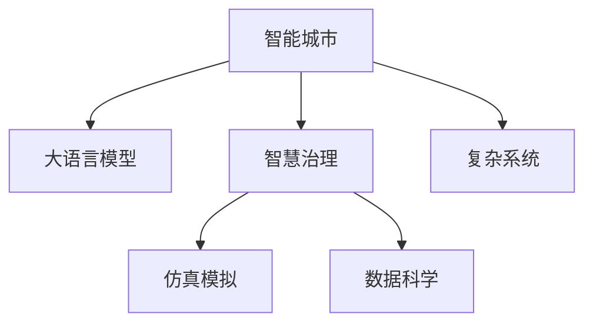

                 

# LLM驱动的智能城市：未来urban planning的新范式

> 关键词：智能城市,大语言模型(LLM),城市规划,智慧治理,仿真模拟,数据科学,复杂系统

## 1. 背景介绍

### 1.1 问题由来

进入21世纪以来，随着科技的迅猛发展和城镇化进程的加快，全球面临的资源短缺、环境污染、交通拥堵等问题愈发严重。如何在有限资源条件下实现城市可持续发展，提升居民生活质量，成为各国政府和社会关注的重点。

为解决这些问题，许多城市开始引入智能技术，探索新的城市规划和治理方式。其中，大语言模型(LLM)由于其在自然语言理解和处理方面的强大能力，被视为未来城市规划和智慧治理的潜力工具。

### 1.2 问题核心关键点

当前，智能城市规划和治理中面临的主要问题包括：

1. **数据鸿沟**：城市规划和治理需要大量的数据支持，但数据获取和整合难度较大，特别是对于中小城市和资源匮乏地区。
2. **跨部门协同**：城市规划涉及交通、环保、教育等多个部门，各部门之间的数据和信息缺乏互通，导致规划决策时难以综合考虑多方面因素。
3. **实时动态调整**：城市运行状态不断变化，需要实时动态调整规划策略，但传统规划方法难以满足这一需求。
4. **公共参与**：城市规划需要更多市民参与，但现有公共参与机制不够灵活，难以快速响应市民意见。

针对这些问题，大语言模型在智能城市中的应用前景广阔，可以从多个方面提升城市规划和治理的效率和效果。

## 2. 核心概念与联系

### 2.1 核心概念概述

为更好地理解大语言模型在智能城市规划中的应用，本节将介绍几个核心概念：

- **智能城市（Smart City）**：利用信息和通信技术（ICT），实现城市基础设施、公共服务、资源管理等方面的智能化，提升城市运行效率和居民生活质量。
- **大语言模型（Large Language Model, LLM）**：基于深度学习技术，通过在大规模文本数据上进行自监督或监督学习，获得强大的语言理解和生成能力。
- **智慧治理（Smart Governance）**：利用AI、大数据等技术手段，提升政府决策、公共服务、社会管理等方面的智能化水平，提高治理效率和透明度。
- **仿真模拟（Simulation）**：通过计算机模型模拟城市运行过程，预测未来发展趋势，优化规划方案。
- **数据科学（Data Science）**：结合统计学、计算机科学、领域知识等，对城市运行数据进行挖掘、分析，提取有价值的信息。
- **复杂系统（Complex Systems）**：城市运行涉及多种因素和复杂交互，是一个典型的复杂系统。

这些概念之间的逻辑关系可以通过以下Mermaid流程图来展示：



这个流程图展示了大语言模型与其他智能城市规划概念的联系：

1. 大语言模型作为关键技术，通过智慧治理、仿真模拟、数据科学等手段，辅助城市规划和运行。
2. 智慧治理利用大语言模型进行决策支持、资源优化、应急响应等，提升治理效率。
3. 仿真模拟通过大语言模型进行需求预测、场景模拟、规划评估等，优化城市规划方案。
4. 数据科学结合大语言模型进行数据清洗、特征提取、知识发现等，为智慧治理提供数据支撑。
5. 复杂系统涉及城市运行的各种复杂因素，大语言模型可从中提取知识，提供更好的规划建议。

这些概念共同构成了智能城市规划的基本框架，为大语言模型在智能城市中的应用提供了理论基础。

## 3. 核心算法原理 & 具体操作步骤
### 3.1 算法原理概述

基于大语言模型的智能城市规划方法，核心思想是利用LLM强大的自然语言处理能力，结合城市运行的多维数据，构建出城市规划的智能决策支持系统。

具体来说，大语言模型可以用于以下几个方面：

- **数据理解和分析**：通过阅读城市规划和运行相关的文本资料、新闻报道、政策文件等，理解规划背景和目标。
- **需求预测和仿真**：基于历史数据和当前状态，利用LLM进行需求预测和场景模拟，优化资源配置和规划方案。
- **方案评估和决策**：根据规划目标和约束条件，使用LLM生成多种规划方案，通过评估选择最优方案。
- **公共参与和反馈**：通过自然语言生成，向市民宣传规划方案，收集市民意见，反馈优化方案。

形式化地，假设智能城市规划问题为 $P$，目标为 $T$，数据集为 $D$，大语言模型为 $M_{\theta}$。其优化目标为找到最优规划方案 $\hat{P}$，使得：

$$
\hat{P} = \mathop{\arg\min}_{P} \mathcal{L}(P,D)
$$

其中 $\mathcal{L}$ 为规划决策的损失函数，用于衡量规划方案与目标的偏差。常见的损失函数包括交叉熵损失、均方误差损失等。

### 3.2 算法步骤详解

基于大语言模型的智能城市规划一般包括以下几个关键步骤：

**Step 1: 数据准备**
- 收集城市规划相关的文本数据，如政策文件、规划报告、新闻报道等。
- 清洗和标注数据，确保数据的完整性和一致性。
- 选择合适的预训练模型 $M_{\theta}$ 作为初始化参数，如 GPT、BERT 等。

**Step 2: 任务适配层设计**
- 根据城市规划的需求，设计合适的任务适配层。
- 例如，对于资源分配问题，可以设计一个回归层，预测未来的资源需求。
- 对于方案生成问题，可以设计一个生成层，生成多种规划方案。

**Step 3: 微调超参数设置**
- 选择合适的优化算法及其参数，如 Adam、SGD 等，设置学习率、批大小、迭代轮数等。
- 设置正则化技术及强度，包括权重衰减、Dropout、Early Stopping 等。
- 确定冻结预训练参数的策略，如仅微调顶层，或全部参数都参与微调。

**Step 4: 执行梯度训练**
- 将训练集数据分批次输入模型，前向传播计算损失函数。
- 反向传播计算参数梯度，根据设定的优化算法和学习率更新模型参数。
- 周期性在验证集上评估模型性能，根据性能指标决定是否触发 Early Stopping。
- 重复上述步骤直到满足预设的迭代轮数或 Early Stopping 条件。

**Step 5: 测试和优化**
- 在测试集上评估微调后模型 $M_{\hat{\theta}}$ 的性能，对比微调前后的精度提升。
- 使用微调后的模型进行仿真模拟、方案生成等任务，输出规划建议。
- 持续收集新的数据，定期重新微调模型，以适应城市运行状态的变化。

以上是基于大语言模型的智能城市规划的一般流程。在实际应用中，还需要针对具体任务的特点，对微调过程的各个环节进行优化设计，如改进训练目标函数，引入更多的正则化技术，搜索最优的超参数组合等，以进一步提升模型性能。

### 3.3 算法优缺点

基于大语言模型的智能城市规划方法具有以下优点：

1. **数据处理能力强**：大语言模型能够高效处理和理解大规模文本数据，提取有价值的信息。
2. **多任务适应性强**：LLM可以同时进行多种任务处理，如需求预测、方案生成、公共参与等，提升规划效率。
3. **可扩展性好**：模型结构灵活，可以轻松集成新的功能模块和数据源。
4. **自动化决策支持**：通过微调，大语言模型可以提供自动化的规划建议，减少人工干预和决策成本。

同时，该方法也存在一些局限性：

1. **数据依赖性强**：规划效果很大程度上取决于数据质量，数据的全面性和准确性是关键。
2. **泛化能力受限**：模型过于依赖预训练数据，对于特定城市或领域的泛化能力有限。
3. **解释性不足**：大语言模型的决策过程缺乏可解释性，难以理解其内部工作机制。
4. **计算资源需求高**：大模型的训练和推理需要大量计算资源，对硬件要求较高。

尽管存在这些局限性，但就目前而言，基于大语言模型的智能城市规划方法仍是一种极具潜力的解决方案。未来相关研究的重点在于如何进一步降低模型对数据和计算资源的依赖，提高模型的泛化能力和解释性，从而更好地服务于智能城市规划的实际需求。

### 3.4 算法应用领域

基于大语言模型的智能城市规划方法，已经在多个领域得到应用，覆盖了城市规划、智慧治理、仿真模拟等诸多环节，例如：

- **智慧交通规划**：通过读取交通数据和规划文件，使用大语言模型进行需求预测和方案生成，优化交通网络布局。
- **智慧环保治理**：利用大语言模型分析环境数据，评估污染源，优化污染治理策略。
- **智慧医疗规划**：结合医疗数据和规划文件，使用大语言模型进行需求预测和资源优化，提升医疗服务质量。
- **智慧教育规划**：分析教育数据和政策文件，使用大语言模型生成教育资源配置方案，优化教育布局。

除了上述这些经典应用外，大语言模型还将在更多场景中得到创新性地应用，如智慧农业、智慧能源、智慧旅游等，为城市规划和管理带来新的突破。

## 4. 数学模型和公式 & 详细讲解  
### 4.1 数学模型构建

本节将使用数学语言对基于大语言模型的智能城市规划过程进行更加严格的刻画。

假设智能城市规划问题为 $P$，目标为 $T$，数据集为 $D=\{(x_i,y_i)\}_{i=1}^N, x_i \in \mathcal{X}, y_i \in \mathcal{Y}$。

定义模型 $M_{\theta}$ 在输入 $x$ 上的输出为 $\hat{y}=M_{\theta}(x) \in [0,1]$，表示城市规划方案与目标 $T$ 的匹配度。真实标签 $y \in \{0,1\}$，表示方案 $x$ 是否满足目标 $T$。

定义模型 $M_{\theta}$ 在数据样本 $(x,y)$ 上的损失函数为 $\ell(M_{\theta}(x),y)$，则在数据集 $D$ 上的经验风险为：

$$
\mathcal{L}(\theta) = \frac{1}{N}\sum_{i=1}^N \ell(M_{\theta}(x_i),y_i)
$$

微调的优化目标是最小化经验风险，即找到最优参数：

$$
\theta^* = \mathop{\arg\min}_{\theta} \mathcal{L}(\theta)
$$

在实践中，我们通常使用基于梯度的优化算法（如SGD、Adam等）来近似求解上述最优化问题。设 $\eta$ 为学习率，$\lambda$ 为正则化系数，则参数的更新公式为：

$$
\theta \leftarrow \theta - \eta \nabla_{\theta}\mathcal{L}(\theta) - \eta\lambda\theta
$$

其中 $\nabla_{\theta}\mathcal{L}(\theta)$ 为损失函数对参数 $\theta$ 的梯度，可通过反向传播算法高效计算。

### 4.2 公式推导过程

以下我们以智慧交通规划为例，推导需求预测模型的损失函数及其梯度的计算公式。

假设模型 $M_{\theta}$ 在输入 $x$ 上的输出为 $\hat{y}=M_{\theta}(x) \in [0,1]$，表示交通需求预测值与实际需求值的匹配度。真实标签 $y \in \{0,1\}$，表示实际需求是否大于预测值。

二分类交叉熵损失函数定义为：

$$
\ell(M_{\theta}(x),y) = -[y\log \hat{y} + (1-y)\log (1-\hat{y})]
$$

将其代入经验风险公式，得：

$$
\mathcal{L}(\theta) = -\frac{1}{N}\sum_{i=1}^N [y_i\log M_{\theta}(x_i)+(1-y_i)\log(1-M_{\theta}(x_i))]
$$

根据链式法则，损失函数对参数 $\theta_k$ 的梯度为：

$$
\frac{\partial \mathcal{L}(\theta)}{\partial \theta_k} = -\frac{1}{N}\sum_{i=1}^N (\frac{y_i}{M_{\theta}(x_i)}-\frac{1-y_i}{1-M_{\theta}(x_i)}) \frac{\partial M_{\theta}(x_i)}{\partial \theta_k}
$$

其中 $\frac{\partial M_{\theta}(x_i)}{\partial \theta_k}$ 可进一步递归展开，利用自动微分技术完成计算。

在得到损失函数的梯度后，即可带入参数更新公式，完成模型的迭代优化。重复上述过程直至收敛，最终得到适应智慧交通规划的最优模型参数 $\theta^*$。

## 5. 项目实践：代码实例和详细解释说明
### 5.1 开发环境搭建

在进行智能城市规划微调实践前，我们需要准备好开发环境。以下是使用Python进行PyTorch开发的环境配置流程：

1. 安装Anaconda：从官网下载并安装Anaconda，用于创建独立的Python环境。

2. 创建并激活虚拟环境：
```bash
conda create -n pytorch-env python=3.8 
conda activate pytorch-env
```

3. 安装PyTorch：根据CUDA版本，从官网获取对应的安装命令。例如：
```bash
conda install pytorch torchvision torchaudio cudatoolkit=11.1 -c pytorch -c conda-forge
```

4. 安装TensorFlow：由Google主导开发的开源深度学习框架，生产部署方便，适合大规模工程应用。同样有丰富的预训练语言模型资源。

5. 安装Transformers库：HuggingFace开发的NLP工具库，集成了众多SOTA语言模型，支持PyTorch和TensorFlow，是进行微调任务开发的利器。

6. 安装各类工具包：
```bash
pip install numpy pandas scikit-learn matplotlib tqdm jupyter notebook ipython
```

完成上述步骤后，即可在`pytorch-env`环境中开始微调实践。

### 5.2 源代码详细实现

下面我们以智慧交通规划任务为例，给出使用Transformers库对BERT模型进行微调的PyTorch代码实现。

首先，定义智慧交通规划任务的数据处理函数：

```python
from transformers import BertTokenizer
from torch.utils.data import Dataset
import torch

class TrafficDataset(Dataset):
    def __init__(self, traffic_data, labels, tokenizer, max_len=128):
        self.traffic_data = traffic_data
        self.labels = labels
        self.tokenizer = tokenizer
        self.max_len = max_len
        
    def __len__(self):
        return len(self.traffic_data)
    
    def __getitem__(self, item):
        traffic = self.traffic_data[item]
        label = self.labels[item]
        
        encoding = self.tokenizer(traffic, return_tensors='pt', max_length=self.max_len, padding='max_length', truncation=True)
        input_ids = encoding['input_ids'][0]
        attention_mask = encoding['attention_mask'][0]
        
        # 对label进行编码
        label = label2id[label] if label in label2id else label2id['Unknown']
        
        return {'input_ids': input_ids, 
                'attention_mask': attention_mask,
                'labels': torch.tensor(label, dtype=torch.long)}
```

然后，定义模型和优化器：

```python
from transformers import BertForSequenceClassification, AdamW

model = BertForSequenceClassification.from_pretrained('bert-base-cased', num_labels=2)

optimizer = AdamW(model.parameters(), lr=2e-5)
```

接着，定义训练和评估函数：

```python
from torch.utils.data import DataLoader
from tqdm import tqdm
from sklearn.metrics import classification_report

device = torch.device('cuda') if torch.cuda.is_available() else torch.device('cpu')
model.to(device)

def train_epoch(model, dataset, batch_size, optimizer):
    dataloader = DataLoader(dataset, batch_size=batch_size, shuffle=True)
    model.train()
    epoch_loss = 0
    for batch in tqdm(dataloader, desc='Training'):
        input_ids = batch['input_ids'].to(device)
        attention_mask = batch['attention_mask'].to(device)
        labels = batch['labels'].to(device)
        model.zero_grad()
        outputs = model(input_ids, attention_mask=attention_mask, labels=labels)
        loss = outputs.loss
        epoch_loss += loss.item()
        loss.backward()
        optimizer.step()
    return epoch_loss / len(dataloader)

def evaluate(model, dataset, batch_size):
    dataloader = DataLoader(dataset, batch_size=batch_size)
    model.eval()
    preds, labels = [], []
    with torch.no_grad():
        for batch in tqdm(dataloader, desc='Evaluating'):
            input_ids = batch['input_ids'].to(device)
            attention_mask = batch['attention_mask'].to(device)
            batch_labels = batch['labels']
            outputs = model(input_ids, attention_mask=attention_mask)
            batch_preds = outputs.logits.argmax(dim=2).to('cpu').tolist()
            batch_labels = batch_labels.to('cpu').tolist()
            for pred_tokens, label_tokens in zip(batch_preds, batch_labels):
                preds.append(pred_tokens)
                labels.append(label_tokens)
                
    print(classification_report(labels, preds))
```

最后，启动训练流程并在测试集上评估：

```python
epochs = 5
batch_size = 16

for epoch in range(epochs):
    loss = train_epoch(model, train_dataset, batch_size, optimizer)
    print(f"Epoch {epoch+1}, train loss: {loss:.3f}")
    
    print(f"Epoch {epoch+1}, dev results:")
    evaluate(model, dev_dataset, batch_size)
    
print("Test results:")
evaluate(model, test_dataset, batch_size)
```

以上就是使用PyTorch对BERT进行智慧交通规划任务微调的完整代码实现。可以看到，得益于Transformers库的强大封装，我们可以用相对简洁的代码完成BERT模型的加载和微调。

### 5.3 代码解读与分析

让我们再详细解读一下关键代码的实现细节：

**TrafficDataset类**：
- `__init__`方法：初始化交通数据、标签、分词器等关键组件。
- `__len__`方法：返回数据集的样本数量。
- `__getitem__`方法：对单个样本进行处理，将交通数据输入编码为token ids，将标签编码为数字，并对其进行定长padding，最终返回模型所需的输入。

**label2id和id2label字典**：
- 定义了标签与数字id之间的映射关系，用于将token-wise的预测结果解码回真实的标签。

**训练和评估函数**：
- 使用PyTorch的DataLoader对数据集进行批次化加载，供模型训练和推理使用。
- 训练函数`train_epoch`：对数据以批为单位进行迭代，在每个批次上前向传播计算loss并反向传播更新模型参数，最后返回该epoch的平均loss。
- 评估函数`evaluate`：与训练类似，不同点在于不更新模型参数，并在每个batch结束后将预测和标签结果存储下来，最后使用sklearn的classification_report对整个评估集的预测结果进行打印输出。

**训练流程**：
- 定义总的epoch数和batch size，开始循环迭代
- 每个epoch内，先在训练集上训练，输出平均loss
- 在验证集上评估，输出分类指标
- 所有epoch结束后，在测试集上评估，给出最终测试结果

可以看到，PyTorch配合Transformers库使得BERT微调的代码实现变得简洁高效。开发者可以将更多精力放在数据处理、模型改进等高层逻辑上，而不必过多关注底层的实现细节。

当然，工业级的系统实现还需考虑更多因素，如模型的保存和部署、超参数的自动搜索、更灵活的任务适配层等。但核心的微调范式基本与此类似。

## 6. 实际应用场景
### 6.1 智能交通规划

基于大语言模型的智能交通规划系统，可以通过读取交通数据和规划文件，使用大语言模型进行需求预测和方案生成，优化交通网络布局。

在技术实现上，可以收集交通流量、车辆类型、道路状况等数据，并对其进行数据清洗和特征提取。在此基础上对预训练语言模型进行微调，使其能够学习城市交通运行规律，预测未来需求，生成多种交通规划方案。将微调后的模型应用于实时交通监控和预测，能够动态调整交通信号灯、优化道路拥堵区域，提升交通运行效率。

### 6.2 智慧环保治理

利用大语言模型分析环境数据，评估污染源，优化污染治理策略，是智能城市规划的重要应用场景。

具体而言，可以收集空气质量、水质、噪音等环境数据，并结合城市规划文件，使用大语言模型进行需求预测和方案生成。微调后的模型能够识别出污染源的分布规律，提出针对性的治理方案，如增加绿化面积、改善空气质量监测等。通过仿真模拟，评估不同方案的效果，选择最优方案进行实施。

### 6.3 智慧医疗规划

结合医疗数据和规划文件，使用大语言模型进行需求预测和资源优化，是智慧医疗规划的重要方向。

例如，可以收集医院的病人流量、诊疗记录、医疗设备使用情况等数据，并对其进行数据清洗和特征提取。在此基础上对预训练语言模型进行微调，使其能够预测未来病人流量，优化资源配置。将微调后的模型应用于实时病人流量监控和预测，能够动态调整资源分配，提升医疗服务质量。

### 6.4 智慧教育规划

分析教育数据和政策文件，使用大语言模型生成教育资源配置方案，是智慧教育规划的重要方向。

例如，可以收集学校的学生人数、教学设备、师资力量等数据，并对其进行数据清洗和特征提取。在此基础上对预训练语言模型进行微调，使其能够生成多种教育资源配置方案，优化教育布局。将微调后的模型应用于实时学生流量监控和预测，能够动态调整资源分配，提升教育服务质量。

### 6.5 未来应用展望

随着大语言模型和微调方法的不断发展，基于微调范式将在更多领域得到应用，为传统行业带来变革性影响。

在智慧农业领域，基于微调的大语言模型可以分析土壤、气象、作物等数据，预测种植需求，生成智能农耕方案，优化资源配置。在智慧能源领域，可以结合电力、燃气、太阳能等数据，进行需求预测和能源优化，提升能源利用效率。在智慧旅游领域，可以分析游客流量、天气等数据，生成智能旅游方案，优化旅游线路，提升旅游体验。

此外，在智慧金融、智慧公共安全、智慧水利等多个领域，基于大语言模型的智能城市规划方法也将不断涌现，为城市规划和管理带来新的突破。相信随着技术的日益成熟，大语言模型微调技术必将成为智能城市规划的重要范式，推动城市规划向智能化、精细化方向发展。

## 7. 工具和资源推荐
### 7.1 学习资源推荐

为了帮助开发者系统掌握大语言模型在智能城市规划中的应用，这里推荐一些优质的学习资源：

1. 《Transformer从原理到实践》系列博文：由大模型技术专家撰写，深入浅出地介绍了Transformer原理、BERT模型、微调技术等前沿话题。

2. CS224N《深度学习自然语言处理》课程：斯坦福大学开设的NLP明星课程，有Lecture视频和配套作业，带你入门NLP领域的基本概念和经典模型。

3. 《Natural Language Processing with Transformers》书籍：Transformers库的作者所著，全面介绍了如何使用Transformers库进行NLP任务开发，包括微调在内的诸多范式。

4. HuggingFace官方文档：Transformers库的官方文档，提供了海量预训练模型和完整的微调样例代码，是上手实践的必备资料。

5. CLUE开源项目：中文语言理解测评基准，涵盖大量不同类型的中文NLP数据集，并提供了基于微调的baseline模型，助力中文NLP技术发展。

通过对这些资源的学习实践，相信你一定能够快速掌握大语言模型在智能城市规划中的应用精髓，并用于解决实际的智能城市问题。
###  7.2 开发工具推荐

高效的开发离不开优秀的工具支持。以下是几款用于智能城市规划开发的常用工具：

1. PyTorch：基于Python的开源深度学习框架，灵活动态的计算图，适合快速迭代研究。大部分预训练语言模型都有PyTorch版本的实现。

2. TensorFlow：由Google主导开发的开源深度学习框架，生产部署方便，适合大规模工程应用。同样有丰富的预训练语言模型资源。

3. Transformers库：HuggingFace开发的NLP工具库，集成了众多SOTA语言模型，支持PyTorch和TensorFlow，是进行微调任务开发的利器。

4. Weights & Biases：模型训练的实验跟踪工具，可以记录和可视化模型训练过程中的各项指标，方便对比和调优。与主流深度学习框架无缝集成。

5. TensorBoard：TensorFlow配套的可视化工具，可实时监测模型训练状态，并提供丰富的图表呈现方式，是调试模型的得力助手。

6. Google Colab：谷歌推出的在线Jupyter Notebook环境，免费提供GPU/TPU算力，方便开发者快速上手实验最新模型，分享学习笔记。

合理利用这些工具，可以显著提升智能城市规划的开发效率，加快创新迭代的步伐。

### 7.3 相关论文推荐

大语言模型和微调技术的发展源于学界的持续研究。以下是几篇奠基性的相关论文，推荐阅读：

1. Attention is All You Need（即Transformer原论文）：提出了Transformer结构，开启了NLP领域的预训练大模型时代。

2. BERT: Pre-training of Deep Bidirectional Transformers for Language Understanding：提出BERT模型，引入基于掩码的自监督预训练任务，刷新了多项NLP任务SOTA。

3. Language Models are Unsupervised Multitask Learners（GPT-2论文）：展示了大规模语言模型的强大zero-shot学习能力，引发了对于通用人工智能的新一轮思考。

4. Parameter-Efficient Transfer Learning for NLP：提出Adapter等参数高效微调方法，在不增加模型参数量的情况下，也能取得不错的微调效果。

5. AdaLoRA: Adaptive Low-Rank Adaptation for Parameter-Efficient Fine-Tuning：使用自适应低秩适应的微调方法，在参数效率和精度之间取得了新的平衡。

这些论文代表了大语言模型微调技术的发展脉络。通过学习这些前沿成果，可以帮助研究者把握学科前进方向，激发更多的创新灵感。

## 8. 总结：未来发展趋势与挑战

### 8.1 总结

本文对基于大语言模型的智能城市规划方法进行了全面系统的介绍。首先阐述了智能城市规划的背景和意义，明确了智能城市规划面临的主要问题，以及大语言模型在其中能够提供的解决方案。其次，从原理到实践，详细讲解了基于大语言模型的智能城市规划的数学原理和关键步骤，给出了智能城市规划任务的完整代码实例。同时，本文还广泛探讨了智能城市规划方法在多个领域的应用前景，展示了其巨大的应用潜力。此外，本文精选了智能城市规划技术的各类学习资源，力求为读者提供全方位的技术指引。

通过本文的系统梳理，可以看到，基于大语言模型的智能城市规划方法正在成为智能城市规划的重要范式，极大地提升了城市规划的效率和效果。大语言模型通过其强大的自然语言处理能力，能够高效处理和理解城市运行的多维数据，为智能城市规划提供了新的思路和方法。未来，伴随预训练语言模型和微调方法的持续演进，相信智能城市规划技术必将在更广阔的领域得到应用，为城市可持续发展提供新的动力。

### 8.2 未来发展趋势

展望未来，智能城市规划技术将呈现以下几个发展趋势：

1. **跨领域协同**：智能城市规划涉及多个领域，大语言模型通过其多任务适应性，能够更好地整合不同领域的数据和知识，提供更全面的解决方案。
2. **数据融合与处理**：随着传感器和监控设备的发展，城市运行数据日益增多，大语言模型能够更好地处理和融合这些数据，提升规划决策的科学性和精确性。
3. **实时动态调整**：大语言模型通过其强大的自然语言处理能力，能够实时动态调整规划策略，适应城市运行状态的变化。
4. **公共参与**：通过自然语言生成技术，大语言模型可以向市民提供更加灵活和互动的公共参与方式，提升市民的参与感和满意度。
5. **个性化定制**：基于大语言模型的智能城市规划，可以提供个性化的服务，如智能交通规划、智能环保治理等，满足不同人群的特定需求。
6. **智能运维**：利用大语言模型对城市运行数据进行实时监控和分析，及时发现问题并提出解决方案，提升城市运维的智能化水平。

以上趋势凸显了大语言模型在智能城市规划中的广阔前景。这些方向的探索发展，必将进一步提升智能城市规划的效率和效果，为城市运行管理带来新的突破。

### 8.3 面临的挑战

尽管基于大语言模型的智能城市规划技术已经取得了瞩目成就，但在迈向更加智能化、普适化应用的过程中，它仍面临着诸多挑战：

1. **数据质量和规模**：智能城市规划需要大量高质量、多模态的数据，但数据获取和处理难度较大，数据质量和规模存在瓶颈。
2. **模型鲁棒性和泛化能力**：模型过于依赖特定城市或领域的数据，对于新场景的泛化能力有限，容易发生过拟合现象。
3. **解释性和透明度**：大语言模型的决策过程缺乏可解释性，难以理解其内部工作机制，影响规划方案的可信度和接受度。
4. **资源需求高**：大规模语言模型的训练和推理需要大量计算资源，硬件成本较高，不利于大规模部署。
5. **安全性**：大语言模型可能会学习到有害信息或偏见，通过规划方案传递到实际应用，带来安全隐患。

尽管存在这些挑战，但就目前而言，基于大语言模型的智能城市规划方法仍是一种极具潜力的解决方案。未来相关研究的重点在于如何进一步降低模型对数据和计算资源的依赖，提高模型的泛化能力和解释性，从而更好地服务于智能城市规划的实际需求。

### 8.4 研究展望

面对智能城市规划面临的挑战，未来的研究需要在以下几个方面寻求新的突破：

1. **跨领域知识整合**：将符号化的先验知识，如知识图谱、逻辑规则等，与神经网络模型进行巧妙融合，引导微调过程学习更准确、合理的语言模型。同时加强不同模态数据的整合，实现视觉、语音等多模态信息与文本信息的协同建模。
2. **因果分析和博弈论工具**：将因果分析方法引入微调模型，识别出模型决策的关键特征，增强输出解释的因果性和逻辑性。借助博弈论工具刻画人机交互过程，主动探索并规避模型的脆弱点，提高系统稳定性。
3. **联邦学习**：通过分布式协同训练，减少单个城市数据不足的限制，提高模型的泛化能力。
4. **自监督学习**：探索无监督和半监督微调方法，摆脱对大规模标注数据的依赖，利用自监督学习、主动学习等无监督和半监督范式，最大限度利用非结构化数据，实现更加灵活高效的微调。
5. **参数高效和计算高效的微调范式**：开发更加参数高效的微调方法，在固定大部分预训练参数的同时，只更新极少量的任务相关参数。同时优化微调模型的计算图，减少前向传播和反向传播的资源消耗，实现更加轻量级、实时性的部署。
6. **伦理道德约束**：在模型训练目标中引入伦理导向的评估指标，过滤和惩罚有偏见、有害的输出倾向。同时加强人工干预和审核，建立模型行为的监管机制，确保输出符合人类价值观和伦理道德。

这些研究方向的探索，必将引领智能城市规划技术迈向更高的台阶，为智能城市规划和管理带来新的突破。面向未来，智能城市规划技术还需要与其他人工智能技术进行更深入的融合，如知识表示、因果推理、强化学习等，多路径协同发力，共同推动智能城市规划的进步。只有勇于创新、敢于突破，才能不断拓展智能城市规划的边界，让智能技术更好地造福城市居民。

## 9. 附录：常见问题与解答

**Q1：智能城市规划中的数据质量和规模如何保障？**

A: 保障数据质量和规模的关键在于数据收集、清洗和标注的流程。具体措施包括：
1. **多源数据融合**：从政府部门、企业、公众等多个渠道收集数据，避免单一数据源的局限性。
2. **数据清洗与标注**：对收集到的数据进行清洗，去除噪声和异常值，并进行人工标注或自动标注，确保数据的一致性和准确性。
3. **数据增量更新**：持续收集新的数据，定期对现有数据进行增量更新，确保数据的实时性和全面性。

**Q2：如何提高智能城市规划中大语言模型的泛化能力？**

A: 提高模型的泛化能力可以从以下几个方面入手：
1. **多任务训练**：在训练过程中，加入多个相关的任务，如交通需求预测、空气质量评估等，增强模型的多任务适应性。
2. **迁移学习**：在已有模型的基础上，加入新的数据和任务，利用迁移学习提高模型的泛化能力。
3. **对抗训练**：在训练过程中，引入对抗样本，提高模型的鲁棒性和泛化能力。
4. **正则化技术**：使用L2正则、Dropout等技术，避免过拟合，提高模型的泛化能力。
5. **模型集成**：通过模型集成，组合多个模型的预测结果，提高整体的泛化能力。

**Q3：大语言模型在智能城市规划中的解释性如何提升？**

A: 提升模型的解释性可以从以下几个方面入手：
1. **可解释性模型**：选择具有良好可解释性的模型结构，如决策树、规则模型等，提高模型的透明度。
2. **模型可视化**：使用可视化工具，如t-SNE、LIME等，展示模型的决策路径和特征重要性，增强模型的可解释性。
3. **特征解释**：在模型中加入特征解释模块，解释每个特征对模型输出的影响，提高模型的透明度。
4. **用户参与**：在模型训练过程中，加入用户反馈，通过交互式学习，提高模型的可解释性和透明度。

**Q4：智能城市规划中如何平衡资源需求和效果？**

A: 平衡资源需求和效果可以从以下几个方面入手：
1. **模型压缩与优化**：通过模型压缩、量化等技术，减小模型的资源需求，提升推理效率。
2. **分布式训练**：利用分布式训练技术，加快模型的训练速度，减少单个城市数据不足的限制。
3. **轻量级模型**：选择轻量级模型，如MobileBERT、ALBERT等，减小模型的大小，降低计算资源需求。
4. **模型并行**：利用模型并行技术，如数据并行、模型并行等，提升模型的训练和推理效率。
5. **资源调度**：根据任务需求，动态调整计算资源配置，平衡资源需求和效果。

**Q5：智能城市规划中的数据安全和隐私保护如何保障？**

A: 保障数据安全和隐私保护的关键在于数据加密、访问控制和匿名化处理。具体措施包括：
1. **数据加密**：对敏感数据进行加密处理，确保数据在传输和存储过程中的安全。
2. **访问控制**：对数据进行严格的访问控制，确保只有授权人员可以访问和操作数据。
3. **数据匿名化**：对数据进行匿名化处理，去除个人隐私信息，确保数据的隐私保护。
4. **数据审计**：对数据的使用过程进行审计，确保数据的使用符合法律法规和安全标准。

总之，智能城市规划技术的发展离不开数据、模型和算法的协同优化。只有在数据、模型和算法等多个维度进行全面优化，才能真正实现智能城市规划的智能化、高效化和安全性，为城市可持续发展提供新的动力。未来，伴随预训练语言模型和微调方法的持续演进，相信智能城市规划技术必将在更广阔的领域得到应用，为城市管理和社会治理带来新的突破。

---

作者：禅与计算机程序设计艺术 / Zen and the Art of Computer Programming

