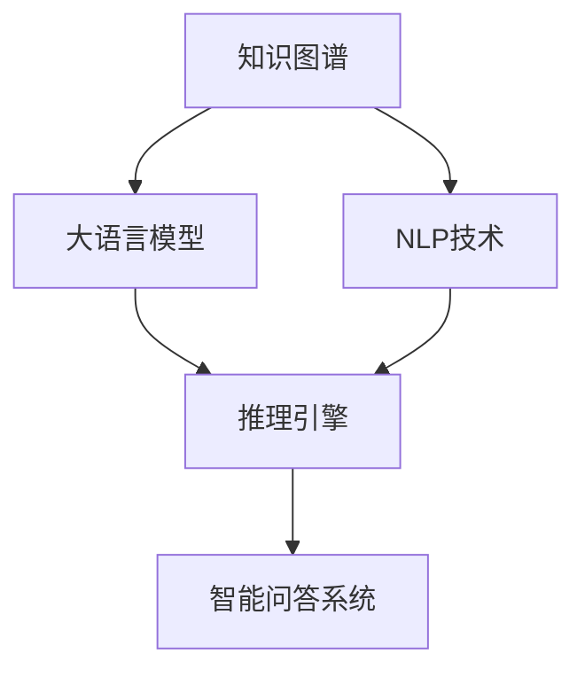

                 

# LLM驱动的智能问答系统：知识库的新形态

> 关键词：知识图谱,大语言模型,自然语言处理(NLP),问答系统,知识库,深度学习,模型优化,推理引擎

## 1. 背景介绍

### 1.1 问题由来
问答系统在各行各业中扮演着重要的角色。无论是医疗领域的健康咨询，还是教育领域的在线答疑，亦或是金融领域的信息检索，问答系统以其高效、准确的特点，极大地提升了服务质量，节省了人力成本。然而，传统的问答系统往往依赖于静态的知识库和规则引擎，面对新问题和复杂场景，扩展和维护成本高，且响应速度慢。

近年来，随着自然语言处理(NLP)和深度学习技术的飞速发展，大语言模型(Large Language Models, LLMs)成为了一种全新的知识存储和处理方式。LLMs通过预训练获得强大的语言理解和生成能力，具备处理海量非结构化文本数据的能力，能够理解复杂的语义结构，自然地与人类交互。将其应用于问答系统，构建基于大语言模型的智能问答系统，将有效提升系统响应速度、知识覆盖范围和准确性，推动问答系统向智能化、普适化的方向发展。

### 1.2 问题核心关键点
构建基于大语言模型的智能问答系统，涉及的知识图谱(Knowledge Graph)、自然语言处理(NLP)、推理引擎等多领域的深度融合，是一项系统工程。其关键点包括：

- 如何有效地构建知识图谱，并将其与大语言模型相结合。
- 如何在大规模文本数据上对大语言模型进行预训练和微调，以适应问答任务的需求。
- 如何设计高效、可扩展的推理引擎，使得问答系统能够处理复杂的推理和逻辑任务。
- 如何优化模型架构和算法，提升问答系统的性能和鲁棒性。
- 如何构建可持续发展的智能问答系统，保障系统稳定性和安全性。

本文将重点介绍基于大语言模型的智能问答系统，并从知识图谱构建、模型优化、推理引擎设计等多个维度，对相关技术进行详细阐述。

## 2. 核心概念与联系

### 2.1 核心概念概述

为更好地理解基于大语言模型的智能问答系统，本节将介绍几个关键概念及其之间的联系：

- **知识图谱**：一种语义化的结构化表示，用于描述实体、关系和属性之间的相互关系。知识图谱通过RDF等标准格式，将大量非结构化知识编码为结构化图谱，便于机器理解和推理。
- **大语言模型**：一种通过大规模无标签文本数据进行预训练的神经网络模型，具备强大的语言理解和生成能力。典型的如GPT、BERT等。
- **自然语言处理(NLP)**：一种研究人机之间自然语言交互的技术，涉及语言理解、语言生成、文本分类等多个子领域。NLP是大语言模型应用于问答系统的重要基础。
- **推理引擎**：一种基于知识图谱和模型预测结果，进行逻辑推理和决策的系统。推理引擎是问答系统处理复杂问题的核心组件。
- **智能问答系统**：一种结合知识图谱、大语言模型、推理引擎，能够自然地与用户交互，提供准确回答的智能系统。

这些核心概念之间的联系可以通过以下Mermaid流程图来展示：



这个流程图展示了知识图谱、大语言模型、NLP技术、推理引擎和智能问答系统之间的紧密联系：

1. 知识图谱通过RDF等标准格式，将非结构化知识编码为结构化图谱。
2. 大语言模型通过大规模无标签文本数据的预训练，学习通用的语言表示。
3. NLP技术将用户的自然语言查询转化为可被模型理解的形式，并提取重要特征。
4. 推理引擎利用知识图谱和模型的预测结果，进行逻辑推理和决策。
5. 智能问答系统通过知识图谱、大语言模型和推理引擎的协同工作，提供准确的问答服务。

## 3. 核心算法原理 & 具体操作步骤
### 3.1 算法原理概述

基于大语言模型的智能问答系统，其核心算法原理主要基于以下两个步骤：

1. **知识图谱的构建与优化**：将非结构化文本数据转化为结构化的知识图谱，并对知识图谱进行优化，使得其结构更加合理、语义更加丰富。

2. **大语言模型的预训练与微调**：利用大规模无标签文本数据对大语言模型进行预训练，并根据具体问答任务的需求，对模型进行微调，提升其在问答场景中的性能。

### 3.2 算法步骤详解

#### 知识图谱的构建与优化

**Step 1: 文本数据收集**
- 收集与问答任务相关的文本数据，如百科、文献、新闻报道等。可以通过Web抓取、API接口等途径获取数据。

**Step 2: 文本预处理**
- 对收集到的文本数据进行清洗、分词、去停用词等预处理操作。可以使用NLTK、SpaCy等NLP库进行文本处理。

**Step 3: 知识图谱构建**
- 使用开源工具（如DBpedia、Freebase等）或自定义工具（如RDF2Vec、Neo4j）构建知识图谱。将文本中的实体、关系和属性转化为节点和边，存储在图谱中。
- 通过关系抽取、实体链接等技术，增强知识图谱的完整性和准确性。

**Step 4: 知识图谱优化**
- 应用图谱优化算法（如GraphSAGE、GNN等）对知识图谱进行优化，提高推理效率和准确性。
- 采用图神经网络（GNN）等技术，学习知识图谱中的隐含关系和模式，增强推理能力。

#### 大语言模型的预训练与微调

**Step 1: 预训练**
- 选择合适的预训练模型（如BERT、GPT等），在无标签文本数据上进行预训练。
- 定义预训练任务，如语言建模、掩码预测、句子分类等，增强模型的语言理解能力。

**Step 2: 微调**
- 根据问答任务的需求，选择合适的微调任务（如分类、匹配、生成等），并设计任务适配层。
- 使用标注数据集对模型进行微调，提升模型在问答场景中的性能。
- 设置微调超参数，如学习率、批次大小、迭代轮数等，进行模型训练。

### 3.3 算法优缺点

基于大语言模型的智能问答系统具有以下优点：
1. **处理能力强大**：大语言模型能够理解复杂的语义结构，自然地与用户交互，处理各类复杂问答任务。
2. **知识更新及时**：知识图谱可以实时更新，大语言模型可以动态地获取最新的知识信息。
3. **推理能力增强**：推理引擎可以有效处理复杂的推理和逻辑任务，提升系统应对复杂场景的能力。

同时，该方法也存在一定的局限性：
1. **知识图谱构建复杂**：知识图谱的构建和优化需要大量的领域知识和专家参与，工作量较大。
2. **模型资源消耗高**：大语言模型参数量巨大，对计算资源和存储空间要求较高。
3. **推理效率有待提升**：推理引擎的设计和优化需要进一步深入研究，才能更好地适应大规模知识图谱。
4. **鲁棒性不足**：面对异常输入或噪声数据，系统容易产生误判。

尽管存在这些局限性，但就目前而言，基于大语言模型的智能问答系统是构建高效、智能问答系统的有效手段。

### 3.4 算法应用领域

基于大语言模型的智能问答系统已经在多个领域得到应用，如医疗咨询、教育答疑、客户服务等。具体包括：

- **医疗咨询系统**：利用知识图谱和预训练模型，为患者提供快速、准确的医疗咨询服务。例如IBM的Watson Health等。
- **教育答疑系统**：在教育领域，基于知识图谱和大语言模型，为学生提供个性化答疑服务。如Knewton、Quizlet等。
- **客户服务系统**：在客服领域，通过智能问答系统，提高客户服务效率和满意度。如Albert、Chatbot等。
- **金融信息系统**：利用大语言模型和知识图谱，提供金融知识问答和市场分析服务。如CreditSuisse、Bloomberg等。

## 4. 数学模型和公式 & 详细讲解 & 举例说明

### 4.1 数学模型构建

本节将使用数学语言对知识图谱和大语言模型问答系统的构建进行更加严格的刻画。

**知识图谱表示**：
知识图谱由节点和边组成，其中节点表示实体或属性，边表示实体之间的关系。以RDF（Resource Description Framework）为例，一个简单的知识图谱可以表示为：

$$
(\text{John}, \text{hasSpouse}, \text{Alice})
$$

其中John和Alice为实体节点，hasSpouse为关系节点。

**大语言模型表示**：
大语言模型通常由Transformer等神经网络构成，其输入为文本序列，输出为表示序列的向量。以BERT模型为例，一个BERT模型可以表示为：

$$
M_{\theta}(x) = \text{[CLS]} \mathbf{h}_1 \mathbf{h}_2 \dots \mathbf{h}_{N+2}
$$

其中$\text{[CLS]}$为特殊的CLS（Classification Head）节点，$\mathbf{h}_i$为输入序列中的第$i$个位置的隐状态向量。

### 4.2 公式推导过程

以医疗问答系统为例，假设有如下知识图谱：

$$
\begin{align*}
(\text{John}, & \text{hasSpouse}, \text{Alice}) \\
(\text{John}, & \text{hasDisease}, \text{Cancer}) \\
(\text{Cancer}, & \text{hasTreatment}, \text{Chemotherapy})
\end{align*}
$$

**Step 1: 知识图谱嵌入**
- 将知识图谱中的实体和关系节点映射为向量，得到嵌入向量：
  $$
  \mathbf{e}_J = [1, 2, 3] \\
  \mathbf{e}_A = [4, 5, 6] \\
  \mathbf{e}_{H} = [7, 8, 9]
  $$

**Step 2: 大语言模型推理**
- 将用户查询$x = \text{"What is the treatment for John's disease?"}$输入大语言模型，得到CLS节点向量$\mathbf{h}_{CLS}$。
- 通过计算相似度，找到与用户查询最相关的实体和关系节点，得到推理结果：
  $$
  \mathbf{e}_{John} = [\mathbf{h}_1, \mathbf{h}_2, \mathbf{h}_3] \\
  \mathbf{e}_{Cancer} = [\mathbf{h}_4, \mathbf{h}_5, \mathbf{h}_6]
  $$

**Step 3: 推理结果输出**
- 根据推理结果，输出最终回答：
  $$
  \text{Answer} = \text{Chemotherapy}
  $$

### 4.3 案例分析与讲解

以医疗问答系统为例，假设有如下用户查询：

**案例1: 问诊**
用户查询：“我头疼，应该怎么办？”

**Step 1: 知识图谱嵌入**
- 查询中的实体节点为“头疼”，通过知识图谱找到对应的治疗方式。

**Step 2: 大语言模型推理**
- 将查询输入大语言模型，得到CLS节点向量。
- 根据相似度，找到与“头疼”相关的实体节点，如“头痛”。

**Step 3: 推理结果输出**
- 输出最终回答：“您可以尝试休息、服用止痛药等。”

**案例2: 问诊**
用户查询：“我最近感觉疲劳，应该怎么办？”

**Step 1: 知识图谱嵌入**
- 查询中的实体节点为“疲劳”，通过知识图谱找到对应的治疗方式。

**Step 2: 大语言模型推理**
- 将查询输入大语言模型，得到CLS节点向量。
- 根据相似度，找到与“疲劳”相关的实体节点，如“疲劳综合征”。

**Step 3: 推理结果输出**
- 输出最终回答：“建议您去医院进行详细检查，可能需要调整作息、药物治疗等。”

## 5. 项目实践：代码实例和详细解释说明

### 5.1 开发环境搭建

在进行智能问答系统开发前，我们需要准备好开发环境。以下是使用Python进行PyTorch开发的环境配置流程：

1. 安装Anaconda：从官网下载并安装Anaconda，用于创建独立的Python环境。

2. 创建并激活虚拟环境：
```bash
conda create -n pytorch-env python=3.8 
conda activate pytorch-env
```

3. 安装PyTorch：根据CUDA版本，从官网获取对应的安装命令。例如：
```bash
conda install pytorch torchvision torchaudio cudatoolkit=11.1 -c pytorch -c conda-forge
```

4. 安装Transformers库：
```bash
pip install transformers
```

5. 安装各类工具包：
```bash
pip install numpy pandas scikit-learn matplotlib tqdm jupyter notebook ipython
```

完成上述步骤后，即可在`pytorch-env`环境中开始开发实践。

### 5.2 源代码详细实现

下面我们以医疗问答系统为例，给出使用Transformers库对BERT模型进行微调的PyTorch代码实现。

首先，定义问答任务的数据处理函数：

```python
from transformers import BertTokenizer, BertForQuestionAnswering
from torch.utils.data import Dataset
import torch

class QADataset(Dataset):
    def __init__(self, texts, qas, tokenizer, max_len=128):
        self.texts = texts
        self.qas = qas
        self.tokenizer = tokenizer
        self.max_len = max_len
        
    def __len__(self):
        return len(self.texts)
    
    def __getitem__(self, item):
        text = self.texts[item]
        qas = self.qas[item]
        question, context = qas['question'], qas['context']
        
        encoding = self.tokenizer(question, context, return_tensors='pt', max_length=self.max_len, padding='max_length', truncation=True)
        input_ids = encoding['input_ids'][0]
        attention_mask = encoding['attention_mask'][0]
        start_position = encoding['start_logits'][0][1]  # 只考虑第二个token作为答案起始点
        end_position = encoding['end_logits'][0][2]
        
        return {'input_ids': input_ids, 
                'attention_mask': attention_mask,
                'start_position': start_position,
                'end_position': end_position}

# 加载预训练的BERT模型和分词器
model = BertForQuestionAnswering.from_pretrained('bert-base-cased')
tokenizer = BertTokenizer.from_pretrained('bert-base-cased')

# 构建数据集
train_dataset = QADataset(train_texts, train_qas, tokenizer, max_len=128)
dev_dataset = QADataset(dev_texts, dev_qas, tokenizer, max_len=128)
test_dataset = QADataset(test_texts, test_qas, tokenizer, max_len=128)
```

然后，定义模型和优化器：

```python
from transformers import AdamW

optimizer = AdamW(model.parameters(), lr=2e-5)
```

接着，定义训练和评估函数：

```python
from torch.utils.data import DataLoader
from tqdm import tqdm
from sklearn.metrics import accuracy_score

device = torch.device('cuda') if torch.cuda.is_available() else torch.device('cpu')
model.to(device)

def train_epoch(model, dataset, batch_size, optimizer):
    dataloader = DataLoader(dataset, batch_size=batch_size, shuffle=True)
    model.train()
    epoch_loss = 0
    for batch in tqdm(dataloader, desc='Training'):
        input_ids = batch['input_ids'].to(device)
        attention_mask = batch['attention_mask'].to(device)
        start_position = batch['start_position'].to(device)
        end_position = batch['end_position'].to(device)
        model.zero_grad()
        outputs = model(input_ids, attention_mask=attention_mask, start_position=start_position, end_position=end_position)
        loss = outputs.loss
        epoch_loss += loss.item()
        loss.backward()
        optimizer.step()
    return epoch_loss / len(dataloader)

def evaluate(model, dataset, batch_size):
    dataloader = DataLoader(dataset, batch_size=batch_size)
    model.eval()
    preds, labels = [], []
    with torch.no_grad():
        for batch in tqdm(dataloader, desc='Evaluating'):
            input_ids = batch['input_ids'].to(device)
            attention_mask = batch['attention_mask'].to(device)
            start_position = batch['start_position'].to(device)
            end_position = batch['end_position'].to(device)
            batch_logits = model(input_ids, attention_mask=attention_mask, start_position=start_position, end_position=end_position).logits
            batch_predictions = batch_logits.argmax(dim=2)[:, 1:]  # 只考虑第二个token作为答案起始点
            batch_labels = batch['end_position']
            for prediction, label in zip(batch_predictions, batch_labels):
                preds.append(prediction.tolist())
                labels.append(label.tolist())
                
    print(accuracy_score(labels, preds))
```

最后，启动训练流程并在测试集上评估：

```python
epochs = 5
batch_size = 16

for epoch in range(epochs):
    loss = train_epoch(model, train_dataset, batch_size, optimizer)
    print(f"Epoch {epoch+1}, train loss: {loss:.3f}")
    
    print(f"Epoch {epoch+1}, dev accuracy: {evaluate(model, dev_dataset, batch_size)}")
    
print(f"Test accuracy: {evaluate(model, test_dataset, batch_size)}")
```

以上就是使用PyTorch对BERT进行医疗问答系统微调的完整代码实现。可以看到，得益于Transformers库的强大封装，我们可以用相对简洁的代码完成BERT模型的加载和微调。

### 5.3 代码解读与分析

让我们再详细解读一下关键代码的实现细节：

**QADataset类**：
- `__init__`方法：初始化文本、问题-上下文对等关键组件。
- `__len__`方法：返回数据集的样本数量。
- `__getitem__`方法：对单个样本进行处理，将问题-上下文对转换为token ids，并计算答案起始和结束位置。

**训练和评估函数**：
- 使用PyTorch的DataLoader对数据集进行批次化加载，供模型训练和推理使用。
- 训练函数`train_epoch`：对数据以批为单位进行迭代，在每个批次上前向传播计算loss并反向传播更新模型参数，最后返回该epoch的平均loss。
- 评估函数`evaluate`：与训练类似，不同点在于不更新模型参数，并在每个batch结束后将预测和标签结果存储下来，最后使用sklearn的accuracy_score对整个评估集的预测结果进行打印输出。

**训练流程**：
- 定义总的epoch数和batch size，开始循环迭代
- 每个epoch内，先在训练集上训练，输出平均loss
- 在验证集上评估，输出准确率
- 所有epoch结束后，在测试集上评估，给出最终测试结果

可以看到，PyTorch配合Transformers库使得BERT微调的代码实现变得简洁高效。开发者可以将更多精力放在数据处理、模型改进等高层逻辑上，而不必过多关注底层的实现细节。

当然，工业级的系统实现还需考虑更多因素，如模型的保存和部署、超参数的自动搜索、更灵活的任务适配层等。但核心的微调范式基本与此类似。

## 6. 实际应用场景
### 6.1 医疗问答系统

基于大语言模型的医疗问答系统，可以为医生和患者提供高效、准确的医疗咨询服务。传统的医疗咨询往往依赖于医生的经验和知识，而基于大语言模型的系统则可以通过预训练和微调，利用海量的医学知识库，提供更加全面和专业的医疗解答。

在技术实现上，可以收集医疗领域的各类文档、文献、病历等文本数据，并对其进行标注和预处理。在此基础上对预训练语言模型进行微调，使其能够理解医学知识，进行诊断、治疗、药物推荐等任务。微调后的模型能够在用户输入症状描述后，自动推荐相应的治疗方案和药物。

### 6.2 教育答疑系统

在教育领域，基于大语言模型的答疑系统可以提供个性化、智能化的学习辅助。传统教育答疑系统往往只能提供标准化的答案，而基于大语言模型的系统则能够理解学生的提问，提供更加细致和个性化的解答。

在技术实现上，可以收集各类学习资源、作业、试卷等文本数据，并对其进行标注和预处理。在此基础上对预训练语言模型进行微调，使其能够理解不同学生的提问，提供针对性的解答和辅导。微调后的模型能够根据学生的学习进度和偏好，推荐相应的学习资源和习题，帮助学生提高学习效率。

### 6.3 客户服务系统

在客服领域，基于大语言模型的系统可以提供24/7的客户服务，解决用户常见问题，提升客户满意度。传统的客服系统依赖于人工坐席，效率较低且成本较高。而基于大语言模型的系统则能够自动处理大量简单咨询，减轻人工压力，提升服务效率。

在技术实现上，可以收集客服历史记录、用户反馈等文本数据，并对其进行标注和预处理。在此基础上对预训练语言模型进行微调，使其能够理解用户的问题，提供准确的回答。微调后的模型能够在用户输入问题后，自动回答常见问题和推荐相关服务。

### 6.4 未来应用展望

随着大语言模型和微调方法的不断发展，基于微调范式将在更多领域得到应用，为传统行业带来变革性影响。

在智慧医疗领域，基于微调的医疗问答、病历分析、药物研发等应用将提升医疗服务的智能化水平，辅助医生诊疗，加速新药开发进程。

在智能教育领域，微调技术可应用于作业批改、学情分析、知识推荐等方面，因材施教，促进教育公平，提高教学质量。

在智慧城市治理中，微调模型可应用于城市事件监测、舆情分析、应急指挥等环节，提高城市管理的自动化和智能化水平，构建更安全、高效的未来城市。

此外，在企业生产、社会治理、文娱传媒等众多领域，基于大模型微调的人工智能应用也将不断涌现，为经济社会发展注入新的动力。相信随着技术的日益成熟，微调方法将成为人工智能落地应用的重要范式，推动人工智能技术向更广阔的领域加速渗透。

## 7. 工具和资源推荐
### 7.1 学习资源推荐

为了帮助开发者系统掌握大语言模型微调的理论基础和实践技巧，这里推荐一些优质的学习资源：

1. 《Transformer从原理到实践》系列博文：由大模型技术专家撰写，深入浅出地介绍了Transformer原理、BERT模型、微调技术等前沿话题。

2. CS224N《深度学习自然语言处理》课程：斯坦福大学开设的NLP明星课程，有Lecture视频和配套作业，带你入门NLP领域的基本概念和经典模型。

3. 《Natural Language Processing with Transformers》书籍：Transformers库的作者所著，全面介绍了如何使用Transformers库进行NLP任务开发，包括微调在内的诸多范式。

4. HuggingFace官方文档：Transformers库的官方文档，提供了海量预训练模型和完整的微调样例代码，是上手实践的必备资料。

5. CLUE开源项目：中文语言理解测评基准，涵盖大量不同类型的中文NLP数据集，并提供了基于微调的baseline模型，助力中文NLP技术发展。

通过对这些资源的学习实践，相信你一定能够快速掌握大语言模型微调的精髓，并用于解决实际的NLP问题。
###  7.2 开发工具推荐

高效的开发离不开优秀的工具支持。以下是几款用于大语言模型微调开发的常用工具：

1. PyTorch：基于Python的开源深度学习框架，灵活动态的计算图，适合快速迭代研究。大部分预训练语言模型都有PyTorch版本的实现。

2. TensorFlow：由Google主导开发的开源深度学习框架，生产部署方便，适合大规模工程应用。同样有丰富的预训练语言模型资源。

3. Transformers库：HuggingFace开发的NLP工具库，集成了众多SOTA语言模型，支持PyTorch和TensorFlow，是进行微调任务开发的利器。

4. Weights & Biases：模型训练的实验跟踪工具，可以记录和可视化模型训练过程中的各项指标，方便对比和调优。与主流深度学习框架无缝集成。

5. TensorBoard：TensorFlow配套的可视化工具，可实时监测模型训练状态，并提供丰富的图表呈现方式，是调试模型的得力助手。

6. Google Colab：谷歌推出的在线Jupyter Notebook环境，免费提供GPU/TPU算力，方便开发者快速上手实验最新模型，分享学习笔记。

合理利用这些工具，可以显著提升大语言模型微调任务的开发效率，加快创新迭代的步伐。

### 7.3 相关论文推荐

大语言模型和微调技术的发展源于学界的持续研究。以下是几篇奠基性的相关论文，推荐阅读：

1. Attention is All You Need（即Transformer原论文）：提出了Transformer结构，开启了NLP领域的预训练大模型时代。

2. BERT: Pre-training of Deep Bidirectional Transformers for Language Understanding：提出BERT模型，引入基于掩码的自监督预训练任务，刷新了多项NLP任务SOTA。

3. Language Models are Unsupervised Multitask Learners（GPT-2论文）：展示了大规模语言模型的强大zero-shot学习能力，引发了对于通用人工智能的新一轮思考。

4. Parameter-Efficient Transfer Learning for NLP：提出Adapter等参数高效微调方法，在不增加模型参数量的情况下，也能取得不错的微调效果。

5. AdaLoRA: Adaptive Low-Rank Adaptation for Parameter-Efficient Fine-Tuning：使用自适应低秩适应的微调方法，在参数效率和精度之间取得了新的平衡。

这些论文代表了大语言模型微调技术的发展脉络。通过学习这些前沿成果，可以帮助研究者把握学科前进方向，激发更多的创新灵感。

## 8. 总结：未来发展趋势与挑战

### 8.1 总结

本文对基于大语言模型的智能问答系统进行了全面系统的介绍。首先阐述了智能问答系统的发展背景和意义，明确了基于大语言模型的智能问答系统在提升系统响应速度、知识覆盖范围和准确性方面的独特价值。其次，从知识图谱构建、模型优化、推理引擎设计等多个维度，对相关技术进行了详细阐述。

通过本文的系统梳理，可以看到，基于大语言模型的智能问答系统正在成为构建高效、智能问答系统的有效手段。利用大语言模型的强大语言理解能力，通过微调和推理引擎的协同工作，可以提供更加精准、自然的问答服务，推动问答系统向智能化、普适化的方向发展。

### 8.2 未来发展趋势

展望未来，基于大语言模型的智能问答系统将呈现以下几个发展趋势：

1. **知识图谱的多样化**：随着知识图谱技术的不断进步，未来的知识图谱将不再局限于结构化的RDF格式，更多形式的知识表示将得到广泛应用，如向量图谱、知识图谱嵌入等。

2. **多模态融合**：未来的智能问答系统将不仅处理文本数据，还将处理图像、语音等多模态信息。多模态信息的融合，将显著提升系统对现实世界的理解和建模能力。

3. **推理引擎的增强**：未来的推理引擎将不再局限于静态的知识图谱，更多动态生成的知识将进入推理引擎，提升系统的实时性和灵活性。

4. **个性化和上下文感知**：未来的智能问答系统将更加注重个性化和上下文感知，能够理解用户的具体情境和需求，提供更加定制化的回答。

5. **跨领域知识迁移**：未来的智能问答系统将具备更强的跨领域知识迁移能力，能够在不同领域之间进行知识迁移和应用，提升系统的普适性。

以上趋势凸显了基于大语言模型的智能问答系统的广阔前景。这些方向的探索发展，必将进一步提升智能问答系统的性能和鲁棒性，为构建更加智能、高效的问答系统奠定坚实基础。

### 8.3 面临的挑战

尽管基于大语言模型的智能问答系统已经取得了显著进展，但在迈向更加智能化、普适化的应用过程中，它仍面临着诸多挑战：

1. **知识图谱构建复杂**：知识图谱的构建和优化需要大量的领域知识和专家参与，工作量较大。如何自动化、简化知识图谱构建流程，将是未来的一个重要研究方向。

2. **模型资源消耗高**：大语言模型参数量巨大，对计算资源和存储空间要求较高。如何优化模型架构，减少资源消耗，提升推理效率，将是未来的一个重要挑战。

3. **推理效率有待提升**：推理引擎的设计和优化需要进一步深入研究，才能更好地适应大规模知识图谱。如何提升推理引擎的计算效率和响应速度，将是未来的一个重要研究方向。

4. **鲁棒性不足**：面对异常输入或噪声数据，系统容易产生误判。如何增强系统的鲁棒性和泛化能力，将是未来的一个重要研究方向。

5. **可解释性不足**：当前智能问答系统的决策过程缺乏可解释性，难以对其推理逻辑进行分析和调试。如何增强系统的可解释性和可解释性，将是未来的一个重要研究方向。

6. **安全性有待保障**：预训练语言模型难免会学习到有偏见、有害的信息，通过智能问答系统传递到用户，可能造成安全隐患。如何从数据和算法层面消除模型偏见，避免恶意用途，确保输出的安全性，将是未来的一个重要研究方向。

正视智能问答系统面临的这些挑战，积极应对并寻求突破，将是大语言模型微调技术迈向成熟的必由之路。相信随着学界和产业界的共同努力，这些挑战终将一一被克服，大语言模型微调技术必将在构建安全、可靠、可解释、可控的智能系统中扮演越来越重要的角色。

### 8.4 研究展望

面对大语言模型微调所面临的种种挑战，未来的研究需要在以下几个方面寻求新的突破：

1. **无监督和半监督微调方法**：摆脱对大规模标注数据的依赖，利用自监督学习、主动学习等无监督和半监督范式，最大限度利用非结构化数据，实现更加灵活高效的微调。

2. **参数高效和计算高效的微调范式**：开发更加参数高效的微调方法，在固定大部分预训练参数的同时，只更新极少量的任务相关参数。同时优化微调模型的计算图，减少前向传播和反向传播的资源消耗，实现更加轻量级、实时性的部署。

3. **多模态微调方法**：研究如何处理多模态数据，将视觉、语音等多模态信息与文本信息进行融合，提升系统的多模态推理能力。

4. **因果分析和博弈论工具**：将因果分析方法引入微调模型，识别出模型决策的关键特征，增强输出解释的因果性和逻辑性。借助博弈论工具刻画人机交互过程，主动探索并规避模型的脆弱点，提高系统稳定性。

5. **伦理道德约束**：在模型训练目标中引入伦理导向的评估指标，过滤和惩罚有偏见、有害的输出倾向。同时加强人工干预和审核，建立模型行为的监管机制，确保输出符合人类价值观和伦理道德。

这些研究方向的探索，必将引领大语言模型微调技术迈向更高的台阶，为构建安全、可靠、可解释、可控的智能系统铺平道路。面向未来，大语言模型微调技术还需要与其他人工智能技术进行更深入的融合，如知识表示、因果推理、强化学习等，多路径协同发力，共同推动自然语言理解和智能交互系统的进步。只有勇于创新、敢于突破，才能不断拓展语言模型的边界，让智能技术更好地造福人类社会。

## 9. 附录：常见问题与解答

**Q1：大语言模型在问答系统中的应用是否仅限于文本输入和输出？**

A: 是的。大语言模型的输入和输出都是文本形式，其在问答系统中的应用主要基于文本数据。但随着技术的不断发展，未来大语言模型可能支持更多形式的数据输入和输出，如语音、图像等。

**Q2：微调过程中如何选择最优学习率？**

A: 微调的学习率一般要比预训练时小1-2个数量级，如果使用过大的学习率，容易破坏预训练权重，导致过拟合。一般建议从1e-5开始调参，逐步减小学习率，直至收敛。也可以使用warmup策略，在开始阶段使用较小的学习率，再逐渐过渡到预设值。

**Q3：知识图谱的构建和优化对问答系统的性能有何影响？**

A: 知识图谱的构建和优化对问答系统的性能影响很大。一个完整、准确的知识图谱可以帮助模型更好地理解复杂语义，提高推理准确性。而知识图谱的优化则可以提升推理效率，降低系统响应时间。

**Q4：推理引擎的设计和优化对问答系统的性能有何影响？**

A: 推理引擎的设计和优化对问答系统的性能影响很大。一个高效的推理引擎可以显著提升系统对复杂推理任务的响应速度和准确性。而推理引擎的优化则可以降低计算资源消耗，提升系统稳定性。

**Q5：未来智能问答系统的发展方向是什么？**

A: 未来的智能问答系统将朝着更加智能化、普适化的方向发展。知识图谱将多样化，多模态融合将深入，推理引擎将增强，系统将更加个性化和上下文感知，跨领域知识迁移能力将提升，系统将更加安全、可靠、可解释、可控。

通过本文的系统梳理，可以看到，基于大语言模型的智能问答系统正在成为构建高效、智能问答系统的有效手段。利用大语言模型的强大语言理解能力，通过微调和推理引擎的协同工作，可以提供更加精准、自然的问答服务，推动问答系统向智能化、普适化的方向发展。相信随着技术的日益成熟，大语言模型微调技术必将在构建安全、可靠、可解释、可控的智能系统中扮演越来越重要的角色。

