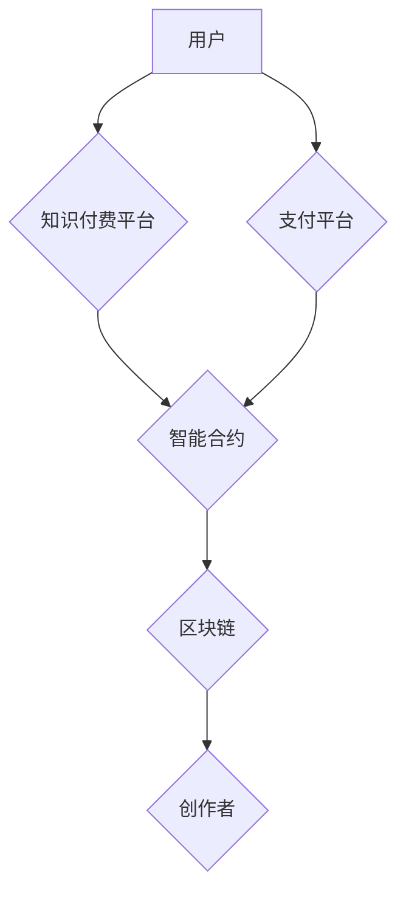

                 

## 关键词：区块链，知识付费，去中心化，智能合约，加密货币，数据安全，知识产权

## 1. 背景介绍

随着互联网的普及和信息时代的到来，知识已成为最宝贵的资源。知识经济的兴起，使得知识的获取、传播和应用成为社会发展的重要驱动力。知识付费作为一种新型的商业模式，应运而生，它以知识为核心，通过付费的方式获取知识资源，满足人们对知识的需求。

传统知识付费平台存在着诸多问题，例如：

* **平台垄断：** 知识付费平台通常由大型公司或机构掌控，平台拥有巨大的数据和用户资源，容易形成垄断，限制了创作者的收益和用户的选择。
* **信任问题：** 知识付费平台缺乏有效的信任机制，用户难以判断知识质量和创作者的真实性，容易出现虚假信息和欺诈行为。
* **数据安全问题：** 用户数据在集中式平台上容易泄露和被滥用，缺乏数据隐私保护。
* **知识产权保护问题：** 知识付费平台难以有效保护创作者的知识产权，知识盗版和侵权现象普遍存在。

区块链技术作为一种去中心化、透明、安全和不可篡改的分布式账本技术，为解决传统知识付费平台的痛点提供了新的解决方案。

## 2. 核心概念与联系

### 2.1 区块链技术

区块链是一种分布式账本技术，它将数据存储在多个节点上，每个节点都拥有完整的区块链数据副本。区块链的特点包括：

* **去中心化：** 数据存储在多个节点上，没有单一中心控制，避免了平台垄断。
* **透明度：** 所有交易记录都公开透明，任何人都可以查看，提高了平台的信任度。
* **安全性：** 使用加密算法和共识机制保证数据安全和不可篡改。
* **不可逆性：** 一旦交易记录被添加到区块链上，就无法修改或删除，保障了知识产权。

### 2.2 知识付费

知识付费是指通过付费的方式获取知识资源，包括但不限于在线课程、电子书、视频教程、咨询服务等。

### 2.3 智能合约

智能合约是一种自动执行的合约，它由代码定义，一旦条件满足，就会自动执行预先设定的条款。智能合约可以用于自动处理知识付费交易，例如：

* **自动支付：** 当用户购买知识资源时，智能合约会自动将支付金额转给创作者。
* **知识授权：** 智能合约可以控制知识资源的访问权限，确保用户只能访问已付费的知识内容。
* **版权保护：** 智能合约可以记录知识资源的版权信息，防止知识盗版和侵权。

### 2.4  区块链知识付费平台架构



## 3. 核心算法原理 & 具体操作步骤

### 3.1  算法原理概述

区块链知识付费平台的核心算法原理是基于区块链技术的去中心化、透明、安全和不可篡改的特点，结合智能合约的自动执行功能，实现知识付费的自动化、安全和高效。

### 3.2  算法步骤详解

1. **用户注册：** 用户在平台注册，并创建自己的数字钱包。
2. **知识资源发布：** 创作者在平台发布知识资源，并设置相应的付费价格和访问权限。
3. **智能合约部署：** 创作者与平台合作，部署智能合约，用于管理知识资源的交易和版权保护。
4. **用户购买：** 用户选择购买知识资源，并通过数字钱包支付相应的费用。
5. **智能合约执行：** 智能合约自动接收用户支付的费用，并将知识资源的访问权限授予用户。
6. **交易记录存储：** 交易记录被存储在区块链上，确保交易的透明性和不可篡改性。
7. **创作者收益分配：** 平台根据智能合约的规定，将用户支付的费用分配给创作者。

### 3.3  算法优缺点

**优点：**

* **去中心化：** 平台不受单一机构控制，提高了平台的安全性、透明度和公平性。
* **安全可靠：** 区块链技术的加密算法和共识机制保证了交易的安全性，防止了数据篡改和欺诈行为。
* **高效便捷：** 智能合约的自动执行功能简化了交易流程，提高了交易效率。
* **知识产权保护：** 智能合约可以记录知识资源的版权信息，防止知识盗版和侵权。

**缺点：**

* **技术复杂性：** 区块链技术和智能合约的开发和维护需要专业的技术人员。
* **用户体验：** 用户需要学习使用数字钱包和区块链技术，可能会降低用户体验。
* **监管挑战：** 区块链技术的去中心化特性给监管带来挑战，需要制定相应的法律法规。

### 3.4  算法应用领域

区块链知识付费算法可以应用于各种知识付费场景，例如：

* **在线教育：** 在线课程、视频教程、直播课程等。
* **电子书出版：** 电子书、期刊、杂志等。
* **专业技能培训：** 职业技能培训、行业认证等。
* **咨询服务：** 在线咨询、专家解答等。

## 4. 数学模型和公式 & 详细讲解 & 举例说明

### 4.1  数学模型构建

区块链知识付费平台的数学模型可以基于以下几个方面构建：

* **交易费用模型：** 交易费用可以根据交易金额、网络拥堵程度等因素进行动态调整。
* **收益分配模型：** 平台可以根据智能合约的规定，将用户支付的费用分配给创作者，并收取一定的平台服务费。
* **知识价值评估模型：** 可以利用机器学习算法对知识资源进行价值评估，并根据评估结果调整付费价格。

### 4.2  公式推导过程

**交易费用模型：**

$$
F = f(A, B)
$$

其中：

* $F$：交易费用
* $A$：交易金额
* $B$：网络拥堵程度

**收益分配模型：**

$$
C = A * (1 - P)
$$

其中：

* $C$：创作者收益
* $A$：用户支付的费用
* $P$：平台服务费比例

### 4.3  案例分析与讲解

假设用户购买了一门价值100美元的在线课程，平台服务费比例为10%。根据收益分配模型，创作者的收益为：

$$
C = 100 * (1 - 0.1) = 90美元
$$

## 5. 项目实践：代码实例和详细解释说明

### 5.1  开发环境搭建

* **编程语言：** Solidity (用于开发智能合约)
* **区块链平台：** Ethereum (以太坊)
* **开发工具：** Remix IDE (智能合约开发环境)

### 5.2  源代码详细实现

```solidity
pragma solidity ^0.8.0;

contract KnowledgeMarketplace {

    // 结构体定义知识资源
    struct KnowledgeResource {
        string title;
        string description;
        uint256 price;
        address creator;
        bool isPurchased;
    }

    // 知识资源映射
    mapping(uint256 => KnowledgeResource) public resources;

    // 知识资源计数器
    uint256 public resourceCount;

    // 事件
    event ResourceCreated(uint256 resourceId, string title, string description, uint256 price);
    event ResourcePurchased(uint256 resourceId, address buyer);

    // 创建知识资源
    function createResource(string memory _title, string memory _description, uint256 _price) public {
        resourceCount++;
        resources[resourceCount] = KnowledgeResource(_title, _description, _price, msg.sender, false);
        emit ResourceCreated(resourceCount, _title, _description, _price);
    }

    // 购买知识资源
    function purchaseResource(uint256 _resourceId) public payable {
        KnowledgeResource storage resource = resources[_resourceId];
        require(!resource.isPurchased, "Resource already purchased");
        require(msg.value >= resource.price, "Insufficient funds");

        resource.isPurchased = true;
        payable(resource.creator).transfer(msg.value);
        emit ResourcePurchased(_resourceId, msg.sender);
    }
}
```

### 5.3  代码解读与分析

* **智能合约定义：** 代码定义了一个名为 `KnowledgeMarketplace` 的智能合约。
* **结构体定义：** 定义了一个 `KnowledgeResource` 结构体，用于存储知识资源的信息，包括标题、描述、价格、创建者地址和购买状态。
* **映射和计数器：** 使用 `mapping` 映射存储知识资源，并使用 `resourceCount` 计数器跟踪知识资源的数量。
* **事件：** 定义了 `ResourceCreated` 和 `ResourcePurchased` 事件，用于记录知识资源创建和购买事件。
* **创建知识资源：** `createResource` 函数允许创作者创建新的知识资源，并将其存储在映射中。
* **购买知识资源：** `purchaseResource` 函数允许用户购买已发布的知识资源，并将支付金额转给创作者。

### 5.4  运行结果展示

部署智能合约后，用户可以通过 Remix IDE 或其他区块链浏览器查看知识资源列表，并购买所需的知识资源。

## 6. 实际应用场景

### 6.1  在线教育平台

区块链知识付费平台可以应用于在线教育平台，例如：

* **课程交易：** 用户可以购买在线课程，并通过智能合约获得课程访问权限。
* **证书颁发：** 智能合约可以用于自动颁发学习证书，确保证书的真实性和不可篡改性。
* **知识共享：** 平台可以鼓励用户分享知识资源，并通过激励机制促进知识共享。

### 6.2  电子书出版平台

区块链知识付费平台可以应用于电子书出版平台，例如：

* **电子书销售：** 用户可以购买电子书，并通过智能合约获得电子书的阅读权限。
* **版权保护：** 智能合约可以记录电子书的版权信息，防止电子书的盗版和侵权。
* **作者收益分配：** 平台可以根据智能合约的规定，将电子书的销售收入分配给作者。

### 6.3  专业技能培训平台

区块链知识付费平台可以应用于专业技能培训平台，例如：

* **技能认证：** 智能合约可以用于颁发技能认证证书，确保证书的真实性和不可篡改性。
* **培训课程交易：** 用户可以购买专业技能培训课程，并通过智能合约获得课程学习权限。
* **技能市场：** 平台可以搭建技能市场，连接人才和雇主，促进技能交易。

### 6.4  未来应用展望

区块链知识付费平台的应用场景还在不断扩展，未来可能应用于：

* **医疗保健：** 医疗知识付费、病历管理、药品溯源等。
* **金融服务：** 金融知识付费、投资理财、风险管理等。
* **文化娱乐：** 艺术作品交易、音乐版权保护、游戏虚拟资产等。

## 7. 工具和资源推荐

### 7.1  学习资源推荐

* **区块链技术入门书籍：** 《区块链：革命性的分布式账本技术》
* **智能合约开发教程：** Solidity 官方文档
* **区块链平台介绍：** Ethereum 官方网站

### 7.2  开发工具推荐

* **Remix IDE：** 智能合约开发环境
* **Truffle Suite：** 智能合约测试和部署工具
* **Ganache：** 本地区块链测试环境

### 7.3  相关论文推荐

* **《区块链技术在知识付费领域的应用研究》**
* **《基于智能合约的知识产权保护机制》**

## 8. 总结：未来发展趋势与挑战

### 8.1  研究成果总结

区块链技术为知识付费领域带来了新的机遇，可以解决传统知识付费平台的痛点，实现知识交易的去中心化、安全和高效。

### 8.2  未来发展趋势

* **去中心化知识付费平台的普及：** 更多平台将采用区块链技术，构建去中心化的知识付费生态系统。
* **知识价值评估模型的完善：** 利用机器学习和数据分析技术，开发更精准的知识价值评估模型。
* **知识付费场景的拓展：** 区块链知识付费技术将应用于更多领域，例如医疗保健、金融服务、文化娱乐等。

### 8.3  面临的挑战

* **技术复杂性：** 区块链技术和智能合约的开发和维护需要专业的技术人员。
* **用户体验：** 用户需要学习使用数字钱包和区块链技术，可能会降低用户体验。
* **监管挑战：** 区块链技术的去中心化特性给监管带来挑战，需要制定相应的法律法规。

### 8.4  研究展望

未来，需要进一步研究区块链知识付费平台的应用场景、技术架构、商业模式和监管机制，推动区块链技术在知识付费领域的落地应用，构建更加公平、透明、高效的知识经济生态系统。

## 9. 附录：常见问题与解答

**1. 区块链知识付费平台的安全性和可靠性如何保证？**

区块链技术的去中心化、透明和不可篡改特性保证了平台的安全性。交易记录存储在区块链上，任何人都可以查看，防止数据篡改。

**2. 如何保护知识产权？**

智能合约可以记录知识资源的版权信息，并自动执行版权保护机制，防止知识盗版和侵权。

**3. 用户如何使用区块链知识付费平台？**

用户需要注册一个数字钱包，并使用数字货币进行交易。平台会提供详细的教程和帮助文档。

**4. 平台的收益分配机制如何？**

平台根据智能合约的规定，将用户支付的费用分配给创作者，并收取一定的平台服务费。

**5. 区块链知识付费平台的未来发展趋势如何？**

区块链知识付费平台将更加普及，应用场景将更加广泛，知识价值评估模型将更加完善。


作者：禅与计算机程序设计艺术 / Zen and the Art of Computer Programming 
<end_of_turn>

