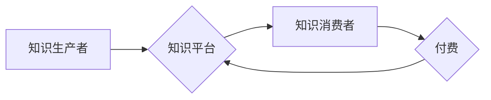

                 

## 知识经济时代下的知识付费创新商业模式运营

> 关键词：知识付费、商业模式、创新、技术驱动、用户体验、数据分析、内容生态

### 1. 背景介绍

知识经济时代，信息化和数字化深刻改变了生产方式和生活方式，知识成为最宝贵的生产要素。知识付费作为一种新型的商业模式，在知识经济的背景下蓬勃发展。它以知识为核心，通过付费的方式获取知识和技能，满足人们对知识的需求。

传统商业模式以产品和服务为核心，而知识付费则以知识为核心，其本质是知识的交易和传播。知识付费模式的兴起，打破了传统知识获取的壁垒，为知识生产者和消费者提供了新的平台和机会。

### 2. 核心概念与联系

**2.1 知识付费的核心概念**

知识付费是指通过付费的方式获取知识和技能，包括但不限于在线课程、付费文章、咨询服务、会员体系等。

**2.2 知识付费的商业模式**

知识付费的商业模式主要包括以下几种：

* **订阅模式:** 用户支付订阅费用，可以持续获取平台提供的知识内容和服务。
* **课程模式:** 用户购买特定课程，可以学习到特定的知识和技能。
* **咨询模式:** 用户付费咨询专家，获得针对性的知识和建议。
* **会员模式:** 用户成为平台会员，可以享受平台提供的各种优惠和服务。

**2.3 知识付费的生态系统**

知识付费的生态系统包括知识生产者、知识平台、知识消费者和相关服务商。

* **知识生产者:** 包括专家学者、行业人士、企业培训机构等，他们拥有丰富的知识和经验，可以创作和分享知识内容。
* **知识平台:** 提供知识付费服务的平台，例如在线教育平台、知识分享平台、咨询平台等。
* **知识消费者:** 包括个人用户、企业用户、机构用户等，他们需要获取知识和技能，提升自身能力。
* **相关服务商:** 包括支付服务商、技术服务商、营销服务商等，他们为知识付费生态系统提供支持服务。

**2.4 知识付费的流程图**



### 3. 核心算法原理 & 具体操作步骤

**3.1 算法原理概述**

知识付费平台的运营需要依靠一系列算法来实现内容推荐、用户匹配、付费转化等功能。这些算法通常基于机器学习和数据挖掘技术，通过分析用户行为数据、内容特征数据等，实现智能化运营。

**3.2 算法步骤详解**

1. **数据采集:** 收集用户行为数据、内容特征数据等。
2. **数据预处理:** 对数据进行清洗、转换、特征提取等处理。
3. **模型训练:** 利用机器学习算法，训练推荐模型、用户匹配模型、付费转化模型等。
4. **模型评估:** 对模型进行评估，调整模型参数，提高模型性能。
5. **模型部署:** 将训练好的模型部署到生产环境中，实现实时推荐、匹配和转化。

**3.3 算法优缺点**

* **优点:** 能够实现个性化推荐、精准匹配，提高用户体验和付费转化率。
* **缺点:** 需要大量的数据支持，算法模型需要不断更新和优化，存在算法偏差和数据安全风险。

**3.4 算法应用领域**

* **内容推荐:** 根据用户的兴趣爱好和行为数据，推荐相关的知识内容。
* **用户匹配:** 根据用户的需求和知识生产者的专业领域，匹配合适的知识服务。
* **付费转化:** 分析用户的付费行为数据，优化付费策略，提高付费转化率。

### 4. 数学模型和公式 & 详细讲解 & 举例说明

**4.1 数学模型构建**

知识付费平台的运营可以构建一个数学模型，来描述用户行为、内容传播和付费转化等过程。

**4.2 公式推导过程**

* **用户参与度模型:**

$$
U = \alpha \cdot I + \beta \cdot C + \gamma \cdot S
$$

其中:

* $U$ 表示用户的参与度
* $I$ 表示用户的兴趣度
* $C$ 表示内容的质量
* $S$ 表示平台的社交属性
* $\alpha$, $\beta$, $\gamma$ 为权重系数

* **付费转化率模型:**

$$
P = \frac{F}{T}
$$

其中:

* $P$ 表示付费转化率
* $F$ 表示付费用户数
* $T$ 表示总用户数

**4.3 案例分析与讲解**

假设一个知识付费平台，用户参与度模型中，兴趣度 $\alpha = 0.4$, 内容质量 $\beta = 0.3$, 社交属性 $\gamma = 0.3$. 

如果一个用户对某个课程的兴趣度为 5，课程质量为 7，平台社交属性为 6，则该用户的参与度为:

$$
U = 0.4 \cdot 5 + 0.3 \cdot 7 + 0.3 \cdot 6 = 2 + 2.1 + 1.8 = 5.9
$$

如果该平台总用户数为 1000，付费用户数为 100，则付费转化率为:

$$
P = \frac{100}{1000} = 0.1
$$

### 5. 项目实践：代码实例和详细解释说明

**5.1 开发环境搭建**

* Python 3.x
* Flask 或 Django 框架
* 数据库 (例如 MySQL, PostgreSQL)
* Redis (用于缓存)

**5.2 源代码详细实现**

```python
# Flask 示例代码

from flask import Flask, render_template

app = Flask(__name__)

@app.route('/')
def index():
    return render_template('index.html')

if __name__ == '__main__':
    app.run(debug=True)
```

**5.3 代码解读与分析**

* 该代码是一个简单的 Flask 应用，用于搭建知识付费平台的首页。
* `render_template('index.html')` 函数渲染 `index.html` 模板文件，展示首页内容。

**5.4 运行结果展示**

运行该代码后，在浏览器中访问 `http://127.0.0.1:5000/`，即可看到知识付费平台的首页。

### 6. 实际应用场景

**6.1 在线教育平台**

知识付费模式在在线教育平台的应用非常广泛，例如 Coursera, Udemy, edX 等平台。用户可以通过付费的方式学习各种在线课程，获取知识和技能。

**6.2 知识分享平台**

一些知识分享平台，例如知乎、豆瓣等，也开始采用知识付费模式，用户可以通过付费的方式获取专家解答、付费文章等内容。

**6.3 咨询服务平台**

一些咨询服务平台，例如 10000startup, 悟空问答等，也开始采用知识付费模式，用户可以通过付费的方式咨询专家，获得针对性的建议和帮助。

**6.4 未来应用展望**

随着人工智能、大数据等技术的不断发展，知识付费模式将更加智能化、个性化、多元化。未来，知识付费将渗透到各个领域，成为一种主流的知识获取方式。

### 7. 工具和资源推荐

**7.1 学习资源推荐**

* **书籍:** 《知识经济》、《互联网思维》、《数据驱动》
* **课程:** Coursera, Udemy 等平台上的相关课程
* **网站:** 知乎、豆瓣、CSDN 等网站

**7.2 开发工具推荐**

* **Python:** 语言
* **Flask/Django:** 框架
* **MySQL/PostgreSQL:** 数据库
* **Redis:** 缓存

**7.3 相关论文推荐**

* **The Sharing Economy: What It Is, What It Means, and Where It Is Going**
* **The Future of Work: How Technology Will Transform the Workplace**
* **The Rise of the Knowledge Economy**

### 8. 总结：未来发展趋势与挑战

**8.1 研究成果总结**

知识付费模式在知识经济时代具有重要的意义，它为知识生产者和消费者提供了新的平台和机会。通过算法驱动和数据分析，知识付费平台可以实现个性化推荐、精准匹配和高效运营。

**8.2 未来发展趋势**

* **智能化:** 利用人工智能技术，实现更智能化的内容推荐、用户匹配和付费转化。
* **个性化:** 根据用户的个性化需求，提供定制化的知识服务。
* **多元化:** 拓展知识付费的应用场景，覆盖更多领域和用户群体。

**8.3 面临的挑战**

* **内容质量:** 确保知识内容的质量和权威性。
* **用户信任:** 建立用户对平台的信任和安全感。
* **商业模式创新:** 探索新的商业模式，实现可持续发展。

**8.4 研究展望**

未来，需要进一步研究知识付费模式的算法优化、用户体验提升、商业模式创新等方面，推动知识付费模式的健康发展。

### 9. 附录：常见问题与解答

**9.1 如何选择合适的知识付费平台？**

选择知识付费平台时，需要考虑平台的口碑、内容质量、用户评价、付费模式等因素。

**9.2 如何提高知识付费的转化率？**

提高知识付费的转化率，需要关注内容质量、用户体验、营销推广等方面。

**9.3 如何保护知识付费平台的知识产权？**

知识付费平台需要采取有效的措施，保护知识产权，例如版权登记、技术防盗等。


作者：禅与计算机程序设计艺术 / Zen and the Art of Computer Programming 
<end_of_turn>

