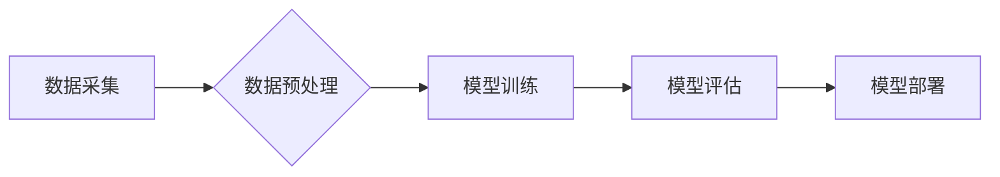

                 

## 知识经济的崛起：人工智能的催化作用

> 关键词：人工智能、知识经济、机器学习、深度学习、自然语言处理、计算机视觉、数据分析、算法

### 1. 背景介绍

人类社会正处于一个深刻变革的时代，信息化和数字化浪潮席卷全球，知识正在成为最宝贵的资源。知识经济的崛起，标志着经济发展模式从以资源为基础向以知识为基础的转变。在这个新时代，人工智能（Artificial Intelligence，简称AI）作为一种颠覆性的技术，正在以惊人的速度发展，成为推动知识经济发展的关键驱动力。

传统经济模式以生产和流通物质财富为核心，而知识经济则以知识的创造、传播和应用为核心。知识经济的特征是：

* **知识密集型：** 知识成为生产要素和核心竞争力。
* **创新驱动：** 科技创新和知识创新是经济增长的主要动力。
* **信息化支撑：** 信息技术为知识的获取、传播和应用提供了基础设施。
* **人才驱动：** 高素质人才成为知识经济发展的关键。

人工智能技术的出现，为知识经济的发展提供了强大的支撑。AI能够自动学习和分析海量数据，从数据中提取知识和洞察，并根据这些洞察做出决策和预测。这使得AI能够在各个领域发挥重要作用，例如：

* **智能化生产：** AI可以帮助企业提高生产效率、降低成本，实现智能化制造。
* **个性化服务：** AI可以根据用户的需求和喜好提供个性化的产品和服务。
* **科学研究：** AI可以帮助科学家加速科研进程，发现新的知识和规律。
* **医疗保健：** AI可以辅助医生诊断疾病、制定治疗方案，提高医疗水平。

### 2. 核心概念与联系

**2.1 知识经济与人工智能的关系**

知识经济和人工智能是相互促进、相互依存的关系。知识经济需要人工智能技术来挖掘、分析和应用知识，而人工智能的发展也离不开知识经济的支撑。

**2.2  人工智能的核心概念**

人工智能的核心概念包括：

* **机器学习：** 使机器能够从数据中学习，并根据学习到的知识进行预测或决策。
* **深度学习：** 一种更高级的机器学习方法，利用多层神经网络模拟人类大脑的学习过程。
* **自然语言处理：** 使机器能够理解和处理人类语言。
* **计算机视觉：** 使机器能够“看”图像和视频，并从中提取信息。

**2.3  人工智能的架构**

人工智能系统通常由以下几个部分组成：

* **数据采集：** 收集用于训练和测试人工智能模型的数据。
* **数据预处理：** 对收集到的数据进行清洗、转换和格式化。
* **模型训练：** 使用机器学习算法训练人工智能模型。
* **模型评估：** 使用测试数据评估模型的性能。
* **模型部署：** 将训练好的模型部署到实际应用场景中。

**Mermaid 流程图**



### 3. 核心算法原理 & 具体操作步骤

**3.1 算法原理概述**

机器学习算法是人工智能的核心，它使机器能够从数据中学习。常见的机器学习算法包括：

* **监督学习：** 利用标记数据训练模型，预测新的数据标签。
* **无监督学习：** 利用未标记数据发现数据中的模式和结构。
* **强化学习：** 通过试错学习，使机器在特定环境中获得最大奖励。

**3.2 算法步骤详解**

以监督学习为例，其步骤如下：

1. **数据收集和预处理：** 收集包含特征和标签的数据，并对数据进行清洗、转换和格式化。
2. **模型选择：** 根据任务需求选择合适的机器学习算法，例如线性回归、逻辑回归、决策树等。
3. **模型训练：** 使用训练数据训练模型，调整模型参数，使模型能够准确预测标签。
4. **模型评估：** 使用测试数据评估模型的性能，例如准确率、召回率、F1-score等。
5. **模型调优：** 根据评估结果，调整模型参数或选择其他算法，提高模型性能。
6. **模型部署：** 将训练好的模型部署到实际应用场景中，用于预测新的数据标签。

**3.3 算法优缺点**

不同的机器学习算法具有不同的优缺点，需要根据具体任务选择合适的算法。例如：

* **线性回归：** 算法简单易懂，但对数据线性关系要求较高。
* **逻辑回归：** 用于分类任务，但对数据分布要求较高。
* **决策树：** 算法易于解释，但容易过拟合。
* **支持向量机：** 性能优异，但训练时间较长。

**3.4 算法应用领域**

机器学习算法广泛应用于各个领域，例如：

* **图像识别：** 用于识别图像中的物体、场景和人物。
* **语音识别：** 用于将语音转换为文本。
* **自然语言处理：** 用于理解和生成人类语言。
* **推荐系统：** 用于推荐用户感兴趣的产品或服务。
* **金融预测：** 用于预测股票价格、信用风险等。

### 4. 数学模型和公式 & 详细讲解 & 举例说明

**4.1 数学模型构建**

机器学习算法通常基于数学模型构建。例如，线性回归模型的数学表达式为：

$$y = w_0 + w_1x_1 + w_2x_2 + ... + w_nx_n + \epsilon$$

其中：

* $y$ 是预测值。
* $w_0, w_1, w_2, ..., w_n$ 是模型参数。
* $x_1, x_2, ..., x_n$ 是输入特征。
* $\epsilon$ 是误差项。

**4.2 公式推导过程**

机器学习算法的训练过程就是通过优化模型参数，使模型的预测值与真实值之间的误差最小化。常用的优化算法包括梯度下降法、随机梯度下降法等。

**4.3 案例分析与讲解**

以线性回归为例，其目标是找到最佳的模型参数 $w_0, w_1, w_2, ..., w_n$，使得模型预测值与真实值之间的误差最小。可以使用梯度下降法来优化模型参数。梯度下降法的核心思想是：沿着梯度的反方向更新模型参数，直到找到误差最小的参数值。

### 5. 项目实践：代码实例和详细解释说明

**5.1 开发环境搭建**

可以使用Python语言和相关的机器学习库，例如Scikit-learn，TensorFlow，PyTorch等，来开发人工智能项目。

**5.2 源代码详细实现**

以下是一个使用Scikit-learn库实现线性回归的代码示例：

```python
from sklearn.linear_model import LinearRegression
from sklearn.model_selection import train_test_split
from sklearn.metrics import mean_squared_error

# 加载数据
data = ...

# 将数据分为训练集和测试集
X_train, X_test, y_train, y_test = train_test_split(data[:, :-1], data[:, -1], test_size=0.2)

# 创建线性回归模型
model = LinearRegression()

# 训练模型
model.fit(X_train, y_train)

# 预测测试集数据
y_pred = model.predict(X_test)

# 计算模型性能
mse = mean_squared_error(y_test, y_pred)
print(f"Mean Squared Error: {mse}")
```

**5.3 代码解读与分析**

* 首先，加载数据并将其分为训练集和测试集。
* 然后，创建线性回归模型并使用训练集训练模型。
* 训练完成后，使用测试集数据预测标签，并计算模型性能。

**5.4 运行结果展示**

运行代码后，会输出模型的平均平方误差（MSE）值，该值越小，模型性能越好。

### 6. 实际应用场景

人工智能技术已广泛应用于各个领域，例如：

* **医疗保健：** AI可以辅助医生诊断疾病、制定治疗方案，提高医疗水平。
* **金融服务：** AI可以用于风险评估、欺诈检测、个性化金融服务等。
* **制造业：** AI可以帮助企业提高生产效率、降低成本，实现智能化制造。
* **零售业：** AI可以用于商品推荐、库存管理、客户服务等。

**6.4 未来应用展望**

未来，人工智能技术将继续发展，并应用于更多领域。例如：

* **自动驾驶：** AI将推动自动驾驶技术的普及，改变交通出行方式。
* **个性化教育：** AI可以根据学生的学习情况提供个性化的学习方案。
* **智能家居：** AI将使家居更加智能化，提高生活品质。

### 7. 工具和资源推荐

**7.1 学习资源推荐**

* **在线课程：** Coursera、edX、Udacity等平台提供丰富的机器学习和人工智能课程。
* **书籍：** 《深度学习》、《机器学习实战》等书籍是学习人工智能的经典教材。
* **博客和论坛：** 机器学习和人工智能领域的博客和论坛可以获取最新的技术资讯和交流经验。

**7.2 开发工具推荐**

* **Python：** Python是机器学习和人工智能开发的常用语言。
* **Scikit-learn：** Scikit-learn是Python机器学习库，提供各种机器学习算法和工具。
* **TensorFlow：** TensorFlow是Google开发的开源机器学习框架，支持深度学习。
* **PyTorch：** PyTorch是Facebook开发的开源机器学习框架，以其灵活性和易用性而闻名。

**7.3 相关论文推荐**

* **《ImageNet Classification with Deep Convolutional Neural Networks》**
* **《Attention Is All You Need》**
* **《BERT: Pre-training of Deep Bidirectional Transformers for Language Understanding》**

### 8. 总结：未来发展趋势与挑战

**8.1 研究成果总结**

近年来，人工智能技术取得了长足的进步，在各个领域都取得了显著的应用成果。例如，图像识别、语音识别、自然语言处理等领域取得了突破性进展。

**8.2 未来发展趋势**

未来，人工智能技术将继续发展，并朝着以下几个方向发展：

* **更强大的计算能力：** 随着计算能力的提升，人工智能模型将变得更加复杂和强大。
* **更丰富的算法：** 新的机器学习算法将不断涌现，提高人工智能模型的性能。
* **更广泛的应用场景：** 人工智能技术将应用于更多领域，改变人们的生活方式。

**8.3 面临的挑战**

人工智能技术的发展也面临着一些挑战，例如：

* **数据安全和隐私保护：** 人工智能模型的训练需要大量数据，如何保证数据安全和隐私保护是一个重要问题。
* **算法偏见：** 人工智能模型可能存在算法偏见，导致不公平的结果。
* **伦理问题：** 人工智能技术的应用可能引发一些伦理问题，例如人工智能的责任和义务。

**8.4 研究展望**

未来，我们需要加强对人工智能技术的伦理和社会影响的思考，并制定相应的政策和规范，引导人工智能技术健康发展，造福人类社会。

### 9. 附录：常见问题与解答

**9.1 如何选择合适的机器学习算法？**

选择合适的机器学习算法需要根据具体任务需求和数据特点进行选择。例如，对于分类任务，可以考虑逻辑回归、决策树、支持向量机等算法；对于回归任务，可以考虑线性回归、支持向量回归等算法。

**9.2 如何评估机器学习模型的性能？**

常用的机器学习模型性能评估指标包括准确率、召回率、F1-score、AUC等。

**9.3 如何解决机器学习模型的过拟合问题？**

过拟合是指机器学习模型在训练数据上表现很好，但在测试数据上表现较差。解决过拟合问题的方法包括：

* 使用更小的模型
* 使用正则化技术
* 使用交叉验证


作者：禅与计算机程序设计艺术 / Zen and the Art of Computer Programming 
<end_of_turn>

