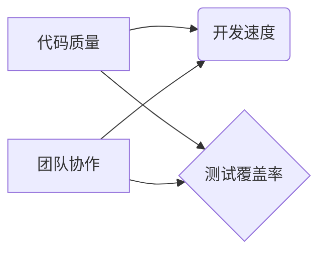

                 

## 研发效能度量与提升策略探讨

> 关键词：研发效能、度量指标、提升策略、敏捷开发、持续集成、代码质量、测试自动化、团队协作

## 1. 背景介绍

在当今科技日新月异的时代，软件开发的速度和效率已经成为企业竞争力的关键因素。研发效能，即软件开发团队在有限时间内完成高质量软件开发的能力，直接关系到企业的市场占有率、产品迭代速度和最终盈利能力。然而，研发效能是一个复杂的系统性问题，其度量和提升需要综合考虑多个因素，并采用科学的方法和策略。

传统的研发效能度量往往只关注代码产出量，例如代码行数、功能点等指标。这种单一指标的度量方式过于简单，无法全面反映研发团队的实际工作效率和软件质量。随着软件开发模式的不断演进，敏捷开发、持续集成等理念的兴起，研发效能的度量和提升也需要更加科学、全面、动态。

## 2. 核心概念与联系

研发效能的提升是一个多方面、多层次的系统工程，需要从多个角度进行分析和优化。

**2.1 研发效能的核心要素**

研发效能的核心要素包括：

* **代码质量:** 指软件代码的可靠性、可维护性、可扩展性和安全性。高质量的代码能够减少缺陷，提高软件的稳定性和可持续发展能力。
* **开发速度:** 指软件开发团队在完成特定功能或项目所需的时间。开发速度的提升需要优化开发流程、提高开发效率和团队协作能力。
* **测试覆盖率:** 指测试用例能够覆盖软件代码的比例。高测试覆盖率能够有效发现软件缺陷，提高软件质量。
* **团队协作:** 指开发团队成员之间有效沟通、协作和共享知识的能力。良好的团队协作能够提高开发效率、降低沟通成本和风险。

**2.2 研发效能提升的关联关系**

研发效能的提升是一个相互关联、相互影响的系统，各个要素之间存在着密切的联系。



**2.3 研发效能提升的策略**

研发效能的提升需要从多个方面入手，采用多种策略和方法。

* **代码质量提升策略:** 采用代码规范、代码审查、静态代码分析等手段提高代码质量。
* **开发速度提升策略:** 采用敏捷开发、持续集成、自动化测试等手段提高开发速度。
* **测试覆盖率提升策略:** 采用单元测试、集成测试、系统测试等手段提高测试覆盖率。
* **团队协作提升策略:** 采用协作工具、沟通机制、知识共享平台等手段提高团队协作。

## 3. 核心算法原理 & 具体操作步骤

### 3.1  算法原理概述

在研发效能提升中，算法可以帮助我们自动化完成一些重复性的工作，提高效率。例如，代码质量分析算法可以自动识别代码中的潜在问题，测试自动化算法可以自动执行测试用例，持续集成算法可以自动构建和部署软件。

### 3.2  算法步骤详解

以下是一个简单的代码质量分析算法的步骤详解：

1. **代码解析:** 将源代码文件解析成抽象语法树 (AST)。
2. **规则匹配:** 将 AST 与预定义的代码质量规则进行匹配。
3. **缺陷识别:** 如果匹配到规则，则识别为潜在缺陷。
4. **报告生成:** 生成代码质量报告，列出所有缺陷及其位置。

### 3.3  算法优缺点

**优点:**

* 自动化代码质量分析，提高效率。
* 识别潜在缺陷，降低软件风险。
* 提供代码质量改进建议。

**缺点:**

* 规则库的维护需要持续更新。
* 算法可能无法识别所有类型的缺陷。
* 算法的准确性依赖于代码的质量和规则的完善程度。

### 3.4  算法应用领域

代码质量分析算法广泛应用于软件开发领域，例如：

* **代码审查:** 自动辅助代码审查，提高审查效率。
* **缺陷预测:** 预测软件中的潜在缺陷，提前进行修复。
* **代码重构:** 提供代码重构建议，提高代码质量。

## 4. 数学模型和公式 & 详细讲解 & 举例说明

研发效能的度量可以采用数学模型和公式进行量化分析。

### 4.1  数学模型构建

一个简单的研发效能模型可以定义为：

$$
研发效能 = \frac{软件质量 * 开发速度}{团队成本}
$$

其中：

* **软件质量:** 可以用代码缺陷率、测试覆盖率等指标来衡量。
* **开发速度:** 可以用功能点完成时间、代码行数产出量等指标来衡量。
* **团队成本:** 可以用人力成本、时间成本、资源成本等指标来衡量。

### 4.2  公式推导过程

该模型的推导过程基于以下假设：

* 软件质量越高，研发效能越高。
* 开发速度越快，研发效能越高。
* 团队成本越低，研发效能越高。

### 4.3  案例分析与讲解

假设有两个软件开发团队，团队 A 和团队 B，它们的研发效能指标如下：

| 指标 | 团队 A | 团队 B |
|---|---|---|
| 代码缺陷率 | 1% | 2% |
| 测试覆盖率 | 90% | 80% |
| 功能点完成时间 | 10 天 | 15 天 |
| 人力成本 | 10 万元 | 15 万元 |

根据上述公式，我们可以计算出两个团队的研发效能：

* 团队 A 的研发效能: $(1-0.01) * (1/10) / (100000) = 0.099$
* 团队 B 的研发效能: $(1-0.02) * (1/15) / (150000) = 0.066$

从计算结果可以看出，团队 A 的研发效能高于团队 B，这表明团队 A 在代码质量、开发速度和团队成本方面都表现优异。

## 5. 项目实践：代码实例和详细解释说明

### 5.1  开发环境搭建

为了更好地理解研发效能提升的实践，我们可以选择一个简单的项目进行实践。例如，我们可以开发一个简单的在线任务管理系统。

在开发环境搭建方面，我们可以选择以下工具：

* **编程语言:** Python
* **框架:** Django
* **数据库:** PostgreSQL
* **版本控制:** Git
* **持续集成:** Jenkins

### 5.2  源代码详细实现

以下是一个简单的任务管理系统代码示例：

```python
# models.py
from django.db import models

class Task(models.Model):
    title = models.CharField(max_length=200)
    description = models.TextField()
    completed = models.BooleanField(default=False)

    def __str__(self):
        return self.title
```

### 5.3  代码解读与分析

这段代码定义了一个名为 `Task` 的模型，用于存储任务信息。

* `title`: 任务标题，最大长度为 200 个字符。
* `description`: 任务描述，可以包含任意长度的文本。
* `completed`: 任务完成状态，默认为 False (未完成)。

### 5.4  运行结果展示

在运行该代码后，我们可以通过 Django 的管理界面创建、查看、编辑和删除任务。

## 6. 实际应用场景

研发效能提升的策略和方法在各个行业和领域都有广泛的应用场景。

### 6.1  金融行业

在金融行业，研发效能的提升可以帮助银行、保险公司等机构更快地开发和部署新的金融产品和服务，提高客户体验和市场竞争力。

### 6.2  医疗行业

在医疗行业，研发效能的提升可以帮助医院、医疗机构等机构更快地开发和部署新的医疗软件和系统，提高医疗效率和患者安全。

### 6.3  教育行业

在教育行业，研发效能的提升可以帮助教育机构开发和部署新的在线教育平台和工具，提高教学效率和学习体验。

### 6.4  未来应用展望

随着人工智能、云计算等技术的不断发展，研发效能的提升将更加智能化、自动化和个性化。未来，我们将看到更多基于人工智能的研发效能分析和优化工具，帮助软件开发团队更高效地完成软件开发任务。

## 7. 工具和资源推荐

### 7.1  学习资源推荐

* **书籍:** 《The Phoenix Project: A Novel About IT, DevOps, and Helping Your Business Win》
* **在线课程:** Coursera, Udemy 等平台上的软件开发、敏捷开发、持续集成等课程。

### 7.2  开发工具推荐

* **版本控制:** Git, GitHub, GitLab
* **持续集成:** Jenkins, CircleCI, Travis CI
* **代码质量分析:** SonarQube, Code Climate, Checkstyle

### 7.3  相关论文推荐

* **论文:** "Measuring and Improving Software Development Productivity"
* **论文:** "The Impact of Agile Methodologies on Software Development Productivity"

## 8. 总结：未来发展趋势与挑战

### 8.1  研究成果总结

研发效能的提升是一个持续探索和实践的过程。通过对研发效能的深入研究和实践，我们已经积累了一些宝贵的经验和成果，例如：

* 敏捷开发、持续集成等理念的推广应用。
* 代码质量分析、测试自动化等技术的成熟发展。
* 研发效能度量指标体系的完善。

### 8.2  未来发展趋势

未来，研发效能的提升将朝着以下几个方向发展：

* **更加智能化:** 利用人工智能技术，自动分析和优化研发流程，提高研发效率。
* **更加自动化:** 通过自动化测试、部署等手段，减少人工干预，提高开发速度。
* **更加个性化:** 根据团队的实际情况和需求，定制化的研发效能提升策略。

### 8.3  面临的挑战

研发效能的提升也面临着一些挑战：

* **技术复杂性:** 研发效能提升涉及到多个技术领域，需要跨学科的合作和协作。
* **组织文化:** 传统的组织文化可能阻碍研发效能的提升，需要进行文化变革。
* **数据安全:** 研发效能的提升需要收集和分析大量数据，需要保证数据安全和隐私。

### 8.4  研究展望

未来，我们将继续深入研究研发效能的提升，探索新的方法和技术，帮助软件开发团队更高效地完成软件开发任务，推动软件行业的发展。

## 9. 附录：常见问题与解答

### 9.1  常见问题

* **如何衡量研发效能？**

研发效能可以采用多种指标进行衡量，例如代码缺陷率、测试覆盖率、开发速度、团队成本等。

* **如何提升研发效能？**

提升研发效能需要从多个方面入手，例如优化开发流程、提高代码质量、自动化测试、加强团队协作等。

* **敏捷开发和持续集成对研发效能有什么影响？**

敏捷开发和持续集成可以有效提高研发效能，帮助团队更快地交付高质量的软件。

### 9.2  解答

* **如何选择合适的研发效能提升策略？**

选择合适的研发效能提升策略需要根据团队的实际情况和需求进行分析和评估。

* **研发效能提升需要投入哪些资源？**

研发效能提升需要投入人力、时间、资金等资源。

* **研发效能提升是一个持续的过程吗？**

是的，研发效能提升是一个持续的过程，需要不断地改进和优化。


作者：禅与计算机程序设计艺术 / Zen and the Art of Computer Programming 
<end_of_turn>

