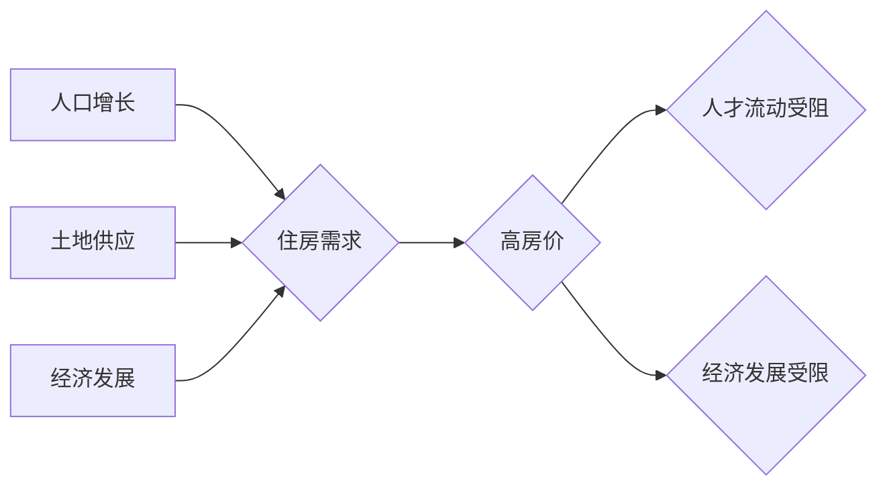

                 

## 硅谷的住房危机:高房价的影响

> 关键词：硅谷，住房危机，高房价，经济影响，社会影响，技术发展，住房政策，可持续发展

## 1. 背景介绍

硅谷，作为全球科技创新中心，吸引着无数人才涌入，追求梦想和财富。然而，近年来，硅谷的住房危机日益严峻，高房价成为阻碍人才流动和经济发展的一大瓶颈。

### 1.1 硅谷的繁荣与住房需求

硅谷的蓬勃发展离不开科技巨头的崛起和创新创业的热潮。这些科技公司创造了大量高薪工作，吸引了来自世界各地的优秀人才。然而，随着人口的快速增长，住房供应远远跟不上需求，导致房价持续飙升。

### 1.2 高房价的成因

硅谷高房价的形成是一个复杂的过程，涉及多个因素：

* **地理位置优势:** 硅谷位于加州优美的海岸线，拥有宜人的气候和丰富的自然资源，使其成为人们理想的居住地。
* **经济繁荣:** 硅谷的科技产业蓬勃发展，创造了大量高薪工作，吸引了大量人口涌入。
* **土地供应不足:** 硅谷的土地资源有限，且受到严格的规划限制，导致土地供应不足。
* **投资炒房:** 资本的涌入加剧了房价上涨，一些投资者将房产视为投资工具，推高了房价。
* **政策因素:** 部分政策措施，例如对开发商的限制和对租房的监管，也加剧了住房短缺问题。

## 2. 核心概念与联系

硅谷住房危机的核心问题在于供需失衡。

**Mermaid 流程图:**



**核心概念:**

* **供需:** 住房市场的基本原理，供需关系决定了房价水平。
* **人口增长:** 硅谷人口的快速增长是住房需求增加的主要原因。
* **土地供应:** 硅谷土地资源有限，土地供应不足是导致房价上涨的重要因素。
* **经济发展:** 硅谷的经济繁荣吸引了大量人才，增加了住房需求。
* **高房价:** 由于供需失衡，硅谷房价持续上涨，成为一个严重的问题。

## 3. 核心算法原理 & 具体操作步骤

为了解决硅谷住房危机，需要采用多种措施，例如增加住房供应、控制人口增长、促进经济多元化等。

### 3.1 算法原理概述

解决住房危机的核心算法可以理解为一个多目标优化问题，需要平衡住房供应、人口增长、经济发展等多个因素。

### 3.2 算法步骤详解

1. **数据收集:** 收集有关人口增长、土地资源、经济发展、住房需求等方面的相关数据。
2. **模型构建:** 建立一个数学模型，模拟住房市场运行机制，并量化各个因素的影响。
3. **方案设计:** 根据模型分析结果，设计出多种解决住房危机的方案，例如增加住房供应、控制人口增长、促进经济多元化等。
4. **方案评估:** 对每个方案进行评估，比较其对住房市场的影响，选择最优方案。
5. **方案实施:** 实施选定的方案，并进行跟踪评估，及时调整方案，以达到最佳效果。

### 3.3 算法优缺点

* **优点:** 能够系统地分析住房危机问题，并提出针对性的解决方案。
* **缺点:** 模型的准确性取决于数据的质量，以及模型本身的复杂度。

### 3.4 算法应用领域

* **城市规划:** 帮助城市规划者制定合理的住房政策，平衡住房供需关系。
* **经济预测:** 预测住房市场的发展趋势，为政府和企业决策提供参考。
* **投资分析:** 为投资者提供住房市场投资分析，帮助他们做出明智的决策。

## 4. 数学模型和公式 & 详细讲解 & 举例说明

为了更好地理解住房危机问题，我们可以建立一个数学模型来模拟住房市场运行机制。

### 4.1 数学模型构建

假设住房市场是一个简单的供需模型，其中：

* **D(p):** 住房需求函数，表示在价格p下，人们的需求量。
* **S(p):** 住房供应函数，表示在价格p下，市场上供应的住房数量。
* **p:** 住房价格。

根据供需关系，当需求量大于供应量时，价格会上升；当需求量小于供应量时，价格会下降。

### 4.2 公式推导过程

我们可以用以下公式来描述住房市场均衡价格：

$$D(p) = S(p)$$

其中，$D(p)$ 和 $S(p)$ 分别代表住房需求和供应函数。

### 4.3 案例分析与讲解

假设住房需求函数为：

$$D(p) = 1000 - 2p$$

住房供应函数为：

$$S(p) = 500 + p$$

我们可以将这两个函数代入均衡价格公式，求解均衡价格：

$$1000 - 2p = 500 + p$$

$$500 = 3p$$

$$p = 166.67$$

因此，在该模型下，均衡价格为166.67。

## 5. 项目实践：代码实例和详细解释说明

为了更好地理解住房危机问题，我们可以使用编程语言来模拟住房市场运行机制。

### 5.1 开发环境搭建

我们可以使用Python语言和相关的库来实现这个项目。

### 5.2 源代码详细实现

```python
import matplotlib.pyplot as plt

# 定义住房需求函数
def demand(price):
  return 1000 - 2 * price

# 定义住房供应函数
def supply(price):
  return 500 + price

# 生成价格范围
prices = range(50, 250)

# 计算需求量和供应量
demand_values = [demand(price) for price in prices]
supply_values = [supply(price) for price in prices]

# 绘制供需曲线
plt.plot(prices, demand_values, label='Demand')
plt.plot(prices, supply_values, label='Supply')
plt.xlabel('Price')
plt.ylabel('Quantity')
plt.legend()
plt.title('Housing Market Equilibrium')
plt.show()
```

### 5.3 代码解读与分析

这段代码首先定义了住房需求函数和住房供应函数。然后，它生成了一个价格范围，并计算了在每个价格下对应的需求量和供应量。最后，它使用matplotlib库绘制了供需曲线，并标出了均衡价格。

### 5.4 运行结果展示

运行这段代码后，会生成一个供需曲线图，其中均衡价格为166.67。

## 6. 实际应用场景

硅谷住房危机的解决方案需要综合考虑多种因素，例如政府政策、市场机制、社会参与等。

### 6.1 政府政策

政府可以采取以下措施来缓解住房危机：

* **增加住房供应:** 鼓励开发商建设更多住房，特别是经济适用房和保障性住房。
* **控制人口增长:** 限制人口流入，避免过度挤压住房资源。
* **促进经济多元化:** 发展其他产业，减少对科技产业的依赖，缓解住房需求压力。

### 6.2 市场机制

市场机制可以发挥其调节作用，例如：

* **租房市场改革:** 完善租房市场监管，保障租户权益，促进租房市场健康发展。
* **住房租赁平台:** 建立线上线下住房租赁平台，提高住房租赁效率，降低租房成本。
* **共享住房模式:** 推广共享住房模式，例如合租、分租等，增加住房利用率。

### 6.3 社会参与

社会各界可以积极参与到解决住房危机的行动中，例如：

* **社区合作:** 推广社区合作式住房建设，提高住房的可负担性。
* **志愿服务:** 提供志愿服务，帮助低收入人群解决住房问题。
* **公益捐赠:** 向公益组织捐款，支持住房保障项目。

### 6.4 未来应用展望

随着科技的发展，人工智能、大数据等技术可以为解决住房危机提供新的思路和方法。例如：

* **智能住房规划:** 利用人工智能技术，对城市人口、土地资源、住房需求等数据进行分析，制定更加科学合理的住房规划方案。
* **个性化住房推荐:** 利用大数据技术，分析用户的住房需求，提供个性化的住房推荐服务。
* **虚拟现实住房体验:** 利用虚拟现实技术，为用户提供虚拟的住房体验，帮助他们更好地了解住房信息。

## 7. 工具和资源推荐

### 7.1 学习资源推荐

* **书籍:** 《城市规划学》、《房地产市场分析》、《住房政策》
* **网站:** 
    * 美国住房与城市发展部 (HUD)
    * 世界银行住房部门
    * 联合国人居署

### 7.2 开发工具推荐

* **Python:** 
    * NumPy
    * Pandas
    * Matplotlib
* **R:** 
    * ggplot2
    * dplyr

### 7.3 相关论文推荐

* **The Housing Crisis in Silicon Valley: Causes and Consequences**
* **Addressing the Housing Affordability Crisis in Silicon Valley**
* **The Impact of Technology on Housing Markets**

## 8. 总结：未来发展趋势与挑战

硅谷住房危机是一个复杂而严峻的问题，需要政府、市场和社会共同努力才能解决。

### 8.1 研究成果总结

通过对硅谷住房危机的研究，我们已经对该问题的成因、影响和解决方案有了更深入的了解。

### 8.2 未来发展趋势

未来，解决硅谷住房危机的研究将更加注重以下几个方面：

* **科技创新:** 利用人工智能、大数据等技术，开发更加智能、高效的住房解决方案。
* **可持续发展:** 关注住房建设的环保性和可持续性，减少对环境的影响。
* **社会公平:** 关注不同收入阶层的住房需求，确保住房资源的公平分配。

### 8.3 面临的挑战

解决硅谷住房危机仍然面临着许多挑战，例如：

* **土地资源有限:** 硅谷土地资源有限，增加住房供应面临着很大的困难。
* **政策制约:** 部分政策措施限制了住房开发和租赁，加剧了住房短缺问题。
* **社会分化:** 收入差距扩大，加剧了住房资源分配的不公平。

### 8.4 研究展望

未来，我们需要继续加强对硅谷住房危机的研究，探索更加有效的解决方案，为硅谷的未来发展提供保障。

## 9. 附录：常见问题与解答

### 9.1 Q1: 硅谷住房危机会对科技产业发展造成什么影响？

**A1:** 硅谷住房危机会对科技产业发展造成负面影响，例如：

* **人才流失:** 高房价会导致优秀人才流失，不利于科技创新。
* **企业成本增加:** 企业需要支付更高的员工薪资和租金，增加运营成本。
* **创业活力下降:** 高房价会降低创业者的门槛，不利于创业创新。

### 9.2 Q2: 政府可以采取哪些措施来缓解硅谷住房危机？

**A2:** 政府可以采取以下措施来缓解硅谷住房危机：

* **增加住房供应:** 鼓励开发商建设更多住房，特别是经济适用房和保障性住房。
* **控制人口增长:** 限制人口流入，避免过度挤压住房资源。
* **促进经济多元化:** 发展其他产业，减少对科技产业的依赖，缓解住房需求压力。

### 9.3 Q3:  硅谷住房危机是否是一个全球性的问题？

**A3:** 硅谷住房危机是一个典型的城市化问题，在全球范围内都存在类似的现象。随着城市化进程的加速，住房危机将成为越来越普遍的问题。


作者：禅与计算机程序设计艺术 / Zen and the Art of Computer Programming 


<end_of_turn>

