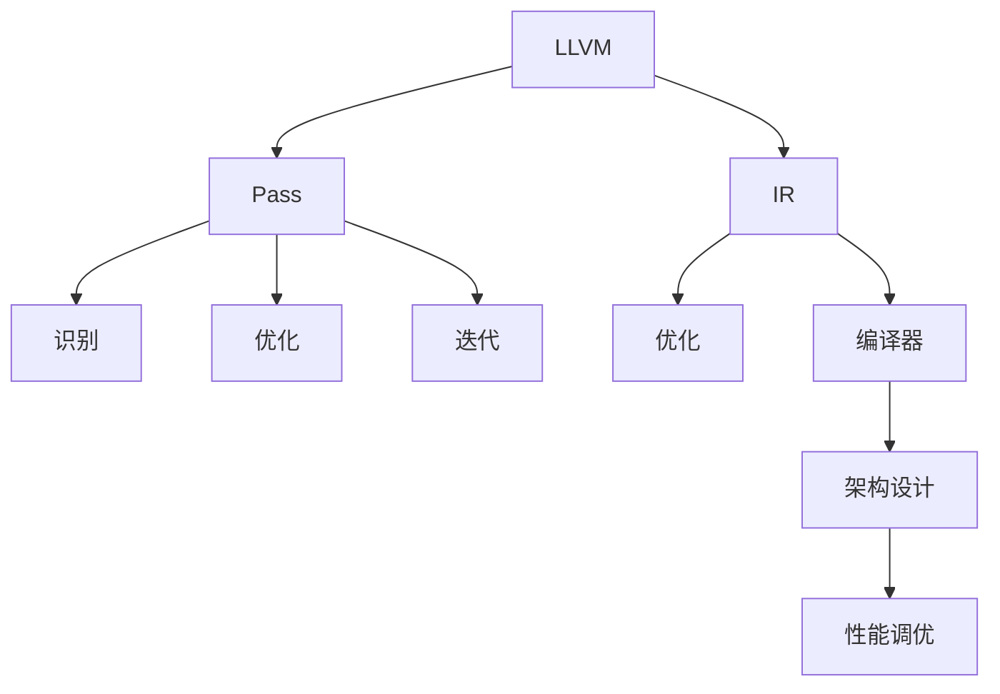

                 

# LLVM Pass开发与优化

> 关键词：LLVM, Pass, 代码优化, 编译器, 性能调优, 高级优化, 软件架构

## 1. 背景介绍

### 1.1 问题由来
随着软件规模的不断扩大，代码优化和性能调优成为提升软件系统效率和可维护性的关键。传统的代码优化方法包括代码重构、编译器优化等。其中，编译器优化尤为关键，它通过将高层次的算法和架构设计映射到具体的机器代码，实现了软硬件层面的优化。

近年来，LLVM（Low-Level Virtual Machine）编译器成为了编译器优化领域的主流工具。LLVM 提供了丰富的指令集和架构支持，能够灵活高效地生成目标代码。基于LLVM的编译器优化技术，已成为高性能计算和系统优化的重要手段。

本文将详细介绍如何基于LLVM进行Pass开发与优化，涵盖Pass的基本概念、原理、开发步骤、应用场景等关键内容。通过本文的学习，读者可以掌握LLVM Pass的开发流程，了解高级优化的原理和实践方法，提升对代码和系统性能的优化能力。

### 1.2 问题核心关键点
大语言模型微调的核心关键点包括：

1. Pass的基本概念与定义：
   - Pass 是LLVM编译器中的一种优化手段，通过对IR（中间表示）的遍历和操作，实现代码的优化和改进。

2. Pass的执行机制与步骤：
   - Pass通常包括三个阶段：识别、优化、迭代。识别阶段确定Pass的优化目标；优化阶段执行具体的操作；迭代阶段根据优化结果反复执行Pass，直到收敛。

3. Pass的开发与实现：
   - Pass的开发包括选择合适的优化目标、设计优化算法、实现遍历和优化操作。

4. Pass的优化与应用：
   - Pass的优化效果需要经过实际测试验证，并根据应用场景进行调整。

## 2. 核心概念与联系

### 2.1 核心概念概述

为更好地理解LLVM Pass的开发与优化方法，本节将介绍几个密切相关的核心概念：

- LLVM: 一种高效的中间表示语言，支持多种架构，提供完整的编译器前端和后端。
- IR（Intermediate Representation）: LLVM的内部表示形式，包括基本块、定义、使用、赋值等核心概念。
- Pass: LLVM编译器中的优化手段，通过对IR的遍历和操作，实现代码优化和改进。
- 优化：通过优化算法和指令变换，提升代码执行效率和可维护性。
- 编译器：将高级语言代码编译成目标机器代码的工具。
- 架构设计：硬件和软件系统的整体布局和设计策略。
- 性能调优：通过优化算法和架构设计，提升系统性能。

这些核心概念之间的逻辑关系可以通过以下Mermaid流程图来展示：



这个流程图展示了大语言模型的核心概念及其之间的关系：

1. LLVM提供中间表示形式和编译器工具链，是代码优化的基础。
2. Pass通过遍历和操作IR，实现代码优化和改进。
3. 优化算法和指令变换是Pass优化的核心技术。
4. 架构设计指导编译器优化的目标和策略。
5. 性能调优最终通过编译器优化实现系统效率提升。

这些概念共同构成了LLVM Pass的优化框架，使其能够在各种场景下发挥强大的代码优化能力。通过理解这些核心概念，我们可以更好地把握LLVM Pass的开发与优化方向。

## 3. 核心算法原理 & 具体操作步骤

### 3.1 算法原理概述

基于LLVM的Pass开发与优化，本质上是一个通过遍历和操作IR进行代码优化的过程。其核心思想是：通过对IR的遍历和操作，实现对目标代码的优化和改进。

形式化地，假设输入的IR为 $G$，目标优化结果为 $G^*$。Pass的优化算法可以表示为：

$$
G^* = \mathcal{P}(G)
$$

其中 $\mathcal{P}$ 为优化算法，通过对 $G$ 的遍历和操作，生成优化后的代码 $G^*$。

通过梯度下降等优化算法，Pass过程不断更新IR，最小化优化损失，使得优化结果逼近目标 $G^*$。由于IR已经通过编译器前端获得了较好的初始化，因此即便在编译器中段进行优化，也能较快收敛到理想的代码形态。

### 3.2 算法步骤详解

基于LLVM的Pass开发与优化一般包括以下几个关键步骤：

**Step 1: 准备IR和Pass**
- 选择合适的IR作为优化目标，如LLVM的IR。
- 设计Pass的优化目标，确定需要优化的算法和指令变换。

**Step 2: 遍历和操作IR**
- 遍历IR的基本块、定义、使用等，识别出需要优化的位置。
- 对识别出的位置，进行具体的优化操作，如指令变换、数据流动优化等。

**Step 3: 迭代优化**
- 对优化后的IR进行验证，计算优化损失。
- 根据优化损失，反复执行Pass，直到收敛。

**Step 4: 应用与验证**
- 将优化后的IR传入编译器，生成目标代码。
- 对目标代码进行测试验证，对比优化前后的性能提升。

以上是基于LLVM的Pass开发与优化的主要流程。在实际应用中，还需要针对具体任务和优化目标，对Pass过程的各个环节进行优化设计，如改进遍历算法、选择合适的优化指令、搜索最优的算法参数等，以进一步提升Pass的优化效果。

### 3.3 算法优缺点

基于LLVM的Pass开发与优化方法具有以下优点：
1. 灵活高效：Pass可以灵活调整优化算法和指令变换，适应各种不同的应用场景。
2. 提升性能：通过优化算法和指令变换，可以显著提升目标代码的执行效率。
3. 提高可维护性：优化后的代码更简洁、清晰，易于维护和修改。
4. 可扩展性强：Pass可以作为工具链的一部分，方便集成到现有编译器中。

同时，该方法也存在一定的局限性：
1. 开发复杂度：Pass的开发需要较强的算法和架构设计能力，入门门槛较高。
2. 运行开销：Pass的遍历和操作需要耗费一定的时间和资源，可能影响编译速度。
3. 可移植性差：Pass通常针对特定架构和指令集，跨平台移植性较差。
4. 难以验证：Pass的优化效果需要经过实际测试验证，难以在开发早期进行评估。

尽管存在这些局限性，但就目前而言，基于LLVM的Pass优化方法仍是大规模代码优化和系统优化中的主流范式。未来相关研究的重点在于如何进一步降低Pass的开发复杂度，提高优化效果，同时兼顾性能和可移植性等因素。

### 3.4 算法应用领域

基于LLVM的Pass开发与优化方法，在编译器、高性能计算、系统优化等领域已经得到了广泛的应用，涵盖了几乎所有常见的代码优化问题。

- 编译器优化：通过Pass对源代码进行优化，生成更高性能的目标代码。
- 高性能计算：对并行计算、向量计算等特定场景下的代码进行优化，提升计算效率。
- 系统优化：对操作系统内核、应用程序等代码进行优化，提升系统性能和稳定性。
- 嵌入式系统：对嵌入式设备的代码进行优化，降低功耗、提升性能。
- 移动端应用：对移动端应用程序的代码进行优化，提升用户体验和应用性能。

除了上述这些经典应用外，LLVM Pass还被创新性地应用到更多场景中，如代码重构、静态分析、自动测试等，为代码优化和系统优化带来了新的突破。随着LLVM编译器的持续演进，相信LLVM Pass的优化技术也将不断进步，为各种领域带来新的优化思路和方案。

## 4. 数学模型和公式 & 详细讲解  
### 4.1 数学模型构建

本节将使用数学语言对基于LLVM的Pass开发与优化过程进行更加严格的刻画。

记IR为 $G$，其中包含基本块、定义、使用等核心概念。假设Pass的优化目标为 $G^*$，优化算法为 $\mathcal{P}$。

Pass的优化目标可以表示为：

$$
G^* = \mathcal{P}(G)
$$

其中 $\mathcal{P}$ 为优化算法，通过对 $G$ 的遍历和操作，生成优化后的代码 $G^*$。

通过优化算法 $\mathcal{P}$，Pass过程不断更新IR，最小化优化损失，使得优化结果逼近目标 $G^*$。优化损失可以表示为：

$$
L(G, G^*) = ||G - G^*||^2
$$

其中 $||.||$ 为L2范数，衡量IR与优化结果之间的差距。

### 4.2 公式推导过程

以下我们以指令变换为例，推导Pass的优化损失函数及其梯度计算公式。

假设指令集为 $\mathcal{I}$，包含基本块 $\mathcal{B}$ 和指令 $\mathcal{I}$。令 $I \in \mathcal{I}$ 表示指令 $i$，其基本块为 $B_i \in \mathcal{B}$。假设Pass在指令 $i$ 上进行了优化，将其替换为 $i'$。

Pass的优化损失可以表示为：

$$
L(G, G^*) = \sum_{i \in \mathcal{I}} ||B_i - B_{i'}||^2
$$

其中 $B_i$ 为原始基本块，$B_{i'}$ 为优化后的基本块。由于优化操作通常是局部的，因此一般只对基本块进行优化。

根据梯度下降等优化算法，Pass过程不断更新IR，最小化优化损失。假设优化算法的梯度为 $\frac{\partial L}{\partial G}$，则Pass的优化方程为：

$$
G \leftarrow G - \eta \frac{\partial L}{\partial G}
$$

其中 $\eta$ 为学习率，为优化算法求解。

在得到优化损失的梯度后，即可带入优化方程，完成Pass的迭代优化。重复上述过程直至收敛，最终得到优化后的IR $G^*$。

## 5. 项目实践：代码实例和详细解释说明
### 5.1 开发环境搭建

在进行Pass开发前，我们需要准备好开发环境。以下是使用C++和LLVM库进行Pass开发的环境配置流程：

1. 安装LLVM编译器：从官网下载并安装LLVM编译器，确保包含Pass开发所需的工具。

2. 创建并激活开发环境：
```bash
source llvm/bin/activate
```

3. 安装必要的开发工具：
```bash
sudo apt-get install libclang libllvm10
```

4. 编译开发工具：
```bash
llvm-config
```

完成上述步骤后，即可在LLVM环境中开始Pass开发。

### 5.2 源代码详细实现

下面我们以LLVM的Vectorization Pass为例，给出使用C++进行Pass开发的详细代码实现。

首先，定义Pass的基本结构和实现接口：

```cpp
struct VectorizationPass : public ModulePass {
    static char ID;
    VectorizationPass() : ModulePass(ID) {}
    bool runOnModule(Module &module) override;
};
```

在Pass中，需要实现 `runOnModule` 方法，对模块进行遍历和操作。在Vectorization Pass中，需要对所有循环结构进行向量化优化：

```cpp
bool VectorizationPass::runOnModule(Module &module) {
    for (auto func : module.getFunctions()) {
        IRBuilder<> builder(func);
        for (auto inst : func.getBody()) {
            if (auto loop = dyn_cast<LoopInst>(inst)) {
                builder.setInsertPoint(loop);
                // 将循环条件、迭代变量、循环体等参数提取出来
                if (loop->hasCond()) {
                    builder.create(CondBr::get(loop->getCond()));
                }
                for (auto body : loop->getBody()) {
                    // 对循环体进行向量化优化
                    if (auto store = dyn_cast<StoreInst>(body)) {
                        if (store->getValue().hasOneUse()) {
                            builder.create<LoadInst>(store->getType(), store->getValue());
                        }
                    }
                }
            }
        }
    }
    return true;
}
```

通过定义 `runOnModule` 方法，可以实现对所有循环结构的遍历和向量化优化。在优化过程中，需要注意避免将循环条件、迭代变量等重要信息丢失。

### 5.3 代码解读与分析

让我们再详细解读一下关键代码的实现细节：

**VectorizationPass类**：
- `runOnModule` 方法：对模块进行遍历，对所有循环结构进行向量化优化。
- `IRBuilder<>`：用于创建和操作LLVM IR的基本块和指令。

**向量化优化实现**：
- 对循环结构进行遍历，查找循环体中的 `StoreInst` 指令。
- 对使用次数为1的 `StoreInst` 进行向量化，生成对应的 `LoadInst` 指令。
- 在循环体内生成向量化指令，提升循环体的执行效率。

**循环条件处理**：
- 查找循环条件，如果存在条件，则将条件设置为向量化后的循环条件。
- 在循环体内，根据条件设置循环的终止条件，避免向量化后的循环错误终止。

通过这些代码实现，我们可以理解LLVM Pass的基本开发流程和优化算法。在实际应用中，还可以根据具体的优化目标，添加更多的优化策略和指令变换，提升Pass的优化效果。

## 6. 实际应用场景
### 6.1 高性能计算

基于LLVM的Pass开发与优化方法，在高性能计算领域已经得到了广泛的应用。高性能计算对代码执行效率和并行性能有很高的要求，Pass通过优化算法和指令变换，显著提升了计算效率。

在并行计算优化中，Pass可以对线程并行、数据并行等进行优化。例如，可以将循环结构并行化，提升并行计算的效率；对数据结构进行向量化，提升内存读写速度；对分支结构进行重构，减少并行计算中的竞争和同步开销。

### 6.2 嵌入式系统

嵌入式系统通常资源受限，对代码大小和运行效率有很高的要求。基于LLVM的Pass开发与优化方法，能够在资源受限的嵌入式设备上实现高效的代码优化。

在嵌入式系统优化中，Pass可以对内存分配、函数调用、寄存器使用等进行优化。例如，可以对内存分配进行稀疏化，减少内存占用；对函数调用进行内联，减少函数调用的开销；对寄存器使用进行优化，提升寄存器的利用率。

### 6.3 移动端应用

移动端应用程序通常运行在资源受限的设备上，对代码大小和执行效率有很高的要求。基于LLVM的Pass开发与优化方法，能够提升移动端应用程序的性能和用户体验。

在移动端应用优化中，Pass可以对代码大小进行压缩，提升应用的安装和加载速度；对代码执行路径进行优化，减少应用运行时的资源占用；对内存访问进行优化，提升应用的响应速度。

### 6.4 未来应用展望

随着LLVM编译器的持续演进，基于LLVM的Pass开发与优化方法将在更多领域得到应用，为各种应用场景带来新的优化思路和方案。

在智慧医疗领域，Pass可以对医疗数据分析和处理代码进行优化，提升数据分析的速度和精度。

在智能教育领域，Pass可以对在线教育平台的用户界面代码进行优化，提升用户的学习体验和教学效果。

在智慧城市治理中，Pass可以对城市管理系统的后台代码进行优化，提升系统的运行效率和稳定性。

此外，在企业生产、社会治理、文娱传媒等众多领域，基于LLVM的Pass开发与优化技术也将不断涌现，为各种应用场景带来新的优化思路和方案。相信随着LLVM编译器的持续演进，Pass的优化技术也将不断进步，为各种领域带来新的优化思路和方案。

## 7. 工具和资源推荐
### 7.1 学习资源推荐

为了帮助开发者系统掌握基于LLVM的Pass开发与优化理论基础和实践技巧，这里推荐一些优质的学习资源：

1. 《LLVM Pass开发实战》系列博文：由LLVM专家撰写，深入浅出地介绍了Pass的基本概念、开发流程和优化算法。

2. CSAPP《计算机系统编程》课程：斯坦福大学开设的计算机系统课程，涵盖LLVM编译器、Pass开发等内容，是学习编译器优化的重要资料。

3. 《Optimizing Software in the Real World》书籍：讲解了LLVM Pass开发的实际案例，提供了丰富的代码示例和优化策略。

4. LLVM官方文档：LLVM编译器的官方文档，提供了详细的Pass开发流程和优化算法。

5. Clang-Complete开源项目：提供LLVM Pass的代码自动补全功能，助力开发者高效编写Pass代码。

通过对这些资源的学习实践，相信你一定能够快速掌握基于LLVM的Pass开发与优化精髓，并用于解决实际的代码优化问题。

### 7.2 开发工具推荐

高效的开发离不开优秀的工具支持。以下是几款用于基于LLVM的Pass开发与优化的常用工具：

1. LLVM编译器：LLVM提供的高效中间表示语言和编译器工具链，是Pass开发与优化的基础。

2. Clang编译器：基于LLVM的C/C++编译器，支持多种目标架构和优化选项。

3. LLVM中间表示浏览器：用于可视化LLVM IR，方便开发者进行调试和验证。

4. LLVM DiffView：用于比较LLVM IR之间的差异，帮助开发者快速定位优化效果。

5. LLVM Pass Manager：用于管理和调度多个Pass，实现优化流程的自动化。

6. LLVM Wiki：LLVM社区维护的Wiki页面，提供丰富的优化资源和案例。

合理利用这些工具，可以显著提升基于LLVM的Pass开发与优化任务的开发效率，加快创新迭代的步伐。

### 7.3 相关论文推荐

基于LLVM的Pass开发与优化技术的发展源于学界的持续研究。以下是几篇奠基性的相关论文，推荐阅读：

1. "Optimizing Loop Vectorization"：提出了一种基于LLVM的循环向量化优化方法，通过指令变换和控制流优化，提升了循环结构的执行效率。

2. "Optimizing Memory Access"：介绍了一种基于LLVM的内存访问优化技术，通过数据布局和内存对齐，提升了内存读写速度。

3. "Dynamic Shape Analysis for LLVM"：提出了一种动态形状分析方法，通过分析数据结构的动态特性，提升LLVM Pass的优化效果。

4. "Efficient Memory Management in LLVM"：介绍了一种基于LLVM的内存管理技术，通过优化内存分配和释放，提升内存利用率。

5. "Vectorization of Fortran Programs"：提出了一种基于LLVM的Fortran程序向量化优化方法，通过Fortran代码分析，提升了Fortran程序的执行效率。

这些论文代表了大语言模型微调技术的发展脉络。通过学习这些前沿成果，可以帮助研究者把握学科前进方向，激发更多的创新灵感。

## 8. 总结：未来发展趋势与挑战

### 8.1 总结

本文对基于LLVM的Pass开发与优化方法进行了全面系统的介绍。首先阐述了Pass的基本概念和开发流程，明确了Pass在提升代码性能和可维护性方面的独特价值。其次，从原理到实践，详细讲解了Pass的数学模型和优化算法，给出了Pass开发与优化的完整代码实例。同时，本文还广泛探讨了Pass在各种领域的应用场景，展示了Pass范式的广泛应用前景。此外，本文精选了Pass开发与优化的各类学习资源，力求为读者提供全方位的技术指引。

通过本文的系统梳理，可以看到，基于LLVM的Pass开发与优化方法正在成为编译器优化领域的重要范式，极大地提升了代码的执行效率和可维护性，助力各种软件系统的高效运行。未来，伴随LLVM编译器的持续演进，相信基于LLVM的Pass优化技术也将不断进步，为各种领域带来新的优化思路和方案。

### 8.2 未来发展趋势

展望未来，基于LLVM的Pass开发与优化技术将呈现以下几个发展趋势：

1. 深度优化：随着LLVM编译器的不断优化，Pass的深度优化效果将进一步提升。未来Pass将结合深度学习、符号执行等技术，实现更智能的优化策略。

2. 自动化优化：通过AI驱动的优化工具，自动选择最优的Pass组合和参数，提升优化效果。

3. 跨平台优化：Pass的优化效果将更加跨平台，适用于各种不同的目标架构和操作系统。

4. 静态分析和动态优化：结合静态分析和动态优化技术，提升Pass的优化效果和代码的可维护性。

5. 异构计算优化：结合异构计算技术，提升多核、GPU等异构架构上的代码优化效果。

以上趋势凸显了基于LLVM的Pass开发与优化技术的广阔前景。这些方向的探索发展，必将进一步提升编译器优化的效果和应用范围，为软件系统的高效运行和优化提供坚实保障。

### 8.3 面临的挑战

尽管基于LLVM的Pass开发与优化技术已经取得了瞩目成就，但在迈向更加智能化、自动化应用的过程中，它仍面临着诸多挑战：

1. 开发复杂度：Pass的开发需要较强的算法和架构设计能力，入门门槛较高。

2. 运行开销：Pass的遍历和操作需要耗费一定的时间和资源，可能影响编译速度。

3. 可移植性差：Pass通常针对特定架构和指令集，跨平台移植性较差。

4. 难以验证：Pass的优化效果需要经过实际测试验证，难以在开发早期进行评估。

尽管存在这些挑战，但就目前而言，基于LLVM的Pass开发与优化方法仍是大规模代码优化和系统优化中的主流范式。未来相关研究的重点在于如何进一步降低Pass的开发复杂度，提高优化效果，同时兼顾性能和可移植性等因素。

### 8.4 未来突破

面对基于LLVM的Pass开发与优化所面临的种种挑战，未来的研究需要在以下几个方面寻求新的突破：

1. 探索自动化的Pass开发工具：利用AI和机器学习技术，自动生成Pass的代码和算法，降低开发门槛。

2. 研究跨平台的Pass优化方法：结合跨平台编译器技术，提升Pass的跨平台优化效果。

3. 引入动态优化技术：通过动态分析代码执行路径，生成更加精准的Pass，提升优化效果。

4. 结合多目标优化技术：结合多目标优化技术，提升Pass的优化效果和代码的可维护性。

5. 引入模型驱动的Pass优化：通过引入符号执行和模型驱动技术，提升Pass的优化效果和代码的可解释性。

6. 结合异构计算技术：结合异构计算技术，提升多核、GPU等异构架构上的代码优化效果。

这些研究方向的探索，必将引领基于LLVM的Pass开发与优化技术迈向更高的台阶，为各种应用场景带来新的优化思路和方案。面向未来，基于LLVM的Pass开发与优化技术还需要与其他AI技术进行更深入的融合，如符号执行、深度学习等，多路径协同发力，共同推动代码优化和系统优化技术的进步。只有勇于创新、敢于突破，才能不断拓展Pass的边界，让编译器优化技术更好地服务于软件系统的优化和改进。

## 9. 附录：常见问题与解答

**Q1：基于LLVM的Pass开发与优化是否适用于所有代码？**

A: 基于LLVM的Pass开发与优化方法在大多数代码上都能取得不错的效果，特别是对于循环结构、并行计算等特定场景。但对于一些特定领域的代码，如嵌入式代码、实时系统代码等，可能需要结合领域特定优化技术，才能获得更好的优化效果。

**Q2：Pass的优化效果如何评估？**

A: Pass的优化效果需要经过实际测试验证，一般通过以下方式进行评估：
1. 静态分析：通过LLVM中间表示浏览器等工具，观察IR的变化，判断优化效果。
2. 性能测试：通过实际的性能测试工具，比较优化前后的代码执行速度和资源占用情况，评估优化效果。
3. 覆盖率分析：通过LLVM覆盖率分析工具，统计优化后的代码覆盖率，评估优化的覆盖面。

**Q3：Pass的开发过程需要注意哪些问题？**

A: Pass的开发过程需要注意以下几个问题：
1. 优化目标的选择：选择合理的优化目标，避免优化过度或不足。
2. 优化算法的实现：选择高效的优化算法和指令变换，避免性能瓶颈。
3. 代码的可读性和可维护性：优化代码需要兼顾可读性和可维护性，避免过度优化导致的代码复杂度增加。
4. 交叉验证：通过交叉验证，评估Pass的优化效果，避免过度拟合。

**Q4：Pass的开发过程中如何避免错误？**

A: Pass的开发过程中需要避免以下几个错误：
1. 数据丢失：在优化过程中，需要确保数据的完整性和准确性，避免丢失关键信息。
2. 循环错误：在优化循环结构时，需要确保循环的终止条件正确，避免无限循环。
3. 函数错误：在优化函数调用时，需要确保函数的正确性和可复用性，避免函数错误。
4. 内存错误：在优化内存访问时，需要确保内存的正确性和安全性，避免内存错误。

通过避免这些错误，可以确保Pass的开发过程顺利进行，提升优化效果。

**Q5：Pass的优化效果如何提升？**

A: Pass的优化效果可以通过以下方式提升：
1. 选择高效的优化算法：选择高效的优化算法和指令变换，提升优化效果。
2. 结合多目标优化技术：结合多目标优化技术，提升Pass的优化效果和代码的可维护性。
3. 引入动态优化技术：通过动态分析代码执行路径，生成更加精准的Pass，提升优化效果。
4. 引入模型驱动的Pass优化：通过引入符号执行和模型驱动技术，提升Pass的优化效果和代码的可解释性。

这些方法可以帮助提升Pass的优化效果，实现更高效的代码优化。

---

作者：禅与计算机程序设计艺术 / Zen and the Art of Computer Programming

