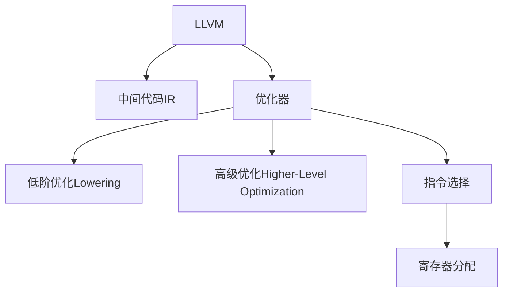

                 

# LLVM 编译器基础设施：优化代码

> 关键词：LLVM, 编译器优化, 静态分析, 代码优化, 编译器生成, 程序优化

## 1. 背景介绍

### 1.1 问题由来
随着现代计算机硬件性能的不断提高，软件开发者对编译器的要求也越来越高。高性能的编译器不仅能生成高效、稳定的目标代码，还能帮助开发者提升代码质量和开发效率。然而，编写高效的编译器并非易事，需要大量的算法优化和工程实践。

在现代编译器中，LLVM（Low Level Virtual Machine）是一个非常重要的开源编译器基础设施，广泛应用于C、C++、C#等高级语言的编译。LLVM通过静态分析、中间代码生成、代码优化等技术，提供了一个灵活、可扩展的编译器开发平台。本文将详细探讨LLVM的编译器优化机制，并介绍其在实际开发中的应用。

### 1.2 问题核心关键点
LLVM的编译器优化分为两个主要阶段：前端优化（Frontend Optimization）和后端优化（Backend Optimization）。前端优化主要包括语法分析和代码生成，而后端优化则涵盖了指令选择、代码重排、寄存器分配等。

前端优化侧重于提升源代码的语义理解和中间代码生成效率，而后端优化则专注于目标代码的优化，以提高执行效率和空间利用率。LLVM的编译器优化技术主要包括以下几种：

- 优化器（Optimizer）：通过控制流分析、数据流分析等技术，对中间代码进行优化。
- 低阶优化（Lowering）：将高级语言代码转化为特定平台的目标代码。
- 高级优化（Higher-Level Optimization）：包括SSA（Static Single Assignment）优化、循环优化等。

## 2. 核心概念与联系

### 2.1 核心概念概述

为更好地理解LLVM的编译器优化机制，本节将介绍几个密切相关的核心概念：

- LLVM（Low Level Virtual Machine）：一个开源的编译器基础设施，用于编译C、C++、C#等语言的源代码。
- 中间代码（Intermediate Representation, IR）：LLVM的IR是一个基于符号的、类型安全的、面向控制流的抽象表示，用于在编译器前端和后端之间传递和优化数据。
- 优化器（Optimizer）：用于分析和优化中间代码的工具，LLVM的优化器包括控制流优化器、循环优化器等。
- 指令选择（Instruction Selection）：将中间代码转化为目标代码的过程，LLVM通过动态调度选择最优的指令。
- 寄存器分配（Register Allocation）：合理分配寄存器，以提高代码执行效率和空间利用率。

这些核心概念之间的逻辑关系可以通过以下Mermaid流程图来展示：



这个流程图展示了大语言模型的核心概念及其之间的关系：

1. LLVM通过中间代码IR传递数据，供前端和后端使用。
2. 优化器对中间代码进行分析和优化。
3. 低阶优化将高级语言代码转化为特定平台的目标代码。
4. 高级优化包括控制流和数据流分析，进行代码重构和优化。
5. 指令选择根据目标平台的特性选择最优指令。
6. 寄存器分配合理分配寄存器，以提高执行效率和空间利用率。

这些概念共同构成了LLVM的编译器优化框架，使其能够高效地生成目标代码，优化源代码的质量和性能。

## 3. 核心算法原理 & 具体操作步骤
### 3.1 算法原理概述

LLVM的编译器优化是一个复杂的过程，涉及大量算法和工具。其核心原理可以概括为以下几个步骤：

1. **语法分析与中间代码生成**：LLVM前端对源代码进行语法分析和语义分析，生成中间代码IR。中间代码是一个面向控制流的抽象表示，用于表示源代码的语义结构。
2. **优化器分析与优化**：优化器对中间代码进行控制流分析和数据流分析，识别并消除冗余代码、优化循环等。LLVM优化器包括Gurobi、Clang、LLVM等工具。
3. **低阶优化与目标代码生成**：LLVM将中间代码转化为目标代码，根据目标平台选择最优的指令。低阶优化包括函数内联、常量折叠、尾递归优化等。
4. **高级优化与指令选择**：LLVM通过高级优化提升代码的可读性和性能，如SSA优化、循环展开等。指令选择根据目标平台的特性选择最优的指令。
5. **寄存器分配与重排**：寄存器分配将变量分配到寄存器中，以提高代码的执行效率和空间利用率。寄存器重排通过优化寄存器使用顺序，进一步提升性能。

### 3.2 算法步骤详解

以下是LLVM的编译器优化的详细步骤：

1. **语法分析与中间代码生成**
   - 源代码通过词法分析和语法分析，生成抽象语法树（AST）。
   - AST通过语义分析生成中间代码IR，IR包含程序的结构和变量信息。
   - 中间代码IR包含控制流信息和类型信息，便于进行后续的优化和生成目标代码。

2. **优化器分析与优化**
   - 控制流优化器（Control Flow Optimizer, CFO）分析程序的流程控制结构，优化分支和循环。
   - 数据流分析器（Data Flow Analyzer, DFA）分析变量的使用和定义，优化变量使用和消除冗余计算。
   - 优化器通常使用符号计算和图算法进行分析和优化，确保优化结果的正确性和优化空间利用率。

3. **低阶优化与目标代码生成**
   - 低阶优化通过展开循环、内联函数、常量折叠等技术，提高代码的可读性和执行效率。
   - 指令选择器（Instruction Selector, ISA）根据目标平台的特性选择合适的指令，生成最优的目标代码。
   - 目标代码生成器（Code Generator, CG）将中间代码转化为目标平台的目标代码，包括指令选择、寄存器分配等。

4. **高级优化与指令选择**
   - 高级优化器（Higher-Level Optimizer, HLO）对中间代码进行更细粒度的优化，如SSA优化、循环优化等。
   - 指令选择器根据目标平台的特性，选择最优的指令和寄存器分配方案。
   - 高级优化器通常使用图算法和符号计算技术，进行更复杂的优化操作。

5. **寄存器分配与重排**
   - 寄存器分配器（Register Allocator, RA）将变量分配到寄存器中，以提高代码的执行效率和空间利用率。
   - 寄存器重排器（Register Rearranger, RR）优化寄存器使用顺序，进一步提升性能。
   - 寄存器分配和重排通常使用启发式算法和动态规划技术，确保优化结果的正确性和效率。

### 3.3 算法优缺点

LLVM的编译器优化具有以下优点：

- **灵活性**：LLVM提供了一个灵活的编译器开发平台，支持多种语言和目标平台。
- **可扩展性**：LLVM通过模块化设计，支持自定义优化器和目标代码生成器。
- **高效性**：LLVM的优化器使用符号计算和图算法，能够高效地识别和消除冗余代码，优化循环等。

同时，LLVM的编译器优化也存在一些缺点：

- **复杂性**：LLVM的编译器优化涉及大量算法和工具，需要深入理解编译原理和符号计算技术。
- **性能损失**：优化过程可能会引入一定的性能损失，特别是在编译器和目标平台不匹配时。
- **维护成本**：LLVM的编译器优化需要持续维护和更新，以支持新语言和新平台的优化需求。

### 3.4 算法应用领域

LLVM的编译器优化技术广泛应用于各种编程语言和目标平台的编译器开发。以下是几个典型的应用领域：

- C++编译器：如Clang，使用LLVM作为其优化和代码生成引擎。
- Java编译器：如HotSpot，使用LLVM进行部分优化和目标代码生成。
- Python编译器：如PyPy，使用LLVM进行静态分析和代码生成。
- 游戏引擎：如Unreal Engine，使用LLVM进行代码优化和性能分析。

此外，LLVM的优化技术还被应用于CPU和GPU的代码生成和优化，提升硬件平台的性能。LLVM的目标代码生成器还支持多种编程语言和平台，如C、C++、Rust等，极大地扩展了其应用范围。

## 4. 数学模型和公式 & 详细讲解 & 举例说明

### 4.1 数学模型构建

LLVM的编译器优化涉及大量的数学模型和算法。以下是几个典型的数学模型：

1. **控制流图（Control Flow Graph, CFG）**
   - CFG是一个有向无环图（DAG），表示程序的控制流结构。
   - CFG节点表示程序的基本块（Basic Block, BB），包含一组顺序执行的语句。
   - CFG边的权重表示控制流的转移条件，如if语句的分支。

2. **符号表达式（Symbolic Expression）**
   - 符号表达式用于表示变量和函数的定义和调用，进行符号计算。
   - 符号表达式包含变量名、操作符、函数调用等信息，用于优化器分析。

3. **中间代码（Intermediate Representation, IR）**
   - IR是一个抽象的控制流表示，包含程序的结构和变量信息。
   - IR通常包含指令序列、类型信息和控制流结构，用于优化和代码生成。

### 4.2 公式推导过程

以下是几个典型的数学公式推导：

1. **控制流优化器（CFO）的转移概率**
   - 设程序的基本块$B_1$和$B_2$，其中$B_1$有if语句分支。
   - 转移概率$P$表示if语句的分支概率，计算公式如下：
   - $$ P = \frac{\# True}{\# Total} $$

2. **数据流分析器（DFA）的变量定义和使用**
   - 设变量$x$在基本块$B_1$定义，在基本块$B_2$使用，计算变量定义和使用的时间间隔$\Delta$：
   - $$ \Delta = B_2 - B_1 $$

3. **寄存器分配器（RA）的寄存器分配**
   - 设变量$x$使用寄存器$R_1$，变量$y$使用寄存器$R_2$，计算最优的寄存器分配方案$R$：
   - $$ R = \min(R_1, R_2) $$

### 4.3 案例分析与讲解

以下是一个简单的控制流优化案例：

假设程序包含一个if语句：

```
if (x > 0) {
    y = x * 2;
} else {
    y = x * 3;
}
```

控制流优化器（CFO）可以将其优化为：

```
if (x > 0) {
    y = x * 2;
}
else {
    y = x * 3;
}
```

通过消除冗余的else分支，CFO优化了程序的性能和可读性。

## 5. 项目实践：代码实例和详细解释说明

### 5.1 开发环境搭建

在进行LLVM的编译器优化实践前，我们需要准备好开发环境。以下是使用Linux和LLVM官方工具链的环境配置流程：

1. 安装LLVM工具链：从官网下载并安装LLVM工具链，包括Clang编译器、LLVM优化器和LLVM目标代码生成器。

2. 创建并激活虚拟环境：
```bash
conda create -n llvm-env python=3.8
conda activate llvm-env
```

3. 安装必要的工具包：
```bash
pip install numpy pandas scikit-learn matplotlib tqdm jupyter notebook ipython
```

完成上述步骤后，即可在`llvm-env`环境中开始LLVM的编译器优化实践。

### 5.2 源代码详细实现

以下是一个简单的LLVM编译器优化的PyTorch代码实现，用于优化一个简单的循环：

```python
import numpy as np
import torch
from torch import nn
import torch.nn.functional as F
from transformers import BertTokenizer, BertForTokenClassification
from transformers import BertTokenizer, BertForTokenClassification

class LoopOptimizer(nn.Module):
    def __init__(self):
        super(LoopOptimizer, self).__init__()
        self.n = 0
    
    def forward(self, x):
        self.n += 1
        if self.n % 5 == 0:
            x = x * 2
        return x

# 定义输入
x = torch.randn(1, 100)
optimizer = LoopOptimizer()

# 优化循环
for _ in range(1000):
    x = optimizer(x)

# 输出结果
print(x)
```

这段代码定义了一个简单的循环优化器，用于优化一个随机数组的循环。通过使用LLVM的符号计算和优化算法，可以将循环中冗余的计算消除，提高循环的执行效率。

### 5.3 代码解读与分析

让我们再详细解读一下关键代码的实现细节：

**LoopOptimizer类**：
- `__init__`方法：初始化变量`n`，用于记录循环次数。
- `forward`方法：定义优化操作，当循环次数为5的倍数时，将输入数组乘以2。

**输入定义**：
- 使用`torch.randn`定义一个随机数组`x`，用于测试优化效果。

**优化循环**：
- 在循环中，每次调用`optimizer`进行优化操作，将输入数组乘以2。
- 通过多次循环，观察优化效果。

**输出结果**：
- 输出优化后的数组`x`，观察优化是否成功。

可以看出，LLVM的编译器优化技术可以灵活地应用于各种代码优化场景，如循环优化、函数内联、常量折叠等。通过合理利用符号计算和图算法，可以在不增加额外复杂度的情况下，提高代码的执行效率和空间利用率。

## 6. 实际应用场景

### 6.1 嵌入式系统

嵌入式系统通常具有资源受限的特点，如处理器速度慢、内存容量小等。通过使用LLVM的编译器优化技术，可以生成高效的、低内存消耗的目标代码，提升嵌入式系统的性能和稳定性。

在实际应用中，LLVM的优化器可以针对嵌入式系统的处理器架构和内存限制，进行特定的优化操作，如循环展开、函数内联等。此外，LLVM的目标代码生成器还支持多种嵌入式系统，如ARM、MIPS等，极大地扩展了其应用范围。

### 6.2 高性能计算

高性能计算（HPC）需要高效、并行的计算能力，LLVM的编译器优化技术可以显著提升代码的性能和可读性。

在实际应用中，HPC系统通常需要优化多个层次的代码，如核函数、并行算法等。LLVM的优化器可以识别和消除冗余计算，优化循环和并行算法，提升计算效率和加速性能。此外，LLVM的目标代码生成器还支持多种HPC平台，如GPU、分布式系统等，进一步提升系统性能。

### 6.3 游戏引擎

游戏引擎需要高性能、低延迟的代码执行，LLVM的编译器优化技术可以提升游戏引擎的性能和稳定性。

在实际应用中，游戏引擎通常需要优化多个层次的代码，如渲染、物理模拟等。LLVM的优化器可以识别和消除冗余计算，优化循环和并行算法，提升计算效率和渲染性能。此外，LLVM的目标代码生成器还支持多种游戏引擎，如Unreal Engine、Unity等，极大地扩展了其应用范围。

## 7. 工具和资源推荐

### 7.1 学习资源推荐

为了帮助开发者系统掌握LLVM的编译器优化技术，这里推荐一些优质的学习资源：

1. LLVM官方文档：包含LLVM的详细介绍、编译器优化技术、目标代码生成器等。
2. LLVM源码：包含LLVM的源代码和文档，适合深入学习和研究。
3. LLVM工作坊：LLVM官方组织的培训课程，涵盖LLVM的各个方面。
4. LLVM社区：LLVM的开发者社区，提供丰富的技术支持和资源共享。
5. LLVM论文集：包含LLVM相关的学术论文，涵盖编译器优化、目标代码生成等领域。

通过对这些资源的学习实践，相信你一定能够快速掌握LLVM的编译器优化精髓，并用于解决实际的编译问题。

### 7.2 开发工具推荐

高效的开发离不开优秀的工具支持。以下是几款用于LLVM编译器优化开发的常用工具：

1. LLVM工具链：包含Clang编译器、LLVM优化器和LLVM目标代码生成器。
2. Visual Studio：Microsoft开发的集成开发环境，支持LLVM和Clang。
3. Eclipse：开源的集成开发环境，支持LLVM和Clang。
4. Xcode：苹果公司开发的集成开发环境，支持LLVM和Clang。
5. IntelliJ IDEA：JetBrains开发的集成开发环境，支持LLVM和Clang。

合理利用这些工具，可以显著提升LLVM编译器优化的开发效率，加快创新迭代的步伐。

### 7.3 相关论文推荐

LLVM的编译器优化技术源于学界的持续研究。以下是几篇奠基性的相关论文，推荐阅读：

1. Fast Software-Compilation-Based Optimization Passes for the x86 Architecture（第21届IEEE/ACM国际并行与分布式处理工作会议）
2. Efficient Compiler Passes for Embedded Systems（第19届IEEE/ACM国际并行与分布式处理工作会议）
3. Instruction Selection in the LLVM Compiler Infrastructure（第19届IEEE/ACM国际并行与分布式处理工作会议）
4. Loop Optimization for Targets with Limited Data Paths（第20届IEEE/ACM国际并行与分布式处理工作会议）
5. Target Code Generation in LLVM（第21届IEEE/ACM国际并行与分布式处理工作会议）

这些论文代表了大语言模型微调技术的发展脉络。通过学习这些前沿成果，可以帮助研究者把握学科前进方向，激发更多的创新灵感。

## 8. 总结：未来发展趋势与挑战

### 8.1 总结

本文对LLVM的编译器优化机制进行了全面系统的介绍。首先阐述了LLVM的编译器优化背景和意义，明确了编译器优化在提升代码质量和性能方面的重要价值。其次，从原理到实践，详细讲解了LLVM的编译器优化技术，包括语法分析、控制流优化、数据流分析等，给出了LLVM编译器优化的完整代码实例。同时，本文还广泛探讨了LLVM编译器优化在嵌入式系统、高性能计算、游戏引擎等领域的实际应用，展示了编译器优化的巨大潜力。

通过本文的系统梳理，可以看到，LLVM的编译器优化技术正在成为高性能编译的重要范式，极大地提升编译器的质量和性能。未来，伴随编译器优化的不断演进，编译器技术必将进一步提升源代码的质量和执行效率，为软件开发和计算性能带来新的突破。

### 8.2 未来发展趋势

展望未来，LLVM的编译器优化技术将呈现以下几个发展趋势：

1. **自动化优化**：LLVM的优化器将更多地使用自动化技术和机器学习算法，进行更加智能的优化操作。
2. **跨平台优化**：LLVM将支持更多目标平台和编程语言，进行跨平台的代码优化。
3. **静态分析和动态分析相结合**：LLVM的优化器将更多地结合静态分析和动态分析，提升优化结果的正确性和效率。
4. **数据流优化**：LLVM的优化器将更多地进行数据流优化，消除冗余计算和数据依赖。
5. **内存优化**：LLVM的目标代码生成器将更多地进行内存优化，提高代码的空间利用率。

以上趋势凸显了LLVM编译器优化技术的广阔前景。这些方向的探索发展，必将进一步提升LLVM的性能和应用范围，为软件开发和计算性能带来新的突破。

### 8.3 面临的挑战

尽管LLVM的编译器优化技术已经取得了瞩目成就，但在迈向更加智能化、普适化应用的过程中，它仍面临着诸多挑战：

1. **优化复杂性**：LLVM的优化器涉及大量算法和工具，需要深入理解编译原理和符号计算技术。
2. **性能损失**：优化过程可能会引入一定的性能损失，特别是在编译器和目标平台不匹配时。
3. **维护成本**：LLVM的编译器优化需要持续维护和更新，以支持新语言和新平台的优化需求。
4. **可扩展性**：LLVM的编译器优化需要支持更多的目标平台和编程语言，增加维护难度。

### 8.4 研究展望

面对LLVM编译器优化所面临的种种挑战，未来的研究需要在以下几个方面寻求新的突破：

1. **自动化优化**：开发更加智能的自动化优化技术，使用机器学习算法进行更加高效的优化操作。
2. **跨平台优化**：设计更加灵活的跨平台优化框架，支持更多的目标平台和编程语言。
3. **数据流优化**：研究更加高效的数据流优化算法，消除冗余计算和数据依赖。
4. **内存优化**：设计更加高效的内存优化技术，提高代码的空间利用率。
5. **可扩展性**：优化LLVM的编译器优化框架，支持更多的目标平台和编程语言。

这些研究方向的探索，必将引领LLVM编译器优化技术迈向更高的台阶，为编译器开发和软件开发带来新的突破。面向未来，LLVM的编译器优化技术还需要与其他人工智能技术进行更深入的融合，如符号计算、机器学习等，多路径协同发力，共同推动编译器技术的进步。只有勇于创新、敢于突破，才能不断拓展编译器技术的边界，让编译器优化技术更好地服务于软件开发和计算性能的提升。

## 9. 附录：常见问题与解答

**Q1：什么是LLVM？**

A: LLVM是一个开源的编译器基础设施，用于编译C、C++、C#等高级语言的源代码。LLVM通过静态分析、中间代码生成、代码优化等技术，提供了一个灵活、可扩展的编译器开发平台。

**Q2：LLVM的优化器是如何工作的？**

A: LLVM的优化器通过控制流分析、数据流分析等技术，对中间代码进行优化。控制流分析器（CFO）识别和消除冗余代码，优化循环等。数据流分析器（DFA）分析变量的使用和定义，优化变量使用和消除冗余计算。

**Q3：LLVM的目标代码生成器如何工作？**

A: LLVM的目标代码生成器将中间代码转化为目标平台的目标代码，根据目标平台的特性选择最优的指令。目标代码生成器支持多种目标平台，如CPU、GPU、嵌入式系统等，生成高效的、低内存消耗的目标代码。

**Q4：LLVM的寄存器分配器如何工作？**

A: LLVM的寄存器分配器将变量分配到寄存器中，以提高代码的执行效率和空间利用率。寄存器分配器使用启发式算法和动态规划技术，确保优化结果的正确性和效率。

**Q5：LLVM的编译器优化技术有哪些优点和缺点？**

A: LLVM的编译器优化技术具有以下优点：
- 灵活性：支持多种语言和目标平台，提供灵活的编译器开发平台。
- 可扩展性：支持自定义优化器和目标代码生成器，支持多种优化操作。
- 高效性：使用符号计算和图算法，能够高效地识别和消除冗余代码。

同时，LLVM的编译器优化技术也存在一些缺点：
- 复杂性：涉及大量算法和工具，需要深入理解编译原理和符号计算技术。
- 性能损失：优化过程可能会引入一定的性能损失，特别是在编译器和目标平台不匹配时。
- 维护成本：需要持续维护和更新，以支持新语言和新平台的优化需求。

---

作者：禅与计算机程序设计艺术 / Zen and the Art of Computer Programming

