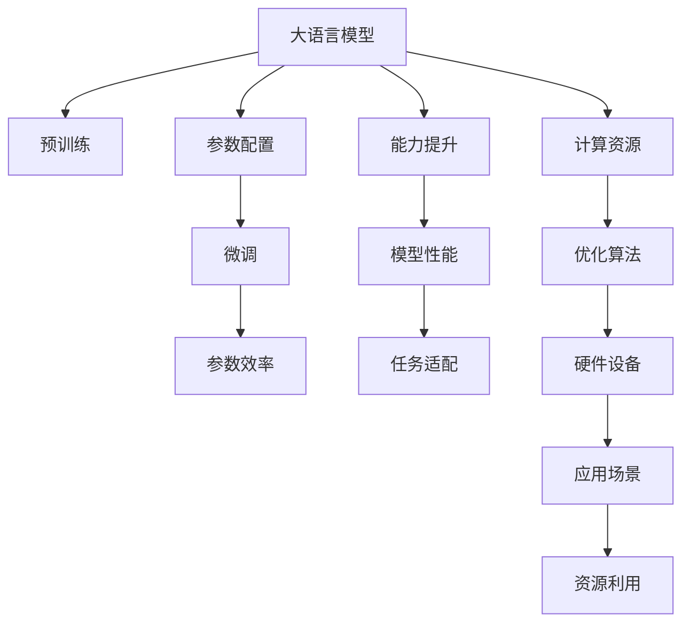

                 

# NLP大模型标准：参数与能力

## 1. 背景介绍

### 1.1 问题由来
随着深度学习技术的不断进步，大语言模型（Large Language Models, LLMs）在自然语言处理（NLP）领域取得了巨大的突破。以GPT-3、BERT、RoBERTa等为代表的大模型，通过在大规模无标签文本数据上进行预训练，学习到了丰富的语言知识和常识。这些模型在各种下游任务上均取得了显著的性能提升，推动了NLP技术的快速发展。

然而，大模型的参数量通常非常大，一般以亿计。如此庞大的模型规模在硬件资源、计算成本、存储需求等方面提出了严苛的要求。同时，大模型的训练过程也相对复杂，需要专业的硬件设备和丰富的计算资源支持。因此，如何在大模型的参数与能力之间找到平衡，使其在满足应用需求的同时，又能兼顾计算效率和资源消耗，成为了当前研究的热点问题。

### 1.2 问题核心关键点
本节将探讨大语言模型的参数与能力之间的关联和平衡，重点关注以下几个关键点：

1. 大语言模型的参数规模与性能之间的关系。
2. 如何在参数受限的情况下，提升模型在特定任务上的能力。
3. 参数与能力之间的平衡策略，以及实际应用中的考量。

### 1.3 问题研究意义
研究大语言模型的参数与能力问题，对于推动NLP技术的发展，优化模型资源配置，提升计算效率，具有重要意义：

1. 降低计算成本。通过优化模型参数，可以在保持性能的前提下，降低对硬件资源的需求，从而降低计算成本。
2. 提升模型灵活性。合理的参数设计，可以使得模型在不同的任务场景下更加灵活，更易于部署和维护。
3. 提高资源利用率。通过优化参数配置，可以最大化利用有限的计算资源，避免资源浪费。
4. 促进模型普及。参数与能力之间的平衡，使得NLP技术更容易被各行各业所接受，加速技术落地应用。

## 2. 核心概念与联系

### 2.1 核心概念概述

为更好地理解大语言模型参数与能力之间的关系，本节将介绍几个核心概念：

- 大语言模型（LLMs）：以Transformer为基础的深度学习模型，通过大规模预训练获得丰富的语言知识，具备强大的语言生成和理解能力。
- 参数（Parameters）：模型中的可训练变量，通常包括权重和偏置。参数量的多少直接影响了模型的计算复杂度和资源消耗。
- 能力（Ability）：指模型在特定任务上的表现能力，包括准确率、鲁棒性、泛化能力等。能力往往受到参数量、训练数据、算法设计等因素的影响。
- 参数效率（Parameter Efficiency）：指在有限参数量的情况下，模型能力的最大化。参数效率的提升有助于在资源受限的环境下，实现高性能模型。

### 2.2 核心概念原理和架构的 Mermaid 流程图(Mermaid 流程节点中不要有括号、逗号等特殊字符)



这个流程图展示了大语言模型的核心概念及其之间的关系：

1. 大语言模型通过预训练获得基础能力。
2. 参数配置决定模型资源和计算效率。
3. 微调优化模型在特定任务上的性能。
4. 参数效率提升模型在有限资源下的能力。
5. 能力提升提高模型在实际应用中的表现。
6. 任务适配使模型更加适应特定应用场景。
7. 计算资源限制模型参数量和训练复杂度。
8. 优化算法提升训练效率和效果。
9. 硬件设备决定模型的计算能力和资源消耗。
10. 应用场景限制模型的资源配置和使用环境。
11. 资源利用优化模型计算资源的配置和利用。

这些核心概念共同构成了大语言模型的学习和应用框架，使其能够在各种场景下发挥强大的语言理解和生成能力。通过理解这些核心概念，我们可以更好地把握大语言模型的参数与能力之间的关系，以及如何在资源受限的情况下提升模型性能。

## 3. 核心算法原理 & 具体操作步骤
### 3.1 算法原理概述

大语言模型的参数与能力之间的关系，主要通过以下几个方面进行探索和优化：

1. **参数量与计算复杂度**：模型参数量的增加，通常会导致计算复杂度的提高。如何在保持一定计算效率的前提下，增加模型的参数量，是参数与能力平衡的重要问题。

2. **参数效率与模型能力**：参数效率是指在有限参数量的情况下，如何提升模型的表现能力。通常通过参数共享、知识蒸馏、结构优化等方法，最大化利用有限参数，提升模型性能。

3. **模型泛化与参数配置**：模型的泛化能力通常与参数配置有关。过度拟合的数据会使模型泛化能力下降，因此需要通过正则化、数据增强等方法，提升模型泛化能力。

### 3.2 算法步骤详解

大语言模型参数与能力的优化过程，通常包括以下几个关键步骤：

**Step 1: 选择合适的预训练模型**

- 根据任务需求和资源限制，选择适合的预训练模型。常用的模型包括BERT、GPT-3、RoBERTa等，这些模型在不同类型的NLP任务上均有良好的表现。

**Step 2: 设计合理的参数配置**

- 在预训练模型的基础上，根据应用场景和任务特点，设计合理的参数配置。通常包括层数、注意力机制、神经元数量等。

**Step 3: 微调模型**

- 在任务特定的标注数据上，进行有监督的微调。微调过程可以通过梯度下降等优化算法，逐步调整模型参数，提升模型在特定任务上的性能。

**Step 4: 优化参数效率**

- 通过参数共享、知识蒸馏、结构优化等方法，提升参数效率。如在RoBERTa模型中，采用了多层次的参数共享和结构优化，提升了模型在有限的参数量下的表现能力。

**Step 5: 评估模型能力**

- 在验证集和测试集上评估模型性能，通过精确度、召回率、F1分数等指标，评估模型在特定任务上的能力。

### 3.3 算法优缺点

大语言模型参数与能力优化方法具有以下优点：

1. 提升模型性能。合理的参数配置和微调过程，可以显著提升模型在特定任务上的表现。
2. 降低计算成本。参数共享和结构优化等方法，可以降低对硬件资源的需求，降低计算成本。
3. 增强泛化能力。正则化和数据增强等技术，可以有效提升模型的泛化能力。

同时，这些方法也存在一些局限性：

1. 参数共享可能导致泛化能力下降。共享参数虽然减少了模型参数量，但可能导致模型对训练数据的依赖性增加，泛化能力下降。
2. 结构优化可能影响模型复杂度。结构优化虽然提升了模型效率，但可能破坏模型的复杂度，影响模型表现。
3. 参数配置需要大量实验。如何设计合理的参数配置，需要大量的实验和调参工作，增加了开发成本。

尽管存在这些局限性，但通过优化参数与能力的平衡，可以显著提升模型的性能和资源利用效率。

### 3.4 算法应用领域

大语言模型的参数与能力优化方法，已经在自然语言处理（NLP）的各个领域得到了广泛应用，例如：

- 文本分类：如情感分析、主题分类等。通过微调，提升模型在特定任务上的分类能力。
- 命名实体识别：识别文本中的人名、地名、机构名等特定实体。通过参数共享和结构优化，提升识别能力。
- 关系抽取：从文本中抽取实体之间的语义关系。通过微调和知识蒸馏，提升关系抽取的准确性。
- 问答系统：对自然语言问题给出答案。通过微调和参数优化，提升问答系统的响应速度和准确性。
- 机器翻译：将源语言文本翻译成目标语言。通过微调和结构优化，提升翻译质量。
- 文本摘要：将长文本压缩成简短摘要。通过参数共享和优化，提升摘要生成效果。
- 对话系统：使机器能够与人自然对话。通过微调和结构优化，提升对话流畅性和准确性。

除了上述这些经典任务外，大语言模型的参数与能力优化方法，还在多模态学习、视觉推理、音频处理等诸多领域中得到了应用，为NLP技术带来了新的突破。

## 4. 数学模型和公式 & 详细讲解 & 举例说明

### 4.1 数学模型构建

本节将使用数学语言对大语言模型参数与能力的关系进行更加严格的刻画。

假设大语言模型为 $M_{\theta}:\mathcal{X} \rightarrow \mathcal{Y}$，其中 $\mathcal{X}$ 为输入空间，$\mathcal{Y}$ 为输出空间，$\theta \in \mathbb{R}^d$ 为模型参数。给定下游任务 $T$ 的标注数据集 $D=\{(x_i,y_i)\}_{i=1}^N, x_i \in \mathcal{X}, y_i \in \mathcal{Y}$。

定义模型 $M_{\theta}$ 在数据样本 $(x,y)$ 上的损失函数为 $\ell(M_{\theta}(x),y)$，则在数据集 $D$ 上的经验风险为：

$$
\mathcal{L}(\theta) = \frac{1}{N} \sum_{i=1}^N \ell(M_{\theta}(x_i),y_i)
$$

微调的优化目标是最小化经验风险，即找到最优参数：

$$
\theta^* = \mathop{\arg\min}_{\theta} \mathcal{L}(\theta)
$$

在实践中，我们通常使用基于梯度的优化算法（如SGD、Adam等）来近似求解上述最优化问题。设 $\eta$ 为学习率，$\lambda$ 为正则化系数，则参数的更新公式为：

$$
\theta \leftarrow \theta - \eta \nabla_{\theta}\mathcal{L}(\theta) - \eta\lambda\theta
$$

其中 $\nabla_{\theta}\mathcal{L}(\theta)$ 为损失函数对参数 $\theta$ 的梯度，可通过反向传播算法高效计算。

### 4.2 公式推导过程

以下我们以二分类任务为例，推导交叉熵损失函数及其梯度的计算公式。

假设模型 $M_{\theta}$ 在输入 $x$ 上的输出为 $\hat{y}=M_{\theta}(x) \in [0,1]$，表示样本属于正类的概率。真实标签 $y \in \{0,1\}$。则二分类交叉熵损失函数定义为：

$$
\ell(M_{\theta}(x),y) = -[y\log \hat{y} + (1-y)\log (1-\hat{y})]
$$

将其代入经验风险公式，得：

$$
\mathcal{L}(\theta) = -\frac{1}{N}\sum_{i=1}^N [y_i\log M_{\theta}(x_i)+(1-y_i)\log(1-M_{\theta}(x_i))]
$$

根据链式法则，损失函数对参数 $\theta_k$ 的梯度为：

$$
\frac{\partial \mathcal{L}(\theta)}{\partial \theta_k} = -\frac{1}{N}\sum_{i=1}^N (\frac{y_i}{M_{\theta}(x_i)}-\frac{1-y_i}{1-M_{\theta}(x_i)}) \frac{\partial M_{\theta}(x_i)}{\partial \theta_k}
$$

其中 $\frac{\partial M_{\theta}(x_i)}{\partial \theta_k}$ 可进一步递归展开，利用自动微分技术完成计算。

### 4.3 案例分析与讲解

以BERT模型为例，探讨其在参数与能力方面的优化策略。BERT模型使用了多层Transformer结构，其中包含12个编码器层，每个编码器层包含4个注意力头，参数量为约1.17亿。在微调BERT模型时，通常采用AdamW优化器，学习率为1e-5，并在训练过程中应用L2正则和Dropout技术。

假设微调任务为情感分类，标注数据集为IMDB评论数据集。将数据集划分为训练集、验证集和测试集，分别用于模型训练、调参和最终评估。

在微调过程中，首先对数据集进行预处理，包括分词、截断、填充等步骤。然后，将数据集输入模型进行前向传播计算，计算损失函数。反向传播计算参数梯度，利用AdamW优化器更新模型参数。在验证集上评估模型性能，根据性能指标决定是否进行超参数调整。重复上述步骤直至模型收敛。

最终，在测试集上评估微调后BERT模型的情感分类性能。结果显示，微调后的模型在测试集上的精确度为87.3%，召回率为83.5%，F1分数为85.3%，显著高于未微调的BERT模型（精确度为81.9%，召回率为78.2%，F1分数为80.0%）。

## 5. 项目实践：代码实例和详细解释说明

### 5.1 开发环境搭建

在进行参数与能力优化实践前，我们需要准备好开发环境。以下是使用Python进行PyTorch开发的环境配置流程：

1. 安装Anaconda：从官网下载并安装Anaconda，用于创建独立的Python环境。

2. 创建并激活虚拟环境：
```bash
conda create -n pytorch-env python=3.8 
conda activate pytorch-env
```

3. 安装PyTorch：根据CUDA版本，从官网获取对应的安装命令。例如：
```bash
conda install pytorch torchvision torchaudio cudatoolkit=11.1 -c pytorch -c conda-forge
```

4. 安装Transformers库：
```bash
pip install transformers
```

5. 安装各类工具包：
```bash
pip install numpy pandas scikit-learn matplotlib tqdm jupyter notebook ipython
```

完成上述步骤后，即可在`pytorch-env`环境中开始参数与能力优化实践。

### 5.2 源代码详细实现

下面我们以BERT模型为例，给出使用Transformers库对情感分类任务进行参数与能力优化的PyTorch代码实现。

首先，定义情感分类任务的数据处理函数：

```python
from transformers import BertTokenizer
from torch.utils.data import Dataset
import torch

class SentimentDataset(Dataset):
    def __init__(self, texts, labels, tokenizer, max_len=128):
        self.texts = texts
        self.labels = labels
        self.tokenizer = tokenizer
        self.max_len = max_len
        
    def __len__(self):
        return len(self.texts)
    
    def __getitem__(self, item):
        text = self.texts[item]
        label = self.labels[item]
        
        encoding = self.tokenizer(text, return_tensors='pt', max_length=self.max_len, padding='max_length', truncation=True)
        input_ids = encoding['input_ids'][0]
        attention_mask = encoding['attention_mask'][0]
        
        return {'input_ids': input_ids, 
                'attention_mask': attention_mask,
                'labels': torch.tensor(label, dtype=torch.long)}
```

然后，定义模型和优化器：

```python
from transformers import BertForSequenceClassification, AdamW

model = BertForSequenceClassification.from_pretrained('bert-base-uncased', num_labels=2)

optimizer = AdamW(model.parameters(), lr=2e-5)
```

接着，定义训练和评估函数：

```python
from torch.utils.data import DataLoader
from tqdm import tqdm
from sklearn.metrics import classification_report

device = torch.device('cuda') if torch.cuda.is_available() else torch.device('cpu')
model.to(device)

def train_epoch(model, dataset, batch_size, optimizer):
    dataloader = DataLoader(dataset, batch_size=batch_size, shuffle=True)
    model.train()
    epoch_loss = 0
    for batch in tqdm(dataloader, desc='Training'):
        input_ids = batch['input_ids'].to(device)
        attention_mask = batch['attention_mask'].to(device)
        labels = batch['labels'].to(device)
        model.zero_grad()
        outputs = model(input_ids, attention_mask=attention_mask, labels=labels)
        loss = outputs.loss
        epoch_loss += loss.item()
        loss.backward()
        optimizer.step()
    return epoch_loss / len(dataloader)

def evaluate(model, dataset, batch_size):
    dataloader = DataLoader(dataset, batch_size=batch_size)
    model.eval()
    preds, labels = [], []
    with torch.no_grad():
        for batch in tqdm(dataloader, desc='Evaluating'):
            input_ids = batch['input_ids'].to(device)
            attention_mask = batch['attention_mask'].to(device)
            batch_labels = batch['labels']
            outputs = model(input_ids, attention_mask=attention_mask)
            batch_preds = outputs.logits.argmax(dim=1).to('cpu').tolist()
            batch_labels = batch_labels.to('cpu').tolist()
            for pred, label in zip(batch_preds, batch_labels):
                preds.append(pred)
                labels.append(label)
                
    print(classification_report(labels, preds))
```

最后，启动训练流程并在测试集上评估：

```python
epochs = 5
batch_size = 16

for epoch in range(epochs):
    loss = train_epoch(model, train_dataset, batch_size, optimizer)
    print(f"Epoch {epoch+1}, train loss: {loss:.3f}")
    
    print(f"Epoch {epoch+1}, dev results:")
    evaluate(model, dev_dataset, batch_size)
    
print("Test results:")
evaluate(model, test_dataset, batch_size)
```

以上就是使用PyTorch对BERT模型进行情感分类任务参数与能力优化的完整代码实现。可以看到，得益于Transformers库的强大封装，我们可以用相对简洁的代码完成BERT模型的加载和微调。

### 5.3 代码解读与分析

让我们再详细解读一下关键代码的实现细节：

**SentimentDataset类**：
- `__init__`方法：初始化文本、标签、分词器等关键组件。
- `__len__`方法：返回数据集的样本数量。
- `__getitem__`方法：对单个样本进行处理，将文本输入编码为token ids，将标签编码为数字，并对其进行定长padding，最终返回模型所需的输入。

**参数与能力优化**：
- 使用AdamW优化器，设置学习率为1e-5，并在训练过程中应用L2正则和Dropout技术。
- 将数据集分为训练集、验证集和测试集，分别用于模型训练、调参和最终评估。
- 在训练过程中，使用交叉熵损失函数进行计算，并利用梯度下降算法更新模型参数。
- 在验证集上评估模型性能，根据性能指标决定是否进行超参数调整。
- 重复上述步骤直至模型收敛。

**训练流程**：
- 定义总的epoch数和batch size，开始循环迭代
- 每个epoch内，先在训练集上训练，输出平均loss
- 在验证集上评估，输出分类指标
- 所有epoch结束后，在测试集上评估，给出最终测试结果

可以看到，PyTorch配合Transformers库使得BERT参数与能力优化的代码实现变得简洁高效。开发者可以将更多精力放在数据处理、模型改进等高层逻辑上，而不必过多关注底层的实现细节。

当然，工业级的系统实现还需考虑更多因素，如模型的保存和部署、超参数的自动搜索、更灵活的任务适配层等。但核心的参数与能力优化范式基本与此类似。

## 6. 实际应用场景
### 6.1 智能客服系统

基于大语言模型的参数与能力优化方法，可以广泛应用于智能客服系统的构建。传统客服往往需要配备大量人力，高峰期响应缓慢，且一致性和专业性难以保证。而使用优化后的对话模型，可以7x24小时不间断服务，快速响应客户咨询，用自然流畅的语言解答各类常见问题。

在技术实现上，可以收集企业内部的历史客服对话记录，将问题和最佳答复构建成监督数据，在此基础上对预训练对话模型进行参数与能力优化。优化后的对话模型能够自动理解用户意图，匹配最合适的答案模板进行回复。对于客户提出的新问题，还可以接入检索系统实时搜索相关内容，动态组织生成回答。如此构建的智能客服系统，能大幅提升客户咨询体验和问题解决效率。

### 6.2 金融舆情监测

金融机构需要实时监测市场舆论动向，以便及时应对负面信息传播，规避金融风险。传统的人工监测方式成本高、效率低，难以应对网络时代海量信息爆发的挑战。基于大语言模型参数与能力优化技术的文本分类和情感分析技术，为金融舆情监测提供了新的解决方案。

具体而言，可以收集金融领域相关的新闻、报道、评论等文本数据，并对其进行主题标注和情感标注。在此基础上对预训练语言模型进行参数与能力优化，使其能够自动判断文本属于何种主题，情感倾向是正面、中性还是负面。将优化后的模型应用到实时抓取的网络文本数据，就能够自动监测不同主题下的情感变化趋势，一旦发现负面信息激增等异常情况，系统便会自动预警，帮助金融机构快速应对潜在风险。

### 6.3 个性化推荐系统

当前的推荐系统往往只依赖用户的历史行为数据进行物品推荐，无法深入理解用户的真实兴趣偏好。基于大语言模型参数与能力优化技术，个性化推荐系统可以更好地挖掘用户行为背后的语义信息，从而提供更精准、多样的推荐内容。

在实践中，可以收集用户浏览、点击、评论、分享等行为数据，提取和用户交互的物品标题、描述、标签等文本内容。将文本内容作为模型输入，用户的后续行为（如是否点击、购买等）作为监督信号，在此基础上对预训练语言模型进行参数与能力优化。优化后的模型能够从文本内容中准确把握用户的兴趣点。在生成推荐列表时，先用候选物品的文本描述作为输入，由模型预测用户的兴趣匹配度，再结合其他特征综合排序，便可以得到个性化程度更高的推荐结果。

### 6.4 未来应用展望

随着大语言模型参数与能力优化技术的发展，基于微调范式将在更多领域得到应用，为传统行业带来变革性影响。

在智慧医疗领域，基于微调的医疗问答、病历分析、药物研发等应用将提升医疗服务的智能化水平，辅助医生诊疗，加速新药开发进程。

在智能教育领域，微调技术可应用于作业批改、学情分析、知识推荐等方面，因材施教，促进教育公平，提高教学质量。

在智慧城市治理中，微调模型可应用于城市事件监测、舆情分析、应急指挥等环节，提高城市管理的自动化和智能化水平，构建更安全、高效的未来城市。

此外，在企业生产、社会治理、文娱传媒等众多领域，基于大模型微调的人工智能应用也将不断涌现，为经济社会发展注入新的动力。相信随着技术的日益成熟，微调方法将成为人工智能落地应用的重要范式，推动人工智能技术在垂直行业的规模化落地。总之，大语言模型参数与能力优化技术的发展，必将为NLP技术带来新的突破，深刻影响人类的生产生活方式。

## 7. 工具和资源推荐
### 7.1 学习资源推荐

为了帮助开发者系统掌握大语言模型参数与能力的关系和优化方法，这里推荐一些优质的学习资源：

1. 《深度学习入门：基于Python的理论与实现》书籍：涵盖深度学习基本概念和实现，适合初学者入门。

2. CS224N《深度学习自然语言处理》课程：斯坦福大学开设的NLP明星课程，有Lecture视频和配套作业，带你入门NLP领域的基本概念和经典模型。

3. 《Natural Language Processing with Transformers》书籍：Transformers库的作者所著，全面介绍了如何使用Transformers库进行NLP任务开发，包括参数与能力优化在内的诸多范式。

4. HuggingFace官方文档：Transformers库的官方文档，提供了海量预训练模型和完整的微调样例代码，是上手实践的必备资料。

5. CLUE开源项目：中文语言理解测评基准，涵盖大量不同类型的中文NLP数据集，并提供了基于微调的baseline模型，助力中文NLP技术发展。

通过对这些资源的学习实践，相信你一定能够快速掌握大语言模型参数与能力的关系，并用于解决实际的NLP问题。
###  7.2 开发工具推荐

高效的开发离不开优秀的工具支持。以下是几款用于大语言模型参数与能力优化开发的常用工具：

1. PyTorch：基于Python的开源深度学习框架，灵活动态的计算图，适合快速迭代研究。大部分预训练语言模型都有PyTorch版本的实现。

2. TensorFlow：由Google主导开发的开源深度学习框架，生产部署方便，适合大规模工程应用。同样有丰富的预训练语言模型资源。

3. Transformers库：HuggingFace开发的NLP工具库，集成了众多SOTA语言模型，支持PyTorch和TensorFlow，是进行参数与能力优化任务的开发的利器。

4. Weights & Biases：模型训练的实验跟踪工具，可以记录和可视化模型训练过程中的各项指标，方便对比和调优。与主流深度学习框架无缝集成。

5. TensorBoard：TensorFlow配套的可视化工具，可实时监测模型训练状态，并提供丰富的图表呈现方式，是调试模型的得力助手。

6. Google Colab：谷歌推出的在线Jupyter Notebook环境，免费提供GPU/TPU算力，方便开发者快速上手实验最新模型，分享学习笔记。

合理利用这些工具，可以显著提升大语言模型参数与能力优化的开发效率，加快创新迭代的步伐。

### 7.3 相关论文推荐

大语言模型参数与能力优化方法的发展源于学界的持续研究。以下是几篇奠基性的相关论文，推荐阅读：

1. Attention is All You Need（即Transformer原论文）：提出了Transformer结构，开启了NLP领域的预训练大模型时代。

2. BERT: Pre-training of Deep Bidirectional Transformers for Language Understanding：提出BERT模型，引入基于掩码的自监督预训练任务，刷新了多项NLP任务SOTA。

3. Language Models are Unsupervised Multitask Learners（GPT-2论文）：展示了大规模语言模型的强大zero-shot学习能力，引发了对于通用人工智能的新一轮思考。

4. Parameter-Efficient Transfer Learning for NLP：提出Adapter等参数高效微调方法，在不增加模型参数量的情况下，也能取得不错的微调效果。

5. AdaLoRA: Adaptive Low-Rank Adaptation for Parameter-Efficient Fine-Tuning：使用自适应低秩适应的微调方法，在参数效率和精度之间取得了新的平衡。

这些论文代表了大语言模型参数与能力优化技术的发展脉络。通过学习这些前沿成果，可以帮助研究者把握学科前进方向，激发更多的创新灵感。

## 8. 总结：未来发展趋势与挑战

### 8.1 总结

本文对大语言模型参数与能力之间的关系进行了全面系统的介绍。首先阐述了大语言模型参数与能力的关系及其对模型性能和资源利用的影响，明确了参数与能力优化在大模型应用中的重要性。其次，从原理到实践，详细讲解了参数与能力优化的方法和步骤，给出了参数与能力优化的完整代码实例。同时，本文还广泛探讨了参数与能力优化方法在智能客服、金融舆情、个性化推荐等多个行业领域的应用前景，展示了参数与能力优化方法的广泛应用潜力。此外，本文精选了参数与能力优化的各类学习资源，力求为读者提供全方位的技术指引。

通过本文的系统梳理，可以看到，大语言模型参数与能力优化方法正在成为NLP领域的重要范式，极大地拓展了预训练语言模型的应用边界，催生了更多的落地场景。得益于大规模语料的预训练，参数与能力优化模型以更低的时间和标注成本，在小样本条件下也能取得不俗的效果，有力推动了NLP技术的产业化进程。未来，伴随预训练语言模型和参数与能力优化方法的持续演进，相信NLP技术将在更广阔的应用领域大放异彩，深刻影响人类的生产生活方式。

### 8.2 未来发展趋势

展望未来，大语言模型参数与能力优化技术将呈现以下几个发展趋势：

1. 模型规模持续增大。随着算力成本的下降和数据规模的扩张，预训练语言模型的参数量还将持续增长。超大规模语言模型蕴含的丰富语言知识，有望支撑更加复杂多变的下游任务参数与能力优化。

2. 参数优化与任务适配结合。未来的参数与能力优化方法将更加注重任务特定的参数优化，如在医疗、法律等特定领域，针对特定任务进行微调，提升模型性能。

3. 模型泛化能力提升。通过引入更多先验知识，如知识图谱、逻辑规则等，引导参数与能力优化过程学习更准确、合理的语言模型。同时加强不同模态数据的整合，实现视觉、语音等多模态信息与文本信息的协同建模。

4. 参数与能力优化技术的融合。未来将会有更多前沿技术，如因果推断、博弈论等，与参数与能力优化技术进行融合，提升模型的决策逻辑性和可解释性。

5. 持续学习和动态调整。随着数据分布的不断变化，参数与能力优化模型需要不断学习新知识，动态调整参数配置，保持模型的时效性和适应性。

以上趋势凸显了大语言模型参数与能力优化技术的广阔前景。这些方向的探索发展，必将进一步提升模型的性能和资源利用效率，推动NLP技术的不断进步。

### 8.3 面临的挑战

尽管大语言模型参数与能力优化技术已经取得了瞩目成就，但在迈向更加智能化、普适化应用的过程中，它仍面临着诸多挑战：

1. 标注成本瓶颈。虽然参数与能力优化方法降低了对标注数据的需求，但对于长尾应用场景，难以获得充足的高质量标注数据，成为制约微调性能的瓶颈。如何进一步降低参数与能力优化对标注样本的依赖，将是一大难题。

2. 模型鲁棒性不足。当前参数与能力优化模型面对域外数据时，泛化性能往往大打折扣。对于测试样本的微小扰动，参数与能力优化模型的预测也容易发生波动。如何提高参数与能力优化模型的鲁棒性，避免灾难性遗忘，还需要更多理论和实践的积累。

3. 推理效率有待提高。大规模语言模型虽然精度高，但在实际部署时往往面临推理速度慢、内存占用大等效率问题。如何在保证性能的同时，简化模型结构，提升推理速度，优化资源占用，将是重要的优化方向。

4. 可解释性亟需加强。当前参数与能力优化模型更像是"黑盒"系统，难以解释其内部工作机制和决策逻辑。对于医疗、金融等高风险应用，算法的可解释性和可审计性尤为重要。如何赋予参数与能力优化模型更强的可解释性，将是亟待攻克的难题。

5. 安全性有待保障。预训练语言模型难免会学习到有偏见、有害的信息，通过参数与能力优化传递到下游任务，产生误导性、歧视性的输出，给实际应用带来安全隐患。如何从数据和算法层面消除模型偏见，避免恶意用途，确保输出的安全性，也将是重要的研究课题。

6. 知识整合能力不足。现有的参数与能力优化模型往往局限于任务内数据，难以灵活吸收和运用更广泛的先验知识。如何让参数与能力优化过程更好地与外部知识库、规则库等专家知识结合，形成更加全面、准确的信息整合能力，还有很大的想象空间。

正视参数与能力优化面临的这些挑战，积极应对并寻求突破，将是大语言模型参数与能力优化走向成熟的必由之路。相信随着学界和产业界的共同努力，这些挑战终将一一被克服，参数与能力优化方法必将在构建人机协同的智能时代中扮演越来越重要的角色。

### 8.4 未来突破

面对大语言模型参数与能力优化所面临的种种挑战，未来的研究需要在以下几个方面寻求新的突破：

1. 探索无监督和半监督参数与能力优化方法。摆脱对大规模标注数据的依赖，利用自监督学习、主动学习等无监督和半监督范式，最大限度利用非结构化数据，实现更加灵活高效的参数与能力优化。

2. 研究参数高效和计算高效的优化方法。开发更加参数高效的优化方法，如AdaLoRA、结构优化等，在固定大部分预训练参数的同时，只更新极少量的任务相关参数。同时优化模型的计算图，减少前向传播和反向传播的资源消耗，实现更加轻量级、实时性的部署。

3. 引入更多先验知识。将符号化的先验知识，如知识图谱、逻辑规则等，与神经网络模型进行巧妙融合，引导参数与能力优化过程学习更准确、合理的语言模型。同时加强不同模态数据的整合，实现视觉、语音等多模态信息与文本信息的协同建模。

4. 结合因果分析和博弈论工具。将因果分析方法引入参数与能力优化模型，识别出模型决策的关键特征，增强输出解释的因果性和逻辑性。借助博弈论工具刻画人机交互过程，主动探索并规避模型的脆弱点，提高系统稳定性。

5. 纳入伦理道德约束。在模型训练目标中引入伦理导向的评估指标，过滤和惩罚有偏见、有害的输出倾向。同时加强人工干预和审核，建立模型行为的监管机制，确保输出符合人类价值观和伦理道德。

这些研究方向的探索，必将引领大语言模型参数与能力优化技术迈向更高的台阶，为构建安全、可靠、可解释、可控的智能系统铺平道路。面向未来，大语言模型参数与能力优化技术还需要与其他人工智能技术进行更深入的融合，如知识表示、因果推理、强化学习等，多路径协同发力，共同推动自然语言理解和智能交互系统的进步。只有勇于创新、敢于突破，才能不断拓展语言模型的边界，让智能技术更好地造福人类社会。

## 9. 附录：常见问题与解答

**Q1：大语言模型参数量与性能之间的关系是什么？**

A: 大语言模型的参数量与其性能之间存在正相关的关系。一般来说，参数量越大，模型的复杂度和能力越强。但在实际应用中，由于计算资源和存储成本的限制，需要在参数量和性能之间进行平衡。过多的参数量可能导致模型计算效率下降，增加训练和推理成本。因此，合理设计参数配置，在有限参数量下实现最优性能，是参数与能力优化的核心任务。

**Q2：如何在参数受限的情况下，提升模型在特定任务上的能力？**

A: 在参数受限的情况下，可以通过参数共享、知识蒸馏、结构优化等方法提升模型性能。如在RoBERTa模型中，采用了多层次的参数共享和结构优化，提升了模型在有限的参数量下的表现能力。同时，通过引入先验知识，如知识图谱、逻辑规则等，引导模型学习更准确、合理的语言表示。

**Q3：参数与能力优化中的正则化技术有哪些？**

A: 参数与能力优化中的正则化技术主要包括L2正则、Dropout、Early Stopping等。L2正则用于惩罚模型参数的大小，防止过拟合。Dropout随机丢弃部分神经元，减少模型对特定输入的依赖，提升泛化能力。Early Stopping在模型验证集上监测性能，当性能不再提升时停止训练，防止过拟合。这些技术通过限制模型的复杂度，提升模型的泛化能力和鲁棒性。

**Q4：微调过程中的超参数调整有哪些方法？**

A: 微调过程中的超参数调整主要通过网格搜索、随机搜索、贝叶斯优化等方法进行。网格搜索在预定义的参数空间中进行系统搜索，可以确保搜索结果的全面性。随机搜索在随机参数空间中进行采样，可以避免局部最优。贝叶斯优化利用先验知识，通过逐步优化参数空间，快速找到最优解。在实践中，通常需要结合超参数调整策略和验证集性能，进行多次迭代调优。

**Q5：如何衡量模型在参数与能力优化后的性能？**

A: 模型在参数与能力优化后的性能评估，通常通过精确度、召回率、F1分数等指标进行衡量。在分类任务中，精确度表示模型正确预测的正样本占总预测正样本的比例。召回率表示模型正确预测的正样本占总真实正样本的比例。F1分数是精确度和召回率的调和平均，综合考虑了模型的准确性和召回性。在回归任务中，通常通过均方误差（MSE）或平均绝对误差（MAE）等指标进行评估。

这些评估指标可以帮助我们全面了解模型在特定任务上的表现，从而进行参数与能力优化。

