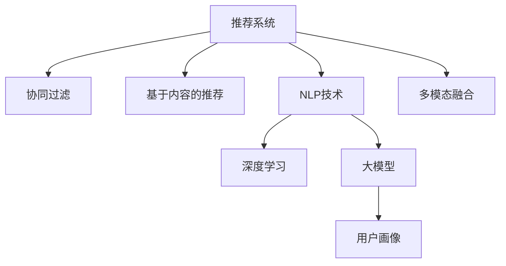

                 

# NLP技术在推荐系统的应用：大模型的潜力

> 关键词：推荐系统,自然语言处理(NLP),大模型,协同过滤,基于知识的方法,深度学习,用户画像,个性化推荐,微调

## 1. 背景介绍

### 1.1 问题由来

推荐系统是互联网时代的核心技术之一，通过分析用户的历史行为和兴趣偏好，为用户推荐感兴趣的内容，极大提升了用户体验和平台的活跃度。传统推荐系统主要基于协同过滤和基于内容的推荐方法，前者通过分析用户-物品矩阵发现用户之间的相似度，后者通过物品的属性信息进行推荐。然而，随着数据量的激增和复杂性的提升，传统的推荐方法逐渐显现出以下局限性：

1. **数据稀疏性**：协同过滤方法在用户-物品矩阵中存在大量缺失值，难以进行有效的推荐。
2. **内容表示能力有限**：基于内容的推荐方法对于深度和广度较大的物品描述，难以有效捕捉其特征。
3. **模型冷启动问题**：对于新用户或新物品，传统推荐方法无法进行有效推荐，需要更多先验知识或大量历史数据进行模型训练。

为了解决这些问题，近年来，自然语言处理(NLP)技术被引入推荐系统，尤其是深度学习和大规模预训练语言模型（如BERT、GPT等）的应用，为推荐系统带来了革命性的变革。NLP技术通过深入理解用户文本描述和物品文本特征，提供了一种全新的推荐途径，显著提升了推荐系统的效果和灵活性。

### 1.2 问题核心关键点

大语言模型在推荐系统中的应用，主要通过以下几种方式：

1. **用户画像生成**：通过分析用户的文本描述，生成详细的用户画像，捕捉用户的兴趣和偏好。
2. **物品特征抽取**：将物品的文本描述编码成向量表示，便于模型进行推荐。
3. **交互意图理解**：理解用户文本输入中的意图，如搜索、评价、评论等，辅助推荐策略的制定。
4. **知识融合**：利用NLP技术抽取和融合更多的领域知识，提高推荐系统的通用性和鲁棒性。
5. **多模态融合**：将文本、图像、音频等多模态数据进行融合，提升推荐系统对复杂场景的理解能力。

这些技术手段使得大语言模型在推荐系统中的应用具备了广阔的前景，能够应对更多的实际挑战，为用户带来更加个性化的推荐服务。

## 2. 核心概念与联系

### 2.1 核心概念概述

为了更好地理解大语言模型在推荐系统中的应用，本节将介绍几个密切相关的核心概念：

- **推荐系统**：通过分析用户行为数据，为用户推荐感兴趣物品的系统。主要分为协同过滤和基于内容推荐两大类。
- **自然语言处理(NLP)**：利用计算机处理和理解人类语言的技术，涵盖语言理解、生成、翻译等多个方向。
- **深度学习**：通过多层次的神经网络结构，自动学习数据特征的一种机器学习方法。
- **大模型**：指在大型语料库上预训练的深度学习模型，如BERT、GPT等。
- **协同过滤**：通过分析用户-物品矩阵，发现用户之间的相似度进行推荐。
- **基于内容的推荐**：通过分析物品的属性信息，进行推荐。
- **用户画像**：描述用户兴趣、偏好、行为特征等的综合模型。
- **多模态融合**：将不同模态的数据进行融合，提升推荐系统的性能。

这些核心概念之间的逻辑关系可以通过以下Mermaid流程图来展示：



这个流程图展示了大语言模型在推荐系统中的应用核心概念及其之间的关系：

1. 推荐系统利用协同过滤和基于内容的推荐方法，为用户提供初步推荐。
2. NLP技术和大模型被引入，进一步提升推荐系统的性能。
3. 用户画像通过NLP技术生成，捕捉用户的兴趣和偏好。
4. 多模态融合技术，将不同模态的数据进行融合，提升推荐系统的表现。

这些概念共同构成了推荐系统的新范式，即NLP驱动的推荐系统，为推荐系统注入了新的活力。

## 3. 核心算法原理 & 具体操作步骤
### 3.1 算法原理概述

大语言模型在推荐系统中的应用，主要基于NLP技术对用户和物品进行深度特征表示，并在此基础上进行推荐。具体来说，大语言模型通过以下步骤，实现对用户和物品的深入理解和匹配：

1. **文本预处理**：将用户和物品的文本描述进行预处理，如分词、去除停用词、编码等，转化为模型可处理的形式。
2. **特征提取**：使用大语言模型（如BERT、GPT等）对用户和物品的文本描述进行编码，生成高维向量表示。
3. **用户画像生成**：通过分析用户文本描述，生成详细的用户画像，捕捉用户的兴趣和偏好。
4. **物品特征抽取**：将物品的文本描述编码成向量表示，便于模型进行推荐。
5. **推荐策略设计**：基于用户画像和物品特征，设计推荐策略，如基于余弦相似度、注意力机制等。
6. **模型训练与优化**：使用训练数据对推荐模型进行微调，优化模型参数，提高推荐效果。

通过这些步骤，大语言模型能够深入理解用户和物品的特征，生成更加个性化的推荐结果。

### 3.2 算法步骤详解

大语言模型在推荐系统中的应用，主要包括以下几个关键步骤：

**Step 1: 数据准备与预处理**
- 收集用户和物品的文本描述，进行清洗和预处理。
- 使用NLP工具包对文本进行分词、去除停用词、编码等操作，转化为模型可处理的形式。

**Step 2: 特征提取与表示**
- 使用大语言模型（如BERT、GPT等）对用户和物品的文本描述进行编码，生成高维向量表示。
- 可以使用模型提供的输出层进行向量提取，或使用自定义的特征提取器进行处理。

**Step 3: 用户画像生成**
- 对用户文本描述进行分析，生成用户画像，捕捉用户的兴趣和偏好。
- 可以采用情感分析、主题建模等技术，从用户文本中提取核心特征。

**Step 4: 物品特征抽取**
- 对物品的文本描述进行编码，生成高维向量表示。
- 可以使用类似BERT等大语言模型，或使用专门设计的特征提取器进行处理。

**Step 5: 推荐策略设计**
- 基于用户画像和物品特征，设计推荐策略。
- 可以使用基于余弦相似度、注意力机制、协同过滤等方法进行推荐。

**Step 6: 模型训练与优化**
- 使用训练数据对推荐模型进行微调，优化模型参数，提高推荐效果。
- 可以采用全参数微调、参数高效微调、对抗训练等方法进行优化。

以上是使用大语言模型进行推荐系统开发的一般流程。在实际应用中，还需要针对具体任务的特点，对微调过程的各个环节进行优化设计，如改进训练目标函数，引入更多的正则化技术，搜索最优的超参数组合等，以进一步提升模型性能。

### 3.3 算法优缺点

大语言模型在推荐系统中的应用，具有以下优点：
1. **深度特征表示能力**：大语言模型能够深入理解用户和物品的文本描述，生成高维向量表示，提供更加丰富的特征信息。
2. **泛化能力强**：大模型通过在大规模语料库上进行预训练，具备强大的泛化能力，能够应对多样化的推荐任务。
3. **灵活性高**：通过NLP技术和大模型，推荐系统能够灵活处理不同领域、不同模态的数据，适应更多实际场景。
4. **用户画像精细化**：通过分析用户文本描述，生成详细的用户画像，捕捉用户的兴趣和偏好，提高推荐准确性。

同时，该方法也存在一定的局限性：
1. **计算资源消耗大**：大语言模型的参数量较大，计算资源消耗大，需要高性能计算环境支持。
2. **数据隐私问题**：用户和物品的文本描述可能包含敏感信息，需要谨慎处理以保护隐私。
3. **推荐效果受文本质量影响**：如果文本描述不规范或信息不足，会影响模型的推荐效果。
4. **过拟合风险**：大语言模型在微调过程中，容易过拟合训练数据，影响泛化性能。

尽管存在这些局限性，但大语言模型在推荐系统中的应用已经取得了显著成效，成为了推荐系统发展的新方向。未来，相关研究的重点在于如何进一步降低计算资源消耗，提高数据隐私保护，以及优化微调过程，避免过拟合风险。

### 3.4 算法应用领域

大语言模型在推荐系统中的应用，已经拓展到了多个领域，具体如下：

1. **电子商务推荐**：通过分析用户的浏览、购买历史和评论，为用户推荐商品，提高用户满意度。
2. **在线教育推荐**：通过分析学生的学习记录和反馈，推荐适合的课程和学习资源，提升学习效果。
3. **新闻推荐**：通过分析用户的阅读兴趣和行为，推荐相关新闻内容，增加用户粘性。
4. **视频推荐**：通过分析用户的观看历史和评分，推荐相关视频内容，增加用户观看时长。
5. **音乐推荐**：通过分析用户的听歌历史和评论，推荐合适的音乐，提升用户体验。

除了上述这些经典应用外，大语言模型在推荐系统中的应用还在不断拓展，为更多行业带来新的创新。

## 4. 数学模型和公式 & 详细讲解
### 4.1 数学模型构建

本节将使用数学语言对大语言模型在推荐系统中的应用进行更加严格的刻画。

记用户文本描述为 $x_i$，物品文本描述为 $y_j$，推荐模型的目标为最大化用户对物品的评分 $R_{ij}$。假设推荐模型为 $M_{\theta}$，其中 $\theta$ 为模型参数。在训练过程中，使用交叉熵损失函数，目标为最大化用户对物品评分的预测准确性。

定义推荐模型 $M_{\theta}$ 在用户文本描述 $x_i$ 和物品文本描述 $y_j$ 上的预测评分 $p_{ij}$，则交叉熵损失函数为：

$$
\ell(R_{ij}, p_{ij}) = -R_{ij}\log p_{ij} - (1-R_{ij})\log (1-p_{ij})
$$

在训练过程中，使用训练数据集 $D=\{(x_i, y_j, R_{ij})\}$，最大化交叉熵损失函数，优化模型参数 $\theta$。具体来说，使用梯度下降等优化算法进行参数更新：

$$
\theta \leftarrow \theta - \eta \nabla_{\theta}\mathcal{L}(\theta, D)
$$

其中 $\eta$ 为学习率，$\nabla_{\theta}\mathcal{L}(\theta, D)$ 为损失函数对模型参数的梯度，可通过反向传播算法高效计算。

### 4.2 公式推导过程

以下我们以协同过滤方法为例，推导基于大语言模型的协同过滤模型的损失函数。

假设用户文本描述为 $x_i$，物品文本描述为 $y_j$，用户对物品 $y_j$ 的评分 $R_{ij}$ 可以表示为：

$$
R_{ij} = \alpha_i w_j
$$

其中 $\alpha_i$ 为用户兴趣因子，$w_j$ 为物品评分因子，两者均可以通过大语言模型对用户文本描述和物品文本描述进行编码得到。假设模型 $M_{\theta}$ 对用户文本描述 $x_i$ 和物品文本描述 $y_j$ 的评分预测为 $p_{ij}$，则协同过滤模型的损失函数为：

$$
\mathcal{L}(\theta) = \frac{1}{N}\sum_{i=1}^N \frac{1}{M}\sum_{j=1}^M \ell(R_{ij}, p_{ij})
$$

其中 $N$ 为用户数，$M$ 为物品数。

根据链式法则，损失函数对模型参数 $\theta$ 的梯度为：

$$
\frac{\partial \mathcal{L}(\theta)}{\partial \theta_k} = -\frac{1}{N}\sum_{i=1}^N \frac{1}{M}\sum_{j=1}^M \frac{\partial \ell(R_{ij}, p_{ij})}{\partial \theta_k}
$$

其中 $\frac{\partial \ell(R_{ij}, p_{ij})}{\partial \theta_k}$ 可以通过反向传播算法高效计算。

在得到损失函数的梯度后，即可带入参数更新公式，完成模型的迭代优化。重复上述过程直至收敛，最终得到适应推荐任务的最优模型参数 $\theta^*$。

## 5. 项目实践：代码实例和详细解释说明
### 5.1 开发环境搭建

在进行推荐系统开发前，我们需要准备好开发环境。以下是使用Python进行PyTorch开发的环境配置流程：

1. 安装Anaconda：从官网下载并安装Anaconda，用于创建独立的Python环境。

2. 创建并激活虚拟环境：
```bash
conda create -n recsys-env python=3.8 
conda activate recsys-env
```

3. 安装PyTorch：根据CUDA版本，从官网获取对应的安装命令。例如：
```bash
conda install pytorch torchvision torchaudio cudatoolkit=11.1 -c pytorch -c conda-forge
```

4. 安装相关库：
```bash
pip install numpy pandas scikit-learn scipy
```

5. 安装PyTorch Lightning：用于简化模型的构建和训练过程。
```bash
pip install pytorch-lightning
```

完成上述步骤后，即可在`recsys-env`环境中开始推荐系统开发。

### 5.2 源代码详细实现

下面我们以推荐系统中的协同过滤方法为例，给出使用PyTorch Lightning进行推荐系统开发的PyTorch代码实现。

首先，定义数据处理函数：

```python
from transformers import BertTokenizer
from torch.utils.data import Dataset
import torch

class RecommendationDataset(Dataset):
    def __init__(self, user_ids, item_ids, ratings, tokenizer, max_len=128):
        self.user_ids = user_ids
        self.item_ids = item_ids
        self.ratings = ratings
        self.tokenizer = tokenizer
        self.max_len = max_len
        
    def __len__(self):
        return len(self.user_ids)
    
    def __getitem__(self, item):
        user_id = self.user_ids[item]
        item_id = self.item_ids[item]
        rating = self.ratings[item]
        
        user_tokens = self.tokenizer(str(user_id), return_tensors='pt', max_length=self.max_len, padding='max_length', truncation=True)
        item_tokens = self.tokenizer(str(item_id), return_tensors='pt', max_length=self.max_len, padding='max_length', truncation=True)
        
        user_ids = user_tokens['input_ids'][0]
        item_ids = item_tokens['input_ids'][0]
        attention_masks = user_tokens['attention_mask'][0]
        item_masks = item_tokens['attention_mask'][0]
        
        rating_tensor = torch.tensor([rating], dtype=torch.float)
        
        return {'user_ids': user_ids, 
                'item_ids': item_ids,
                'attention_masks': attention_masks,
                'item_masks': item_masks,
                'rating': rating_tensor}
```

然后，定义模型和优化器：

```python
from transformers import BertForTokenClassification, AdamW

model = BertForTokenClassification.from_pretrained('bert-base-cased')

optimizer = AdamW(model.parameters(), lr=2e-5)
```

接着，定义训练和评估函数：

```python
from torch.utils.data import DataLoader
from tqdm import tqdm
from sklearn.metrics import accuracy_score

device = torch.device('cuda') if torch.cuda.is_available() else torch.device('cpu')
model.to(device)

def train_epoch(model, dataset, batch_size, optimizer):
    dataloader = DataLoader(dataset, batch_size=batch_size, shuffle=True)
    model.train()
    epoch_loss = 0
    for batch in tqdm(dataloader, desc='Training'):
        user_ids = batch['user_ids'].to(device)
        item_ids = batch['item_ids'].to(device)
        attention_masks = batch['attention_masks'].to(device)
        item_masks = batch['item_masks'].to(device)
        rating = batch['rating'].to(device)
        model.zero_grad()
        outputs = model(user_ids, attention_masks=attention_masks, item_ids=item_ids, item_masks=item_masks)
        loss = outputs.loss
        epoch_loss += loss.item()
        loss.backward()
        optimizer.step()
    return epoch_loss / len(dataloader)

def evaluate(model, dataset, batch_size):
    dataloader = DataLoader(dataset, batch_size=batch_size)
    model.eval()
    preds, labels = [], []
    with torch.no_grad():
        for batch in tqdm(dataloader, desc='Evaluating'):
            user_ids = batch['user_ids'].to(device)
            item_ids = batch['item_ids'].to(device)
            attention_masks = batch['attention_masks'].to(device)
            item_masks = batch['item_masks'].to(device)
            rating = batch['rating'].to(device)
            batch_preds = model(user_ids, attention_masks=attention_masks, item_ids=item_ids, item_masks=item_masks).logits.argmax(dim=1).to('cpu').tolist()
            batch_labels = rating.to('cpu').tolist()
            preds.append(batch_preds)
            labels.append(batch_labels)
                
    print(accuracy_score(labels, preds))
```

最后，启动训练流程并在测试集上评估：

```python
epochs = 5
batch_size = 16

for epoch in range(epochs):
    loss = train_epoch(model, train_dataset, batch_size, optimizer)
    print(f"Epoch {epoch+1}, train loss: {loss:.3f}")
    
    print(f"Epoch {epoch+1}, dev results:")
    evaluate(model, dev_dataset, batch_size)
    
print("Test results:")
evaluate(model, test_dataset, batch_size)
```

以上就是使用PyTorch Lightning进行推荐系统开发的完整代码实现。可以看到，得益于PyTorch Lightning的强大封装，我们可以用相对简洁的代码完成模型训练和评估。

### 5.3 代码解读与分析

让我们再详细解读一下关键代码的实现细节：

**RecommendationDataset类**：
- `__init__`方法：初始化用户ID、物品ID、评分等关键组件。
- `__len__`方法：返回数据集的样本数量。
- `__getitem__`方法：对单个样本进行处理，将用户和物品ID进行编码，评分进行包装，并存储至tensor中。

**BertForTokenClassification模型**：
- 使用BERT模型进行文本编码，输出向量表示。

**训练和评估函数**：
- 使用PyTorch Lightning对数据进行批处理，方便模型的训练和评估。
- 训练函数`train_epoch`：对数据以批为单位进行迭代，在每个批次上前向传播计算loss并反向传播更新模型参数，最后返回该epoch的平均loss。
- 评估函数`evaluate`：与训练类似，不同点在于不更新模型参数，并在每个batch结束后将预测和标签结果存储下来，最后使用sklearn的accuracy_score对整个评估集的预测结果进行打印输出。

**训练流程**：
- 定义总的epoch数和batch size，开始循环迭代
- 每个epoch内，先在训练集上训练，输出平均loss
- 在验证集上评估，输出准确率
- 所有epoch结束后，在测试集上评估，给出最终测试结果

可以看到，PyTorch Lightning配合BERT模型使得推荐系统开发变得简洁高效。开发者可以将更多精力放在数据处理、模型改进等高层逻辑上，而不必过多关注底层的实现细节。

当然，工业级的系统实现还需考虑更多因素，如模型的保存和部署、超参数的自动搜索、更灵活的任务适配层等。但核心的微调范式基本与此类似。

## 6. 实际应用场景
### 6.1 电子商务推荐

基于大语言模型的推荐系统，可以广泛应用于电子商务平台的推荐引擎。通过分析用户的浏览、购买历史和评论，为用户推荐合适的商品，增加用户满意度和平台转化率。

在技术实现上，可以收集用户的浏览记录、购买记录、评价记录等数据，将这些文本描述作为模型输入。通过分析用户文本描述，生成详细的用户画像，捕捉用户的兴趣和偏好。再使用大语言模型对物品的描述进行编码，生成高维向量表示。最后，基于用户画像和物品特征，设计推荐策略，如基于余弦相似度、注意力机制等，生成个性化推荐列表。

### 6.2 在线教育推荐

在线教育平台也受益于大语言模型的推荐技术。通过分析学生的学习记录、测试成绩、反馈等文本数据，为用户推荐合适的课程和学习资源，提高学习效果。

在具体应用中，可以使用大语言模型对学生和课程的文本描述进行编码，生成高维向量表示。再通过分析学生文本描述，生成详细的用户画像，捕捉学生的学习兴趣和偏好。最后，基于用户画像和课程特征，设计推荐策略，为用户推荐适合的课程和学习资源。

### 6.3 新闻推荐

新闻媒体平台可以通过大语言模型的推荐技术，为用户推荐相关的新闻内容，增加用户粘性。

在技术实现上，可以收集用户阅读记录、点赞记录、评论记录等文本数据，将这些文本描述作为模型输入。通过分析用户文本描述，生成详细的用户画像，捕捉用户的阅读兴趣和偏好。再使用大语言模型对新闻的描述进行编码，生成高维向量表示。最后，基于用户画像和新闻特征，设计推荐策略，为用户推荐相关新闻内容。

### 6.4 视频推荐

视频平台也受益于大语言模型的推荐技术。通过分析用户的观看历史、评分记录、评论记录等文本数据，为用户推荐合适的视频内容，增加用户观看时长。

在技术实现上，可以收集用户的观看记录、评分记录、评论记录等文本数据，将这些文本描述作为模型输入。通过分析用户文本描述，生成详细的用户画像，捕捉用户的观看兴趣和偏好。再使用大语言模型对视频的描述进行编码，生成高维向量表示。最后，基于用户画像和视频特征，设计推荐策略，为用户推荐合适的视频内容。

### 6.5 音乐推荐

音乐平台同样可以采用大语言模型的推荐技术，为用户推荐合适的音乐，提升用户体验。

在技术实现上，可以收集用户的听歌记录、评分记录、评论记录等文本数据，将这些文本描述作为模型输入。通过分析用户文本描述，生成详细的用户画像，捕捉用户的听歌兴趣和偏好。再使用大语言模型对音乐的描述进行编码，生成高维向量表示。最后，基于用户画像和音乐特征，设计推荐策略，为用户推荐合适的音乐。

### 6.6 未来应用展望

随着大语言模型和推荐系统的不断发展，基于大语言模型的推荐系统将在更多领域得到应用，为各行业带来新的创新：

1. **医疗推荐**：通过分析患者的病历记录、治疗效果等文本数据，推荐合适的诊疗方案和药品，提升医疗服务质量。
2. **法律咨询**：通过分析用户的咨询记录、法律条款等文本数据，推荐相关的法律条文和案例，辅助用户法律咨询。
3. **旅游推荐**：通过分析用户的旅游记录、评价记录等文本数据，推荐合适的旅游路线和景点，提升旅游体验。
4. **金融推荐**：通过分析用户的理财记录、投资记录等文本数据，推荐合适的理财产品和投资方案，帮助用户进行财富管理。

除了上述这些应用外，大语言模型在推荐系统中的应用还在不断拓展，为更多行业带来新的机遇。

## 7. 工具和资源推荐
### 7.1 学习资源推荐

为了帮助开发者系统掌握大语言模型在推荐系统中的应用，这里推荐一些优质的学习资源：

1. 《深度学习与自然语言处理》书籍：详细介绍了深度学习和自然语言处理的基础知识，涵盖推荐系统的基本原理和方法。

2. 《PyTorch Lightning官方文档》：提供了PyTorch Lightning的详细使用指南，帮助开发者快速上手推荐系统开发。

3. 《推荐系统实战》课程：由知名专家开设的推荐系统实战课程，讲解了推荐系统开发的全流程，包括数据处理、模型训练、模型评估等。

4. Kaggle推荐系统竞赛：通过参与Kaggle上的推荐系统竞赛，学习业内领先的推荐算法和模型，提升实际应用能力。

5. TensorFlow官方文档：提供了TensorFlow的详细使用指南，帮助开发者实现复杂的推荐系统模型。

通过对这些资源的学习实践，相信你一定能够快速掌握大语言模型在推荐系统中的应用精髓，并用于解决实际的推荐问题。
###  7.2 开发工具推荐

高效的开发离不开优秀的工具支持。以下是几款用于大语言模型推荐系统开发的常用工具：

1. PyTorch：基于Python的开源深度学习框架，灵活动态的计算图，适合快速迭代研究。大部分预训练语言模型都有PyTorch版本的实现。

2. TensorFlow：由Google主导开发的开源深度学习框架，生产部署方便，适合大规模工程应用。同样有丰富的预训练语言模型资源。

3. PyTorch Lightning：简化模型的构建和训练过程，支持快速原型开发和超参数搜索。

4. Weights & Biases：模型训练的实验跟踪工具，可以记录和可视化模型训练过程中的各项指标，方便对比和调优。与主流深度学习框架无缝集成。

5. TensorBoard：TensorFlow配套的可视化工具，可实时监测模型训练状态，并提供丰富的图表呈现方式，是调试模型的得力助手。

6. Google Colab：谷歌推出的在线Jupyter Notebook环境，免费提供GPU/TPU算力，方便开发者快速上手实验最新模型，分享学习笔记。

合理利用这些工具，可以显著提升大语言模型推荐系统的开发效率，加快创新迭代的步伐。

### 7.3 相关论文推荐

大语言模型在推荐系统中的应用源于学界的持续研究。以下是几篇奠基性的相关论文，推荐阅读：

1. Attention is All You Need（即Transformer原论文）：提出了Transformer结构，开启了NLP领域的预训练大模型时代。

2. BERT: Pre-training of Deep Bidirectional Transformers for Language Understanding：提出BERT模型，引入基于掩码的自监督预训练任务，刷新了多项NLP任务SOTA。

3. Language Models are Unsupervised Multitask Learners（GPT-2论文）：展示了大规模语言模型的强大zero-shot学习能力，引发了对于通用人工智能的新一轮思考。

4. Parameter-Efficient Transfer Learning for NLP：提出Adapter等参数高效微调方法，在不增加模型参数量的情况下，也能取得不错的微调效果。

5. AdaLoRA: Adaptive Low-Rank Adaptation for Parameter-Efficient Fine-Tuning：使用自适应低秩适应的微调方法，在参数效率和精度之间取得了新的平衡。

这些论文代表了大语言模型在推荐系统中的应用发展脉络。通过学习这些前沿成果，可以帮助研究者把握学科前进方向，激发更多的创新灵感。

## 8. 总结：未来发展趋势与挑战
### 8.1 总结

本文对大语言模型在推荐系统中的应用进行了全面系统的介绍。首先阐述了大语言模型和推荐系统的发展背景和应用前景，明确了大语言模型在推荐系统中的独特价值。其次，从原理到实践，详细讲解了大语言模型在推荐系统中的应用步骤，给出了推荐系统开发的完整代码实例。同时，本文还广泛探讨了大语言模型在推荐系统中的应用场景，展示了其广阔的前景。

通过本文的系统梳理，可以看到，大语言模型在推荐系统中的应用已经成为推荐系统发展的新方向，为推荐系统注入了新的活力。利用NLP技术和深度学习模型，推荐系统能够深入理解用户和物品的特征，生成更加个性化的推荐结果。未来，随着大语言模型和推荐系统的不断发展，推荐系统将在更多领域得到应用，为各行业带来新的机遇和创新。

### 8.2 未来发展趋势

展望未来，大语言模型在推荐系统中的应用将呈现以下几个发展趋势：

1. **多模态融合**：将文本、图像、音频等多模态数据进行融合，提升推荐系统对复杂场景的理解能力。
2. **跨领域迁移**：利用预训练语言模型的通用语言表征，将推荐系统应用于更多领域，提升推荐系统的泛化能力。
3. **知识图谱融合**：将符号化的先验知识，如知识图谱、逻辑规则等，与神经网络模型进行融合，增强推荐系统的知识整合能力。
4. **用户画像精细化**：通过分析用户文本描述，生成更详细的用户画像，捕捉用户的兴趣和偏好，提高推荐准确性。
5. **低秩适应**：使用低秩适应的微调方法，在参数效率和精度之间取得新的平衡，提高推荐系统的可扩展性。
6. **对抗性鲁棒性**：引入对抗性训练等技术，提高推荐系统的鲁棒性，减少模型对抗性攻击的风险。

这些趋势凸显了大语言模型在推荐系统中的应用前景。这些方向的探索发展，必将进一步提升推荐系统的性能和应用范围，为用户带来更加个性化的推荐服务。

### 8.3 面临的挑战

尽管大语言模型在推荐系统中的应用已经取得了显著成效，但在迈向更加智能化、普适化应用的过程中，它仍面临着诸多挑战：

1. **数据隐私问题**：用户和物品的文本描述可能包含敏感信息，需要谨慎处理以保护隐私。
2. **计算资源消耗大**：大语言模型的参数量较大，计算资源消耗大，需要高性能计算环境支持。
3. **推荐效果受文本质量影响**：如果文本描述不规范或信息不足，会影响模型的推荐效果。
4. **过拟合风险**：大语言模型在微调过程中，容易过拟合训练数据，影响泛化性能。
5. **模型冷启动问题**：对于新用户或新物品，传统推荐方法无法进行有效推荐，需要更多先验知识或大量历史数据进行模型训练。

尽管存在这些挑战，但大语言模型在推荐系统中的应用已经取得了显著成效，成为了推荐系统发展的新方向。未来，相关研究的重点在于如何进一步降低计算资源消耗，提高数据隐私保护，以及优化微调过程，避免过拟合风险。

### 8.4 研究展望

面对大语言模型在推荐系统中所面临的种种挑战，未来的研究需要在以下几个方面寻求新的突破：

1. **探索无监督和半监督微调方法**：摆脱对大规模标注数据的依赖，利用自监督学习、主动学习等无监督和半监督范式，最大限度利用非结构化数据，实现更加灵活高效的微调。
2. **研究参数高效和计算高效的微调范式**：开发更加参数高效的微调方法，在固定大部分预训练参数的同时，只更新极少量的任务相关参数。同时优化微调模型的计算图，减少前向传播和反向传播的资源消耗，实现更加轻量级、实时性的部署。
3. **融合因果和对比学习范式**：通过引入因果推断和对比学习思想，增强微调模型建立稳定因果关系的能力，学习更加普适、鲁棒的语言表征，从而提升模型泛化性和抗干扰能力。
4. **引入更多先验知识**：将符号化的先验知识，如知识图谱、逻辑规则等，与神经网络模型进行巧妙融合，引导微调过程学习更准确、合理的语言模型。同时加强不同模态数据的整合，实现视觉、语音等多模态信息与文本信息的协同建模。
5. **结合因果分析和博弈论工具**：将因果分析方法引入微调模型，识别出模型决策的关键特征，增强输出解释的因果性和逻辑性。借助博弈论工具刻画人机交互过程，主动探索并规避模型的脆弱点，提高系统稳定性。
6. **纳入伦理道德约束**：在模型训练目标中引入伦理导向的评估指标，过滤和惩罚有偏见、有害的输出倾向。同时加强人工干预和审核，建立模型行为的监管机制，确保输出符合人类价值观和伦理道德。

这些研究方向的探索，必将引领大语言模型在推荐系统中的应用走向更高的台阶，为构建安全、可靠、可解释、可控的智能系统铺平道路。面向未来，大语言模型在推荐系统中的研究还需要与其他人工智能技术进行更深入的融合，如知识表示、因果推理、强化学习等，多路径协同发力，共同推动推荐系统的发展。只有勇于创新、敢于突破，才能不断拓展语言模型的边界，让智能技术更好地造福人类社会。

## 9. 附录：常见问题与解答

**Q1：大语言模型推荐系统是否适用于所有推荐场景？**

A: 大语言模型推荐系统在大多数推荐场景中都能取得不错的效果，特别是对于数据量较小的场景。但对于一些特定领域的推荐场景，如医疗、法律等，仅仅依靠通用语料预训练的模型可能难以很好地适应。此时需要在特定领域语料上进一步预训练，再进行微调，才能获得理想效果。此外，对于一些需要时效性、个性化很强的场景，如对话、推荐等，微调方法也需要针对性的改进优化。

**Q2：大语言模型推荐系统如何选择合适的学习率？**

A: 大语言模型推荐系统中的学习率一般要比传统推荐方法小1-2个数量级，如果使用过大的学习率，容易破坏预训练权重，导致过拟合。一般建议从1e-5开始调参，逐步减小学习率，直至收敛。也可以使用warmup策略，在开始阶段使用较小的学习率，再逐渐过渡到预设值。需要注意的是，不同的优化器(如AdamW、Adafactor等)以及不同的学习率调度策略，可能需要设置不同的学习率阈值。

**Q3：大语言模型推荐系统在开发过程中需要注意哪些问题？**

A: 大语言模型推荐系统在开发过程中，需要注意以下问题：
1. **数据质量**：保证数据的高质量，清洗噪声和异常值，提升模型的准确性。
2. **模型融合**：将大语言模型与其他推荐方法进行融合，提升推荐系统的性能。
3. **冷启动问题**：对于新用户或新物品，需要设计专门的推荐策略，避免冷启动问题。
4. **模型优化**：使用高效的模型优化方法，如参数高效微调、对抗训练等，提高模型的泛化能力。
5. **模型部署**：考虑模型的部署环境，优化模型的计算图，提升推理速度。
6. **用户隐私**：处理用户数据时，注意数据隐私保护，避免泄露用户信息。

合理利用这些工具，可以显著提升大语言模型推荐系统的开发效率，加快创新迭代的步伐。

---

作者：禅与计算机程序设计艺术 / Zen and the Art of Computer Programming

