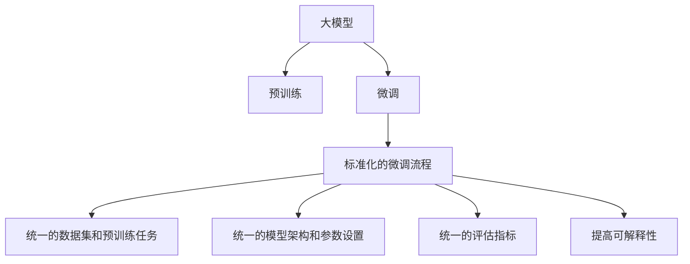

                 

# NLP领域的大模型标准

> 关键词：大模型,标准化,自然语言处理(NLP),预训练,微调,Fine-tuning,Transformer,BERT,深度学习

## 1. 背景介绍

### 1.1 问题由来

随着人工智能技术的飞速发展，大模型在自然语言处理(Natural Language Processing, NLP)领域取得了显著进展。这些大模型如BERT、GPT、T5等，通过在大量无标签数据上进行预训练，学习到了丰富的语言知识，能够在多个任务上取得优异的性能。然而，预训练模型的性能提升，往往依赖于庞大的数据集和强大的计算能力，这在实际应用中往往难以实现。

大模型标准，正是为了解决这一问题而提出。通过制定统一的标准和规范，旨在使大模型的预训练和微调过程更加标准化、规范化，从而降低应用成本，提升模型性能。

### 1.2 问题核心关键点

大模型标准的核心目标在于通过制定一系列的技术规范，使大模型的预训练和微调过程更加高效、可靠和可解释。具体包括：

- 数据集和预训练任务的标准化：指定预训练模型需要使用的数据集类型、规模、预训练任务等，确保模型的泛化能力。
- 模型架构和参数设置的标准化：统一模型的架构设计、参数初始化、学习率等设置，避免重复劳动和错误。
- 微调过程的标准化：定义微调的任务适配层、损失函数、优化器等关键组件，确保微调过程的一致性和可复现性。
- 评估标准的统一：设定通用的评估指标和方法，保证模型的效果评估有据可依。
- 可解释性和透明度的提高：要求大模型的推理过程和决策逻辑更加透明，便于解释和调试。

这些标准和规范的制定，将有助于推动大语言模型在大规模生产环境中的落地应用，促进NLP技术的产业化进程。

## 2. 核心概念与联系

### 2.1 核心概念概述

为更好地理解大模型标准，本节将介绍几个关键概念及其相互关系：

- 大模型(Large Models)：指在大型数据集上通过预训练学习得到的高性能神经网络模型。以Transformer、BERT等为代表的大模型在预训练和微调过程中都显示出强大优势。
- 标准化(Standardization)：指在模型预训练和微调过程中，采用统一的技术规范和流程，以提高模型性能的一致性和可复现性。
- 预训练(Pre-training)：指在大规模无标签数据上，通过自监督学习任务训练大模型的过程。预训练使得模型学习到通用的语言表示，具备强大的泛化能力。
- 微调(Fine-tuning)：指在预训练模型的基础上，使用下游任务的少量标注数据，通过有监督学习优化模型在特定任务上的性能。微调是大模型应用的关键步骤。
- 评估指标(Metrics)：指用于衡量模型性能的指标，如BLEU、ROUGE、F1-score等，是模型效果评估的重要依据。
- 可解释性(Explainability)：指模型的推理过程和决策逻辑能否被解释和理解，是模型可靠性和可信度的重要保证。

这些核心概念之间存在紧密联系，通过制定标准化的流程和规范，可以更好地实现大模型的预训练和微调，提升模型的性能和应用效果。

### 2.2 核心概念原理和架构的 Mermaid 流程图(Mermaid 流程节点中不要有括号、逗号等特殊字符)



这个流程图展示了大模型的预训练和微调过程，以及与标准化流程、统一规范之间的关系：

1. 大模型通过预训练获得通用语言表示。
2. 微调过程优化模型在特定任务上的性能。
3. 标准化流程和规范确保微调过程的一致性和可复现性。
4. 统一的数据集和预训练任务提升模型的泛化能力。
5. 统一的模型架构和参数设置提高模型的开发效率。
6. 统一的评估指标保证模型效果评估的一致性。
7. 提高模型的可解释性提升用户信任和应用安全性。

## 3. 核心算法原理 & 具体操作步骤
### 3.1 算法原理概述

大模型标准的核心算法原理，主要围绕预训练和微调的规范化展开。预训练和微调是构建高性能大模型的关键步骤，通过标准化的流程和规范，可以显著提升模型的性能和应用效果。

### 3.2 算法步骤详解

基于大模型标准，预训练和微调的一般流程如下：

**Step 1: 准备数据集**
- 选择合适的预训练和微调数据集，遵循标准化规范。数据集应包含大规模无标签数据，用于预训练；同时应包括少量标注数据，用于微调。

**Step 2: 预训练模型设计**
- 根据标准规范，设计大模型的架构和参数设置。通常使用Transformer等深度学习模型，设计统一的输入输出接口、损失函数、优化器等组件。
- 根据预训练任务的要求，选择合适的预训练方法，如自监督学习、掩码语言模型等。

**Step 3: 预训练模型训练**
- 使用标准规范指定的数据集和预训练任务，训练预训练模型。预训练过程中，应使用统一的超参数设置，如学习率、批量大小、迭代轮数等。

**Step 4: 微调模型设计**
- 根据任务类型，设计微调的适配层和损失函数。适配层应包含必要的线性分类器、softmax函数等组件，损失函数应根据任务类型选择交叉熵、均方误差等。
- 使用标准规范指定的微调数据集和优化器，进行微调过程。微调过程中，应使用统一的超参数设置，如学习率、批量大小、迭代轮数等。

**Step 5: 评估与优化**
- 使用标准规范指定的评估指标，评估微调后的模型性能。评估指标应包括准确率、精确率、召回率等。
- 根据评估结果，调整微调模型的超参数和结构，进一步优化模型性能。

### 3.3 算法优缺点

基于大模型标准进行预训练和微调，具有以下优点：

1. **统一规范**：通过标准化的流程和规范，确保预训练和微调过程的一致性和可复现性，减少重复劳动和错误。
2. **提高效率**：统一的数据集和预训练任务，避免重复预训练和微调过程，提高开发效率。
3. **提升性能**：统一的模型架构和参数设置，确保模型性能的一致性和可预测性，提升模型性能。
4. **便于应用**：统一的评估指标和方法，便于模型的效果评估和应用部署。
5. **提高可解释性**：标准化的推理过程和决策逻辑，提高模型的可解释性和透明度。

同时，大模型标准也存在一些缺点：

1. **灵活性受限**：标准化的流程和规范可能限制模型设计的灵活性，不利于探索新的模型结构和优化方法。
2. **成本较高**：标准化规范的制定和实施需要较高的成本投入，特别是对小团队和资源有限的用户。
3. **技术复杂**：标准化的实施可能涉及复杂的技术细节，需要较高的技术门槛。

尽管存在这些缺点，但大模型标准仍然是大模型应用中不可或缺的重要组成部分，通过规范化预训练和微调过程，可以显著提升模型的性能和应用效果。

### 3.4 算法应用领域

大模型标准的应用领域广泛，涵盖多个NLP任务和技术方向：

- 文本分类：如情感分析、主题分类等。标准化的数据集和预训练任务，确保模型的泛化能力。
- 命名实体识别：识别文本中的人名、地名、机构名等特定实体。标准化的数据集和微调任务，提升模型的识别精度。
- 机器翻译：将源语言文本翻译成目标语言。标准化的数据集和预训练任务，确保翻译质量。
- 问答系统：对自然语言问题给出答案。标准化的数据集和微调任务，提升问答系统的准确性和自然度。
- 文本摘要：将长文本压缩成简短摘要。标准化的数据集和预训练任务，提升摘要的准确性和简洁性。
- 对话系统：使机器能够与人自然对话。标准化的数据集和微调任务，提升对话系统的交互性和智能性。

## 4. 数学模型和公式 & 详细讲解 & 举例说明

### 4.1 数学模型构建

基于大模型标准，我们可以构建标准化的预训练和微调模型。以下以BERT为例，展示其数学模型构建过程。

BERT模型的预训练任务包括两个部分：掩码语言模型(Masked Language Model, MLM)和下一句预测(Next Sentence Prediction, NSP)。其中，掩码语言模型旨在预测被遮盖的词，从而学习到词的语义表示；下一句预测任务旨在判断两句话是否来自同一段落，从而学习到句子之间的语义关系。

### 4.2 公式推导过程

BERT的预训练模型公式如下：

$$
\mathcal{L}_{\text{MLM}}(x) = -\sum_{i=1}^N \sum_{j=1}^{20} \log \frac{\exp(\hat{y}_{ij} \log p(y_{ij} | x))}{\sum_{k=1}^V \exp(\log p(y_k | x))}
$$

其中，$x$ 为输入文本，$y_{ij}$ 为第 $i$ 个掩码位置的第 $j$ 个掩码词，$\hat{y}_{ij}$ 为模型预测的掩码词，$p(y_k | x)$ 为模型对第 $k$ 个词的预测概率。

BERT的下一句预测任务公式如下：

$$
\mathcal{L}_{\text{NSP}}(x, y) = -\sum_{i=1}^N \log p(y_i | x_i, y_i)
$$

其中，$y_i$ 为下一句预测的标签，$p(y_i | x_i, y_i)$ 为模型对下一句预测的准确概率。

在微调过程中，我们通常使用标准化的分类任务进行微调，例如二分类或多分类任务。对于二分类任务，假设微调任务为 $T$，则微调模型 $M_{\theta}$ 在输入 $x$ 上的预测概率为：

$$
p(y | x) = \text{softmax}(M_{\theta}(x) W)
$$

其中，$W$ 为微调模型 $M_{\theta}$ 的权重矩阵，$y$ 为任务标签。微调任务对应的损失函数 $\ell(M_{\theta}(x),y)$ 可根据具体任务选择合适的函数，如交叉熵损失等。

### 4.3 案例分析与讲解

以BERT模型为例，展示其在大规模语料上进行预训练，以及在下游任务上进行微调的过程。

**预训练过程**：
1. 收集大规模无标签文本数据，将其作为预训练数据集。
2. 定义掩码语言模型和下一句预测任务。
3. 使用BERT模型进行预训练，学习通用语言表示。
4. 在预训练过程中，调整模型参数以最小化损失函数，并使用随机梯度下降等优化算法进行更新。

**微调过程**：
1. 收集下游任务的少量标注数据，将其作为微调数据集。
2. 设计微调的适配层和损失函数，通常为线性分类器加交叉熵损失。
3. 使用微调数据集进行微调训练，学习任务特定的表示。
4. 在微调过程中，调整模型参数以最小化微调损失函数，并使用标准化的超参数设置。

## 5. 项目实践：代码实例和详细解释说明

### 5.1 开发环境搭建

在进行大模型标准实践前，我们需要准备好开发环境。以下是使用Python进行PyTorch开发的环境配置流程：

1. 安装Anaconda：从官网下载并安装Anaconda，用于创建独立的Python环境。

2. 创建并激活虚拟环境：
```bash
conda create -n pytorch-env python=3.8 
conda activate pytorch-env
```

3. 安装PyTorch：根据CUDA版本，从官网获取对应的安装命令。例如：
```bash
conda install pytorch torchvision torchaudio cudatoolkit=11.1 -c pytorch -c conda-forge
```

4. 安装Transformers库：
```bash
pip install transformers
```

5. 安装各类工具包：
```bash
pip install numpy pandas scikit-learn matplotlib tqdm jupyter notebook ipython
```

完成上述步骤后，即可在`pytorch-env`环境中开始大模型标准的实践。

### 5.2 源代码详细实现

下面我们以BERT模型进行命名实体识别(NER)任务为例，给出使用Transformers库进行BERT模型标准化的代码实现。

首先，定义NER任务的数据处理函数：

```python
from transformers import BertTokenizer
from torch.utils.data import Dataset
import torch

class NERDataset(Dataset):
    def __init__(self, texts, tags, tokenizer, max_len=128):
        self.texts = texts
        self.tags = tags
        self.tokenizer = tokenizer
        self.max_len = max_len
        
    def __len__(self):
        return len(self.texts)
    
    def __getitem__(self, item):
        text = self.texts[item]
        tags = self.tags[item]
        
        encoding = self.tokenizer(text, return_tensors='pt', max_length=self.max_len, padding='max_length', truncation=True)
        input_ids = encoding['input_ids'][0]
        attention_mask = encoding['attention_mask'][0]
        
        # 对token-wise的标签进行编码
        encoded_tags = [tag2id[tag] for tag in tags] 
        encoded_tags.extend([tag2id['O']] * (self.max_len - len(encoded_tags)))
        labels = torch.tensor(encoded_tags, dtype=torch.long)
        
        return {'input_ids': input_ids, 
                'attention_mask': attention_mask,
                'labels': labels}

# 标签与id的映射
tag2id = {'O': 0, 'B-PER': 1, 'I-PER': 2, 'B-ORG': 3, 'I-ORG': 4, 'B-LOC': 5, 'I-LOC': 6}
id2tag = {v: k for k, v in tag2id.items()}

# 创建dataset
tokenizer = BertTokenizer.from_pretrained('bert-base-cased')

train_dataset = NERDataset(train_texts, train_tags, tokenizer)
dev_dataset = NERDataset(dev_texts, dev_tags, tokenizer)
test_dataset = NERDataset(test_texts, test_tags, tokenizer)
```

然后，定义模型和优化器：

```python
from transformers import BertForTokenClassification, AdamW

model = BertForTokenClassification.from_pretrained('bert-base-cased', num_labels=len(tag2id))

optimizer = AdamW(model.parameters(), lr=2e-5)
```

接着，定义训练和评估函数：

```python
from torch.utils.data import DataLoader
from tqdm import tqdm
from sklearn.metrics import classification_report

device = torch.device('cuda') if torch.cuda.is_available() else torch.device('cpu')
model.to(device)

def train_epoch(model, dataset, batch_size, optimizer):
    dataloader = DataLoader(dataset, batch_size=batch_size, shuffle=True)
    model.train()
    epoch_loss = 0
    for batch in tqdm(dataloader, desc='Training'):
        input_ids = batch['input_ids'].to(device)
        attention_mask = batch['attention_mask'].to(device)
        labels = batch['labels'].to(device)
        model.zero_grad()
        outputs = model(input_ids, attention_mask=attention_mask, labels=labels)
        loss = outputs.loss
        epoch_loss += loss.item()
        loss.backward()
        optimizer.step()
    return epoch_loss / len(dataloader)

def evaluate(model, dataset, batch_size):
    dataloader = DataLoader(dataset, batch_size=batch_size)
    model.eval()
    preds, labels = [], []
    with torch.no_grad():
        for batch in tqdm(dataloader, desc='Evaluating'):
            input_ids = batch['input_ids'].to(device)
            attention_mask = batch['attention_mask'].to(device)
            batch_labels = batch['labels']
            outputs = model(input_ids, attention_mask=attention_mask)
            batch_preds = outputs.logits.argmax(dim=2).to('cpu').tolist()
            batch_labels = batch_labels.to('cpu').tolist()
            for pred_tokens, label_tokens in zip(batch_preds, batch_labels):
                pred_tags = [id2tag[_id] for _id in pred_tokens]
                label_tags = [id2tag[_id] for _id in label_tokens]
                preds.append(pred_tags[:len(label_tags)])
                labels.append(label_tags)
                
    print(classification_report(labels, preds))
```

最后，启动训练流程并在测试集上评估：

```python
epochs = 5
batch_size = 16

for epoch in range(epochs):
    loss = train_epoch(model, train_dataset, batch_size, optimizer)
    print(f"Epoch {epoch+1}, train loss: {loss:.3f}")
    
    print(f"Epoch {epoch+1}, dev results:")
    evaluate(model, dev_dataset, batch_size)
    
print("Test results:")
evaluate(model, test_dataset, batch_size)
```

以上就是使用PyTorch对BERT进行命名实体识别任务标准化的代码实现。可以看到，得益于Transformers库的强大封装，我们可以用相对简洁的代码完成BERT模型的加载和标准化。

### 5.3 代码解读与分析

让我们再详细解读一下关键代码的实现细节：

**NERDataset类**：
- `__init__`方法：初始化文本、标签、分词器等关键组件。
- `__len__`方法：返回数据集的样本数量。
- `__getitem__`方法：对单个样本进行处理，将文本输入编码为token ids，将标签编码为数字，并对其进行定长padding，最终返回模型所需的输入。

**tag2id和id2tag字典**：
- 定义了标签与数字id之间的映射关系，用于将token-wise的预测结果解码回真实的标签。

**训练和评估函数**：
- 使用PyTorch的DataLoader对数据集进行批次化加载，供模型训练和推理使用。
- 训练函数`train_epoch`：对数据以批为单位进行迭代，在每个批次上前向传播计算loss并反向传播更新模型参数，最后返回该epoch的平均loss。
- 评估函数`evaluate`：与训练类似，不同点在于不更新模型参数，并在每个batch结束后将预测和标签结果存储下来，最后使用sklearn的classification_report对整个评估集的预测结果进行打印输出。

**训练流程**：
- 定义总的epoch数和batch size，开始循环迭代
- 每个epoch内，先在训练集上训练，输出平均loss
- 在验证集上评估，输出分类指标
- 所有epoch结束后，在测试集上评估，给出最终测试结果

可以看到，PyTorch配合Transformers库使得BERT标准化的代码实现变得简洁高效。开发者可以将更多精力放在数据处理、模型改进等高层逻辑上，而不必过多关注底层的实现细节。

当然，工业级的系统实现还需考虑更多因素，如模型的保存和部署、超参数的自动搜索、更灵活的任务适配层等。但核心的标准化范式基本与此类似。

## 6. 实际应用场景

### 6.1 智能客服系统

基于大模型标准进行智能客服系统构建，可以显著提升客服系统的效率和效果。通过标准化预训练和微调流程，可以实现对通用大模型的快速适配，构建稳定可靠的智能客服解决方案。

在技术实现上，可以收集企业内部的历史客服对话记录，将其整理为预训练数据集，在BERT等大模型上进行预训练。微调时，使用企业新的客服对话数据，设计适配层和损失函数，进行微调训练，得到新任务下的模型。新模型可以实时接收客服查询，自动匹配最合适的回复模板，提高客服系统的响应速度和准确性。

### 6.2 金融舆情监测

金融舆情监测需要实时监测市场舆论动向，以避免负面信息传播带来的风险。大模型标准的引入，可以提升舆情监测系统的准确性和时效性。

具体而言，可以收集金融领域相关的新闻、报道、评论等文本数据，将其作为预训练数据集，在BERT等大模型上进行预训练。微调时，使用实时抓取的网络文本数据，设计适配层和损失函数，进行微调训练，得到新任务下的模型。新模型可以自动监测不同主题下的情感变化趋势，一旦发现负面信息激增等异常情况，系统便会自动预警，帮助金融机构快速应对潜在风险。

### 6.3 个性化推荐系统

当前的推荐系统往往只依赖用户的历史行为数据进行物品推荐，无法深入理解用户的真实兴趣偏好。基于大模型标准，个性化推荐系统可以更好地挖掘用户行为背后的语义信息，从而提供更精准、多样的推荐内容。

在实践中，可以收集用户浏览、点击、评论、分享等行为数据，提取和用户交互的物品标题、描述、标签等文本内容。将文本内容作为模型输入，用户的后续行为（如是否点击、购买等）作为监督信号，在此基础上对BERT等大模型进行标准化微调。微调后的模型能够从文本内容中准确把握用户的兴趣点。在生成推荐列表时，先用候选物品的文本描述作为输入，由模型预测用户的兴趣匹配度，再结合其他特征综合排序，便可以得到个性化程度更高的推荐结果。

### 6.4 未来应用展望

随着大模型标准的不断完善，其在NLP领域的应用前景将更加广阔。

在智慧医疗领域，基于标准化的大模型微调方法，可以实现医疗问答、病历分析、药物研发等任务，提升医疗服务的智能化水平，辅助医生诊疗，加速新药开发进程。

在智能教育领域，大模型标准的应用可以助力作业批改、学情分析、知识推荐等方面，因材施教，促进教育公平，提高教学质量。

在智慧城市治理中，标准化的大模型微调方法可以用于城市事件监测、舆情分析、应急指挥等环节，提高城市管理的自动化和智能化水平，构建更安全、高效的未来城市。

此外，在企业生产、社会治理、文娱传媒等众多领域，基于大模型标准的人工智能应用也将不断涌现，为经济社会发展注入新的动力。相信随着大模型标准的研究和应用的深入，NLP技术必将在更广阔的应用领域大放异彩。

## 7. 工具和资源推荐

### 7.1 学习资源推荐

为了帮助开发者系统掌握大模型标准的技术基础和实践技巧，这里推荐一些优质的学习资源：

1. 《Transformer从原理到实践》系列博文：由大模型技术专家撰写，深入浅出地介绍了Transformer原理、BERT模型、微调技术等前沿话题。

2. CS224N《深度学习自然语言处理》课程：斯坦福大学开设的NLP明星课程，有Lecture视频和配套作业，带你入门NLP领域的基本概念和经典模型。

3. 《Natural Language Processing with Transformers》书籍：Transformers库的作者所著，全面介绍了如何使用Transformers库进行NLP任务开发，包括标准化微调在内的诸多范式。

4. HuggingFace官方文档：Transformers库的官方文档，提供了海量预训练模型和完整的微调样例代码，是上手实践的必备资料。

5. CLUE开源项目：中文语言理解测评基准，涵盖大量不同类型的中文NLP数据集，并提供了基于标准化微调的baseline模型，助力中文NLP技术发展。

通过对这些资源的学习实践，相信你一定能够快速掌握大模型标准的技术精髓，并用于解决实际的NLP问题。
###  7.2 开发工具推荐

高效的开发离不开优秀的工具支持。以下是几款用于大模型标准开发的常用工具：

1. PyTorch：基于Python的开源深度学习框架，灵活动态的计算图，适合快速迭代研究。大部分预训练语言模型都有PyTorch版本的实现。

2. TensorFlow：由Google主导开发的开源深度学习框架，生产部署方便，适合大规模工程应用。同样有丰富的预训练语言模型资源。

3. Transformers库：HuggingFace开发的NLP工具库，集成了众多SOTA语言模型，支持PyTorch和TensorFlow，是进行标准化微调任务开发的利器。

4. Weights & Biases：模型训练的实验跟踪工具，可以记录和可视化模型训练过程中的各项指标，方便对比和调优。与主流深度学习框架无缝集成。

5. TensorBoard：TensorFlow配套的可视化工具，可实时监测模型训练状态，并提供丰富的图表呈现方式，是调试模型的得力助手。

6. Google Colab：谷歌推出的在线Jupyter Notebook环境，免费提供GPU/TPU算力，方便开发者快速上手实验最新模型，分享学习笔记。

合理利用这些工具，可以显著提升大模型标准任务的开发效率，加快创新迭代的步伐。

### 7.3 相关论文推荐

大模型标准的研究源于学界的持续研究。以下是几篇奠基性的相关论文，推荐阅读：

1. Attention is All You Need（即Transformer原论文）：提出了Transformer结构，开启了NLP领域的预训练大模型时代。

2. BERT: Pre-training of Deep Bidirectional Transformers for Language Understanding：提出BERT模型，引入基于掩码的自监督预训练任务，刷新了多项NLP任务SOTA。

3. Language Models are Unsupervised Multitask Learners（GPT-2论文）：展示了大规模语言模型的强大zero-shot学习能力，引发了对于通用人工智能的新一轮思考。

4. Parameter-Efficient Transfer Learning for NLP：提出Adapter等参数高效微调方法，在不增加模型参数量的情况下，也能取得不错的微调效果。

5. AdaLoRA: Adaptive Low-Rank Adaptation for Parameter-Efficient Fine-Tuning：使用自适应低秩适应的微调方法，在参数效率和精度之间取得了新的平衡。

这些论文代表了大模型标准的发展脉络。通过学习这些前沿成果，可以帮助研究者把握学科前进方向，激发更多的创新灵感。

## 8. 总结：未来发展趋势与挑战

### 8.1 总结

本文对基于大模型标准进行NLP任务开发的过程进行了全面系统的介绍。首先阐述了NLP领域大模型的研究背景和标准化的意义，明确了大模型标准在提升模型性能、降低应用成本等方面的独特价值。其次，从原理到实践，详细讲解了大模型的预训练和微调过程，给出了标准化的代码实现和优化策略。同时，本文还探讨了标准化的应用场景和未来前景，展示了标准化范式的广泛潜力。此外，本文精选了标准化相关的学习资源，力求为读者提供全方位的技术指引。

通过本文的系统梳理，可以看到，基于大模型标准进行NLP任务的开发，能够显著提升模型的性能和应用效果。标准化的预训练和微调过程，使得大模型的开发变得更加高效、可靠和可复现，推动了大模型在实际应用中的快速落地。未来，随着大模型标准的研究和应用的不断深入，NLP技术必将在更广阔的应用领域大放异彩，深刻影响人类的生产生活方式。

### 8.2 未来发展趋势

展望未来，大模型标准的研究将呈现以下几个发展趋势：

1. 预训练任务和数据集的多样化。随着预训练任务和数据集的多样化，大模型将学习到更加丰富、全面的语言表示，提升其在多任务上的泛化能力。

2. 微调方法的创新。未来将涌现更多参数高效和计算高效的微调方法，进一步提高微调过程的效率和效果。

3. 模型结构的深度融合。通过引入多模态信息、知识图谱等先验知识，大模型将具备更加强大的语义理解和推理能力，提升其在复杂任务上的表现。

4. 标准化流程的迭代。随着技术的发展，标准化流程和规范将不断迭代优化，适应新的预训练和微调技术，提升模型的性能和稳定性。

5. 系统化和工程化。未来大模型的标准化将更加系统化和工程化，包含更多的自动化和可扩展性，降低模型开发和部署的复杂度。

6. 可解释性和透明度的提升。随着模型的复杂度增加，可解释性和透明度将变得更加重要，标准化流程将更多地考虑模型的可解释性和透明性。

以上趋势凸显了大模型标准化的广阔前景。这些方向的探索发展，必将进一步提升大模型的性能和应用效果，推动NLP技术的产业化进程。

### 8.3 面临的挑战

尽管大模型标准化研究已经取得了显著进展，但在迈向更加智能化、普适化应用的过程中，它仍面临着诸多挑战：

1. 数据集和预训练任务的选择。如何选择合适的数据集和预训练任务，才能在有限的标注数据下，学习到最具代表性的语言知识，仍是一个难题。

2. 微调过程中的过拟合。尽管标准化规范可以降低过拟合风险，但面对不同任务时，仍需针对性地调整超参数和模型结构。

3. 资源消耗问题。大模型的预训练和微调过程需要大量计算资源和时间，如何提高计算效率，优化资源消耗，将是未来的重要研究方向。

4. 模型迁移能力。尽管标准化流程可以提升模型的泛化能力，但对于某些领域特定的任务，仍需进行专门的微调，以进一步提升模型的性能。

5. 模型复杂度和可解释性。随着模型复杂度的增加，模型的可解释性和透明度将变得更加困难，如何平衡模型的复杂度和可解释性，将是未来的一个挑战。

6. 系统鲁棒性。如何在保证系统鲁棒性的前提下，提升模型的性能和泛化能力，仍是一个亟待解决的难题。

尽管存在这些挑战，但大模型标准化研究仍是大模型应用中不可或缺的重要组成部分，通过规范化预训练和微调过程，可以显著提升模型的性能和应用效果。未来，随着标准化研究的深入，这些挑战终将逐一被克服，大模型标准化必将在构建人机协同的智能时代中扮演越来越重要的角色。

### 8.4 研究展望

面向未来，大模型标准化研究需要在以下几个方面寻求新的突破：

1. 探索新的预训练任务和数据集。通过引入更多的预训练任务和数据集，提升模型的泛化能力和表示能力，推动NLP技术的发展。

2. 开发更高效、更灵活的微调方法。通过参数高效微调、计算高效微调等方法，提升微调过程的效率和效果，降低资源消耗。

3. 引入外部知识与规则。将符号化的先验知识，如知识图谱、逻辑规则等，与神经网络模型进行巧妙融合，增强模型的推理能力和泛化能力。

4. 加强可解释性和透明度。通过因果分析、博弈论等工具，提升模型的可解释性和透明度，帮助用户理解模型的决策逻辑。

5. 构建系统化的标准化流程。将标准化流程系统化和工程化，引入自动化工具和系统，提升模型的开发效率和应用效果。

这些研究方向的探索，必将引领大模型标准化走向更高的台阶，为构建安全、可靠、可解释、可控的智能系统铺平道路。面向未来，大模型标准化技术还需要与其他人工智能技术进行更深入的融合，如知识表示、因果推理、强化学习等，多路径协同发力，共同推动自然语言理解和智能交互系统的进步。只有勇于创新、敢于突破，才能不断拓展语言模型的边界，让智能技术更好地造福人类社会。

## 9. 附录：常见问题与解答

**Q1：大模型标准是否适用于所有NLP任务？**

A: 大模型标准在大多数NLP任务上都能取得不错的效果，特别是对于数据量较小的任务。但对于一些特定领域的任务，如医学、法律等，仅依靠通用语料预训练的模型可能难以很好地适应。此时需要在特定领域语料上进一步预训练，再进行微调，才能获得理想效果。

**Q2：如何选择合适的大模型进行标准化微调？**

A: 选择合适的大模型进行标准化微调，需要考虑多个因素：
1. 任务的复杂度：对于复杂的NLP任务，应选择预训练任务丰富、模型规模较大的大模型。
2. 数据集的规模：数据集规模较大的任务，应选择参数量较大、训练效果更好的大模型。
3. 计算资源的限制：在资源受限的情况下，应选择参数高效、计算高效的微调方法。
4. 任务领域：特定领域任务应选择在该领域进行过预训练的大模型，以提升模型的泛化能力。

**Q3：大模型标准化的预训练和微调过程有哪些关键步骤？**

A: 大模型标准化的预训练和微调过程一般包括以下几个关键步骤：
1. 准备数据集：选择合适的预训练和微调数据集，遵循标准化规范。
2. 预训练模型设计：根据标准规范，设计大模型的架构和参数设置。
3. 预训练模型训练：使用标准规范指定的数据集和预训练任务，训练预训练模型。
4. 微调模型设计：根据任务类型，设计微调的适配层和损失函数。
5. 微调模型训练：使用标准规范指定的微调数据集和优化器，进行微调训练。
6. 评估与优化：使用标准规范指定的评估指标，评估微调后的模型性能，并根据评估结果调整超参数和模型结构。

**Q4：如何避免标准化微调过程中的过拟合问题？**

A: 避免标准化微调过程中的过拟合问题，可以采取以下策略：
1. 数据增强：通过回译、近义替换等方式扩充训练集。
2. 正则化技术：使用L2正则、Dropout、Early Stopping等避免过拟合。
3. 对抗训练：引入对抗样本，提高模型鲁棒性。
4. 参数高效微调：只调整少量参数，减小过拟合风险。
5. 多模型集成：训练多个微调模型，取平均输出，抑制过拟合。

这些策略往往需要根据具体任务和数据特点进行灵活组合。只有在数据、模型、训练、推理等各环节进行全面优化，才能最大限度地发挥大模型标准化微调的威力。

**Q5：标准化微调模型在落地部署时需要注意哪些问题？**

A: 标准化微调模型在落地部署时，需要注意以下问题：
1. 模型裁剪：去除不必要的层和参数，减小模型尺寸，加快推理速度。
2. 量化加速：将浮点模型转为定点模型，压缩存储空间，提高计算效率。
3. 服务化封装：将模型封装为标准化服务接口，便于集成调用。
4. 弹性伸缩：根据请求流量动态调整资源配置，平衡服务质量和成本。
5. 监控告警：实时采集系统指标，设置异常告警阈值，确保服务稳定性。
6. 安全防护：采用访问鉴权、数据脱敏等措施，保障数据和模型安全。

大模型标准化为NLP应用提供了标准化的预训练和微调过程，大大降低了模型开发和部署的复杂度，推动了NLP技术的产业化进程。

---

作者：禅与计算机程序设计艺术 / Zen and the Art of Computer Programming

