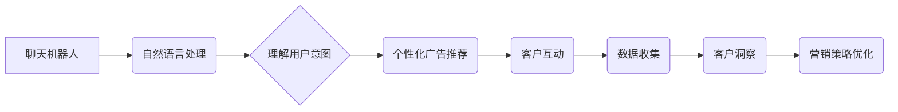

                 

## 聊天机器人营销：个性化广告和洞察力

> 关键词：聊天机器人、营销自动化、个性化广告、自然语言处理、数据分析、客户洞察、AI驱动的营销

### 1. 背景介绍

在数字时代，消费者对个性化体验的需求日益增长。传统营销方式的“一刀切”策略已难以满足消费者日益多元化的需求。聊天机器人作为一种新兴的营销工具，凭借其强大的自然语言处理能力和智能化交互体验，正在改变着营销格局。

聊天机器人可以与消费者进行实时对话，理解他们的需求，并提供个性化的产品推荐、服务咨询和促销信息。相比传统的广告投放，聊天机器人营销能够更精准地触达目标客户，提高广告转化率，并为企业提供宝贵的客户洞察数据。

### 2. 核心概念与联系

#### 2.1 聊天机器人

聊天机器人是一种能够通过自然语言与人类进行对话的计算机程序。它利用自然语言处理（NLP）技术，理解用户的意图，并生成相应的回复。

#### 2.2 营销自动化

营销自动化是指利用软件工具自动执行营销任务，例如发送电子邮件、管理社交媒体、跟踪客户行为等。

#### 2.3 个性化广告

个性化广告是指根据用户的兴趣、行为和偏好定制的广告内容。

#### 2.4 客户洞察

客户洞察是指通过分析客户数据，了解他们的需求、行为和偏好，从而为营销决策提供支持。

**核心概念与联系流程图**



### 3. 核心算法原理 & 具体操作步骤

#### 3.1 算法原理概述

聊天机器人营销的核心算法主要包括：

* **自然语言理解（NLU）:** 用于理解用户的自然语言输入，识别用户的意图和实体。
* **对话管理:** 用于控制聊天机器人的对话流程，根据用户的输入生成相应的回复。
* **个性化推荐:** 用于根据用户的兴趣和行为推荐个性化的产品或服务。
* **数据分析:** 用于分析用户数据，挖掘客户洞察，优化营销策略。

#### 3.2 算法步骤详解

1. **用户输入:** 用户通过文本或语音输入与聊天机器人进行对话。
2. **NLU处理:** 聊天机器人使用NLU算法分析用户的输入，识别用户的意图和实体。
3. **对话管理:** 聊天机器人根据用户的意图，选择合适的对话流程，并生成相应的回复。
4. **个性化推荐:** 聊天机器人根据用户的兴趣和行为，推荐个性化的产品或服务。
5. **用户反馈:** 用户对聊天机器人的回复进行反馈，例如点击、点赞或评论。
6. **数据收集:** 聊天机器人收集用户的对话数据、反馈数据和行为数据。
7. **数据分析:** 聊天机器人使用数据分析算法，挖掘用户的兴趣、偏好和需求。
8. **营销策略优化:** 企业根据客户洞察，优化营销策略，例如调整广告投放、个性化产品推荐等。

#### 3.3 算法优缺点

**优点:**

* **个性化体验:** 聊天机器人可以根据用户的需求提供个性化的服务和产品推荐。
* **提高转化率:** 个性化广告和精准营销能够提高广告转化率。
* **实时互动:** 聊天机器人可以与用户进行实时对话，提供即时服务。
* **数据驱动:** 聊天机器人可以收集大量用户数据，为企业提供宝贵的洞察。

**缺点:**

* **技术复杂:** 开发和维护聊天机器人需要专业的技术人员和技术支持。
* **成本较高:** 构建和部署聊天机器人需要一定的成本投入。
* **用户体验:** 聊天机器人的对话体验还需要不断优化，才能满足用户的期望。

#### 3.4 算法应用领域

* **电商:** 提供个性化商品推荐、在线客服、促销活动等服务。
* **金融:** 提供理财咨询、贷款申请、信用卡服务等。
* **旅游:** 提供行程规划、酒店预订、景点推荐等服务。
* **教育:** 提供在线辅导、知识问答、学习资源推荐等服务。

### 4. 数学模型和公式 & 详细讲解 & 举例说明

#### 4.1 数学模型构建

在聊天机器人营销中，可以使用数学模型来预测用户的行为，例如点击率、转化率等。

一个常用的模型是逻辑回归模型，它可以用来预测用户是否会点击广告。

**逻辑回归模型的数学公式:**

$$
P(y=1|x) = \frac{1}{1 + e^{-(w^T x + b)}}
$$

其中：

* $P(y=1|x)$ 是用户点击广告的概率。
* $x$ 是用户的特征向量，例如年龄、性别、兴趣等。
* $w$ 是模型的权重向量。
* $b$ 是模型的偏置项。

#### 4.2 公式推导过程

逻辑回归模型的推导过程比较复杂，涉及到概率论、统计学和线性代数等知识。

#### 4.3 案例分析与讲解

假设我们有一个电商平台，想要预测用户是否会点击某个商品的广告。我们可以收集用户的特征数据，例如年龄、性别、浏览历史、购买记录等，并使用逻辑回归模型进行训练。

训练完成后，我们可以将模型应用于新的用户数据，预测他们是否会点击广告。

### 5. 项目实践：代码实例和详细解释说明

#### 5.1 开发环境搭建

* Python 3.x
* TensorFlow 或 PyTorch
* NLTK 或 SpaCy

#### 5.2 源代码详细实现

```python
# 导入必要的库
import tensorflow as tf

# 定义模型结构
model = tf.keras.models.Sequential([
    tf.keras.layers.Dense(64, activation='relu', input_shape=(num_features,)),
    tf.keras.layers.Dense(1, activation='sigmoid')
])

# 编译模型
model.compile(optimizer='adam',
              loss='binary_crossentropy',
              metrics=['accuracy'])

# 训练模型
model.fit(X_train, y_train, epochs=10)

# 评估模型
loss, accuracy = model.evaluate(X_test, y_test)
print('Loss:', loss)
print('Accuracy:', accuracy)
```

#### 5.3 代码解读与分析

* 首先，我们导入必要的库，例如 TensorFlow。
* 然后，我们定义模型结构，使用两层全连接神经网络。
* 接着，我们编译模型，选择优化器、损失函数和评价指标。
* 接下来，我们训练模型，使用训练数据进行训练。
* 最后，我们评估模型，使用测试数据计算模型的损失和准确率。

#### 5.4 运行结果展示

训练完成后，我们可以查看模型的损失和准确率，评估模型的性能。

### 6. 实际应用场景

#### 6.1 电商平台

* **个性化商品推荐:** 聊天机器人可以根据用户的浏览历史、购买记录和兴趣爱好，推荐个性化的商品。
* **在线客服:** 聊天机器人可以提供24小时在线客服，解答用户的疑问，解决用户的售后问题。
* **促销活动:** 聊天机器人可以发送促销信息，提醒用户参与活动，提高用户参与度。

#### 6.2 金融机构

* **理财咨询:** 聊天机器人可以根据用户的风险承受能力和投资目标，提供个性化的理财建议。
* **贷款申请:** 聊天机器人可以引导用户填写贷款申请信息，并自动完成贷款审批流程。
* **信用卡服务:** 聊天机器人可以帮助用户查询信用卡余额、账单信息和积分情况。

#### 6.3 旅游公司

* **行程规划:** 聊天机器人可以根据用户的旅行时间、预算和兴趣爱好，推荐个性化的行程安排。
* **酒店预订:** 聊天机器人可以帮助用户查询酒店价格、房间类型和预订信息。
* **景点推荐:** 聊天机器人可以根据用户的兴趣爱好，推荐附近的景点和旅游活动。

#### 6.4 未来应用展望

随着人工智能技术的不断发展，聊天机器人营销将在未来发挥更重要的作用。

* **更智能的对话体验:** 聊天机器人将能够理解更复杂的语言，并提供更自然、更人性化的对话体验。
* **更精准的个性化推荐:** 聊天机器人将能够收集更多用户数据，并利用更先进的算法，提供更精准的个性化推荐。
* **更丰富的营销场景:** 聊天机器人将应用于更多营销场景，例如社交媒体营销、内容营销、事件营销等。

### 7. 工具和资源推荐

#### 7.1 学习资源推荐

* **书籍:**
    * 《深度学习》
    * 《自然语言处理》
    * 《聊天机器人技术》
* **在线课程:**
    * Coursera
    * edX
    * Udacity

#### 7.2 开发工具推荐

* **Rasa:** 开源聊天机器人平台
* **Dialogflow:** Google提供的聊天机器人平台
* **Amazon Lex:** Amazon提供的聊天机器人平台

#### 7.3 相关论文推荐

* **BERT: Pre-training of Deep Bidirectional Transformers for Language Understanding**
* **GPT-3: Language Models are Few-Shot Learners**
* **Attention Is All You Need**

### 8. 总结：未来发展趋势与挑战

#### 8.1 研究成果总结

聊天机器人营销已经取得了显著的成果，能够为企业提供个性化体验、提高转化率和洞察客户需求等优势。

#### 8.2 未来发展趋势

* **更智能的对话体验:** 聊天机器人将更加智能，能够理解更复杂的语言，并提供更自然、更人性化的对话体验。
* **更精准的个性化推荐:** 聊天机器人将能够收集更多用户数据，并利用更先进的算法，提供更精准的个性化推荐。
* **更丰富的营销场景:** 聊天机器人将应用于更多营销场景，例如社交媒体营销、内容营销、事件营销等。

#### 8.3 面临的挑战

* **技术挑战:** 聊天机器人技术还面临着一些挑战，例如对话理解、自然语言生成、知识图谱构建等。
* **伦理挑战:** 聊天机器人营销也面临着一些伦理挑战，例如数据隐私、算法偏见、用户信任等。
* **商业挑战:** 聊天机器人营销的商业模式还需进一步探索，例如如何实现盈利、如何评估效果等。

#### 8.4 研究展望

未来，聊天机器人营销将继续发展，并对营销行业产生更深远的影响。

### 9. 附录：常见问题与解答

* **Q1: 聊天机器人营销的成本如何？**

A1: 聊天机器人的成本取决于其复杂程度、功能需求和开发团队规模。

* **Q2: 聊天机器人营销的安全性如何？**

A2: 聊天机器人平台通常会采取措施保障用户数据安全，例如加密传输、数据脱敏等。

* **Q3: 聊天机器人营销的未来发展趋势是什么？**

A3: 聊天机器人营销将更加智能、个性化和场景化。

作者：禅与计算机程序设计艺术 / Zen and the Art of Computer Programming


<end_of_turn>

