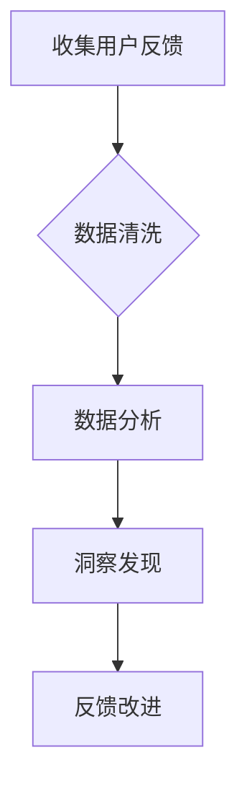

                 

## 自动化创业中的用户反馈收集与分析

> 关键词：用户反馈、自动化、机器学习、自然语言处理、数据分析、创业、产品开发

## 1. 背景介绍

在当今快速迭代的创业环境中，用户反馈是产品成功与否的关键因素。及时、准确地收集和分析用户反馈，可以帮助创业公司了解用户需求，改进产品功能，提升用户体验，从而获得竞争优势。然而，传统的手动收集和分析方式效率低下，难以应对海量用户反馈的挑战。

自动化收集和分析用户反馈已成为创业公司数字化转型的重要趋势。通过利用人工智能技术，特别是机器学习和自然语言处理，可以实现对用户反馈的自动化识别、分类、分析和洞察，从而为创业公司提供更快速、更精准、更全面的用户洞察。

## 2. 核心概念与联系

### 2.1 用户反馈收集

用户反馈收集是指从用户那里获取关于产品、服务或体验的意见、建议、评价等信息的过程。

**收集渠道:**

* **在线渠道:** 网站评论、论坛帖子、社交媒体评论、App Store/Google Play 评论等
* **线下渠道:** 用户访谈、问卷调查、焦点小组等

### 2.2 数据分析

数据分析是指对收集到的用户反馈数据进行整理、清洗、挖掘和解释，以发现其中的规律、趋势和洞察。

**分析方法:**

* **文本分析:** 利用自然语言处理技术对用户反馈文本进行分析，识别情感倾向、主题关键词、用户痛点等
* **统计分析:** 对用户反馈数据进行统计分析，例如用户满意度评分、问题频率、用户群体特征等
* **机器学习:** 利用机器学习算法对用户反馈数据进行建模，例如预测用户行为、识别潜在问题等

**数据分析流程:**



## 3. 核心算法原理 & 具体操作步骤

### 3.1 算法原理概述

本节将介绍一种常用的用户反馈分析算法——**情感分析**。情感分析是一种利用自然语言处理技术，从文本数据中识别出情感倾向（例如正面、负面、中性）的算法。

### 3.2 算法步骤详解

1. **数据预处理:** 对用户反馈文本进行清洗和预处理，例如去除停用词、标点符号、HTML标签等，并将文本转换为标准格式。
2. **特征提取:** 从预处理后的文本中提取特征，例如词语、词性、句子结构等。
3. **情感分类:** 利用机器学习算法对文本进行情感分类，例如支持向量机、随机森林、深度学习等。
4. **结果输出:** 将情感分类结果输出，例如每个文本的情感倾向得分、文本的情感类别等。

### 3.3 算法优缺点

**优点:**

* 可以自动识别文本的情感倾向，提高分析效率。
* 可以处理海量用户反馈数据，发现隐藏的趋势和洞察。
* 可以帮助创业公司了解用户对产品、服务或体验的真实感受。

**缺点:**

* 情感分析算法的准确性取决于训练数据质量，如果训练数据不充分或存在偏差，则算法的准确性会降低。
* 情感分析算法难以识别复杂的语义和情感表达，例如讽刺、幽默等。

### 3.4 算法应用领域

情感分析算法广泛应用于以下领域:

* **市场营销:** 分析用户对品牌、产品和广告的评价，优化营销策略。
* **客户服务:** 自动识别客户的投诉和问题，提高客户服务效率。
* **社会科学研究:** 分析用户对社会事件和政治议题的看法，了解社会舆论趋势。

## 4. 数学模型和公式 & 详细讲解 & 举例说明

### 4.1 数学模型构建

情感分析算法通常基于**概率模型**，例如**朴素贝叶斯模型**。朴素贝叶斯模型假设每个特征独立地对情感分类的影响。

### 4.2 公式推导过程

假设我们有一个训练数据集，包含N个文本样本和对应的情感类别标签。每个文本样本包含M个特征。

**朴素贝叶斯模型的概率公式:**

$$P(C|X) = \frac{P(X|C)P(C)}{P(X)}$$

其中:

* $P(C|X)$: 文本样本X属于情感类别C的概率。
* $P(X|C)$: 情感类别C下，文本样本X出现的概率。
* $P(C)$: 情感类别C出现的概率。
* $P(X)$: 文本样本X出现的概率。

### 4.3 案例分析与讲解

假设我们有一个训练数据集，包含以下文本样本和情感类别标签:

| 文本样本 | 情感类别 |
|---|---|
| 这本书太棒了！ | 正面 |
| 这本书很无聊。 | 负面 |
| 这本书还可以。 | 中性 |

我们可以使用朴素贝叶斯模型来计算文本“这本书很好看”属于情感类别正面的概率。

**步骤:**

1. 计算每个情感类别出现的概率:

* $P(正面) = 1/3$
* $P(负面) = 1/3$
* $P(中性) = 1/3$

2. 计算每个情感类别下，文本样本中特定词语出现的概率:

* $P("很好看"|正面) = 1$
* $P("很好看"|负面) = 0$
* $P("很好看"|中性) = 0$

3. 使用朴素贝叶斯公式计算文本“这本书很好看”属于情感类别正面的概率:

$$P(正面|“这本书很好看”) = \frac{P("很好看"|正面)P(正面)}{P("这本书很好看")}$$

由于文本“这本书很好看”中包含词语“很好看”，因此 $P("很好看"|正面)$ 为1。

最终，我们可以得到文本“这本书很好看”属于情感类别正面的概率为:

$$P(正面|“这本书很好看”) = \frac{1 * (1/3)}{P("这本书很好看")}$$

## 5. 项目实践：代码实例和详细解释说明

### 5.1 开发环境搭建

本示例使用Python语言和NLTK库进行情感分析。

**依赖库:**

* NLTK: 自然语言处理库

**安装命令:**

```bash
pip install nltk
```

### 5.2 源代码详细实现

```python
import nltk
from nltk.sentiment import SentimentIntensityAnalyzer

# 下载情感分析模型
nltk.download('vader_lexicon')

# 初始化情感分析器
analyzer = SentimentIntensityAnalyzer()

# 用户反馈文本
text = "这本书太棒了！"

# 分析文本情感
scores = analyzer.polarity_scores(text)

# 打印情感分析结果
print(scores)
```

### 5.3 代码解读与分析

1. 导入必要的库，包括NLTK库和SentimentIntensityAnalyzer类。
2. 下载情感分析模型`vader_lexicon`。
3. 初始化情感分析器`analyzer`。
4. 定义用户反馈文本`text`。
5. 使用`analyzer.polarity_scores()`函数对文本进行情感分析，得到情感分析结果`scores`。
6. 打印情感分析结果`scores`，包含正面情感得分、负面情感得分、中性情感得分和综合情感得分。

### 5.4 运行结果展示

```
{'neg': 0.0, 'neu': 0.243, 'pos': 0.757, 'compound': 0.9067}
```

结果显示，文本“这本书太棒了！”的综合情感得分`compound`为0.9067，属于正面情感。

## 6. 实际应用场景

### 6.1 产品开发

* **用户需求分析:** 分析用户对产品功能的反馈，了解用户需求和痛点，从而改进产品设计和开发方向。
* **产品迭代优化:** 定期收集用户反馈，分析用户对产品更新的评价，及时优化产品功能和体验。
* **用户体验测试:** 利用用户反馈数据进行用户体验测试，发现产品中的 usability 问题，并进行改进。

### 6.2 市场营销

* **品牌监测:** 分析用户对品牌、产品和广告的评价，了解品牌形象和市场趋势，及时调整营销策略。
* **客户关系管理:** 分析用户对产品的反馈，识别潜在的问题和不满，及时进行客户服务和解决问题，提升客户满意度。
* **广告投放优化:** 分析用户对广告的反馈，优化广告文案和投放策略，提高广告效果。

### 6.3 其他应用场景

* **社会科学研究:** 分析用户对社会事件和政治议题的看法，了解社会舆论趋势和民意变化。
* **教育领域:** 分析学生对课程和教学的反馈，了解教学效果和学生需求，改进教学方法和内容。

### 6.4 未来应用展望

随着人工智能技术的不断发展，用户反馈收集和分析将更加智能化、自动化和精准化。未来，我们可以期待以下应用场景:

* **个性化用户体验:** 根据用户的反馈数据，为用户提供个性化的产品推荐、服务和体验。
* **预测用户行为:** 利用机器学习算法，预测用户的行为和需求，提前提供解决方案和服务。
* **主动式用户反馈:** 利用人工智能技术，主动向用户收集反馈，并根据反馈进行产品改进和优化。

## 7. 工具和资源推荐

### 7.1 学习资源推荐

* **书籍:**
    * 自然语言处理与情感分析
    * 人工智能：一种现代方法
* **在线课程:**
    * Coursera: 自然语言处理
    * edX: 人工智能
* **博客和论坛:**
    * NLTK 官方博客
    * Stack Overflow

### 7.2 开发工具推荐

* **Python:** 广泛应用于自然语言处理和机器学习领域，拥有丰富的库和工具。
* **NLTK:** 自然语言处理库，提供各种文本分析工具和算法。
* **spaCy:** 高性能自然语言处理库，支持多种语言和任务。
* **Gensim:** 主题建模和词嵌入库。

### 7.3 相关论文推荐

* **Sentiment Analysis and Opinion Mining**
* **A Survey of Transfer Learning in Natural Language Processing**
* **Deep Learning for Natural Language Processing**

## 8. 总结：未来发展趋势与挑战

### 8.1 研究成果总结

自动化收集和分析用户反馈已成为创业公司数字化转型的重要趋势。通过利用人工智能技术，特别是机器学习和自然语言处理，可以实现对用户反馈的自动化识别、分类、分析和洞察，从而为创业公司提供更快速、更精准、更全面的用户洞察。

### 8.2 未来发展趋势

* **更精准的情感分析:** 利用深度学习等先进算法，提高情感分析的准确性和细粒度。
* **多模态用户反馈分析:** 将文本、图像、音频等多模态数据融合，进行更全面的用户反馈分析。
* **个性化用户反馈分析:** 根据用户的特征和行为，提供个性化的用户反馈分析和洞察。

### 8.3 面临的挑战

* **数据质量问题:** 情感分析算法的准确性取决于训练数据质量，如果训练数据不充分或存在偏差，则算法的准确性会降低。
* **语义理解的复杂性:** 情感表达往往具有复杂的语义和文化背景，难以被算法完全理解。
* **隐私保护问题:** 用户反馈数据可能包含敏感信息，需要采取措施保护用户隐私。

### 8.4 研究展望

未来，我们需要继续探索更先进的算法和技术，提高用户反馈分析的准确性和效率，同时也要关注数据质量、语义理解和隐私保护等问题，确保用户反馈分析能够真正为创业公司提供价值。

## 9. 附录：常见问题与解答

**Q1: 如何选择合适的用户反馈收集渠道？**

**A1:** 选择用户反馈收集渠道需要根据目标用户群体、产品类型和业务需求进行综合考虑。例如，对于年轻用户群体，社交媒体评论可能是重要的收集渠道；对于专业用户群体，论坛帖子和访谈可能是更有效的渠道。

**Q2: 如何处理用户反馈数据中的噪音和异常值？**

**A2:** 可以使用数据清洗技术，例如去除停用词、标点符号、HTML标签等，以及使用异常值检测算法，识别和处理异常值。

**Q3: 如何评估情感分析算法的准确性？**

**A3:** 可以使用准确率、召回率、F1-score等指标评估情感分析算法的准确性。

**作者：禅与计算机程序设计艺术 / Zen and the Art of Computer Programming**<end_of_turn>

