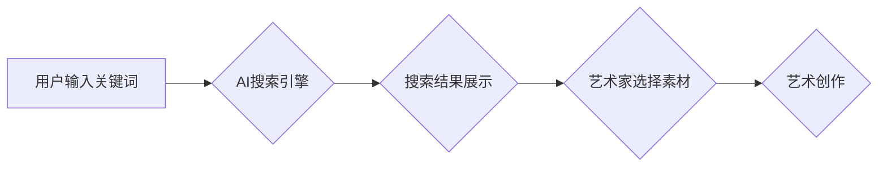

                 

## 艺术创作中的AI搜索应用

> 关键词：人工智能、艺术创作、搜索引擎、图像生成、风格迁移、文本到图像、深度学习、GAN

## 1. 背景介绍

艺术创作一直以来都是人类文明的重要组成部分，它反映了人类对世界的理解和对美的追求。随着人工智能技术的快速发展，AI开始在艺术创作领域崭露头角，并展现出巨大的潜力。

传统的艺术创作往往依赖于艺术家自身的经验、技巧和灵感。而AI搜索应用则为艺术家提供了全新的创作工具，可以帮助他们快速找到灵感、探索新的可能性，并更高效地完成创作。

## 2. 核心概念与联系

### 2.1  AI搜索引擎

AI搜索引擎是一种利用人工智能技术，能够理解用户意图并提供更精准、更相关的搜索结果的搜索引擎。与传统的基于关键词匹配的搜索引擎不同，AI搜索引擎可以理解自然语言、图像、音频等多种数据类型，并根据用户需求进行更深入的理解和分析。

### 2.2  艺术创作与搜索

在艺术创作中，AI搜索引擎可以帮助艺术家完成以下任务：

* **寻找灵感:** 艺术家可以通过搜索特定主题、风格、艺术家等关键词，找到相关的艺术作品、素材和信息，激发创作灵感。
* **探索新的可能性:** AI搜索引擎可以根据艺术家已有的作品风格，推荐相关的艺术风格、创作技巧和素材，帮助艺术家探索新的创作方向。
* **提高创作效率:** AI搜索引擎可以帮助艺术家快速找到所需的素材、工具和信息，提高创作效率。

### 2.3  AI生成艺术

AI生成艺术是指利用人工智能技术，自动生成艺术作品的创作方式。常见的AI生成艺术技术包括：

* **文本到图像:** 通过输入文本描述，AI模型生成相应的图像。
* **风格迁移:** 将一幅图像的风格迁移到另一幅图像上。
* **图像合成:** 将多幅图像合成成一幅新的图像。

**Mermaid 流程图**



## 3. 核心算法原理 & 具体操作步骤

### 3.1  算法原理概述

AI搜索引擎的核心算法原理是基于深度学习技术，主要包括以下几个方面：

* **自然语言处理 (NLP):** 用于理解用户的自然语言输入，提取关键词和语义信息。
* **图像识别 (Computer Vision):** 用于识别图像中的物体、场景和风格信息。
* **机器学习 (Machine Learning):** 用于训练模型，学习用户搜索行为和艺术作品之间的关系。

### 3.2  算法步骤详解

1. **数据收集和预处理:** 收集大量艺术作品数据、文本描述数据和用户搜索行为数据，并进行预处理，例如文本清洗、图像裁剪等。
2. **模型训练:** 利用机器学习算法，训练AI模型，使其能够理解用户意图、识别艺术作品特征和预测用户搜索结果的 relevance。
3. **搜索请求处理:** 当用户输入搜索关键词时，AI搜索引擎会首先进行自然语言处理，提取关键词和语义信息。
4. **结果检索和排序:** 根据用户搜索意图和模型训练结果，从数据库中检索相关的艺术作品和信息，并根据相关性、时效性等因素进行排序。
5. **结果展示:** 将排序后的结果以列表、图像、地图等形式展示给用户。

### 3.3  算法优缺点

**优点:**

* **精准度高:** AI搜索引擎能够理解用户意图，提供更精准的搜索结果。
* **效率高:** AI搜索引擎可以快速检索和排序大量数据，提高搜索效率。
* **个性化:** AI搜索引擎可以根据用户的搜索历史和偏好，提供个性化的搜索结果。

**缺点:**

* **数据依赖:** AI搜索引擎的性能依赖于训练数据的质量和数量。
* **解释性差:** AI模型的决策过程往往难以解释，这可能会导致用户对搜索结果的信任度降低。
* **伦理问题:** AI生成艺术可能引发版权、原创性和伦理等问题。

### 3.4  算法应用领域

AI搜索引擎在艺术创作领域有着广泛的应用场景，例如：

* **艺术作品搜索:** 帮助艺术家和收藏家快速找到所需的艺术作品。
* **艺术风格探索:** 帮助艺术家探索新的艺术风格和创作方向。
* **艺术素材库:** 建立一个包含大量艺术素材的数据库，供艺术家使用。
* **AI辅助创作:** 利用AI生成艺术技术，辅助艺术家完成创作。

## 4. 数学模型和公式 & 详细讲解 & 举例说明

### 4.1  数学模型构建

在AI搜索引擎中，常用的数学模型包括：

* **词嵌入模型 (Word Embedding):** 将单词映射到低维向量空间，捕捉单词之间的语义关系。常见的词嵌入模型包括Word2Vec和GloVe。
* **协同过滤模型 (Collaborative Filtering):** 根据用户的历史行为和物品之间的关联性，预测用户对物品的评分或偏好。
* **深度神经网络 (Deep Neural Network):** 利用多层神经网络结构，学习更复杂的特征和关系。

### 4.2  公式推导过程

**词嵌入模型的训练目标:**

$$
\min_{W} \sum_{i=1}^{N} \sum_{j \in \mathcal{N}(i)} \log \sigma(w_i^T w_j + b)
$$

其中：

* $W$ 是词嵌入矩阵。
* $N$ 是词汇表的大小。
* $\mathcal{N}(i)$ 是词 $i$ 的上下文词集合。
* $\sigma$ 是sigmoid函数。
* $w_i$ 是词 $i$ 的词嵌入向量。
* $b$ 是偏置项。

### 4.3  案例分析与讲解

**Word2Vec模型**

Word2Vec模型是一种常用的词嵌入模型，它通过训练一个神经网络，将单词映射到低维向量空间。

**举例说明:**

假设我们训练了一个Word2Vec模型，并得到了以下词嵌入向量：

* "king" : [0.2, 0.3, 0.4]
* "queen" : [0.1, 0.2, 0.5]
* "man" : [0.4, 0.3, 0.2]

我们可以观察到，"king" 和 "queen" 的词嵌入向量相近，因为它们是同类概念。

## 5. 项目实践：代码实例和详细解释说明

### 5.1  开发环境搭建

* **操作系统:** Ubuntu 18.04
* **编程语言:** Python 3.6
* **深度学习框架:** TensorFlow 2.0
* **其他依赖:** numpy, pandas, matplotlib

### 5.2  源代码详细实现

```python
# 导入必要的库
import tensorflow as tf
from tensorflow.keras.layers import Embedding, Dense
from tensorflow.keras.models import Sequential

# 定义词嵌入模型
model = Sequential()
model.add(Embedding(input_dim=vocab_size, output_dim=embedding_dim))
model.add(Dense(units=1, activation='sigmoid'))

# 编译模型
model.compile(optimizer='adam', loss='binary_crossentropy', metrics=['accuracy'])

# 训练模型
model.fit(x_train, y_train, epochs=10)

# 保存模型
model.save('word2vec_model.h5')
```

### 5.3  代码解读与分析

* **Embedding层:** 将单词映射到低维向量空间。
* **Dense层:** 全连接层，用于预测单词之间的相似度。
* **Adam优化器:** 用于优化模型参数。
* **binary_crossentropy损失函数:** 用于计算模型预测结果与真实值的差异。
* **accuracy指标:** 用于评估模型的准确率。

### 5.4  运行结果展示

训练完成后，我们可以使用模型预测单词之间的相似度。例如，我们可以预测 "king" 和 "queen" 之间的相似度。

## 6. 实际应用场景

### 6.1  艺术作品搜索引擎

AI搜索引擎可以帮助艺术家和收藏家快速找到所需的艺术作品。例如，艺术家可以通过搜索特定主题、风格、艺术家等关键词，找到相关的艺术作品、素材和信息。

### 6.2  艺术风格探索工具

AI搜索引擎可以帮助艺术家探索新的艺术风格和创作方向。例如，艺术家可以通过搜索已有的艺术作品，找到与自己风格相似的作品，并从中获得灵感。

### 6.3  AI辅助创作平台

AI辅助创作平台可以利用AI生成艺术技术，帮助艺术家完成创作。例如，艺术家可以通过输入文本描述，让AI生成相应的图像，并以此为基础进行创作。

### 6.4  未来应用展望

随着人工智能技术的不断发展，AI搜索应用在艺术创作领域将有更广泛的应用场景。例如：

* **个性化艺术创作:** AI可以根据用户的喜好和风格，生成个性化的艺术作品。
* **跨界艺术创作:** AI可以将不同艺术形式融合在一起，创造出全新的艺术体验。
* **艺术教育:** AI可以作为艺术教育工具，帮助学生学习艺术知识和技巧。

## 7. 工具和资源推荐

### 7.1  学习资源推荐

* **斯坦福大学CS224N自然语言处理课程:** https://web.stanford.edu/class/cs224n/
* **DeepLearning.AI深度学习课程:** https://www.deeplearning.ai/

### 7.2  开发工具推荐

* **TensorFlow:** https://www.tensorflow.org/
* **PyTorch:** https://pytorch.org/

### 7.3  相关论文推荐

* **Word2Vec: A Simple and Efficient Method for Learning Word Representations:** https://arxiv.org/abs/1301.3781
* **Attention Is All You Need:** https://arxiv.org/abs/1706.03762

## 8. 总结：未来发展趋势与挑战

### 8.1  研究成果总结

AI搜索应用在艺术创作领域取得了显著的成果，例如：

* **提高了艺术作品搜索的精准度和效率。**
* **为艺术家提供了新的创作灵感和工具。**
* **推动了艺术创作的创新和发展。**

### 8.2  未来发展趋势

未来，AI搜索应用在艺术创作领域将朝着以下方向发展：

* **更精准的搜索结果:** 利用更先进的深度学习算法，提高搜索结果的精准度和相关性。
* **更个性化的创作体验:** 根据用户的喜好和风格，生成个性化的艺术作品。
* **更跨界和融合的艺术创作:** 将不同艺术形式融合在一起，创造出全新的艺术体验。

### 8.3  面临的挑战

AI搜索应用在艺术创作领域也面临着一些挑战：

* **数据质量问题:** AI模型的性能依赖于训练数据的质量和数量。
* **解释性问题:** AI模型的决策过程往往难以解释，这可能会导致用户对搜索结果的信任度降低。
* **伦理问题:** AI生成艺术可能引发版权、原创性和伦理等问题。

### 8.4  研究展望

未来，我们需要继续研究以下问题：

* 如何提高AI模型的解释性，增强用户对搜索结果的信任度。
* 如何解决AI生成艺术的伦理问题，确保其合法性和可持续发展。
* 如何将AI搜索应用与其他艺术创作工具融合，创造出更丰富的艺术体验。

## 9. 附录：常见问题与解答

**Q1: AI搜索引擎可以替代人类艺术家吗？**

A1: 目前，AI搜索引擎只能辅助人类艺术家完成创作，并不能完全替代人类艺术家。人类艺术家拥有创造力和想象力，而AI搜索引擎只能提供工具和素材。

**Q2: AI生成艺术的版权归属问题如何解决？**

A2: AI生成艺术的版权归属问题是一个复杂的问题，目前还没有统一的解决方案。需要进一步探讨法律法规和伦理规范，以确保AI生成艺术的合法性和可持续发展。


作者：禅与计算机程序设计艺术 / Zen and the Art of Computer Programming 
<end_of_turn>

