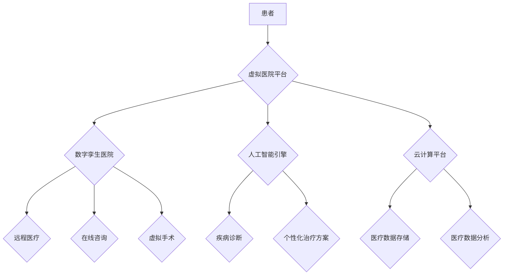

                 

## 虚拟医院:全球医疗行业的数字化升级

> 关键词：虚拟医院、数字孪生、人工智能、机器学习、云计算、区块链、远程医疗、医疗数据分析

## 1. 背景介绍

医疗行业正处于一场前所未有的数字化变革之中。随着技术的不断发展，特别是人工智能、云计算、大数据等技术的蓬勃兴起，虚拟医院的概念应运而生，并逐渐成为医疗行业未来发展的重要趋势。

传统医院面临着诸多挑战，例如：

* **资源分配不均:** 医疗资源往往集中在城市，而农村地区医疗资源匮乏。
* **医疗服务效率低下:** 患者排队等候时间长，诊疗流程繁琐。
* **医疗数据孤岛:** 各个医疗机构的数据无法互通共享，导致信息不对称。
* **医疗成本高昂:** 医疗费用不断上涨，给患者带来沉重的经济负担。

虚拟医院作为一种新型的医疗模式，旨在通过数字化技术解决这些问题，提供更加便捷、高效、智能的医疗服务。

## 2. 核心概念与联系

虚拟医院是指利用数字孪生技术、人工智能、云计算等先进技术构建的虚拟医疗环境。它可以模拟真实医院的结构和功能，并提供远程医疗、在线咨询、虚拟手术等多种服务。

**核心概念:**

* **数字孪生:** 数字孪生是指利用物理世界的数据和模型构建一个虚拟的镜像，可以实时反映物理世界的状态和变化。
* **人工智能:** 人工智能是指模拟人类智能的计算机系统，可以进行学习、推理、决策等复杂任务。
* **云计算:** 云计算是指利用互联网提供计算资源、存储资源和软件服务的模式。

**架构图:**



## 3. 核心算法原理 & 具体操作步骤

### 3.1  算法原理概述

虚拟医院的核心算法主要包括：

* **图像识别算法:** 用于识别患者的病症和症状。
* **自然语言处理算法:** 用于理解患者的语言描述和需求。
* **机器学习算法:** 用于预测疾病的风险和制定个性化的治疗方案。

### 3.2  算法步骤详解

**图像识别算法:**

1. **图像采集:** 使用摄像头或其他设备采集患者的图像。
2. **图像预处理:** 对图像进行增强、去噪等处理，提高识别精度。
3. **特征提取:** 从图像中提取关键特征，例如病灶、肿块等。
4. **分类识别:** 将提取的特征与已知的疾病图像进行匹配，识别患者的病症。

**自然语言处理算法:**

1. **文本预处理:** 对患者的语言描述进行清洗、分词等处理，去除停用词和标点符号。
2. **语义分析:** 分析患者语言的含义和情感，理解患者的需求。
3. **知识图谱构建:** 将患者的语言描述与医疗知识库进行关联，构建患者的疾病知识图谱。
4. **对话生成:** 根据患者的需求，生成相应的医疗建议和回复。

**机器学习算法:**

1. **数据收集:** 收集患者的医疗数据，例如病历、检查结果、生活习惯等。
2. **数据预处理:** 对医疗数据进行清洗、标准化等处理，提高模型的训练精度。
3. **模型训练:** 使用机器学习算法训练模型，例如决策树、支持向量机、神经网络等。
4. **模型评估:** 使用测试数据评估模型的性能，例如准确率、召回率、F1值等。
5. **个性化治疗方案:** 根据患者的医疗数据和模型预测，制定个性化的治疗方案。

### 3.3  算法优缺点

**优点:**

* **提高医疗效率:** 自动化诊断和治疗方案制定，缩短患者就诊时间。
* **降低医疗成本:** 减少人工成本，提高资源利用率。
* **提升医疗质量:** 基于大数据分析和人工智能，提供更加精准的诊断和治疗方案。
* **扩大医疗服务范围:** 远程医疗服务可以覆盖到偏远地区，解决医疗资源分配不均的问题。

**缺点:**

* **数据安全和隐私问题:** 医疗数据是高度敏感的信息，需要采取严格的安全措施保护患者隐私。
* **算法偏差问题:** 机器学习算法的训练数据可能存在偏差，导致算法结果不准确。
* **伦理问题:** 人工智能在医疗领域的应用引发了伦理争议，例如医生责任、患者自主权等问题。

### 3.4  算法应用领域

虚拟医院的核心算法可以应用于以下领域:

* **远程医疗:** 提供远程诊断、咨询、治疗等服务。
* **在线问诊:** 患者可以通过线上平台咨询医生，获得医疗建议。
* **虚拟手术:** 利用虚拟现实技术模拟手术场景，进行手术培训和远程手术指导。
* **疾病预测:** 基于患者的医疗数据，预测疾病的风险和发展趋势。
* **个性化治疗:** 根据患者的基因信息、生活习惯等因素，制定个性化的治疗方案。

## 4. 数学模型和公式 & 详细讲解 & 举例说明

### 4.1  数学模型构建

虚拟医院的构建需要建立多个数学模型，例如：

* **疾病诊断模型:** 利用机器学习算法，构建一个疾病诊断模型，根据患者的症状和检查结果，预测患者患病的概率。
* **治疗方案推荐模型:** 根据患者的病史、基因信息、生活习惯等因素，构建一个治疗方案推荐模型，推荐最合适的治疗方案。
* **资源分配模型:** 利用优化算法，构建一个资源分配模型，优化医疗资源的分配，提高医疗服务效率。

### 4.2  公式推导过程

**疾病诊断模型:**

假设有 $n$ 种疾病，$m$ 个患者的症状特征。可以使用逻辑回归模型进行疾病诊断，其目标函数为：

$$
L(w) = -\frac{1}{m} \sum_{i=1}^{m} \left[ y_i \log(p_i) + (1-y_i) \log(1-p_i) \right]
$$

其中：

* $w$ 是模型参数
* $y_i$ 是第 $i$ 个患者患病的标签 (0 或 1)
* $p_i$ 是第 $i$ 个患者患病的概率

通过梯度下降算法，可以求解模型参数 $w$，使得目标函数 $L(w)$ 最小化。

### 4.3  案例分析与讲解

**案例:**

假设有 3 种疾病 (感冒、流感、肺炎) 和 100 个患者的症状特征数据。可以使用逻辑回归模型训练一个疾病诊断模型。

**分析:**

通过训练模型，可以得到每个疾病的诊断概率。例如，对于一个患者，模型预测患感冒的概率为 0.7，患流感的概率为 0.2，患肺炎的概率为 0.1。

**讲解:**

根据模型预测的概率，医生可以判断患者患病的可能性，并制定相应的治疗方案。

## 5. 项目实践：代码实例和详细解释说明

### 5.1  开发环境搭建

虚拟医院的开发环境需要包含以下软件：

* **操作系统:** Linux 或 Windows
* **编程语言:** Python
* **深度学习框架:** TensorFlow 或 PyTorch
* **云计算平台:** AWS、Azure 或 GCP
* **数据库:** MySQL 或 PostgreSQL

### 5.2  源代码详细实现

以下是一个简单的虚拟医院代码示例，使用 Python 和 TensorFlow 框架实现一个疾病诊断模型:

```python
import tensorflow as tf

# 定义模型结构
model = tf.keras.models.Sequential([
  tf.keras.layers.Dense(128, activation='relu', input_shape=(10,)),
  tf.keras.layers.Dense(64, activation='relu'),
  tf.keras.layers.Dense(3, activation='softmax')
])

# 编译模型
model.compile(optimizer='adam',
              loss='categorical_crossentropy',
              metrics=['accuracy'])

# 训练模型
model.fit(x_train, y_train, epochs=10)

# 评估模型
loss, accuracy = model.evaluate(x_test, y_test)
print('Loss:', loss)
print('Accuracy:', accuracy)
```

**代码解读:**

* 该代码定义了一个简单的多层感知机模型，用于疾病诊断。
* 模型输入层有 10 个神经元，对应患者的 10 个症状特征。
* 模型输出层有 3 个神经元，对应 3 种疾病。
* 使用 Adam 优化器、交叉熵损失函数和准确率作为评估指标。
* 模型训练 10 个 epochs，并使用测试数据评估模型性能。

### 5.3  代码解读与分析

* **模型结构:** 该模型结构简单，可以根据实际需求进行调整。
* **训练数据:** 训练数据质量直接影响模型性能，需要使用高质量的医疗数据进行训练。
* **超参数调优:** 模型的超参数，例如学习率、隐藏层数量、神经元数量等，需要进行调优，以获得最佳的模型性能。

### 5.4  运行结果展示

运行结果会显示模型的损失值和准确率。

## 6. 实际应用场景

虚拟医院的应用场景非常广泛，例如：

* **远程医疗:** 患者可以通过视频通话、语音通话等方式与医生进行远程咨询，获得医疗建议和诊断。
* **在线问诊:** 患者可以通过线上平台提交症状描述，获得医生的在线问诊服务。
* **虚拟手术:** 利用虚拟现实技术模拟手术场景，进行手术培训和远程手术指导。
* **疾病预测:** 基于患者的医疗数据，预测疾病的风险和发展趋势，帮助患者进行预防和治疗。
* **个性化治疗:** 根据患者的基因信息、生活习惯等因素，制定个性化的治疗方案。

### 6.4  未来应用展望

未来，虚拟医院将更加智能化、个性化和便捷化。例如：

* **人工智能驱动的诊断和治疗:** 人工智能将能够更加精准地诊断疾病和制定治疗方案。
* **虚拟现实和增强现实技术的应用:** 虚拟现实和增强现实技术将能够为患者提供更加沉浸式的医疗体验。
* **区块链技术的应用:** 区块链技术可以保障医疗数据的安全性和隐私性。
* **大数据分析的应用:** 大数据分析可以帮助医疗机构更好地了解患者需求和疾病趋势。

## 7. 工具和资源推荐

### 7.1  学习资源推荐

* **在线课程:** Coursera、edX、Udacity 等平台提供人工智能、云计算、大数据等领域的在线课程。
* **书籍:** 《深度学习》、《云计算原理》、《数据挖掘》等书籍可以帮助读者深入了解相关技术。
* **开源项目:** TensorFlow、PyTorch、Kubernetes 等开源项目可以帮助读者实践相关技术。

### 7.2  开发工具推荐

* **编程语言:** Python、Java、C++ 等编程语言可以用于虚拟医院的开发。
* **深度学习框架:** TensorFlow、PyTorch、Keras 等深度学习框架可以用于构建人工智能模型。
* **云计算平台:** AWS、Azure、GCP 等云计算平台可以提供虚拟医院所需的计算资源和存储资源。
* **数据库:** MySQL、PostgreSQL、MongoDB 等数据库可以用于存储虚拟医院的数据。

### 7.3  相关论文推荐

* **深度学习在医疗领域的应用:**
    * LeCun, Y., Bengio, Y., & Hinton, G. (2015). Deep learning. Nature, 521(7553), 436-444.
* **云计算在医疗领域的应用:**
    * Buyya, R., Yeo, C. S., Venugopal, S., Broberg, J., & Brandic, I. (2009). Cloud computing and emerging IT platforms: Vision, hype, and reality for delivering computing as the 5th utility. Future Generation Computer Systems, 25(6), 599-616.
* **区块链技术在医疗领域的应用:**
    * Narayanan, A., & Bonneau, J. (2014). Bitcoin and cryptocurrency technologies: A comprehensive introduction. Princeton University Press.

## 8. 总结：未来发展趋势与挑战

### 8.1  研究成果总结

虚拟医院作为一种新型的医疗模式，在医疗服务效率、医疗质量、医疗资源分配等方面具有显著的优势。

### 8.2  未来发展趋势

未来，虚拟医院将朝着更加智能化、个性化和便捷化的方向发展。

### 8.3  面临的挑战

虚拟医院的发展也面临着一些挑战，例如：

* **数据安全和隐私问题:** 医疗数据是高度敏感的信息，需要采取严格的安全措施保护患者隐私。
* **算法偏差问题:** 机器学习算法的训练数据可能存在偏差，导致算法结果不准确。
* **伦理问题:** 人工智能在医疗领域的应用引发了伦理争议，例如医生责任、患者自主权等问题。

### 8.4  研究展望

未来，需要加强对虚拟医院技术的研发和应用，解决其面临的挑战，推动虚拟医院的健康发展。

## 9. 附录：常见问题与解答

**常见问题:**

* **虚拟医院是否会取代传统医院?**

虚拟医院不会取代传统医院，而是与传统医院相辅相成，形成一个更加完善的医疗服务体系。

* **虚拟医院的安全性如何保证?**

虚拟医院会采用严格的安全措施，例如数据加密、身份验证等，保障患者数据的安全性和隐私性。

* **虚拟医院的费用如何?**

虚拟医院的费用会根据不同的服务项目和患者需求而有所不同，但总体来说，虚拟医院的费用会比传统医院的费用更低。


作者：禅与计算机程序设计艺术 / Zen and the Art of Computer Programming<end_of_turn>

