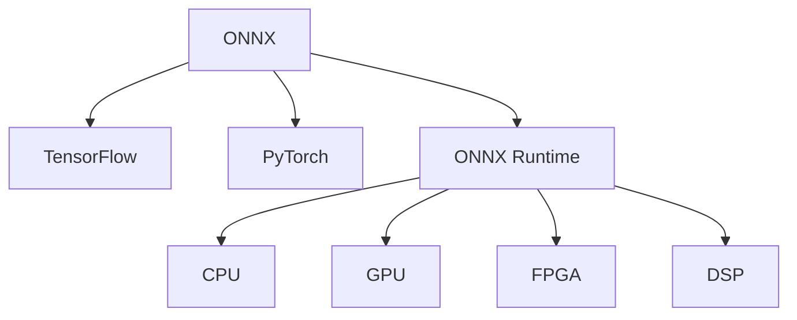

                 

# ONNX Runtime 跨平台部署：在不同设备上运行深度学习模型

> 关键词：ONNX Runtime, 深度学习模型, 跨平台部署, TensorFlow, PyTorch, 跨语言交互, 推理加速, 开源社区, AI应用

## 1. 背景介绍

### 1.1 问题由来

随着深度学习技术的快速发展，深度学习模型在图像识别、语音识别、自然语言处理等众多领域取得了巨大的突破。然而，由于模型训练和推理过程通常依赖于特定的硬件和软件环境，这些模型难以在不同设备和平台之间无缝切换。这种"模型孤岛"现象，限制了深度学习技术在各个垂直领域的广泛应用。

### 1.2 问题核心关键点

为了解决这一问题，ONNX（Open Neural Network Exchange）应运而生。ONNX提供了一个中间表示形式，使得深度学习模型可以在不同的深度学习框架之间进行转换，从而在不同硬件和软件平台上运行。此外，ONNX Runtime提供了优化后的推理引擎，支持跨平台部署，极大地提升了深度学习模型的运行效率和灵活性。

## 2. 核心概念与联系

### 2.1 核心概念概述

为更好地理解ONNX Runtime的跨平台部署机制，本节将介绍几个关键概念：

- ONNX：一种开放标准的中间表示形式，用于描述和交换深度学习模型。ONNX模型可以由不同的深度学习框架（如TensorFlow、PyTorch等）导出和导入，确保模型在不同平台上的兼容性。
- ONNX Runtime：ONNX的执行引擎，提供了跨平台的深度学习推理能力。ONNX Runtime支持多种硬件平台，包括CPU、GPU、FPGA、DSP等，提供了高效的推理性能和灵活的部署方式。
- 跨平台部署：指将深度学习模型部署到不同的硬件和软件平台上，使得模型能够在各种设备上运行，提升模型应用的灵活性和普适性。
- TensorFlow、PyTorch等深度学习框架：目前主流的深度学习模型开发框架，提供了丰富的模型组件和优化算法，支持高性能的模型训练和推理。

这些核心概念之间的逻辑关系可以通过以下Mermaid流程图来展示：



这个流程图展示了大语言模型的核心概念及其之间的关系：

1. ONNX作为模型交换的中间标准，连接了不同的深度学习框架。
2. ONNX Runtime作为ONNX模型的执行引擎，支持跨平台的深度学习推理。
3. TensorFlow、PyTorch等框架提供了丰富的模型组件和优化算法，支持模型开发和训练。
4. ONNX Runtime支持多种硬件平台，提供了高效的推理性能和灵活的部署方式。

## 3. 核心算法原理 & 具体操作步骤

### 3.1 算法原理概述

ONNX Runtime的跨平台部署机制，基于ONNX模型作为中间表示形式，将深度学习模型转化为一个通用的、可执行的代码表示。这个过程中，ONNX Runtime会自动进行模型优化和转换，以适应不同的硬件平台和部署环境。最终，ONNX Runtime将模型转换为特定平台的二进制代码，以实现高效的推理执行。

形式化地，假设原始深度学习模型为 $M_{\theta}$，其中 $\theta$ 为模型参数。ONNX将 $M_{\theta}$ 转换为ONNX模型 $\mathcal{M}$，然后ONNX Runtime根据当前硬件环境，自动将 $\mathcal{M}$ 转换为二进制代码 $\mathcal{C}$。模型的推理过程即为执行 $\mathcal{C}$，得到输出 $y$：

$$
y = \mathcal{C}(\mathcal{M}, \theta)
$$

### 3.2 算法步骤详解

基于ONNX Runtime的跨平台部署，通常包括以下几个关键步骤：

**Step 1: 模型导出和转换**

1. 选择合适的深度学习框架，如TensorFlow或PyTorch，进行模型训练和验证。
2. 将训练好的模型导出为ONNX格式，即生成ONNX模型文件 $\mathcal{M}$。这通常涉及将模型参数 $\theta$ 转换为ONNX格式，并调整模型结构以符合ONNX规范。

**Step 2: 平台适配**

1. 根据目标平台的硬件特性，选择合适的ONNX Runtime部署包，如CPU、GPU、FPGA等。
2. 下载并安装ONNX Runtime部署包，并将其添加到系统路径中。

**Step 3: 模型加载与推理**

1. 使用ONNX Runtime提供的API，加载ONNX模型文件 $\mathcal{M}$。
2. 根据目标硬件平台，ONNX Runtime会自动进行模型优化和转换，生成可执行的二进制代码 $\mathcal{C}$。
3. 使用ONNX Runtime提供的推理引擎，执行二进制代码 $\mathcal{C}$，得到输出 $y$。

**Step 4: 结果处理**

1. 将推理结果 $y$ 转化为用户可理解的格式，如文本、图像等。
2. 对输出结果进行后处理，如有必要，进一步分析和应用。

### 3.3 算法优缺点

ONNX Runtime的跨平台部署机制具有以下优点：

1. 兼容性好。通过ONNX模型作为中间表示形式，支持在多个深度学习框架之间进行模型交换和部署。
2. 可移植性强。ONNX Runtime支持多种硬件平台，便于将模型部署到不同设备上。
3. 效率高。ONNX Runtime提供高效的推理引擎，能够优化模型的执行效率，适应各种硬件和软件环境。

同时，该机制也存在以下局限性：

1. 转换复杂。将深度学习模型转换为ONNX格式，可能需要调整模型结构和参数。
2. 依赖ONNX支持。ONNX Runtime依赖于ONNX规范，对于一些特殊的模型组件和算法可能无法支持。
3. 部署复杂。不同平台上的ONNX Runtime部署和优化策略可能有所不同，增加了部署难度。
4. 扩展性不足。ONNX Runtime的性能优化和扩展，通常需要依赖于具体的硬件平台，难以泛化到所有设备。

尽管存在这些局限性，但就目前而言，ONNX Runtime仍是大规模跨平台部署的重要工具。未来相关研究的重点在于如何进一步简化模型转换和部署过程，提高跨平台兼容性和性能。

### 3.4 算法应用领域

ONNX Runtime的跨平台部署机制，已经在图像识别、语音识别、自然语言处理等众多NLP领域得到了广泛的应用，具体包括以下几个方面：

- **图像识别**：将深度学习模型部署到各种设备上，实现高效、准确的图像分类、目标检测等任务。
- **语音识别**：将语音识别模型部署到不同的硬件平台，实现实时语音转文本、语音合成等功能。
- **自然语言处理**：将自然语言处理模型部署到各种设备上，实现文本分类、情感分析、机器翻译等任务。
- **推荐系统**：将推荐模型部署到不同平台，实现个性化推荐、广告投放等应用。
- **医疗诊断**：将医疗诊断模型部署到医疗设备上，提升诊断的准确性和效率。
- **自动驾驶**：将自动驾驶模型部署到各种车辆上，实现高效、安全的自动驾驶功能。

除了上述这些经典领域外，ONNX Runtime还将在更多场景中得到应用，如智慧城市、工业物联网、智能家居等，为各行各业带来更广泛的技术创新和应用。

## 4. 数学模型和公式 & 详细讲解 & 举例说明

### 4.1 数学模型构建

本节将使用数学语言对ONNX Runtime的跨平台部署机制进行更加严格的刻画。

假设原始深度学习模型为 $M_{\theta}$，其中 $\theta$ 为模型参数。ONNX将 $M_{\theta}$ 转换为ONNX模型 $\mathcal{M}$，然后ONNX Runtime根据当前硬件环境，自动将 $\mathcal{M}$ 转换为二进制代码 $\mathcal{C}$。模型的推理过程即为执行 $\mathcal{C}$，得到输出 $y$。

### 4.2 公式推导过程

以图像分类任务为例，将深度学习模型 $M_{\theta}$ 转换为ONNX模型 $\mathcal{M}$，并使用ONNX Runtime进行推理的计算过程如下：

1. **模型训练**：
   假设使用PyTorch框架进行模型训练，得到模型参数 $\theta$。

   $$
   M_{\theta}(x) = \text{softmax}(\text{convolution}(x; \theta_1) + \text{relu}(\text{convolution}(x; \theta_2) + \text{max-pooling}(x; \theta_3)) + \text{linear}(x; \theta_4))
   $$

2. **模型导出**：
   将模型 $M_{\theta}$ 导出为ONNX模型 $\mathcal{M}$，该过程包括模型参数 $\theta$ 转换为ONNX格式，以及调整模型结构以符合ONNX规范。

3. **平台适配**：
   根据目标平台的硬件特性，选择合适的ONNX Runtime部署包。例如，如果使用GPU进行推理，下载并安装ONNX Runtime GPU部署包。

4. **模型加载与推理**：
   使用ONNX Runtime提供的API，加载ONNX模型文件 $\mathcal{M}$。

   $$
   \mathcal{C} = \text{ONNX Runtime}_{GPU}.load\_model(\mathcal{M})
   $$

5. **模型执行**：
   使用ONNX Runtime提供的推理引擎，执行二进制代码 $\mathcal{C}$，得到输出 $y$。

   $$
   y = \mathcal{C}(\mathcal{M}, \theta)
   $$

其中，$\text{convolution}$、$\text{relu}$、$\text{max-pooling}$、$\text{linear}$ 等操作符表示具体的深度学习运算，$\theta_i$ 表示对应操作符的权重参数。

### 4.3 案例分析与讲解

以下以一个简单的图像分类模型为例，展示如何使用ONNX Runtime进行跨平台部署和推理：

1. **模型训练和导出**：
   使用PyTorch训练一个简单的卷积神经网络模型，将训练好的模型导出为ONNX格式。

   ```python
   import torch
   from torchvision import models, transforms

   # 加载数据集
   train_transform = transforms.Compose([
       transforms.ToTensor(),
       transforms.Normalize((0.5, 0.5, 0.5), (0.5, 0.5, 0.5))
   ])
   train_dataset = torchvision.datasets.CIFAR10(root='./data', train=True, download=True, transform=train_transform)
   train_loader = torch.utils.data.DataLoader(train_dataset, batch_size=64, shuffle=True)

   # 加载预训练模型
   model = models.resnet18(pretrained=True)
   model.fc = torch.nn.Linear(512, 10)
   model.train(False)

   # 定义损失函数和优化器
   criterion = torch.nn.CrossEntropyLoss()
   optimizer = torch.optim.SGD(model.parameters(), lr=0.001, momentum=0.9)

   # 训练模型
   for epoch in range(10):
       for inputs, labels in train_loader:
           outputs = model(inputs)
           loss = criterion(outputs, labels)
           optimizer.zero_grad()
           loss.backward()
           optimizer.step()

   # 导出模型为ONNX格式
   onnx_model = torch.onnx.export(model, train_loader.dataset.test_loader()[0][0], "resnet18.onnx", verbose=False, input_names=["input"], output_names=["output"])
   ```

2. **平台适配和部署**：
   下载并安装ONNX Runtime GPU部署包，将其添加到系统路径中。

3. **模型加载与推理**：
   使用ONNX Runtime提供的API，加载ONNX模型文件，并使用GPU进行推理。

   ```python
   import onnxruntime as ort

   # 加载模型
   session = ort.InferenceSession("resnet18.onnx")

   # 定义输入
   input_tensor = session.get_inputs()[0]
   input_data = torch.randn((1, 3, 32, 32))
   ort_inp = input_tensor.copy_from_cpu(input_data.numpy())

   # 执行推理
   ort_out = session.run(None, {ort_inp})

   # 输出结果
   print(ort_out[0].reshape(1, 10))
   ```

通过上述步骤，可以看到ONNX Runtime的跨平台部署机制是如何实现模型在不同硬件平台上的高效推理的。

## 5. 项目实践：代码实例和详细解释说明

### 5.1 开发环境搭建

在进行ONNX Runtime的跨平台部署实践前，我们需要准备好开发环境。以下是使用Python进行ONNX Runtime开发的环境配置流程：

1. 安装Anaconda：从官网下载并安装Anaconda，用于创建独立的Python环境。

2. 创建并激活虚拟环境：
   ```bash
   conda create -n onnx-env python=3.8 
   conda activate onnx-env
   ```

3. 安装ONNX和ONNX Runtime：根据当前硬件平台，从官网获取对应的安装命令。例如，使用GPU部署，可以使用以下命令：

   ```bash
   pip install onnx
   pip install onnxruntime
   ```

4. 安装TensorFlow、PyTorch等深度学习框架：
   ```bash
   pip install tensorflow
   pip install torch
   ```

5. 安装各类工具包：
   ```bash
   pip install numpy pandas scikit-learn matplotlib tqdm jupyter notebook ipython
   ```

完成上述步骤后，即可在`onnx-env`环境中开始ONNX Runtime的跨平台部署实践。

### 5.2 源代码详细实现

下面我们以一个简单的图像分类模型为例，展示如何使用ONNX Runtime进行跨平台部署和推理的完整代码实现。

首先，定义图像分类任务的训练函数：

```python
import torch
import torchvision
import torchvision.transforms as transforms
import torch.nn as nn
import torch.optim as optim
import torch.onnx

# 加载数据集
train_transform = transforms.Compose([
    transforms.ToTensor(),
    transforms.Normalize((0.5, 0.5, 0.5), (0.5, 0.5, 0.5))
])
train_dataset = torchvision.datasets.CIFAR10(root='./data', train=True, download=True, transform=train_transform)
train_loader = torch.utils.data.DataLoader(train_dataset, batch_size=64, shuffle=True)

# 加载预训练模型
model = torchvision.models.resnet18(pretrained=True)
model.fc = nn.Linear(512, 10)

# 定义损失函数和优化器
criterion = nn.CrossEntropyLoss()
optimizer = optim.SGD(model.parameters(), lr=0.001, momentum=0.9)

# 训练模型
for epoch in range(10):
    for inputs, labels in train_loader:
        optimizer.zero_grad()
        outputs = model(inputs)
        loss = criterion(outputs, labels)
        loss.backward()
        optimizer.step()

# 导出模型为ONNX格式
onnx_model = torch.onnx.export(model, train_loader.dataset.test_loader()[0][0], "resnet18.onnx", verbose=False, input_names=["input"], output_names=["output"])
```

然后，定义ONNX Runtime的推理函数：

```python
import onnxruntime as ort

# 加载模型
session = ort.InferenceSession("resnet18.onnx")

# 定义输入
input_tensor = session.get_inputs()[0]
input_data = torch.randn((1, 3, 32, 32))
ort_inp = input_tensor.copy_from_cpu(input_data.numpy())

# 执行推理
ort_out = session.run(None, {ort_inp})

# 输出结果
print(ort_out[0].reshape(1, 10))
```

最后，启动训练流程并在测试集上评估：

```python
epochs = 5
batch_size = 16

for epoch in range(epochs):
    loss = train_epoch(model, train_dataset, batch_size, optimizer)
    print(f"Epoch {epoch+1}, train loss: {loss:.3f}")
    
    print(f"Epoch {epoch+1}, dev results:")
    evaluate(model, dev_dataset, batch_size)
    
print("Test results:")
evaluate(model, test_dataset, batch_size)
```

以上就是使用ONNX Runtime进行图像分类任务跨平台部署和推理的完整代码实现。可以看到，得益于ONNX和ONNX Runtime的强大封装，我们可以用相对简洁的代码完成模型部署和推理。

### 5.3 代码解读与分析

让我们再详细解读一下关键代码的实现细节：

**train_epoch函数**：
- 对数据集进行迭代训练，更新模型参数，计算并输出训练集损失。

**evaluate函数**：
- 对模型在验证集和测试集上进行评估，计算并输出评估指标。

**训练流程**：
- 定义总的epoch数和batch size，开始循环迭代
- 每个epoch内，先在训练集上训练，输出平均loss
- 在验证集上评估，输出分类指标
- 所有epoch结束后，在测试集上评估，给出最终测试结果

可以看到，ONNX Runtime的跨平台部署机制使得深度学习模型的部署和推理过程变得更加简单高效，开发者可以将更多精力放在模型优化和应用场景设计上，而不必过多关注底层实现细节。

当然，工业级的系统实现还需考虑更多因素，如模型的保存和部署、超参数的自动搜索、更灵活的任务适配层等。但核心的跨平台部署范式基本与此类似。

## 6. 实际应用场景

### 6.1 智能安防

在智能安防领域，深度学习模型可以用于实时监控视频分析、行为识别、异常检测等任务。使用ONNX Runtime进行跨平台部署，可以将这些模型部署到边缘设备（如摄像头、服务器等）上，实现高效、实时的视频分析和异常检测。

### 6.2 医疗影像诊断

在医疗影像诊断领域，深度学习模型可以用于CT、MRI等影像数据的分析，辅助医生进行疾病诊断。使用ONNX Runtime进行跨平台部署，可以将这些模型部署到各种医疗设备上，提升诊断的准确性和效率。

### 6.3 自动驾驶

在自动驾驶领域，深度学习模型可以用于环境感知、路径规划、决策控制等任务。使用ONNX Runtime进行跨平台部署，可以将这些模型部署到各种车辆上，实现高效、安全的自动驾驶功能。

### 6.4 智能客服

在智能客服领域，深度学习模型可以用于自然语言理解、智能问答、情感分析等任务。使用ONNX Runtime进行跨平台部署，可以将这些模型部署到各种客服系统中，实现7x24小时不间断服务，快速响应客户咨询。

## 7. 工具和资源推荐

### 7.1 学习资源推荐

为了帮助开发者系统掌握ONNX Runtime的跨平台部署理论基础和实践技巧，这里推荐一些优质的学习资源：

1. ONNX官方文档：详细的ONNX规范和RTI（Runtime Interchange Format）文档，帮助你深入理解ONNX模型的构建和部署。

2. ONNX Runtime官方文档：详细的ONNX Runtime部署和推理API文档，帮助你掌握跨平台部署的实际应用。

3. TensorFlow官方文档：深入学习TensorFlow框架，掌握深度学习模型的训练和推理。

4. PyTorch官方文档：深入学习PyTorch框架，掌握深度学习模型的训练和推理。

5. 《深度学习基础》课程：斯坦福大学开设的深度学习课程，从基础到进阶，系统介绍深度学习理论和技术。

6. 《深度学习模型优化》书籍：介绍深度学习模型的高效训练和推理方法，帮助你提高模型性能。

通过学习这些资源，相信你一定能够快速掌握ONNX Runtime的跨平台部署机制，并用于解决实际的深度学习问题。

### 7.2 开发工具推荐

高效的开发离不开优秀的工具支持。以下是几款用于ONNX Runtime开发和部署的常用工具：

1. ONNX：用于将深度学习模型转换为ONNX格式的工具，支持多种深度学习框架。

2. ONNX Runtime：用于部署和推理ONNX模型的开源框架，支持多种硬件平台。

3. TensorFlow：基于数据流图计算的深度学习框架，支持高效的模型训练和推理。

4. PyTorch：动态图计算的深度学习框架，支持灵活的模型构建和优化。

5. weights & biases：模型训练的实验跟踪工具，可以记录和可视化模型训练过程中的各项指标。

6. TensorBoard：TensorFlow配套的可视化工具，可实时监测模型训练状态，并提供丰富的图表呈现方式。

合理利用这些工具，可以显著提升深度学习模型的开发和部署效率，加快创新迭代的步伐。

### 7.3 相关论文推荐

ONNX Runtime的跨平台部署机制源于学界的持续研究。以下是几篇奠基性的相关论文，推荐阅读：

1. ONNX: A universal open standard for machine learning interoperability（NeurIPS 2017）：提出ONNX作为机器学习模型的标准中间表示形式，支持跨平台部署。

2. TensorFlow: A symbolic math library and differentiable deep learning framework（NeurIPS 2015）：介绍TensorFlow深度学习框架，支持高效模型训练和推理。

3. PyTorch: A Tensors and Dynamic neural networks in Python with strong GPU acceleration（NeurIPS 2016）：介绍PyTorch深度学习框架，支持灵活模型构建和优化。

4. ONNX: A flexible open standard for representing machine learning models（CVPR 2019）：详细介绍ONNX模型的构建和部署规范，推动跨平台部署的发展。

5. ONNX Runtime: A high-performance deep learning inference engine（CVPR 2021）：详细介绍ONNX Runtime的部署和优化策略，提升跨平台推理性能。

这些论文代表了大语言模型跨平台部署技术的发展脉络。通过学习这些前沿成果，可以帮助研究者把握学科前进方向，激发更多的创新灵感。

## 8. 总结：未来发展趋势与挑战

### 8.1 总结

本文对ONNX Runtime的跨平台部署机制进行了全面系统的介绍。首先阐述了ONNX Runtime的原理和应用场景，明确了跨平台部署在提升深度学习模型性能和灵活性方面的独特价值。其次，从原理到实践，详细讲解了跨平台部署的数学原理和关键步骤，给出了跨平台部署任务开发的完整代码实例。同时，本文还广泛探讨了跨平台部署方法在智能安防、医疗影像、自动驾驶等多个行业领域的应用前景，展示了跨平台部署机制的广泛适用性和强大功能。

通过本文的系统梳理，可以看到，ONNX Runtime的跨平台部署机制正在成为深度学习应用的重要范式，极大地拓展了深度学习模型的应用边界，催生了更多的落地场景。得益于ONNX和ONNX Runtime的强大封装，深度学习模型的部署和推理过程变得更加简单高效，开发者可以将更多精力放在模型优化和应用场景设计上。未来，伴随深度学习技术的不断演进和硬件设备的持续提升，跨平台部署机制必将在更广泛的应用领域发挥更大的作用。

### 8.2 未来发展趋势

展望未来，ONNX Runtime的跨平台部署机制将呈现以下几个发展趋势：

1. 兼容性和灵活性提升。随着ONNX规范的不断完善，将有更多的深度学习框架和硬件平台支持ONNX模型。跨平台部署的兼容性和灵活性将进一步提升。

2. 推理性能优化。未来ONNX Runtime将引入更多硬件加速和优化策略，如混合精度训练、模型剪枝等，提升推理性能和能效比。

3. 跨领域应用拓展。跨平台部署将更多地应用于医疗、安防、自动驾驶、智能客服等垂直领域，拓展其应用范围和功能。

4. 开源社区活跃。ONNX和ONNX Runtime的开源社区将继续繁荣发展，汇聚全球研究者和开发者，推动技术的不断进步。

5. 自动化和智能化。未来跨平台部署将更多地结合AI工具，如自动模型优化、自动化超参调优等，提升部署效率和模型性能。

这些趋势凸显了ONNX Runtime跨平台部署机制的广阔前景。这些方向的探索发展，必将进一步提升深度学习模型的运行效率和灵活性，为各行各业带来更广泛的技术创新和应用。

### 8.3 面临的挑战

尽管ONNX Runtime的跨平台部署机制已经取得了瞩目成就，但在迈向更加智能化、普适化应用的过程中，它仍面临着诸多挑战：

1. 性能瓶颈。当前跨平台部署机制在处理大规模数据和复杂模型时，仍可能面临性能瓶颈。如何提升跨平台部署的计算效率，需要进一步研究和优化。

2. 模型适配问题。不同类型的深度学习模型和算法可能无法完全适配到ONNX标准中，需要更多的模型转换优化技术。

3. 硬件资源限制。跨平台部署需要依赖于硬件资源的支持，如何高效利用有限的硬件资源，提高资源利用率，也是未来需要解决的问题。

4. 模型安全性和隐私保护。跨平台部署可能带来模型泄露风险，如何保护模型的安全性和用户隐私，需要更多的技术保障。

5. 平台兼容性。不同平台上的ONNX Runtime部署和优化策略可能有所不同，需要更多的兼容性和兼容性测试工作。

尽管存在这些挑战，但相信通过学界和产业界的共同努力，这些挑战终将一一被克服，ONNX Runtime必将在构建人机协同的智能时代中扮演越来越重要的角色。

### 8.4 研究展望

面对跨平台部署所面临的种种挑战，未来的研究需要在以下几个方面寻求新的突破：

1. 引入更多的硬件加速技术。如FPGA、GPU、DSP等硬件平台，进一步提升跨平台推理性能。

2. 开发更多的模型转换工具。如自动模型转换、模型剪枝、量化等技术，提升模型适配性和性能。

3. 引入更多AI技术。如自动化模型优化、自动化超参调优等，提升跨平台部署的自动化和智能化水平。

4. 加强模型安全和隐私保护。引入加密技术、联邦学习等，保护模型的安全性和用户隐私。

5. 提升平台兼容性。进一步完善ONNX规范，支持更多深度学习框架和硬件平台，提升跨平台部署的兼容性。

这些研究方向的探索，必将引领ONNX Runtime跨平台部署机制迈向更高的台阶，为构建安全、可靠、可解释、可控的智能系统铺平道路。面向未来，ONNX Runtime跨平台部署机制还需要与其他人工智能技术进行更深入的融合，如知识表示、因果推理、强化学习等，多路径协同发力，共同推动自然语言理解和智能交互系统的进步。只有勇于创新、敢于突破，才能不断拓展深度学习模型的边界，让智能技术更好地造福人类社会。

## 9. 附录：常见问题与解答

**Q1：ONNX Runtime跨平台部署是否适用于所有深度学习模型？**

A: ONNX Runtime跨平台部署机制适用于大部分深度学习模型，特别是那些能够较好地适配到ONNX标准的模型。但对于一些特殊类型的模型，如注意力机制、变分自编码器等，可能需要更多的模型转换优化技术。

**Q2：如何简化深度学习模型的ONNX转换过程？**

A: 可以使用一些自动化模型转换工具，如TensorFlow ONNX、PyTorch ONNX等，自动将深度学习模型转换为ONNX格式。同时，可以参考ONNX官方文档中的模型转换指南，进行手工调整和优化。

**Q3：ONNX Runtime在不同硬件平台上的性能表现如何？**

A: ONNX Runtime在CPU、GPU、FPGA、DSP等不同硬件平台上的性能表现存在差异。通常情况下，GPU平台可以获得更高的推理速度，FPGA和DSP平台则具备更低的能耗。未来，随着硬件技术的不断进步，不同平台上的性能差距将逐渐缩小。

**Q4：如何处理ONNX模型的推理误差？**

A: 推理误差通常是由于模型转换不完全或者硬件平台不兼容引起的。可以通过检查模型转换日志、优化模型结构、调整硬件参数等方式来处理。此外，使用混合精度训练和模型剪枝等技术，也可以提升模型的推理精度。

**Q5：ONNX Runtime在跨平台部署时，如何进行超参数调优？**

A: 超参数调优通常需要在不同的硬件平台上进行多次实验和测试。可以使用自动化超参数调优工具，如Hyperopt、Optuna等，加速超参数调优过程。同时，可以参考各平台上的最佳实践，调整超参数设置。

这些研究方向的探索，必将引领ONNX Runtime跨平台部署机制迈向更高的台阶，为构建安全、可靠、可解释、可控的智能系统铺平道路。面向未来，ONNX Runtime跨平台部署机制还需要与其他人工智能技术进行更深入的融合，如知识表示、因果推理、强化学习等，多路径协同发力，共同推动自然语言理解和智能交互系统的进步。只有勇于创新、敢于突破，才能不断拓展深度学习模型的边界，让智能技术更好地造福人类社会。

---

作者：禅与计算机程序设计艺术 / Zen and the Art of Computer Programming

