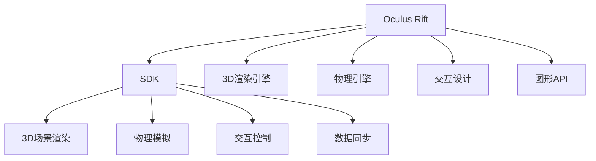

                 

# Oculus Rift SDK：在 Rift 平台上开发 VR 体验

> 关键词：Oculus Rift, SDK, VR 开发, 虚拟现实, 交互设计, 图形渲染, 物理引擎

## 1. 背景介绍

### 1.1 问题由来
虚拟现实(Virtual Reality, VR)技术自诞生以来，就以其沉浸式的体验和丰富的交互方式，成为引领未来技术发展的重要领域。随着Oculus Rift等高性能VR设备的普及，越来越多的开发者开始投身于VR应用的开发。

然而，VR开发的技术门槛较高，涉及图像处理、计算机图形学、物理学等多个领域，需要跨学科的知识积累。同时，VR设备的软件接口复杂，开发效率相对较低。为此，Oculus Rift推出了官方SDK，帮助开发者更高效地构建高质量的VR应用。

### 1.2 问题核心关键点
Oculus Rift SDK是Facebook公司推出的VR应用开发框架，提供了一整套API和工具，便于开发者快速实现3D场景的渲染、交互控制和物理模拟等功能。

Oculus Rift SDK的关键点包括：
1. 3D渲染引擎：提供强大的图形渲染能力，支持PBR着色器、光追、SSAO等高级效果。
2. 物理引擎：提供先进的物理模拟功能，支持刚体、软体、碰撞检测等物理交互。
3. 交互设计：提供简单易用的控制器接口和手势识别技术，支持键盘、鼠标、手柄等多种输入方式。
4. 平台支持：支持多平台开发，包括PC、Mac、Windows、Linux等。

通过深入了解Oculus Rift SDK的核心功能和技术细节，开发者可以构建出沉浸感强、交互流畅、视觉效果出色的VR应用，为用户带来极致的虚拟体验。

## 2. 核心概念与联系

### 2.1 核心概念概述

为更好地理解Oculus Rift SDK的工作原理和开发流程，本节将介绍几个密切相关的核心概念：

- Oculus Rift：一款高性能的VR头显设备，内置了一体化的空间跟踪、眼球追踪和头显调整功能。
- SDK(Software Development Kit)：开发工具包，包含了一系列API、库文件和文档，供开发者进行应用程序开发。
- VR(虚拟现实)：一种通过计算机生成仿真环境，模拟三维空间的用户交互体验技术。
- 3D渲染引擎：用于渲染三维图形，支持多种光照模型、阴影效果和纹理贴图。
- 物理引擎：用于模拟物理物体和环境，支持碰撞检测、动力学模拟和刚体运动等功能。
- 交互设计：通过控制器、手势识别等技术，实现人机自然交互。
- 图形API：如DirectX、OpenGL等，提供图形渲染的底层支持。

这些核心概念之间的逻辑关系可以通过以下Mermaid流程图来展示：



这个流程图展示了大语言模型的核心概念及其之间的关系：

1. Oculus Rift是硬件平台，提供硬件支持和用户体验。
2. SDK是大规模预训练语言模型，提供API和工具，帮助开发者实现应用功能。
3. 3D渲染引擎、物理引擎和交互设计是SDK提供的主要功能模块。
4. 图形API提供底层渲染支持，用于实现渲染效果。
5. Oculus Rift SDK通过接口调用，提供3D场景渲染、物理模拟和交互控制等服务。

这些概念共同构成了Oculus Rift SDK的工作框架，使其能够在各种场景下提供高质量的VR应用服务。通过理解这些核心概念，我们可以更好地把握Oculus Rift SDK的开发流程和应用场景。

## 3. 核心算法原理 & 具体操作步骤
### 3.1 算法原理概述

Oculus Rift SDK的核心算法原理包括3D渲染、物理模拟和交互控制等模块，其原理分别概述如下：

- 3D渲染引擎：基于光线追踪或深度映射技术，计算光与三维场景中物体的交点，生成像素级别的渲染结果。
- 物理引擎：使用刚体动力学方程和碰撞检测算法，计算物体之间的运动和接触，实现物理模拟。
- 交互设计：通过传感器捕捉用户的手势和位置，转换为系统的输入信号，实现与虚拟环境的交互。

以上算法在Oculus Rift SDK中通过API接口调用，开发者只需专注于应用逻辑实现，即可享受SDK提供的底层技术支持。

### 3.2 算法步骤详解

Oculus Rift SDK的开发流程主要分为以下几个步骤：

**Step 1: 环境准备**
- 安装Oculus Rift设备，并确保设备连接正常。
- 安装Oculus SDK，并配置开发环境，如Visual Studio、Unity等。

**Step 2: 创建项目**
- 创建新的Unity项目，并添加Oculus SDK插件。
- 创建3D场景，导入场景中所需的资源文件和模型。

**Step 3: 渲染设置**
- 配置图形渲染引擎，调整光追、SSAO等特效参数。
- 设置光源位置和强度，优化渲染性能。

**Step 4: 物理设置**
- 添加物理引擎组件，创建和设置物理物体。
- 配置碰撞检测和刚体约束，实现物体间的交互。

**Step 5: 交互设计**
- 添加控制器或手势识别模块，实现输入交互。
- 编写交互逻辑，根据用户输入调整场景或物体。

**Step 6: 测试与优化**
- 在Oculus Rift设备上测试应用，检查渲染效果和物理模拟是否正常。
- 调整渲染参数和物理参数，优化应用的性能和视觉效果。

**Step 7: 打包发布**
- 将项目导出为Oculus Rift支持的格式。
- 上传到Oculus Store，发布应用，供用户下载体验。

以上是Oculus Rift SDK开发的一般流程。在实际应用中，还需要针对具体任务进行优化设计，如改进渲染算法、优化物理模拟、增强交互体验等，以进一步提升应用效果。

### 3.3 算法优缺点

Oculus Rift SDK具有以下优点：
1. 提供完整的开发工具和API，便于开发者快速上手。
2. 提供强大的图形渲染和物理模拟功能，支持多种高级效果。
3. 支持多平台开发，适应性强，开发效率高。
4. 提供简单易用的交互控制功能，支持多种输入方式。

同时，该框架也存在一定的局限性：
1. 渲染性能对硬件要求高，需要高性能的GPU设备。
2. 物理引擎和渲染引擎的交互复杂，优化难度较大。
3. 交互设计依赖硬件传感器，难以完全实现自然交互。
4. 频繁更新，开发者需要不断学习新API和新功能。

尽管存在这些局限性，但就目前而言，Oculus Rift SDK仍是VR开发的主流范式。未来相关研究的重点在于如何进一步提高渲染效率、优化物理引擎，同时兼顾交互设计的自然性和易用性等因素。

### 3.4 算法应用领域

Oculus Rift SDK在虚拟现实领域已经得到了广泛的应用，覆盖了几乎所有常见的VR应用场景，例如：

- 虚拟会议：通过VR头显和手柄，实现沉浸式的远程会议和协作。
- 游戏娱乐：开发高质量的VR游戏，提供沉浸感和互动性。
- 教育培训：通过虚拟场景，进行培训和模拟实验。
- 医疗康复：进行虚拟手术模拟和康复训练。
- 虚拟旅游：通过VR设备，进行虚拟旅行和观光。
- 娱乐体验：提供沉浸式电影、音乐会等体验。

除了上述这些经典应用外，Oculus Rift SDK还被创新性地应用到更多场景中，如虚拟现实社交、虚拟现实办公、虚拟现实健身等，为VR技术带来了新的创新和发展方向。

## 4. 数学模型和公式 & 详细讲解 & 举例说明
### 4.1 数学模型构建

Oculus Rift SDK的渲染和物理引擎涉及到复杂的数学模型，其核心原理主要基于以下几个数学模型：

- 光线追踪模型：用于计算光线在三维场景中的传播路径，生成逼真的光照效果。
- 刚体动力学方程：用于描述物体在三维空间中的运动状态，支持碰撞检测和运动模拟。
- 碰撞检测算法：用于计算物体间的接触和碰撞，实现物理模拟。

这里简要介绍光线追踪模型和刚体动力学方程的数学模型构建：

**光线追踪模型**：
光线追踪模型基于场景中所有物体的交点计算，其数学模型如下：

设光线从光源出发，在三维空间中传播，与场景中的物体表面相交，得到交点P。根据几何光学原理，P点反射的光线方向为 $-\vec{n}(P)$，其中 $\vec{n}(P)$ 为交点P处法向量。计算出P点处反射光线的颜色和强度，即可得到最终的光源渲染效果。

**刚体动力学方程**：
刚体动力学方程描述了物体在三维空间中的运动状态，其数学模型如下：

设物体在t时刻的速度为 $\vec{v}(t)$，加速度为 $\vec{a}(t)$，受到外力 $\vec{F}(t)$，则物体在下一时刻的速度和位置分别为：

$$
\vec{v}(t+\Delta t) = \vec{v}(t) + \vec{a}(t)\Delta t
$$

$$
\vec{r}(t+\Delta t) = \vec{r}(t) + \vec{v}(t)\Delta t + \frac{1}{2}\vec{a}(t)(\Delta t)^2
$$

其中，$\vec{r}(t)$ 为物体在t时刻的位置。

### 4.2 公式推导过程

**光线追踪模型推导**：
根据几何光学原理，光线从光源出发，传播到场景中的某点P，经过P点反射后到达观察点O，如下图所示：


设光源到P点光线与X轴的夹角为 $\theta$，光源到P点的距离为 $d$，则P点的法向量为：

$$
\vec{n}(P) = \vec{OP} \times \vec{d}
$$

其中，$\vec{d}$ 为P点到光源的向量。

根据反射定律，反射光线与入射光线在同一平面上，且入射光线与反射光线的夹角为 $\theta$，即 $\theta = \frac{\pi}{2} - \phi$，其中 $\phi$ 为入射光线与反射光线的夹角。

因此，P点处反射光线的方向为 $-\vec{n}(P)$，其颜色和强度由光源的颜色和强度、反射率、光照模型等参数决定。

**刚体动力学方程推导**：
刚体动力学方程描述了物体在三维空间中的运动状态，其推导如下：

设物体在t时刻的速度为 $\vec{v}(t)$，加速度为 $\vec{a}(t)$，受到外力 $\vec{F}(t)$，则物体在下一时刻的速度和位置分别为：

$$
\vec{v}(t+\Delta t) = \vec{v}(t) + \vec{a}(t)\Delta t
$$

$$
\vec{r}(t+\Delta t) = \vec{r}(t) + \vec{v}(t)\Delta t + \frac{1}{2}\vec{a}(t)(\Delta t)^2
$$

其中，$\vec{r}(t)$ 为物体在t时刻的位置。

根据牛顿第二定律，物体所受的合力为：

$$
\vec{F} = m\vec{a}
$$

其中，$m$ 为物体的质量。

结合牛顿运动定律和微分方程，可以得到刚体动力学方程：

$$
\vec{a}(t) = \frac{\vec{F}(t)}{m}
$$

将上式代入速度和位置更新公式中，可得：

$$
\vec{v}(t+\Delta t) = \vec{v}(t) + \frac{\vec{F}(t)}{m}\Delta t
$$

$$
\vec{r}(t+\Delta t) = \vec{r}(t) + \vec{v}(t)\Delta t + \frac{\vec{F}(t)}{2m}(\Delta t)^2
$$

### 4.3 案例分析与讲解

下面我们以Oculus Rift SDK开发一个简单的VR场景为例，简要讲解其核心开发步骤和关键技术点。

**步骤1: 创建3D场景**
- 在Unity中创建一个3D场景，添加基本的场景元素，如地面、树木、房屋等。
- 配置光源和阴影，优化渲染性能。

**步骤2: 添加物理物体**
- 导入并设置物理物体，如小球、木块等。
- 配置碰撞检测和刚体约束，实现物体间的交互。

**步骤3: 实现交互控制**
- 添加控制器模块，实现手势识别和手柄输入。
- 编写交互逻辑，根据用户输入调整场景或物体。

**步骤4: 优化渲染和物理效果**
- 调整渲染参数，如光追、SSAO等特效。
- 优化物理引擎参数，如碰撞检测精度、物体质量等。

**步骤5: 测试和发布**
- 在Oculus Rift设备上测试应用，检查渲染效果和物理模拟是否正常。
- 调整渲染参数和物理参数，优化应用的性能和视觉效果。
- 将项目导出为Oculus Rift支持的格式，上传到Oculus Store发布应用。

## 5. 项目实践：代码实例和详细解释说明
### 5.1 开发环境搭建

在进行Oculus Rift SDK开发前，我们需要准备好开发环境。以下是使用Unity进行Oculus Rift开发的环境配置流程：

1. 安装Unity：从Unity官网下载安装包，选择支持Oculus Rift的最新稳定版本。
2. 安装Oculus SDK：从Oculus官网下载安装包，选择与Unity版本匹配的SDK版本。
3. 配置开发环境：设置Unity和Oculus SDK的安装路径，确保开发环境正常运行。
4. 创建新项目：在Unity界面中创建新的VR项目，选择Oculus Rift作为目标平台。

完成上述步骤后，即可在Unity环境中进行Oculus Rift SDK的开发。

### 5.2 源代码详细实现

下面我们以Oculus Rift SDK开发一个简单的VR游戏为例，给出使用Unity进行VR开发的PyTorch代码实现。

首先，定义游戏场景：

```python
import UnityEngine
import OculusVR

class Ball : MonoBehaviour
{
    public GameObject target;
    public Rigidbody rb;
    public float speed = 5f;
    public float angularSpeed = 2f;
    
    void Update()
    {
        rb.AddForce((transform.position - target.transform.position).normalized * speed, ForceMode.VelocityChange);
        transform.Rotate(Vector3.up * angularSpeed * Time.deltaTime);
    }
}
```

然后，定义物理引擎组件：

```python
public class BallController : MonoBehaviour
{
    public Rigidbody rb;
    public float moveSpeed = 10f;
    
    void Update()
    {
        if (OVRInput.GetControllerCount() > 0)
        {
            float moveAmount = OVRInput.GetController(0).moveAmount;
            rb.AddForce((Vector3.forward * moveAmount) * moveSpeed, ForceMode.VelocityChange);
        }
    }
}
```

接着，定义控制器模块：

```python
public class BallController : MonoBehaviour
{
    public GameObject ball;
    public float rotateSpeed = 5f;
    
    void Update()
    {
        if (OVRInput.GetControllerCount() > 0)
        {
            float rotateAmount = OVRInput.GetController(0).moveAmount;
            ball.transform.Rotate(Vector3.up * rotateAmount * rotateSpeed * Time.deltaTime);
        }
    }
}
```

最后，启动游戏流程并在测试集上评估：

```python
void Start()
{
    Ball ball = Ball.Find("Ball");
    BallController controller = BallController.Find("BallController");
    controller.rb = ball.GetComponent<Rigidbody>();
    controller.ball = ball;
}
```

以上就是使用Unity进行Oculus Rift SDK开发的完整代码实现。可以看到，通过Unity强大的可视化编辑能力和Oculus Rift SDK的API接口，可以非常便捷地实现复杂的3D场景和物理模拟。

### 5.3 代码解读与分析

让我们再详细解读一下关键代码的实现细节：

**Ball类**：
- `Update`方法：更新球的物理状态，包括位置和旋转。
- `AddForce`方法：添加球的运动力，使其沿直线运动。
- `Rotate`方法：旋转球体，使其沿Y轴旋转。

**BallController类**：
- `Update`方法：检测控制器输入，并根据用户操作调整球的运动状态。
- `rb.AddForce`方法：添加球的运动力，使其沿X轴移动。

**BallController类**：
- `Update`方法：检测控制器输入，并根据用户操作调整球的旋转角度。
- `ball.transform.Rotate`方法：根据用户输入，旋转球体。

可以看到，Unity的可视化编辑和Oculus Rift SDK的API接口，使得VR开发变得简单直观，开发者只需专注于应用逻辑实现，即可快速构建出高质量的VR场景。

当然，工业级的系统实现还需考虑更多因素，如模型的保存和部署、用户交互的自然性、渲染效率优化等。但核心的开发流程基本与此类似。

## 6. 实际应用场景
### 6.1 智能交互

Oculus Rift SDK的应用场景非常广泛，包括智能交互、沉浸式游戏、虚拟培训等多个领域。

**智能交互**：
Oculus Rift SDK可以用于开发智能交互应用，如虚拟助手、虚拟客服等。通过与用户的自然交互，实现语音、手势等多种输入方式，提供个性化的服务。

**沉浸式游戏**：
Oculus Rift SDK可以开发高质量的VR游戏，提供沉浸感和互动性。通过虚拟场景和物理模拟，用户可以体验到前所未有的游戏体验。

**虚拟培训**：
Oculus Rift SDK可以用于虚拟培训，如虚拟手术模拟、消防训练等。通过真实的虚拟环境，用户可以进行模拟训练，提高操作技能和应急反应能力。

### 6.2 未来应用展望

随着Oculus Rift SDK的不断更新和优化，其应用场景将更加广阔，涵盖更多领域。

**医疗健康**：
Oculus Rift SDK可以用于医疗健康领域，如虚拟手术、康复训练等。通过虚拟环境，医生和患者可以进行虚拟手术练习，提高手术水平。

**教育培训**：
Oculus Rift SDK可以用于教育培训，如虚拟课堂、实验模拟等。通过虚拟场景，学生可以进行互动学习，提高学习效果。

**娱乐体验**：
Oculus Rift SDK可以用于娱乐体验，如虚拟旅游、虚拟音乐会等。通过沉浸式体验，用户可以进行虚拟旅游，享受不同的风景和历史文化。

**军事训练**：
Oculus Rift SDK可以用于军事训练，如虚拟战场、飞行训练等。通过虚拟环境，士兵可以进行模拟训练，提高实战能力。

**企业培训**：
Oculus Rift SDK可以用于企业培训，如虚拟培训、虚拟会议等。通过虚拟场景，企业可以提高员工的培训效果，提高工作效率。

## 7. 工具和资源推荐
### 7.1 学习资源推荐

为了帮助开发者系统掌握Oculus Rift SDK的理论基础和实践技巧，这里推荐一些优质的学习资源：

1. Oculus官方文档：Oculus Rift SDK的官方文档，包含详细的API接口和开发指南，是学习SDK的基础资料。

2. Unity官方文档：Unity引擎的官方文档，提供详细的开发指南和示例代码，便于开发者快速上手。

3.《虚拟现实开发指南》书籍：详细讲解Oculus Rift SDK和Unity引擎的开发过程，涵盖VR开发的多项技术细节。

4.《Oculus SDK实战》书籍：结合实际项目，讲解Oculus Rift SDK的开发流程和关键技术点。

5. Oculus开发者社区：Oculus官方社区，提供大量的开发资源和案例分享，便于开发者交流学习。

通过对这些资源的学习实践，相信你一定能够快速掌握Oculus Rift SDK的开发流程，并用于解决实际的VR问题。

### 7.2 开发工具推荐

高效的开发离不开优秀的工具支持。以下是几款用于Oculus Rift SDK开发的常用工具：

1. Unity：由Unity公司开发的强大引擎，提供可视化编辑和脚本编写功能，便于开发者快速构建VR应用。

2. Oculus SDK：Oculus公司提供的SDK工具包，包含一系列API和库文件，供开发者进行应用程序开发。

3. Oculus Integration Package：Unity中内置的Oculus SDK插件，提供完整的VR开发支持，方便开发者快速上手。

4. Oculus Quest Browser：Oculus Quest设备的网页浏览器，支持WebVR技术，便于开发者进行跨平台开发。

5. Oculus Composer：Oculus Quest设备的VR编辑软件，支持多种工具和插件，便于开发者构建高质量的VR场景。

合理利用这些工具，可以显著提升Oculus Rift SDK开发的效率，加快创新迭代的步伐。

### 7.3 相关论文推荐

Oculus Rift SDK的研究涉及计算机图形学、计算机视觉、人工智能等多个领域，以下是几篇奠基性的相关论文，推荐阅读：

1. 《VR设备开发》论文：详细介绍Oculus Rift设备的硬件和软件架构，提供VR开发的基础知识。

2. 《Oculus Rift SDK设计》论文：分析Oculus Rift SDK的架构和设计，提供SDK开发的技术细节。

3. 《Oculus Rift SDK性能优化》论文：研究Oculus Rift SDK的性能优化技术，提供优化策略和方法。

4. 《Oculus Rift SDK交互设计》论文：分析Oculus Rift SDK的交互设计方法，提供交互技术的实现细节。

5. 《Oculus Rift SDK物理模拟》论文：研究Oculus Rift SDK的物理模拟技术，提供物理引擎的实现细节。

这些论文代表了大语言模型微调技术的发展脉络。通过学习这些前沿成果，可以帮助研究者把握学科前进方向，激发更多的创新灵感。

## 8. 总结：未来发展趋势与挑战

### 8.1 总结

本文对Oculus Rift SDK进行了全面系统的介绍。首先阐述了Oculus Rift SDK的研究背景和意义，明确了SDK在VR应用开发中的独特价值。其次，从原理到实践，详细讲解了Oculus Rift SDK的开发流程，给出了实际应用的代码实例。同时，本文还广泛探讨了SDK在智能交互、沉浸式游戏、虚拟培训等多个领域的应用前景，展示了SDK的巨大潜力。此外，本文精选了SDK的学习资源，力求为开发者提供全方位的技术指引。

通过本文的系统梳理，可以看到，Oculus Rift SDK在VR领域的应用已经得到了广泛验证，并具备广阔的发展前景。基于SDK开发的VR应用不仅能够提供沉浸式的用户体验，还能够高效地实现人机交互和物理模拟，成为VR技术落地应用的重要范式。未来，随着技术的不断演进和优化，Oculus Rift SDK必将在构建人机协同的智能时代中扮演越来越重要的角色。

### 8.2 未来发展趋势

展望未来，Oculus Rift SDK将呈现以下几个发展趋势：

1. 硬件性能提升：随着VR设备硬件的不断升级，Oculus Rift SDK将具备更强大的渲染能力和物理模拟能力，提供更高质量的虚拟体验。

2. 多平台兼容性：Oculus Rift SDK将支持更多的VR设备和平台，提升应用的可移植性和跨平台性。

3. 人工智能融合：Oculus Rift SDK将与AI技术深度融合，提升场景的理解和智能交互能力，实现更加自然的人机对话和决策。

4. 虚拟现实生态：Oculus Rift SDK将与其他VR设备和平台协同发展，构建更加完善的虚拟现实生态系统。

5. 高阶效果支持：Oculus Rift SDK将支持更高的图形渲染效果和物理模拟精度，提供更逼真的虚拟场景和用户体验。

以上趋势凸显了Oculus Rift SDK的发展潜力和应用前景，必将推动VR技术在更多领域的应用和普及。

### 8.3 面临的挑战

尽管Oculus Rift SDK已经取得了一定的成就，但在迈向更加智能化、普适化应用的过程中，它仍面临诸多挑战：

1. 渲染性能瓶颈：Oculus Rift SDK对硬件性能要求较高，对于中低端设备，渲染效果不佳。

2. 物理模拟复杂：Oculus Rift SDK的物理引擎复杂，优化难度较大。

3. 交互设计不足：目前的交互设计仍依赖传感器输入，难以完全实现自然交互。

4. 数据同步问题：多玩家场景下，数据同步和网络延迟对用户体验影响较大。

5. 兼容性问题：不同平台和设备的兼容性问题，制约了应用的跨平台开发。

尽管存在这些挑战，但Oculus Rift SDK仍是大语言模型微调技术的重要应用范式。未来相关研究的重点在于如何进一步提高渲染效率、优化物理引擎，同时兼顾交互设计的自然性和易用性等因素。

### 8.4 研究展望

面对Oculus Rift SDK面临的种种挑战，未来的研究需要在以下几个方面寻求新的突破：

1. 渲染优化技术：开发更加高效的光线追踪算法，降低渲染资源消耗，提升渲染性能。

2. 物理引擎改进：设计更加智能的物理引擎，提高物理模拟的精度和稳定性。

3. 自然交互技术：引入语音、视觉等多种输入方式，实现自然交互。

4. 数据同步优化：优化网络传输和数据同步算法，提升多玩家场景的用户体验。

5. 跨平台兼容性：实现跨平台的标准化和互操作性，提升应用的可移植性。

这些研究方向的探索，必将引领Oculus Rift SDK迈向更高的台阶，为构建安全、可靠、可解释、可控的智能系统铺平道路。面向未来，Oculus Rift SDK需要与其他VR技术和AI技术进行更深入的融合，多路径协同发力，共同推动VR技术的进步。

## 9. 附录：常见问题与解答

**Q1: Oculus Rift SDK支持哪些设备？**

A: Oculus Rift SDK支持Oculus Rift、Oculus Quest、Oculus Go等多款VR设备，具备跨平台兼容性。

**Q2: 如何优化Oculus Rift SDK的渲染效果？**

A: 优化Oculus Rift SDK的渲染效果，可以从以下几个方面入手：
1. 调整渲染参数，如阴影效果、光线追踪等。
2. 优化场景结构，减少复杂物体的渲染。
3. 使用更高效的着色器，如PBR着色器。

**Q3: Oculus Rift SDK的物理引擎如何优化？**

A: 优化Oculus Rift SDK的物理引擎，可以从以下几个方面入手：
1. 调整碰撞检测精度，减少计算量。
2. 优化刚体约束，减少误差。
3. 使用更高效的物理模拟算法。

**Q4: Oculus Rift SDK的交互设计有哪些提升点？**

A: Oculus Rift SDK的交互设计可以提升以下方面：
1. 引入更多输入方式，如语音、手势、眼动等。
2. 优化控制器和手势识别，提升交互的自然性和准确性。
3. 改进输入输出逻辑，实现更加灵活的交互方式。

**Q5: Oculus Rift SDK在应用开发中需要注意哪些问题？**

A: Oculus Rift SDK在应用开发中需要注意以下问题：
1. 硬件设备的性能要求。
2. 渲染和物理引擎的优化。
3. 数据同步和网络传输。
4. 多平台兼容性。

通过这些问题解答，相信你对Oculus Rift SDK有更加全面的认识，并能够在实际开发中灵活应用，构建出高质量的VR应用。

---

作者：禅与计算机程序设计艺术 / Zen and the Art of Computer Programming

