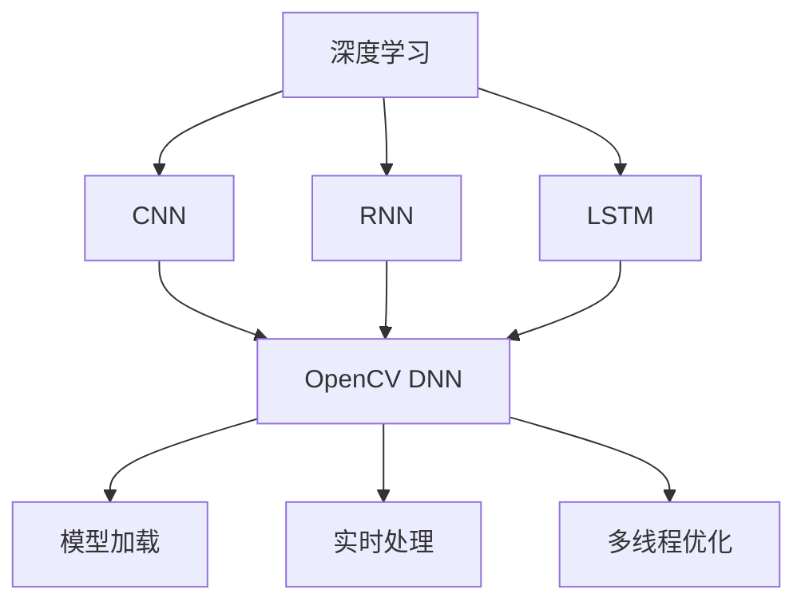

                 

# OpenCV DNN模块：深度学习模型的快速集成

> 关键词：深度学习,计算机视觉,图像处理,OpenCV,神经网络,卷积神经网络,CNN,目标检测,分类

## 1. 背景介绍

### 1.1 问题由来
OpenCV作为计算机视觉领域最为流行的开源库之一，提供了强大的图像处理和计算机视觉算法支持。随着深度学习技术的兴起，越来越多的研究人员和开发者开始探索将深度学习模型集成到OpenCV中以实现更强大的图像处理能力。然而，深度学习模型的复杂性和庞大的计算需求，使得其集成过程繁琐且耗时，这对于快速原型开发和实际应用来说是一个挑战。

为了解决这一问题，OpenCV 3.4版本引入了深度学习（DNN）模块。DNN模块提供了一种将深度学习模型快速集成到OpenCV应用中的机制，从而简化了深度学习在计算机视觉任务中的应用。

### 1.2 问题核心关键点
OpenCV DNN模块的核心思想是通过将深度学习模型转换为OpenCV支持的格式，实现模型在OpenCV中的快速加载和运行。其核心关键点包括：
- 支持多种深度学习模型：包括但不限于卷积神经网络（CNN）、RNN、LSTM等。
- 模型转换：将深度学习模型转换为OpenCV DNN支持的格式。
- 模型加载：在OpenCV中快速加载转换后的模型。
- 实时处理：利用GPU加速，实现模型的实时处理。
- 多线程优化：支持多线程处理，提高模型处理速度。

这些关键点使得OpenCV DNN模块成为深度学习在计算机视觉任务中快速集成的一个有力工具。

## 2. 核心概念与联系

### 2.1 核心概念概述

为了更好地理解OpenCV DNN模块，本节将介绍几个密切相关的核心概念：

- **深度学习（Deep Learning）**：一种基于神经网络的机器学习技术，能够自动提取复杂的数据特征，广泛应用于图像识别、语音识别、自然语言处理等领域。
- **卷积神经网络（Convolutional Neural Network, CNN）**：一种专门用于图像处理的神经网络，通过卷积层、池化层、全连接层等结构，能够自动学习图像中的特征。
- **神经网络（Neural Network）**：由神经元和连接构成的计算模型，通过学习数据特征，能够进行分类、回归等任务。
- **OpenCV（Open Source Computer Vision Library）**：一个开源的计算机视觉库，提供了图像处理、特征提取、目标检测等功能。
- **OpenCV DNN（Deep Neural Network）**：OpenCV DNN模块，提供了一种将深度学习模型快速集成到OpenCV应用中的机制。
- **模型转换**：将深度学习模型转换为OpenCV DNN支持的格式，以便在OpenCV中加载和使用。

这些概念之间的逻辑关系可以通过以下Mermaid流程图来展示：



这个流程图展示了大语言模型的核心概念及其之间的关系：

1. 深度学习通过神经网络结构实现复杂特征提取。
2. CNN、RNN、LSTM等不同的神经网络结构适用于不同的计算机视觉任务。
3. OpenCV DNN将深度学习模型转换为OpenCV支持的格式。
4. 模型加载、实时处理和多线程优化，提高了深度学习模型在OpenCV中的运行效率。

这些概念共同构成了深度学习模型在OpenCV中快速集成的框架，使得深度学习技术在计算机视觉任务中得以广泛应用。

## 3. 核心算法原理 & 具体操作步骤
### 3.1 算法原理概述

OpenCV DNN模块的核心算法原理是实现深度学习模型在OpenCV中的快速加载和运行。其核心思想是将深度学习模型转换为OpenCV DNN支持的格式，然后在OpenCV中加载和运行模型。

具体来说，OpenCV DNN模块将深度学习模型转换为ONNX（Open Neural Network Exchange）格式，并利用ONNX Runtime引擎进行模型推理。ONNX格式是一种通用的神经网络模型格式，支持多种深度学习框架（如TensorFlow、PyTorch、Caffe等）和多种运行环境（如CPU、GPU、FPGA等）。

### 3.2 算法步骤详解

基于OpenCV DNN模块的深度学习模型集成过程，一般包括以下几个关键步骤：

**Step 1: 准备深度学习模型**

1. 选择一个深度学习模型，如TensorFlow、PyTorch、Caffe等。
2. 将模型转换为ONNX格式。
3. 保存转换后的ONNX模型文件。

**Step 2: 准备OpenCV环境**

1. 安装OpenCV库，确保版本支持DNN模块。
2. 安装ONNX Runtime，用于ONNX模型的推理。

**Step 3: 加载和运行模型**

1. 在OpenCV中加载转换后的ONNX模型文件。
2. 创建DNN网络，用于推理。
3. 设置输入数据，包括图像的尺寸、通道数等。
4. 设置输出数据，包括推理结果的维度等。
5. 运行模型推理。

**Step 4: 处理推理结果**

1. 对推理结果进行后处理，如非极大值抑制、坐标转换等。
2. 将处理后的结果可视化或保存。

**Step 5: 优化性能**

1. 使用GPU加速，提高模型推理速度。
2. 使用多线程优化，并行处理多个输入数据。

通过上述步骤，即可在OpenCV中快速集成深度学习模型，实现复杂的计算机视觉任务。

### 3.3 算法优缺点

OpenCV DNN模块具有以下优点：

- 支持多种深度学习模型，包括CNN、RNN、LSTM等。
- 模型转换和加载过程简便，快速高效。
- 利用GPU加速，提高模型推理速度。
- 多线程优化，提高处理效率。

同时，该方法也存在一定的局限性：

- 对深度学习模型的准确性有一定的要求，模型设计不佳可能影响效果。
- 对模型的转换过程有一定的技术门槛，需要了解ONNX格式和转换工具。
- 对GPU加速和多线程优化的依赖，限制了模型的应用场景。

尽管存在这些局限性，但就目前而言，OpenCV DNN模块仍然是大规模深度学习模型在计算机视觉任务中快速集成的重要手段。未来相关研究的重点在于如何进一步优化模型的转换和加载过程，提高模型的准确性和可扩展性，同时兼顾可解释性和伦理安全性等因素。

### 3.4 算法应用领域

基于OpenCV DNN模块的深度学习模型集成方法，在计算机视觉领域已经得到了广泛的应用，涵盖了几乎所有常见任务，例如：

- 目标检测：如Faster R-CNN、YOLO、SSD等。通过模型推理在图像中检测和定位目标。
- 图像分类：如AlexNet、VGG、ResNet等。通过模型推理对图像进行分类。
- 图像分割：如U-Net、Mask R-CNN等。通过模型推理对图像进行像素级别的分割。
- 人脸识别：如FaceNet、DeepFace等。通过模型推理识别人脸特征。
- 视频分析：如3D-CNN、T-CNN等。通过模型推理对视频序列进行分析和处理。

除了上述这些经典任务外，OpenCV DNN模块还被创新性地应用到更多场景中，如可控图像生成、图像超分辨率、图像去模糊等，为计算机视觉技术带来了全新的突破。随着深度学习技术的不断进步，相信基于OpenCV DNN模块的深度学习模型集成方法将在更广阔的应用领域大放异彩。

## 4. 数学模型和公式 & 详细讲解  
### 4.1 数学模型构建

本节将使用数学语言对基于OpenCV DNN模块的深度学习模型集成过程进行更加严格的刻画。

记深度学习模型为 $M(x; \theta)$，其中 $x$ 为输入数据，$\theta$ 为模型参数。OpenCV DNN模块支持多种深度学习模型，这里以卷积神经网络（CNN）为例，进行详细讲解。

卷积神经网络由卷积层、池化层、全连接层等构成。其中卷积层通过卷积核对输入数据进行特征提取，池化层对特征图进行下采样，全连接层将特征图映射为输出结果。设卷积层数量为 $N$，卷积核大小为 $k$，输入数据大小为 $d$，则卷积层的输出大小为 $d-k+1$。

假设输入数据大小为 $d=28 \times 28$，卷积核大小为 $k=3 \times 3$，卷积层数量为 $N=3$，则第一层卷积层的输出大小为 $d-k+1=26 \times 26$，第二层卷积层的输出大小为 $26-k+1=24 \times 24$，第三层卷积层的输出大小为 $24-k+1=22 \times 22$。

### 4.2 公式推导过程

以下我们以卷积神经网络为例，推导模型的推理过程。

设卷积核数量为 $N=3$，卷积核大小为 $k=3 \times 3$，输入数据大小为 $d=28 \times 28$，输出数据大小为 $m=1 \times 1$。设卷积核的权重矩阵为 $W$，偏置向量为 $b$，则卷积层的输出 $z_1$ 为：

$$
z_1 = g(x * W + b)
$$

其中 $g$ 为激活函数。通过多层的卷积和池化操作，最终得到输出结果 $y$。

在模型推理时，需要首先将输入数据转换为模型支持的格式，如ONNX格式。然后，在OpenCV中加载转换后的模型，并设置输入数据的维度、通道数等。最后，进行模型推理，并根据输出结果进行后处理，如非极大值抑制、坐标转换等。

### 4.3 案例分析与讲解

这里以目标检测任务为例，展示如何使用OpenCV DNN模块进行模型集成和推理。

首先，准备深度学习模型和数据集。这里以YOLOv3为例，其训练得到的权重文件为`yolov3.weights`，配置文件为`yolov3.cfg`，数据集为`coco`。

```python
import cv2
import numpy as np

# 加载YOLOv3模型
net = cv2.dnn.readNet('yolov3.weights', 'yolov3.cfg')

# 加载模型配置
layer_names = net.getLayerNames()
output_layers = [layer_names[i[0] - 1] for i in net.getUnconnectedOutLayers()]

# 加载输入数据
img = cv2.imread('test.jpg')
height, width, channels = img.shape

# 设置输入数据尺寸
blob = cv2.dnn.blobFromImage(img, 1/255.0, (416, 416), swapRB=True, crop=False)

# 设置模型输入
net.setInput(blob)

# 进行模型推理
outputs = net.forward(output_layers)

# 处理输出结果
boxes = []
confidences = []
class_ids = []

# 遍历所有输出结果
for output in outputs:
    for detection in output:
        scores = detection[5:]
        class_id = np.argmax(scores)
        confidence = scores[class_id]
        
        if confidence > 0.5:
            # 计算边界框坐标
            center_x = int(detection[0] * width)
            center_y = int(detection[1] * height)
            w = int(detection[2] * width)
            h = int(detection[3] * height)
            
            # 计算边界框左上角坐标
            x = int(center_x - w / 2)
            y = int(center_y - h / 2)
            
            # 保存边界框、置信度、类别ID
            boxes.append([x, y, w, h])
            confidences.append(float(confidence))
            class_ids.append(class_id)
            
# 进行非极大值抑制
indices = cv2.dnn.NMSBoxes(boxes, confidences, 0.5, 0.4)

# 可视化边界框
for i in indices:
    i = i[0]
    box = boxes[i]
    x, y, w, h = box
    cv2.rectangle(img, (x, y), (x + w, y + h), (0, 255, 0), 2)
    cv2.putText(img, layer_names[class_ids[i]], (x, y - 10), cv2.FONT_HERSHEY_PLAIN, 1, (0, 255, 0), 2)
    
cv2.imshow('image', img)
cv2.waitKey(0)
cv2.destroyAllWindows()
```

通过上述代码，可以在OpenCV中集成YOLOv3模型，对图像进行目标检测，并在图像中标记出检测到的目标。

## 5. 项目实践：代码实例和详细解释说明
### 5.1 开发环境搭建

在进行项目实践前，我们需要准备好开发环境。以下是使用Python进行OpenCV开发的环境配置流程：

1. 安装Anaconda：从官网下载并安装Anaconda，用于创建独立的Python环境。

2. 创建并激活虚拟环境：
```bash
conda create -n opencv-env python=3.8 
conda activate opencv-env
```

3. 安装OpenCV：
```bash
pip install opencv-python
```

4. 安装DNN模块：
```bash
pip install opencv-python-headless
```

5. 安装ONNX Runtime：
```bash
pip install onnxruntime
```

6. 安装必要的工具包：
```bash
pip install numpy matplotlib scikit-image
```

完成上述步骤后，即可在`opencv-env`环境中开始项目实践。

### 5.2 源代码详细实现

这里我们以目标检测任务为例，给出使用OpenCV DNN模块集成YOLOv3模型的Python代码实现。

```python
import cv2
import numpy as np

# 加载YOLOv3模型
net = cv2.dnn.readNet('yolov3.weights', 'yolov3.cfg')

# 加载模型配置
layer_names = net.getLayerNames()
output_layers = [layer_names[i[0] - 1] for i in net.getUnconnectedOutLayers()]

# 加载输入数据
img = cv2.imread('test.jpg')
height, width, channels = img.shape

# 设置输入数据尺寸
blob = cv2.dnn.blobFromImage(img, 1/255.0, (416, 416), swapRB=True, crop=False)

# 设置模型输入
net.setInput(blob)

# 进行模型推理
outputs = net.forward(output_layers)

# 处理输出结果
boxes = []
confidences = []
class_ids = []

# 遍历所有输出结果
for output in outputs:
    for detection in output:
        scores = detection[5:]
        class_id = np.argmax(scores)
        confidence = scores[class_id]
        
        if confidence > 0.5:
            # 计算边界框坐标
            center_x = int(detection[0] * width)
            center_y = int(detection[1] * height)
            w = int(detection[2] * width)
            h = int(detection[3] * height)
            
            # 计算边界框左上角坐标
            x = int(center_x - w / 2)
            y = int(center_y - h / 2)
            
            # 保存边界框、置信度、类别ID
            boxes.append([x, y, w, h])
            confidences.append(float(confidence))
            class_ids.append(class_id)
            
# 进行非极大值抑制
indices = cv2.dnn.NMSBoxes(boxes, confidences, 0.5, 0.4)

# 可视化边界框
for i in indices:
    i = i[0]
    box = boxes[i]
    x, y, w, h = box
    cv2.rectangle(img, (x, y), (x + w, y + h), (0, 255, 0), 2)
    cv2.putText(img, layer_names[class_ids[i]], (x, y - 10), cv2.FONT_HERSHEY_PLAIN, 1, (0, 255, 0), 2)
    
cv2.imshow('image', img)
cv2.waitKey(0)
cv2.destroyAllWindows()
```

### 5.3 代码解读与分析

让我们再详细解读一下关键代码的实现细节：

**加载YOLOv3模型**：
```python
net = cv2.dnn.readNet('yolov3.weights', 'yolov3.cfg')
```
- `readNet`函数用于加载YOLOv3模型的权重文件和配置文件，生成一个`DNN`网络对象。

**加载模型配置**：
```python
layer_names = net.getLayerNames()
output_layers = [layer_names[i[0] - 1] for i in net.getUnconnectedOutLayers()]
```
- `getLayerNames`函数返回网络中所有层的名称。
- `getUnconnectedOutLayers`函数返回网络中未连接的输出层的名称。

**加载输入数据**：
```python
img = cv2.imread('test.jpg')
height, width, channels = img.shape
blob = cv2.dnn.blobFromImage(img, 1/255.0, (416, 416), swapRB=True, crop=False)
```
- `imread`函数用于加载输入图片。
- `blobFromImage`函数将输入图片转换为模型的输入格式，并进行归一化、通道互换等预处理。

**设置模型输入**：
```python
net.setInput(blob)
```
- `setInput`函数用于设置模型的输入数据。

**进行模型推理**：
```python
outputs = net.forward(output_layers)
```
- `forward`函数用于进行模型推理，返回所有输出结果。

**处理输出结果**：
```python
boxes = []
confidences = []
class_ids = []

for output in outputs:
    for detection in output:
        scores = detection[5:]
        class_id = np.argmax(scores)
        confidence = scores[class_id]
        
        if confidence > 0.5:
            # 计算边界框坐标
            center_x = int(detection[0] * width)
            center_y = int(detection[1] * height)
            w = int(detection[2] * width)
            h = int(detection[3] * height)
            
            # 计算边界框左上角坐标
            x = int(center_x - w / 2)
            y = int(center_y - h / 2)
            
            # 保存边界框、置信度、类别ID
            boxes.append([x, y, w, h])
            confidences.append(float(confidence))
            class_ids.append(class_id)
            
# 进行非极大值抑制
indices = cv2.dnn.NMSBoxes(boxes, confidences, 0.5, 0.4)

# 可视化边界框
for i in indices:
    i = i[0]
    box = boxes[i]
    x, y, w, h = box
    cv2.rectangle(img, (x, y), (x + w, y + h), (0, 255, 0), 2)
    cv2.putText(img, layer_names[class_ids[i]], (x, y - 10), cv2.FONT_HERSHEY_PLAIN, 1, (0, 255, 0), 2)
    
cv2.imshow('image', img)
cv2.waitKey(0)
cv2.destroyAllWindows()
```
- 遍历所有输出结果，提取置信度和类别ID。
- 进行非极大值抑制，保留置信度较高的检测结果。
- 可视化边界框和类别ID。

通过上述代码，可以在OpenCV中集成YOLOv3模型，对图像进行目标检测，并在图像中标记出检测到的目标。

## 6. 实际应用场景
### 6.1 智能视频监控

智能视频监控系统需要实时处理视频流中的图像数据，检测和定位异常行为，如入侵、火灾等。传统的视频监控系统需要大量人工进行实时监控和记录，效率低且成本高。基于OpenCV DNN模块的目标检测模型，可以实现智能视频监控系统，自动检测和报警异常行为，提高监控效率和准确性。

在技术实现上，可以通过摄像头获取视频流，并利用OpenCV DNN模块集成目标检测模型，对每一帧图像进行推理，检测异常行为。系统可以根据检测结果，触发报警和记录功能，保障公共安全。

### 6.2 自动驾驶

自动驾驶系统需要实时处理车辆周边环境的信息，识别道路标志、行人、车辆等，以便做出驾驶决策。传统的计算机视觉技术往往难以满足实时处理的要求，但基于OpenCV DNN模块的目标检测模型，可以实现高效、实时的环境识别和决策，提升自动驾驶系统的安全性和可靠性。

在技术实现上，可以通过摄像头、激光雷达等传感器获取周边环境的信息，并利用OpenCV DNN模块集成目标检测模型，对传感器数据进行处理。系统可以根据检测结果，做出相应的驾驶决策，保障行车安全。

### 6.3 工业检测

工业检测系统需要实时处理生产过程中的图像数据，检测产品缺陷、识别零部件等。传统的人工检测方式效率低、成本高，容易产生人为误差。基于OpenCV DNN模块的目标检测模型，可以实现工业检测系统，自动检测产品缺陷，提高检测效率和准确性。

在技术实现上，可以通过摄像头获取生产过程中的图像数据，并利用OpenCV DNN模块集成目标检测模型，对图像进行推理。系统可以根据检测结果，进行产品分类和筛选，提高产品质量和生产效率。

### 6.4 未来应用展望

随着深度学习技术的发展，基于OpenCV DNN模块的目标检测模型将逐渐应用于更多场景中，为各行各业带来变革性影响。

在智慧医疗领域，目标检测模型可以用于自动识别X光片、CT片等医学影像中的异常情况，辅助医生诊断和治疗。

在智慧城市治理中，目标检测模型可以用于实时监测城市交通情况，识别交通异常行为，优化交通管理。

在智慧农业领域，目标检测模型可以用于实时监测农作物生长情况，识别病虫害，提高农业生产效率。

此外，在智慧教育、智慧家居、智慧环保等众多领域，基于OpenCV DNN模块的目标检测模型也将不断涌现，为各行各业带来更多的创新应用。

## 7. 工具和资源推荐
### 7.1 学习资源推荐

为了帮助开发者系统掌握OpenCV DNN模块的理论基础和实践技巧，这里推荐一些优质的学习资源：

1. 《OpenCV计算机视觉编程实战》系列博文：由OpenCV官方和社区贡献者撰写的博客，详细介绍OpenCV库的使用和应用，包括DNN模块的详细说明和实践案例。

2. OpenCV官方文档：OpenCV官方提供的详细文档，包括DNN模块的API文档、使用示例等。

3. PyImageSearch：计算机视觉学习网站，提供丰富的计算机视觉教程和实践案例，涵盖DNN模块的使用和应用。

4. GitHub OpenCV DNN模块示例：OpenCV官方提供的DNN模块示例代码，涵盖多种计算机视觉任务。

5. Coursera《计算机视觉基础》课程：斯坦福大学开设的计算机视觉课程，涵盖计算机视觉和深度学习的基础知识，适合初学者和进阶者。

通过对这些资源的学习实践，相信你一定能够快速掌握OpenCV DNN模块的理论基础和实践技巧，并用于解决实际的计算机视觉问题。
### 7.2 开发工具推荐

高效的开发离不开优秀的工具支持。以下是几款用于OpenCV DNN模块开发的工具：

1. OpenCV：作为OpenCV DNN模块的母库，提供了丰富的图像处理和计算机视觉算法支持，是进行计算机视觉任务开发的基础工具。

2. PyTorch、TensorFlow：深度学习框架，提供了强大的深度学习模型开发能力，可以与OpenCV DNN模块无缝集成。

3. ONNX Runtime：Open Neural Network Exchange Runtime，用于ONNX模型的推理，支持多种深度学习框架和多种运行环境。

4. NVIDIA CUDA Toolkit：GPU加速工具，提供高效的并行计算能力，加速模型推理过程。

5. Intel DNN Library：深度学习优化库，提供了多种深度学习框架的模型优化支持，提升模型推理速度。

6. Intel OpenVINO：深度学习优化工具包，提供高效、快速的深度学习模型推理能力，支持多种硬件平台。

合理利用这些工具，可以显著提升OpenCV DNN模块的开发效率，加快创新迭代的步伐。

### 7.3 相关论文推荐

OpenCV DNN模块的发展源于学界的持续研究。以下是几篇奠基性的相关论文，推荐阅读：

1. "Deep Learning Applications with OpenCV DNN"：由OpenCV官方团队撰写的论文，详细介绍DNN模块的原理和应用。

2. "Real-time Object Detection with Deep Learning in OpenCV"：详细介绍了利用OpenCV DNN模块进行实时目标检测的技术细节。

3. "Faster R-CNN: Towards Real-Time Object Detection with Region Proposal Networks"：提出Faster R-CNN模型，提升了目标检测的实时性和准确性。

4. "YOLO: Real-Time Object Detection"：提出YOLO模型，实现了实时目标检测和定位。

5. "SSD: Single Shot MultiBox Detector"：提出SSD模型，通过单阶段检测器实现了实时目标检测。

这些论文代表了大规模深度学习模型在计算机视觉任务中快速集成的发展脉络。通过学习这些前沿成果，可以帮助研究者把握学科前进方向，激发更多的创新灵感。

## 8. 总结：未来发展趋势与挑战

### 8.1 总结

本文对基于OpenCV DNN模块的深度学习模型集成方法进行了全面系统的介绍。首先阐述了OpenCV DNN模块的研究背景和意义，明确了深度学习模型在计算机视觉任务中快速集成的重要价值。其次，从原理到实践，详细讲解了深度学习模型在OpenCV中的集成过程，包括模型转换、加载、推理等关键步骤，给出了集成YOLOv3模型的Python代码实现。同时，本文还广泛探讨了DNN模块在智能视频监控、自动驾驶、工业检测等多个行业领域的应用前景，展示了DNN模块的巨大潜力。此外，本文精选了DNN模块的相关学习资源，力求为读者提供全方位的技术指引。

通过本文的系统梳理，可以看到，基于OpenCV DNN模块的深度学习模型集成方法正在成为计算机视觉任务中重要的范式，极大地拓展了深度学习技术的应用范围，为计算机视觉任务的工程实现提供了新的方向。未来，伴随深度学习技术的发展，基于DNN模块的深度学习模型集成方法必将得到更广泛的应用，推动计算机视觉技术的产业化进程。

### 8.2 未来发展趋势

展望未来，基于OpenCV DNN模块的深度学习模型集成技术将呈现以下几个发展趋势：

1. 模型规模持续增大。随着算力成本的下降和数据规模的扩张，深度学习模型的参数量还将持续增长。超大规模深度学习模型蕴含的丰富特征信息，有望支撑更加复杂多变的计算机视觉任务。

2. 模型转换和加载过程优化。未来将开发更加高效、便捷的模型转换和加载工具，降低深度学习模型的集成难度，提高模型的可扩展性和可维护性。

3. 模型推理速度提升。利用GPU加速、多线程优化等技术，进一步提升深度学习模型的推理速度，满足实时处理的要求。

4. 多模态数据融合。将视觉、听觉、语言等多种模态的数据融合，提升深度学习模型的感知能力和泛化性能。

5. 模型自动化部署。开发自动化的模型部署工具，将深度学习模型快速集成到移动应用、嵌入式设备等场景中，提升模型的应用普及度。

6. 端到端模型训练。将模型训练、推理、部署等过程进行端到端的自动化处理，进一步提升深度学习模型的开发效率。

以上趋势凸显了基于OpenCV DNN模块的深度学习模型集成技术的广阔前景。这些方向的探索发展，必将进一步提升深度学习模型在计算机视觉任务中的性能和应用范围，为计算机视觉技术带来新的突破。

### 8.3 面临的挑战

尽管基于OpenCV DNN模块的深度学习模型集成技术已经取得了显著进展，但在迈向更加智能化、普适化应用的过程中，它仍面临着诸多挑战：

1. 模型鲁棒性不足。当前深度学习模型在复杂环境下可能表现出鲁棒性差的问题，容易受到光照、角度、尺度等变化的影响。如何提高深度学习模型的鲁棒性，增强模型对环境变化的适应能力，还需要更多研究和实践。

2. 模型泛化能力有限。深度学习模型往往在训练数据集上表现良好，但在测试数据集上泛化能力较差。如何提高深度学习模型的泛化能力，使其在不同的数据分布上都能保持稳定的性能，仍是一个重要问题。

3. 模型计算资源消耗高。深度学习模型的计算资源消耗高，需要高性能的GPU、TPU等硬件支持。如何降低深度学习模型的计算资源消耗，优化模型推理过程，还需进一步探索。

4. 模型可解释性不足。深度学习模型往往被视为“黑盒”，难以解释其内部工作机制和决策逻辑。如何赋予深度学习模型更强的可解释性，提升模型的透明度和可信度，也将是亟待攻克的难题。

5. 模型伦理和安全问题。深度学习模型可能学习到有害、偏见的信息，传递到下游任务中，产生误导性输出。如何确保深度学习模型的伦理和安全，避免有害信息的传播，需要进一步研究。

6. 数据隐私和安全问题。深度学习模型需要大量的标注数据进行训练，如何保护数据隐私和安全，防止数据泄露，仍是一个重要问题。

以上挑战凸显了基于OpenCV DNN模块的深度学习模型集成技术在实际应用中的复杂性和不确定性。解决这些挑战，需要学界和产业界共同努力，推动深度学习技术的不断进步和完善。

### 8.4 研究展望

面对基于OpenCV DNN模块的深度学习模型集成技术所面临的种种挑战，未来的研究需要在以下几个方面寻求新的突破：

1. 探索新的模型架构。开发更加高效、可扩展的深度学习模型架构，如卷积神经网络（CNN）、残差网络（ResNet）、Inception等，提升模型的推理速度和性能。

2. 研究模型融合技术。将多种深度学习模型进行融合，提升模型的鲁棒性和泛化能力。

3. 引入先验知识。将符号化的先验知识，如知识图谱、逻辑规则等，与神经网络模型进行巧妙融合，引导模型学习更准确的特征表示。

4. 优化模型推理过程。开发高效的推理引擎，提升模型的推理速度和性能。

5. 加强模型解释性。利用可解释性工具，提升模型的透明度和可信度。

6. 考虑伦理和安全问题。在模型训练目标中引入伦理导向的评估指标，过滤和惩罚有害信息，保障模型的伦理和安全。

这些研究方向和突破，必将引领基于OpenCV DNN模块的深度学习模型集成技术迈向更高的台阶，为计算机视觉任务的工程实现提供更加强大的技术支持。面向未来，基于OpenCV DNN模块的深度学习模型集成技术还需与其他人工智能技术进行更深入的融合，如计算机视觉、语音识别、自然语言处理等，协同发力，共同推动人工智能技术的发展。

## 9. 附录：常见问题与解答

**Q1：OpenCV DNN模块支持哪些深度学习框架？**

A: OpenCV DNN模块支持多种深度学习框架，包括TensorFlow、PyTorch、Caffe等。

**Q2：如何将深度学习模型转换为ONNX格式？**

A: 可以使用ONNX Export工具将深度学习模型转换为ONNX格式。具体步骤如下：
1. 将深度学习模型导出为TensorFlow或PyTorch格式。
2. 使用ONNX Export工具将导出文件转换为ONNX格式。
3. 保存转换后的ONNX模型文件。

**Q3：如何在OpenCV中加载和运行ONNX模型？**

A: 在OpenCV中加载和运行ONNX模型的步骤如下：
1. 创建DNN网络对象。
2. 设置模型输入数据。
3. 设置模型输出层。
4. 运行模型推理。
5. 处理输出结果。

**Q4：如何提高OpenCV DNN模块的推理速度？**

A: 提高OpenCV DNN模块的推理速度，可以从以下几个方面进行优化：
1. 利用GPU加速，提高模型推理速度。
2. 使用多线程优化，并行处理多个输入数据。
3. 优化模型结构，减少计算量和内存消耗。

**Q5：如何保护深度学习模型的伦理和安全？**

A: 保护深度学习模型的伦理和安全，可以从以下几个方面进行考虑：
1. 在模型训练目标中引入伦理导向的评估指标，过滤和惩罚有害信息。
2. 加强人工干预和审核，建立模型行为的监管机制。
3. 使用可解释性工具，提升模型的透明度和可信度。

这些问题的解答，相信能够帮助你更好地理解和应用基于OpenCV DNN模块的深度学习模型集成技术，进一步拓展其应用范围，推动计算机视觉技术的进步。

---

作者：禅与计算机程序设计艺术 / Zen and the Art of Computer Programming

