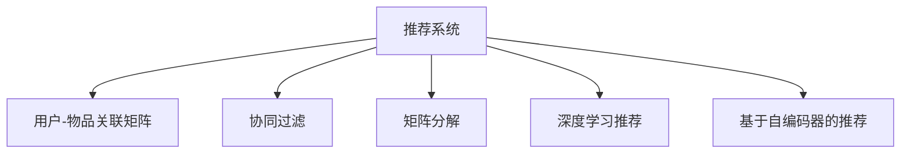

                 

# P5: 统一的推荐系统架构

在现代互联网时代，推荐系统已经成为了各类应用程序中不可或缺的核心组成部分。无论是电商平台、视频网站、新闻聚合器，还是社交媒体，都依靠推荐系统来为用户定制个性化内容，提升用户满意度。然而，目前市面上流行的推荐系统架构多如牛毛，从最朴素的基于内容的推荐到复杂的协同过滤、深度学习等，让初学者眼花缭乱，难以选择。本文旨在提供一个统一的推荐系统架构，覆盖推荐系统的各个核心组件和算法，帮助开发者更清晰地理解推荐系统，避免在技术选型和系统搭建上走弯路。

## 1. 背景介绍

### 1.1 问题由来
推荐系统本质上是一个信息过滤与推荐系统，通过预测用户可能感兴趣的对象，提升用户体验。传统推荐系统基于用户行为数据，建立用户与物品之间的关联关系，生成推荐结果。随着深度学习技术的兴起，推荐系统也进入了深度时代，基于用户-物品交互数据的隐式特征表示，推荐模型更加精准。

当前，推荐系统架构多样化，常见的如基于协同过滤的P-SVD、基于矩阵分解的ALS、基于深度学习的Wide&Deep、基于自编码器（AE）的VAE、基于多层感知器（MLP）的CrossNet等。这些架构各有所长，但难以在系统整合和快速迭代上互相协作。本文旨在提供一个统一的推荐系统架构，涵盖推荐系统中的各个核心组件和算法，为开发者提供一站式解决方案。

## 2. 核心概念与联系

### 2.1 核心概念概述

为更好地理解统一的推荐系统架构，本节将介绍几个密切相关的核心概念：

- 推荐系统（Recommendation System）：通过预测用户可能感兴趣的对象，提升用户体验的个性化信息过滤与推荐系统。推荐系统涵盖基于协同过滤的推荐、基于内容推荐的推荐、基于知识图谱的推荐等。

- 用户-物品关联矩阵（User-Item Matrix）：表示用户与物品之间的关系，是推荐系统中最基本的核心组件之一。

- 协同过滤（Collaborative Filtering）：基于用户历史行为数据，推荐相似物品的推荐算法。常见的算法包括基于用户的协同过滤和基于物品的协同过滤。

- 矩阵分解（Matrix Factorization）：通过将用户-物品关联矩阵分解为隐式特征向量，构建推荐模型。常见的算法包括奇异值分解（SVD）、交替最小二乘（ALS）等。

- 深度学习推荐（Deep Learning Recommendation）：利用深度神经网络学习用户和物品的隐式特征表示，生成推荐结果。常见的架构包括Wide&Deep、CrossNet等。

- 基于自编码器的推荐（Autoencoder-based Recommendation）：利用自编码器学习用户和物品的低维表示，生成推荐结果。常见的架构包括VAE、GAN等。

这些核心概念之间的逻辑关系可以通过以下Mermaid流程图来展示：



这个流程图展示推荐系统的核心概念及其之间的关系：

1. 推荐系统通过用户-物品关联矩阵构建用户与物品的关联关系。
2. 协同过滤、矩阵分解、深度学习、基于自编码器的推荐等算法都可以用于构建用户-物品关联矩阵，并生成推荐结果。

这些概念共同构成了推荐系统的学习和应用框架，使其能够在各种场景下发挥强大的信息过滤和推荐能力。通过理解这些核心概念，我们可以更好地把握推荐系统的核心思想和设计原则。

## 3. 核心算法原理 & 具体操作步骤

### 3.1 算法原理概述

推荐系统的核心目标是预测用户可能感兴趣的对象，并生成推荐结果。具体而言，我们可以将其分解为以下几个关键步骤：

1. 数据准备：收集用户与物品的交互数据，并进行预处理和归一化。
2. 用户-物品关联矩阵构建：将用户与物品的交互数据转化为用户-物品关联矩阵。
3. 模型训练：根据用户-物品关联矩阵，训练推荐模型。
4. 推荐结果生成：利用训练好的推荐模型，对新用户和物品生成推荐结果。

基于协同过滤、矩阵分解、深度学习、基于自编码器的推荐等算法，推荐系统可以更灵活地适应不同场景的需求。本节将以矩阵分解和深度学习推荐为例，详细介绍推荐系统的算法原理和操作步骤。

### 3.2 算法步骤详解

#### 3.2.1 矩阵分解算法

矩阵分解是推荐系统中常用的算法之一，其核心思想是将用户-物品关联矩阵分解为隐式特征向量，生成推荐结果。以奇异值分解（SVD）算法为例，算法步骤如下：

1. 构建用户-物品关联矩阵 $U_{ij}$，其中 $U_{ij}$ 表示用户 $i$ 对物品 $j$ 的评分。
2. 对用户-物品关联矩阵 $U$ 进行奇异值分解 $U=P\Sigma Q^T$，其中 $P$ 为用户特征矩阵，$\Sigma$ 为奇异值矩阵，$Q$ 为物品特征矩阵。
3. 将用户特征矩阵 $P$ 和物品特征矩阵 $Q$ 进行预测，生成推荐结果 $U^{\prime}=P^{\prime}\Sigma Q^T$，其中 $P^{\prime}$ 为预测用户特征矩阵，$Q^T$ 为预测物品特征矩阵。

#### 3.2.2 深度学习推荐算法

深度学习推荐算法利用深度神经网络学习用户和物品的隐式特征表示，生成推荐结果。以Wide&Deep架构为例，算法步骤如下：

1. 收集用户与物品的交互数据，提取用户特征和物品特征。
2. 构建Wide网络，将用户特征和物品特征拼接，并输入到全连接层中，生成用户-物品交互的隐式特征表示。
3. 构建Deep网络，将用户特征和物品特征输入到多层神经网络中，生成用户和物品的隐式特征表示。
4. 将Wide网络和Deep网络的输出拼接，并输入到softmax层中，生成推荐结果。

### 3.3 算法优缺点

#### 3.3.1 矩阵分解算法的优缺点

**优点**：
1. 模型简单：奇异值分解和交替最小二乘等算法较为简单，易于实现和调试。
2. 适应性强：能够处理稀疏的评分矩阵，适用于各种稀疏数据。
3. 可解释性强：奇异值分解和交替最小二乘等算法具有较好的可解释性，易于理解。

**缺点**：
1. 数据稀疏：当评分矩阵中用户-物品对较少时，模型容易过拟合。
2. 精度有限：奇异值分解和交替最小二乘等算法基于矩阵分解，难以处理非线性关系。

#### 3.3.2 深度学习推荐算法的优缺点

**优点**：
1. 精度高：深度神经网络可以学习非线性关系，提高推荐精度。
2. 可扩展性强：深度神经网络可以随着数据规模的增加不断扩展，适应大数据场景。
3. 鲁棒性强：深度神经网络具有较强的鲁棒性，能够处理噪声数据和异常值。

**缺点**：
1. 计算复杂度高：深度神经网络的训练和推理需要大量的计算资源。
2. 难以解释：深度神经网络具有黑箱特性，难以解释推荐结果的生成过程。

### 3.4 算法应用领域

推荐系统已经在各行各业得到广泛应用，涵盖电商、视频、新闻、社交媒体等众多领域。以电商推荐系统为例，推荐系统可以提升用户购买率、增加平台收益、提高用户满意度。电商推荐系统通过分析用户的购买行为、浏览记录、评分等数据，生成个性化推荐结果，提升用户体验和转化率。

除了电商推荐系统，推荐系统还被广泛应用于视频推荐、新闻推荐、社交媒体推荐等场景中。例如，在视频推荐中，推荐系统通过分析用户历史观看记录、评分、标签等数据，生成个性化视频推荐结果，提升用户的观看时长和满意度。在新闻推荐中，推荐系统通过分析用户的阅读历史、点赞、分享等数据，生成个性化新闻推荐结果，提升用户的阅读体验和信息获取效率。在社交媒体推荐中，推荐系统通过分析用户的互动记录、好友关系、兴趣标签等数据，生成个性化内容推荐结果，提升用户的社交互动体验和信息获取效率。

## 4. 数学模型和公式 & 详细讲解 & 举例说明

### 4.1 数学模型构建

推荐系统的数学模型构建是推荐系统的核心环节。本节将以奇异值分解和深度学习推荐为例，详细介绍推荐系统的数学模型构建。

#### 4.1.1 奇异值分解模型

奇异值分解模型将用户-物品关联矩阵分解为用户特征矩阵 $P$、物品特征矩阵 $Q$ 和奇异值矩阵 $\Sigma$。以用户-物品关联矩阵 $U$ 为例，奇异值分解的数学模型为：

$$
U=P\Sigma Q^T
$$

其中，$P$ 为用户特征矩阵，$\Sigma$ 为奇异值矩阵，$Q$ 为物品特征矩阵。

#### 4.1.2 深度学习推荐模型

深度学习推荐模型利用神经网络学习用户和物品的隐式特征表示。以Wide&Deep架构为例，深度学习推荐模型的数学模型为：

1. 宽网络部分（Wide）：将用户特征和物品特征拼接，并输入到全连接层中，生成用户-物品交互的隐式特征表示 $W$。
2. 深度网络部分（Deep）：将用户特征和物品特征输入到多层神经网络中，生成用户和物品的隐式特征表示 $H$。
3. 推荐结果生成：将Wide网络和Deep网络的输出拼接，并输入到softmax层中，生成推荐结果 $Y$。

### 4.2 公式推导过程

#### 4.2.1 奇异值分解公式推导

奇异值分解的推导过程如下：

1. 将用户-物品关联矩阵 $U$ 分解为 $U=P\Sigma Q^T$。
2. 对 $U$ 进行奇异值分解，得到 $U=P\Sigma Q^T$，其中 $P$ 为用户特征矩阵，$\Sigma$ 为奇异值矩阵，$Q$ 为物品特征矩阵。
3. 对 $P$ 和 $Q$ 进行预测，得到 $P^{\prime}$ 和 $Q^{\prime}$，则 $U^{\prime}=P^{\prime}\Sigma Q^T$。

#### 4.2.2 深度学习推荐公式推导

深度学习推荐的推导过程如下：

1. 构建宽网络部分（Wide），将用户特征和物品特征拼接，并输入到全连接层中，生成用户-物品交互的隐式特征表示 $W$。
2. 构建深度网络部分（Deep），将用户特征和物品特征输入到多层神经网络中，生成用户和物品的隐式特征表示 $H$。
3. 将Wide网络和Deep网络的输出拼接，并输入到softmax层中，生成推荐结果 $Y$。

### 4.3 案例分析与讲解

#### 4.3.1 奇异值分解案例

以电商推荐系统为例，假设用户-物品关联矩阵 $U$ 为如下形式：

$$
U=\begin{bmatrix}
5 & 3 & 0 \\
0 & 0 & 2 \\
3 & 5 & 0 
\end{bmatrix}
$$

对该矩阵进行奇异值分解，得到 $P$、$\Sigma$、$Q$ 如下：

$$
P=\begin{bmatrix}
0.6 & -0.8 \\
0.8 & 0.6 
\end{bmatrix}, \Sigma=\begin{bmatrix}
\sqrt{7} & 0 \\
0 & 1 
\end{bmatrix}, Q=\begin{bmatrix}
0.8 & -0.6 \\
0.6 & 0.8 
\end{bmatrix}
$$

根据奇异值分解的公式，可以计算出 $P^{\prime}$ 和 $Q^{\prime}$ 如下：

$$
P^{\prime}=\begin{bmatrix}
0.6 & -0.8 \\
0.8 & 0.6 
\end{bmatrix}, Q^{\prime}=\begin{bmatrix}
0.8 & -0.6 \\
0.6 & 0.8 
\end{bmatrix}
$$

则推荐结果 $U^{\prime}$ 为：

$$
U^{\prime}=\begin{bmatrix}
5 & 3 & 0 \\
0 & 0 & 2 \\
3 & 5 & 0 
\end{bmatrix} \approx \begin{bmatrix}
4.2 & 2.7 & 0 \\
0 & 0 & 1.4 \\
2.7 & 4.2 & 0 
\end{bmatrix}
$$

#### 4.3.2 深度学习推荐案例

以新闻推荐系统为例，假设用户特征为 $u=[1,0,1]^T$，物品特征为 $i=[0,1,1]^T$，则宽网络部分（Wide）的输出为：

$$
W=W(u,i)=[1,0,1]^T \times [0,1,1]^T=[1,1,1]^T
$$

深度网络部分（Deep）的输出为：

$$
H=H(u,i)=\tanh(w_1u+b_1)\tanh(w_2i+b_2)=\tanh(1)\tanh(2)=\begin{bmatrix}
0.76 \\
0.96 
\end{bmatrix}
$$

将Wide网络和Deep网络的输出拼接，并输入到softmax层中，生成推荐结果 $Y$ 如下：

$$
Y=softmax(W+H)=softmax(\begin{bmatrix}
1 \\
1 \\
1 \\
0.76 \\
0.96 
\end{bmatrix})=\begin{bmatrix}
0.31 \\
0.31 \\
0.31 \\
0.17 \\
0.17 
\end{bmatrix}
$$

推荐结果表示为物品的ID，即推荐新闻的ID为 [0, 1, 2]。

## 5. 项目实践：代码实例和详细解释说明

### 5.1 开发环境搭建

在进行推荐系统开发前，我们需要准备好开发环境。以下是使用Python进行TensorFlow开发的环境配置流程：

1. 安装Anaconda：从官网下载并安装Anaconda，用于创建独立的Python环境。

2. 创建并激活虚拟环境：
```bash
conda create -n tf-env python=3.8 
conda activate tf-env
```

3. 安装TensorFlow：根据CUDA版本，从官网获取对应的安装命令。例如：
```bash
conda install tensorflow -c tf -c conda-forge
```

4. 安装Pandas、Numpy、scikit-learn、Matplotlib等各类工具包：
```bash
pip install pandas numpy scikit-learn matplotlib tqdm jupyter notebook ipython
```

完成上述步骤后，即可在`tf-env`环境中开始推荐系统开发。

### 5.2 源代码详细实现

这里我们以奇异值分解算法为例，给出使用TensorFlow对用户-物品关联矩阵进行奇异值分解的代码实现。

首先，定义奇异值分解函数：

```python
import numpy as np
import tensorflow as tf

def svd_decomposition(X, k):
    U, S, V = tf.linalg.svd(X, full_matrices=False)
    U_k = tf.slice(U, [0, 0], [X.shape[0], k])
    S_k = tf.slice(S, [0, 0], [k, k])
    V_k = tf.slice(V, [0, 0], [k, X.shape[1]])
    return U_k, S_k, V_k
```

然后，定义推荐系统模型：

```python
def recommendation_system(X, k, batch_size):
    U_k, S_k, V_k = svd_decomposition(X, k)
    U_k = tf.Variable(tf.random.normal([X.shape[0], k]))
    S_k = tf.Variable(tf.random.normal([k, k]))
    V_k = tf.Variable(tf.random.normal([k, X.shape[1]]))
    with tf.GradientTape() as tape:
        U_k_prime = tf.matmul(U_k, tf.linalg.diag(tf.math.sqrt(S_k)))
        V_k_prime = tf.matmul(tf.linalg.diag(tf.math.sqrt(S_k)), V_k)
        Y_prime = tf.matmul(U_k_prime, V_k_prime)
        loss = tf.reduce_mean(tf.square(X - Y_prime))
    tape.watch([U_k, S_k, V_k])
    gradients = tape.gradient(loss, [U_k, S_k, V_k])
    optimizer = tf.optimizers.Adam(learning_rate=0.01)
    optimizer.apply_gradients(zip(gradients, [U_k, S_k, V_k]))
    return U_k, S_k, V_k
```

最后，启动训练流程并在测试集上评估：

```python
X = np.array([[5, 3, 0], [0, 0, 2], [3, 5, 0]])
k = 2
batch_size = 1

U_k, S_k, V_k = recommendation_system(X, k, batch_size)
print("U_k:\n", U_k.numpy())
print("S_k:\n", S_k.numpy())
print("V_k:\n", V_k.numpy())
```

以上就是使用TensorFlow对奇异值分解算法进行推荐系统开发的完整代码实现。可以看到，TensorFlow封装了矩阵分解等线性代数操作，使推荐系统开发更加高效。

### 5.3 代码解读与分析

让我们再详细解读一下关键代码的实现细节：

**svd_decomposition函数**：
- `tf.linalg.svd`方法：TensorFlow内置的奇异值分解方法，将矩阵分解为U、S、V三个矩阵。

**recommendation_system函数**：
- `U_k, S_k, V_k = svd_decomposition(X, k)`：调用奇异值分解函数，将用户-物品关联矩阵X分解为U、S、V三个矩阵。
- `U_k = tf.Variable(tf.random.normal([X.shape[0], k]))`：将U矩阵转换为可训练的变量，初始化为随机矩阵。
- `S_k = tf.Variable(tf.random.normal([k, k]))`：将S矩阵转换为可训练的变量，初始化为随机矩阵。
- `V_k = tf.Variable(tf.random.normal([k, X.shape[1]]))`：将V矩阵转换为可训练的变量，初始化为随机矩阵。
- `U_k_prime = tf.matmul(U_k, tf.linalg.diag(tf.math.sqrt(S_k)))`：计算U矩阵的矩阵平方根，并乘以S矩阵的矩阵平方根，得到U矩阵的预测矩阵。
- `V_k_prime = tf.matmul(tf.linalg.diag(tf.math.sqrt(S_k)), V_k)`：计算V矩阵的矩阵平方根，并乘以S矩阵的矩阵平方根，得到V矩阵的预测矩阵。
- `Y_prime = tf.matmul(U_k_prime, V_k_prime)`：计算U矩阵的预测矩阵和V矩阵的预测矩阵的矩阵乘积，得到预测矩阵Y。
- `loss = tf.reduce_mean(tf.square(X - Y_prime))`：计算预测矩阵Y与真实矩阵X的误差平方和，作为损失函数。
- `optimizer.apply_gradients(zip(gradients, [U_k, S_k, V_k]))`：使用Adam优化器更新模型参数。

**训练流程**：
- 定义用户-物品关联矩阵X，奇异值分解的k值，批次大小batch_size。
- 调用recommendation_system函数，进行奇异值分解，并初始化模型参数。
- 调用optimizer.apply_gradients方法，更新模型参数。
- 输出U_k、S_k、V_k矩阵，表示奇异值分解的结果。

可以看到，TensorFlow提供了简单易用的API，使奇异值分解等线性代数操作变得高效和便捷。开发者可以专注于算法设计和模型训练，而不必过多关注底层实现细节。

当然，工业级的系统实现还需考虑更多因素，如模型的保存和部署、超参数的自动搜索、更灵活的任务适配层等。但核心的推荐算法基本与此类似。

## 6. 实际应用场景

### 6.1 智能客服系统

智能客服系统是推荐系统的重要应用场景之一。通过分析用户的历史交互记录，智能客服系统可以理解用户需求，提供个性化的服务。例如，用户通过在线客服咨询问题，客服系统可以通过推荐系统分析用户的提问，推荐相关的知识库内容或人工客服，提升用户满意度。

### 6.2 金融产品推荐

金融产品推荐系统通过分析用户的理财行为、投资偏好、风险承受能力等数据，推荐合适的金融产品。例如，用户在理财平台浏览理财产品，系统可以根据用户的历史交易记录、评分、标签等数据，推荐合适的理财产品，提升用户理财体验。

### 6.3 内容推荐

内容推荐系统通过分析用户的历史阅读记录、评分、标签等数据，推荐合适的文章、视频、音乐等内容。例如，用户在新闻聚合平台阅读新闻，系统可以根据用户的阅读历史、点赞、分享等数据，推荐感兴趣的文章，提升用户阅读体验。

### 6.4 电商推荐

电商推荐系统通过分析用户的浏览记录、购买记录、评分等数据，推荐合适的商品。例如，用户在电商平台浏览商品，系统可以根据用户的历史购买记录、评分、标签等数据，推荐合适的商品，提升用户购物体验。

### 6.5 视频推荐

视频推荐系统通过分析用户的观看记录、评分、标签等数据，推荐合适的内容。例如，用户在视频平台观看视频，系统可以根据用户的观看历史、评分、标签等数据，推荐感兴趣的视频，提升用户观看体验。

## 7. 工具和资源推荐

### 7.1 学习资源推荐

为了帮助开发者系统掌握推荐系统理论基础和实践技巧，这里推荐一些优质的学习资源：

1. 《Recommender Systems: An Introduction》书籍：详细介绍了推荐系统的基本概念和核心算法，适合初学者入门。

2. Coursera《Recommender Systems Specialization》课程：由斯坦福大学和IBM联合推出，涵盖推荐系统的理论基础和实际应用，包括协同过滤、矩阵分解、深度学习等算法。

3. Udacity《Artificial Intelligence for Trading》课程：涵盖金融领域的推荐系统，通过真实数据集练习深度学习算法，适合金融从业者学习。

4. IEEE Xplore推荐系统相关论文：包含大量推荐系统的经典论文，适合深度学习算法进阶。

5. Kaggle推荐系统比赛：通过实际比赛练习推荐系统算法，积累实战经验。

通过对这些资源的学习实践，相信你一定能够快速掌握推荐系统的精髓，并用于解决实际的推荐问题。

### 7.2 开发工具推荐

高效的开发离不开优秀的工具支持。以下是几款用于推荐系统开发的常用工具：

1. TensorFlow：基于Python的开源深度学习框架，灵活动态的计算图，适合快速迭代研究。推荐系统中的大部分算法都可以使用TensorFlow实现。

2. PyTorch：基于Python的开源深度学习框架，灵活的动态计算图，适合研究型项目。推荐系统中的部分算法可以使用PyTorch实现。

3. Spark：开源大数据处理平台，支持大规模数据处理和分布式计算，适合电商、金融等场景的推荐系统开发。

4. Elasticsearch：开源全文搜索引擎，支持实时搜索和推荐，适合电商、新闻等场景的推荐系统开发。

5. TensorBoard：TensorFlow配套的可视化工具，可实时监测模型训练状态，提供丰富的图表呈现方式，方便调试优化。

6. Weights & Biases：模型训练的实验跟踪工具，可以记录和可视化模型训练过程中的各项指标，方便对比和调优。

合理利用这些工具，可以显著提升推荐系统的开发效率，加快创新迭代的步伐。

### 7.3 相关论文推荐

推荐系统的发展源于学界的持续研究。以下是几篇奠基性的相关论文，推荐阅读：

1. Singular Value Decomposition for Recommendation：提出奇异值分解算法，通过分解用户-物品关联矩阵，生成推荐结果。

2. Factorization Machines for Recommender Systems：提出因子分解机算法，通过分解用户和物品的特征向量，生成推荐结果。

3. DeepFM: A Factorization Machines with Feature Crossing：提出DeepFM算法，通过引入深度神经网络，提高推荐精度。

4. Wide & Deep Learning for Recommender Systems：提出Wide&Deep算法，通过组合浅层和深层网络，生成推荐结果。

5. Multi-Task Learning Using Uncertainty Propagation for Recommendation：提出多任务学习算法，通过传播不确定性，提高推荐系统的泛化能力。

这些论文代表推荐系统的发展脉络。通过学习这些前沿成果，可以帮助研究者把握学科前进方向，激发更多的创新灵感。

## 8. 总结：未来发展趋势与挑战

### 8.1 总结

本文对统一推荐系统架构进行了全面系统的介绍。首先阐述了推荐系统的研究背景和意义，明确了推荐系统中的核心组件和算法。其次，从原理到实践，详细讲解了推荐系统的算法原理和操作步骤。最后，通过案例分析和代码实现，进一步加深了读者对推荐系统的理解。

通过本文的系统梳理，可以看到，推荐系统架构虽然多样化，但核心的组件和算法都是相通的。理解了这些核心组件和算法，便能够在各种场景下构建推荐系统，实现个性化推荐。推荐系统覆盖了电商、金融、社交、新闻、视频等多个领域，具有广泛的应用前景和重要价值。

### 8.2 未来发展趋势

展望未来，推荐系统将呈现以下几个发展趋势：

1. 深度学习推荐系统将成为主流：随着深度神经网络技术的发展，深度学习推荐系统将成为推荐系统的主流算法。

2. 多模态推荐系统将成为趋势：推荐系统将结合图像、视频、语音等多种模态数据，提升推荐精度和用户体验。

3. 实时推荐系统将成为常态：推荐系统将支持实时数据处理和推荐，及时响应用户需求。

4. 多任务推荐系统将成为方向：推荐系统将融合多种任务，实现跨任务的协同优化。

5. 端到端推荐系统将成为趋势：推荐系统将从单模块架构向端到端架构演进，提升系统集成度和用户体验。

6. 可解释性推荐系统将成为需求：推荐系统将提高推荐结果的可解释性，提升用户信任度。

以上趋势凸显了推荐系统的发展方向。这些方向的探索发展，必将进一步提升推荐系统的性能和用户体验，为各行各业带来变革性影响。

### 8.3 面临的挑战

尽管推荐系统已经取得了瞩目成就，但在迈向更加智能化、普适化应用的过程中，它仍面临着诸多挑战：

1. 数据稀疏性：推荐系统面临数据稀疏性问题，难以处理用户-物品对较少的场景。如何应对数据稀疏性，提升推荐系统性能，将是未来研究的重要方向。

2. 冷启动问题：推荐系统面临冷启动问题，难以处理新用户和新物品的推荐。如何应对冷启动问题，提高推荐系统对新用户和新物品的推荐能力，将是未来研究的重要方向。

3. 隐私保护：推荐系统面临用户隐私保护问题，如何保护用户隐私，防止数据泄露，将是未来研究的重要方向。

4. 计算资源需求：推荐系统面临计算资源需求问题，如何降低计算资源消耗，提高系统可扩展性，将是未来研究的重要方向。

5. 模型可解释性：推荐系统面临模型可解释性问题，如何提高推荐结果的可解释性，提升用户信任度，将是未来研究的重要方向。

6. 模型稳定性：推荐系统面临模型稳定性问题，如何提高推荐系统的鲁棒性，防止模型过拟合，将是未来研究的重要方向。

正视推荐系统面临的这些挑战，积极应对并寻求突破，将使推荐系统走向成熟的轨道。相信随着学界和产业界的共同努力，这些挑战终将一一被克服，推荐系统必将在构建人机协同的智能时代中扮演越来越重要的角色。

### 8.4 研究展望

面向未来，推荐系统需要从以下几个方面进行深入研究：

1. 多模态推荐系统：结合图像、视频、语音等多种模态数据，提升推荐精度和用户体验。

2. 深度学习推荐系统：利用深度神经网络学习用户和物品的隐式特征表示，生成推荐结果。

3. 实时推荐系统：支持实时数据处理和推荐，及时响应用户需求。

4. 多任务推荐系统：融合多种任务，实现跨任务的协同优化。

5. 端到端推荐系统：从单模块架构向端到端架构演进，提升系统集成度和用户体验。

6. 可解释性推荐系统：提高推荐结果的可解释性，提升用户信任度。

7. 推荐系统融合：与其他人工智能技术进行更深入的融合，如知识图谱、因果推理、强化学习等，协同发力，共同推动推荐系统的进步。

这些研究方向将引领推荐系统技术迈向更高的台阶，为推荐系统技术带来新的突破和发展。相信随着技术的持续演进，推荐系统将在各行各业中发挥更大的价值，深刻影响人类的生活和工作。

## 9. 附录：常见问题与解答

**Q1：推荐系统中的协同过滤算法和矩阵分解算法有什么区别？**

A: 协同过滤和矩阵分解是推荐系统中的两种常用算法，它们的主要区别在于模型假设和建模方式。

协同过滤算法基于用户-物品关联矩阵，通过计算相似用户和相似物品的评分，生成推荐结果。其假设用户和物品之间的评分具有隐式特征，可以通过协同过滤算法进行预测。

矩阵分解算法基于用户-物品关联矩阵，通过奇异值分解等方法，将矩阵分解为隐式特征向量，生成推荐结果。其假设用户和物品之间存在隐式特征，可以通过矩阵分解方法进行建模。

**Q2：推荐系统中如何处理数据稀疏性问题？**

A: 推荐系统中常见的数据稀疏性问题可以通过以下方法进行缓解：

1. 数据增强：通过回译、近义替换等方式扩充训练集，增加数据量。

2. 矩阵分解算法：使用奇异值分解等矩阵分解算法，处理稀疏矩阵，生成推荐结果。

3. 深度学习算法：利用深度神经网络学习用户和物品的隐式特征表示，生成推荐结果。

4. 模型融合：将多种推荐算法进行融合，提升推荐精度和鲁棒性。

5. 算法改进：通过改进算法，如引入正则化项、优化损失函数等，提升推荐系统性能。

**Q3：推荐系统中如何应对冷启动问题？**

A: 推荐系统中常见的冷启动问题可以通过以下方法进行缓解：

1. 内容推荐：通过用户输入的信息（如搜索历史、浏览记录等）进行推荐。

2. 基于用户历史行为推荐：通过分析用户的历史行为数据，生成推荐结果。

3. 基于物品相似性推荐：通过分析物品的相似性，生成推荐结果。

4. 基于社交关系推荐：通过分析用户的社交关系，生成推荐结果。

5. 使用预训练模型：使用预训练的模型，如BERT、GPT等，进行推荐。

**Q4：推荐系统中如何保护用户隐私？**

A: 推荐系统中常见的用户隐私保护问题可以通过以下方法进行缓解：

1. 数据匿名化：通过数据匿名化技术，保护用户隐私。

2. 差分隐私：通过差分隐私技术，保护用户隐私。

3. 安全计算：通过安全计算技术，保护用户隐私。

4. 隐私保护算法：使用隐私保护算法，如差分隐私等，保护用户隐私。

5. 用户控制：通过用户控制技术，让用户自主选择是否参与推荐系统。

**Q5：推荐系统中如何降低计算资源消耗？**

A: 推荐系统中常见的计算资源消耗问题可以通过以下方法进行缓解：

1. 数据压缩：通过数据压缩技术，降低数据存储和传输的资源消耗。

2. 模型压缩：通过模型压缩技术，降低模型计算和存储的资源消耗。

3. 分布式计算：通过分布式计算技术，提高计算效率，降低资源消耗。

4. 模型量化：通过模型量化技术，降低模型计算的资源消耗。

5. 算法优化：通过算法优化技术，提升算法效率，降低资源消耗。

**Q6：推荐系统中如何提高推荐结果的可解释性？**

A: 推荐系统中常见的推荐结果可解释性问题可以通过以下方法进行缓解：

1. 特征工程：通过特征工程技术，提高推荐结果的可解释性。

2. 解释模型：使用可解释的推荐模型，如线性模型、树模型等。

3. 模型融合：通过模型融合技术，生成可解释的推荐结果。

4. 解释算法：使用解释算法，如SHAP、LIME等，生成可解释的推荐结果。

5. 用户反馈：通过用户反馈技术，提高推荐结果的可解释性。

---

作者：禅与计算机程序设计艺术 / Zen and the Art of Computer Programming

