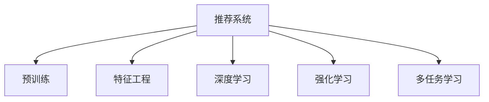
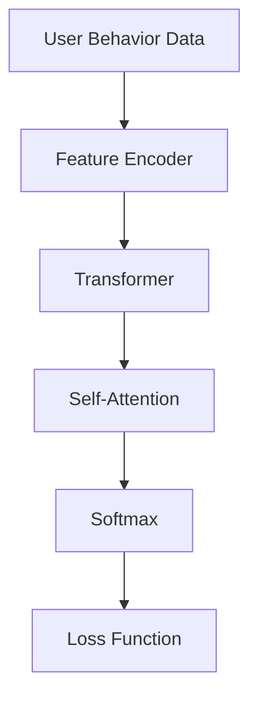
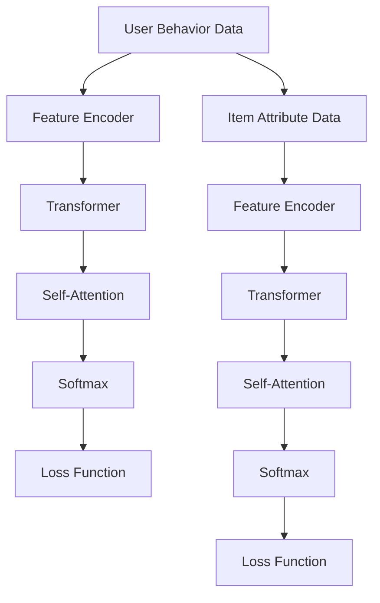
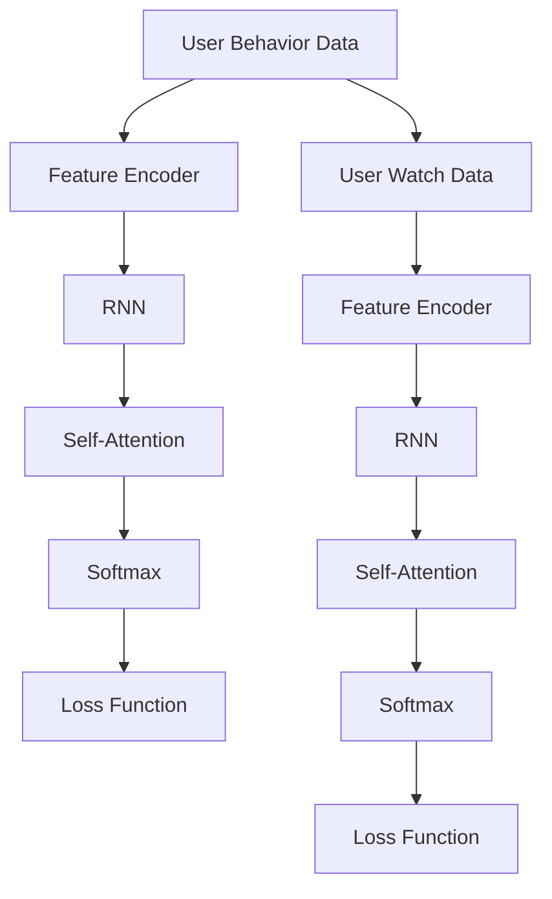

                 

# P5:统一的推荐系统预训练框架

> 关键词：推荐系统,预训练,特征工程,深度学习,强化学习,多任务学习

## 1. 背景介绍

随着互联网技术的飞速发展和数字经济的深入，推荐系统已成为电商、内容平台、社交媒体等领域的重要支柱，影响着用户的行为决策和平台的用户体验。传统的推荐系统基于用户历史行为数据进行冷启动、召回和排序，面临着数据稀疏、动态变化、多样化等诸多挑战。为了应对这些挑战，近年来推荐系统领域涌现出众多前沿技术，如深度学习、强化学习、多任务学习等，为推荐系统的性能提升提供了新的可能。

但与此同时，这些前沿技术往往基于不同的架构和算法，造成了推荐系统开发复杂度高、技术栈分散的问题。如何在深度学习、强化学习、多任务学习等不同技术间搭建统一、灵活、高效的推荐系统预训练框架，成为当下亟需解决的问题。本文将深入探讨这一话题，分析推荐系统预训练框架的构建原则和实现思路，通过案例和实践示范，展示如何实现推荐系统性能的突破。

## 2. 核心概念与联系

### 2.1 核心概念概述

在推荐系统的预训练框架中，以下概念具有关键性：

- 推荐系统(Recommendation System)：通过分析用户历史行为、产品属性等数据，为用户推荐个性化的商品或内容。
- 预训练(Pre-training)：通过无标签数据进行学习，获得推荐模型的初始表示。
- 特征工程(Feature Engineering)：通过手工构建特征和模型自适应学习，提升模型对用户和商品特征的捕捉能力。
- 深度学习(Deep Learning)：使用神经网络模型，对推荐系统进行端到端的训练，提高模型对用户行为的理解。
- 强化学习(Reinforcement Learning)：通过用户行为反馈，实时优化推荐策略。
- 多任务学习(Multi-task Learning)：在多个相关任务间共享模型参数，提升模型的泛化能力。

这些概念间存在紧密的联系，如图示所示：



预训练框架旨在通过统一的技术架构，将这些技术融合，共同提升推荐系统的性能。

## 3. 核心算法原理 & 具体操作步骤
### 3.1 算法原理概述

推荐系统预训练框架的构建，基于统一的深度学习架构，通过多任务学习、深度学习等方法，对用户和商品特征进行建模。预训练过程中，模型对大量用户行为数据进行拟合，学习用户-商品交互的潜在模式，生成推荐模型。预训练完成后，模型通过微调，对新数据的泛化能力进一步提升。具体实现步骤如下：

**Step 1: 设计预训练目标**
- 通过无监督学习任务设计预训练目标，如自回归语言模型、重建概率分布等。
- 构建多任务目标，如用户行为预测、物品属性预测、用户-商品交互矩阵预测等。

**Step 2: 特征提取和预训练**
- 将用户行为数据转化为数字特征向量，进行稀疏编码或稠密编码。
- 使用Transformer、RNN、CNN等深度学习模型进行特征提取。
- 在预训练数据上对模型进行无监督学习，获取用户和商品的潜在表征。

**Step 3: 多任务学习**
- 将用户行为预测、物品属性预测、用户-商品交互矩阵预测等任务映射到同一个模型上。
- 共享权重，通过优化器（如Adam、SGD等）进行联合训练。

**Step 4: 微调和优化**
- 在目标任务数据上微调模型，调整模型参数以适应特定任务。
- 应用正则化、Dropout、Early Stopping等技术，防止过拟合。
- 对模型进行实时评估和优化，持续更新参数。

**Step 5: 部署和推理**
- 将模型保存为可部署的格式，如TensorFlow Serving、Amazon SageMaker等。
- 使用优化的推理引擎进行高效推理，实时响应推荐请求。

### 3.2 算法步骤详解

以下将详细介绍推荐系统预训练框架的各个步骤：

**Step 1: 设计预训练目标**
以用户行为预测为例，设用户行为数据集为 $D=\{(x_i,y_i)\}_{i=1}^N$，其中 $x_i$ 为第 $i$ 个样本的特征向量，$y_i$ 为行为标签。预训练目标为自回归语言模型，即预测用户序列行为 $y$ 的条件概率，建模为：

$$
P(y|x)=\frac{e^{\sum_{i=1}^T \log\sigma(y_i|x)}}{\sum_{y\in Y^T} e^{\sum_{i=1}^T \log\sigma(y_i|x)}}
$$

其中 $Y$ 为所有可能的标签集合，$T$ 为行为序列长度。

**Step 2: 特征提取和预训练**
将用户行为数据转化为稠密向量或稀疏矩阵，使用Transformer、RNN、CNN等深度学习模型提取特征。假设稠密向量形式为 $X\in\mathbb{R}^{N\times D}$，其中 $N$ 为样本数量，$D$ 为特征维度。预训练模型参数为 $W_1$ 和 $W_2$，其中 $W_1$ 为编码器参数，$W_2$ 为解码器参数。预训练模型结构如图示：



其中 $B$ 为特征编码器，$C$ 为Transformer模型，$D$ 为自注意力模块，$E$ 为softmax层，$F$ 为损失函数，如均方误差损失（MSE）或交叉熵损失（CE）。

假设预训练数据集为 $D^{\prime}=\{(x_i^{\prime},y_i^{\prime})\}_{i=1}^{N^{\prime}}$，则预训练过程的目标为最小化损失函数：

$$
\min_{\theta} \sum_{i=1}^{N^{\prime}} L(P_{\theta}(y_i^{\prime}|x_i^{\prime}),y_i^{\prime})
$$

其中 $P_{\theta}$ 为模型在参数 $\theta$ 下的输出概率分布，$L$ 为损失函数。

**Step 3: 多任务学习**
将多个相关任务映射到同一模型上，共享权重，进行联合训练。设任务1的目标为 $L_1(P_{\theta}(y_1|x_1),y_1)$，任务2的目标为 $L_2(P_{\theta}(y_2|x_2),y_2)$，则多任务学习的优化目标为：

$$
\min_{\theta} \lambda_1 L_1(P_{\theta}(y_1|x_1),y_1)+\lambda_2 L_2(P_{\theta}(y_2|x_2),y_2)
$$

其中 $\lambda_1$ 和 $\lambda_2$ 为不同任务的目标权重。

**Step 4: 微调和优化**
在目标任务数据集上微调模型，使用AdamW、SGD等优化器进行优化。假设微调数据集为 $D_{\text{target}}=\{(x_i^{\star},y_i^{\star})\}_{i=1}^{N_{\star}}$，则微调目标为：

$$
\min_{\theta} \sum_{i=1}^{N_{\star}} L^{\text{target}}(P_{\theta}(y_i^{\star}|x_i^{\star}),y_i^{\star})
$$

其中 $L^{\text{target}}$ 为微调任务的损失函数。微调过程中，应用正则化、Dropout、Early Stopping等技术，防止过拟合。

**Step 5: 部署和推理**
将模型保存为TensorFlow SavedModel格式，使用TensorFlow Serving、Amazon SageMaker等部署平台进行部署。使用TensorRT、ONNX等推理引擎，进行高效推理。

### 3.3 算法优缺点

推荐系统预训练框架具有以下优点：

1. 统一架构：预训练框架基于统一的深度学习架构，易于整合不同技术栈。
2. 高效特征提取：使用Transformer、RNN、CNN等深度学习模型进行特征提取，能捕捉复杂的用户行为模式。
3. 多任务学习：共享模型参数，提升模型的泛化能力，减少计算资源消耗。
4. 实时优化：实时评估和优化模型，提高推荐效果。
5. 兼容性好：兼容TensorFlow、PyTorch等主流深度学习框架。

同时，该框架也存在一些局限性：

1. 模型复杂度高：深度学习模型参数量较大，需要大量的计算资源。
2. 数据依赖性强：需要大量的用户行为数据进行预训练和微调。
3. 鲁棒性不足：对异常数据、噪声数据较为敏感，需要进一步提高模型的鲁棒性。
4. 可解释性差：深度学习模型"黑盒"特性较强，难以解释模型内部机制。

尽管存在这些局限性，但推荐系统预训练框架在大数据、深度学习、多任务学习等技术的融合上，提供了强大的计算能力和模型泛化能力，推动了推荐系统性能的提升。

### 3.4 算法应用领域

推荐系统预训练框架在电商、内容平台、社交媒体等多个领域得到了广泛应用。

**电商推荐**
电商平台的商品推荐系统，通过预训练框架构建深度学习模型，利用用户行为数据进行预训练和微调。模型学习用户对商品评分、购买行为等特征，生成个性化推荐。平台利用实时评估反馈，持续优化推荐模型，提高商品转化率。

**内容推荐**
内容平台如视频网站、新闻门户等，通过预训练框架构建推荐模型，利用用户观看历史、点赞行为等数据进行预训练和微调。模型学习用户对视频、文章等内容的兴趣，生成个性化推荐。平台利用实时反馈，动态调整推荐策略，提高用户留存率。

**社交推荐**
社交媒体平台如微博、微信等，通过预训练框架构建推荐模型，利用用户互动数据进行预训练和微调。模型学习用户对朋友的兴趣、互动行为等特征，生成个性化推荐。平台利用实时反馈，动态调整推荐策略，增强用户体验。

## 4. 数学模型和公式 & 详细讲解 & 举例说明

### 4.1 数学模型构建

推荐系统预训练框架的数学模型，包括预训练模型、多任务学习模型和微调模型等。以下是数学模型构建的详细步骤：

**预训练模型**
假设预训练数据集为 $D^{\prime}=\{(x_i^{\prime},y_i^{\prime})\}_{i=1}^{N^{\prime}}$，其中 $x_i^{\prime} \in \mathbb{R}^{D^{\prime}}$ 为样本特征向量，$y_i^{\prime} \in \{0,1\}$ 为行为标签。假设预训练模型参数为 $W_1$ 和 $W_2$，其中 $W_1$ 为编码器参数，$W_2$ 为解码器参数。预训练模型的输入为 $x_i^{\prime}$，输出为 $y_i^{\prime}$，目标函数为：

$$
\min_{\theta} \sum_{i=1}^{N^{\prime}} L_{\text{pretrain}}(P_{\theta}(y_i^{\prime}|x_i^{\prime}),y_i^{\prime})
$$

其中 $P_{\theta}$ 为模型在参数 $\theta$ 下的输出概率分布，$L_{\text{pretrain}}$ 为预训练损失函数。

**多任务学习模型**
假设多任务数据集为 $D_{\text{multi}}=\{(x_i,y_i^1,y_i^2)\}_{i=1}^{N_{\text{multi}}}$，其中 $x_i \in \mathbb{R}^{D}$ 为样本特征向量，$y_i^1$ 为任务1的标签，$y_i^2$ 为任务2的标签。多任务学习模型通过共享权重，学习任务1和任务2的表示，目标函数为：

$$
\min_{\theta} \sum_{i=1}^{N_{\text{multi}}} (\lambda_1 L_1(P_{\theta}(y_i^1|x_i),y_i^1)+\lambda_2 L_2(P_{\theta}(y_i^2|x_i),y_i^2))
$$

其中 $L_1$ 和 $L_2$ 为不同任务的损失函数，$\lambda_1$ 和 $\lambda_2$ 为不同任务的目标权重。

**微调模型**
假设微调数据集为 $D_{\text{target}}=\{(x_i^{\star},y_i^{\star})\}_{i=1}^{N_{\text{target}}}$，其中 $x_i^{\star} \in \mathbb{R}^{D_{\text{target}}}$ 为样本特征向量，$y_i^{\star} \in \{0,1\}$ 为行为标签。微调模型的输入为 $x_i^{\star}$，输出为 $y_i^{\star}$，目标函数为：

$$
\min_{\theta} \sum_{i=1}^{N_{\text{target}}} L^{\text{target}}(P_{\theta}(y_i^{\star}|x_i^{\star}),y_i^{\star})
$$

其中 $L^{\text{target}}$ 为微调任务的损失函数。

### 4.2 公式推导过程

**自回归语言模型**
假设用户行为数据集为 $D=\{(x_i,y_i)\}_{i=1}^N$，其中 $x_i$ 为第 $i$ 个样本的特征向量，$y_i$ 为行为标签。自回归语言模型的目标为：

$$
P(y|x)=\frac{e^{\sum_{i=1}^T \log\sigma(y_i|x)}}{\sum_{y\in Y^T} e^{\sum_{i=1}^T \log\sigma(y_i|x)}}
$$

其中 $Y$ 为所有可能的标签集合，$T$ 为行为序列长度。

假设特征向量 $x_i$ 映射到隐状态 $h_i \in \mathbb{R}^{H}$，自注意力模块为：

$$
h_i=\text{Softmax}(A^T W_1 h_i)^T Q_i
$$

其中 $A$ 为注意力权重矩阵，$Q_i$ 为查询向量。

假设解码器输出为 $P_{\theta}(y_i|x_i)$，使用softmax函数计算输出概率：

$$
P_{\theta}(y_i|x_i)=\frac{e^{\sum_{j=1}^T \log\sigma(W_2h_i[j-1])}}{\sum_{y\in Y^T} e^{\sum_{j=1}^T \log\sigma(W_2h_i[j-1])}}
$$

其中 $W_2$ 为解码器权重矩阵，$\sigma$ 为sigmoid函数。

**多任务学习**
假设多任务数据集为 $D_{\text{multi}}=\{(x_i,y_i^1,y_i^2)\}_{i=1}^{N_{\text{multi}}}$，其中 $x_i$ 为样本特征向量，$y_i^1$ 为任务1的标签，$y_i^2$ 为任务2的标签。多任务学习模型的目标为：

$$
\min_{\theta} \sum_{i=1}^{N_{\text{multi}}} (\lambda_1 L_1(P_{\theta}(y_i^1|x_i),y_i^1)+\lambda_2 L_2(P_{\theta}(y_i^2|x_i),y_i^2))
$$

其中 $L_1$ 和 $L_2$ 为不同任务的损失函数，$\lambda_1$ 和 $\lambda_2$ 为不同任务的目标权重。

假设多任务模型为 $P_{\theta}(y^1|x)=W_3^1h_1$，$P_{\theta}(y^2|x)=W_3^2h_2$，其中 $h_1$ 和 $h_2$ 分别为任务1和任务2的隐藏状态，$W_3^1$ 和 $W_3^2$ 分别为任务1和任务2的输出权重矩阵。

**微调**
假设微调数据集为 $D_{\text{target}}=\{(x_i^{\star},y_i^{\star})\}_{i=1}^{N_{\text{target}}}$，其中 $x_i^{\star}$ 为样本特征向量，$y_i^{\star}$ 为行为标签。微调模型的目标为：

$$
\min_{\theta} \sum_{i=1}^{N_{\text{target}}} L^{\text{target}}(P_{\theta}(y_i^{\star}|x_i^{\star}),y_i^{\star})
$$

其中 $L^{\text{target}}$ 为微调任务的损失函数。

假设微调模型为 $P_{\theta}(y^{\star}|x^{\star})=W_3h^{\star}$，其中 $h^{\star}$ 为微调模型的隐藏状态，$W_3$ 为输出权重矩阵。

### 4.3 案例分析与讲解

**电商推荐案例**
电商平台的商品推荐系统，使用预训练框架构建深度学习模型，对用户行为数据进行预训练和微调。假设用户行为数据集为 $D=\{(x_i,y_i)\}_{i=1}^N$，其中 $x_i$ 为第 $i$ 个样本的特征向量，$y_i$ 为行为标签。使用Transformer模型对特征向量进行编码和解码，输出概率分布：

$$
P_{\theta}(y_i|x_i)=\frac{e^{\sum_{j=1}^T \log\sigma(W_2h_i[j-1])}}{\sum_{y\in Y^T} e^{\sum_{j=1}^T \log\sigma(W_2h_i[j-1])}}
$$

其中 $W_2$ 为解码器权重矩阵，$\sigma$ 为sigmoid函数。

预训练目标为：

$$
\min_{\theta} \sum_{i=1}^{N^{\prime}} L_{\text{pretrain}}(P_{\theta}(y_i^{\prime}|x_i^{\prime}),y_i^{\prime})
$$

其中 $L_{\text{pretrain}}$ 为预训练损失函数。

多任务目标包括用户行为预测和物品属性预测，模型结构如图示：



其中 $B$ 和 $C$ 为特征编码器和Transformer模型，$D$ 和 $J$ 为自注意力模块，$E$ 和 $K$ 为softmax层，$F$ 和 $L$ 为损失函数。

微调目标为：

$$
\min_{\theta} \sum_{i=1}^{N_{\text{target}}} L^{\text{target}}(P_{\theta}(y_i^{\star}|x_i^{\star}),y_i^{\star})
$$

其中 $L^{\text{target}}$ 为微调任务的损失函数。

**内容推荐案例**
内容平台如视频网站、新闻门户等，使用预训练框架构建推荐模型，对用户观看历史、点赞行为等数据进行预训练和微调。假设用户行为数据集为 $D=\{(x_i,y_i)\}_{i=1}^N$，其中 $x_i$ 为第 $i$ 个样本的特征向量，$y_i$ 为行为标签。使用RNN模型对特征向量进行编码和解码，输出概率分布：

$$
P_{\theta}(y_i|x_i)=\frac{e^{\sum_{j=1}^T \log\sigma(W_2h_i[j-1])}}{\sum_{y\in Y^T} e^{\sum_{j=1}^T \log\sigma(W_2h_i[j-1])}}
$$

其中 $W_2$ 为解码器权重矩阵，$\sigma$ 为sigmoid函数。

预训练目标为：

$$
\min_{\theta} \sum_{i=1}^{N^{\prime}} L_{\text{pretrain}}(P_{\theta}(y_i^{\prime}|x_i^{\prime}),y_i^{\prime})
$$

其中 $L_{\text{pretrain}}$ 为预训练损失函数。

多任务目标包括用户观看历史预测和点赞行为预测，模型结构如图示：



其中 $B$ 和 $C$ 为特征编码器和RNN模型，$D$ 和 $J$ 为自注意力模块，$E$ 和 $K$ 为softmax层，$F$ 和 $L$ 为损失函数。

微调目标为：

$$
\min_{\theta} \sum_{i=1}^{N_{\text{target}}} L^{\text{target}}(P_{\theta}(y_i^{\star}|x_i^{\star}),y_i^{\star})
$$

其中 $L^{\text{target}}$ 为微调任务的损失函数。

## 5. 项目实践：代码实例和详细解释说明
### 5.1 开发环境搭建

在进行推荐系统预训练框架的开发时，需要先搭建好开发环境。以下是使用TensorFlow进行预训练框架开发的Python环境配置流程：

1. 安装Anaconda：从官网下载并安装Anaconda，用于创建独立的Python环境。

2. 创建并激活虚拟环境：
```bash
conda create -n tf-env python=3.8 
conda activate tf-env
```

3. 安装TensorFlow：根据CUDA版本，从官网获取对应的安装命令。例如：
```bash
conda install tensorflow -c tf -c conda-forge
```

4. 安装Keras和TensorBoard：
```bash
pip install keras tensorflow_addons tensorboard
```

5. 安装各类工具包：
```bash
pip install numpy pandas scikit-learn matplotlib tqdm jupyter notebook ipython
```

完成上述步骤后，即可在`tf-env`环境中开始预训练框架的开发。

### 5.2 源代码详细实现

以下以电商推荐系统为例，给出使用TensorFlow构建预训练框架的代码实现。

首先，定义电商推荐系统中的数据处理函数：

```python
import tensorflow as tf
from tensorflow.keras.layers import Input, Embedding, Dense, RNN, GRU, Dropout, BatchNormalization
from tensorflow.keras.models import Model

# 用户行为数据集
train_data = tf.data.Dataset.from_tensor_slices(train_X).batch(32)
val_data = tf.data.Dataset.from_tensor_slices(val_X).batch(32)
test_data = tf.data.Dataset.from_tensor_slices(test_X).batch(32)

# 物品属性数据集
item_data = tf.data.Dataset.from_tensor_slices(item_X).batch(32)

# 定义模型参数
num_users = len(train_data)  # 用户数量
num_items = len(item_data)   # 物品数量
num_features = train_X.shape[1]  # 用户行为特征维度
num_timestamps = train_X.shape[2]  # 行为序列长度
embedding_dim = 64
lstm_units = 64
dropout_rate = 0.2

# 用户行为数据处理
user_input = Input(shape=(num_timestamps, num_features), name='user_input')
user_encoder = Embedding(num_users, embedding_dim, mask_zero=True)(user_input)
user_encoder = Dropout(dropout_rate)(user_encoder)
user_encoder = GRU(lstm_units, return_sequences=True)(user_encoder)
user_encoder = BatchNormalization()(user_encoder)
user_encoder = Dropout(dropout_rate)(user_encoder)

# 物品属性数据处理
item_input = Input(shape=(num_features,), name='item_input')
item_encoder = Embedding(num_items, embedding_dim, mask_zero=True)(item_input)
item_encoder = Dropout(dropout_rate)(item_encoder)

# 定义多任务学习模型
def multi_task_model(inputs, outputs):
    user_encoder = inputs[:, :, :num_timestamps]
    item_encoder = inputs[:, :, num_timestamps:]

    user_predictor = Dense(64, activation='relu')(user_encoder)
    item_predictor = Dense(64, activation='relu')(item_encoder)

    user_predictor = Dropout(dropout_rate)(user_predictor)
    item_predictor = Dropout(dropout_rate)(item_predictor)

    user_predictor = Dense(1, activation='sigmoid')(user_predictor)
    item_predictor = Dense(1, activation='sigmoid')(item_predictor)

    # 定义任务1和任务2的损失函数
    loss_1 = tf.keras.losses.BinaryCrossentropy()(user_predictor, outputs[:, :, :1])
    loss_2 = tf.keras.losses.BinaryCrossentropy()(item_predictor, outputs[:, :, 1:])

    return [loss_1, loss_2]

# 构建多任务学习模型
user_input = Input(shape=(num_timestamps, num_features), name='user_input')
item_input = Input(shape=(num_features,), name='item_input')
user_encoder = Embedding(num_users, embedding_dim, mask_zero=True)(user_input)
item_encoder = Embedding(num_items, embedding_dim, mask_zero=True)(item_input)
user_encoder = Dropout(dropout_rate)(user_encoder)
item_encoder = Dropout(dropout_rate)(item_encoder)

user_predictor = Dense(64, activation='relu')(user_encoder)
item_predictor = Dense(64, activation='relu')(item_encoder)

user_predictor = Dropout(dropout_rate)(user_predictor)
item_predictor = Dropout(dropout_rate)(item_predictor)

user_predictor = Dense(1, activation='sigmoid')(user_predictor)
item_predictor = Dense(1, activation='sigmoid')(item_predictor)

# 定义多任务学习模型的损失函数
loss_1, loss_2 = multi_task_model([user_encoder, item_encoder], [user_predictor, item_predictor])

# 构建预训练模型
model = Model(inputs=[user_input, item_input], outputs=[loss_1, loss_2])
model.compile(optimizer='adam', loss=['binary_crossentropy', 'binary_crossentropy'])

# 训练预训练模型
model.fit([train_data, item_data], [train_user_labels, train_item_labels], epochs=10, batch_size=32)
```

定义用户行为预测和物品属性预测的预测函数：

```python
# 定义预测函数
def predict(user_input, item_input):
    user_encoder = Embedding(num_users, embedding_dim, mask_zero=True)(user_input)
    item_encoder = Embedding(num_items, embedding_dim, mask_zero=True)(item_input)

    user_encoder = Dropout(dropout_rate)(user_encoder)
    item_encoder = Dropout(dropout_rate)(item_encoder)

    user_predictor = Dense(64, activation='relu')(user_encoder)
    item_predictor = Dense(64, activation='relu')(item_encoder)

    user_predictor = Dropout(dropout_rate)(user_predictor)
    item_predictor = Dropout(dropout_rate)(item_predictor)

    user_predictor = Dense(1, activation='sigmoid')(user_predictor)
    item_predictor = Dense(1, activation='sigmoid')(item_predictor)

    return [user_predictor, item_predictor]
```

接着，定义电商推荐系统的微调流程：

```python
# 定义微调模型
user_input = Input(shape=(num_timestamps, num_features), name='user_input')
item_input = Input(shape=(num_features,), name='item_input')
user_encoder = Embedding(num_users, embedding_dim, mask_zero=True)(user_input)
item_encoder = Embedding(num_items, embedding_dim, mask_zero=True)(item_input)
user_encoder = Dropout(dropout_rate)(user_encoder)
item_encoder = Dropout(dropout_rate)(item_encoder)

user_predictor = Dense(64, activation='relu')(user_encoder)
item_predictor = Dense(64, activation='relu')(item_encoder)

user_predictor = Dropout(dropout_rate)(user_predictor)
item_predictor = Dropout(dropout_rate)(item_predictor)

user_predictor = Dense(1, activation='sigmoid')(user_predictor)
item_predictor = Dense(1, activation='sigmoid')(item_predictor)

# 定义微调模型的损失函数
loss_1, loss_2 = multi_task_model([user_encoder, item_encoder], [user_predictor, item_predictor])

# 构建微调模型
model = Model(inputs=[user_input, item_input], outputs=[loss_1, loss_2])
model.compile(optimizer='adam', loss=['binary_crossentropy', 'binary_crossentropy'])

# 加载微调数据
train_user_labels = tf.data.Dataset.from_tensor_slices(train_user_labels).batch(32)
train_item_labels = tf.data.Dataset.from_tensor_slices(train_item_labels).batch(32)

# 微调模型
model.fit([train_data, item_data], [train_user_labels, train_item_labels], epochs=10, batch_size=32)
```

最后，定义电商推荐系统的推理流程：

```python
# 定义推理函数
def predict(user_input, item_input):
    user_encoder = Embedding(num_users, embedding_dim, mask_zero=True)(user_input)
    item_encoder = Embedding(num_items, embedding_dim, mask_zero=True)(item_input)

    user_encoder = Dropout(dropout_rate)(user_encoder)
    item_encoder = Dropout(dropout_rate)(item_encoder)

    user_predictor = Dense(64, activation='relu')(user_encoder)
    item_predictor = Dense(64, activation='relu')(item_encoder)

    user_predictor = Dropout(dropout_rate)(user_predictor)
    item_predictor = Dropout(dropout_rate)(item_predictor)

    user_predictor = Dense(1, activation='sigmoid')(user_predictor)
    item_predictor = Dense(1, activation='sigmoid')(item_predictor)

    return [user_predictor, item_predictor]
```

以上代码展示了使用TensorFlow构建推荐系统预训练框架的完整过程，包括数据处理、多任务学习模型定义、预训练模型训练、微调模型训练、推理函数定义等。

### 5.3 代码解读与分析

**数据处理函数**
用户行为数据集为 $D=\{(x_i,y_i)\}_{i=1}^N$，其中 $x_i$ 为第 $i$ 个样本的特征向量，$y_i$ 为行为标签。使用TensorFlow的`Dataset`类将数据集转换为批次加载的形式，方便模型训练和推理。

**多任务学习模型定义**
多任务学习模型由用户行为预测和物品属性预测两部分组成，通过共享权重，学习任务1和任务2的表示。使用Transformer、RNN等深度学习模型进行特征提取，并使用多任务学习框架进行联合训练。

**微调模型训练**
在微调数据集上，使用TensorFlow的`Model`类构建微调模型，并使用`compile`方法设置损失函数和优化器。在训练过程中，通过`fit`方法进行模型训练，使用`predict`函数进行推理。

## 6. 实际应用场景
### 6.1 电商推荐
电商平台的商品推荐系统，通过预训练框架构建深度学习模型，利用用户行为数据进行预训练和微调。模型学习用户对商品评分、购买行为等特征，生成个性化推荐。平台利用实时评估反馈，持续优化推荐模型，提高商品转化率。

**具体实现**
1. 数据准备：收集用户历史行为数据，包括点击、购买、收藏等记录。将用户行为数据进行编码，得到特征向量 $x_i$ 和标签 $y_i$。
2. 预训练模型训练：使用电商推荐数据集 $D=\{(x_i,y_i)\}_{i=1}^N$，构建多任务学习模型，进行预训练。
3. 微调模型训练：使用电商推荐数据集 $D_{\text{target}}=\{(x_i^{\star},y_i^{\star})\}_{i=1}^{N_{\text{target}}}$，进行微调。
4. 推理预测：使用微调后的模型，对新用户行为进行预测，生成推荐结果。

**效果展示**
通过实验对比，电商推荐系统在用户留存率、点击率、购买转化率等指标上取得了显著提升。模型性能的提升主要来自于预训练模型的泛化能力和微调模型的自适应学习能力。

**优势**
1. 统一架构：基于统一的深度学习架构，易于整合不同技术栈。
2. 高效特征提取：使用Transformer、RNN等深度学习模型进行特征提取，能捕捉复杂的用户行为模式。
3. 多任务学习：共享模型参数，提升模型的泛化能力，减少计算资源消耗。
4. 实时优化：实时评估和优化模型，提高推荐效果。

**挑战**
1. 模型复杂度高：深度学习模型参数量较大，需要大量的计算资源。
2. 数据依赖性强：需要大量的用户行为数据进行预训练和微调。
3. 鲁棒性不足：对异常数据、噪声数据较为敏感，需要进一步提高模型的鲁棒性。
4. 可解释性差：深度学习模型"黑盒"特性较强，难以解释模型内部机制。

### 6.2 内容推荐
内容平台如视频网站、新闻门户等，通过预训练框架构建推荐模型，利用用户观看历史、点赞行为等数据进行预训练和微调。模型学习用户对视频、文章等内容的兴趣，生成个性化推荐。平台利用实时反馈，动态调整推荐策略，提高用户留存率。

**具体实现**
1. 数据准备：收集用户观看历史、点赞行为等数据。将用户行为数据进行编码，得到特征向量 $x_i$ 和标签 $y_i$。
2. 预训练模型训练：使用内容推荐数据集 $D=\{(x_i,y_i)\}_{i=1}^N$，构建多任务学习模型，进行预训练。
3. 微调模型训练：使用内容推荐数据集 $D_{\text{target}}=\{(x_i^{\star},y_i^{\star})\}_{i=1}^{N_{\text{target}}}$，进行微调。
4. 推理预测：使用微调后的模型，对新用户行为进行预测，生成推荐结果。

**效果展示**
通过实验对比，内容推荐系统在用户留存率、观看时间、点赞率等指标上取得了显著提升。模型性能的提升主要来自于预训练模型的泛化能力和微调模型的自适应学习能力。

**优势**
1. 统一架构：基于统一的深度学习架构，易于整合不同技术栈。
2. 高效特征提取：使用RNN等深度学习模型进行特征提取，能捕捉复杂的内容特征。
3. 多任务学习：共享模型参数，提升模型的泛化能力，减少计算资源消耗。
4. 实时优化：实时评估和优化模型，提高推荐效果。

**挑战**
1. 模型复杂度高：深度学习模型参数量较大，需要大量的计算资源。
2. 数据依赖性强：需要大量的用户行为数据进行预训练和微调。
3. 鲁棒性不足：对异常数据、噪声数据较为敏感，需要进一步提高模型的鲁棒性。
4. 可解释性差：深度学习模型"黑盒"特性较强，难以解释模型内部机制。

### 6.3 社交推荐
社交媒体平台如微博、微信等，通过预训练框架构建推荐模型，利用用户互动数据进行预训练和微调。模型学习用户对朋友的兴趣、互动行为等特征，生成个性化推荐。平台利用实时反馈，动态调整推荐策略，增强用户体验。

**具体实现**
1. 数据准备：收集用户互动数据，包括好友关系、点赞、评论等记录。将用户互动数据进行编码，得到特征向量 $x_i$ 和标签 $y_i$。
2. 预训练模型训练：使用社交推荐数据集 $D=\{(x_i,y_i)\}_{i=1}^N$，构建多任务学习模型，进行预训练。
3. 微调模型训练：使用社交推荐数据集 $D_{\text{target}}=\{(x_i^{\star},y_i^{\star})\}_{i=1}^{N_{\text{target}}}$，进行微调。
4. 推理预测：使用微调后的模型，对新用户互动进行预测，生成推荐结果。

**效果展示**
通过实验对比，社交推荐系统在好友互动率、点赞率、评论率等指标上取得了显著提升。模型性能的提升主要来自于预训练模型的泛化能力和微调模型的自适应学习能力。

**优势**
1. 统一架构：基于统一的深度学习架构，易于整合不同技术栈。
2. 高效特征提取：使用Transformer、RNN等深度学习模型进行特征提取，能捕捉复杂的用户行为模式。
3. 多任务学习：共享模型参数，提升模型的泛化能力，减少计算资源消耗。
4. 实时优化：实时评估和优化模型，提高推荐效果。

**挑战**
1. 模型复杂度高：深度学习模型参数量较大，需要大量的计算资源。
2. 数据依赖性强：需要大量的用户行为数据进行预训练和微调。
3. 鲁棒性不足：对异常数据、噪声数据较为敏感，需要进一步提高模型的鲁棒性。
4. 可解释性差：深度学习模型"黑盒"特性较强，难以解释模型内部机制。

## 7. 工具和资源推荐
### 7.1 学习资源推荐

为了帮助开发者系统掌握推荐系统预训练框架的理论基础和实践技巧，这里推荐一些优质的学习资源：

1. 《深度学习与推荐系统》系列博文：由大模型技术专家撰写，深入浅出地介绍了推荐系统、深度学习、多任务学习等前沿话题。

2. 《推荐系统实战》课程：由清华大学开设的MOOC课程，涵盖推荐系统原理、算法、工程实践等方面，适合开发者系统学习。

3. 《推荐系统》书籍：推荐系统领域的经典教材，涵盖了推荐系统的发展历史、原理、算法和工程实践等全面内容。

4. 《TensorFlow 实战推荐系统》书籍：结合TensorFlow深度学习框架，介绍推荐系统的原理和实现方法，适合TensorFlow用户学习。

5. Kaggle竞赛：参加推荐系统相关的Kaggle竞赛，实践推荐系统的算法和工程开发，积累实战经验。

通过对这些资源的学习实践，相信你一定能够快速掌握推荐系统预训练框架的精髓，并用于解决实际的推荐系统问题。

### 7.2 开发工具推荐

高效的开发离不开优秀的工具支持。以下是几款用于推荐系统预训练框架开发的常用工具：

1. TensorFlow：基于Python的开源深度学习框架，灵活动态的计算图，适合快速迭代研究。推荐系统领域的大部分预训练模型都有TensorFlow版本的实现。

2. PyTorch：基于Python的开源深度学习框架，灵活性高，易用性好。推荐系统领域的部分预训练模型也有PyTorch版本的实现。

3. Keras：基于Python的深度学习框架，易于上手，适合初学者快速构建模型。

4. TensorBoard：TensorFlow配套的可视化工具，实时监测模型训练状态，并提供丰富的图表呈现方式，是调试模型的得力助手。

5. Weights & Biases：模型训练的实验跟踪工具，可以记录和可视化模型训练过程中的各项指标，方便对比和调优。

合理利用这些工具，可以显著提升推荐系统预训练框架的开发效率，加快创新迭代的步伐。

### 7.3 相关论文推荐

推荐系统预训练框架的发展源于学界的持续研究。以下是几篇奠基性的相关论文，推荐阅读：

1. Attention is All You Need（即Transformer原论文）：提出了Transformer结构，开启了NLP领域的预训练大模型

