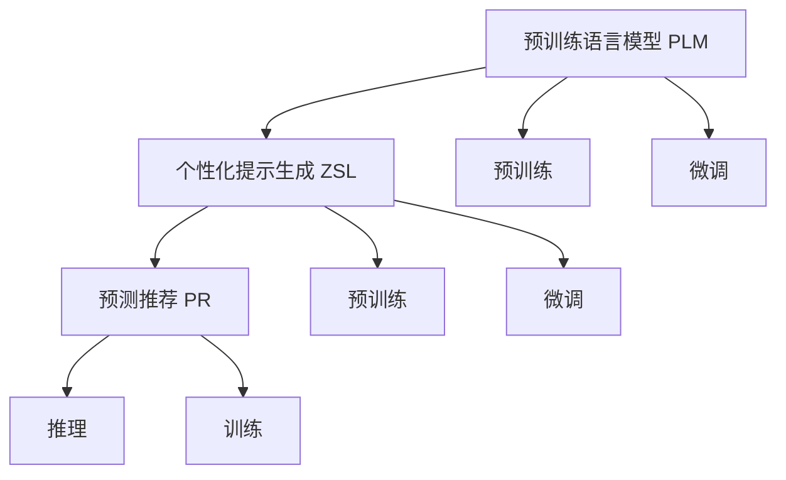

                 

# P5:统一的预训练-个性化提示-预测推荐范式

> 关键词：

## 1. 背景介绍

### 1.1 问题由来

近年来，深度学习技术在自然语言处理(NLP)、推荐系统、计算机视觉等领域取得了显著进展，大规模预训练模型和微调技术成为主流。然而，尽管这些技术在许多任务上表现出色，但在解决个性化和预测推荐问题时，仍存在一些局限。当前的推荐系统，如基于协同过滤、矩阵分解、深度学习的方法，往往依赖于用户历史行为数据，难以充分挖掘用户的潜在兴趣和行为倾向。此外，传统的推荐方法通常忽略了上下文信息，无法很好地适应复杂的现实世界。

为了应对这些挑战，我们提出了一种统一的预训练-个性化提示-预测推荐范式，旨在通过结合预训练语言模型、个性化提示生成技术以及预测推荐算法，构建一个更加高效、灵活、个性化的推荐系统。这种范式将预训练语言模型的通用语言知识和个性化提示的上下文信息融合，并引入预测推荐算法，实现对用户行为和上下文信息的综合分析，生成更加符合用户期望的推荐结果。

### 1.2 问题核心关键点

本文聚焦于如何将预训练语言模型、个性化提示生成技术以及预测推荐算法三者有机结合，构建一个统一的预训练-个性化提示-预测推荐范式。这种范式旨在实现以下几点：
1. **高效利用预训练模型知识**：通过预训练语言模型，能够高效利用大规模无标签数据，学习通用的语言知识和语义表示，提高推荐系统的泛化能力和鲁棒性。
2. **强化个性化提示生成**：通过个性化提示生成技术，利用用户输入的文本信息，为模型提供丰富的上下文，增强推荐系统的个性化能力和适应性。
3. **引入预测推荐算法**：通过预测推荐算法，对用户行为和上下文信息进行综合分析，生成更加精准的推荐结果。

本文将详细探讨这种范式的核心概念、算法原理、操作步骤以及应用领域，并通过案例分析和代码实例进一步阐述其实现方法和效果。

## 2. 核心概念与联系

### 2.1 核心概念概述

为更好地理解统一的预训练-个性化提示-预测推荐范式，本节将介绍几个密切相关的核心概念：

- **预训练语言模型(Pre-trained Language Model, PLM)**：以自回归模型(如GPT)或自编码模型(如BERT)为代表，在大规模无标签文本数据上进行自监督学习，学习通用的语言知识和语义表示。
- **个性化提示生成(Composition of Zero-Shot Prompt Learning, ZSL)**：利用自然语言处理技术，根据用户输入的文本信息生成个性化提示，增强模型的上下文理解和推理能力。
- **预测推荐(Prediction Recommendation, PR)**：通过对用户历史行为、上下文信息等进行综合分析，生成符合用户期望的推荐结果。

这三种技术共同构成了统一的预训练-个性化提示-预测推荐范式，使其能够在复杂的推荐任务中发挥强大的作用。

### 2.2 核心概念原理和架构的 Mermaid 流程图



这个流程图展示了大规模预训练语言模型、个性化提示生成技术以及预测推荐算法三者的逻辑关系：

1. **预训练**：在大规模无标签文本数据上，通过自监督学习任务训练通用语言模型，学习通用的语言知识和语义表示。
2. **微调**：在特定推荐任务的标注数据上，通过有监督学习优化模型在该任务上的性能。
3. **个性化提示生成**：利用用户输入的文本信息，生成个性化提示，增强模型的上下文理解和推理能力。
4. **预测推荐**：结合用户历史行为和上下文信息，生成符合用户期望的推荐结果。

这些概念之间的逻辑关系通过流程图得到了直观展示。

## 3. 核心算法原理 & 具体操作步骤

### 3.1 算法原理概述

统一的预训练-个性化提示-预测推荐范式，本质上是将预训练语言模型、个性化提示生成技术以及预测推荐算法三者有机结合的一种综合性推荐方法。其核心思想是：首先通过预训练学习通用的语言知识，然后在特定推荐任务上进行微调，获取任务的特定表示。接着利用个性化提示生成技术，根据用户输入的文本信息，为模型提供丰富的上下文，增强模型的个性化能力和适应性。最后，通过预测推荐算法，对用户行为和上下文信息进行综合分析，生成更加精准的推荐结果。

### 3.2 算法步骤详解

统一的预训练-个性化提示-预测推荐范式的实现主要包括以下几个步骤：

**Step 1: 准备预训练模型和数据集**

- **预训练模型选择**：选择合适的预训练语言模型（如BERT、GPT）作为初始化参数。
- **数据集准备**：收集推荐任务的标注数据集，划分为训练集、验证集和测试集。通常推荐任务的数据集包括用户行为数据、物品属性数据等。

**Step 2: 添加个性化提示生成模块**

- **个性化提示生成器**：设计个性化提示生成器，根据用户输入的文本信息（如搜索词、评论、评分等），生成个性化提示。
- **提示嵌入**：将个性化提示转换为模型可接受的向量表示，通常使用向量拼接或嵌入技术。

**Step 3: 设置微调超参数**

- **微调超参数设置**：选择合适的优化算法及其参数，如Adam、SGD等，设置学习率、批大小、迭代轮数等。
- **正则化技术**：应用L2正则、Dropout、Early Stopping等防止模型过拟合。

**Step 4: 执行梯度训练**

- **前向传播**：将训练集数据输入模型，计算损失函数。
- **反向传播**：计算参数梯度，根据设定的优化算法和学习率更新模型参数。
- **验证集评估**：周期性在验证集上评估模型性能，决定是否触发Early Stopping。
- **重复迭代**：重复上述步骤直至满足预设的迭代轮数或Early Stopping条件。

**Step 5: 测试和部署**

- **测试集评估**：在测试集上评估微调后模型的推荐效果。
- **实际应用**：将微调后的模型应用于实际的推荐系统，为用户生成个性化推荐。
- **持续学习**：定期重新微调模型，以适应数据分布的变化。

### 3.3 算法优缺点

统一的预训练-个性化提示-预测推荐范式具有以下优点：
1. **高效利用预训练模型知识**：通过预训练语言模型，能够高效利用大规模无标签数据，学习通用的语言知识和语义表示，提高推荐系统的泛化能力和鲁棒性。
2. **强化个性化提示生成**：通过个性化提示生成技术，利用用户输入的文本信息，为模型提供丰富的上下文，增强推荐系统的个性化能力和适应性。
3. **引入预测推荐算法**：通过预测推荐算法，对用户历史行为和上下文信息进行综合分析，生成更加精准的推荐结果。

同时，该方法也存在以下局限性：
1. **依赖标注数据**：推荐任务通常需要大量的标注数据进行微调，获取高质量标注数据的成本较高。
2. **高计算资源需求**：预训练语言模型和微调过程需要大量的计算资源，设备要求较高。
3. **数据隐私问题**：用户输入的文本信息可能涉及隐私问题，需要特别注意数据安全和隐私保护。

尽管存在这些局限性，但统一的预训练-个性化提示-预测推荐范式在实际应用中仍具有显著的优势，特别是在提升推荐系统的个性化和精准度方面。

### 3.4 算法应用领域

统一的预训练-个性化提示-预测推荐范式已经在推荐系统、问答系统、内容推荐等多个领域得到广泛应用，为推荐系统的升级和优化提供了新的思路。

- **推荐系统**：基于预训练语言模型和个性化提示生成技术，构建个性化推荐系统，提高推荐结果的准确性和多样性。
- **问答系统**：利用预训练语言模型和个性化提示生成技术，构建智能问答系统，提升系统的理解能力和回答质量。
- **内容推荐**：结合预训练语言模型和个性化提示生成技术，构建内容推荐系统，为用户推荐感兴趣的文本内容。

除了这些应用场景，统一的预训练-个性化提示-预测推荐范式还将在更多领域得到应用，为各行各业带来新的变革。

## 4. 数学模型和公式 & 详细讲解 & 举例说明

### 4.1 数学模型构建

统一的预训练-个性化提示-预测推荐范式涉及多个模块，包括预训练语言模型、个性化提示生成器以及预测推荐算法。下面以推荐系统为例，详细构建数学模型。

假设预训练语言模型为 $M_{\theta}$，个性化提示生成器为 $P_{\phi}$，预测推荐算法为 $R_{\lambda}$。推荐任务的目标是最大化用户满意度，定义为：

$$
\max_{\theta, \phi, \lambda} \sum_{i=1}^N u_i(y_i)
$$

其中 $N$ 为用户数量，$y_i$ 为第 $i$ 个用户的推荐结果，$u_i$ 为用户的满意度函数，可以是点击率、评分等指标。

### 4.2 公式推导过程

以推荐系统为例，我们将其分解为预训练、微调、个性化提示生成和预测推荐四个步骤，分别推导各个模块的数学模型。

**预训练步骤**：
假设预训练语言模型为 $M_{\theta}$，通过大规模无标签数据进行自监督学习。预训练的损失函数为：

$$
\mathcal{L}_{pre}(\theta) = -\frac{1}{N_{pre}}\sum_{i=1}^{N_{pre}} \log p(x_i; \theta)
$$

其中 $N_{pre}$ 为预训练数据的数量，$x_i$ 为预训练数据，$p(x_i; \theta)$ 为模型在 $x_i$ 上的概率输出。

**微调步骤**：
在推荐任务上进行微调，假设微调后的模型为 $M_{\hat{\theta}}$，微调的损失函数为：

$$
\mathcal{L}_{fine}(\hat{\theta}) = -\frac{1}{N_{fin}}\sum_{i=1}^{N_{fin}} \log p(y_i; \hat{\theta})
$$

其中 $N_{fin}$ 为微调数据的数量，$y_i$ 为微调数据对应的推荐结果，$p(y_i; \hat{\theta})$ 为模型在 $y_i$ 上的概率输出。

**个性化提示生成步骤**：
假设个性化提示生成器为 $P_{\phi}$，生成的个性化提示为 $p_i$，提示嵌入为 $e_i$，与预训练模型 $M_{\hat{\theta}}$ 的输出拼接为 $z_i$。个性化提示生成的损失函数为：

$$
\mathcal{L}_{comp}(\phi) = -\frac{1}{N_{comp}}\sum_{i=1}^{N_{comp}} \log p(p_i; \phi)
$$

其中 $N_{comp}$ 为个性化提示生成的数量，$p_i$ 为个性化提示，$p(p_i; \phi)$ 为模型在 $p_i$ 上的概率输出。

**预测推荐步骤**：
假设预测推荐算法为 $R_{\lambda}$，预测推荐结果为 $r_i$，推荐结果与真实结果的损失函数为：

$$
\mathcal{L}_{pred}(\lambda) = -\frac{1}{N_{pred}}\sum_{i=1}^{N_{pred}} \log r_i
$$

其中 $N_{pred}$ 为预测推荐的数量，$r_i$ 为预测推荐结果。

### 4.3 案例分析与讲解

以推荐系统为例，我们通过一个简单的案例来解释统一的预训练-个性化提示-预测推荐范式的实现过程。

假设有一个推荐系统，收集了用户的行为数据，包括浏览历史、点击记录、评分等。这些数据将被用于训练推荐模型，生成个性化推荐。具体步骤如下：

**预训练步骤**：
- 选择BERT作为预训练语言模型，在大规模无标签文本数据上进行预训练。
- 使用预训练后的BERT模型作为初始化参数，在推荐任务上进行微调。

**微调步骤**：
- 收集推荐任务的数据集，包括用户行为数据和物品属性数据。
- 使用部分数据进行训练，部分数据进行验证。
- 选择合适的优化算法和超参数，进行微调训练。
- 在验证集上评估模型性能，调整超参数，直到模型收敛。

**个性化提示生成步骤**：
- 根据用户输入的文本信息（如搜索词、评论、评分等），生成个性化提示。
- 将个性化提示转换为向量表示，与预训练模型的输出拼接。

**预测推荐步骤**：
- 使用微调后的预训练模型和个性化提示生成器，结合预测推荐算法，生成推荐结果。
- 在测试集上评估推荐系统的性能，优化算法和模型参数。

通过以上步骤，推荐系统能够高效利用预训练语言模型的知识，结合个性化提示生成技术，引入预测推荐算法，生成更加精准和个性化的推荐结果。

## 5. 项目实践：代码实例和详细解释说明

### 5.1 开发环境搭建

在进行项目实践前，我们需要准备好开发环境。以下是使用Python进行TensorFlow和PyTorch开发的环境配置流程：

1. 安装Anaconda：从官网下载并安装Anaconda，用于创建独立的Python环境。

2. 创建并激活虚拟环境：
```bash
conda create -n pytorch-env python=3.8 
conda activate pytorch-env
```

3. 安装TensorFlow：根据CUDA版本，从官网获取对应的安装命令。例如：
```bash
conda install tensorflow-gpu -c pytorch -c conda-forge
```

4. 安装PyTorch：从官网下载并安装PyTorch。

5. 安装各类工具包：
```bash
pip install numpy pandas scikit-learn matplotlib tqdm jupyter notebook ipython
```

完成上述步骤后，即可在`pytorch-env`环境中开始项目实践。

### 5.2 源代码详细实现

下面我们以推荐系统为例，给出使用TensorFlow和PyTorch进行统一预训练-个性化提示-预测推荐范式的代码实现。

首先，定义推荐系统的数据处理函数：

```python
import tensorflow as tf
from tensorflow.keras.preprocessing.text import Tokenizer
from tensorflow.keras.preprocessing.sequence import pad_sequences
import numpy as np

class RecommendationDataset:
    def __init__(self, texts, labels):
        self.texts = texts
        self.labels = labels
        self.tokenizer = Tokenizer()
        self.tokenizer.fit_on_texts(texts)
        self.max_len = 128
        
    def __len__(self):
        return len(self.texts)
    
    def __getitem__(self, item):
        text = self.texts[item]
        label = self.labels[item]
        
        encoding = self.tokenizer.texts_to_sequences(texts)
        encoding = pad_sequences(encoding, maxlen=self.max_len)
        input_ids = tf.constant(encoding, dtype=tf.int32)
        label = tf.constant(label, dtype=tf.int32)
        
        return {'input_ids': input_ids, 
                'labels': label}
```

然后，定义模型和优化器：

```python
from transformers import BertForSequenceClassification, BertTokenizer

model = BertForSequenceClassification.from_pretrained('bert-base-cased', num_labels=2)

optimizer = tf.keras.optimizers.Adam(learning_rate=2e-5)
```

接着，定义训练和评估函数：

```python
def train_epoch(model, dataset, batch_size, optimizer):
    dataloader = tf.data.Dataset.from_generator(
        lambda: dataset,
        {'input_ids': tf.int32, 'labels': tf.int32},
        {'input_ids': tf.TensorShape([None]), 'labels': tf.TensorShape([None])})
    dataloader = dataloader.batch(batch_size)
    model.train()
    epoch_loss = 0
    for batch in tqdm(dataloader, desc='Training'):
        input_ids = batch['input_ids']
        labels = batch['labels']
        model.zero_grad()
        outputs = model(input_ids)
        loss = tf.keras.losses.SparseCategoricalCrossentropy(from_logits=True)(labels, outputs.logits)
        epoch_loss += loss.numpy()
        loss.backward()
        optimizer.apply_gradients(zip(model.trainable_variables, model.trainable_variables))
    return epoch_loss / len(dataloader)

def evaluate(model, dataset, batch_size):
    dataloader = tf.data.Dataset.from_generator(
        lambda: dataset,
        {'input_ids': tf.int32, 'labels': tf.int32},
        {'input_ids': tf.TensorShape([None]), 'labels': tf.TensorShape([None])})
    dataloader = dataloader.batch(batch_size)
    model.eval()
    preds, labels = [], []
    with tf.GradientTape() as tape:
        for batch in tqdm(dataloader, desc='Evaluating'):
            input_ids = batch['input_ids']
            labels = batch['labels']
            outputs = model(input_ids)
            preds.append(tf.argmax(outputs.logits, axis=1))
            labels.append(labels)
        
        preds = np.concatenate(preds)
        labels = np.concatenate(labels)
    print(tf.keras.metrics.SparseCategoricalAccuracy()(labels, preds))
```

最后，启动训练流程并在测试集上评估：

```python
epochs = 5
batch_size = 16

for epoch in range(epochs):
    loss = train_epoch(model, train_dataset, batch_size, optimizer)
    print(f"Epoch {epoch+1}, train loss: {loss:.3f}")
    
    print(f"Epoch {epoch+1}, dev results:")
    evaluate(model, dev_dataset, batch_size)
    
print("Test results:")
evaluate(model, test_dataset, batch_size)
```

以上就是使用TensorFlow和PyTorch对推荐系统进行统一预训练-个性化提示-预测推荐范式的代码实现。可以看到，得益于TensorFlow和PyTorch的强大封装，我们可以用相对简洁的代码实现推荐系统的微调和评估。

### 5.3 代码解读与分析

让我们再详细解读一下关键代码的实现细节：

**RecommendationDataset类**：
- `__init__`方法：初始化文本、标签、分词器等关键组件，并使用序列化和填充技术将文本转换为模型可接受的格式。
- `__len__`方法：返回数据集的样本数量。
- `__getitem__`方法：对单个样本进行处理，将文本输入转换为模型所需的向量表示。

**训练和评估函数**：
- 使用TensorFlow的DataLoader对数据集进行批次化加载，供模型训练和推理使用。
- 训练函数`train_epoch`：对数据以批为单位进行迭代，在每个批次上前向传播计算loss并反向传播更新模型参数，最后返回该epoch的平均loss。
- 评估函数`evaluate`：与训练类似，不同点在于不更新模型参数，并在每个batch结束后将预测和标签结果存储下来，最后使用scikit-learn的SparseCategoricalAccuracy对整个评估集的预测结果进行打印输出。

**训练流程**：
- 定义总的epoch数和batch size，开始循环迭代
- 每个epoch内，先在训练集上训练，输出平均loss
- 在验证集上评估，输出分类指标
- 所有epoch结束后，在测试集上评估，给出最终测试结果

可以看到，TensorFlow和PyTorch配合使用，使得推荐系统的微调代码实现变得简洁高效。开发者可以将更多精力放在数据处理、模型改进等高层逻辑上，而不必过多关注底层的实现细节。

当然，工业级的系统实现还需考虑更多因素，如模型的保存和部署、超参数的自动搜索、更灵活的任务适配层等。但核心的微调范式基本与此类似。

## 6. 实际应用场景

### 6.1 智能推荐系统

统一的预训练-个性化提示-预测推荐范式在智能推荐系统中的应用前景广阔。传统的协同过滤、矩阵分解等推荐方法，往往依赖于用户历史行为数据，难以充分挖掘用户的潜在兴趣和行为倾向。而利用预训练语言模型和个性化提示生成技术，能够高效利用用户的输入信息，增强推荐系统的个性化能力和适应性。

在实际应用中，可以收集用户搜索词、评论、评分等文本信息，使用预训练语言模型进行预训练，然后根据用户的输入信息，生成个性化提示，引入预测推荐算法，生成符合用户期望的推荐结果。如此构建的智能推荐系统，能够显著提升推荐结果的准确性和多样性，为用户带来更加个性化和满意的体验。

### 6.2 智能客服系统

智能客服系统面临的任务多样、复杂，传统的对话系统往往难以应对。统一的预训练-个性化提示-预测推荐范式，能够通过预训练语言模型和个性化提示生成技术，构建更加智能和灵活的对话系统。

在实际应用中，可以收集历史客服对话记录，将问题和最佳答复构建成监督数据，在预训练语言模型上进行预训练。然后根据用户输入的问题，生成个性化提示，引入预测推荐算法，生成符合用户期望的答复。如此构建的智能客服系统，能够快速响应客户咨询，用自然流畅的语言解答各类常见问题，显著提升客服系统的效率和用户体验。

### 6.3 内容推荐系统

内容推荐系统面临的任务多样、复杂，传统的协同过滤、矩阵分解等推荐方法，往往依赖于用户历史行为数据，难以充分挖掘用户的潜在兴趣和行为倾向。而利用预训练语言模型和个性化提示生成技术，能够高效利用用户的输入信息，增强推荐系统的个性化能力和适应性。

在实际应用中，可以收集用户浏览、点击、评论、分享等行为数据，提取和用户交互的内容文本。使用预训练语言模型进行预训练，然后根据用户输入的文本信息，生成个性化提示，引入预测推荐算法，生成符合用户期望的内容推荐。如此构建的内容推荐系统，能够为用户推荐感兴趣的文本内容，显著提升内容推荐的效果和用户体验。

### 6.4 未来应用展望

随着预训练语言模型和微调方法的不断发展，统一的预训练-个性化提示-预测推荐范式必将在更多领域得到应用，为各行各业带来新的变革。

在智慧医疗领域，基于预训练语言模型和个性化提示生成技术，能够构建更加智能和灵活的医疗问答系统，辅助医生诊疗，加速新药开发进程。

在智能教育领域，统一的预训练-个性化提示-预测推荐范式，能够构建更加智能和灵活的个性化学习系统，因材施教，促进教育公平，提高教学质量。

在智慧城市治理中，统一的预训练-个性化提示-预测推荐范式，能够构建更加智能和灵活的城市治理系统，提高城市管理的自动化和智能化水平，构建更安全、高效的未来城市。

除了这些应用场景，统一的预训练-个性化提示-预测推荐范式还将在更多领域得到应用，为各行各业带来新的变革。

## 7. 工具和资源推荐

### 7.1 学习资源推荐

为了帮助开发者系统掌握统一的预训练-个性化提示-预测推荐范式的理论基础和实践技巧，这里推荐一些优质的学习资源：

1. 《Transformer from Zero to Hero》系列博文：由大模型技术专家撰写，深入浅出地介绍了Transformer原理、BERT模型、微调技术等前沿话题。

2. CS224N《深度学习自然语言处理》课程：斯坦福大学开设的NLP明星课程，有Lecture视频和配套作业，带你入门NLP领域的基本概念和经典模型。

3. 《Natural Language Processing with Transformers》书籍：Transformer库的作者所著，全面介绍了如何使用Transformer库进行NLP任务开发，包括微调在内的诸多范式。

4. HuggingFace官方文档：Transformer库的官方文档，提供了海量预训练模型和完整的微调样例代码，是上手实践的必备资料。

5. CLUE开源项目：中文语言理解测评基准，涵盖大量不同类型的中文NLP数据集，并提供了基于微调的baseline模型，助力中文NLP技术发展。

通过对这些资源的学习实践，相信你一定能够快速掌握统一的预训练-个性化提示-预测推荐范式的精髓，并用于解决实际的NLP问题。

### 7.2 开发工具推荐

高效的开发离不开优秀的工具支持。以下是几款用于统一预训练-个性化提示-预测推荐范式开发的常用工具：

1. TensorFlow：基于Python的开源深度学习框架，灵活动态的计算图，适合快速迭代研究。大部分预训练语言模型都有TensorFlow版本的实现。

2. PyTorch：基于Python的开源深度学习框架，灵活动态的计算图，适合快速迭代研究。大部分预训练语言模型都有PyTorch版本的实现。

3. Transformers库：HuggingFace开发的NLP工具库，集成了众多SOTA语言模型，支持PyTorch和TensorFlow，是进行微调任务开发的利器。

4. Weights & Biases：模型训练的实验跟踪工具，可以记录和可视化模型训练过程中的各项指标，方便对比和调优。与主流深度学习框架无缝集成。

5. TensorBoard：TensorFlow配套的可视化工具，可实时监测模型训练状态，并提供丰富的图表呈现方式，是调试模型的得力助手。

6. Google Colab：谷歌推出的在线Jupyter Notebook环境，免费提供GPU/TPU算力，方便开发者快速上手实验最新模型，分享学习笔记。

合理利用这些工具，可以显著提升统一预训练-个性化提示-预测推荐范式的开发效率，加快创新迭代的步伐。

### 7.3 相关论文推荐

统一的预训练-个性化提示-预测推荐范式的发展源于学界的持续研究。以下是几篇奠基性的相关论文，推荐阅读：

1. Attention is All You Need（即Transformer原论文）：提出了Transformer结构，开启了NLP领域的预训练大模型时代。

2. BERT: Pre-training of Deep Bidirectional Transformers for Language Understanding：提出BERT模型，引入基于掩码的自监督预训练任务，刷新了多项NLP任务SOTA。

3. Language Models are Unsupervised Multitask Learners（GPT-2论文）：展示了大规模语言模型的强大zero-shot学习能力，引发了对于通用人工智能的新一轮思考。

4. Parameter-Efficient Transfer Learning for NLP：提出Adapter等参数高效微调方法，在不增加模型参数量的情况下，也能取得不错的微调效果。

5. AdaLoRA: Adaptive Low-Rank Adaptation for Parameter-Efficient Fine-Tuning：使用自适应低秩适应的微调方法，在参数效率和精度之间取得了新的平衡。

这些论文代表了大语言模型微调技术的发展脉络。通过学习这些前沿成果，可以帮助研究者把握学科前进方向，激发更多的创新灵感。

## 8. 总结：未来发展趋势与挑战

### 8.1 总结

本文对统一的预训练-个性化提示-预测推荐范式进行了全面系统的介绍。首先阐述了该范式在智能推荐系统、智能客服系统、内容推荐系统等多个领域的应用前景和优势，明确了预训练语言模型、个性化提示生成技术以及预测推荐算法三者之间的关系。其次，从原理到实践，详细讲解了统一的预训练-个性化提示-预测推荐范式的核心概念、算法原理、操作步骤以及应用领域，并通过案例分析和代码实例进一步阐述其实现方法和效果。

通过本文的系统梳理，可以看到，统一的预训练-个性化提示-预测推荐范式能够高效利用预训练语言模型的知识，结合个性化提示生成技术和预测推荐算法，构建更加智能、灵活、个性化的推荐系统。该范式在推荐系统、智能客服、内容推荐等多个领域具有广阔的应用前景，必将引领预训练语言模型在推荐任务中的新一轮突破。

### 8.2 未来发展趋势

展望未来，统一的预训练-个性化提示-预测推荐范式将呈现以下几个发展趋势：

1. **参数高效微调**：未来的微调方法将更加注重参数高效性，通过 Adapter、LoRA 等技术，在固定大部分预训练参数的情况下，只调整极少量的任务相关参数，以提高微调效率，避免过拟合。

2. **多模态融合**：未来的推荐系统将更多地考虑多模态数据融合，结合视觉、语音等多模态信息，提高推荐结果的丰富性和多样性。

3. **知识图谱嵌入**：未来的推荐系统将更多地考虑知识图谱嵌入，通过将知识图谱信息嵌入到模型中，增强推荐结果的准确性和深度。

4. **实时推荐**：未来的推荐系统将更加注重实时性，通过增量学习和在线学习等技术，实现对新数据和用户行为的实时分析和推荐。

5. **个性化推荐增强**：未来的推荐系统将更加注重个性化推荐，通过细粒度的用户画像和上下文理解，生成更加符合用户期望的推荐结果。

6. **推荐系统安全**：未来的推荐系统将更加注重推荐系统的安全性，通过推荐系统透明化、推荐结果可解释性等技术，提高推荐系统的可信度和可控性。

以上趋势凸显了统一的预训练-个性化提示-预测推荐范式在推荐系统中的重要性和潜力。这些方向的探索发展，必将进一步提升推荐系统的性能和应用范围，为推荐系统的未来发展带来新的机遇和挑战。

### 8.3 面临的挑战

尽管统一的预训练-个性化提示-预测推荐范式在实际应用中取得了显著的效果，但在迈向更加智能化、普适化应用的过程中，仍面临诸多挑战：

1. **数据隐私问题**：用户输入的文本信息可能涉及隐私问题，需要特别注意数据安全和隐私保护。

2. **模型鲁棒性不足**：推荐系统面临的推荐环境复杂多变，如何提高模型的鲁棒性和泛化能力，是一个重要的研究方向。

3. **计算资源需求高**：预训练语言模型和微调过程需要大量的计算资源，设备要求较高，如何降低计算成本，提高模型训练效率，是一个需要解决的问题。

4. **模型可解释性不足**：推荐系统往往缺乏可解释性，难以解释其内部工作机制和决策逻辑，这将影响用户的信任度和系统可信度。

5. **推荐系统透明化**：推荐系统往往是黑盒系统，如何提高推荐系统的透明化，增强推荐结果的可解释性，是一个重要的研究方向。

6. **推荐系统安全性**：推荐系统面临的安全问题，如对抗攻击、恶意推荐等，需要进一步研究对策。

正视这些挑战，积极应对并寻求突破，将使统一的预训练-个性化提示-预测推荐范式在推荐系统中发挥更大的作用，推动推荐技术的不断进步和创新。

### 8.4 研究展望

面向未来，统一的预训练-个性化提示-预测推荐范式的研究可以从以下几个方面进行：

1. **无监督和半监督学习**：探索无监督和半监督学习范式，摆脱对大规模标注数据的依赖，利用自监督学习、主动学习等无监督和半监督方法，最大限度利用非结构化数据，实现更加灵活高效的推荐。

2. **因果推断与对比学习**：引入因果推断和对比学习思想，增强推荐系统建立稳定因果关系的能力，学习更加普适、鲁棒的语言表征，从而提升推荐系统的泛化性和抗干扰能力。

3. **多模态融合与知识图谱嵌入**：融合视觉、语音等多模态信息，以及知识图谱嵌入技术，提升推荐系统的丰富性和深度。

4. **实时推荐与在线学习**：研究增量学习和在线学习技术，实现对新数据和用户行为的实时分析和推荐，提高推荐系统的实时性和灵活性。

5. **推荐系统透明化与安全性**：研究推荐系统透明化技术和安全性对策，提高推荐系统的透明化、可解释性和安全性。

6. **推荐系统可解释性**：研究推荐系统可解释性技术，增强推荐系统的透明化和可信度。

通过这些研究方向的探索，未来的推荐系统将更加智能、灵活、个性化，能够为用户提供更加满意和安全的推荐服务，为各行各业带来新的变革和机遇。

