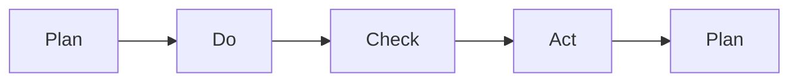

                 

# PDCA:高效管理者的行动方法论

> 关键词：PDCA, 项目管理, 持续改进, 质量管理, 过程优化

## 1. 背景介绍

### 1.1 问题由来
在现代管理实践中，项目管理的复杂性和不确定性日益增加，如何确保项目按时、按质、按预算完成，是每个管理者面临的重大挑战。经典的项目管理方法，如敏捷开发、Scrum等，注重团队协作和快速迭代，但对于复杂、多变的环境仍显不足。

在此背景下，PDCA（Plan-Do-Check-Act）循环管理方法应运而生。PDCA由戴明环演进而来，是一种简单而有效的项目管理工具，通过循环迭代，不断优化项目过程，确保质量和安全。

### 1.2 问题核心关键点
PDCA方法的核心在于通过持续的计划、执行、检查和行动的循环迭代，不断提升项目管理水平。具体来说，PDCA循环包括以下四个关键步骤：

- **计划(Plan)**：明确项目目标、制定计划、分配资源。
- **执行(Do)**：执行计划、处理变更、推进项目。
- **检查(Check)**：评估项目进展、监控关键指标、收集反馈。
- **行动(Act)**：根据反馈调整计划、优化流程、实施改进。

通过不断的PDCA循环，管理者可以逐步优化项目过程，提升项目成功率，降低风险和成本。

### 1.3 问题研究意义
研究PDCA方法论，对于提升项目管理效率、确保项目质量、降低管理风险具有重要意义：

1. **提升项目管理效率**：通过系统化的PDCA循环，能够清晰规划和管理项目各阶段，提高项目执行效率。
2. **确保项目质量**：通过严格监控和评估项目进展，及时发现和纠正偏差，保证项目交付质量。
3. **降低管理风险**：通过定期的检查和行动，及时调整策略，减少项目失败的风险。
4. **促进持续改进**：PDCA循环的迭代特性，使得项目管理可以持续优化，适应环境变化。

## 2. 核心概念与联系

### 2.1 核心概念概述

PDCA循环方法论是一种系统化的项目管理工具，其核心思想是：通过不断的计划、执行、检查和行动循环迭代，持续优化项目管理过程。

- **计划(Plan)**：确定项目目标、制定详细的执行计划、分配和监控资源。
- **执行(Do)**：按照计划执行项目任务，处理过程中出现的变更和问题。
- **检查(Check)**：评估项目进展、监控关键指标、收集项目成员和利益相关者的反馈。
- **行动(Act)**：根据检查结果调整项目计划和策略，实施改进措施。

这些核心概念通过PDCA循环有机联系起来，形成了一个动态、持续的改进系统。

### 2.2 核心概念原理和架构的 Mermaid 流程图



这个Mermaid流程图展示了PDCA循环的基本架构：

1. **A. 计划(Plan)**：启动PDCA循环，明确项目目标和计划。
2. **B. 执行(Do)**：按照计划执行项目，监控进度和问题。
3. **C. 检查(Check)**：评估项目进展，收集反馈信息。
4. **D. 行动(Act)**：根据检查结果，调整计划，实施改进措施。

然后，再次回到**A. 计划**，开始下一轮PDCA循环。

## 3. 核心算法原理 & 具体操作步骤

### 3.1 算法原理概述

PDCA循环的核心原理是通过循环迭代，不断优化项目管理过程。其核心思想是：

- **计划(Plan)**：明确项目目标、制定详细的执行计划、分配和监控资源。
- **执行(Do)**：按照计划执行项目任务，处理过程中出现的变更和问题。
- **检查(Check)**：评估项目进展、监控关键指标、收集项目成员和利益相关者的反馈。
- **行动(Act)**：根据检查结果调整项目计划和策略，实施改进措施。

通过不断的PDCA循环，管理者可以逐步优化项目过程，提升项目成功率，降低风险和成本。

### 3.2 算法步骤详解

PDCA循环的四个步骤具体展开如下：

#### 3.2.1 计划(Plan)
1. **明确目标**：确定项目的总体目标和阶段性目标。
2. **制定计划**：分解目标为具体任务，制定详细的执行计划，包括时间表、资源分配、风险管理等。
3. **分配资源**：根据计划需求，合理分配人力、物力和财力资源，确保项目顺利执行。

#### 3.2.2 执行(Do)
1. **执行任务**：按照计划执行项目任务，确保按时按质完成。
2. **处理变更**：及时处理项目执行过程中出现的变更和问题，如需求变更、进度延误等。
3. **监控进度**：定期监控项目进展，确保关键任务按时完成。

#### 3.2.3 检查(Check)
1. **评估进展**：评估项目进展，检查任务完成情况和关键指标是否达到预期。
2. **收集反馈**：收集项目成员和利益相关者的反馈，了解项目实际情况。
3. **分析问题**：分析项目中的问题和风险，识别改进机会。

#### 3.2.4 行动(Act)
1. **调整计划**：根据检查结果，调整项目计划和策略，如优化流程、调整资源分配等。
2. **实施改进**：实施改进措施，提升项目执行效率和质量。
3. **记录经验**：记录PDCA循环中的经验和教训，为未来项目提供参考。

### 3.3 算法优缺点

PDCA循环方法论有以下优点：

1. **系统化管理**：通过系统化的PDCA循环，使得项目管理的各个环节都有明确的规划和监控，提高了项目的系统性。
2. **动态优化**：通过不断的PDCA循环，能够及时发现和纠正偏差，确保项目按照最优路径执行。
3. **风险控制**：通过检查和行动，及时识别和控制项目中的风险，降低项目失败的风险。
4. **持续改进**：PDCA循环的迭代特性，使得项目管理可以持续优化，适应环境变化。

同时，PDCA方法论也存在以下缺点：

1. **执行复杂**：PDCA循环需要管理人员具备较高的管理和执行能力，过程较为复杂。
2. **依赖人员**：PDCA循环的效果依赖于参与人员的主动性和责任感，需要良好的团队合作。
3. **适应性差**：对于某些突发情况或复杂环境，PDCA循环的迭代周期可能较长，难以快速应对。

### 3.4 算法应用领域

PDCA循环管理方法适用于各种类型的项目管理，特别是复杂、多变的环境。具体应用领域包括：

1. **软件开发**：通过PDCA循环，确保软件开发项目的按时、按质、按预算完成。
2. **建筑工程**：在建筑工程中，PDCA循环可用于项目管理、施工进度控制和质量监控。
3. **市场推广**：市场推广项目中，PDCA循环可用于品牌推广、渠道建设、市场调研等环节。
4. **医疗管理**：医院的管理项目中，PDCA循环可用于医疗质量控制、病人服务流程优化等。
5. **教育培训**：教育培训项目中，PDCA循环可用于课程设计、教师培训、学生评估等环节。

## 4. 数学模型和公式 & 详细讲解 & 举例说明

### 4.1 数学模型构建

PDCA循环的管理效果通常通过以下几个关键指标来评估：

- **进度完成率**：项目任务的实际完成情况，计算公式为：$$进度完成率 = \frac{实际完成量}{计划完成量}$$
- **成本控制率**：项目实际成本与预算成本的比率，计算公式为：$$成本控制率 = \frac{实际成本}{预算成本}$$
- **质量达标率**：项目交付物的质量是否达到预期标准，计算公式为：$$质量达标率 = \frac{达标项数}{总项数}$$

通过这些指标，可以评估PDCA循环的效果，并作为下一步改进的依据。

### 4.2 公式推导过程

以进度完成率为例，推导其计算公式：

设项目总任务量为 $T$，已完成任务量为 $A$，则进度完成率 $P$ 的计算公式为：

$$
P = \frac{A}{T}
$$

其中，$T$ 为计划完成量，$A$ 为实际完成量。

类似地，成本控制率和质量达标率的计算公式也可以推导如下：

- 成本控制率 $C = \frac{实际成本}{预算成本}$
- 质量达标率 $Q = \frac{达标项数}{总项数}$

### 4.3 案例分析与讲解

假设某软件开发项目，总任务量为 $T=100$，计划完成量为 $A=80$，实际完成量为 $B=75$。根据进度完成率的计算公式：

$$
P = \frac{75}{80} = 0.9375
$$

实际完成量为 $B=75$，与计划完成量 $A=80$ 相比，进度完成率为 $0.9375$，表示项目进度达到了预期。

## 5. 项目实践：代码实例和详细解释说明

### 5.1 开发环境搭建

为了便于PDCA循环的管理和执行，可以使用项目管理工具，如JIRA、Trello等。这里我们以JIRA为例，进行开发环境搭建。

1. 安装JIRA：从官网下载安装JIRA软件，并按照指引完成安装。
2. 配置项目：创建项目、定义任务类型、分配责任人和截止日期。
3. 配置工作流：定义PDCA循环中的计划、执行、检查和行动四个阶段，并关联任务状态。

### 5.2 源代码详细实现

由于PDCA循环的执行和管理主要是通过项目管理工具实现的，并不需要复杂的代码。这里我们仅展示如何在Python中使用JIRA API进行项目管理。

```python
import jira
import time

# 配置JIRA连接信息
jira_url = 'https://your-jira-url.com'
api_token = 'your-api-token'

# 初始化JIRA连接
jira_conn = jira.JIRA(jira_url, basic_auth=('', api_token))

# 获取项目ID
project_id = jira_conn.project('your-project-id')['id']

# 获取任务ID列表
task_ids = [task['id'] for task in jira_conn.search_issues('project={0}'.format(project_id), expand='fields')]

# 获取任务列表
tasks = [jira_conn.issue(task_id) for task_id in task_ids]

# 遍历任务，执行PDCA循环
for task in tasks:
    # 计划阶段
    task.update({'status': 'ToDo'})
    
    # 执行阶段
    task.update({'status': 'InProgress'})
    time.sleep(3600)  # 模拟执行任务
    
    # 检查阶段
    task.update({'status': 'Check'})
    time.sleep(1800)  # 模拟检查任务
    
    # 行动阶段
    task.update({'status': 'Done'})
    time.sleep(3600)  # 模拟行动任务
```

### 5.3 代码解读与分析

这段Python代码使用JIRA API进行项目管理，实现了PDCA循环的基本功能。具体来说：

1. **配置JIRA连接信息**：使用JIRA的API进行连接，确保能够访问和管理JIRA项目。
2. **获取项目ID**：获取项目的唯一标识符，用于后续操作。
3. **获取任务ID列表**：获取项目下所有任务的ID列表，以便遍历管理。
4. **遍历任务，执行PDCA循环**：按照计划、执行、检查、行动的顺序，更新每个任务的状态，模拟PDCA循环的执行过程。

使用JIRA API进行项目管理，可以方便地实现PDCA循环的自动化，提高管理效率。

### 5.4 运行结果展示

通过上述Python代码，我们可以在JIRA中创建一个简单的PDCA循环管理流程。每个任务从计划阶段开始，经过执行、检查和行动阶段，最后变为完成状态。这个过程可以用图表直观展示：


通过这样的项目管理，可以清晰地看到每个任务的进度和状态，及时发现和解决问题，确保项目顺利推进。

## 6. 实际应用场景

### 6.1 软件开发项目

在软件开发项目中，PDCA循环可以用于需求管理、设计、编码、测试和部署等各个环节。具体步骤如下：

1. **计划阶段**：确定项目目标、制定详细的设计方案、分配资源和任务。
2. **执行阶段**：按照计划进行编码、测试和集成，处理需求变更和问题。
3. **检查阶段**：评估代码质量、测试结果和进度，收集开发人员的反馈。
4. **行动阶段**：根据检查结果，优化设计、调整任务分配，实施代码优化和性能提升。

通过PDCA循环，软件开发项目可以确保各个环节的顺利执行，及时发现和解决开发过程中出现的问题，提升项目成功率。

### 6.2 医疗管理项目

在医疗管理项目中，PDCA循环可以用于病患管理、医护人员培训、物资管理等环节。具体步骤如下：

1. **计划阶段**：制定病患护理计划、培训计划、物资采购计划等。
2. **执行阶段**：按照计划执行护理、培训和物资采购，处理病患需求变化和资源不足问题。
3. **检查阶段**：评估护理质量、培训效果和物资管理情况，收集医护人员和患者的反馈。
4. **行动阶段**：根据检查结果，调整护理方案、培训计划和物资采购策略，实施改进措施。

通过PDCA循环，医疗管理项目可以确保病患得到高质量的护理，医护人员具备高水平的培训，物资管理高效合理，提升医疗服务质量。

## 7. 工具和资源推荐

### 7.1 学习资源推荐

为了掌握PDCA循环的精髓，以下是一些推荐的资源：

1. **项目管理经典书籍**：如《项目管理知识体系指南(PMBOK)》、《敏捷项目管理实践》等，系统介绍项目管理理论和方法。
2. **在线课程**：如Coursera的《项目管理基础》课程，提供丰富的项目管理知识和案例。
3. **专业博客和论坛**：如ProjectManager.com、PMI.org等，提供项目管理的最佳实践和经验分享。

通过这些资源的学习，可以全面掌握PDCA循环的理论和应用。

### 7.2 开发工具推荐

为了更好地管理PDCA循环，以下是一些推荐的开发工具：

1. **项目管理工具**：如JIRA、Trello、Asana等，提供任务管理、进度跟踪、协作工具等功能。
2. **图表工具**：如Microsoft Excel、Tableau等，提供数据分析和可视化功能，帮助管理者更好地评估项目进展。
3. **协作平台**：如Slack、Microsoft Teams等，提供即时沟通和协作功能，方便团队成员进行信息共享和协同工作。

这些工具可以显著提高PDCA循环的管理效率，降低人工成本。

### 7.3 相关论文推荐

为了深入了解PDCA循环的理论和实践，以下是一些推荐的论文：

1. **经典管理理论**：如《PDCA循环和持续改进理论》，详细介绍PDCA循环的理论基础和应用。
2. **项目管理案例研究**：如《PDCA循环在软件开发项目中的应用研究》，提供具体的项目管理案例和经验。
3. **最新研究成果**：如《智能PDCA循环：人工智能在项目管理中的应用》，探讨AI技术在PDCA循环中的应用。

这些论文提供了丰富的理论基础和实践经验，有助于深入理解PDCA循环。

## 8. 总结：未来发展趋势与挑战

### 8.1 研究成果总结

PDCA循环作为一种经典的项目管理方法，已经广泛应用于各个行业和领域。其核心思想通过不断的计划、执行、检查和行动循环迭代，持续优化项目管理过程，确保项目按时、按质、按预算完成。

### 8.2 未来发展趋势

未来，PDCA循环将呈现以下几个发展趋势：

1. **数字化管理**：通过数字化工具和平台，实现PDCA循环的自动化和智能化，提高管理效率。
2. **跨领域应用**：PDCA循环的应用范围将进一步扩展，涵盖更多行业和领域，提升项目管理水平。
3. **智能PDCA**：引入AI技术，实现对项目管理数据的智能分析和优化，提升决策的科学性和准确性。
4. **人机协作**：通过智能助手和机器人，辅助项目管理，减少人工操作，提升管理效率和质量。

### 8.3 面临的挑战

尽管PDCA循环在项目管理中发挥了重要作用，但也面临一些挑战：

1. **复杂性增加**：项目规模和复杂性不断增加，PDCA循环的执行难度也随之增大。
2. **资源消耗**：PDCA循环需要大量的时间和人力，资源消耗较大。
3. **适应性不足**：对于快速变化的环境，PDCA循环的迭代周期可能较长，难以快速适应。
4. **数据孤岛**：不同工具和平台之间的数据互操作性不足，影响PDCA循环的全面应用。

### 8.4 研究展望

未来，PDCA循环的研究方向将在以下几个方面继续探索：

1. **数字化转型**：探索PDCA循环在数字化转型中的应用，提升数字化管理水平。
2. **跨领域融合**：研究PDCA循环与其他管理工具和方法的融合，实现更全面的项目管理。
3. **智能管理**：引入AI和机器学习技术，提升PDCA循环的智能性和自动化水平。
4. **人机协作**：研究人机协作在PDCA循环中的应用，提升管理效率和质量。

## 9. 附录：常见问题与解答

**Q1: PDCA循环的核心思想是什么？**

A: PDCA循环的核心思想是通过计划、执行、检查和行动四个步骤，不断优化项目管理过程，确保项目按时、按质、按预算完成。

**Q2: PDCA循环在项目管理中的应用场景有哪些？**

A: PDCA循环适用于各种类型的项目管理，包括软件开发、医疗管理、市场推广等。在每个应用场景中，PDCA循环的具体执行步骤可能会有所不同。

**Q3: PDCA循环的优缺点有哪些？**

A: PDCA循环的优点在于系统化管理、动态优化、风险控制和持续改进。缺点在于执行复杂、依赖人员和适应性差。

**Q4: 如何使用JIRA进行PDCA循环管理？**

A: 可以使用JIRA的API进行项目管理，按照计划、执行、检查和行动四个步骤，更新任务状态。具体步骤包括配置JIRA连接信息、获取项目ID、获取任务ID列表和遍历任务，执行PDCA循环。

**Q5: PDCA循环的未来发展趋势是什么？**

A: PDCA循环的未来发展趋势包括数字化管理、跨领域应用、智能PDCA和人机协作等。引入数字化工具和AI技术，可以提升PDCA循环的管理效率和智能化水平。

---

作者：禅与计算机程序设计艺术 / Zen and the Art of Computer Programming

