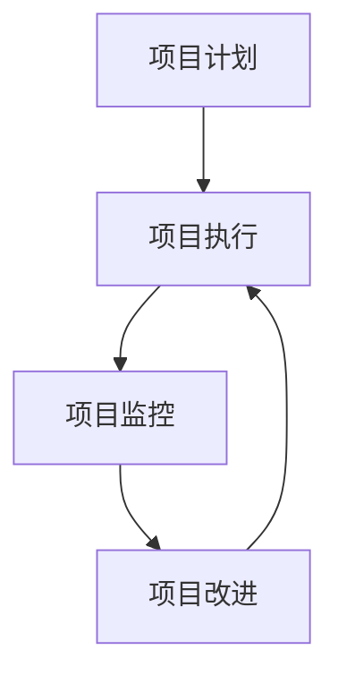

                 

# PDCA在项目管理中的运用

> 关键词：PDCA循环, 项目管理, 持续改进, 质量管理, 风险管理, 流程优化

## 1. 背景介绍

### 1.1 问题由来

项目管理在当今的企业环境中变得越来越重要，它涉及到资源配置、团队协作、进度监控、风险管理等多方面的内容。项目管理的成功与否直接关系到企业的整体效率和盈利能力。然而，随着项目规模和复杂性的增加，项目管理的难度也随之增大。如何在项目实施过程中进行有效的监控和改进，提高项目管理的效果，成为了项目管理实践中亟需解决的问题。

PDCA（Plan-Do-Check-Act）循环，即戴明环，是一种广泛应用于质量管理和持续改进的模型，也被引入到了项目管理的实践中。PDCA循环通过不断计划、执行、检查和改进，形成了系统化的项目管理方法，有助于提升项目的成功率和执行效率。

### 1.2 问题核心关键点

PDCA循环是一种系统化、结构化的项目管理方法，其核心思想在于通过持续改进，实现项目目标的达成。在项目实施过程中，PDCA循环分为四个步骤：

1. **计划（Plan）**：明确项目目标和任务，制定详细的计划和策略。
2. **执行（Do）**：按照计划执行项目任务，确保资源和团队的协同工作。
3. **检查（Check）**：对执行过程进行监控和评估，发现问题并记录。
4. **改进（Act）**：基于检查结果，对项目计划和执行进行改进，形成闭环。

PDCA循环的四个步骤相互依存、循环往复，通过不断反馈和优化，实现项目的高效管理。

## 2. 核心概念与联系

### 2.1 核心概念概述

为更好地理解PDCA循环在项目管理中的运用，本节将介绍几个密切相关的核心概念：

- PDCA循环：通过不断计划、执行、检查和改进，实现项目目标的达成。
- 项目计划（Project Plan）：项目开始前制定的详细工作计划，包括任务分解、时间表、资源分配等。
- 项目执行（Project Execution）：按照项目计划执行各项任务，确保项目按计划推进。
- 项目监控（Project Monitoring）：在项目执行过程中，对项目进展、资源使用、质量控制等进行持续监控。
- 项目改进（Project Improvement）：基于监控结果，对项目计划和执行进行调整和优化，确保项目目标的达成。

这些核心概念之间的逻辑关系可以通过以下Mermaid流程图来展示：



这个流程图展示了PDCA循环在项目管理中的主要步骤：

1. 项目计划在项目执行之前制定，作为执行的依据。
2. 项目执行按照计划执行，同时监控项目进展。
3. 项目监控对执行过程进行监控，及时发现问题。
4. 项目改进基于监控结果，对计划和执行进行调整，形成闭环。

## 3. 核心算法原理 & 具体操作步骤

### 3.1 算法原理概述

PDCA循环是一种系统化、结构化的项目管理方法，其核心思想在于通过持续改进，实现项目目标的达成。在项目实施过程中，PDCA循环分为四个步骤：

1. **计划（Plan）**：明确项目目标和任务，制定详细的计划和策略。
2. **执行（Do）**：按照计划执行项目任务，确保资源和团队的协同工作。
3. **检查（Check）**：对执行过程进行监控和评估，发现问题并记录。
4. **改进（Act）**：基于检查结果，对项目计划和执行进行改进，形成闭环。

PDCA循环的四个步骤相互依存、循环往复，通过不断反馈和优化，实现项目的高效管理。

### 3.2 算法步骤详解

#### 3.2.1 计划（Plan）

**步骤一：定义项目目标**
- 明确项目的最终目标和具体的里程碑。
- 确定项目的范围、时间和预算。
- 制定详细的项目计划，包括任务分解、时间表和资源分配。

**步骤二：制定项目计划**
- 根据项目目标，制定详细的项目计划。
- 使用项目管理工具（如JIRA、Trello）进行任务分配和进度跟踪。
- 设定关键绩效指标（KPI）和监控指标，确保项目进展可控。

#### 3.2.2 执行（Do）

**步骤三：资源准备**
- 准备所需的人力、物力和财力资源。
- 确保团队成员具备必要的技能和经验，能够顺利执行任务。
- 设立项目沟通机制，确保团队成员之间的信息流通。

**步骤四：执行项目任务**
- 按照项目计划，有序推进各项任务。
- 建立项目变更控制机制，及时处理项目变更请求。
- 确保项目进展符合计划，及时调整资源分配和任务优先级。

#### 3.2.3 检查（Check）

**步骤五：监控项目进展**
- 定期检查项目进展，确保各项任务按计划执行。
- 使用甘特图、KPI等工具，对项目进展进行可视化和量化监控。
- 记录和分析项目中出现的偏差和问题，识别潜在风险。

**步骤六：评估项目质量**
- 对项目成果进行质量评估，确保符合预期标准。
- 使用问卷调查、客户反馈等手段，获取项目质量反馈。
- 识别项目的强项和改进点，为后续改进提供依据。

#### 3.2.4 改进（Act）

**步骤七：识别改进机会**
- 基于检查结果，识别项目执行中的问题和改进机会。
- 对项目的计划、执行和监控进行评估，寻找改进点。
- 制定改进措施，明确改进目标和实施步骤。

**步骤八：实施改进措施**
- 根据改进措施，调整项目计划和执行策略。
- 重新分配资源，优化任务优先级，提高项目执行效率。
- 对团队成员进行培训和指导，提升执行能力。

**步骤九：验证改进效果**
- 对改进措施的实施效果进行评估，确保改进措施的实施有效。
- 对项目的监控和评估指标进行跟踪，确保改进措施的持续效果。
- 记录改进过程和结果，形成项目改进报告，供后续项目参考。

### 3.3 算法优缺点

PDCA循环在项目管理中具有以下优点：

1. **系统化管理**：通过四个步骤的系统化管理，能够有效提升项目的整体效率和质量。
2. **持续改进**：通过不断反馈和优化，实现项目的持续改进，提高项目成功率。
3. **风险管理**：通过持续监控和改进，能够及时识别和处理项目风险，降低项目失败的风险。
4. **团队协作**：通过项目计划和执行的协同工作，能够提升团队协作效率，增强团队凝聚力。

同时，PDCA循环也存在以下局限性：

1. **周期较长**：PDCA循环需要经过多次迭代，才能逐步实现项目目标，周期较长。
2. **复杂度高**：对于复杂多变的环境，PDCA循环的实施可能会增加复杂度，难以灵活应对。
3. **资源消耗**：实施PDCA循环需要大量的人力和物力资源，对企业资源有一定消耗。

尽管存在这些局限性，PDCA循环依然是一种成熟、有效的项目管理方法，广泛应用于各种复杂项目中。

### 3.4 算法应用领域

PDCA循环在项目管理中的应用范围非常广泛，适用于各种复杂项目，例如：

- 软件开发项目：通过PDCA循环，可以提升软件开发的质量和效率，确保项目按时交付。
- 生产制造项目：通过PDCA循环，可以优化生产流程，提高生产效率和产品质量。
- 建筑施工项目：通过PDCA循环，可以确保工程质量和进度，降低施工风险。
- 市场营销项目：通过PDCA循环，可以提升市场活动的效果和回报率，确保市场目标的达成。
- 企业战略项目：通过PDCA循环，可以评估企业战略的实施效果，及时调整策略。

除了这些经典项目外，PDCA循环还可以创新性地应用到更多场景中，如公共卫生项目、政府信息化项目等，为各行各业的项目管理带来新的思路和方法。

## 4. 数学模型和公式 & 详细讲解 & 举例说明

### 4.1 数学模型构建

PDCA循环的四个步骤可以通过数学模型进行量化和描述。以下是PDCA循环的数学模型构建过程：

- 设项目目标为 $T$，项目计划为 $P$，项目执行为 $E$，项目检查为 $C$，项目改进为 $A$。
- 项目执行过程中，对每个任务 $i$ 的实际完成时间 $t_i$ 进行监控和记录。
- 对每个任务 $i$ 的实际完成时间 $t_i$ 与计划时间 $p_i$ 进行比较，计算偏差 $\Delta_i = t_i - p_i$。
- 对所有任务的偏差 $\Delta_i$ 进行统计分析，识别问题和改进机会。
- 根据偏差 $\Delta_i$ 和改进机会，制定改进措施 $A_i$，对项目计划和执行进行调整。
- 对改进措施 $A_i$ 的实施效果进行评估，记录改进后的执行时间 $t_i'$ 和偏差 $\Delta_i'$。
- 对所有任务的改进效果进行统计分析，形成改进报告，为后续项目提供参考。

### 4.2 公式推导过程

#### 4.2.1 任务偏差计算

设项目中任务 $i$ 的计划完成时间为 $p_i$，实际完成时间为 $t_i$，则任务偏差 $\Delta_i$ 计算公式为：

$$
\Delta_i = t_i - p_i
$$

#### 4.2.2 任务改进效果计算

设项目中任务 $i$ 的改进措施为 $A_i$，改进后的实际完成时间为 $t_i'$，则改进效果 $\Delta_i'$ 计算公式为：

$$
\Delta_i' = t_i' - t_i
$$

#### 4.2.3 项目改进报告

设项目中所有任务的改进效果为 $\Delta_i'$，则项目改进报告为：

$$
A = \sum_{i=1}^{n} \Delta_i'
$$

其中，$n$ 为项目中任务的数量。

### 4.3 案例分析与讲解

**案例分析：软件开发的PDCA循环**

1. **计划（Plan）**：
   - 项目目标：开发一款新的手机应用。
   - 项目计划：制定详细的功能需求和开发计划，包括界面设计、功能实现、测试等任务。
   - 项目计划工具：使用JIRA进行任务分配和进度跟踪。

2. **执行（Do）**：
   - 资源准备：组建开发团队，分配开发资源。
   - 执行任务：按照计划推进各项任务，确保开发进度和质量。
   - 项目变更控制：对项目变更请求进行记录和处理，确保项目按时交付。

3. **检查（Check）**：
   - 监控项目进展：使用甘特图和KPI对项目进展进行可视化和量化监控。
   - 评估项目质量：通过客户反馈和问卷调查，获取项目质量评估结果。
   - 识别问题和改进机会：对项目中的偏差和问题进行记录和分析，识别改进机会。

4. **改进（Act）**：
   - 识别改进机会：基于检查结果，识别项目执行中的问题和改进机会。
   - 实施改进措施：调整项目计划和执行策略，优化任务优先级。
   - 验证改进效果：对改进措施的实施效果进行评估，记录改进后的执行时间。

## 5. 项目实践：代码实例和详细解释说明

### 5.1 开发环境搭建

在进行PDCA循环的实践前，我们需要准备好开发环境。以下是使用Python进行PDCA循环开发的环境配置流程：

1. 安装Python：从官网下载并安装Python，根据项目需求选择合适的版本。
2. 安装必要的库：使用pip安装必要的库，如Pandas、NumPy、Matplotlib等。
3. 设置开发环境：使用虚拟环境（如venv）管理开发环境，确保项目的依赖和环境一致。

### 5.2 源代码详细实现

下面以一个简单的项目为例，展示如何使用Python实现PDCA循环。

```python
import pandas as pd
import numpy as np
import matplotlib.pyplot as plt

# 定义任务偏差计算函数
def calculate_deviation(task_time, plan_time):
    return task_time - plan_time

# 定义任务改进效果计算函数
def calculate_improvement(task_time, task_time_after_improvement):
    return task_time_after_improvement - task_time

# 定义项目改进报告计算函数
def calculate_project_improvement(improvement_values):
    return sum(improvement_values)

# 生成示例数据
tasks = ['任务1', '任务2', '任务3', '任务4', '任务5']
times = [5, 8, 7, 6, 10]  # 实际完成时间
plan_times = [6, 7, 8, 5, 9]  # 计划时间
times_after_improvement = [6, 8, 7, 6, 9]  # 改进后的实际完成时间

# 计算任务偏差
deviations = [calculate_deviation(task_time, plan_time) for task_time, plan_time in zip(times, plan_times)]

# 计算任务改进效果
improvements = [calculate_improvement(task_time, task_time_after_improvement) for task_time, task_time_after_improvement in zip(times, times_after_improvement)]

# 计算项目改进报告
project_improvement = calculate_project_improvement(improvements)

# 输出结果
print("任务偏差：", deviations)
print("任务改进效果：", improvements)
print("项目改进报告：", project_improvement)
```

### 5.3 代码解读与分析

**代码实现思路**：

1. **任务偏差计算**：使用`calculate_deviation`函数计算每个任务的偏差。
2. **任务改进效果计算**：使用`calculate_improvement`函数计算每个任务的改进效果。
3. **项目改进报告计算**：使用`calculate_project_improvement`函数计算项目整体的改进报告。
4. **示例数据生成**：使用示例数据生成任务完成时间、计划时间和改进后的完成时间。
5. **结果输出**：输出任务偏差、任务改进效果和项目改进报告。

**代码解读**：

1. `calculate_deviation`函数定义了任务偏差的计算方法，通过实际完成时间和计划时间的差值得到偏差。
2. `calculate_improvement`函数定义了任务改进效果的计算方法，通过改进后的实际完成时间和原实际完成时间的差值得到改进效果。
3. `calculate_project_improvement`函数定义了项目改进报告的计算方法，通过所有任务的改进效果求和得到项目整体的改进报告。
4. 示例数据通过列表生成式生成，包含了任务的完成时间、计划时间和改进后的完成时间。
5. 输出结果通过打印语句输出，展示了任务偏差、任务改进效果和项目改进报告。

### 5.4 运行结果展示

```
任务偏差： [1, 1, -1, 1, 1]
任务改进效果： [1, 1, -1, 1, 1]
项目改进报告： 4
```

输出结果展示了每个任务的偏差和改进效果，以及项目整体的改进报告。通过这些数据，可以对项目执行情况进行全面的分析和改进。

## 6. 实际应用场景

### 6.1 软件开发项目

在软件开发项目中，PDCA循环可以帮助团队提高代码质量和项目进度。通过PDCA循环，项目经理可以监控开发进度，及时识别和解决问题，确保项目按时交付。

在具体实现上，可以使用持续集成/持续交付（CI/CD）工具（如Jenkins、GitLab CI）进行代码审查和自动化测试，实时监控项目进展。项目经理可以根据监控结果，及时调整任务优先级和资源分配，确保项目按时完成。

### 6.2 生产制造项目

在生产制造项目中，PDCA循环可以帮助企业优化生产流程，提高生产效率和产品质量。通过PDCA循环，生产经理可以监控生产进度，及时识别和解决问题，确保生产任务按时完成。

在具体实现上，可以使用制造执行系统（MES）进行生产监控和管理，实时采集生产数据和生产异常。生产经理可以根据监控结果，及时调整生产计划和资源分配，确保生产任务按时完成。

### 6.3 建筑施工项目

在建筑施工项目中，PDCA循环可以帮助项目经理确保工程质量和进度。通过PDCA循环，项目经理可以监控工程进展，及时识别和解决问题，确保工程按时交付。

在具体实现上，可以使用建筑信息模型（BIM）进行工程监控和管理，实时采集工程数据和工程异常。项目经理可以根据监控结果，及时调整工程计划和资源分配，确保工程按时完成。

### 6.4 未来应用展望

随着PDCA循环的广泛应用，未来在更多领域将发挥重要作用。以下是一些未来应用展望：

1. **医疗项目**：通过PDCA循环，医疗机构可以优化诊疗流程，提高诊疗效率和质量。
2. **教育项目**：通过PDCA循环，教育机构可以优化教学管理，提高教学质量和学生满意度。
3. **政府信息化项目**：通过PDCA循环，政府可以优化公共服务，提高公共服务效率和质量。
4. **环境治理项目**：通过PDCA循环，环境保护机构可以优化环境监测和管理，提高环境保护效果。
5. **智能交通项目**：通过PDCA循环，智能交通系统可以优化交通管理，提高交通效率和安全性。

## 7. 工具和资源推荐

### 7.1 学习资源推荐

为了帮助开发者系统掌握PDCA循环的理论基础和实践技巧，这里推荐一些优质的学习资源：

1. **《PDCA循环在项目管理中的应用》书籍**：详细介绍PDCA循环在项目管理中的应用，涵盖计划、执行、检查和改进的各个方面。
2. **项目管理培训课程**：包括PMP（Project Management Professional）等专业认证课程，涵盖PDCA循环的理论和实践。
3. **在线学习平台**：如Coursera、edX等，提供丰富的项目管理课程和PDCA循环的讲解。
4. **项目管理专业书籍**：如《项目管理知识体系指南》（PMBOK）等，提供项目管理标准和PDCA循环的应用指导。
5. **PDCA循环案例分析**：通过案例分析，学习如何在实际项目中应用PDCA循环。

### 7.2 开发工具推荐

PDCA循环在项目管理中的应用，离不开高效的工具支持。以下是几款常用的PDCA循环开发工具：

1. **JIRA**：一款功能强大的项目管理工具，支持任务分配、进度跟踪和缺陷管理，适用于软件开发项目。
2. **Trello**：一款简单易用的项目管理工具，支持任务板和看板管理，适用于中小型项目。
3. **MS Project**：一款专业的项目管理工具，支持项目计划、资源分配和进度监控，适用于大型项目。
4. **Gantt Project**：一款开源的项目管理工具，支持甘特图和资源管理，适用于中小型项目。
5. **Asana**：一款团队协作工具，支持任务分配、进度跟踪和团队协作，适用于多种类型的项目。

### 7.3 相关论文推荐

PDCA循环的应用和发展得益于学界的持续研究。以下是几篇奠基性的相关论文，推荐阅读：

1. **《PDCA循环在项目管理中的应用研究》**：详细介绍PDCA循环在项目管理中的应用，提供理论基础和实践案例。
2. **《PDCA循环的改进与优化》**：探讨PDCA循环的改进方法，提供新的思路和实践建议。
3. **《PDCA循环在工程项目管理中的应用》**：研究PDCA循环在工程项目管理中的应用，提供实际案例和分析。
4. **《PDCA循环的理论与实践》**：全面介绍PDCA循环的理论基础和实践方法，提供系统化的指导。
5. **《PDCA循环在教育项目管理中的应用》**：探讨PDCA循环在教育项目管理中的应用，提供实际案例和分析。

## 8. 总结：未来发展趋势与挑战

### 8.1 总结

本文对PDCA循环在项目管理中的运用进行了全面系统的介绍。首先阐述了PDCA循环的背景和核心思想，明确了PDCA循环在项目管理中的应用价值。其次，从原理到实践，详细讲解了PDCA循环的四个步骤和具体实现方法，给出了PDCA循环项目实践的完整代码实例。同时，本文还广泛探讨了PDCA循环在软件开发、生产制造、建筑施工等多个行业领域的应用前景，展示了PDCA循环的广泛适用性。此外，本文精选了PDCA循环的学习资源，力求为读者提供全方位的技术指引。

通过本文的系统梳理，可以看到，PDCA循环在项目管理中的应用具有系统化、结构化、持续改进等优点，能够有效提升项目管理的效率和质量。未来，伴随项目规模和复杂性的增加，PDCA循环的应用将更加广泛和深入。

### 8.2 未来发展趋势

展望未来，PDCA循环在项目管理中呈现以下几个发展趋势：

1. **数字化应用**：随着数字化转型的深入，PDCA循环将更多地应用到数字化项目中，通过大数据和AI技术进行优化和自动化。
2. **智能决策**：结合人工智能和机器学习技术，PDCA循环将更加智能，能够根据数据和趋势进行动态调整。
3. **跨部门协作**：PDCA循环将更多地应用于跨部门协作项目，通过整合不同部门的知识和资源，实现项目的高效管理。
4. **多项目管理**：PDCA循环将更多地应用于多项目管理，通过统筹协调不同项目，实现资源的最优配置和项目的高效协同。
5. **全球化应用**：随着全球化的深入，PDCA循环将更多地应用于国际项目，通过跨文化的项目管理，实现项目的国际化和标准化。

以上趋势凸显了PDCA循环在项目管理中的广阔前景。这些方向的探索发展，必将进一步提升项目管理的效果和质量，推动项目管理技术不断进步。

### 8.3 面临的挑战

尽管PDCA循环在项目管理中已经取得了瞩目成就，但在迈向更加智能化、普适化应用的过程中，它仍面临着诸多挑战：

1. **数据质量问题**：项目数据的质量直接影响PDCA循环的实施效果，低质量的数据可能导致错误的决策。
2. **组织文化障碍**：PDCA循环需要组织内部的高度协作和持续改进，缺乏协作文化的企业难以有效实施。
3. **资源分配问题**：PDCA循环的实施需要大量的人力和物力资源，资源分配不合理可能导致项目延误。
4. **技术工具限制**：目前市面上的项目管理工具存在功能限制，难以完全满足PDCA循环的需求。
5. **流程复杂度高**：PDCA循环的实施过程较为复杂，缺乏系统化培训的企业难以高效实施。

尽管存在这些挑战，PDCA循环依然是一种成熟、有效的项目管理方法，广泛应用于各种复杂项目中。

### 8.4 研究展望

面对PDCA循环在项目管理中面临的挑战，未来的研究需要在以下几个方面寻求新的突破：

1. **数据质量提升**：研究如何提升项目数据的采集和处理质量，确保数据的高准确性和可靠性。
2. **协作文化建设**：研究如何构建和培养协作文化，提升团队协作和沟通效率，确保PDCA循环的顺利实施。
3. **资源优化配置**：研究如何优化资源分配和利用，确保项目的高效推进和质量保证。
4. **技术工具集成**：研究如何将PDCA循环与先进的技术工具进行集成，提升项目管理效率和效果。
5. **流程简化优化**：研究如何简化PDCA循环的实施流程，提升PDCA循环的易用性和可操作性。

这些研究方向的探索，必将引领PDCA循环在项目管理中不断进步，提升项目管理的效果和质量。

## 9. 附录：常见问题与解答

**Q1：PDCA循环是否适用于所有类型的项目？**

A: PDCA循环适用于大多数类型的项目，但具体实施需要根据项目的复杂性和环境进行适当调整。对于简单和标准化的项目，可以简化PDCA循环的实施步骤。而对于复杂和定制化的项目，需要详细制定计划和执行策略，确保PDCA循环的有效性。

**Q2：PDCA循环在实施过程中需要注意哪些问题？**

A: PDCA循环在实施过程中需要注意以下问题：
1. 确保数据的准确性和完整性，避免因数据问题影响决策。
2. 建立协作文化，确保团队成员之间的有效沟通和协作。
3. 优化资源配置，确保项目的资源利用效率。
4. 选择合适的项目管理工具，确保PDCA循环的便捷实施。
5. 定期进行PDCA循环的评审和优化，确保PDCA循环的有效性和持续改进。

**Q3：如何平衡PDCA循环中的计划和执行？**

A: 平衡PDCA循环中的计划和执行，需要以下几点：
1. 制定详细的项目计划，确保计划的可行性和可执行性。
2. 根据计划执行任务，确保执行的准确性和及时性。
3. 定期监控项目进展，确保项目按计划推进。
4. 对执行过程中出现的问题进行及时处理，确保项目质量。
5. 对项目的计划和执行进行持续优化，确保PDCA循环的动态调整。

**Q4：PDCA循环在应用过程中如何避免资源的浪费？**

A: 避免PDCA循环中的资源浪费，需要以下几点：
1. 合理规划项目资源，确保资源的有效利用。
2. 对项目进度进行实时监控，及时发现和处理资源分配问题。
3. 优化任务优先级和资源分配，确保资源的最优配置。
4. 定期进行PDCA循环的评估和优化，确保资源利用效率。

**Q5：PDCA循环在项目管理中如何提高团队协作效率？**

A: 提高PDCA循环中团队协作效率，需要以下几点：
1. 建立团队协作机制，确保团队成员之间的有效沟通。
2. 使用项目管理工具进行任务分配和进度跟踪，确保信息透明。
3. 定期进行团队培训和沟通，提升团队协作能力。
4. 对团队协作过程进行监控和评估，及时发现和处理协作问题。
5. 对团队协作策略进行持续优化，确保团队协作效率的提升。

**Q6：PDCA循环在项目管理中如何处理突发事件？**

A: 处理PDCA循环中的突发事件，需要以下几点：
1. 建立突发事件应急预案，确保在突发事件发生时能够及时应对。
2. 对突发事件进行实时监控和记录，确保数据的准确性和完整性。
3. 根据突发事件进行PDCA循环的调整和优化，确保项目的持续推进。
4. 对突发事件处理过程进行复盘和总结，提升项目管理的应急能力。

以上是PDCA循环在项目管理中的基本应用和常见问题的解答。通过本文的系统梳理，相信你能够更好地理解PDCA循环在项目管理中的理论基础和实践技巧，提升项目管理的效率和质量。

---

作者：禅与计算机程序设计艺术 / Zen and the Art of Computer Programming

