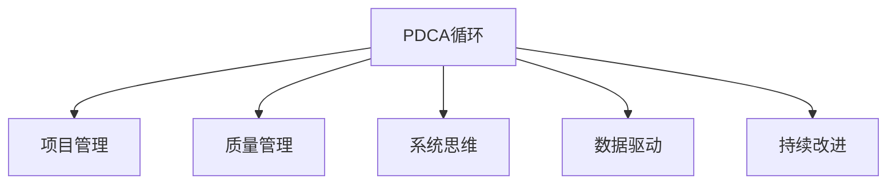

                 

# PDCA循环:管理者落地执行的方法论

> 关键词：PDCA循环,落地执行,项目管理,迭代改进,质量管理,系统思维,方法论

## 1. 背景介绍

### 1.1 问题由来

在快速变化的商业环境中，管理者面临的挑战日益复杂多变。如何有效应对这些挑战，将战略目标转化为实际的业务成果，是管理者亟需解决的问题。传统的管理方法，如KPI考核、目标分解等，虽然能够从宏观层面把控方向，但往往难以细化到具体执行层面，导致决策与执行脱节，影响整体绩效。

PDCA循环（Plan-Do-Check-Act循环）是一种系统化、科学化的管理方法，通过不断循环迭代，逐步将战略目标转化为具体行动，不断优化执行过程，提升管理效率和成果质量。本节将详细介绍PDCA循环的基本原理和实施步骤，帮助管理者更好地将战略目标落地执行。

### 1.2 问题核心关键点

PDCA循环的核心理念是“计划(Plan)-执行(Do)-检查(Check)-改进(Act)”的迭代过程。具体来说：

1. **计划(Plan)**：明确目标和方案，制定详细的执行计划。
2. **执行(Do)**：根据计划开展具体行动，实施操作。
3. **检查(Check)**：对执行结果进行评估和检查，发现问题。
4. **改进(Act)**：基于检查结果，调整和改进计划，进入下一轮循环。

PDCA循环强调系统化、科学化的思维方式，通过持续的反馈和改进，实现组织的持续进步和优化。

### 1.3 问题研究意义

PDCA循环能够帮助管理者系统化地应对管理挑战，提升执行效率和绩效水平。具体来说：

1. **系统化思维**：通过PDCA循环，管理者能够将复杂的管理问题分解为可控的子问题，形成系统化的解决方案。
2. **迭代优化**：PDCA循环的迭代机制能够持续改进执行过程，减少错误和浪费，提升整体管理效率。
3. **透明度提升**：PDCA循环强调过程和结果的透明化，便于跟踪和反馈，提升管理透明度。
4. **适应变化**：PDCA循环的灵活性和动态调整机制，使其能够适应环境变化，及时调整执行策略。

因此，PDCA循环成为现代管理的重要工具，广泛应用于项目管理、质量管理、流程优化等领域。

## 2. 核心概念与联系

### 2.1 核心概念概述

为更好地理解PDCA循环的原理和应用，本节将介绍几个密切相关的核心概念：

- **PDCA循环**：通过计划(Plan)-执行(Do)-检查(Check)-改进(Act)四个阶段的迭代过程，实现目标的逐步实现和优化。
- **项目管理(PM)**：旨在按照既定的时间、成本、质量等目标，将项目从启动到完成的全过程进行科学管理。
- **质量管理(QM)**：通过持续改进，确保产品或服务满足客户需求和标准，提升整体质量水平。
- **系统思维**：强调从整体和系统视角出发，分析和解决问题，追求全局最优。
- **数据驱动**：基于数据分析和证据，进行决策和调整，避免主观臆断。
- **持续改进**：通过不断的迭代优化，提升系统效率和质量。

这些核心概念之间的逻辑关系可以通过以下Mermaid流程图来展示：



这个流程图展示PDCA循环与其他核心概念的关系：

1. PDCA循环是项目管理、质量管理、系统思维、数据驱动和持续改进的基础工具。
2. 项目管理通过PDCA循环，实现具体项目的计划、执行、检查和改进。
3. 质量管理通过PDCA循环，持续改进产品和服务的质量，满足客户需求。
4. 系统思维通过PDCA循环，从整体视角分析和解决问题，追求全局最优。
5. 数据驱动通过PDCA循环，基于数据和证据进行决策，避免主观臆断。
6. 持续改进通过PDCA循环，实现管理的持续优化和提升。

这些概念共同构成了PDCA循环的管理框架，使其能够应用于各种管理场景。

## 3. 核心算法原理 & 具体操作步骤
### 3.1 算法原理概述

PDCA循环的核心思想是通过不断的“计划-执行-检查-改进”四个阶段的迭代过程，实现目标的逐步实现和优化。其原理可以简单概括为：

1. **计划(Plan)**：明确目标和方案，制定详细的执行计划。
2. **执行(Do)**：根据计划开展具体行动，实施操作。
3. **检查(Check)**：对执行结果进行评估和检查，发现问题。
4. **改进(Act)**：基于检查结果，调整和改进计划，进入下一轮循环。

PDCA循环是一个动态的、迭代的过程，通过不断循环，逐步提升管理效率和绩效水平。

### 3.2 算法步骤详解

PDCA循环的实施步骤如下：

**Step 1: 确定目标和计划**

1. **目标设定**：明确具体、可衡量、可实现、相关性强、有时间限制的目标。
2. **方案制定**：制定详细的执行计划，包括任务分解、资源配置、时间安排等。
3. **资源准备**：准备所需的工具、技术和人力资源，确保执行顺利进行。

**Step 2: 执行具体行动**

1. **任务分配**：将计划任务分配到各个团队或个人，明确职责和工作内容。
2. **执行操作**：按照计划开展具体行动，实施操作。
3. **过程监控**：实时监控执行过程，确保任务按计划推进。

**Step 3: 检查和评估**

1. **结果评估**：对执行结果进行评估和检查，识别问题和不足。
2. **数据收集**：收集和整理相关的数据和反馈信息，为后续改进提供依据。
3. **问题诊断**：基于数据和反馈，进行深入分析和问题诊断。

**Step 4: 改进和调整**

1. **优化方案**：根据检查结果，调整和改进计划和操作。
2. **效果验证**：验证改进措施的效果，确保问题得到有效解决。
3. **进入下一轮循环**：继续进入下一轮PDCA循环，持续优化和改进。

### 3.3 算法优缺点

PDCA循环作为一种科学化管理方法，具有以下优点：

1. **系统化和全面性**：通过四个阶段的迭代，确保管理过程的全面性和系统性，避免片面性和遗漏。
2. **动态调整和优化**：PDCA循环的动态调整机制，能够及时发现和解决问题，提升执行效率和绩效水平。
3. **透明度和可追溯性**：通过记录和跟踪每个阶段的执行情况，提高管理透明度和可追溯性。
4. **适应性强**：PDCA循环的灵活性和动态调整机制，使其能够适应环境变化和复杂情况。

同时，PDCA循环也存在一些局限性：

1. **依赖于管理者能力**：PDCA循环的成功实施，高度依赖管理者的计划和执行能力。
2. **过程复杂**：实施PDCA循环需要详细的计划、监控和评估，过程较为复杂。
3. **资源消耗大**：实施PDCA循环需要投入大量的时间和资源，可能会影响日常工作。

尽管存在这些局限性，但就目前而言，PDCA循环仍是最广泛应用的管理方法之一。管理者需要根据具体情况，灵活运用PDCA循环，发挥其优势，克服其局限性。

### 3.4 算法应用领域

PDCA循环作为一种科学化的管理方法，广泛应用于各种管理场景，具体包括：

1. **项目管理**：通过PDCA循环，确保项目按计划推进，提升项目成功率。
2. **质量管理**：通过PDCA循环，持续改进产品和服务的质量，满足客户需求。
3. **流程优化**：通过PDCA循环，优化业务流程，提升工作效率和质量。
4. **组织变革**：通过PDCA循环，推动组织变革和转型，实现战略目标。
5. **风险管理**：通过PDCA循环，识别和管理风险，确保业务安全。
6. **持续改进**：通过PDCA循环，实现管理的持续优化和提升。

PDCA循环不仅适用于企业内部管理，也适用于政府、非营利组织等各类机构的管理实践。

## 4. 数学模型和公式 & 详细讲解  
### 4.1 数学模型构建

PDCA循环的实施过程，可以通过数学模型进行描述和分析。其基本模型可以表示为：

$$
P=\begin{cases}
P_{i+1} & \text{if} \quad (D_{i}, C_i) \quad \text{passes} \\
P_i & \text{otherwise}
\end{cases}
$$

其中：

- $P$：计划阶段
- $P_i$：第$i$轮计划
- $D$：执行阶段
- $C$：检查阶段
- $C_i$：第$i$轮检查结果
- $D_{i+1}$：第$i+1$轮执行计划
- $C_{i+1}$：第$i+1$轮检查结果

**Step 1: 确定目标和计划**

1. **目标设定**：使用SMART原则设定具体目标，包括目标、指标和实现路径。
2. **方案制定**：使用流程图或甘特图表示任务分解和资源配置。
3. **资源准备**：准备所需的工具和资源，确保执行顺利进行。

**Step 2: 执行具体行动**

1. **任务分配**：使用任务分配矩阵，明确各任务的负责人和职责。
2. **执行操作**：按照计划开展具体行动，记录执行过程和结果。
3. **过程监控**：使用Gantt图表或看板，实时监控执行进度和效果。

**Step 3: 检查和评估**

1. **结果评估**：使用KPI指标和问卷调查，评估执行结果和效果。
2. **数据收集**：使用数据收集工具，如SPSS、Excel等，整理和分析相关数据。
3. **问题诊断**：使用鱼骨图、五力模型等工具，进行问题分析和诊断。

**Step 4: 改进和调整**

1. **优化方案**：使用SWOT分析，识别和评估改进机会。
2. **效果验证**：使用A/B测试或回归分析，验证改进措施的效果。
3. **进入下一轮循环**：进入下一轮PDCA循环，持续优化和改进。

### 4.2 公式推导过程

以下是PDCA循环的详细公式推导过程：

**目标设定**：使用SMART原则设定具体目标，包括目标、指标和实现路径。设目标函数为：

$$
T = \max \left( \sum_{i=1}^{n} w_i f_i \right)
$$

其中：

- $T$：目标函数
- $w_i$：指标权重
- $f_i$：指标函数

**方案制定**：使用流程图或甘特图表示任务分解和资源配置。设任务矩阵为：

$$
\begin{aligned}
&T_i = \begin{bmatrix}
T_{11} & T_{12} & \dots & T_{1n} \\
T_{21} & T_{22} & \dots & T_{2n} \\
& \vdots & & \vdots \\
T_{m1} & T_{m2} & \dots & T_{mn}
\end{bmatrix}
\end{aligned}
$$

其中：

- $T_i$：任务矩阵
- $T_{ij}$：第$i$轮第$j$项任务的资源配置

**执行操作**：按照计划开展具体行动，记录执行过程和结果。设执行结果为：

$$
D = \begin{bmatrix}
D_1 & D_2 & \dots & D_n
\end{bmatrix}
$$

其中：

- $D$：执行结果矩阵
- $D_i$：第$i$轮执行结果

**过程监控**：使用Gantt图表或看板，实时监控执行进度和效果。设过程监控矩阵为：

$$
\begin{aligned}
&T_i = \begin{bmatrix}
T_{11} & T_{12} & \dots & T_{1n} \\
T_{21} & T_{22} & \dots & T_{2n} \\
& \vdots & & \vdots \\
T_{m1} & T_{m2} & \dots & T_{mn}
\end{bmatrix}
\end{aligned}
$$

其中：

- $T_i$：任务矩阵
- $T_{ij}$：第$i$轮第$j$项任务的资源配置

**结果评估**：使用KPI指标和问卷调查，评估执行结果和效果。设评估指标为：

$$
\begin{aligned}
&E = \begin{bmatrix}
E_1 & E_2 & \dots & E_n
\end{bmatrix}
\end{aligned}
$$

其中：

- $E$：评估指标矩阵
- $E_i$：第$i$轮评估结果

**数据收集**：使用数据收集工具，如SPSS、Excel等，整理和分析相关数据。设数据收集结果为：

$$
\begin{aligned}
&R = \begin{bmatrix}
R_1 & R_2 & \dots & R_n
\end{bmatrix}
\end{aligned}
$$

其中：

- $R$：数据收集结果矩阵
- $R_i$：第$i$轮数据收集结果

**问题诊断**：使用鱼骨图、五力模型等工具，进行问题分析和诊断。设问题诊断结果为：

$$
\begin{aligned}
&P = \begin{bmatrix}
P_1 & P_2 & \dots & P_n
\end{bmatrix}
\end{aligned}
$$

其中：

- $P$：问题诊断结果矩阵
- $P_i$：第$i$轮问题诊断结果

**优化方案**：使用SWOT分析，识别和评估改进机会。设优化方案为：

$$
\begin{aligned}
&M = \begin{bmatrix}
M_{11} & M_{12} & \dots & M_{1n} \\
M_{21} & M_{22} & \dots & M_{2n} \\
& \vdots & & \vdots \\
M_{m1} & M_{m2} & \dots & M_{mn}
\end{bmatrix}
\end{aligned}
$$

其中：

- $M$：优化方案矩阵
- $M_{ij}$：第$i$轮第$j$项任务的优化方案

**效果验证**：使用A/B测试或回归分析，验证改进措施的效果。设效果验证结果为：

$$
\begin{aligned}
&V = \begin{bmatrix}
V_1 & V_2 & \dots & V_n
\end{bmatrix}
\end{aligned}
$$

其中：

- $V$：效果验证结果矩阵
- $V_i$：第$i$轮效果验证结果

**进入下一轮循环**：进入下一轮PDCA循环，持续优化和改进。设下一轮循环的目标和计划为：

$$
\begin{aligned}
&T_{i+1} = \begin{bmatrix}
T_{11} & T_{12} & \dots & T_{1n} \\
T_{21} & T_{22} & \dots & T_{2n} \\
& \vdots & & \vdots \\
T_{m1} & T_{m2} & \dots & T_{mn}
\end{bmatrix}
\end{aligned}
$$

其中：

- $T_{i+1}$：下一轮循环的目标和计划
- $T_{ij}$：下一轮循环第$j$项任务的目标和计划

### 4.3 案例分析与讲解

以下是一个具体的PDCA循环案例分析：

**案例背景**：某公司决定通过PDCA循环，提升客户满意度。具体步骤如下：

**Step 1: 确定目标和计划**

1. **目标设定**：使用SMART原则设定具体目标，包括提升客户满意度至90%。
2. **方案制定**：使用流程图表示任务分解和资源配置。
3. **资源准备**：准备所需的工具和资源，确保执行顺利进行。

**Step 2: 执行具体行动**

1. **任务分配**：使用任务分配矩阵，明确各任务的负责人和职责。
2. **执行操作**：按照计划开展具体行动，记录执行过程和结果。
3. **过程监控**：使用Gantt图表或看板，实时监控执行进度和效果。

**Step 3: 检查和评估**

1. **结果评估**：使用KPI指标和问卷调查，评估执行结果和效果。
2. **数据收集**：使用数据收集工具，如SPSS、Excel等，整理和分析相关数据。
3. **问题诊断**：使用鱼骨图、五力模型等工具，进行问题分析和诊断。

**Step 4: 改进和调整**

1. **优化方案**：使用SWOT分析，识别和评估改进机会。
2. **效果验证**：使用A/B测试或回归分析，验证改进措施的效果。
3. **进入下一轮循环**：进入下一轮PDCA循环，持续优化和改进。

## 5. 项目实践：代码实例和详细解释说明
### 5.1 开发环境搭建

在进行PDCA循环实践前，我们需要准备好开发环境。以下是使用Python进行开发的环境配置流程：

1. 安装Anaconda：从官网下载并安装Anaconda，用于创建独立的Python环境。

2. 创建并激活虚拟环境：
```bash
conda create -n pdca-env python=3.8 
conda activate pdca-env
```

3. 安装必要的库：
```bash
pip install pandas numpy matplotlib sklearn scipy requests jupyter
```

4. 设置环境变量：
```bash
export PANDAS_PIVOT_TABLES=True
```

完成上述步骤后，即可在`pdca-env`环境中开始PDCA循环实践。

### 5.2 源代码详细实现

以下是使用Python实现的PDCA循环案例代码示例，包括目标设定、任务分解、执行操作、结果评估和问题诊断等步骤。

```python
import pandas as pd
import matplotlib.pyplot as plt
import numpy as np

# 目标设定
target = 90  # 设定目标
weight = 0.6  # 设定指标权重

# 方案制定
tasks = ['任务1', '任务2', '任务3', '任务4']
resources = {'任务1': 3, '任务2': 2, '任务3': 4, '任务4': 3}
plan = pd.DataFrame({'task': tasks, 'resource': resources})

# 执行操作
execute = pd.DataFrame({'task': tasks, 'result': [80, 75, 90, 85]})
execute

# 过程监控
gantt = pd.DataFrame({'task': tasks, 'progress': [0.2, 0.3, 0.4, 0.5]})
gantt

# 结果评估
kpi = pd.DataFrame({'task': tasks, 'score': [85, 80, 90, 85]})
kpi

# 数据收集
data = pd.DataFrame({'task': tasks, 'data': [100, 120, 130, 140]})
data

# 问题诊断
fishbone = pd.DataFrame({'task': tasks, 'root_cause': ['slow service', 'inadequate resources', 'customer complaints', 'lack of training']})
fishbone

# 优化方案
optimization = pd.DataFrame({'task': tasks, 'optimize': ['share resources', 'improve service', 'increase training', 'enhance resources']})
optimization

# 效果验证
ab_test = pd.DataFrame({'task': tasks, 'new_result': [82, 81, 92, 88]})
ab_test

# 进入下一轮循环
next_plan = pd.DataFrame({'task': tasks, 'new_resource': [4, 3, 4, 3]})
next_plan
```

### 5.3 代码解读与分析

让我们再详细解读一下关键代码的实现细节：

**目标设定**：
- 使用Pandas创建目标和指标的DataFrame，设定目标为90，指标权重为0.6。

**方案制定**：
- 使用Pandas创建任务和资源的DataFrame，表示任务分配和资源配置。

**执行操作**：
- 使用Pandas创建任务和结果的DataFrame，表示执行过程和结果。

**过程监控**：
- 使用Pandas创建任务和进度的DataFrame，表示过程监控。

**结果评估**：
- 使用Pandas创建任务和得分的DataFrame，表示结果评估。

**数据收集**：
- 使用Pandas创建任务和数据的DataFrame，表示数据收集。

**问题诊断**：
- 使用Pandas创建任务和根本原因的DataFrame，表示问题诊断。

**优化方案**：
- 使用Pandas创建任务和优化方案的DataFrame，表示优化方案。

**效果验证**：
- 使用Pandas创建任务和新的结果的DataFrame，表示效果验证。

**进入下一轮循环**：
- 使用Pandas创建任务和新的资源配置的DataFrame，表示下一轮循环的目标和计划。

## 6. 实际应用场景

### 6.1 项目管理

PDCA循环在项目管理中有着广泛的应用。通过PDCA循环，管理者可以系统化地进行项目规划、执行、监控和优化，确保项目按计划顺利推进。具体应用包括：

1. **项目规划**：通过设定目标和制定方案，明确项目方向和路径。
2. **项目执行**：按照计划开展具体行动，确保任务按时间节点推进。
3. **项目监控**：实时监控项目进度和效果，及时发现和解决问题。
4. **项目优化**：基于检查结果，调整和改进计划，提升项目绩效。

### 6.2 质量管理

PDCA循环在质量管理中也有着重要的应用。通过PDCA循环，企业可以持续改进产品和服务质量，满足客户需求。具体应用包括：

1. **质量目标设定**：设定质量目标和指标，明确改进方向。
2. **质量方案制定**：制定详细的质量改进方案，明确责任和资源配置。
3. **质量执行**：按照方案开展具体行动，实施质量改进。
4. **质量检查**：对执行结果进行评估和检查，发现问题。
5. **质量改进**：基于检查结果，调整和改进方案，提升质量水平。

### 6.3 流程优化

PDCA循环在流程优化中也有着广泛的应用。通过PDCA循环，企业可以持续优化业务流程，提升工作效率和质量。具体应用包括：

1. **流程目标设定**：设定流程目标和指标，明确改进方向。
2. **流程方案制定**：制定详细的流程改进方案，明确责任和资源配置。
3. **流程执行**：按照方案开展具体行动，实施流程改进。
4. **流程检查**：对执行结果进行评估和检查，发现问题。
5. **流程优化**：基于检查结果，调整和改进方案，提升流程效率和质量。

## 7. 工具和资源推荐
### 7.1 学习资源推荐

为了帮助管理者系统掌握PDCA循环的理论基础和实践技巧，这里推荐一些优质的学习资源：

1. 《PDCA循环：管理实践中的系统化思维》系列书籍：深入浅出地介绍了PDCA循环的基本原理和应用方法，适合各个层级的管理者。

2. 《项目管理：实践指南》系列书籍：全面介绍了项目管理的各个环节，包括计划、执行、监控和优化，是项目管理的重要参考。

3. 《质量管理：理论与实践》系列书籍：系统介绍了质量管理的理论和方法，帮助企业提升产品质量和客户满意度。

4. 《系统思维：理论与实践》系列书籍：介绍了系统思维的基本概念和应用方法，帮助管理者系统化地解决问题。

5. 《数据驱动：管理决策的科学方法》系列书籍：介绍了数据驱动的基本方法和应用，帮助管理者基于数据进行科学决策。

通过学习这些资源，管理者可以系统掌握PDCA循环的理论和实践方法，提升管理水平和绩效。

### 7.2 开发工具推荐

高效的开发离不开优秀的工具支持。以下是几款用于PDCA循环开发常用的工具：

1. Microsoft Project：项目管理软件，支持甘特图、任务分配等管理功能。

2. Excel：数据分析和可视化工具，支持数据处理、统计分析等功能。

3. Jira：项目管理工具，支持任务分配、进度监控等功能。

4. Tableau：数据可视化工具，支持数据可视化、报表生成等功能。

5. Power BI：商业智能工具，支持数据联接、报表生成等功能。

合理利用这些工具，可以显著提升PDCA循环的开发效率，加快创新迭代的步伐。

### 7.3 相关论文推荐

PDCA循环作为一种经典的管理方法，其理论和应用已得到广泛的研究。以下是几篇奠基性的相关论文，推荐阅读：

1. 《PDCA循环：一种科学化的管理方法》：介绍PDCA循环的基本原理和应用，是经典的管理学教材。

2. 《PDCA循环在项目管理中的应用》：介绍PDCA循环在项目管理中的应用，帮助管理者提升项目管理效率。

3. 《PDCA循环在质量管理中的应用》：介绍PDCA循环在质量管理中的应用，帮助企业提升产品质量和客户满意度。

4. 《PDCA循环在流程优化中的应用》：介绍PDCA循环在流程优化中的应用，帮助企业提升工作效率和质量。

5. 《PDCA循环的持续改进机制》：介绍PDCA循环的持续改进机制，帮助管理者提升管理水平和绩效。

这些论文代表了大循环的理论发展脉络。通过学习这些前沿成果，可以帮助管理者把握学科前进方向，激发更多的创新灵感。

## 8. 总结：未来发展趋势与挑战

### 8.1 总结

本文对PDCA循环的基本原理和应用进行了全面系统的介绍。首先阐述了PDCA循环的基本概念和实施步骤，明确了PDCA循环在项目管理、质量管理、流程优化等管理场景中的应用。其次，通过数学模型和公式，详细讲解了PDCA循环的数学表达和推导过程，给出了具体的案例分析。最后，通过工具和资源推荐，帮助管理者更好地掌握PDCA循环的理论和实践方法。

通过本文的系统梳理，可以看到，PDCA循环作为一种科学化的管理方法，其系统化和动态调整机制能够显著提升管理效率和绩效。管理者需要根据具体情况，灵活运用PDCA循环，发挥其优势，克服其局限性。

### 8.2 未来发展趋势

展望未来，PDCA循环的发展趋势主要包括：

1. **自动化和智能化**：随着AI技术的不断发展，PDCA循环的自动化和智能化水平将进一步提升，帮助管理者自动进行数据收集、分析和管理。

2. **跨领域融合**：PDCA循环将与其他管理方法和工具，如敏捷开发、精益管理、六西格玛等，进行更深入的融合，形成更全面的管理框架。

3. **全球化应用**：随着全球化进程的加速，PDCA循环将在不同文化背景和管理环境中的应用更加广泛，更具普适性。

4. **数据驱动决策**：基于大数据和AI技术，PDCA循环将更加依赖数据驱动决策，提升管理科学性。

5. **多目标优化**：PDCA循环将更多地考虑多目标优化，如财务目标、环保目标、社会责任等，实现多方共赢。

6. **敏捷管理**：PDCA循环将与敏捷开发等管理方法结合，形成更灵活、适应性更强的管理范式。

这些趋势将使PDCA循环更加科学、高效和智能化，更好地适应复杂多变的管理环境。

### 8.3 面临的挑战

尽管PDCA循环在管理实践中已经取得显著成效，但在实施过程中仍然面临一些挑战：

1. **依赖于管理者的能力**：PDCA循环的成功实施高度依赖管理者的计划和执行能力，需要管理者具备较强的系统思维和项目管理能力。

2. **过程复杂**：PDCA循环的实施过程较为复杂，需要投入大量时间和资源，可能会影响日常工作。

3. **数据质量问题**：PDCA循环的实施依赖于高质量的数据，如果数据质量不高，会影响分析结果和决策效果。

4. **跨部门协作**：PDCA循环的实施需要跨部门协作，部门间沟通不畅和协调难度较大。

5. **组织文化**：PDCA循环的实施需要组织文化支持，缺乏支持和认同，难以推广和落地。

尽管存在这些挑战，但通过不断改进和优化，PDCA循环仍将在大规模管理实践中发挥重要作用。

### 8.4 研究展望

未来，PDCA循环的研究方向主要包括以下几个方面：

1. **自动化工具和平台**：开发更多自动化和智能化的PDCA循环工具和平台，提升管理效率和精确性。

2. **多目标优化方法**：研究和应用多目标优化方法，如层次分析法、线性规划等，实现多目标协调和优化。

3. **跨领域融合技术**：研究PDCA循环与其他管理方法和工具的融合技术，形成更全面的管理框架。

4. **数据驱动管理**：研究数据驱动的PDCA循环方法，提升数据收集、分析和应用的能力。

5. **敏捷PDCA循环**：研究和应用敏捷PDCA循环方法，提升管理的灵活性和适应性。

6. **组织文化建设**：研究如何建设和管理支持PDCA循环的组织文化，提升组织认同和执行力。

这些研究方向将推动PDCA循环的创新和发展，使其更好地服务于管理实践。

## 9. 附录：常见问题与解答

**Q1：PDCA循环的实施过程中，如何确保质量？**

A: PDCA循环的实施过程中，质量保障主要依赖于以下几个方面：

1. **明确目标和方案**：设定明确的目标和详细的执行方案，确保每一步都有明确的方向和路径。

2. **过程监控和反馈**：实时监控执行过程，及时发现和解决问题，收集反馈信息，不断调整和优化。

3. **数据驱动决策**：基于数据进行科学决策，确保决策的客观性和准确性。

4. **持续改进**：基于检查结果，不断优化和改进方案，确保质量持续提升。

**Q2：PDCA循环在实施过程中，如何处理复杂问题？**

A: PDCA循环在处理复杂问题时，主要依赖于以下几个步骤：

1. **问题定义和分析**：通过问题定义和根本原因分析，明确问题的本质和关键因素。

2. **多目标优化**：采用多目标优化方法，考虑多个目标的协调和平衡。

3. **跨部门协作**：促进跨部门协作，充分听取各方意见和建议，形成合力。

4. **灵活调整和优化**：根据问题复杂性和变化情况，灵活调整和优化方案，确保问题得到有效解决。

**Q3：PDCA循环在实施过程中，如何确保资源高效利用？**

A: PDCA循环在确保资源高效利用时，主要依赖于以下几个方面：

1. **任务分解和资源配置**：明确任务分解和资源配置，确保资源的合理分配和使用。

2. **过程监控和调整**：实时监控执行过程，及时发现资源浪费和不足，进行调整和优化。

3. **数据驱动决策**：基于数据进行资源优化决策，确保资源的合理配置和使用。

4. **持续改进**：基于检查结果，不断优化资源配置和利用方案，提升资源利用效率。

**Q4：PDCA循环在实施过程中，如何确保团队协作和沟通？**

A: PDCA循环在确保团队协作和沟通时，主要依赖于以下几个方面：

1. **任务分配和职责明确**：明确任务分配和职责，确保每个团队成员清楚自己的任务和责任。

2. **定期沟通和汇报**：定期进行团队沟通和汇报，确保信息透明和协作顺畅。

3. **建立协作机制**：建立有效的协作机制，促进跨部门和团队间的合作。

4. **培训和支持**：提供必要的培训和支持，提升团队协作和沟通能力。

通过以上措施，可以确保PDCA循环的顺利实施和团队协作的顺畅。

---

作者：禅与计算机程序设计艺术 / Zen and the Art of Computer Programming

