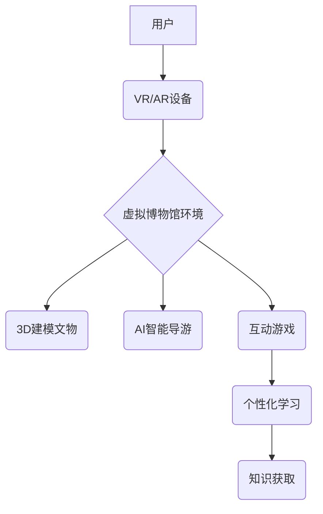

                 

## 虚拟博物馆教育:全球文化资源的沉浸式学习平台

> 关键词：虚拟现实、增强现实、博物馆教育、文化遗产、沉浸式学习、人工智能、3D建模、游戏化学习

## 1. 背景介绍

随着科技的飞速发展，虚拟现实 (VR) 和增强现实 (AR) 技术逐渐成熟，为教育领域带来了前所未有的机遇。传统博物馆教育模式面临着空间限制、资源不足、互动性低等问题，而虚拟博物馆教育则能够突破这些局限，为用户提供更加沉浸式、交互式、个性化的学习体验。

虚拟博物馆教育是指利用虚拟现实和增强现实技术，构建一个虚拟的博物馆环境，用户可以在其中浏览、探索、互动，体验丰富的文化遗产和历史知识。它可以将博物馆馆藏数字化，打破地域限制，让用户无论身处何地都能访问和学习。

## 2. 核心概念与联系

虚拟博物馆教育的核心概念包括：

* **虚拟现实 (VR):** 通过头戴式设备，模拟真实环境，用户可以身临其境地体验虚拟世界。
* **增强现实 (AR):** 在现实世界中叠加虚拟元素，例如在博物馆展厅中，通过手机或平板电脑，可以查看文物背后的历史信息、3D模型等。
* **3D建模:** 将文物、建筑等实体物体数字化，构建虚拟模型，以便在虚拟环境中展示和交互。
* **人工智能 (AI):** 用于虚拟博物馆的智能导游、个性化学习推荐等功能。

**核心概念架构图:**



## 3. 核心算法原理 & 具体操作步骤

### 3.1  算法原理概述

虚拟博物馆教育的核心算法主要包括：

* **3D建模算法:** 用于将文物、建筑等实体物体数字化，构建虚拟模型。常用的算法包括扫描建模、照片建模、手绘建模等。
* **路径规划算法:** 用于在虚拟博物馆环境中规划用户行走路线，避免碰撞和卡顿。常用的算法包括A*算法、Dijkstra算法等。
* **交互算法:** 用于处理用户与虚拟环境的交互，例如点击、拖动、语音控制等。常用的算法包括事件驱动模型、状态机模型等。

### 3.2  算法步骤详解

**3D建模算法步骤:**

1. **数据采集:** 使用扫描仪、相机等设备采集文物或建筑的真实数据。
2. **数据处理:** 对采集到的数据进行预处理，例如去除噪声、拼接图像等。
3. **模型构建:** 使用3D建模软件，根据处理后的数据构建虚拟模型。
4. **模型优化:** 对模型进行优化，例如简化模型、提高纹理质量等。

**路径规划算法步骤:**

1. **构建地图:** 将虚拟博物馆环境建模成地图，包括障碍物、路径等信息。
2. **设置起点和终点:** 用户指定需要前往的虚拟地点。
3. **搜索路径:** 使用路径规划算法，在虚拟地图上搜索一条从起点到终点的路径。
4. **规划路线:** 根据搜索到的路径，规划用户行走路线，并避免碰撞和卡顿。

### 3.3  算法优缺点

**3D建模算法:**

* **优点:** 可以高度还原文物或建筑的真实形态，提供逼真的视觉体验。
* **缺点:** 数据采集成本高，建模过程复杂，需要专业技能。

**路径规划算法:**

* **优点:** 可以帮助用户快速找到目标地点，提高用户体验。
* **缺点:** 复杂环境下，路径规划可能存在不准确或不优化的情况。

### 3.4  算法应用领域

* **博物馆教育:** 虚拟博物馆可以展示文物、历史场景，提供沉浸式学习体验。
* **旅游业:** 虚拟旅游可以模拟真实旅游场景，帮助用户提前了解目的地。
* **文化遗产保护:** 虚拟模型可以帮助保护文物，防止文物损坏。
* **游戏开发:** 虚拟现实技术可以用于开发沉浸式游戏。

## 4. 数学模型和公式 & 详细讲解 & 举例说明

### 4.1  数学模型构建

虚拟博物馆教育中，可以使用数学模型来描述用户与虚拟环境的交互，例如：

* **用户位置模型:** 使用三维坐标系来描述用户的虚拟位置。
* **物体运动模型:** 使用物理学公式来描述虚拟物体的运动轨迹。
* **交互响应模型:** 使用数学函数来描述用户交互行为与虚拟环境的响应关系。

### 4.2  公式推导过程

例如，用户在虚拟博物馆中移动，可以使用以下公式来描述其位置变化：

$$
x(t) = x_0 + v_x * t
$$

$$
y(t) = y_0 + v_y * t
$$

$$
z(t) = z_0 + v_z * t
$$

其中：

* $x(t)$, $y(t)$, $z(t)$ 是用户在时间 $t$ 时的虚拟位置坐标。
* $x_0$, $y_0$, $z_0$ 是用户初始位置坐标。
* $v_x$, $v_y$, $v_z$ 是用户的虚拟速度分量。

### 4.3  案例分析与讲解

假设用户初始位置坐标为 (0, 0, 0)，虚拟速度为 (1, 0, 0)，则用户在时间 $t$ 时的虚拟位置坐标为 $(t, 0, 0)$。

## 5. 项目实践：代码实例和详细解释说明

### 5.1  开发环境搭建

虚拟博物馆教育项目可以使用 Unity 或 Unreal Engine 等游戏引擎进行开发。

* **Unity:** 是一款跨平台的游戏引擎，支持 VR 和 AR 开发。
* **Unreal Engine:** 另一款强大的游戏引擎，拥有逼真的图形渲染效果。

### 5.2  源代码详细实现

以下是一个简单的 Unity 项目代码示例，用于展示虚拟文物：

```csharp
using UnityEngine;

public class VirtualArtifact : MonoBehaviour
{
    public string artifactName;
    public string artifactDescription;

    void OnMouseOver()
    {
        // 显示文物信息
        Debug.Log("文物名称: " + artifactName);
        Debug.Log("文物描述: " + artifactDescription);
    }
}
```

### 5.3  代码解读与分析

* `VirtualArtifact` 类代表一个虚拟文物。
* `artifactName` 和 `artifactDescription` 属性存储文物名称和描述信息。
* `OnMouseOver()` 方法在鼠标悬停在文物上时触发，显示文物信息。

### 5.4  运行结果展示

运行该代码后，在 Unity 编辑器中，用户可以点击虚拟文物，查看其名称和描述信息。

## 6. 实际应用场景

虚拟博物馆教育可以应用于多种场景，例如：

* **线上博物馆:** 提供虚拟参观体验，打破地域限制。
* **教育教学:** 辅助课堂教学，提高学生学习兴趣和理解能力。
* **文化传播:** 推广文化遗产，提高公众文化素养。

### 6.4  未来应用展望

未来，虚拟博物馆教育将更加智能化、个性化、交互式。例如：

* **AI智能导游:** 提供个性化讲解和互动体验。
* **游戏化学习:** 将学习内容融入游戏，提高用户参与度。
* **跨平台体验:** 支持多种设备，例如手机、平板电脑、VR头显等。

## 7. 工具和资源推荐

### 7.1  学习资源推荐

* **Unity官方文档:** https://docs.unity3d.com/
* **Unreal Engine官方文档:** https://docs.unrealengine.com/
* **VR/AR技术博客:** https://www.roadtovr.com/

### 7.2  开发工具推荐

* **Unity:** https://unity.com/
* **Unreal Engine:** https://www.unrealengine.com/
* **Blender:** https://www.blender.org/

### 7.3  相关论文推荐

* **Virtual Reality in Education: A Systematic Review**
* **Augmented Reality in Education: A Review of the Literature**
* **The Impact of Virtual Museums on Learning**

## 8. 总结：未来发展趋势与挑战

### 8.1  研究成果总结

虚拟博物馆教育技术发展迅速，取得了显著成果，为博物馆教育和文化传播提供了新的途径。

### 8.2  未来发展趋势

未来，虚拟博物馆教育将更加智能化、个性化、交互式，并与其他技术融合，例如人工智能、云计算、大数据等。

### 8.3  面临的挑战

虚拟博物馆教育还面临一些挑战，例如：

* **技术成本:** 3D建模、VR/AR设备等技术成本较高。
* **内容制作:** 需要大量高质量的虚拟内容。
* **用户体验:** 需要不断优化用户体验，提高用户参与度。

### 8.4  研究展望

未来，需要加强虚拟博物馆教育技术的研发，降低技术成本，丰富虚拟内容，提升用户体验，推动虚拟博物馆教育的普及和发展。

## 9. 附录：常见问题与解答

* **Q: 虚拟博物馆教育和传统博物馆教育相比有什么优势？**

* **A:** 虚拟博物馆教育可以打破地域限制，提供更加沉浸式、交互式、个性化的学习体验，并可以更方便地更新和维护内容。

* **Q: 如何制作虚拟文物？**

* **A:** 可以使用3D扫描仪、相机等设备采集文物数据，然后使用3D建模软件构建虚拟模型。

* **Q: 虚拟博物馆教育的未来发展趋势是什么？**

* **A:** 未来，虚拟博物馆教育将更加智能化、个性化、交互式，并与其他技术融合，例如人工智能、云计算、大数据等。


作者：禅与计算机程序设计艺术 / Zen and the Art of Computer Programming 
<end_of_turn>

