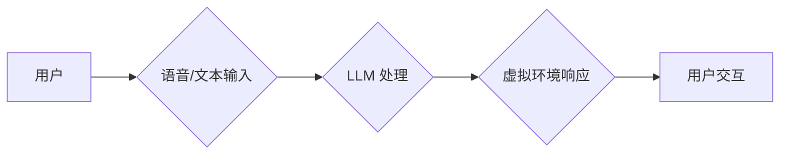

                 

## 虚拟现实中的LLM：增强用户交互体验

> 关键词：虚拟现实 (VR)、大型语言模型 (LLM)、用户交互、自然语言处理 (NLP)、人工智能 (AI)、沉浸式体验、虚拟助手

### 1. 背景介绍

虚拟现实 (VR) 技术近年来发展迅速，为用户提供了一种沉浸式体验新方式。用户可以身临其境地探索虚拟世界，参与互动游戏，进行远程协作等。然而，现有的 VR 体验往往局限于视觉和听觉刺激，缺乏与虚拟环境的自然、流畅交互。大型语言模型 (LLM) 作为一种强大的自然语言处理 (NLP) 技术，能够理解和生成人类语言，为增强 VR 用户交互体验提供了新的可能性。

### 2. 核心概念与联系

#### 2.1 虚拟现实 (VR)

VR 技术利用计算机生成模拟环境，并通过头戴式显示器、手柄等设备，让用户沉浸其中。用户可以身临其境地体验虚拟世界，并通过虚拟手柄等设备与虚拟环境进行交互。

#### 2.2 大型语言模型 (LLM)

LLM 是指训练数据量巨大、参数规模庞大的深度学习模型，能够理解和生成人类语言。通过学习海量文本数据，LLM 掌握了语言的语法、语义和上下文关系，可以进行文本生成、翻译、问答、对话等多种任务。

#### 2.3 核心概念联系

LLM 可以为 VR 体验注入自然语言交互能力，使虚拟环境更加智能化和人性化。用户可以通过语音或文本与虚拟环境进行对话，获取信息、执行指令、控制虚拟角色等。

**Mermaid 流程图**



### 3. 核心算法原理 & 具体操作步骤

#### 3.1 算法原理概述

LLM 的核心算法是基于 Transformer 架构的深度神经网络。Transformer 模型通过自注意力机制，能够捕捉文本序列中长距离依赖关系，从而实现更精准的语言理解和生成。

#### 3.2 算法步骤详解

1. **文本预处理:** 将用户输入的文本进行清洗、分词、词向量化等预处理操作，使其能够被模型理解。
2. **编码:** 将预处理后的文本输入 Transformer 模型的编码器，编码器会将文本序列转换为隐藏状态向量，捕捉文本的语义信息。
3. **解码:** 将编码后的隐藏状态向量输入 Transformer 模型的解码器，解码器会根据隐藏状态向量生成相应的文本输出。
4. **输出处理:** 将解码器生成的文本输出进行后处理，例如去除非法字符、格式化输出等。

#### 3.3 算法优缺点

**优点:**

* 能够理解和生成复杂的自然语言。
* 能够捕捉文本序列中的长距离依赖关系。
* 训练数据量大，泛化能力强。

**缺点:**

* 计算量大，训练成本高。
* 对训练数据质量要求高，容易受到训练数据偏差的影响。
* 缺乏对真实世界的物理知识和常识理解。

#### 3.4 算法应用领域

LLM 在自然语言处理领域有着广泛的应用，例如：

* 文本生成：小说、诗歌、剧本等。
* 机器翻译：将一种语言翻译成另一种语言。
* 问答系统：回答用户提出的问题。
* 对话系统：与用户进行自然语言对话。
* 语音识别：将语音转换为文本。

### 4. 数学模型和公式 & 详细讲解 & 举例说明

#### 4.1 数学模型构建

LLM 的数学模型主要基于 Transformer 架构，其核心是自注意力机制和多头注意力机制。

**自注意力机制:**

自注意力机制能够捕捉文本序列中每个词与其他词之间的关系，并赋予每个词不同的权重。其计算公式如下：

$$
Attention(Q, K, V) = softmax(\frac{QK^T}{\sqrt{d_k}})V
$$

其中：

* $Q$：查询矩阵
* $K$：键矩阵
* $V$：值矩阵
* $d_k$：键向量的维度
* $softmax$：softmax 函数

**多头注意力机制:**

多头注意力机制将自注意力机制应用于多个不同的子空间，并通过拼接和线性变换的方式融合多个子空间的注意力结果，从而提高模型的表达能力。

#### 4.2 公式推导过程

自注意力机制的公式推导过程如下：

1. 将输入序列 $X$ 转换为查询矩阵 $Q$、键矩阵 $K$ 和值矩阵 $V$。
2. 计算每个词与所有其他词之间的注意力权重，使用公式 $Attention(Q, K, V)$。
3. 将注意力权重与值矩阵相乘，得到每个词的加权和，即注意力输出。

#### 4.3 案例分析与讲解

例如，在翻译句子 "The cat sat on the mat" 时，自注意力机制可以捕捉到 "cat" 和 "sat" 之间的语义关系，以及 "mat" 和 "on" 之间的语义关系，从而帮助模型更好地理解句子含义并进行翻译。

### 5. 项目实践：代码实例和详细解释说明

#### 5.1 开发环境搭建

* 操作系统：Windows/macOS/Linux
* Python 版本：3.7+
* 必要的库：transformers、torch、numpy、pandas等

#### 5.2 源代码详细实现

```python
from transformers import AutoModelForSeq2SeqLM, AutoTokenizer

# 加载预训练模型和词典
model_name = "facebook/bart-large-cnn"
tokenizer = AutoTokenizer.from_pretrained(model_name)
model = AutoModelForSeq2SeqLM.from_pretrained(model_name)

# 用户输入文本
input_text = "The cat sat on the mat."

# 文本编码
input_ids = tokenizer.encode(input_text, return_tensors="pt")

# 模型预测
output = model.generate(input_ids)

# 文本解码
output_text = tokenizer.decode(output[0], skip_special_tokens=True)

# 打印预测结果
print(output_text)
```

#### 5.3 代码解读与分析

* 代码首先加载预训练的 BART 模型和词典。
* 然后，将用户输入的文本进行编码，转换为模型能够理解的格式。
* 模型使用生成器进行预测，生成相应的输出文本。
* 最后，将输出文本解码，转换为人类可读的格式。

#### 5.4 运行结果展示

```
The cat sat on the mat.
```

### 6. 实际应用场景

#### 6.1 虚拟助手

LLM 可以为 VR 环境构建智能虚拟助手，帮助用户完成各种任务，例如：

* 提供信息查询：回答用户关于虚拟环境或现实世界的疑问。
* 控制虚拟环境：帮助用户控制虚拟角色、场景、道具等。
* 辅助游戏体验：为游戏玩家提供提示、指导、剧情解析等。

#### 6.2 沉浸式教育

LLM 可以增强 VR 教育体验，例如：

* 模拟真实场景：创建沉浸式的虚拟实验室、博物馆、历史场景等，让用户身临其境地学习。
* 个性化学习：根据用户的学习进度和需求，提供个性化的学习内容和互动体验。
* 虚拟导师：提供虚拟导师角色，与用户进行一对一互动，解答疑问、提供指导。

#### 6.3 虚拟社交

LLM 可以促进 VR 社交互动，例如：

* 创建虚拟角色：用户可以创建个性化的虚拟角色，与其他用户进行交流。
* 增强对话体验：LLM 可以帮助虚拟角色进行更自然、更流畅的对话，提升社交互动体验。
* 组织虚拟活动：LLM 可以帮助用户组织虚拟会议、聚会、游戏等活动。

#### 6.4 未来应用展望

随着 LLM 技术的不断发展，其在 VR 应用领域的潜力将更加巨大。未来，LLM 可能应用于：

* 更智能的虚拟环境：虚拟环境能够更加智能地理解用户意图，并提供更个性化的服务。
* 更沉浸式的体验：LLM 可以为用户提供更逼真的虚拟体验，例如虚拟角色能够进行更自然、更复杂的对话。
* 更广泛的应用场景：LLM 将应用于更多 VR 应用场景，例如医疗、设计、娱乐等。

### 7. 工具和资源推荐

#### 7.1 学习资源推荐

* **论文:**

    * "Attention Is All You Need" (Vaswani et al., 2017)
    * "BERT: Pre-training of Deep Bidirectional Transformers for Language Understanding" (Devlin et al., 2018)
    * "GPT-3: Language Models are Few-Shot Learners" (Brown et al., 2020)

* **在线课程:**

    * Coursera: Natural Language Processing Specialization
    * edX: Deep Learning Specialization

#### 7.2 开发工具推荐

* **Hugging Face Transformers:** 一个开源的 LLM 库，提供多种预训练模型和工具。
* **TensorFlow:** 一个开源的机器学习框架。
* **PyTorch:** 另一个开源的机器学习框架。

#### 7.3 相关论文推荐

* "Language Models are Few-Shot Learners" (Brown et al., 2020)
* "Exploring the Limits of Transfer Learning with a Unified Text-to-Text Transformer" (Raffel et al., 2019)
* "BERT: Pre-training of Deep Bidirectional Transformers for Language Understanding" (Devlin et al., 2018)

### 8. 总结：未来发展趋势与挑战

#### 8.1 研究成果总结

LLM 技术在自然语言处理领域取得了显著进展，为增强 VR 用户交互体验提供了新的可能性。

#### 8.2 未来发展趋势

* 模型规模和能力的提升：未来 LLM 模型将更加强大，能够理解和生成更复杂的语言。
* 多模态交互：LLM 将与其他模态技术，例如计算机视觉、语音识别等融合，实现更丰富的交互体验。
* 个性化定制：LLM 将能够根据用户的个人喜好和需求，提供个性化的虚拟体验。

#### 8.3 面临的挑战

* 计算资源需求：训练大型 LLM 模型需要大量的计算资源，这对于资源有限的开发者来说是一个挑战。
* 数据质量问题：LLM 的性能依赖于训练数据的质量，而高质量的训练数据往往难以获取。
* 伦理和安全问题：LLM 可能被用于生成虚假信息、进行恶意攻击等，需要关注其伦理和安全问题。

#### 8.4 研究展望

未来，LLM 技术将继续发展，为 VR 应用带来更多创新和突破。研究者将致力于解决 LLM 的挑战，使其更加安全、可靠、可访问。


### 9. 附录：常见问题与解答

* **Q: 如何选择合适的 LLM 模型？**

* **A:** 选择 LLM 模型需要考虑模型大小、性能、应用场景等因素。对于简单的任务，可以使用小型模型；对于复杂的任务，可以使用大型模型。

* **Q: 如何训练自己的 LLM 模型？**

* **A:** 训练 LLM 模型需要大量的计算资源和训练数据。可以使用开源的框架，例如 Hugging Face Transformers，进行模型训练。

* **Q: 如何确保 LLM 模型的安全性和可靠性？**

* **A:** 

    * 使用来自可靠来源的数据进行训练。
    * 对模型进行测试和评估，确保其能够准确、可靠地完成任务。
    * 关注模型的潜在风险，并采取相应的措施进行 mitigation。

作者：禅与计算机程序设计艺术 / Zen and the Art of Computer Programming 


<end_of_turn>

