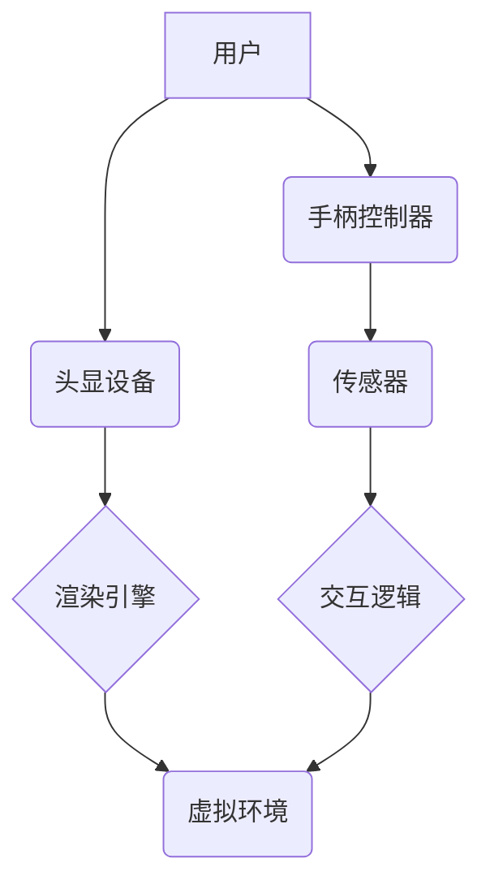

                 

## 虚拟现实（VR）开发：沉浸式体验设计

> 关键词：虚拟现实、VR开发、沉浸式体验、3D图形、交互设计、头显设备、游戏开发、应用开发

## 1. 背景介绍

虚拟现实（VR）技术近年来发展迅速，从最初的科幻概念逐渐走向现实，并开始在游戏、教育、医疗、设计等多个领域得到广泛应用。VR技术能够创造出逼真的虚拟环境，让用户身临其境地体验不同的世界，从而带来前所未有的沉浸式体验。

随着头显设备的不断进步和成本的降低，VR技术逐渐普及，越来越多的开发者开始探索VR开发的可能性。然而，开发高质量的VR体验并非易事，需要对3D图形、交互设计、用户体验等多个方面有深入的理解。

## 2. 核心概念与联系

**2.1 核心概念**

* **虚拟环境 (Virtual Environment):**  VR系统构建的模拟世界，可以是真实世界的复制，也可以是完全虚构的场景。
* **头显设备 (Head-Mounted Display, HMD):**  用户佩戴在头上的设备，用于显示虚拟环境的图像并追踪用户的头部运动。
* **手柄控制器 (Handheld Controller):**  用户用来与虚拟环境交互的设备，可以模拟现实世界的动作，例如抓取、推拉等。
* **传感器 (Sensor):**  用于追踪用户位置、姿态和手部动作的设备，例如惯性测量单元 (IMU)、磁力传感器等。
* **渲染引擎 (Rendering Engine):**  负责将虚拟环境的3D模型转化为用户可以看到的图像的软件。

**2.2 架构关系**



**2.3 核心联系**

VR系统通过头显设备、手柄控制器和传感器等硬件设备，将用户沉浸在虚拟环境中。渲染引擎负责渲染虚拟环境的图像，并根据用户的动作和传感器数据进行实时更新。交互逻辑模块处理用户与虚拟环境的交互，例如用户点击、移动、抓取等动作。

## 3. 核心算法原理 & 具体操作步骤

**3.1 算法原理概述**

VR开发的核心算法主要包括：

* **3D图形渲染算法:** 用于将虚拟环境的3D模型转化为用户可以看到的图像。常见的渲染算法包括光栅化渲染、射线追踪等。
* **运动追踪算法:** 用于追踪用户的头部和手部运动，并将其映射到虚拟环境中。常见的运动追踪算法包括惯性测量单元 (IMU) 算法、磁力传感器算法等。
* **交互算法:** 用于处理用户与虚拟环境的交互，例如用户点击、移动、抓取等动作。常见的交互算法包括事件驱动模型、状态机模型等。

**3.2 算法步骤详解**

* **3D图形渲染算法:**

    1. 将虚拟环境的3D模型导入渲染引擎。
    2. 根据用户的视角和位置，计算每个像素对应的3D物体。
    3. 根据光照、材质等信息，计算每个像素的颜色值。
    4. 将计算出的颜色值显示在屏幕上。

* **运动追踪算法:**

    1. 使用传感器获取用户的头部和手部运动数据。
    2. 利用算法对运动数据进行滤波和校正，去除噪声和误差。
    3. 将校正后的运动数据映射到虚拟环境中，更新用户的视角和手部位置。

* **交互算法:**

    1. 监听用户的输入事件，例如点击、移动、抓取等。
    2. 根据用户的输入事件，触发相应的交互逻辑。
    3. 更新虚拟环境的状态，例如移动物体、改变场景等。

**3.3 算法优缺点**

* **3D图形渲染算法:**

    * **优点:** 可以渲染逼真的3D图像，提供沉浸式的视觉体验。
    * **缺点:** 计算量大，对硬件性能要求高。

* **运动追踪算法:**

    * **优点:** 可以准确追踪用户的运动，提供自然的交互体验。
    * **缺点:** 容易受到环境干扰，精度可能会有所下降。

* **交互算法:**

    * **优点:** 可以实现丰富的交互方式，增强用户的参与感。
    * **缺点:** 设计复杂，需要考虑用户的操作习惯和心理预期。

**3.4 算法应用领域**

* **游戏开发:** VR游戏可以提供更加沉浸式的游戏体验，让玩家身临其境地感受游戏世界。
* **教育培训:** VR可以模拟真实场景，让学生在虚拟环境中进行学习和实践，提高学习效果。
* **医疗保健:** VR可以用于医疗培训、手术模拟、康复治疗等，帮助医生和患者更好地理解和应对疾病。
* **设计与制造:** VR可以用于产品设计、虚拟原型制作、设备操作模拟等，提高设计效率和生产质量。

## 4. 数学模型和公式 & 详细讲解 & 举例说明

**4.1 数学模型构建**

VR系统中常用的数学模型包括：

* **3D坐标系:** 用于描述虚拟环境中的物体位置和方向。
* **投影变换:** 用于将3D物体投影到2D屏幕上。
* **光照模型:** 用于计算物体在不同光照条件下的颜色和亮度。
* **运动模型:** 用于描述物体在虚拟环境中的运动轨迹。

**4.2 公式推导过程**

* **投影变换:**

    假设一个3D点P(x, y, z)在世界坐标系中，需要将其投影到屏幕坐标系中。投影变换公式如下：

    $$
    \begin{bmatrix}
    x' \\
    y' \\
    z'
    \end{bmatrix} = \begin{bmatrix}
    f_x & 0 & c_x \\
    0 & f_y & c_y \\
    0 & 0 & 1
    \end{bmatrix} \begin{bmatrix}
    x \\
    y \\
    z
    \end{bmatrix}
    $$

    其中，(x', y')是屏幕坐标，(x, y, z)是世界坐标，f_x和f_y是焦距，c_x和c_y是中心点坐标。

* **光照模型:**

    常用的光照模型包括 Phong 模型、Blinn-Phong 模型等。这些模型通过计算物体表面法线、光源方向、观察者方向等信息，来计算物体在不同光照条件下的颜色和亮度。

**4.3 案例分析与讲解**

* **3D坐标系:** 在VR游戏中，每个物体都有一个3D坐标，用于描述其位置和方向。例如，玩家角色的坐标为(0, 0, 0)，而游戏场景中的墙壁的坐标为(10, 0, 0)。

* **投影变换:** 当玩家移动时，需要将游戏场景中的物体投影到玩家的视野中。投影变换公式将3D坐标转换为2D屏幕坐标，从而实现虚拟环境的视差效果。

* **光照模型:** 在VR游戏中，光照模型用于模拟不同光源对物体的影响。例如，当阳光照射到物体表面时，物体会呈现出不同的颜色和亮度。

## 5. 项目实践：代码实例和详细解释说明

**5.1 开发环境搭建**

* **操作系统:** Windows、macOS、Linux
* **编程语言:** C++, C#, Java, Python
* **VR开发平台:** Unity、Unreal Engine、SteamVR、Oculus SDK

**5.2 源代码详细实现**

以下是一个简单的Unity VR项目代码示例，用于实现玩家在虚拟环境中移动的功能：

```csharp
using UnityEngine;

public class PlayerMovement : MonoBehaviour
{
    public float speed = 5.0f;

    void Update()
    {
        float horizontalInput = Input.GetAxis("Horizontal");
        float verticalInput = Input.GetAxis("Vertical");

        Vector3 movement = new Vector3(horizontalInput, 0.0f, verticalInput);
        transform.Translate(movement * speed * Time.deltaTime);
    }
}
```

**5.3 代码解读与分析**

* `speed`变量控制玩家移动的速度。
* `Update()`函数在每帧更新时执行。
* `Input.GetAxis("Horizontal")`和`Input.GetAxis("Vertical")`获取玩家输入的水平和垂直方向的移动量。
* `Vector3 movement`计算玩家的移动方向。
* `transform.Translate()`移动玩家角色。

**5.4 运行结果展示**

运行此代码后，玩家可以通过键盘控制角色在虚拟环境中移动。

## 6. 实际应用场景

**6.1 游戏开发**

VR游戏可以提供更加沉浸式的游戏体验，例如：

* **动作游戏:** 玩家可以身临其境地体验战斗、冒险等场景。
* **模拟游戏:** 玩家可以模拟驾驶飞机、潜艇、汽车等，体验真实的驾驶操作。
* **益智游戏:** 玩家可以身临其境地探索虚拟世界，解开谜题、收集物品等。

**6.2 教育培训**

VR可以用于模拟真实场景，让学生在虚拟环境中进行学习和实践，例如：

* **医学培训:** 学生可以模拟进行手术操作，学习医学知识。
* **历史模拟:** 学生可以身临其境地体验历史事件，加深对历史的理解。
* **科学实验:** 学生可以进行虚拟实验，探索科学原理。

**6.3 医疗保健**

VR可以用于医疗培训、手术模拟、康复治疗等，例如：

* **手术模拟:** 医生可以利用VR模拟进行手术操作，提高手术技能。
* **康复治疗:** 患者可以利用VR进行虚拟运动和游戏，帮助恢复身体功能。
* **心理治疗:** 患者可以利用VR进行虚拟暴露疗法，克服恐惧和焦虑。

**6.4 未来应用展望**

随着VR技术的不断发展，其应用场景将会更加广泛，例如：

* **虚拟会议:** 虚拟会议可以打破地域限制，让用户身临其境地参与会议。
* **远程协作:** 远程协作可以利用VR技术，让用户身临其境地进行协作工作。
* **虚拟旅游:** 虚拟旅游可以让人们身临其境地体验不同的旅游景点。

## 7. 工具和资源推荐

**7.1 学习资源推荐**

* **书籍:**

    * 《VR开发入门》
    * 《Unity VR开发指南》
    * 《Unreal Engine VR开发教程》

* **在线课程:**

    * Udemy VR开发课程
    * Coursera VR开发课程
    * Skillshare VR开发课程

**7.2 开发工具推荐**

* **VR开发平台:** Unity、Unreal Engine
* **头显设备:** Oculus Rift、HTC Vive、PlayStation VR
* **传感器:** Leap Motion、Microsoft Kinect

**7.3 相关论文推荐**

* 《A Survey of Virtual Reality》
* 《Virtual Reality: Principles and Practice》
* 《The Future of Virtual Reality》

## 8. 总结：未来发展趋势与挑战

**8.1 研究成果总结**

VR技术近年来取得了显著的进展，从硬件设备到软件平台，都取得了突破性的发展。VR体验越来越逼真，应用场景也越来越广泛。

**8.2 未来发展趋势**

* **更逼真的视觉效果:** 未来VR技术将更加注重视觉效果的逼真度，例如更高的分辨率、更广阔的视野、更真实的物理模拟等。
* **更自然的交互方式:** 未来VR交互方式将更加自然，例如手部追踪、眼球追踪、语音识别等。
* **更广泛的应用场景:** 未来VR技术将应用于更多领域，例如教育、医疗、商业、娱乐等。

**8.3 面临的挑战**

* **成本问题:** VR设备和软件开发成本仍然较高，限制了其普及率。
* **技术难题:** VR技术还面临着一些技术难题，例如运动眩晕、内容创作难度等。
* **伦理问题:** VR技术的发展也带来了一些伦理问题，例如虚拟现实中的隐私保护、虚拟现实中的暴力内容等。

**8.4 研究展望**

未来VR技术的发展将更加注重用户体验、技术创新和伦理规范，以实现VR技术的真正普及和应用。

## 9. 附录：常见问题与解答

* **什么是VR晕动症？**

VR晕动症是一种在使用VR设备时出现的恶心、呕吐、头晕等症状。

* **如何避免VR晕动症？**

* 选择合适的VR设备和游戏。
* 逐渐增加使用时间。
* 在使用VR设备时保持良好的姿势。
* 休息时离开虚拟环境。

* **VR技术的发展前景如何？**

VR技术的发展前景非常广阔，未来将应用于更多领域，改变我们的生活方式。


作者：禅与计算机程序设计艺术 / Zen and the Art of Computer Programming 
<end_of_turn>

