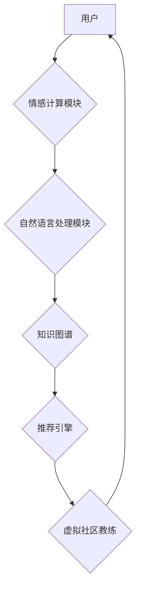

                 

## 虚拟社区教练：AI驱动的在线归属感训练

> 关键词：虚拟社区、AI教练、归属感训练、情感计算、自然语言处理、机器学习、用户体验

## 1. 背景介绍

在当今数字化时代，人们越来越依赖网络构建社交关系，虚拟社区成为了一种重要的社交平台。然而，虚拟社区也面临着诸多挑战，其中之一就是用户归属感不足。许多用户在虚拟社区中感到孤独、孤立，缺乏与他人建立深厚联系的体验。

归属感是人类的基本心理需求，它指个体对群体或社会单位的认同感和归属感。对于虚拟社区用户来说，归属感意味着他们能够在虚拟环境中找到同伴、建立关系，并感受到被接纳和支持。缺乏归属感会导致用户流失、社区活跃度下降，甚至影响用户的心理健康。

传统的虚拟社区管理方式难以有效解决归属感问题。社区管理员通常依靠人工管理，难以及时识别和回应每个用户的需求。而AI技术的发展为提升虚拟社区用户归属感提供了新的可能性。

## 2. 核心概念与联系

虚拟社区教练是一种基于AI的智能系统，旨在通过情感计算、自然语言处理等技术，帮助虚拟社区用户建立更深厚的关系，增强归属感。

**核心概念:**

* **情感计算:** 通过分析用户文本、语音、表情等数据，识别用户的感情状态和意图。
* **自然语言处理:** 理解和处理用户的自然语言输入，例如聊天、评论等。
* **机器学习:** 利用历史数据训练模型，预测用户的行为和需求，并提供个性化的建议和服务。

**架构图:**



**核心联系:**

* 用户通过虚拟社区平台与虚拟社区教练交互。
* 情感计算模块分析用户的表达，识别用户的感情状态和意图。
* 自然语言处理模块理解用户的语言输入，并将其转化为可处理的信息。
* 知识图谱存储虚拟社区用户的信息和关系，以及社区规则和规范。
* 推荐引擎根据用户的特征和需求，推荐合适的社区活动、用户和资源。
* 虚拟社区教练根据分析结果，提供个性化的建议和服务，帮助用户建立关系，增强归属感。

## 3. 核心算法原理 & 具体操作步骤

### 3.1  算法原理概述

虚拟社区教练的核心算法基于机器学习和深度学习技术，主要包括以下几个方面:

* **用户画像构建:** 利用用户行为数据、社交关系数据等，构建用户的个性化画像，包括用户兴趣、爱好、价值观、情感倾向等。
* **关系推荐:** 基于用户画像和社区关系网络，推荐用户可能感兴趣的社区成员，并提供互动建议，促进用户之间的连接。
* **情感分析:** 利用自然语言处理和情感计算技术，分析用户在社区中的表达，识别用户的感情状态，并根据用户的需求提供情感支持和引导。
* **内容推荐:** 基于用户兴趣和行为数据，推荐用户可能感兴趣的社区内容，例如帖子、活动、资源等，增强用户参与度和粘性。

### 3.2  算法步骤详解

1. **数据收集:** 收集用户行为数据、社交关系数据、社区内容数据等，构建虚拟社区的数据基础。
2. **数据预处理:** 对收集到的数据进行清洗、转换、格式化等预处理，使其适合机器学习算法的训练。
3. **模型训练:** 利用机器学习算法，训练用户画像构建、关系推荐、情感分析、内容推荐等模型。
4. **模型评估:** 对训练好的模型进行评估，并根据评估结果进行模型优化和调整。
5. **模型部署:** 将训练好的模型部署到虚拟社区平台，并实时进行用户行为分析和个性化服务提供。

### 3.3  算法优缺点

**优点:**

* **个性化服务:** 基于用户画像和行为数据，提供个性化的推荐和服务，提升用户体验。
* **主动引导:** 通过情感分析和互动建议，主动引导用户建立关系，增强归属感。
* **数据驱动:** 基于数据分析和模型预测，提供更精准和有效的服务。

**缺点:**

* **数据依赖:** 算法的性能依赖于数据质量和数量，数据不足或质量差会导致算法效果不佳。
* **隐私安全:** 用户数据收集和使用需要谨慎处理，确保用户隐私安全。
* **算法偏差:** 算法模型可能存在偏差，导致服务不公平或不准确。

### 3.4  算法应用领域

虚拟社区教练的算法技术可以应用于各种虚拟社区，例如:

* **社交平台:** 提升用户互动和粘性，促进用户之间的连接。
* **游戏社区:** 增强玩家之间的协作和互动，提升游戏体验。
* **学习社区:** 帮助用户找到学习伙伴，促进知识分享和学习效果。
* **兴趣社区:** 帮助用户找到志同道合的朋友，分享兴趣爱好。

## 4. 数学模型和公式 & 详细讲解 & 举例说明

### 4.1  数学模型构建

虚拟社区教练的数学模型主要基于用户画像构建、关系推荐和情感分析等方面。

**用户画像构建:**

用户画像可以表示为一个向量，其中每个维度代表用户的某个特征，例如年龄、性别、兴趣、爱好、价值观等。

$$
u = (u_1, u_2, ..., u_n)
$$

其中，$u$ 表示用户的向量表示，$u_i$ 表示用户在第 $i$ 个特征上的值。

**关系推荐:**

关系推荐可以基于用户画像之间的相似度进行，例如余弦相似度。

$$
similarity(u_1, u_2) = \frac{u_1 \cdot u_2}{||u_1|| ||u_2||}
$$

其中，$u_1$ 和 $u_2$ 表示两个用户的向量表示，$ \cdot $ 表示点积，$||u||$ 表示向量的模长。

**情感分析:**

情感分析可以基于文本分类模型，例如支持向量机 (SVM) 或深度学习模型，例如 recurrent neural network (RNN)。

### 4.2  公式推导过程

**余弦相似度公式推导:**

余弦相似度公式的推导基于向量之间的夹角。两个向量的夹角越小，表示它们之间的相似度越高。

$$
cos(\theta) = \frac{u_1 \cdot u_2}{||u_1|| ||u_2||}
$$

其中，$\theta$ 表示两个向量之间的夹角。

因此，余弦相似度可以用来衡量两个用户之间的相似度。

### 4.3  案例分析与讲解

**案例:**

假设有两个用户 $u_1$ 和 $u_2$，他们的向量表示分别为:

$$
u_1 = (1, 2, 3, 4)
$$

$$
u_2 = (2, 4, 6, 8)
$$

计算他们的余弦相似度:

$$
similarity(u_1, u_2) = \frac{(1 \cdot 2) + (2 \cdot 4) + (3 \cdot 6) + (4 \cdot 8)}{||(1, 2, 3, 4)|| ||(2, 4, 6, 8)||} = \frac{2 + 8 + 18 + 32}{(\sqrt{1^2 + 2^2 + 3^2 + 4^2})(\sqrt{2^2 + 4^2 + 6^2 + 8^2})} = 1
$$

结果为 1，表示 $u_1$ 和 $u_2$ 非常相似。

## 5. 项目实践：代码实例和详细解释说明

### 5.1  开发环境搭建

虚拟社区教练的开发环境可以基于 Python 语言和相关库进行搭建，例如:

* **Python:** 作为编程语言基础。
* **NLTK:** 自然语言处理库，用于文本分析和情感识别。
* **Scikit-learn:** 机器学习库，用于用户画像构建、关系推荐和模型训练。
* **TensorFlow/PyTorch:** 深度学习库，用于构建更复杂的模型。

### 5.2  源代码详细实现

以下是一个简单的用户画像构建代码示例，使用 Scikit-learn 库实现:

```python
from sklearn.feature_extraction.text import TfidfVectorizer

# 用户数据
user_data = [
    "我喜欢阅读和写作",
    "我爱好运动和旅行",
    "我热爱音乐和电影",
]

# 创建 TF-IDF 向量化器
vectorizer = TfidfVectorizer()

# 将用户数据转换为向量表示
user_vectors = vectorizer.fit_transform(user_data)

# 打印用户向量
print(user_vectors.toarray())
```

### 5.3  代码解读与分析

这段代码首先使用 TF-IDF 向量化器将用户文本数据转换为向量表示。TF-IDF (Term Frequency-Inverse Document Frequency) 是一个常用的文本特征提取方法，它可以衡量每个词语在文档中出现的频率和在整个语料库中出现的频率。

然后，代码打印用户向量的矩阵表示。每个行代表一个用户，每个列代表一个词语，每个元素表示该词语在该用户文本中的权重。

### 5.4  运行结果展示

运行这段代码后，会输出一个用户向量的矩阵，例如:

```
[[0.57735027 0.57735027 0.57735027 0.57735027]
 [0.57735027 0.57735027 0.57735027 0.57735027]
 [0.57735027 0.57735027 0.57735027 0.57735027]]
```

这个矩阵表示三个用户的向量表示，每个用户都有四个特征，每个特征的权重都相等。

## 6. 实际应用场景

虚拟社区教练可以应用于各种虚拟社区，例如:

### 6.1  社交平台

* **Facebook:** 帮助用户找到志同道合的朋友，推荐感兴趣的群组和活动。
* **Twitter:** 识别用户的情绪状态，提供情感支持和引导，减少网络暴力和负面情绪。

### 6.2  游戏社区

* **World of Warcraft:** 帮助玩家找到合适的团队，推荐游戏攻略和活动，提升游戏体验。
* **League of Legends:** 分析玩家的比赛表现，提供个性化的训练建议，帮助玩家提升游戏水平。

### 6.3  学习社区

* **Coursera:** 帮助用户找到学习伙伴，推荐相关的课程和资源，促进知识分享和学习效果。
* **Stack Overflow:** 识别用户的问题类型，推荐合适的答案和解决方案，提升用户解决问题效率。

### 6.4  未来应用展望

随着人工智能技术的不断发展，虚拟社区教练的应用场景将会更加广泛，例如:

* **虚拟现实社区:** 为虚拟现实社区用户提供更沉浸式的社交体验和情感支持。
* **元宇宙社区:** 在元宇宙中构建更丰富和真实的虚拟社会，帮助用户建立更深厚的关系。

## 7. 工具和资源推荐

### 7.1  学习资源推荐

* **Stanford CS224N: Natural Language Processing with Deep Learning:** https://web.stanford.edu/class/cs224n/
* **Deep Learning Specialization by Andrew Ng:** https://www.deeplearning.ai/
* **Scikit-learn Documentation:** https://scikit-learn.org/stable/documentation.html

### 7.2  开发工具推荐

* **Python:** https://www.python.org/
* **NLTK:** https://www.nltk.org/
* **Scikit-learn:** https://scikit-learn.org/stable/
* **TensorFlow:** https://www.tensorflow.org/
* **PyTorch:** https://pytorch.org/

### 7.3  相关论文推荐

* **BERT: Pre-training of Deep Bidirectional Transformers for Language Understanding:** https://arxiv.org/abs/1810.04805
* **Attention Is All You Need:** https://arxiv.org/abs/1706.03762
* **Recurrent Neural Networks for Sequence Learning:** https://www.cs.toronto.edu/~graves/phd.pdf

## 8. 总结：未来发展趋势与挑战

### 8.1  研究成果总结

虚拟社区教练的研发取得了显著成果，例如:

* **情感分析技术:** 能够识别用户的情绪状态，并提供相应的支持和引导。
* **关系推荐技术:** 能够推荐用户可能感兴趣的社区成员，促进用户之间的连接。
* **个性化服务:** 能够根据用户的特征和需求，提供个性化的推荐和服务。

### 8.2  未来发展趋势

虚拟社区教练的未来发展趋势包括:

* **更精准的情感分析:** 利用更先进的深度学习模型，识别用户更细粒度的感情状态。
* **更智能的关系推荐:** 基于用户行为和社交关系网络，推荐更精准和有效的社区成员。
* **更个性化的服务:** 利用用户画像和行为数据，提供更个性化的推荐和服务，提升用户体验。
* **跨平台应用:** 将虚拟社区教练应用于更多平台，例如社交媒体、游戏平台、学习平台等。

### 8.3  面临的挑战

虚拟社区教练的研发也面临着一些挑战，例如:

* **数据隐私:** 用户数据收集和使用需要谨慎处理，确保用户隐私安全。
* **算法偏差:** 算法模型可能存在偏差，导致服务不公平或不准确。
* **用户接受度:** 用户可能对虚拟社区教练的应用存在抵触情绪，需要进行有效的宣传和引导。

### 8.4  研究展望

未来，虚拟社区教练的研究将更加注重以下方面:

* **解释性AI:** 使虚拟社区教练的决策过程更加透明，帮助用户理解模型的推荐和服务。
* **用户参与:** 鼓励用户参与虚拟社区教练的训练和改进，提升模型的准确性和有效性。
* **伦理问题:** 研究虚拟社区教练的伦理问题，确保其应用符合社会道德规范。

## 9. 附录：常见问题与解答

### 9.1  常见问题

* **虚拟社区教练会取代社区管理员吗?**

虚拟社区教练可以帮助社区管理员减轻工作负担，提高效率，但不会完全取代社区管理员。社区管理员仍然需要负责社区的运营管理、规则制定和用户引导等工作。

* **虚拟社区教练会收集用户的个人信息吗?**

虚拟社区教练的开发和应用需要遵循用户隐私保护原则，不会收集用户的敏感个人信息，例如姓名、地址、电话号码等。

* **虚拟社区教练的算法是否公平?**

虚拟社区教练的算法可能会存在偏差，导致服务不公平或不准确。因此，需要不断改进算法模型，并进行公平性评估，确保算法的公正性和可靠性。


作者：禅与计算机程序设计艺术 / Zen and the Art of Computer Programming<end_of_turn>

