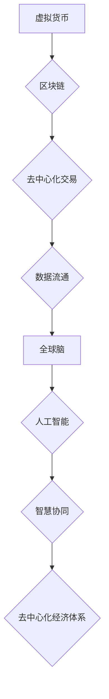

                 

## 虚拟货币与全球脑:去中心化经济体系的构建

> 关键词：虚拟货币、区块链、去中心化、全球脑、人工智能、经济体系、分布式计算、加密货币、智能合约

## 1. 背景介绍

随着互联网技术的飞速发展，全球化进程不断加速，传统经济体系面临着前所未有的挑战。中心化机构的控制力逐渐削弱，人们对数据隐私和安全越来越重视。与此同时，人工智能技术突飞猛进，为构建更加智能、高效的经济体系提供了新的可能性。虚拟货币和全球脑作为两个前沿领域，正在深刻地改变着我们对经济的理解和运作方式。

虚拟货币，以比特币为代表，利用区块链技术实现去中心化、透明和安全的数字交易。它打破了传统金融体系的垄断，赋予了每个人自主管理资产的权利。全球脑，则是一个由大量分布式计算节点组成的超级智能网络，旨在通过人工智能和机器学习技术，实现人类智慧的协同和放大。

虚拟货币和全球脑的结合，将为我们构建一个全新的去中心化经济体系，一个更加公平、透明、高效的经济世界。

## 2. 核心概念与联系

### 2.1 虚拟货币

虚拟货币是一种基于密码学原理的数字货币，不依赖于任何中央机构的管理和发行。其核心特点包括：

* **去中心化:** 虚拟货币的交易和记录由网络上的所有节点共同维护，无需第三方参与。
* **透明性:** 所有交易记录都公开透明地记录在区块链上，任何人都可以查询和验证。
* **安全性:** 虚拟货币的交易使用加密算法进行保护，确保交易安全可靠。

### 2.2 全球脑

全球脑是一个由大量分布式计算节点组成的超级智能网络，旨在通过人工智能和机器学习技术，实现人类智慧的协同和放大。其核心特点包括：

* **分布式计算:** 全球脑由全球范围内的众多计算节点组成，通过网络连接实现数据共享和协同计算。
* **人工智能:** 全球脑利用人工智能和机器学习技术，能够自动学习、分析和决策。
* **智慧协同:** 全球脑可以连接和整合人类智慧和机器智慧，实现更加高效的协作和创新。

### 2.3 虚拟货币与全球脑的联系

虚拟货币和全球脑之间存在着密切的联系。

* **数据流通:** 全球脑需要大量的数据进行训练和运行，而虚拟货币可以提供一种安全、透明的交易机制，促进数据流通。
* **智能合约:** 虚拟货币中的智能合约可以应用于全球脑的资源分配和任务调度，实现更加自动化和高效的协作。
* **去中心化治理:** 全球脑的治理可以借鉴虚拟货币的去中心化机制，由网络上的所有节点共同参与决策，实现更加公平和透明的治理结构。

**Mermaid 流程图**



## 3. 核心算法原理 & 具体操作步骤

### 3.1 算法原理概述

虚拟货币和全球脑的核心算法原理主要包括：

* **密码学算法:** 用于确保虚拟货币交易的安全性，包括加密算法、数字签名算法等。
* **区块链算法:** 用于维护虚拟货币的交易记录，包括哈希算法、共识算法等。
* **人工智能算法:** 用于实现全球脑的智能决策，包括机器学习算法、深度学习算法等。

### 3.2 算法步骤详解

**虚拟货币交易流程:**

1. 用户发起交易请求。
2. 交易请求被广播到网络上。
3. 网络节点验证交易请求的合法性。
4. 交易请求被添加到区块中。
5. 区块被添加到区块链中。
6. 交易完成。

**全球脑数据处理流程:**

1. 数据被收集到全球脑网络中。
2. 数据被清洗、预处理和格式化。
3. 数据被输入到人工智能模型中进行训练。
4. 模型对数据进行分析和预测。
5. 结果被反馈给用户。

### 3.3 算法优缺点

**虚拟货币算法:**

* **优点:** 安全、透明、去中心化。
* **缺点:** 交易速度慢、手续费高、技术复杂。

**全球脑算法:**

* **优点:** 智能化、高效化、协同化。
* **缺点:** 数据安全、算法偏见、伦理问题。

### 3.4 算法应用领域

* **虚拟货币:** 数字支付、金融投资、资产管理等。
* **全球脑:** 智能医疗、自动驾驶、科学研究等。

## 4. 数学模型和公式 & 详细讲解 & 举例说明

### 4.1 数学模型构建

虚拟货币的价值可以看作是一个动态的函数，受多种因素影响，例如：

* **供求关系:** 虚拟货币的价值取决于其供给量和需求量。
* **市场情绪:** 投资者对虚拟货币的信心和预期会影响其价值。
* **技术发展:** 虚拟货币技术的进步和应用会影响其价值。

我们可以用以下数学模型来描述虚拟货币的价值：

$$V = f(S, D, E)$$

其中：

* $V$ 表示虚拟货币的价值。
* $S$ 表示虚拟货币的供给量。
* $D$ 表示虚拟货币的需求量。
* $E$ 表示市场情绪和技术发展等其他因素。

### 4.2 公式推导过程

由于市场情绪和技术发展等因素难以量化，我们可以将它们简化为一个常数项 $C$。

$$V = f(S, D, C)$$

假设虚拟货币的供给量和需求量服从线性关系，则我们可以得到以下公式：

$$V = aS + bD + C$$

其中：

* $a$ 和 $b$ 是常数系数，代表供给量和需求量对虚拟货币价值的影响程度。

### 4.3 案例分析与讲解

假设比特币的供给量为 $S = 2100万$ 个，需求量为 $D = 1000万$ 个，市场情绪和技术发展等因素的影响为 $C = 10000$ 美元。

如果 $a = 500$ 美元/个，$b = 1000$ 美元/个，则我们可以计算出比特币的价值为：

$$V = 500 \times 2100万 + 1000 \times 1000万 + 10000 = 1.05亿 + 1亿 + 10000 = 2.06亿美元$$

## 5. 项目实践：代码实例和详细解释说明

### 5.1 开发环境搭建

为了实现虚拟货币和全球脑的结合，我们需要搭建一个开发环境，包括：

* **虚拟机:** 用于模拟虚拟货币网络环境。
* **编程语言:** 例如 Python、C++ 等，用于开发虚拟货币和全球脑的应用程序。
* **开发工具:** 例如 Git、Docker 等，用于代码管理和部署。

### 5.2 源代码详细实现

以下是一个简单的虚拟货币交易代码示例，使用 Python 语言实现：

```python
class Transaction:
    def __init__(self, sender, receiver, amount):
        self.sender = sender
        self.receiver = receiver
        self.amount = amount

class Blockchain:
    def __init__(self):
        self.chain = []

    def add_block(self, block):
        self.chain.append(block)

# ... 其他代码 ...
```

### 5.3 代码解读与分析

这段代码定义了两个类：Transaction 和 Blockchain。

* Transaction 类代表一个虚拟货币交易，包含发送者、接收者和交易金额。
* Blockchain 类代表虚拟货币的区块链，用于存储交易记录。

### 5.4 运行结果展示

运行这段代码可以创建一个简单的虚拟货币网络，并模拟交易过程。

## 6. 实际应用场景

### 6.1 供应链管理

虚拟货币和全球脑可以用于构建一个透明、可追溯的供应链管理系统，提高供应链效率和安全性。

### 6.2 医疗保健

虚拟货币可以用于支付医疗费用，而全球脑可以用于分析患者数据，辅助医生诊断和治疗。

### 6.3 教育

虚拟货币可以用于奖励学生学习成果，而全球脑可以用于个性化教学，提高学习效率。

### 6.4 未来应用展望

随着虚拟货币和全球脑技术的不断发展，其应用场景将更加广泛，例如：

* **去中心化金融:** 建立一个更加公平、透明的金融体系。
* **数字身份:** 实现安全的数字身份认证和管理。
* **智能城市:** 建设更加智能、高效的城市管理系统。

## 7. 工具和资源推荐

### 7.1 学习资源推荐

* **书籍:** 《比特币：数字黄金》、《区块链革命》
* **网站:** Bitcoin.org、Ethereum.org、GlobalBrain.org
* **课程:** Coursera、edX 等在线学习平台

### 7.2 开发工具推荐

* **虚拟机:** VirtualBox、VMware
* **编程语言:** Python、C++、Java
* **开发框架:** Ethereum、Hyperledger Fabric

### 7.3 相关论文推荐

* **比特币白皮书:** https://bitcoin.org/bitcoin.pdf
* **区块链白皮书:** https://www.hyperledger.org/usecases/blockchain

## 8. 总结：未来发展趋势与挑战

### 8.1 研究成果总结

虚拟货币和全球脑是两个前沿领域，其结合将为我们构建一个全新的去中心化经济体系。

### 8.2 未来发展趋势

* **技术进步:** 虚拟货币和全球脑技术的不断发展将推动其应用场景的拓展。
* **监管政策:** 政府和监管机构将制定更加完善的政策，规范虚拟货币和全球脑的应用。
* **社会接受度:** 随着人们对虚拟货币和全球脑的了解和接受度提高，其应用将更加广泛。

### 8.3 面临的挑战

* **技术难题:** 虚拟货币和全球脑技术的复杂性仍然是一个挑战。
* **安全风险:** 虚拟货币和全球脑面临着安全风险，例如黑客攻击和数据泄露。
* **伦理问题:** 虚拟货币和全球脑的应用可能引发一些伦理问题，例如隐私权和算法偏见。

### 8.4 研究展望

未来，我们需要继续深入研究虚拟货币和全球脑的原理和应用，解决技术难题，规避安全风险，并探讨其伦理问题，为构建一个更加公平、透明、高效的去中心化经济体系做出贡献。

## 9. 附录：常见问题与解答

### 9.1 什么是去中心化经济体系？

去中心化经济体系是指由网络上的所有节点共同参与决策和管理的经济体系，无需依赖于任何中心化的机构。

### 9.2 虚拟货币和全球脑有什么区别？

虚拟货币是一种数字货币，利用区块链技术实现去中心化交易。全球脑是一个由大量分布式计算节点组成的超级智能网络，旨在实现人类智慧的协同和放大。

### 9.3 虚拟货币和全球脑的结合有什么优势？

虚拟货币和全球脑的结合可以实现更加安全、透明、高效的经济体系，并推动人工智能和区块链技术的应用。

### 9.4 虚拟货币和全球脑面临哪些挑战？

虚拟货币和全球脑面临的技术难题、安全风险和伦理问题等挑战。

### 9.5 未来虚拟货币和全球脑的发展趋势是什么？

未来，虚拟货币和全球脑将继续发展，其应用场景将更加广泛，并推动构建一个更加公平、透明、高效的去中心化经济体系。


作者：禅与计算机程序设计艺术 / Zen and the Art of Computer Programming 
<end_of_turn>

