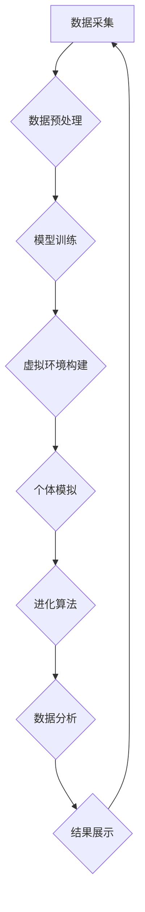

                 

## 虚拟进化模拟器设计师：AI驱动的数字生态系统实验室主管

> 关键词：虚拟进化模拟器、AI驱动的生态系统、数字实验室、进化算法、机器学习、系统仿真、复杂系统、数据驱动

## 1. 背景介绍

在当今数据爆炸和计算能力飞速发展的时代，我们对复杂系统行为的理解和预测能力面临着前所未有的挑战。从气候变化到金融市场波动，从生物进化到社会网络演变，这些复杂的系统都呈现出非线性、自组织和反馈机制等特征，难以用传统方法进行精确建模和分析。

虚拟进化模拟器（VES）作为一种新兴的工具，为我们探索和理解复杂系统提供了全新的视角。它通过模拟虚拟环境中的生物或智能体进化过程，可以揭示系统内在的规律和演化趋势，并为现实世界问题提供启发和解决方案。

## 2. 核心概念与联系

**2.1 虚拟进化模拟器 (VES)**

VES是一种基于计算机的仿真系统，模拟生物或智能体在虚拟环境中的进化过程。它通常包含以下核心要素：

* **虚拟环境:** 模拟真实世界或特定领域的虚拟空间，包含资源、环境条件、竞争机制等要素。
* **个体:** 模拟生物或智能体，具有特定的基因、行为和适应能力。
* **进化机制:** 通过遗传算法、变异操作和自然选择等机制，驱动个体在虚拟环境中进化和适应。
* **观察和分析:** 收集模拟过程中的数据，并通过统计分析、可视化等手段，揭示系统行为的规律和演化趋势。

**2.2 AI驱动的生态系统**

AI驱动的生态系统是指利用人工智能技术，构建和管理虚拟生态系统。它可以将机器学习、深度学习等技术融入到VES中，使模拟系统更加智能化、动态化和可预测性。

**2.3 数字实验室**

数字实验室是指利用计算机技术，构建虚拟实验环境，进行科学研究和技术开发。VES可以作为数字实验室的重要组成部分，为研究人员提供一个安全、可控和可重复的实验平台。

**2.4 流程图**



## 3. 核心算法原理 & 具体操作步骤

**3.1 算法原理概述**

VES的核心算法通常基于进化算法，例如遗传算法、模拟退火算法和粒子群算法等。这些算法模拟自然界生物的进化过程，通过迭代优化个体特征，最终达到适应环境的目标。

**3.2 算法步骤详解**

1. **初始化:** 创建初始种群，每个个体具有随机生成的基因或特征。
2. **评估适应度:** 根据个体在虚拟环境中的表现，计算其适应度值。适应度值越高，表示个体越适合环境。
3. **选择:** 根据适应度值，选择部分个体进行下一代的繁殖。
4. **交叉:** 将选中的个体进行交叉操作，产生新的个体。
5. **变异:** 对新的个体进行变异操作，增加基因多样性。
6. **重复:** 重复以上步骤，直到达到预设的进化代数或目标适应度值。

**3.3 算法优缺点**

**优点:**

* **全局搜索能力强:** 能够探索整个搜索空间，找到全局最优解。
* **适应复杂问题:** 可以处理具有多目标、多约束和非线性特征的复杂问题。
* **并行化处理:** 算法步骤可以并行化处理，提高计算效率。

**缺点:**

* **收敛速度慢:** 进化过程可能需要很多迭代才能收敛。
* **参数设置敏感:** 算法性能受参数设置的影响较大。
* **易陷入局部最优:** 算法可能陷入局部最优解，无法找到全局最优解。

**3.4 算法应用领域**

* **生物进化研究:** 模拟生物进化过程，研究物种多样性、适应性进化等问题。
* **人工智能开发:** 优化机器学习模型参数，提高模型性能。
* **优化设计:** 优化工程设计方案，例如结构设计、电路设计等。
* **金融市场预测:** 预测金融市场趋势，进行投资决策。

## 4. 数学模型和公式 & 详细讲解 & 举例说明

**4.1 数学模型构建**

VES的数学模型通常基于个体适应度和环境反馈的动态关系。个体适应度可以表示为一个函数，该函数依赖于个体特征、环境条件和个体行为等因素。环境反馈则通过改变环境条件、资源分配等方式，影响个体生存和繁殖。

**4.2 公式推导过程**

假设个体适应度函数为 $f(x)$，其中 $x$ 代表个体特征向量。环境反馈可以通过一个状态转移矩阵 $T$ 来表示，该矩阵描述了环境状态随时间变化的规律。

个体适应度随时间变化的方程可以表示为：

$$
f(x_{t+1}) = f(x_t) + \alpha \cdot T(x_t)
$$

其中，$x_t$ 代表第 $t$ 代个体的特征向量，$x_{t+1}$ 代表第 $t+1$ 代个体的特征向量，$\alpha$ 代表环境反馈强度。

**4.3 案例分析与讲解**

例如，模拟一个简单的生态系统，其中个体特征包括体型大小和觅食效率。环境条件包括食物资源和捕食者的数量。

个体适应度函数可以定义为：

$$
f(x) = \text{体型大小} \cdot \text{觅食效率} - \text{捕食者数量}
$$

环境反馈矩阵可以根据食物资源和捕食者数量的变化来设定。

通过模拟个体在虚拟环境中的进化过程，可以观察体型大小和觅食效率的变化趋势，以及生态系统整体的稳定性和多样性。

## 5. 项目实践：代码实例和详细解释说明

**5.1 开发环境搭建**

VES的开发环境可以基于Python语言和相关库进行搭建。常用的库包括NumPy、SciPy、Matplotlib等。

**5.2 源代码详细实现**

```python
import numpy as np

# 定义个体特征
class Individual:
    def __init__(self, size, efficiency):
        self.size = size
        self.efficiency = efficiency

    def fitness(self, food, predator):
        return self.size * self.efficiency - predator

# 定义种群
class Population:
    def __init__(self, size, size_range, efficiency_range):
        self.individuals = [Individual(np.random.uniform(size_range[0], size_range[1]),
                                      np.random.uniform(efficiency_range[0], efficiency_range[1]))
                           for _ in range(size)]

    def evolve(self, food, predator, generations):
        for _ in range(generations):
            # 选择、交叉、变异操作
            # ...
            # 计算适应度
            # ...
            # 更新种群
            # ...

# 模拟环境
food = 100
predator = 20

# 创建种群
population = Population(size=100, size_range=(1, 10), efficiency_range=(0.1, 1))

# 进化
population.evolve(food, predator, generations=100)

# 展示结果
# ...
```

**5.3 代码解读与分析**

代码示例展示了VES的基本框架，包括个体、种群、环境和进化算法。

* `Individual` 类定义了每个个体的特征和适应度计算方法。
* `Population` 类管理种群的个体，并实现选择、交叉、变异等进化操作。
* `evolve()` 函数模拟进化过程，迭代优化种群的个体特征。

**5.4 运行结果展示**

运行代码后，可以观察到个体特征随时间变化的趋势，例如体型大小和觅食效率的变化。

## 6. 实际应用场景

**6.1 生物学研究**

VES可以用于模拟生物进化过程，研究物种多样性、适应性进化、生态系统稳定性等问题。例如，模拟不同环境条件下细菌的进化，研究抗生素耐药性的产生机制。

**6.2 工程设计**

VES可以用于优化工程设计方案，例如结构设计、电路设计、材料选择等。例如，模拟不同结构参数下桥梁的强度和稳定性，找到最优的结构设计方案。

**6.3 医疗保健**

VES可以用于模拟疾病传播过程，研究传染病的流行趋势和控制策略。例如，模拟不同疫苗接种策略下流感病毒的传播，评估疫苗接种的有效性。

**6.4 未来应用展望**

随着人工智能技术的不断发展，VES将有更广泛的应用场景。例如，可以用于模拟城市发展、社会网络演变、金融市场波动等复杂系统，为决策者提供更精准的预测和建议。

## 7. 工具和资源推荐

**7.1 学习资源推荐**

* **书籍:**
    * 《进化算法》
    * 《人工智能：现代方法》
    * 《复杂系统》
* **在线课程:**
    * Coursera: Evolutionary Algorithms
    * edX: Artificial Intelligence
    * Udacity: Machine Learning

**7.2 开发工具推荐**

* **Python:** 
    * NumPy
    * SciPy
    * Matplotlib
    * Pygame
* **其他语言:**
    * C++
    * Java
    * R

**7.3 相关论文推荐**

* **进化算法:**
    * Holland, J. H. (1992). Adaptation in natural and artificial systems. MIT press.
    * Goldberg, D. E. (1989). Genetic algorithms in search, optimization, and machine learning. Addison-Wesley.
* **人工智能:**
    * LeCun, Y., Bengio, Y., & Hinton, G. (2015). Deep learning. Nature, 521(7553), 436-444.
    * Russell, S. J., & Norvig, P. (2010). Artificial intelligence: A modern approach. Pearson Education.

## 8. 总结：未来发展趋势与挑战

**8.1 研究成果总结**

VES作为一种新兴的工具，在生物学、工程学、医疗保健等领域取得了显著的成果。它为我们理解复杂系统行为提供了新的视角，并为解决现实世界问题提供了新的思路和方法。

**8.2 未来发展趋势**

* **更智能的模拟系统:** 利用人工智能技术，构建更智能、更动态、更可预测的虚拟生态系统。
* **更广泛的应用场景:** 将VES应用于更多领域，例如城市规划、社会科学研究、金融风险管理等。
* **更强大的计算能力:** 利用云计算和高性能计算技术，模拟更大规模、更复杂的虚拟生态系统。

**8.3 面临的挑战**

* **模型复杂度:** 建立准确、可靠的VES模型仍然是一个挑战，需要不断改进算法和数据处理方法。
* **数据获取和处理:** VES需要大量的数据进行训练和验证，数据获取和处理仍然是一个瓶颈。
* **伦理问题:** VES的应用可能会引发一些伦理问题，例如算法偏见、数据隐私等，需要引起重视和讨论。

**8.4 研究展望**

未来，VES将继续朝着更智能、更广泛、更强大的方向发展。随着人工智能技术的进步和计算能力的提升，VES将为我们理解和应对复杂世界问题提供更强大的工具和方法。

## 9. 附录：常见问题与解答

**9.1 如何选择合适的进化算法？**

选择合适的进化算法取决于具体应用场景和问题特点。例如，对于具有多目标优化的问题，可以考虑使用多目标遗传算法；对于具有连续特征的优化问题，可以考虑使用粒子群算法。

**9.2 如何评估VES模型的性能？**

VES模型的性能可以评估为以下几个方面：

* **准确性:** 模型预测结果与实际结果的吻合程度。
* **鲁棒性:** 模型对数据噪声和环境变化的适应能力。
* **效率:** 模型训练和运行的时间成本。

**9.3 VES模型的伦理问题有哪些？**

VES模型的应用可能会引发一些伦理问题，例如：

* **算法偏见:** 训练数据可能存在偏见，导致模型输出结果也存在偏见。
* **数据隐私:** VES模型需要大量数据进行训练，可能会涉及到个人隐私问题。
* **责任归属:** VES模型的决策结果可能会对现实世界产生影响，需要明确责任归属。


作者：禅与计算机程序设计艺术 / Zen and the Art of Computer Programming 
<end_of_turn>

