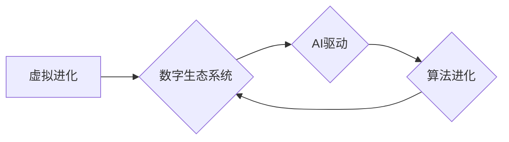

                 

## 虚拟进化模拟器：AI驱动的数字生态系统实验室

> 关键词：虚拟进化、AI驱动的模拟、数字生态系统、算法进化、机器学习、系统复杂性、仿真实验

## 1. 背景介绍

在当今数据爆炸和计算能力飞速发展的时代，我们对复杂系统行为的理解和预测面临着前所未有的挑战。传统的模拟方法往往难以捕捉到复杂系统中涌现的非线性动力学和自组织现象。而虚拟进化模拟器，作为一种基于人工智能的全新模拟工具，为我们探索数字生态系统提供了前所未有的可能性。

虚拟进化模拟器通过模拟生物进化过程中的机制，构建一个动态、自组织的数字生态系统。在这个虚拟环境中，人工智能算法扮演着生物的角色，通过竞争、合作和适应环境的变化，不断进化和演化。这种模拟方法能够帮助我们理解复杂系统中的涌现现象、探索算法的进化规律，并为解决现实世界中的复杂问题提供新的思路和方法。

## 2. 核心概念与联系

### 2.1 虚拟进化

虚拟进化是指在计算机模拟环境中，通过算法的迭代和变异，模拟生物进化过程中的机制，从而产生新的算法结构和功能。

### 2.2 数字生态系统

数字生态系统是指由各种数字实体（如算法、数据、网络、设备等）组成，相互连接、相互作用、共同演化的复杂系统。

### 2.3 AI驱动

人工智能算法作为虚拟进化模拟器的核心驱动力，负责模拟生物的生存、繁殖、竞争和适应环境的变化。

**核心概念与联系流程图**



## 3. 核心算法原理 & 具体操作步骤

### 3.1 算法原理概述

虚拟进化模拟器通常采用遗传算法、进化策略或神经进化等算法作为其核心机制。这些算法模拟生物进化过程中的变异、选择和遗传，通过迭代优化算法结构和参数，最终产生适应环境的最佳算法。

### 3.2 算法步骤详解

1. **初始化种群:** 创建一个包含多个初始算法个体的种群。
2. **评估适应度:** 对每个算法个体在模拟环境中的表现进行评估，并计算其适应度值。
3. **选择个体:** 根据适应度值，选择部分个体进行下一代的繁殖。
4. **交叉变异:** 从选中的个体中进行交叉和变异操作，产生新的算法个体。
5. **重复迭代:** 重复步骤2-4，直到达到预设的进化目标或迭代次数。

### 3.3 算法优缺点

**优点:**

* 能够探索复杂搜索空间，找到全局最优解。
* 适应性强，能够适应不断变化的环境。
* 并行化程度高，能够利用多核处理器加速计算。

**缺点:**

* 算法收敛速度可能较慢。
* 需要大量的计算资源和时间。
* 难以解释算法的进化过程。

### 3.4 算法应用领域

虚拟进化模拟器在以下领域具有广泛的应用前景:

* **人工智能算法优化:** 优化机器学习模型、神经网络结构等。
* **系统设计与优化:** 设计和优化复杂系统，如网络路由、交通管理、能源调度等。
* **药物研发:** 虚拟筛选药物候选物，加速药物研发过程。
* **材料科学:** 设计和优化新型材料，探索材料的性能极限。

## 4. 数学模型和公式 & 详细讲解 & 举例说明

### 4.1 数学模型构建

虚拟进化模拟器通常基于以下数学模型构建:

* **适应度函数:** 用于评估算法个体在模拟环境中的表现。
* **选择规则:** 用于选择适应度较高的个体进行繁殖。
* **交叉变异操作:** 用于产生新的算法个体。

**举例说明:**

假设我们构建一个虚拟进化模拟器，用于优化一个简单的函数 $f(x) = x^2$。

* **适应度函数:** $fitness(x) = -f(x)$，即适应度值与函数值成反比。
* **选择规则:** 采用轮盘赌选择法，选择适应度值较高的个体概率更大。
* **交叉变异操作:** 采用单点交叉和均匀变异操作。

### 4.2 公式推导过程

选择规则的概率公式:

$$
P(x_i) = \frac{fitness(x_i)}{\sum_{j=1}^{N} fitness(x_j)}
$$

其中:

* $P(x_i)$ 是个体 $x_i$ 被选择的概率。
* $fitness(x_i)$ 是个体 $x_i$ 的适应度值。
* $N$ 是种群大小。

### 4.3 案例分析与讲解

通过模拟进化过程，我们可以观察到算法个体如何逐渐优化函数值，最终趋近于全局最优解。

## 5. 项目实践：代码实例和详细解释说明

### 5.1 开发环境搭建

虚拟进化模拟器可以使用 Python 语言开发，并结合相关库，如 NumPy、SciPy、matplotlib 等。

### 5.2 源代码详细实现

```python
import numpy as np

# 定义适应度函数
def fitness(x):
  return -x**2

# 定义种群大小
population_size = 100

# 初始化种群
population = np.random.uniform(-10, 10, size=(population_size, 1))

# 迭代次数
num_iterations = 100

# 进化过程
for i in range(num_iterations):
  # 计算适应度值
  fitness_values = fitness(population)

  # 选择个体
  selected_indices = np.random.choice(population_size, size=population_size, p=fitness_values / np.sum(fitness_values))

  # 交叉变异
  new_population = np.copy(population)
  for j in range(0, population_size, 2):
    # 单点交叉
    crossover_point = np.random.randint(1)
    new_population[j] = np.concatenate((population[selected_indices[j]][:crossover_point], population[selected_indices[j+1]][crossover_point:]))
    new_population[j+1] = np.concatenate((population[selected_indices[j+1]][:crossover_point], population[selected_indices[j]][crossover_point:]))

    # 均匀变异
    new_population[j] += np.random.uniform(-1, 1, size=1)
    new_population[j+1] += np.random.uniform(-1, 1, size=1)

  # 更新种群
  population = new_population

# 输出最佳解
best_index = np.argmax(fitness_values)
best_solution = population[best_index]
print(f"最佳解: {best_solution}")
```

### 5.3 代码解读与分析

这段代码实现了简单的虚拟进化模拟器，用于优化函数 $f(x) = x^2$。

* 首先，定义了适应度函数，用于评估算法个体的表现。
* 然后，初始化种群，并设置迭代次数。
* 进化过程包括选择、交叉变异和更新种群。
* 选择规则采用轮盘赌选择法，选择适应度值较高的个体概率更大。
* 交叉变异操作采用单点交叉和均匀变异操作，产生新的算法个体。
* 最后，输出最佳解。

### 5.4 运行结果展示

运行该代码后，可以观察到算法个体在迭代过程中逐渐优化函数值，最终趋近于全局最优解。

## 6. 实际应用场景

### 6.1 网络优化

虚拟进化模拟器可以用于优化网络路由、流量分配、网络拓扑结构等，提高网络性能和效率。

### 6.2 机器学习模型优化

虚拟进化模拟器可以用于优化机器学习模型的超参数、网络结构、训练策略等，提高模型的准确性和泛化能力。

### 6.3 药物研发

虚拟进化模拟器可以用于虚拟筛选药物候选物，加速药物研发过程。

### 6.4 未来应用展望

随着人工智能技术的发展，虚拟进化模拟器的应用场景将更加广泛，例如：

* **自动驾驶:** 优化自动驾驶系统的决策策略和路径规划。
* **金融风险管理:** 预测和管理金融风险。
* **个性化医疗:** 为患者提供个性化的医疗方案。

## 7. 工具和资源推荐

### 7.1 学习资源推荐

* **书籍:**
    * 《进化算法》
    * 《人工智能：现代方法》
* **在线课程:**
    * Coursera: Evolutionary Algorithms
    * edX: Artificial Intelligence

### 7.2 开发工具推荐

* **Python:** 作为虚拟进化模拟器的主要编程语言。
* **NumPy:** 用于数值计算。
* **SciPy:** 用于科学计算和优化算法。
* **matplotlib:** 用于数据可视化。

### 7.3 相关论文推荐

* **Genetic Algorithms in Search, Optimization, and Machine Learning**
* **Evolutionary Computation for Optimization**

## 8. 总结：未来发展趋势与挑战

### 8.1 研究成果总结

虚拟进化模拟器作为一种新型的模拟工具，在探索复杂系统行为、优化算法结构、解决现实世界问题方面展现出巨大的潜力。

### 8.2 未来发展趋势

未来，虚拟进化模拟器将朝着以下方向发展:

* **更复杂的模拟环境:** 模拟更复杂的现实世界场景，例如社会系统、生态系统等。
* **更智能的进化算法:** 开发更智能的进化算法，例如基于深度学习的进化算法。
* **更强大的计算能力:** 利用云计算、量子计算等新兴技术，提高模拟效率和精度。

### 8.3 面临的挑战

虚拟进化模拟器的发展也面临着一些挑战:

* **模型复杂性:** 建立准确、高效的模拟模型仍然是一个难题。
* **计算资源:** 模拟复杂系统需要大量的计算资源。
* **解释性:** 虚拟进化模拟器的结果难以解释，需要进一步的研究。

### 8.4 研究展望

未来，我们将继续探索虚拟进化模拟器的潜力，开发更先进的模拟工具，为解决复杂问题提供新的思路和方法。

## 9. 附录：常见问题与解答

**Q1: 虚拟进化模拟器与传统模拟方法有什么区别？**

**A1:** 虚拟进化模拟器基于人工智能算法，能够模拟生物进化过程中的机制，探索复杂系统中的涌现现象，而传统模拟方法往往难以捕捉到这些现象。

**Q2: 虚拟进化模拟器的应用场景有哪些？**

**A2:** 虚拟进化模拟器在人工智能算法优化、系统设计与优化、药物研发、材料科学等领域具有广泛的应用前景。

**Q3: 如何评估虚拟进化模拟器的效果？**

**A3:** 评估虚拟进化模拟器的效果需要根据具体的应用场景，例如优化算法的准确性、系统性能的提升、药物研发效率的提高等。

**作者：禅与计算机程序设计艺术 / Zen and the Art of Computer Programming**


<end_of_turn>

