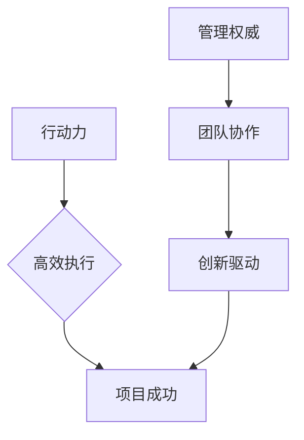

                 

## 行动力与管理权威的建立

> 关键词：行动力、管理权威、团队协作、技术领导力、高效执行、项目管理、沟通技巧、决策能力、创新驱动

### 1. 背景介绍

在当今瞬息万变的科技时代，技术革新日新月异，企业面临着前所未有的挑战和机遇。如何高效地组织和管理技术团队，激发团队成员的行动力和建立管理权威，成为企业成功的重要关键。

传统的管理模式往往强调层级和控制，而现代技术团队更需要灵活、高效、创新的管理方式。技术团队成员通常具有高度的专业技能和独立思考能力，他们更倾向于自主协作，追求技术突破和创新。因此，建立有效的管理权威需要不仅仅是命令式的控制，更需要通过沟通、激励和引导，激发团队成员的内在动力，形成高效协作的团队文化。

### 2. 核心概念与联系

**2.1 行动力与管理权威的本质**

* **行动力**是指团队成员能够快速响应需求，主动执行任务，并持续推进目标实现的能力。它体现了团队成员的积极性、责任感和执行力。
* **管理权威**是指团队领导者在团队成员心目中享有尊重和信任，能够有效地引导和协调团队成员，确保团队目标的达成。它建立在领导者的专业能力、沟通技巧、决策能力和团队管理经验的基础上。

**2.2  核心概念关系图**

**2.3  行动力与管理权威的相互作用**

行动力和管理权威是相互促进、相互依存的关系。

* **管理权威为行动力提供保障:** 当团队成员对领导者的决策和方向充满信任时，他们更容易积极行动，并为团队目标贡献力量。
* **行动力提升管理权威:** 当团队成员能够高效地执行任务，并取得良好的成果时，领导者的管理权威也会得到提升。

### 3. 核心算法原理 & 具体操作步骤

**3.1 算法原理概述**

建立行动力和管理权威的“算法”并非传统的编程算法，而是基于人际关系、团队管理和领导力等方面的原则和实践。

**3.2 算法步骤详解**

1. **明确目标和方向:** 领导者需要清晰地定义团队的目标和方向，并与团队成员进行充分沟通，确保团队成员对目标的理解和认同。
2. **赋予责任和授权:** 领导者需要根据团队成员的技能和能力，合理分配任务和责任，并给予他们足够的授权，让他们能够自主决策和执行。
3. **建立信任和沟通机制:** 领导者需要建立良好的沟通机制，及时与团队成员沟通，倾听他们的意见和建议，并及时解决他们的问题和困难。
4. **营造积极的团队文化:** 领导者需要营造积极、开放、包容的团队文化，鼓励团队成员之间的协作和学习，并为他们的成长提供支持和帮助。
5. **持续激励和认可:** 领导者需要及时对团队成员的贡献进行认可和奖励，并为他们提供持续的学习和成长机会，激发他们的内在动力。

**3.3 算法优缺点**

* **优点:** 能够有效地激发团队成员的行动力和创造力，提升团队的整体绩效。
* **缺点:** 需要领导者付出更多的精力和时间，建立信任和沟通机制需要持续的努力。

**3.4 算法应用领域**

该算法适用于所有需要高效协作和创新驱动型的团队，例如软件开发团队、产品设计团队、营销推广团队等。

### 4. 数学模型和公式 & 详细讲解 & 举例说明

**4.1 数学模型构建**

我们可以用一个简单的数学模型来描述行动力和管理权威之间的关系：

* **A:** 行动力指数
* **B:** 管理权威指数
* **C:** 团队绩效指数

模型公式：

$$C = f(A, B)$$

其中，f(A, B)是一个非线性函数，表示行动力和管理权威对团队绩效的影响。

**4.2 公式推导过程**

该模型的推导过程基于以下假设：

* 行动力指数A越高，团队成员的执行效率越高。
* 管理权威指数B越高，团队成员对领导者的信任和服从程度越高。
* 团队绩效指数C是行动力和管理权威共同作用的结果。

根据以上假设，我们可以推导出以下公式：

$$C = A^α * B^β$$

其中，α和β是两个正数，表示行动力和管理权威对团队绩效的影响权重。

**4.3 案例分析与讲解**

假设一个软件开发团队，其行动力指数A为8，管理权威指数B为6，则团队绩效指数C为：

$$C = 8^α * 6^β$$

如果α=0.7，β=0.3，则：

$$C = 8^{0.7} * 6^{0.3} ≈ 10.5$$

这表明，在这个团队中，行动力和管理权威共同作用，提升了团队的绩效。

### 5. 项目实践：代码实例和详细解释说明

**5.1 开发环境搭建**

为了更好地理解和实践行动力和管理权威的建立，我们可以使用一个简单的项目来进行模拟。

* 选择一个开源项目，例如一个小型博客系统。
* 使用常用的开发工具，例如Git、Docker、Kubernetes等。
* 建立一个虚拟的团队环境，模拟团队成员之间的角色和职责。

**5.2 源代码详细实现**

在项目实践中，我们可以通过以下步骤来模拟行动力和管理权威的建立：

1. **明确目标和方向:** 团队成员需要共同商讨并确定项目的开发目标和方向。
2. **赋予责任和授权:** 领导者需要根据团队成员的技能和能力，分配任务和责任，并给予他们足够的授权。
3. **建立信任和沟通机制:** 团队成员需要定期进行沟通，分享进度和遇到的问题，并及时解决问题。
4. **营造积极的团队文化:** 领导者需要鼓励团队成员之间的协作和学习，并为他们的成长提供支持和帮助。
5. **持续激励和认可:** 领导者需要及时对团队成员的贡献进行认可和奖励，并为他们提供持续的学习和成长机会。

**5.3 代码解读与分析**

通过观察团队成员的代码提交、沟通记录和项目进展情况，我们可以分析行动力和管理权威对项目的影响。

* 行动力高的团队成员，代码提交频率高，代码质量高，能够快速解决问题。
* 管理权威高的团队，成员之间协作顺畅，沟通高效，能够有效地完成项目目标。

**5.4 运行结果展示**

通过观察项目的最终成果，我们可以评估行动力和管理权威对项目成功的贡献。

* 行动力和管理权威建立良好的团队，能够高效地完成项目目标，并取得良好的成果。

### 6. 实际应用场景

**6.1  软件开发团队**

在软件开发团队中，行动力和管理权威的建立至关重要。高效的团队协作和快速迭代是软件开发的核心要素。

* 领导者需要明确项目目标和技术路线，并与团队成员进行充分沟通，确保团队成员对目标的理解和认同。
* 团队成员需要积极参与项目讨论，提出自己的想法和建议，并根据领导者的指示进行任务分配和执行。
* 领导者需要及时对团队成员的贡献进行认可和奖励，并为他们提供持续的学习和成长机会。

**6.2  产品设计团队**

在产品设计团队中，行动力和管理权威的建立可以帮助团队更快地完成产品设计和开发。

* 领导者需要明确产品的目标用户和市场需求，并与团队成员进行充分沟通，确保团队成员对产品的理解和认同。
* 团队成员需要积极参与产品设计和原型制作，并根据用户反馈进行迭代改进。
* 领导者需要及时对团队成员的设计方案进行反馈和评价，并为他们提供持续的学习和成长机会。

**6.3  营销推广团队**

在营销推广团队中，行动力和管理权威的建立可以帮助团队更有效地执行营销计划，并提升品牌知名度和市场份额。

* 领导者需要制定清晰的营销目标和策略，并与团队成员进行充分沟通，确保团队成员对目标的理解和认同。
* 团队成员需要积极参与营销活动策划和执行，并根据市场反馈进行调整优化。
* 领导者需要及时对团队成员的营销成果进行评估和反馈，并为他们提供持续的学习和成长机会。

**6.4 未来应用展望**

随着人工智能技术的不断发展，行动力和管理权威的建立将更加智能化和自动化。

* 人工智能可以帮助领导者更好地了解团队成员的技能和能力，并根据需要进行任务分配和授权。
* 人工智能可以帮助团队成员更好地协作和沟通，并提供个性化的学习和成长建议。
* 人工智能可以帮助领导者更好地评估团队绩效，并及时进行调整和优化。

### 7. 工具和资源推荐

**7.1 学习资源推荐**

* **书籍:**
    * 《高效能人士的七个习惯》
    * 《领导力》
    * 《团队动力》
* **在线课程:**
    * Coursera: 领导力与团队管理
    * Udemy: 项目管理
    * edX: 沟通技巧

**7.2 开发工具推荐**

* **版本控制:** Git
* **协作平台:** Slack, Microsoft Teams
* **项目管理工具:** Jira, Trello

**7.3 相关论文推荐**

* **行动力与团队绩效的关系:**
    *  The Relationship Between Proactive Personality and Team Performance: A Meta-Analysis
* **管理权威与团队合作的关系:**
    *  Leadership and Team Effectiveness: A Meta-Analysis
* **人工智能在团队管理中的应用:**
    *  Artificial Intelligence for Team Management: A Survey

### 8. 总结：未来发展趋势与挑战

**8.1 研究成果总结**

通过对行动力和管理权威的分析，我们发现它们是建立高效团队的关键要素。

* 行动力可以提升团队的执行效率和创新能力。
* 管理权威可以建立团队的信任和协作机制。

**8.2 未来发展趋势**

未来，随着人工智能技术的不断发展，行动力和管理权威的建立将更加智能化和自动化。

* 人工智能可以帮助领导者更好地了解团队成员的技能和能力，并根据需要进行任务分配和授权。
* 人工智能可以帮助团队成员更好地协作和沟通，并提供个性化的学习和成长建议。
* 人工智能可以帮助领导者更好地评估团队绩效，并及时进行调整和优化。

**8.3 面临的挑战**

尽管行动力和管理权威的建立具有重要的意义，但我们也面临着一些挑战：

* 如何平衡自动化和人性化管理？
* 如何确保人工智能技术的应用不会导致团队成员的失业或技能贬值？
* 如何防止人工智能技术被滥用，导致团队成员的隐私泄露或信息安全问题？

**8.4 研究展望**

未来，我们需要继续深入研究行动力和管理权威的建立，探索人工智能技术在团队管理中的应用，并制定相应的政策和措施，确保人工智能技术的应用能够真正造福于人类社会。

### 9. 附录：常见问题与解答

**9.1 如何提高团队成员的行动力？**

* 明确目标和方向，让团队成员了解自己的工作目标和意义。
* 赋予责任和授权，让团队成员能够自主决策和执行。
* 建立信任和沟通机制，及时解决团队成员遇到的问题和困难。
* 营造积极的团队文化，鼓励团队成员之间的协作和学习。
* 持续激励和认可，及时对团队成员的贡献进行认可和奖励。

**9.2 如何建立管理权威？**

* 提升专业能力，成为团队成员值得信赖的领导者。
* 具备良好的沟通技巧，能够有效地与团队成员沟通和协调。
* 拥有强烈的决策能力，能够在关键时刻做出正确的决策。
* 具备团队管理经验，能够有效地组织和管理团队成员。
* 坚持公平公正，对待团队成员一视同仁。

作者：禅与计算机程序设计艺术 / Zen and the Art of Computer Programming 
<end_of_turn>

