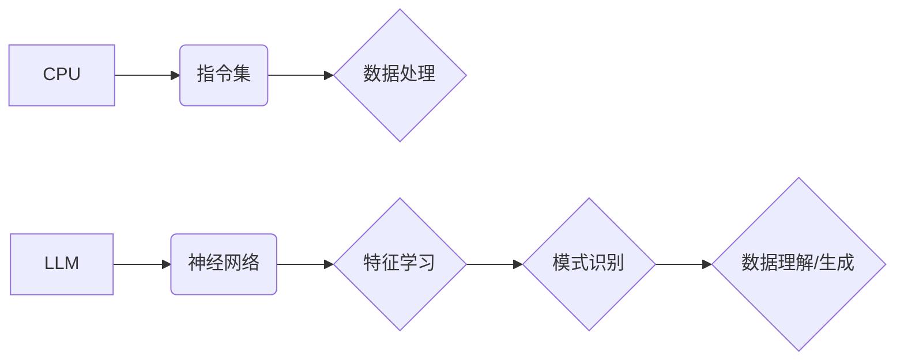

                 

## 计算范式的进化：从CPU到LLM的跨越

> 关键词：CPU, LLM, 计算范式, 深度学习, 自然语言处理, 算法, 模型, 应用场景

### 1. 背景介绍

自20世纪40年代电子计算机问世以来，计算范式经历了从指令集处理机（CPU）到深度学习模型（LLM）的飞速发展。CPU以其精细化的指令集和流水线架构，在几十年间主导了计算领域，为我们带来了信息处理的革命。然而，随着人工智能的兴起，特别是深度学习技术的突破，新的计算范式——基于神经网络的LLM开始崭露头角，并展现出强大的潜力，在自然语言处理、图像识别、代码生成等领域取得了令人瞩目的成就。

### 2. 核心概念与联系

**2.1 CPU计算范式**

CPU计算范式基于冯·诺伊曼体系结构，其核心是执行预先编写的指令集。程序员需要用低级语言编写指令，CPU按照指令序列进行数据处理。这种范式高效、可靠，但缺乏对复杂模式和非结构化数据的处理能力。

**2.2 LLM计算范式**

LLM计算范式基于深度神经网络，其核心是学习数据中的模式和关系。模型通过大量的训练数据，学习到复杂的特征表示，并能够对输入数据进行理解、生成和预测。这种范式能够处理复杂、非结构化的数据，并展现出强大的泛化能力。

**2.3 核心概念关系图**



### 3. 核心算法原理 & 具体操作步骤

**3.1 算法原理概述**

LLM的核心算法是基于Transformer架构的深度神经网络。Transformer网络通过自注意力机制，能够捕捉序列数据中的长距离依赖关系，并实现高效的并行计算。

**3.2 算法步骤详解**

1. **词嵌入:** 将输入文本中的每个词转换为稠密的向量表示，捕捉词语的语义信息。
2. **编码器:** 使用多层Transformer模块，将词向量序列编码成更高级的语义表示。
3. **解码器:** 使用多层Transformer模块，根据编码后的语义表示生成目标文本序列。
4. **损失函数:** 使用交叉熵损失函数，衡量模型预测结果与真实结果之间的差异。
5. **反向传播:** 使用梯度下降算法，更新模型参数，降低损失函数值。

**3.3 算法优缺点**

**优点:**

* 能够捕捉长距离依赖关系，处理长文本序列。
* 并行计算能力强，训练速度快。
* 泛化能力强，能够应用于多种自然语言处理任务。

**缺点:**

* 训练数据量大，计算资源需求高。
* 模型参数量大，部署成本高。
* 对训练数据质量要求高，容易受到噪声数据的影响。

**3.4 算法应用领域**

* 自然语言理解：文本分类、情感分析、问答系统
* 自然语言生成：机器翻译、文本摘要、对话系统
* 代码生成：自动代码补全、代码翻译
* 其他领域：图像识别、语音识别、音乐生成

### 4. 数学模型和公式 & 详细讲解 & 举例说明

**4.1 数学模型构建**

LLM模型的核心是Transformer网络，其结构由编码器和解码器组成。编码器使用多层Transformer模块，将输入文本序列编码成隐藏状态向量。解码器根据编码后的隐藏状态向量，生成目标文本序列。

**4.2 公式推导过程**

Transformer网络的核心是自注意力机制。自注意力机制通过计算每个词与所有其他词之间的相关性，捕捉序列数据中的长距离依赖关系。

**注意力权重计算公式:**

$$
\text{Attention}(Q, K, V) = \text{softmax}\left(\frac{Q K^T}{\sqrt{d_k}}\right) V
$$

其中：

* $Q$：查询矩阵
* $K$：键矩阵
* $V$：值矩阵
* $d_k$：键向量的维度
* $\text{softmax}$：softmax函数

**4.3 案例分析与讲解**

假设我们有一个句子：“The cat sat on the mat”。

使用自注意力机制，我们可以计算每个词与所有其他词之间的相关性。例如，"cat"与"sat"之间的相关性较高，因为它们在语义上紧密相关。

通过计算所有词之间的注意力权重，我们可以得到一个隐藏状态向量，该向量包含了句子中所有词语的语义信息。

### 5. 项目实践：代码实例和详细解释说明

**5.1 开发环境搭建**

* Python 3.7+
* PyTorch 1.7+
* CUDA 10.2+

**5.2 源代码详细实现**

```python
import torch
import torch.nn as nn

class Transformer(nn.Module):
    def __init__(self, vocab_size, embedding_dim, num_heads, num_layers):
        super(Transformer, self).__init__()
        self.embedding = nn.Embedding(vocab_size, embedding_dim)
        self.encoder = nn.TransformerEncoder(nn.TransformerEncoderLayer(embedding_dim, num_heads), num_layers)
        self.decoder = nn.TransformerDecoder(nn.TransformerDecoderLayer(embedding_dim, num_heads), num_layers)
        self.linear = nn.Linear(embedding_dim, vocab_size)

    def forward(self, src, tgt, src_mask, tgt_mask):
        src = self.embedding(src)
        tgt = self.embedding(tgt)
        encoder_output = self.encoder(src, src_mask)
        decoder_output = self.decoder(tgt, encoder_output, tgt_mask)
        output = self.linear(decoder_output)
        return output
```

**5.3 代码解读与分析**

* Transformer类定义了Transformer网络的结构。
* embedding层将词向量化。
* encoder和decoder层分别负责编码和解码。
* linear层将隐藏状态向量映射到输出词汇表。
* forward方法定义了模型的输入和输出。

**5.4 运行结果展示**

训练好的LLM模型可以用于各种自然语言处理任务，例如机器翻译、文本摘要、对话系统等。

### 6. 实际应用场景

**6.1 自然语言理解**

LLM可以用于文本分类、情感分析、问答系统等任务。例如，可以训练一个LLM模型来识别新闻文章的主题，或者分析社交媒体评论的情绪倾向。

**6.2 自然语言生成**

LLM可以用于机器翻译、文本摘要、对话系统等任务。例如，可以训练一个LLM模型来翻译英文文本到中文，或者生成一篇新闻文章的摘要。

**6.3 代码生成**

LLM可以用于自动代码补全、代码翻译等任务。例如，可以训练一个LLM模型来根据代码上下文自动补全代码片段，或者将一种编程语言的代码翻译成另一种编程语言的代码。

**6.4 未来应用展望**

LLM的应用场景还在不断扩展，未来可能会应用于更多领域，例如：

* 教育：个性化学习、智能辅导
* 医疗：疾病诊断、药物研发
* 娱乐：游戏开发、内容创作

### 7. 工具和资源推荐

**7.1 学习资源推荐**

* **书籍:**
    * 《深度学习》
    * 《自然语言处理》
* **在线课程:**
    * Coursera: 自然语言处理
    * Udacity: 深度学习

**7.2 开发工具推荐**

* **框架:**
    * PyTorch
    * TensorFlow
* **库:**
    * Hugging Face Transformers
    * Gensim

**7.3 相关论文推荐**

* 《Attention Is All You Need》
* 《BERT: Pre-training of Deep Bidirectional Transformers for Language Understanding》

### 8. 总结：未来发展趋势与挑战

**8.1 研究成果总结**

LLM的出现标志着计算范式的重大转变，为人工智能的发展带来了新的机遇。

**8.2 未来发展趋势**

* 模型规模的进一步扩大
* 训练数据的多样化和高质量化
* 计算资源的优化和利用
* 算法的创新和改进

**8.3 面临的挑战**

* 训练成本高
* 模型解释性差
* 数据偏见和公平性问题
* 安全性和隐私问题

**8.4 研究展望**

未来，LLM的研究将继续朝着更强大、更安全、更可解释的方向发展。


### 9. 附录：常见问题与解答

**9.1 如何选择合适的LLM模型？**

选择合适的LLM模型取决于具体的应用场景和需求。例如，对于文本分类任务，可以使用BERT模型；对于机器翻译任务，可以使用T5模型。

**9.2 如何训练自己的LLM模型？**

训练自己的LLM模型需要大量的计算资源和训练数据。可以使用开源的框架和库，例如PyTorch和Hugging Face Transformers，来简化训练过程。

**9.3 如何部署LLM模型？**

LLM模型的部署可以采用云端部署、边缘部署等方式。需要根据实际应用场景选择合适的部署方式。


作者：禅与计算机程序设计艺术 / Zen and the Art of Computer Programming 
<end_of_turn>

