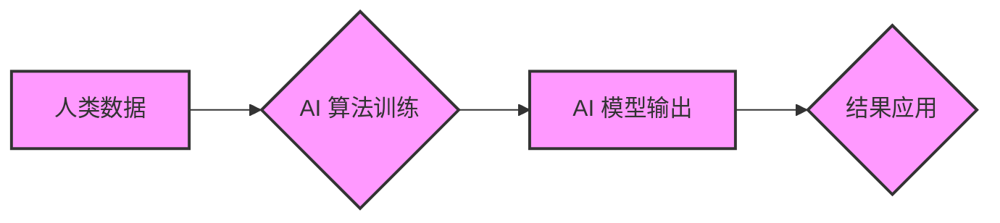

                 

## 认知偏见，开放思维，人工智能，机器学习，深度学习，数据分析，决策科学，批判性思维

### 1. 背景介绍

在瞬息万变的科技时代，人工智能（AI）正以惊人的速度发展，深刻地改变着我们的生活和工作方式。然而，AI技术的进步也暴露了人类认知的局限性。认知偏见，作为一种潜意识的思维模式，会影响我们的判断、决策和行为，进而阻碍AI技术的全面发展和良性应用。

认知偏见是指人们在获取、处理和解释信息时，由于各种心理因素而产生的偏差，导致认知结果与客观事实不符。这些偏见往往根植于我们的文化背景、个人经历和社会规范，难以察觉，但其影响却深远。

在AI领域，认知偏见会导致模型训练数据的不均衡，从而导致模型输出结果存在偏差，甚至产生歧视性或不公平的结果。例如，如果训练图像识别模型的数据中缺乏不同种族或性别的人脸图像，那么模型很可能在识别这些群体时表现不佳，甚至产生错误识别。

因此，克服认知偏见，培养开放思维，对于推动AI技术健康发展至关重要。

### 2. 核心概念与联系

#### 2.1 认知偏见

认知偏见是指人们在获取、处理和解释信息时，由于各种心理因素而产生的偏差，导致认知结果与客观事实不符。

#### 2.2 开放思维

开放思维是指一种积极主动地探索新知识、新观点和新体验的思维方式，能够接受不同的意见和观点，并愿意进行深入思考和分析。

#### 2.3 AI 算法与认知偏见

AI 算法的训练数据往往来自人类，而人类的认知存在偏见，因此AI 算法也容易受到认知偏见的影响。

**Mermaid 流程图**



### 3. 核心算法原理 & 具体操作步骤

#### 3.1 算法原理概述

为了克服AI算法中的认知偏见，需要采用一些专门的算法和技术。其中，**公平学习**算法是比较重要的一个方向。公平学习的目标是训练出能够在不同群体之间公平对待的AI模型。

#### 3.2 算法步骤详解

1. **数据收集和预处理:** 收集包含不同群体的数据，并进行预处理，例如数据清洗、特征工程等。
2. **偏见检测:** 使用一些统计方法或机器学习模型检测训练数据中的潜在偏见。
3. **偏见校正:** 使用不同的技术来校正训练数据中的偏见，例如重新加权数据、添加对抗样本等。
4. **模型训练:** 使用公平学习算法训练AI模型。
5. **模型评估:** 使用公平性指标评估模型在不同群体上的表现，并进行调整和优化。

#### 3.3 算法优缺点

**优点:**

* 可以有效地减少AI模型中的认知偏见。
* 可以帮助构建更加公平、公正的AI系统。

**缺点:**

* 算法的复杂性较高，需要一定的专业知识和技术能力。
* 偏见校正的难度较大，需要根据具体情况进行调整。

#### 3.4 算法应用领域

* **医疗保健:** 避免医疗诊断和治疗方案中存在种族、性别等方面的偏见。
* **金融服务:** 确保贷款审批、风险评估等决策过程公平公正。
* **招聘和人力资源:** 减少招聘过程中对候选人的性别、种族等方面的歧视。

### 4. 数学模型和公式 & 详细讲解 & 举例说明

#### 4.1 数学模型构建

公平学习的目标是构建一个数学模型，能够在不同群体之间公平对待。一个常见的数学模型是**均等机会模型**，其目标是使不同群体在模型输出上的平均值相等。

#### 4.2 公式推导过程

假设我们有一个分类模型，其输出为类别概率。对于一个群体 $G$，其平均类别概率为 $p_G$。均等机会模型的目标是使所有群体的平均类别概率相等，即 $p_1 = p_2 = ... = p_n$。

#### 4.3 案例分析与讲解

例如，假设我们有一个图像识别模型，其目标是识别不同种类的动物。如果训练数据中不同种类的动物的比例不均衡，那么模型很可能在识别某些种类的动物时表现不佳。

为了解决这个问题，我们可以使用均等机会模型来调整模型的输出。具体来说，我们可以计算每个群体的平均类别概率，然后调整模型的输出，使所有群体的平均类别概率相等。

### 5. 项目实践：代码实例和详细解释说明

#### 5.1 开发环境搭建

* Python 3.x
* TensorFlow 或 PyTorch 等深度学习框架
* Jupyter Notebook 或其他代码编辑器

#### 5.2 源代码详细实现

```python
# 使用 TensorFlow 实现均等机会模型

import tensorflow as tf

# 定义模型
model = tf.keras.models.Sequential([
    tf.keras.layers.Dense(128, activation='relu', input_shape=(784,)),
    tf.keras.layers.Dense(10, activation='softmax')
])

# 定义损失函数和优化器
loss_fn = tf.keras.losses.CategoricalCrossentropy()
optimizer = tf.keras.optimizers.Adam()

# 定义公平性指标
def fairness_metric(y_true, y_pred):
    # 计算不同群体的平均类别概率
    group_probs = tf.reduce_mean(y_pred, axis=0)
    # 计算平均类别概率的差异
    diff = tf.reduce_mean(tf.abs(group_probs - tf.reduce_mean(group_probs)))
    return diff

# 训练模型
model.compile(loss=loss_fn, optimizer=optimizer, metrics=['accuracy', fairness_metric])
model.fit(x_train, y_train, epochs=10)

# 评估模型
loss, accuracy, fairness = model.evaluate(x_test, y_test)
print(f'Loss: {loss:.4f}')
print(f'Accuracy: {accuracy:.4f}')
print(f'Fairness: {fairness:.4f}')
```

#### 5.3 代码解读与分析

* 代码首先定义了一个简单的深度学习模型。
* 然后定义了损失函数、优化器和公平性指标。
* 接着使用模型训练数据进行训练，并使用公平性指标来评估模型的公平性。

#### 5.4 运行结果展示

运行结果会显示模型的损失值、准确率和公平性指标。

### 6. 实际应用场景

#### 6.1 医疗保健

* 避免医疗诊断和治疗方案中存在种族、性别等方面的偏见。
* 例如，可以训练一个AI模型来识别不同种类的癌症，并确保模型在不同种族和性别的人群中表现一致。

#### 6.2 金融服务

* 确保贷款审批、风险评估等决策过程公平公正。
* 例如，可以训练一个AI模型来评估贷款申请人的信用风险，并确保模型在不同收入水平和种族背景的人群中表现一致。

#### 6.3 招聘和人力资源

* 减少招聘过程中对候选人的性别、种族等方面的歧视。
* 例如，可以训练一个AI模型来筛选简历，并确保模型在不同性别和种族背景的候选人中表现一致。

#### 6.4 未来应用展望

随着AI技术的不断发展，公平学习算法将在更多领域得到应用，例如教育、司法、交通等。

### 7. 工具和资源推荐

#### 7.1 学习资源推荐

* **书籍:**
    * "Fairness and Machine Learning" by  Virginia Eubanks
    * "Weapons of Math Destruction" by Cathy O'Neil
* **在线课程:**
    * Coursera: "Fairness in Machine Learning"
    * edX: "Algorithms for Fairness"

#### 7.2 开发工具推荐

* **TensorFlow:** https://www.tensorflow.org/
* **PyTorch:** https://pytorch.org/
* **Scikit-learn:** https://scikit-learn.org/

#### 7.3 相关论文推荐

* "On the Dangers of Stochastic Parrots: Can Language Models Be Too Big?"
* "Fairness and Machine Learning"
* "Mitigating Unintended Bias in Machine Learning"

### 8. 总结：未来发展趋势与挑战

#### 8.1 研究成果总结

近年来，公平学习领域取得了显著进展，许多新的算法和技术被提出，并取得了不错的效果。

#### 8.2 未来发展趋势

* **更有效的公平性指标:** 需要开发更有效的公平性指标，能够更全面地衡量模型的公平性。
* **更鲁棒的公平学习算法:** 需要开发更鲁棒的公平学习算法，能够在面对更复杂的数据和更复杂的偏见时仍然能够有效地工作。
* **解释性AI:** 需要开发更解释性强的AI模型，能够帮助我们更好地理解模型的决策过程，并识别潜在的偏见。

#### 8.3 面临的挑战

* **数据偏差:** 现实世界的数据往往存在各种偏差，这使得公平学习算法难以完全消除模型中的偏见。
* **定义公平:** “公平”是一个非常复杂的概念，不同的群体对公平的理解可能不同，因此需要在定义公平性指标时更加谨慎。
* **伦理问题:** 公平学习算法的应用可能会引发一些伦理问题，例如算法的透明度、可解释性和责任问题。

#### 8.4 研究展望

未来，公平学习领域的研究将继续朝着更有效、更鲁棒、更解释性强的方向发展，并与其他人工智能领域，例如自然语言处理、计算机视觉等领域相结合，以解决更复杂的问题。

### 9. 附录：常见问题与解答

#### 9.1 如何识别数据中的偏见?

可以使用一些统计方法或机器学习模型来识别数据中的偏见。例如，可以计算不同群体的特征分布、类别分布等，并进行比较。

#### 9.2 如何校正数据中的偏见?

可以使用一些技术来校正数据中的偏见，例如重新加权数据、添加对抗样本等。

#### 9.3 公平学习算法的局限性是什么?

公平学习算法的局限性在于，现实世界的数据往往存在各种偏差，这使得算法难以完全消除模型中的偏见。


作者：禅与计算机程序设计艺术 / Zen and the Art of Computer Programming 
<end_of_turn>

