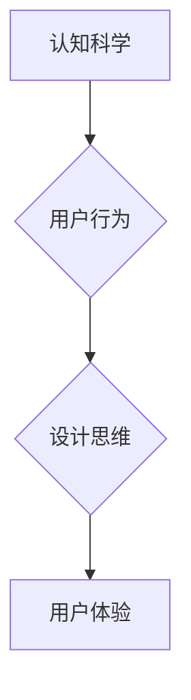

                 

## 认知科学与用户体验：设计思维的应用

> 关键词：认知科学、用户体验、设计思维、心理学、交互设计、可用性、人机交互、神经科学、信息架构

## 1. 背景介绍

在当今以用户体验为中心的数字时代，理解用户行为和认知过程对于设计出优秀的产品和服务至关重要。认知科学，作为研究人类认知过程的学科，为我们提供了宝贵的洞察力，帮助我们更好地理解用户是如何感知、理解和交互的。

传统的设计方法往往依赖于直觉和经验，而认知科学为设计思维提供了更科学、更系统化的框架。通过将认知科学的原理应用于用户体验设计，我们可以创造出更易用、更具吸引力和更符合用户需求的产品。

## 2. 核心概念与联系

### 2.1 认知科学与用户体验

认知科学涵盖了心理学、神经科学、计算机科学、语言学等多个学科，旨在揭示人类认知过程的机制。用户体验（User Experience，简称UX）则是指用户使用产品或服务时所感受到的整体感受，包括情感、认知、生理和行为等方面。

两者之间的联系在于，用户体验的本质就是用户对产品或服务的认知过程。认知科学的研究成果可以帮助我们理解用户是如何感知、理解和交互的，从而设计出更符合用户认知规律的产品。

### 2.2 设计思维与认知科学

设计思维是一种以用户为中心、迭代式的解决问题的方法。它强调通过观察、分析、实验和迭代来不断优化设计方案。认知科学为设计思维提供了理论基础和实践指导，帮助设计师更深入地理解用户需求和行为模式。

**Mermaid 流程图：**



## 3. 核心算法原理 & 具体操作步骤

### 3.1 算法原理概述

在用户体验设计中，认知科学的原理可以应用于多个方面，例如：

* **信息架构：** 认知科学的研究表明，人类大脑倾向于将信息组织成层次结构，并使用熟悉的模式进行理解。因此，信息架构的设计应该遵循认知规律，使信息易于导航和理解。
* **用户界面设计：** 认知科学可以帮助我们理解用户如何感知和交互，从而设计出更直观、更易用的用户界面。例如，认知心理学研究表明，人类更容易记住视觉信息，因此用户界面设计应注重视觉元素的运用。
* **交互设计：** 认知科学可以帮助我们设计出更符合用户认知规律的交互方式，例如，使用熟悉的交互模式，提供清晰的反馈，并避免认知负荷过大。

### 3.2 算法步骤详解

以下是一个基于认知科学原理的用户体验设计流程：

1. **用户研究：** 通过用户访谈、问卷调查、观察等方式，深入了解用户的需求、行为模式和认知习惯。
2. **认知模型构建：** 根据用户研究结果，构建用户认知模型，描述用户如何感知、理解和交互。
3. **设计方案构思：** 基于认知模型，构思设计方案，并考虑认知科学的原理，例如信息架构、用户界面设计和交互设计。
4. **原型设计和测试：** 设计原型并进行用户测试，收集用户反馈，并根据反馈进行迭代优化。
5. **最终产品开发：** 基于测试结果，开发最终产品，并进行持续监控和改进。

### 3.3 算法优缺点

**优点：**

* 基于科学原理，更有效地理解用户需求和行为模式。
* 提高产品可用性和用户满意度。
* 促进产品创新和竞争力。

**缺点：**

* 需要投入更多时间和资源进行用户研究和认知模型构建。
* 认知科学是一个复杂的研究领域，需要设计师具备一定的认知科学知识。

### 3.4 算法应用领域

认知科学与用户体验设计相结合，广泛应用于各个领域，例如：

* **软件开发：** 设计更易用、更符合用户需求的软件应用程序。
* **网站设计：** 提高网站的可用性和用户体验。
* **移动应用开发：** 设计更符合用户移动习惯的应用程序。
* **游戏设计：** 提升游戏玩家的沉浸感和游戏体验。
* **教育科技：** 设计更有效的学习工具和平台。

## 4. 数学模型和公式 & 详细讲解 & 举例说明

### 4.1 数学模型构建

在认知科学中，可以使用数学模型来描述和预测用户行为。例如，可以使用贝叶斯网络来建模用户对信息的理解和决策过程。

**贝叶斯网络**是一种概率图模型，可以表示变量之间的依赖关系。在用户体验设计中，可以使用贝叶斯网络来建模用户对产品或服务的认知过程，例如：

* 用户对产品的感知
* 用户对产品的理解
* 用户对产品的态度
* 用户的决策行为

### 4.2 公式推导过程

贝叶斯网络的推导过程基于贝叶斯定理：

$$P(A|B) = \frac{P(B|A)P(A)}{P(B)}$$

其中：

* $P(A|B)$ 是在已知事件 B 发生的情况下，事件 A 发生的概率。
* $P(B|A)$ 是在已知事件 A 发生的情况下，事件 B 发生的概率。
* $P(A)$ 是事件 A 发生的概率。
* $P(B)$ 是事件 B 发生的概率。

### 4.3 案例分析与讲解

例如，假设我们设计了一个新的电商平台，想要了解用户对平台的感知和决策行为。我们可以使用贝叶斯网络来建模用户对平台的认知过程，其中：

* 事件 A：用户对平台的满意度
* 事件 B：用户购买产品的行为

我们可以根据用户调研和数据分析，确定事件 A 和事件 B 的概率以及事件 A 和事件 B 之间的依赖关系。然后，我们可以使用贝叶斯定理来计算用户在不同情况下购买产品的概率。

## 5. 项目实践：代码实例和详细解释说明

### 5.1 开发环境搭建

为了实现认知科学与用户体验设计的结合，我们可以使用以下开发环境：

* **编程语言：** Python，由于其丰富的库和工具，例如 NumPy、Pandas 和 Scikit-learn，非常适合进行数据分析和机器学习。
* **数据分析工具：** Jupyter Notebook，提供交互式环境，方便进行数据分析和可视化。
* **用户界面设计工具：** Figma 或 Adobe XD，用于设计用户界面原型。

### 5.2 源代码详细实现

以下是一个简单的 Python 代码示例，用于计算用户对产品的满意度：

```python
import numpy as np

# 用户对产品的评价数据
ratings = np.array([4, 5, 3, 4, 5])

# 计算平均评分
average_rating = np.mean(ratings)

# 打印平均评分
print("用户对产品的平均满意度为:", average_rating)
```

### 5.3 代码解读与分析

这段代码首先定义了一个 NumPy 数组 `ratings`，存储用户对产品的评价数据。然后，使用 `np.mean()` 函数计算平均评分，并将结果存储在 `average_rating` 变量中。最后，打印平均评分。

### 5.4 运行结果展示

运行这段代码后，会输出以下结果：

```
用户对产品的平均满意度为: 4.2
```

## 6. 实际应用场景

### 6.1  电商平台

电商平台可以利用认知科学原理优化用户体验，例如：

* **个性化推荐：** 基于用户的浏览历史和购买记录，使用推荐算法提供个性化商品推荐。
* **购物车优化：** 设计购物车界面，引导用户添加更多商品，并提供优惠信息，提高转化率。
* **支付流程简化：** 简化支付流程，减少用户操作步骤，提高支付成功率。

### 6.2  社交媒体平台

社交媒体平台可以利用认知科学原理提高用户粘性和参与度，例如：

* **内容推荐：** 基于用户的兴趣和行为，推荐相关内容，提高用户停留时间。
* **社交互动：** 设计社交互动功能，例如点赞、评论、分享，增强用户参与感。
* **信息流优化：** 优化信息流算法，确保用户看到感兴趣的内容，提高用户体验。

### 6.3  教育平台

教育平台可以利用认知科学原理设计更有效的学习工具和平台，例如：

* **个性化学习路径：** 根据用户的学习进度和能力，提供个性化学习路径，提高学习效率。
* **互动式学习内容：** 设计互动式学习内容，例如游戏化学习、案例分析，提高用户学习兴趣。
* **反馈机制：** 提供及时有效的反馈，帮助用户了解自己的学习情况，并进行改进。

### 6.4 未来应用展望

随着认知科学研究的不断深入，其在用户体验设计领域的应用将更加广泛和深入。未来，我们可以期待：

* **更精准的用户画像：** 利用大数据和机器学习技术，构建更精准的用户画像，更好地理解用户的需求和行为模式。
* **更个性化的用户体验：** 基于用户画像，提供更个性化的产品和服务，满足用户的个性化需求。
* **更智能的用户交互：** 利用人工智能技术，设计更智能的用户交互方式，例如自然语言交互、情感识别，提升用户体验。


## 7. 工具和资源推荐

### 7.1 学习资源推荐

* **书籍：**
    * 《认知心理学》
    * 《设计心理学》
    * 《用户体验设计》
* **在线课程：**
    * Coursera：认知科学课程
    * edX：用户体验设计课程
    * Udemy：认知心理学与用户体验课程

### 7.2 开发工具推荐

* **用户界面设计工具：** Figma、Adobe XD、Sketch
* **原型设计工具：** Axure RP、InVision Studio
* **数据分析工具：** Jupyter Notebook、Tableau、Power BI

### 7.3 相关论文推荐

* **认知科学与用户体验：**
    * Nielsen, J. (2010). The Design of Everyday Things. Basic Books.
    * Dumas, J. S., & Redish, J. C. (1999). A Practical Guide to Usability Testing. Lawrence Erlbaum Associates.
* **认知心理学与用户界面设计：**
    * Card, S. K., Moran, T. P., & Newell, A. (1983). The Psychology of Everyday Things. Basic Books.
    * Shneiderman, B. (2013). Designing the User Interface: Strategies for Effective Human-Computer Interaction. Pearson Education.

## 8. 总结：未来发展趋势与挑战

### 8.1 研究成果总结

认知科学与用户体验设计相结合，为设计更符合用户需求、更易用、更具吸引力的产品和服务提供了科学依据和实践方法。

### 8.2 未来发展趋势

未来，认知科学与用户体验设计将朝着以下方向发展：

* **更深入的认知模型：** 利用人工智能和机器学习技术，构建更深入、更精准的用户认知模型。
* **更个性化的用户体验：** 基于用户画像，提供更个性化的产品和服务，满足用户的个性化需求。
* **更智能的用户交互：** 设计更智能的用户交互方式，例如自然语言交互、情感识别，提升用户体验。

### 8.3 面临的挑战

* **认知科学研究的复杂性：** 认知科学是一个复杂的研究领域，需要设计师具备一定的认知科学知识。
* **数据获取和分析的难度：** 构建用户认知模型需要大量的数据，而数据获取和分析也面临着一定的挑战。
* **伦理问题：** 利用认知科学原理设计产品和服务，需要考虑伦理问题，例如用户隐私保护和数据安全。

### 8.4 研究展望

未来，我们需要继续深入研究认知科学原理，并将其应用于更多领域，为用户创造更美好的体验。


## 9. 附录：常见问题与解答

**常见问题：**

* **认知科学与用户体验设计有什么关系？**

认知科学研究人类认知过程，而用户体验设计旨在提升用户使用产品或服务的整体感受。两者之间密切相关，认知科学为用户体验设计提供了理论基础和实践指导。

* **如何将认知科学原理应用于用户体验设计？**

可以通过以下方式将认知科学原理应用于用户体验设计：

* **用户研究：** 深入了解用户的需求、行为模式和认知习惯。
* **认知模型构建：** 根据用户研究结果，构建用户认知模型，描述用户如何感知、理解和交互。
* **设计方案构思：** 基于认知模型，构思设计方案，并考虑认知科学的原理，例如信息架构、用户界面设计和交互设计。
* **原型设计和测试：** 设计原型并进行用户测试，收集用户反馈，并根据反馈进行迭代优化。

* **有哪些工具可以帮助我进行认知科学与用户体验设计的结合？**

可以使用以下工具帮助你进行认知科学与用户体验设计的结合：

* **编程语言：** Python
* **数据分析工具：** Jupyter Notebook
* **用户界面设计工具：** Figma、Adobe XD
* **原型设计工具：** Axure RP、InVision Studio


作者：禅与计算机程序设计艺术 / Zen and the Art of Computer Programming 
<end_of_turn>

