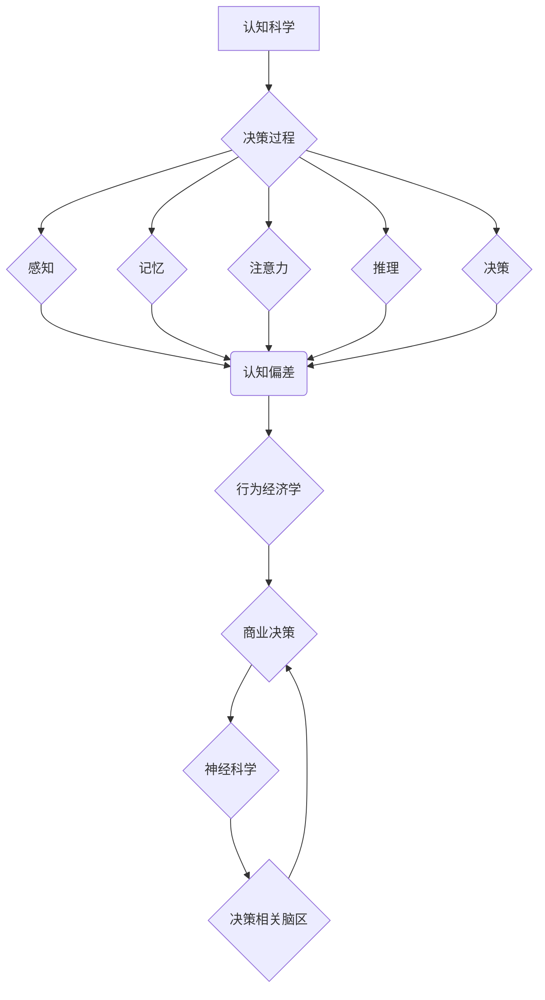

                 

## 认知科学在商业中的应用：决策优化

> 关键词：认知科学、决策优化、行为经济学、神经科学、机器学习、数据分析、商业应用、人工智能

## 1. 背景介绍

在当今数据爆炸和竞争激烈的商业环境中，高效的决策至关重要。传统的决策模型往往基于理性经济学假设，忽略了人类认知的复杂性和局限性。认知科学，作为研究人类认知过程的学科，为我们提供了理解决策背后的心理机制的新视角。

认知科学的研究成果表明，人类决策并非总是理性的，而是受到情绪、认知偏差、社会影响等多种因素的影响。行为经济学，作为认知科学与经济学交叉的领域，通过实验和实证研究，揭示了人类决策中的非理性行为模式。神经科学的研究则进一步揭示了决策过程在脑神经层面是如何发生的。

将认知科学的原理应用于商业决策，可以帮助企业更准确地预测消费者行为，优化营销策略，提高运营效率，最终实现商业目标。

## 2. 核心概念与联系

### 2.1 认知科学与商业决策

认知科学研究人类认知过程，包括感知、记忆、注意力、语言、推理、决策等。这些认知过程都与商业决策息息相关。

* **感知:** 消费者对产品、品牌、广告等信息的感知会影响他们的购买决策。
* **记忆:** 消费者对品牌、产品、服务的记忆会影响他们的重复购买行为。
* **注意力:** 消费者对信息的注意力会影响他们对广告和营销信息的接受程度。
* **推理:** 消费者对产品信息进行推理和比较，最终做出购买决策。
* **决策:** 消费者在面对多种选择时，会进行决策，选择最符合自身需求的产品或服务。

### 2.2 行为经济学与商业决策

行为经济学研究人类在决策中的非理性行为模式，并试图解释这些行为背后的心理机制。

* **认知偏差:** 人类在决策过程中会受到各种认知偏差的影响，例如确认偏差、锚定效应、损失厌恶等。
* **情绪:** 情绪会影响人类的决策，例如快乐、悲伤、愤怒等情绪都会导致不同的决策结果。
* **社会影响:** 社会规范、群体压力等都会影响人类的决策。

### 2.3 神经科学与商业决策

神经科学研究大脑的结构和功能，包括决策过程在脑神经层面是如何发生的。

* **决策相关脑区:** 决策过程涉及多个脑区，例如前额叶皮层、杏仁核、海马体等。
* **神经递质:** 神经递质，例如多巴胺、血清素等，会影响人类的决策。

**核心概念与联系流程图**



## 3. 核心算法原理 & 具体操作步骤

### 3.1 算法原理概述

决策优化算法旨在利用认知科学和数据分析技术，帮助企业做出更准确、更有效的决策。这些算法通常基于以下原理：

* **行为模型:** 建立一个描述人类决策行为的数学模型，例如预期效用理论、程序化决策模型等。
* **数据驱动:** 利用大量数据，例如消费者行为数据、市场数据、财务数据等，训练和优化决策模型。
* **机器学习:** 使用机器学习算法，例如回归分析、分类算法、强化学习等，从数据中学习决策规律。

### 3.2 算法步骤详解

决策优化算法的具体步骤通常包括以下几个阶段：

1. **数据收集和预处理:** 收集相关数据，并进行清洗、转换、整合等预处理工作。
2. **特征工程:** 从原始数据中提取特征，例如消费者属性、产品特征、市场环境等，这些特征将作为决策模型的输入。
3. **模型选择和训练:** 选择合适的决策模型，并利用训练数据训练模型参数。
4. **模型评估和优化:** 使用测试数据评估模型性能，并根据评估结果调整模型参数，优化模型效果。
5. **决策实施和监控:** 将优化后的决策模型应用于实际决策场景，并持续监控模型效果，及时进行调整和更新。

### 3.3 算法优缺点

**优点:**

* **数据驱动:** 基于数据分析，决策更科学、更客观。
* **效率提升:** 自动化决策过程，提高决策效率。
* **精准度提升:** 优化模型可以更准确地预测消费者行为，提高决策精准度。

**缺点:**

* **数据依赖:** 算法效果依赖于数据质量和数量。
* **模型复杂:** 构建和训练复杂的决策模型需要专业知识和技术。
* **解释性不足:** 一些机器学习算法的决策过程难以解释，缺乏透明度。

### 3.4 算法应用领域

决策优化算法在商业领域有着广泛的应用，例如：

* **营销决策:** 优化广告投放、精准营销、客户关系管理等。
* **产品开发:** 预测产品需求、优化产品设计、制定产品定价策略等。
* **运营决策:** 优化库存管理、物流配送、资源配置等。
* **金融决策:** 风险管理、投资决策、信用评估等。

## 4. 数学模型和公式 & 详细讲解 & 举例说明

### 4.1 数学模型构建

决策优化算法通常基于一些数学模型，例如预期效用理论、程序化决策模型等。

**预期效用理论:**

预期效用理论认为，消费者在做出决策时，会根据每个选择带来的预期效用进行比较，选择效用最高的选项。

**公式:**

$$
U(x) = \sum_{i=1}^{n} p_i \cdot v_i
$$

其中：

* $U(x)$ 是选择 $x$ 的预期效用。
* $p_i$ 是选择 $x$ 导致结果 $i$ 的概率。
* $v_i$ 是结果 $i$ 的效用值。

**程序化决策模型:**

程序化决策模型认为，消费者会根据一系列规则和程序进行决策，这些规则和程序可以是显性的，也可以是隐性的。

**公式:**

$$
Decision(x) = f(Input(x))
$$

其中：

* $Decision(x)$ 是对输入 $x$ 的决策结果。
* $Input(x)$ 是决策过程中使用的输入信息。
* $f$ 是决策规则或程序。

### 4.2 公式推导过程

预期效用理论的公式推导过程如下：

1. 假设消费者有 $n$ 个选择，每个选择 $i$ 都有 $m$ 个可能的结果。
2. 每个结果 $j$ 都有一个效用值 $v_{ij}$。
3. 选择 $i$ 导致结果 $j$ 的概率为 $p_{ij}$。
4. 则选择 $i$ 的预期效用为：

$$
U_i = \sum_{j=1}^{m} p_{ij} \cdot v_{ij}
$$

5. 消费者会选择预期效用最高的选项，即：

$$
Decision = \arg\max_{i} U_i
$$

### 4.3 案例分析与讲解

**案例:**

假设一家公司要决定是否推出新产品，他们收集了市场调研数据，并建立了预期效用模型。

* 如果推出新产品，成功概率为 0.6，预期利润为 100 万元，失败概率为 0.4，预期损失为 50 万元。
* 如果不推出新产品，预期利润为 0，预期损失为 0。

**分析:**

根据预期效用理论，公司可以计算出推出新产品和不推出新产品的预期效用，并选择预期效用最高的选项。

$$
U_{推出} = 0.6 \cdot 100 + 0.4 \cdot (-50) = 40
$$

$$
U_{不推出} = 0
$$

结果表明，推出新产品的预期效用高于不推出新产品的预期效用，因此公司应该选择推出新产品。

## 5. 项目实践：代码实例和详细解释说明

### 5.1 开发环境搭建

本项目使用 Python 语言进行开发，所需的开发环境包括：

* Python 3.x 版本
* Jupyter Notebook 或 VS Code 等代码编辑器
* NumPy、Pandas、Scikit-learn 等数据科学库

### 5.2 源代码详细实现

```python
import pandas as pd
from sklearn.linear_model import LogisticRegression

# 数据加载
data = pd.read_csv('customer_data.csv')

# 特征工程
features = ['age', 'income', 'education', 'purchase_history']
X = data[features]
y = data['purchase_probability']

# 模型训练
model = LogisticRegression()
model.fit(X, y)

# 预测
new_customer_data = pd.DataFrame({
    'age': [30],
    'income': [50000],
    'education': ['master'],
    'purchase_history': [2]
})
prediction = model.predict(new_customer_data)
print(prediction)
```

### 5.3 代码解读与分析

* 数据加载：使用 Pandas 库加载客户数据。
* 特征工程：选择相关的特征作为模型输入，并将目标变量作为模型输出。
* 模型训练：使用 LogisticRegression 模型训练决策模型。
* 预测：使用训练好的模型预测新客户的购买概率。

### 5.4 运行结果展示

运行代码后，会输出新客户的购买概率预测结果。

## 6. 实际应用场景

### 6.1 营销决策

* **精准营销:** 利用消费者数据，预测哪些消费者更有可能购买特定产品，并针对这些消费者进行个性化营销。
* **广告投放优化:** 根据消费者行为数据，优化广告投放策略，提高广告效果。
* **客户关系管理:** 利用消费者行为数据，识别高价值客户，并制定相应的客户关系管理策略。

### 6.2 产品开发

* **产品需求预测:** 利用市场数据和消费者行为数据，预测未来产品需求，指导产品开发方向。
* **产品设计优化:** 利用消费者反馈数据，优化产品设计，提高产品用户体验。
* **产品定价策略:** 利用市场数据和消费者行为数据，制定合理的定价策略，最大化利润。

### 6.3 运营决策

* **库存管理:** 利用销售数据和市场预测数据，优化库存管理，减少库存积压和缺货风险。
* **物流配送:** 利用地理位置数据和交通数据，优化物流配送路线，提高配送效率。
* **资源配置:** 利用资源使用数据和业务需求数据，优化资源配置，提高资源利用率。

### 6.4 未来应用展望

随着人工智能技术的发展，决策优化算法将应用更加广泛，例如：

* **个性化推荐:** 利用用户行为数据，为用户提供更加个性化的产品和服务推荐。
* **自动决策:** 在一些简单的决策场景下，利用机器学习算法实现自动决策，提高决策效率。
* **决策支持系统:** 开发更加智能的决策支持系统，帮助企业领导者做出更明智的决策。

## 7. 工具和资源推荐

### 7.1 学习资源推荐

* **书籍:**
    * 《Thinking, Fast and Slow》 by Daniel Kahneman
    * 《Predictably Irrational》 by Dan Ariely
    * 《Nudge》 by Richard Thaler and Cass Sunstein
* **在线课程:**
    * Coursera: Behavioral Economics
    * edX: Introduction to Cognitive Science
    * Udacity: Machine Learning Nanodegree

### 7.2 开发工具推荐

* **Python:** 
    * NumPy
    * Pandas
    * Scikit-learn
    * TensorFlow
    * PyTorch
* **数据可视化工具:**
    * Matplotlib
    * Seaborn
    * Tableau

### 7.3 相关论文推荐

* **Kahneman, D. (2011). Thinking, fast and slow.**
* **Thaler, R. H., & Sunstein, C. R. (2008). Nudge: Improving decisions about health, wealth, and happiness.**
* **Ariely, D. (2008). Predictably irrational: The hidden forces that shape our decisions.**

## 8. 总结：未来发展趋势与挑战

### 8.1 研究成果总结

认知科学在商业决策领域的应用取得了显著成果，例如：

* 提高了决策的准确性和效率。
* 帮助企业更好地理解消费者行为。
* 推动了个性化营销和产品开发的进步。

### 8.2 未来发展趋势

未来，认知科学在商业决策领域的应用将朝着以下方向发展：

* **更深入的认知机制研究:** 进一步研究人类决策背后的认知机制，开发更精准的决策模型。
* **更强大的机器学习算法:** 利用更强大的机器学习算法，从更复杂的数据中学习决策规律。
* **更智能的决策支持系统:** 开发更加智能的决策支持系统，帮助企业领导者做出更明智的决策。

### 8.3 面临的挑战

认知科学在商业决策领域的应用也面临一些挑战：

* **数据隐私问题:** 利用消费者数据进行决策需要考虑数据隐私问题，确保数据的安全和合法使用。
* **模型解释性问题:** 一些机器学习算法的决策过程难以解释，缺乏透明度，这可能会导致企业难以信任模型的决策结果。
* **伦理问题:** 决策优化算法可能会被用于操纵消费者行为，因此需要考虑伦理问题，确保算法的应用符合社会道德规范。

### 8.4 研究展望

未来，我们需要继续深入研究认知科学和人工智能技术，开发更加安全、可靠、可解释的决策优化算法，帮助企业做出更明智的决策，推动商业发展。

## 9. 附录：常见问题与解答

**问题 1:** 决策优化算法需要多少数据才能有效？

**答案:** 决策优化算法的数据需求取决于模型的复杂度和数据的质量。一般来说，需要收集足够多的数据，才能训练出准确的模型。

**问题 2:** 决策优化算法的决策结果是否总是正确的？

**答案:** 决策优化算法的决策结果并非总是正确的，因为算法的准确性取决于数据的质量和模型的复杂度。

**问题 3:** 决策优化算法如何解决数据隐私问题？

**答案:** 决策优化算法的应用需要考虑数据隐私问题，例如使用匿名化数据、加密技术等方法保护数据安全。

**问题 4:** 如何评估决策优化算法的性能？

**答案:** 可以使用各种指标来评估决策优化算法的性能，例如准确率、召回率、F1-score等。

**问题 5:** 决策优化算法的应用有哪些伦理问题？

**答案:** 决策优化算法可能会被用于操纵消费者行为，因此需要考虑伦理问题，确保算法的应用符合社会道德规范。


作者：禅与计算机程序设计艺术 / Zen and the Art of Computer Programming<end_of_turn>

