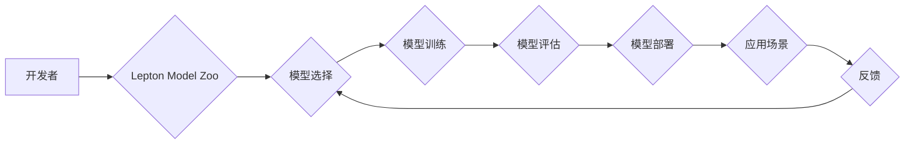

                 

## 贾扬清的新征程：从阿里到Lepton AI

> 关键词：贾扬清、Lepton AI、人工智能、大模型、开源、技术创新、云计算

### 1. 背景介绍

贾扬清，一位享誉全球的人工智能专家，曾是阿里巴巴集团的资深技术专家和首席技术官，在人工智能领域有着深厚的积累和丰富的经验。他带领阿里巴巴的技术团队在多个领域取得了突破性进展，例如电商推荐、语音识别、机器翻译等。然而，贾扬清并不满足于现状，他始终追求更前沿、更开放、更具颠覆性的技术创新。

2023年，贾扬清宣布离开阿里巴巴，创立了Lepton AI，一个致力于开源人工智能的全新平台。Lepton AI 的目标是构建一个开放、透明、可协作的 AI 生态系统，让每个人都能参与到人工智能的浪潮中来。

### 2. 核心概念与联系

Lepton AI 的核心概念是“开源、协作、共建”。它旨在打破传统封闭的 AI 开发模式，鼓励开发者、研究者和企业共同参与到 AI 的研发和应用中。Lepton AI 提供了一系列开源工具和平台，包括：

* **Lepton Model Zoo:** 一个开源的大模型库，包含各种类型的预训练模型，例如语言模型、图像识别模型、语音识别模型等。
* **Lepton Training Platform:** 一个基于云计算的 AI 训练平台，提供强大的计算资源和高效的训练框架，方便开发者训练自己的 AI 模型。
* **Lepton Inference Engine:** 一个高效的 AI 推理引擎，可以将训练好的 AI 模型部署到各种设备上，实现实时推理。

Lepton AI 的架构可以概括为以下流程图：

### 3. 核心算法原理 & 具体操作步骤

Lepton AI 基于深度学习算法，并结合了最新的 AI 研究成果，例如 Transformer、BERT、GPT 等。

#### 3.1  算法原理概述

深度学习算法的核心是多层神经网络，通过学习大量的训练数据，自动提取数据的特征和规律，从而实现对数据的理解和预测。

#### 3.2  算法步骤详解

1. **数据预处理:** 将原始数据转换为深度学习模型可以理解的格式，例如文本数据需要转换为词向量，图像数据需要进行裁剪、缩放等操作。
2. **模型构建:** 根据具体的应用场景，选择合适的深度学习模型架构，例如 CNN、RNN、Transformer 等。
3. **模型训练:** 使用训练数据训练深度学习模型，通过调整模型参数，使模型的预测结果与真实值尽可能接近。
4. **模型评估:** 使用测试数据评估模型的性能，例如准确率、召回率、F1-score 等。
5. **模型部署:** 将训练好的模型部署到实际应用场景中，例如网站、移动应用、嵌入式设备等。

#### 3.3  算法优缺点

**优点:**

* **高精度:** 深度学习算法在许多领域都取得了state-of-the-art的性能。
* **自动化特征提取:** 深度学习模型可以自动学习数据的特征，无需人工特征工程。
* **可扩展性:** 深度学习模型可以很容易地扩展到更大的数据集和更复杂的模型架构。

**缺点:**

* **数据依赖:** 深度学习模型需要大量的训练数据才能达到较高的性能。
* **计算资源消耗:** 训练深度学习模型需要大量的计算资源，例如 GPU。
* **可解释性差:** 深度学习模型的决策过程比较复杂，难以解释模型的决策结果。

#### 3.4  算法应用领域

深度学习算法在各个领域都有广泛的应用，例如：

* **计算机视觉:** 图像识别、物体检测、图像分割、人脸识别等。
* **自然语言处理:** 文本分类、情感分析、机器翻译、文本生成等。
* **语音识别:** 语音转文本、语音合成等。
* **推荐系统:** 商品推荐、内容推荐等。
* **医疗诊断:** 病理图像分析、疾病预测等。

### 4. 数学模型和公式 & 详细讲解 & 举例说明

深度学习模型的核心是神经网络，神经网络由多个层组成，每一层都包含多个神经元。神经元之间通过权重连接，权重决定了神经元之间的传递强度。

#### 4.1  数学模型构建

一个简单的感知器模型可以表示为以下公式：

$$
y = f(w^T x + b)
$$

其中：

* $x$ 是输入向量
* $w$ 是权重向量
* $b$ 是偏置项
* $f$ 是激活函数

#### 4.2  公式推导过程

感知器的输出 $y$ 是通过对输入向量 $x$ 进行线性变换，然后应用激活函数 $f$ 得到的。

#### 4.3  案例分析与讲解

例如，一个简单的图像分类模型，输入是一个图像像素值向量 $x$，输出是图像类别 $y$。模型可以学习到图像特征的权重 $w$，并根据这些权重对图像进行分类。

### 5. 项目实践：代码实例和详细解释说明

Lepton AI 提供了丰富的开源代码和工具，方便开发者进行项目实践。

#### 5.1  开发环境搭建

Lepton AI 支持多种开发环境，例如 Linux、macOS、Windows 等。开发者可以根据自己的需求选择合适的开发环境。

#### 5.2  源代码详细实现

Lepton AI 的源代码主要使用 Python 语言编写，并基于 TensorFlow 或 PyTorch 等深度学习框架。

#### 5.3  代码解读与分析

Lepton AI 的代码结构清晰，注释详细，方便开发者理解和修改。

#### 5.4  运行结果展示

Lepton AI 提供了多种工具和方法，方便开发者查看模型的训练结果和预测结果。

### 6. 实际应用场景

Lepton AI 的开源特性使其在各个领域都有广泛的应用场景。

#### 6.4  未来应用展望

Lepton AI 将继续推动人工智能的开源和协作发展，并致力于构建一个更加开放、透明、可协作的 AI 生态系统。

### 7. 工具和资源推荐

#### 7.1  学习资源推荐

* Lepton AI 官方文档：https://lepton.ai/docs
* 深度学习入门书籍：
    * 《深度学习》
    * 《动手学深度学习》

#### 7.2  开发工具推荐

* Python
* TensorFlow
* PyTorch
* Jupyter Notebook

#### 7.3  相关论文推荐

* 《Attention Is All You Need》
* 《BERT: Pre-training of Deep Bidirectional Transformers for Language Understanding》

### 8. 总结：未来发展趋势与挑战

#### 8.1  研究成果总结

Lepton AI 的开源平台为人工智能的普及和发展做出了重要贡献。

#### 8.2  未来发展趋势

Lepton AI 将继续关注以下几个方面：

* **模型性能提升:** 持续研究和开发更高效、更强大的 AI 模型。
* **开源生态建设:** 鼓励更多开发者和研究者参与到 Lepton AI 的开源社区中。
* **应用场景拓展:** 将 Lepton AI 应用到更多领域，例如医疗、教育、金融等。

#### 8.3  面临的挑战

Lepton AI 面临着以下几个挑战：

* **人才短缺:** 优秀的 AI 人才仍然比较稀缺。
* **数据安全:** AI 模型的训练和应用需要大量的训练数据，数据安全是一个重要的挑战。
* **伦理问题:** AI 技术的快速发展也带来了伦理问题，例如算法偏见、数据隐私等。

#### 8.4  研究展望

Lepton AI 将继续致力于解决这些挑战，并推动人工智能技术向更安全、更可靠、更可持续的方向发展。

### 9. 附录：常见问题与解答

Lepton AI 的官方网站和文档中提供了丰富的常见问题解答，可以帮助开发者解决遇到的问题。

作者：禅与计算机程序设计艺术 / Zen and the Art of Computer Programming 
<end_of_turn>

