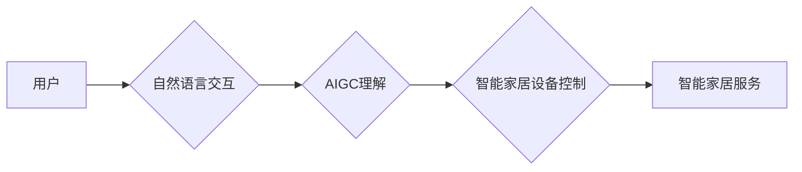

                 

## AIGC推动智能家居普及

> 关键词：AIGC、智能家居、自然语言理解、机器学习、个性化体验、语音交互、场景感知

## 1. 背景介绍

智能家居已成为未来生活的重要趋势，它通过将互联网、人工智能、物联网等技术融合，赋予家居环境智能化感知、控制和服务能力，为用户提供更加便捷、舒适、安全的生活体验。然而，智能家居的普及面临着诸多挑战，例如用户体验复杂、设备互联性差、数据安全隐患等。

近年来，人工智能生成内容（AIGC）技术突飞猛进，其强大的文本生成、图像生成、语音合成等能力为智能家居的升级提供了新的机遇。AIGC可以帮助智能家居系统更好地理解用户需求，提供更个性化的服务，并提升用户交互体验。

## 2. 核心概念与联系

### 2.1 智能家居

智能家居是指通过网络连接和智能化控制，实现家居环境自动化、智能化管理和服务的系统。它包含了各种智能设备，例如智能照明、智能空调、智能门锁、智能音箱等，这些设备通过传感器、网络和人工智能算法相互连接，可以根据用户的指令或环境变化自动执行相应的操作。

### 2.2 AIGC

AIGC是指利用人工智能技术，自动生成各种文本、图像、音频、视频等内容的系统。AIGC技术主要包括自然语言处理（NLP）、机器学习（ML）、深度学习（DL）等技术，通过训练大量的文本、图像等数据，模型能够学习到内容的生成规律，并生成新的、高质量的内容。

### 2.3 核心概念联系

AIGC技术可以与智能家居系统相结合，实现以下功能：

* **自然语言交互:** AIGC可以理解用户的自然语言指令，并将其转换为智能家居设备可以执行的操作。例如，用户可以对着智能音箱说“打开客厅灯”，AIGC模型会识别出用户的意图，并控制客厅灯打开。
* **个性化服务:** AIGC可以根据用户的喜好、习惯和行为模式，提供个性化的服务。例如，AIGC可以学习用户的睡眠习惯，自动调节卧室的温度和灯光，为用户提供更舒适的睡眠环境。
* **场景感知:** AIGC可以结合智能家居设备的传感器数据，感知用户的活动场景，并提供相应的服务。例如，当用户进入厨房时，AIGC可以自动打开厨房灯和音乐，为用户营造舒适的烹饪氛围。

**Mermaid 流程图**



## 3. 核心算法原理 & 具体操作步骤

### 3.1 算法原理概述

AIGC在智能家居中的应用主要依赖于自然语言处理（NLP）和机器学习（ML）算法。

* **自然语言处理（NLP）:** NLP算法可以帮助智能家居系统理解用户的自然语言指令，并将其转换为机器可执行的指令。常用的NLP算法包括词性标注、依存句法分析、命名实体识别等。
* **机器学习（ML）:** ML算法可以帮助智能家居系统学习用户的喜好、习惯和行为模式，并根据这些信息提供个性化的服务。常用的ML算法包括监督学习、无监督学习和强化学习。

### 3.2 算法步骤详解

**自然语言理解流程:**

1. **文本预处理:** 将用户的自然语言指令进行清洗、分词、词性标注等预处理操作，以便后续算法能够理解。
2. **语义分析:** 利用词义消歧、句法分析等技术，分析用户的指令，识别出关键信息和意图。
3. **意图识别:** 将用户的指令映射到相应的智能家居服务，例如“打开客厅灯”的意图是“控制灯光”。
4. **槽位填充:** 识别出指令中的具体参数，例如“客厅灯”是灯光设备的名称。

**个性化服务流程:**

1. **数据收集:** 收集用户的行为数据，例如使用设备的时间、频率、模式等。
2. **数据分析:** 利用机器学习算法分析用户的行为数据，学习用户的喜好、习惯和行为模式。
3. **模型训练:** 根据分析结果，训练个性化服务模型，例如推荐用户喜欢的音乐、自动调节用户的舒适温度等。
4. **个性化服务提供:** 根据用户的行为和模型预测，为用户提供个性化的服务。

### 3.3 算法优缺点

**优点:**

* **自然交互:** AIGC可以使智能家居系统与用户进行更加自然、流畅的交互。
* **个性化体验:** AIGC可以根据用户的喜好和习惯，提供更加个性化的服务。
* **场景感知:** AIGC可以结合智能家居设备的传感器数据，感知用户的活动场景，并提供相应的服务。

**缺点:**

* **数据安全:** AIGC需要收集和分析用户的个人数据，因此数据安全是一个重要的挑战。
* **模型准确性:** AIGC模型的准确性取决于训练数据的质量和算法的复杂度，需要不断改进和优化。
* **计算资源:** AIGC模型的训练和推理需要大量的计算资源，对硬件设备提出了更高的要求。

### 3.4 算法应用领域

AIGC技术在智能家居领域的应用非常广泛，例如：

* **语音助手:** 例如Amazon Alexa、Google Assistant等，可以理解用户的语音指令，控制智能家居设备。
* **智能家居控制中心:** 可以通过自然语言交互，控制智能家居设备，例如灯光、空调、窗帘等。
* **个性化家居服务:** 例如根据用户的睡眠习惯，自动调节卧室的温度和灯光；根据用户的喜好，推荐合适的音乐和视频。
* **家居安全监控:** 例如通过语音识别和图像识别技术，识别入侵者，并报警。

## 4. 数学模型和公式 & 详细讲解 & 举例说明

### 4.1 数学模型构建

AIGC在智能家居中的应用主要依赖于自然语言处理（NLP）和机器学习（ML）算法。

* **自然语言处理（NLP）:** NLP模型通常使用词嵌入技术，将单词映射到向量空间中，以便进行语义分析和理解。常用的词嵌入模型包括Word2Vec、GloVe等。

* **机器学习（ML）:** ML模型可以根据用户的行为数据，学习用户的喜好和习惯。常用的ML模型包括支持向量机（SVM）、决策树、神经网络等。

### 4.2 公式推导过程

**词嵌入模型Word2Vec的Skip-gram模型:**

目标函数：

$$
J(\theta) = \sum_{i=1}^{N} \sum_{-c \leq j \leq c, j \neq 0} \log p(w_j | w_i; \theta)
$$

其中：

* $N$ 是训练语料库中单词总数
* $w_i$ 是中心词
* $w_j$ 是上下文词
* $c$ 是上下文窗口大小
* $\theta$ 是模型参数

**机器学习模型支持向量机的目标函数:**

$$
\min_{\mathbf{w}, b} \frac{1}{2} \|\mathbf{w}\|^2 + C \sum_{i=1}^{N} \xi_i
$$

其中：

* $\mathbf{w}$ 是模型参数
* $b$ 是偏置项
* $C$ 是惩罚参数
* $\xi_i$ 是松弛变量

### 4.3 案例分析与讲解

**词嵌入模型Word2Vec的应用:**

可以将“智能家居”和“智能设备”这两个词语映射到向量空间中，由于这两个词语在语义上相关，它们的向量表示会比较接近。

**机器学习模型支持向量机的应用:**

可以根据用户的历史行为数据，训练一个支持向量机模型，用于预测用户对不同智能家居服务的偏好。

## 5. 项目实践：代码实例和详细解释说明

### 5.1 开发环境搭建

* **操作系统:** Ubuntu 20.04 LTS
* **编程语言:** Python 3.8
* **深度学习框架:** TensorFlow 2.0
* **自然语言处理库:** NLTK、spaCy

### 5.2 源代码详细实现

```python
# 自然语言理解示例代码

import nltk
from nltk.tokenize import word_tokenize
from nltk.tag import pos_tag

# 下载 NLTK 数据包
nltk.download('punkt')
nltk.download('averaged_perceptron_tagger')

# 用户输入的自然语言指令
text = "打开客厅灯"

# 词语分词
tokens = word_tokenize(text)

# 词性标注
pos_tags = pos_tag(tokens)

# 识别意图
# ...

# 填充槽位
# ...
```

### 5.3 代码解读与分析

* **词语分词:** 将用户的自然语言指令分割成单个单词或词组。
* **词性标注:** 为每个单词分配相应的词性标签，例如名词、动词、形容词等。
* **意图识别:** 根据词语的含义和关系，识别用户的意图，例如“打开客厅灯”的意图是“控制灯光”。
* **槽位填充:** 识别出指令中的具体参数，例如“客厅灯”是灯光设备的名称。

### 5.4 运行结果展示

```
tokens = ['打开', '客厅', '灯']
pos_tags = [('打开', 'V'), ('客厅', 'N'), ('灯', 'N')]
```

## 6. 实际应用场景

### 6.1 智能家居控制中心

AIGC可以作为智能家居控制中心的核心，通过自然语言交互，控制各种智能家居设备，例如灯光、空调、窗帘、音响等。用户可以对着智能音箱说“打开客厅灯，调低空调温度”，AIGC模型会理解用户的意图，并控制相应的设备。

### 6.2 个性化家居服务

AIGC可以根据用户的喜好和习惯，提供个性化的家居服务，例如：

* **智能照明:** 根据用户的睡眠习惯，自动调节卧室的灯光亮度和色温，营造舒适的睡眠环境。
* **智能空调:** 根据用户的温度偏好，自动调节空调温度，保持室内舒适度。
* **智能音响:** 根据用户的音乐喜好，推荐合适的音乐，并自动播放。

### 6.3 家居安全监控

AIGC可以结合智能家居设备的传感器数据，进行家居安全监控，例如：

* **入侵检测:** 通过语音识别和图像识别技术，识别入侵者，并报警。
* **火灾报警:** 通过烟雾传感器和温度传感器的数据，识别火灾风险，并报警。
* **老人照护:** 通过传感器数据，监测老人的活动情况，及时报警。

### 6.4 未来应用展望

AIGC技术在智能家居领域的应用前景广阔，未来可能出现以下应用场景：

* **更自然的交互方式:** 例如通过手势识别、表情识别等方式，与智能家居系统进行交互。
* **更智能化的服务:** 例如根据用户的行为模式，自动预判用户的需求，并提供相应的服务。
* **更安全的保障:** 例如通过人工智能技术，识别和防范网络攻击和数据泄露。

## 7. 工具和资源推荐

### 7.1 学习资源推荐

* **书籍:**
    * 《深度学习》 by Ian Goodfellow, Yoshua Bengio, and Aaron Courville
    * 《自然语言处理》 by Dan Jurafsky and James H. Martin
* **在线课程:**
    * Coursera: Deep Learning Specialization
    * Udacity: Natural Language Processing Nanodegree
* **开源项目:**
    * TensorFlow: https://www.tensorflow.org/
    * PyTorch: https://pytorch.org/

### 7.2 开发工具推荐

* **编程语言:** Python
* **深度学习框架:** TensorFlow, PyTorch
* **自然语言处理库:** NLTK, spaCy

### 7.3 相关论文推荐

* **BERT: Pre-training of Deep Bidirectional Transformers for Language Understanding**
* **GPT-3: Language Models are Few-Shot Learners**
* **Attention Is All You Need**

## 8. 总结：未来发展趋势与挑战

### 8.1 研究成果总结

AIGC技术在智能家居领域的应用取得了显著进展，例如自然语言交互、个性化服务、场景感知等功能已经实现。

### 8.2 未来发展趋势

* **更强大的模型:** 未来将开发更强大的AIGC模型，能够更好地理解用户的意图和需求。
* **更丰富的交互方式:** 未来将支持更多元的交互方式，例如手势识别、表情识别等。
* **更智能化的服务:** 未来将提供更智能化的服务，例如根据用户的行为模式，自动预判用户的需求。

### 8.3 面临的挑战

* **数据安全:** AIGC模型需要收集和分析用户的个人数据，因此数据安全是一个重要的挑战。
* **模型准确性:** AIGC模型的准确性取决于训练数据的质量和算法的复杂度，需要不断改进和优化。
* **计算资源:** AIGC模型的训练和推理需要大量的计算资源，对硬件设备提出了更高的要求。

### 8.4 研究展望

未来研究将重点关注以下几个方面:

* **开发更安全、更可靠的AIGC模型:** 确保用户数据的安全性和模型的可靠性。
* **探索更丰富的交互方式:** 例如通过多模态交互，例如语音、图像、文本等。
* **实现更智能化的服务:** 例如根据用户的行为模式，自动预判用户的需求，并提供个性化的服务。


## 9. 附录：常见问题与解答

**Q1: AIGC技术是否会取代人类的工作？**

A1: AIGC技术可以帮助人类提高工作效率，但不会完全取代人类的工作。AIGC技术擅长处理重复性、规则性的任务，而人类擅长处理需要创造力和判断力的任务。

**Q2: AIGC技术如何保证数据安全？**

A2: AIGC模型的训练和推理需要收集和分析用户的个人数据，因此数据安全是一个重要的挑战。为了保证数据安全，需要采取以下措施:

* **数据加密:** 对用户的个人数据进行加密，防止数据被窃取。
* **数据匿名化:** 对用户的个人数据进行匿名化处理，防止数据被用于追踪用户。
* **数据访问控制:** 对用户的个人数据进行访问控制，只有授权人员才能访问这些数据。

**Q3: AIGC技术如何才能更好地理解用户的意图？**

A3: AIGC模型的理解能力取决于训练数据的质量和算法的复杂度。未来将通过以下方式提高AIGC模型的理解能力:

* **收集更多高质量的数据:** 训练AIGC模型需要大量的文本数据，这些数据需要高质量、多样化。
* **开发更复杂的算法:** 未来将开发更复杂的AIGC算法，例如基于Transformer的模型，能够更好地理解语言的上下文和语义。
* **结合多模态数据:** 将文本数据与图像、音频等多模态数据结合，能够更全面地理解用户的意图。


作者：禅与计算机程序设计艺术 / Zen and the Art of Computer Programming<end_of_turn>

