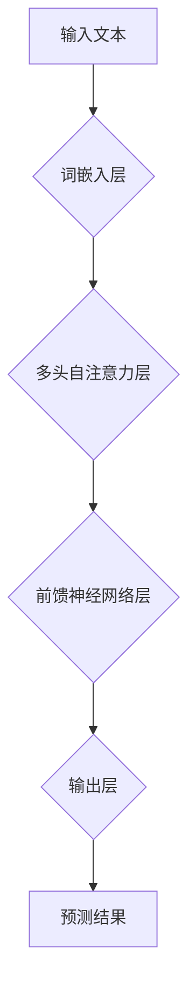

                 

## AI产业新格局：LLM重塑技术生态

> 关键词：LLM, 大语言模型,  人工智能,  自然语言处理,  深度学习,  技术生态,  产业变革,  应用场景

### 1. 背景介绍

近年来，人工智能（AI）技术突飞猛进，特别是深度学习的突破性进展，为人工智能的应用打开了新的局面。其中，大语言模型（LLM）作为人工智能领域最具潜力的技术之一，正在深刻地改变着我们与信息交互的方式，并对整个技术生态产生着深远的影响。

LLM 是一种能够理解和生成人类语言的强大人工智能模型。它通过学习海量文本数据，掌握了语言的语法、语义和上下文关系，从而能够执行各种自然语言处理（NLP）任务，例如文本生成、翻译、问答、摘要等。

与传统的机器学习模型相比，LLM 具有以下显著特点：

* **规模庞大:** LLM 通常拥有数十亿甚至数千亿个参数，使其能够学习更复杂的语言模式。
* **多任务学习:** LLM 可以通过微调训练，适应各种不同的 NLP 任务，无需从头开始训练。
* **生成式能力:** LLM 不仅能够理解语言，还能生成流畅、连贯的文本，甚至可以创作诗歌、剧本等。

### 2. 核心概念与联系

LLM 的核心概念是基于 Transformer 架构的深度神经网络。Transformer 架构通过自注意力机制，能够捕捉文本序列中长距离依赖关系，从而实现更准确的语言理解和生成。

**Mermaid 流程图:**

**核心概念与联系:**

* **词嵌入层:** 将文本中的每个词转换为向量表示，捕捉词语的语义信息。
* **多头自注意力层:** 捕捉文本序列中不同词语之间的关系，学习长距离依赖信息。
* **前馈神经网络层:** 对自注意力层的输出进行非线性变换，提取更深层次的语义特征。
* **输出层:** 将隐藏层输出转换为预测结果，例如预测下一个词语、生成文本摘要等。

### 3. 核心算法原理 & 具体操作步骤

#### 3.1  算法原理概述

LLM 的训练基于监督学习和无监督学习的结合。

* **监督学习:** 使用标注好的文本数据训练模型，例如文本分类、问答等任务。
* **无监督学习:** 使用未标注的文本数据进行预训练，例如语言建模、文本生成等任务。

预训练阶段，模型学习了语言的语法、语义和上下文关系，为后续的特定任务微调打下了基础。微调阶段，模型针对特定任务进行训练，例如使用医疗文本数据训练疾病诊断模型。

#### 3.2  算法步骤详解

1. **数据预处理:** 将文本数据清洗、分词、标记等预处理，使其适合模型训练。
2. **词嵌入:** 将文本中的每个词转换为向量表示，可以使用预训练的词嵌入模型，例如 Word2Vec、GloVe 等。
3. **模型训练:** 使用深度学习框架，例如 TensorFlow、PyTorch 等，训练 LLM 模型。
4. **模型评估:** 使用测试集评估模型的性能，例如准确率、F1 值等。
5. **模型微调:** 根据评估结果，对模型进行微调，提高模型性能。

#### 3.3  算法优缺点

**优点:**

* **强大的语言理解和生成能力:** LLM 可以理解和生成人类语言，并执行各种 NLP 任务。
* **多任务学习能力:** LLM 可以通过微调训练，适应各种不同的 NLP 任务。
* **可扩展性:** LLM 的规模可以不断扩大，从而学习更复杂的语言模式。

**缺点:**

* **训练成本高:** LLM 的训练需要大量的计算资源和时间。
* **数据依赖性强:** LLM 的性能取决于训练数据的质量和数量。
* **可解释性差:** LLM 的决策过程难以理解，缺乏透明度。

#### 3.4  算法应用领域

LLM 在各个领域都有广泛的应用，例如：

* **自然语言处理:** 文本分类、情感分析、机器翻译、问答系统等。
* **人工智能助手:** 语音助手、聊天机器人、智能客服等。
* **内容创作:** 文本生成、诗歌创作、剧本写作等。
* **教育:** 智能辅导、自动批改作业等。
* **医疗:** 疾病诊断、药物研发等。

### 4. 数学模型和公式 & 详细讲解 & 举例说明

#### 4.1  数学模型构建

LLM 的数学模型主要基于 Transformer 架构，其核心是自注意力机制。

**自注意力机制:**

自注意力机制能够捕捉文本序列中不同词语之间的关系，学习长距离依赖信息。其计算公式如下：

$$
Attention(Q, K, V) = softmax(\frac{QK^T}{\sqrt{d_k}})V
$$

其中：

* $Q$：查询矩阵
* $K$：键矩阵
* $V$：值矩阵
* $d_k$：键向量的维度
* $softmax$：softmax 函数

#### 4.2  公式推导过程

自注意力机制的计算过程可以分为以下步骤：

1. 将输入序列中的每个词语转换为查询向量 $Q$、键向量 $K$ 和值向量 $V$。
2. 计算查询向量 $Q$ 与键向量 $K$ 的点积，并进行归一化处理。
3. 使用 softmax 函数将归一化后的点积转换为注意力权重。
4. 将注意力权重与值向量 $V$ 进行加权求和，得到最终的输出。

#### 4.3  案例分析与讲解

例如，在翻译句子 "The cat sat on the mat" 时，自注意力机制可以捕捉到 "cat" 和 "sat" 之间的语义关系，以及 "mat" 和 "on" 之间的语义关系，从而帮助模型更好地理解句子含义并进行翻译。

### 5. 项目实践：代码实例和详细解释说明

#### 5.1  开发环境搭建

LLM 的开发环境通常需要以下软件：

* Python 3.x
* 深度学习框架 (TensorFlow, PyTorch)
* CUDA 和 cuDNN (GPU 加速)
* Git

#### 5.2  源代码详细实现

LLM 的源代码实现通常比较复杂，需要参考开源项目或论文代码进行学习和修改。

#### 5.3  代码解读与分析

代码解读需要根据具体的模型架构和实现细节进行分析，例如 Transformer 的层数、注意力机制的类型、激活函数的选择等。

#### 5.4  运行结果展示

LLM 的运行结果通常包括模型的预测结果、评估指标等。

### 6. 实际应用场景

LLM 在各个领域都有广泛的应用场景，例如：

#### 6.1  智能客服

LLM 可以用于构建智能客服系统，自动回复用户问题，提高客户服务效率。

#### 6.2  内容创作

LLM 可以用于生成各种类型的文本内容，例如新闻报道、广告文案、诗歌等，帮助内容创作者提高效率和创意。

#### 6.3  教育

LLM 可以用于智能辅导系统，帮助学生学习和理解知识，提高学习效率。

#### 6.4  未来应用展望

随着 LLM 技术的不断发展，其应用场景将更加广泛，例如：

* **个性化教育:** 根据学生的学习情况，提供个性化的学习内容和辅导。
* **医疗诊断:** 辅助医生进行疾病诊断，提高诊断准确率。
* **科学研究:** 帮助科学家进行数据分析和模型构建，加速科学研究进程。

### 7. 工具和资源推荐

#### 7.1  学习资源推荐

* **书籍:**

    * 《深度学习》
    * 《自然语言处理》
    * 《Transformer 详解》

* **在线课程:**

    * Coursera: 深度学习
    * edX: 自然语言处理
    * fast.ai: 深度学习

#### 7.2  开发工具推荐

* **深度学习框架:** TensorFlow, PyTorch
* **自然语言处理库:** NLTK, spaCy, Hugging Face Transformers
* **云计算平台:** AWS, Google Cloud, Azure

#### 7.3  相关论文推荐

* 《Attention Is All You Need》
* 《BERT: Pre-training of Deep Bidirectional Transformers for Language Understanding》
* 《GPT-3: Language Models are Few-Shot Learners》

### 8. 总结：未来发展趋势与挑战

#### 8.1  研究成果总结

LLM 技术取得了显著的进展，在语言理解和生成方面展现出强大的能力，并对各个领域产生了深远的影响。

#### 8.2  未来发展趋势

LLM 的未来发展趋势包括：

* **模型规模的进一步扩大:** 更大的模型规模能够学习更复杂的语言模式，提高模型性能。
* **多模态学习:** 将文本与其他模态数据（图像、音频、视频等）进行融合，实现更全面的理解和生成。
* **可解释性增强:** 研究更可解释的 LLM 模型，提高模型的透明度和信任度。

#### 8.3  面临的挑战

LLM 还面临着一些挑战，例如：

* **训练成本高:** 训练大型 LLM 模型需要大量的计算资源和时间。
* **数据依赖性强:** LLM 的性能取决于训练数据的质量和数量。
* **伦理问题:** LLM 的应用可能带来一些伦理问题，例如信息操纵、偏见放大等。

#### 8.4  研究展望

未来，LLM 研究将继续朝着更强大、更安全、更可解释的方向发展，并为人类社会带来更多福祉。

### 9. 附录：常见问题与解答

* **什么是 LLMs 的训练数据？**

LLM 的训练数据通常是海量文本数据，例如书籍、文章、网站内容等。

* **如何评估 LLM 的性能？**

LLM 的性能可以使用各种指标进行评估，例如准确率、F1 值、BLEU 分数等。

* **LLM 是否会取代人类？**

LLM 是一种工具，可以帮助人类提高效率和创造力，但不会取代人类。

作者：禅与计算机程序设计艺术 / Zen and the Art of Computer Programming 
<end_of_turn>

