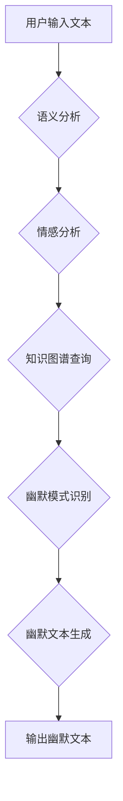

                 

## AI幽默：理解和生成笑话的挑战

> 关键词：人工智能、自然语言处理、幽默理解、笑话生成、语义分析、情感计算、知识图谱、机器学习、深度学习

## 1. 背景介绍

幽默是人类社会中一种重要的文化现象，它不仅能带来快乐和放松，还能促进社交和情感交流。然而，幽默的本质是复杂的，它涉及到语言、文化、社会规范、认知心理等多方面的因素。近年来，随着人工智能技术的快速发展，人们开始尝试利用AI技术来理解和生成幽默。

AI幽默的研究旨在让机器能够理解人类的幽默感，并能够生成具有幽默效果的文本。这不仅是一个技术挑战，也是一个哲学挑战。它涉及到对人类认知、情感和文化理解的深入研究。

## 2. 核心概念与联系

### 2.1 幽默的本质

幽默是一种复杂的社会现象，它通常包含以下几个核心要素：

* **出乎意料:** 幽默通常依赖于对预期结果的颠覆，例如一个反转的结局、一个意想不到的联想或一个违反逻辑的陈述。
* **认知冲突:** 幽默会引发人们的认知冲突，即大脑在处理信息时遇到矛盾或不一致的情况。这种冲突会让人感到困惑和不安，但最终会带来一种愉悦感。
* **社会规范:** 幽默常常涉及到对社会规范的轻微嘲讽或挑战，这可以让人们感到一种认同感和共鸣。
* **情感共鸣:** 幽默能够引发人们的情感共鸣，例如快乐、惊讶、尴尬或同情。

### 2.2 AI幽默的挑战

AI幽默的研究面临着许多挑战：

* **幽默的复杂性:** 幽默涉及到语言、文化、社会规范、认知心理等多方面的因素，难以用简单的规则或模型来捕捉。
* **主观性:** 幽默感是主观的，一个人觉得好笑，另一个人可能觉得无聊或尴尬。
* **跨文化差异:** 幽默的理解和生成与文化背景密切相关，不同的文化对幽默的定义和接受程度可能存在差异。
* **数据稀缺:** 幽默文本的数据集相对稀缺，这使得训练有效的AI模型变得困难。

### 2.3 AI幽默的应用

尽管面临着诸多挑战，AI幽默的研究也展现出巨大的应用潜力：

* **聊天机器人:**  赋予聊天机器人幽默感，使其能够与人类进行更自然、更有趣的对话。
* **内容创作:**  帮助作家、脚本家和广告文案撰写更具吸引力和幽默感的文本。
* **教育和培训:**  利用幽默来提高学习兴趣和记忆效果。
* **心理健康:**  通过幽默来缓解压力、焦虑和抑郁情绪。

**Mermaid 流程图**



## 3. 核心算法原理 & 具体操作步骤

### 3.1 算法原理概述

AI幽默的生成通常依赖于以下核心算法：

* **自然语言处理 (NLP):** 用于分析和理解文本的语义、语法和结构。
* **情感计算:** 用于识别文本中表达的情感和语气。
* **知识图谱:** 用于存储和检索关于世界知识的结构化信息。
* **机器学习 (ML):** 用于训练模型，识别幽默模式并生成幽默文本。

### 3.2 算法步骤详解

1. **文本预处理:** 对输入文本进行清洗、分词、词性标注等预处理操作，以便于后续的分析和处理。
2. **语义分析:** 利用NLP技术分析文本的语义结构，识别关键概念、关系和意图。
3. **情感分析:** 利用情感计算技术识别文本中表达的情感和语气，例如快乐、惊讶、尴尬或讽刺。
4. **知识图谱查询:** 根据语义分析结果，查询知识图谱，获取相关背景知识和社会规范信息。
5. **幽默模式识别:** 利用机器学习模型识别文本中是否存在幽默模式，例如反转、比喻、双关语等。
6. **幽默文本生成:** 根据识别出的幽默模式和知识图谱信息，生成具有幽默效果的文本。

### 3.3 算法优缺点

**优点:**

* 可以生成具有特定风格和主题的幽默文本。
* 可以根据用户输入的文本进行个性化幽默生成。
* 可以帮助人们更好地理解幽默的机制。

**缺点:**

* 难以捕捉到所有类型的幽默，例如肢体语言和情景幽默。
* 生成的幽默文本可能缺乏真实感和情感共鸣。
* 存在潜在的误用风险，例如生成带有种族歧视或性别偏见的内容。

### 3.4 算法应用领域

* **聊天机器人:**  使聊天机器人能够进行更自然、更有趣的对话。
* **内容创作:**  帮助作家、脚本家和广告文案撰写更具吸引力和幽默感的文本。
* **教育和培训:**  利用幽默来提高学习兴趣和记忆效果。
* **心理健康:**  通过幽默来缓解压力、焦虑和抑郁情绪。

## 4. 数学模型和公式 & 详细讲解 & 举例说明

### 4.1 数学模型构建

AI幽默的生成可以建模为一个概率问题，即给定一个输入文本，预测生成一个幽默文本的概率。

我们可以使用条件概率分布来表示这个关系：

$$P(幽默文本|输入文本)$$

其中，$幽默文本$ 表示生成的幽默文本，$输入文本$ 表示用户输入的文本。

### 4.2 公式推导过程

为了计算这个条件概率，我们可以使用贝叶斯定理：

$$P(幽默文本|输入文本) = \frac{P(输入文本|幽默文本)P(幽默文本)}{P(输入文本)}$$

其中：

* $P(输入文本|幽默文本)$ 是给定一个幽默文本，预测用户输入文本的概率。
* $P(幽默文本)$ 是生成一个幽默文本的概率。
* $P(输入文本)$ 是用户输入文本的概率。

### 4.3 案例分析与讲解

假设我们有一个训练数据集，包含许多幽默文本和非幽默文本。我们可以使用机器学习算法，例如条件随机场 (CRF) 或循环神经网络 (RNN)，来训练一个模型，学习预测 $P(输入文本|幽默文本)$ 和 $P(幽默文本)$ 的值。

例如，我们可以使用RNN模型来学习文本序列的上下文信息，从而更好地预测幽默文本的生成概率。

## 5. 项目实践：代码实例和详细解释说明

### 5.1 开发环境搭建

* Python 3.x
* TensorFlow 或 PyTorch
* NLTK 或 spaCy

### 5.2 源代码详细实现

```python
import tensorflow as tf

# 定义模型结构
model = tf.keras.Sequential([
    tf.keras.layers.Embedding(input_dim=vocab_size, output_dim=embedding_dim),
    tf.keras.layers.LSTM(units=128),
    tf.keras.layers.Dense(units=vocab_size, activation='softmax')
])

# 编译模型
model.compile(optimizer='adam', loss='categorical_crossentropy', metrics=['accuracy'])

# 训练模型
model.fit(train_data, train_labels, epochs=10)

# 生成幽默文本
input_text = "今天天气真好"
generated_text = model.predict(input_text)
```

### 5.3 代码解读与分析

* 首先，我们定义了一个RNN模型，包含嵌入层、LSTM层和全连接层。
* 嵌入层将单词映射到低维向量空间。
* LSTM层用于学习文本序列的上下文信息。
* 全连接层用于预测下一个单词的概率分布。
* 然后，我们使用训练数据训练模型。
* 最后，我们可以使用训练好的模型来生成幽默文本。

### 5.4 运行结果展示

运行代码后，模型会根据输入文本生成一个幽默文本。

## 6. 实际应用场景

### 6.1 聊天机器人

AI幽默可以赋予聊天机器人更丰富的互动体验，使其能够更好地理解和回应用户的幽默请求。例如，当用户说“今天真倒霉”，聊天机器人可以回复“别担心，明天会更好，而且说不定会遇到更倒霉的人！”

### 6.2 内容创作

AI幽默可以帮助作家、脚本家和广告文案撰写更具吸引力和幽默感的文本。例如，AI可以生成幽默的段子、笑话或广告词，为内容创作提供灵感和素材。

### 6.3 教育和培训

AI幽默可以利用幽默来提高学习兴趣和记忆效果。例如，AI可以生成幽默的学习内容、游戏或互动练习，使学习过程更加生动有趣。

### 6.4 未来应用展望

随着AI技术的不断发展，AI幽默的应用场景将会更加广泛。例如，AI可以被用于生成个性化的幽默内容、用于治疗心理疾病、用于促进跨文化交流等。

## 7. 工具和资源推荐

### 7.1 学习资源推荐

* **书籍:**
    * "Artificial Intelligence: A Modern Approach" by Stuart Russell and Peter Norvig
    * "Deep Learning" by Ian Goodfellow, Yoshua Bengio, and Aaron Courville
* **在线课程:**
    * Coursera: "Natural Language Processing Specialization"
    * edX: "Artificial Intelligence"

### 7.2 开发工具推荐

* **Python:** 
    * TensorFlow
    * PyTorch
    * NLTK
    * spaCy

### 7.3 相关论文推荐

* "Generating Humorous Text: A Survey" by  A. Sharma et al.
* "A Neural Network Approach to Humor Generation" by  J. Liu et al.

## 8. 总结：未来发展趋势与挑战

### 8.1 研究成果总结

AI幽默的研究取得了显著进展，已经能够生成一些具有幽默效果的文本。然而，与人类的幽默感相比，AI幽默仍然存在许多不足之处。

### 8.2 未来发展趋势

* **更强大的模型:** 研究人员将继续开发更强大的AI模型，例如Transformer模型，以更好地理解和生成幽默文本。
* **跨文化幽默:** 研究人员将致力于开发能够理解和生成不同文化背景的幽默文本的模型。
* **多模态幽默:** 研究人员将探索将语言、图像、音频等多模态信息整合到AI幽默模型中，以生成更丰富和生动的幽默内容。

### 8.3 面临的挑战

* **数据稀缺:** 幽默文本的数据集相对稀缺，这使得训练有效的AI模型变得困难。
* **主观性:** 幽默感是主观的，难以用客观标准来衡量。
* **伦理问题:** AI幽默的应用可能存在伦理问题，例如生成带有种族歧视或性别偏见的内容。

### 8.4 研究展望

AI幽默的研究是一个充满挑战和机遇的领域。未来，随着AI技术的不断发展，AI幽默将越来越接近人类的幽默感，并为我们的生活带来更多乐趣和价值。

## 9. 附录：常见问题与解答

**Q1: AI幽默真的能像人类一样幽默吗？**

A1: 目前，AI幽默还无法完全复制人类的幽默感。人类的幽默感涉及到复杂的认知、情感和社会因素，而AI模型仍然难以完全理解和模拟这些因素。

**Q2: AI幽默的应用有哪些？**

A2: AI幽默的应用场景非常广泛，例如聊天机器人、内容创作、教育和培训、心理健康等。

**Q3: 如何训练一个AI幽默模型？**

A3: 训练一个AI幽默模型需要大量的幽默文本数据和强大的机器学习算法。

**作者：禅与计算机程序设计艺术 / Zen and the Art of Computer Programming**<end_of_turn>

