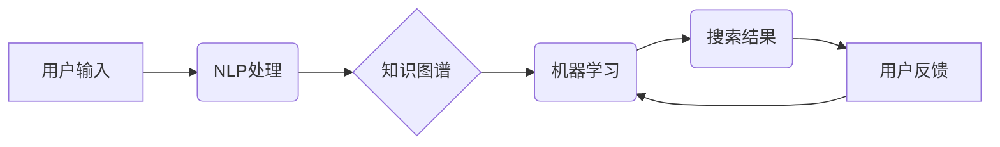

                 

## AI搜索引擎在教育领域的应用前景

> 关键词：人工智能、搜索引擎、教育、学习、个性化、知识图谱、自然语言处理

## 1. 背景介绍

教育领域正在经历一场深刻的变革，人工智能（AI）技术作为这场变革的引擎，正在改变着传统的教学模式和学习体验。其中，AI搜索引擎作为AI技术的应用之一，展现出巨大的潜力，有望彻底改变教育领域的信息获取、知识学习和教学评估等环节。

传统的搜索引擎主要依靠关键词匹配来检索信息，但对于教育领域而言，这种方式存在着局限性。学生在学习过程中往往需要更深入、更全面的知识理解，而简单的关键词匹配难以满足这一需求。AI搜索引擎通过自然语言处理（NLP）、知识图谱和机器学习等技术，能够更精准地理解学生的意图，并提供更相关、更深入的知识信息，从而提升学习效率和效果。

## 2. 核心概念与联系

**2.1 核心概念**

* **人工智能（AI）：** 指计算机模拟人类智能行为的能力，包括学习、推理、决策、语言理解等。
* **搜索引擎：**  一种信息检索系统，通过对互联网上的网页进行索引和排名，帮助用户快速找到所需的信息。
* **自然语言处理（NLP）：**  让计算机能够理解、处理和生成人类语言的技术。
* **知识图谱：**  一种结构化的知识表示形式，将知识点和它们之间的关系以图的形式表示出来。
* **机器学习（ML）：**  一种人工智能技术，通过算法从数据中学习，不断改进模型的预测能力。

**2.2 架构关系**



**2.3 核心联系**

AI搜索引擎将上述核心概念有机结合，实现以下功能：

* **理解用户意图：**  通过NLP技术，AI搜索引擎能够理解用户的自然语言输入，识别出用户的真实需求。
* **知识检索与关联：**  利用知识图谱，AI搜索引擎能够快速检索相关知识，并根据知识之间的关联性，提供更全面的信息。
* **个性化推荐：**  通过机器学习，AI搜索引擎能够根据用户的学习历史、兴趣偏好等信息，个性化推荐学习资源。
* **持续学习与优化：**  AI搜索引擎能够根据用户的反馈信息，不断学习和优化模型，提高搜索结果的准确性和相关性。

## 3. 核心算法原理 & 具体操作步骤

**3.1 算法原理概述**

AI搜索引擎的核心算法主要包括：

* **自然语言处理（NLP）算法：** 用于理解用户的自然语言输入，包括词性标注、依存句法分析、语义角色标注等。
* **知识图谱构建算法：** 用于构建知识图谱，包括知识抽取、关系识别、实体链接等。
* **机器学习（ML）算法：** 用于个性化推荐、搜索结果排序等，包括协同过滤、内容过滤、深度学习等。

**3.2 算法步骤详解**

1. **用户输入：** 学生通过自然语言输入搜索关键词或问题。
2. **NLP处理：**  NLP算法对用户的输入进行分析，识别出关键词、实体、关系等信息。
3. **知识图谱检索：**  根据NLP分析结果，AI搜索引擎从知识图谱中检索相关知识点和关系。
4. **结果排序与筛选：**  利用机器学习算法对检索到的知识点进行排序和筛选，根据用户的意图和学习需求，提供最相关、最合适的搜索结果。
5. **结果呈现：**  AI搜索引擎将搜索结果以文本、图像、视频等多种形式呈现给学生。

**3.3 算法优缺点**

* **优点：**
    * 能够理解用户的自然语言输入，提供更精准的搜索结果。
    * 基于知识图谱，能够提供更全面的知识信息和关联关系。
    * 通过机器学习，能够个性化推荐学习资源，提升学习效率。
* **缺点：**
    * 算法模型的训练需要大量的数据，数据质量直接影响算法效果。
    * 知识图谱的构建和维护需要专业知识和技术支持。
    * 算法的解释性和透明度需要进一步提高，以增强用户信任。

**3.4 算法应用领域**

AI搜索引擎在教育领域的应用场景非常广泛，包括：

* **在线学习平台：**  帮助学生查找学习资料、解答疑问、进行知识复习。
* **智能辅导系统：**  根据学生的学习情况，提供个性化的学习建议和辅导。
* **教育资源推荐：**  推荐适合学生学习水平和兴趣的学习资源。
* **教学评估与分析：**  分析学生的学习行为和成绩，为教师提供教学参考。

## 4. 数学模型和公式 & 详细讲解 & 举例说明

**4.1 数学模型构建**

AI搜索引擎的核心算法通常基于机器学习模型，例如：

* **协同过滤模型：**  根据用户的历史行为和其他用户的相似性，预测用户对某项资源的兴趣。
* **内容过滤模型：**  根据资源的特征和用户的兴趣偏好，预测用户对资源的兴趣。
* **深度学习模型：**  利用多层神经网络，学习更复杂的知识表示和关系，提高搜索结果的准确性。

**4.2 公式推导过程**

例如，协同过滤模型中常用的**用户-物品评分预测公式**如下：

$$
\hat{r}_{u,i} = \bar{r}_u + \frac{\sum_{j \in N(u)} (r_{u,j} - \bar{r}_u) \cdot (r_{j,i} - \bar{r}_j)}{\sum_{j \in N(u)} (r_{u,j} - \bar{r}_u)^2}
$$

其中：

* $\hat{r}_{u,i}$：预测用户 $u$ 对物品 $i$ 的评分。
* $\bar{r}_u$：用户 $u$ 的平均评分。
* $r_{u,j}$：用户 $u$ 对物品 $j$ 的实际评分。
* $N(u)$：与用户 $u$ 相似的用户集合。

**4.3 案例分析与讲解**

假设有一个在线学习平台，用户 $A$ 对数学课程评分为 5，对英语课程评分为 4。用户 $B$ 对数学课程评分为 4，对英语课程评分为 5。如果我们想预测用户 $A$ 对英语课程的评分，可以使用协同过滤模型进行预测。

通过公式推导，我们可以得到用户 $A$ 对英语课程的预测评分。

## 5. 项目实践：代码实例和详细解释说明

**5.1 开发环境搭建**

* 操作系统：Linux/macOS/Windows
* Python 版本：3.6+
* 必要的库：

    * NLTK：自然语言处理库
    * SpaCy：自然语言处理库
    * TensorFlow/PyTorch：深度学习框架
    * NetworkX：图论库

**5.2 源代码详细实现**

由于篇幅限制，这里只提供一个简单的代码示例，展示如何使用Python和NLTK库进行关键词提取：

```python
import nltk

# 下载 NLTK 词典
nltk.download('punkt')

# 用户输入
text = "我想要学习人工智能的知识"

# 使用 Punkt 分词器进行分词
tokens = nltk.word_tokenize(text)

# 打印关键词
print(tokens)
```

**5.3 代码解读与分析**

* `nltk.download('punkt')`：下载 NLTK 的 Punkt 分词器模型。
* `nltk.word_tokenize(text)`：使用 Punkt 分词器将文本分割成单词。
* `print(tokens)`：打印分词后的单词列表。

**5.4 运行结果展示**

```
['我', '想要', '学习', '人工智能', '的', '知识']
```

## 6. 实际应用场景

**6.1 在线学习平台**

AI搜索引擎可以帮助在线学习平台提供更智能的学习体验，例如：

* **个性化学习推荐：**  根据学生的学习历史、兴趣偏好等信息，推荐适合学生的学习资源。
* **智能问答系统：**  帮助学生解答学习疑问，提供更深入的知识解释。
* **知识图谱辅助学习：**  通过知识图谱，帮助学生理解知识之间的关联性，构建更完整的知识体系。

**6.2 智能辅导系统**

AI搜索引擎可以帮助构建智能辅导系统，为学生提供个性化的学习辅导，例如：

* **学习进度跟踪：**  跟踪学生的学习进度，及时发现学习困难。
* **错题分析：**  分析学生的错题类型，针对性地提供辅导。
* **个性化学习计划：**  根据学生的学习情况，制定个性化的学习计划。

**6.3 教育资源推荐**

AI搜索引擎可以帮助教育机构和平台推荐更优质的教育资源，例如：

* **教材推荐：**  根据学生的学习水平和兴趣，推荐合适的教材。
* **在线课程推荐：**  推荐适合学生的在线课程，帮助学生拓展学习视野。
* **学习工具推荐：**  推荐适合学生的学习工具，提高学习效率。

**6.4 未来应用展望**

随着人工智能技术的不断发展，AI搜索引擎在教育领域的应用前景更加广阔，例如：

* **沉浸式学习体验：**  利用虚拟现实（VR）和增强现实（AR）技术，构建沉浸式的学习环境，提高学生的学习兴趣和参与度。
* **个性化学习路径：**  根据学生的学习风格、能力和目标，构建个性化的学习路径，实现精准化教学。
* **跨学科知识融合：**  打破学科之间的壁垒，帮助学生构建更完整的知识体系，培养跨学科思维能力。

## 7. 工具和资源推荐

**7.1 学习资源推荐**

* **在线课程：** Coursera、edX、Udacity 等平台提供人工智能、自然语言处理等相关课程。
* **书籍：** 《深度学习》、《自然语言处理》等书籍可以帮助深入了解相关知识。
* **开源项目：** TensorFlow、PyTorch 等开源项目可以帮助实践人工智能算法。

**7.2 开发工具推荐**

* **Python：**  人工智能开发的常用语言，拥有丰富的库和工具。
* **Jupyter Notebook：**  交互式编程环境，方便进行代码编写、调试和可视化。
* **Git：**  版本控制系统，方便代码管理和协作。

**7.3 相关论文推荐**

* **BERT：**  Bidirectional Encoder Representations from Transformers
* **GPT-3：**  Generative Pre-trained Transformer 3
* **Knowledge Graph Embedding：**  知识图谱嵌入

## 8. 总结：未来发展趋势与挑战

**8.1 研究成果总结**

AI搜索引擎在教育领域的应用取得了显著成果，例如：

* **提高学习效率：**  个性化推荐和智能问答系统帮助学生更高效地学习。
* **提升学习体验：**  知识图谱辅助学习和沉浸式学习体验提升了学生的学习兴趣和参与度。
* **促进教育公平：**  AI搜索引擎可以帮助弥合教育资源的差距，为更多学生提供优质的学习机会。

**8.2 未来发展趋势**

* **更深入的知识理解：**  利用深度学习等技术，帮助AI搜索引擎更深入地理解知识，提供更全面的知识解释。
* **更个性化的学习体验：**  根据学生的学习风格、能力和目标，构建更个性化的学习路径和学习体验。
* **跨学科知识融合：**  打破学科之间的壁垒，帮助学生构建更完整的知识体系，培养跨学科思维能力。

**8.3 面临的挑战**

* **数据质量和隐私问题：**  AI搜索引擎的训练需要大量的数据，数据质量直接影响算法效果。同时，学生数据隐私保护也是一个重要的挑战。
* **算法解释性和透明度：**  AI算法的决策过程往往难以理解，缺乏透明度，这可能会导致用户信任不足。
* **伦理和社会影响：**  AI搜索引擎的应用可能会带来一些伦理和社会问题，例如算法偏见、信息茧房等，需要引起重视和探讨。

**8.4 研究展望**

未来，AI搜索引擎在教育领域的应用将继续深入发展，需要加强以下方面的研究：

* **更有效的知识表示和推理方法：**  探索更有效的知识表示和推理方法，帮助AI搜索引擎更深入地理解知识。
* **更个性化和适应性的学习系统：**  开发更个性化和适应性的学习系统，根据学生的学习情况动态调整学习内容和难度。
* **AI伦理和社会影响研究：**  加强AI伦理和社会影响研究，确保AI技术在教育领域的应用安全、有效和可持续。


## 9. 附录：常见问题与解答

**9.1 如何保证AI搜索引擎的准确性和可靠性？**

AI搜索引擎的准确性和可靠性取决于数据的质量、算法模型的训练和评估。需要不断收集高质量的数据，优化算法模型，并进行严格的测试和评估，以确保搜索结果的准确性和可靠性。

**9.2 如何解决AI搜索引擎的算法偏见问题？**

算法偏见是AI技术的一个普遍问题，需要通过以下措施来解决：

* 使用更加多元化的训练数据，减少数据偏差。
* 开发算法公平性评估指标，及时发现和解决算法偏见。
* 构建透明可解释的算法模型，方便用户理解算法决策过程。

**9.3 如何保护学生数据隐私？**

学生数据隐私保护是AI搜索引擎应用中的重要问题，需要采取以下措施：

* 明确收集、使用和存储学生数据的政策，获得家长和学生的同意。
* 加强数据加密和安全防护，防止数据泄露。
*  anonymize 学生数据，保护学生的个人信息。


作者：禅与计算机程序设计艺术 / Zen and the Art of Computer Programming<end_of_turn>

