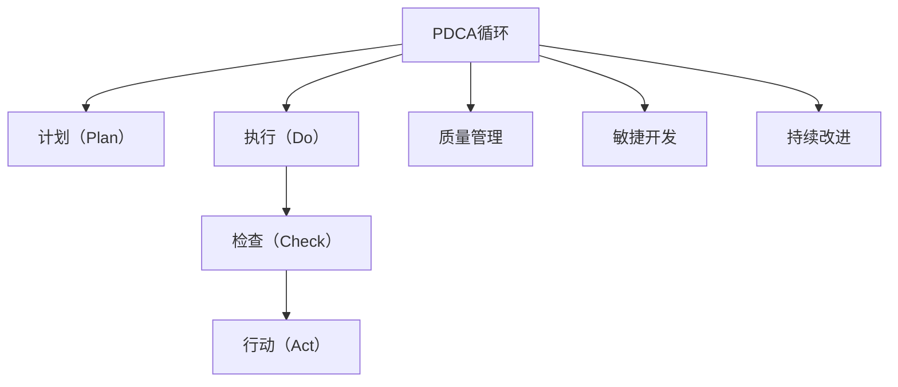

                 

# PDCA落地:持续改进的指南

> 关键词：PDCA,持续改进,项目管理,软件开发,质量管理,敏捷开发

## 1. 背景介绍

### 1.1 问题由来
在当今快速变化的技术和商业环境中，企业和组织面临着巨大的挑战和机遇。持续改进的实践成为了提升效率、降低成本、增强竞争力的关键。其中，PDCA（Plan-Do-Check-Act）循环作为一套经典的质量管理方法，已被广泛应用于各行业领域。

### 1.2 问题核心关键点
PDCA循环是指通过计划（Plan）、执行（Do）、检查（Check）和行动（Act）这四个阶段循环进行质量管理的过程，不断优化改进。PDCA循环的核心在于持续的反馈与调整，以达到最佳的质量和效率。然而，PDCA在实际应用中往往存在流程复杂、工具支持不足等问题，导致其落地效果不佳。

### 1.3 问题研究意义
理解和掌握PDCA的落地技巧，对于提升团队和组织的持续改进能力，优化项目管理过程，推动高质量的软件开发，具有重要意义：

1. 提高效率：通过PDCA循环，能够及时发现和解决问题，避免重复劳动，提升项目执行效率。
2. 降低成本：持续改进能够优化流程，减少浪费，提升资源利用效率，降低开发和运营成本。
3. 增强灵活性：PDCA的动态调整机制，使得团队能够快速响应市场变化，适应新的需求和挑战。
4. 提升质量：PDCA循环强调质量保证，通过不断检验和改进，确保产品和服务的高质量标准。
5. 促进创新：PDCA循环鼓励团队创新，通过定期反思和调整，探索新的方法和技术，推动技术进步。

## 2. 核心概念与联系

### 2.1 核心概念概述

为更好地理解PDCA的落地实践，本节将介绍几个密切相关的核心概念：

- **PDCA循环**：PDCA循环是PDCA方法的核心，通过四个阶段不断循环，逐步提升质量和工作效率。
- **计划（Plan）**：明确目标、确定流程、分配资源，为执行和检查阶段提供指导。
- **执行（Do）**：按计划执行工作，确保目标得以实现，记录过程和结果。
- **检查（Check）**：评估执行结果，与预期目标对比，找出问题和改进点。
- **行动（Act）**：根据检查结果采取措施，修正问题，进行优化，并准备下一轮PDCA循环。

- **质量管理**：通过PDCA循环，确保项目和产品的质量标准得以持续满足。
- **敏捷开发**：敏捷方法强调快速反馈和迭代，与PDCA循环的动态调整机制相契合。
- **持续改进**：PDCA循环的核心就是持续改进，不断优化流程和产品。

这些核心概念之间的逻辑关系可以通过以下Mermaid流程图来展示：



这个流程图展示了一个完整的PDCA流程，以及与质量管理、敏捷开发、持续改进等概念的联系。

## 3. 核心算法原理 & 具体操作步骤
### 3.1 算法原理概述

PDCA循环的原理是基于反馈机制和动态调整，通过不断的PDCA循环，逐步优化项目和产品，确保其满足质量标准。其核心思想是：

1. **计划阶段**：明确目标和步骤，制定详细计划。
2. **执行阶段**：按照计划执行工作，记录执行过程和结果。
3. **检查阶段**：评估执行结果，找出问题和改进点。
4. **行动阶段**：根据检查结果采取措施，修正问题，进行优化。

PDCA循环的动态调整机制，使得组织能够不断适应变化，提升效率和质量。

### 3.2 算法步骤详解

PDCA循环的具体操作步骤如下：

**Step 1: 计划阶段**
- **目标设定**：明确项目目标和预期结果。
- **流程规划**：制定详细的执行计划，包括任务分配、资源调配、时间安排等。
- **风险评估**：识别潜在风险和问题，制定应对措施。

**Step 2: 执行阶段**
- **任务执行**：按照计划执行各项任务，确保每个步骤得到落实。
- **过程记录**：详细记录执行过程中的关键步骤和结果，包括日志、代码变更、文档等。
- **反馈机制**：建立反馈机制，及时收集执行过程中的问题反馈。

**Step 3: 检查阶段**
- **结果评估**：将执行结果与预期目标对比，评估实际成果。
- **问题分析**：识别问题和不足，分析原因。
- **改进建议**：提出改进措施和建议，准备实施。

**Step 4: 行动阶段**
- **措施实施**：根据改进建议，采取具体措施进行优化和调整。
- **效果验证**：评估改进措施的效果，确保问题得到解决。
- **反馈循环**：将本次循环的改进经验反馈到下一个PDCA循环中，继续优化。

### 3.3 算法优缺点

PDCA循环具有以下优点：
1. **系统性**：通过四个阶段不断循环，确保项目和产品从规划到执行、评估到优化，形成完整的闭环。
2. **灵活性**：PDCA循环的动态调整机制，使得组织能够快速响应变化，适应新情况。
3. **透明性**：PDCA循环强调记录和反馈，确保每个阶段的决策和执行过程可追溯。
4. **持续改进**：通过不断的PDCA循环，逐步提升项目和产品的质量和工作效率。

同时，PDCA循环也存在一些局限性：
1. **复杂性**：四个阶段和多个反馈环节，使得PDCA流程相对复杂，可能增加管理成本。
2. **依赖执行**：执行阶段的执行力对PDCA效果有重要影响，执行不力可能导致PDCA无法顺利进行。
3. **时间消耗**：PDCA循环需要耗费一定时间，对于快速变化的项目，可能影响项目进度。

尽管如此，PDCA循环在实际项目管理中仍然具有重要价值，特别是在复杂项目和质量控制方面。

### 3.4 算法应用领域

PDCA循环被广泛应用于软件开发、质量管理、项目管理等多个领域，具体应用场景如下：

- **软件开发**：在敏捷开发中，PDCA循环与敏捷迭代相结合，确保每次迭代都有计划、执行、检查和行动，持续改进产品质量。
- **质量管理**：PDCA循环通过不断检查和改进，确保产品和服务满足质量标准，提升客户满意度。
- **项目管理**：在项目管理中，PDCA循环帮助团队制定详细计划，优化执行过程，及时解决问题，确保项目按时完成。
- **运维管理**：在运维过程中，PDCA循环通过不断检查和优化，提升系统稳定性和可靠性，减少故障和宕机风险。
- **业务改进**：在业务流程优化中，PDCA循环通过不断检查和调整，提升业务效率，降低运营成本。

PDCA循环在各领域的广泛应用，展示了其在提升效率、质量和工作效率方面的强大能力。

## 4. 数学模型和公式 & 详细讲解 & 举例说明

### 4.1 数学模型构建

PDCA循环的数学模型可以简单表示为一个循环，每个阶段包含多个步骤。以软件开发为例，PDCA循环的数学模型如下：

$$
PDCA = P(计划) + D(执行) + C(检查) + A(行动)
$$

其中，每个阶段的具体步骤可以进一步细化：

- **计划阶段**：
  $$
  P = P_1(目标设定) + P_2(流程规划) + P_3(风险评估)
  $$

- **执行阶段**：
  $$
  D = D_1(任务执行) + D_2(过程记录) + D_3(反馈机制)
  $$

- **检查阶段**：
  $$
  C = C_1(结果评估) + C_2(问题分析) + C_3(改进建议)
  $$

- **行动阶段**：
  $$
  A = A_1(措施实施) + A_2(效果验证) + A_3(反馈循环)
  $$

### 4.2 公式推导过程

以软件开发为例，PDCA循环的公式推导过程如下：

1. **计划阶段**
  - **目标设定**：设定项目目标和预期结果，可以表示为：
    $$
    P_1 = \text{目标} = f(\text{需求}, \text{质量标准}, \text{资源})
    $$

  - **流程规划**：制定详细的执行计划，包括任务分配、时间安排等，可以表示为：
    $$
    P_2 = \text{计划} = f(\text{目标}, \text{资源}, \text{风险})
    $$

  - **风险评估**：识别潜在风险和问题，制定应对措施，可以表示为：
    $$
    P_3 = \text{风险评估} = f(\text{历史数据}, \text{经验}, \text{环境})
    $$

2. **执行阶段**
  - **任务执行**：按照计划执行各项任务，可以表示为：
    $$
    D_1 = \text{执行} = f(\text{计划}, \text{资源}, \text{时间})
    $$

  - **过程记录**：详细记录执行过程中的关键步骤和结果，可以表示为：
    $$
    D_2 = \text{记录} = f(\text{任务}, \text{日志}, \text{文档})
    $$

  - **反馈机制**：建立反馈机制，及时收集执行过程中的问题反馈，可以表示为：
    $$
    D_3 = \text{反馈} = f(\text{执行}, \text{问题}, \text{反馈渠道})
    $$

3. **检查阶段**
  - **结果评估**：将执行结果与预期目标对比，可以表示为：
    $$
    C_1 = \text{评估} = f(\text{执行结果}, \text{目标}, \text{标准})
    $$

  - **问题分析**：识别问题和不足，分析原因，可以表示为：
    $$
    C_2 = \text{分析} = f(\text{评估结果}, \text{数据}, \text{经验})
    $$

  - **改进建议**：提出改进措施和建议，可以表示为：
    $$
    C_3 = \text{建议} = f(\text{分析结果}, \text{改进方案}, \text{资源})
    $$

4. **行动阶段**
  - **措施实施**：根据改进建议，采取具体措施进行优化和调整，可以表示为：
    $$
    A_1 = \text{措施} = f(\text{建议}, \text{资源}, \text{时间})
    $$

  - **效果验证**：评估改进措施的效果，可以表示为：
    $$
    A_2 = \text{验证} = f(\text{措施}, \text{效果}, \text{标准})
    $$

  - **反馈循环**：将本次循环的改进经验反馈到下一个PDCA循环中，可以表示为：
    $$
    A_3 = \text{反馈} = f(\text{验证结果}, \text{经验}, \text{新目标})
    $$

### 4.3 案例分析与讲解

**案例：软件开发项目管理**

某软件开发项目在执行过程中遇到以下问题：

1. **问题描述**：部分功能模块未能按时交付，导致项目整体进度延误。
2. **分析原因**：经过PDCA循环的检查阶段分析，发现问题原因包括：
   - 任务分配不合理，导致部分任务堆积。
   - 缺乏有效的进度跟踪机制，导致任务执行情况不透明。
3. **改进措施**：根据分析结果，采取以下改进措施：
   - **措施1**：重新分配任务，确保工作量均衡。
   - **措施2**：引入敏捷开发方法，提升任务透明度和灵活性。
   - **措施3**：建立每日站会机制，及时沟通和解决问题。
4. **效果验证**：在行动阶段实施改进措施后，项目进度得到显著提升，未再出现类似问题。
5. **反馈循环**：将本次循环的改进经验反馈到下一个PDCA循环中，继续优化项目管理。

## 5. 项目实践：代码实例和详细解释说明
### 5.1 开发环境搭建

在进行PDCA实践前，我们需要准备好开发环境。以下是使用JIRA开发环境配置流程：

1. 安装JIRA：从官网下载并安装JIRA。
2. 配置开发环境：根据项目需求，配置JIRA的各种插件和工具。
3. 初始化项目：在JIRA中创建新的项目，设置任务类型、工作流等。
4. 设置用户权限：配置项目的用户权限，确保每个角色能够访问和修改相应的任务。

完成上述步骤后，即可在JIRA环境中开始PDCA实践。

### 5.2 源代码详细实现

这里我们以敏捷开发中的PDCA循环为例，给出使用JIRA进行PDCA循环的Python代码实现。

首先，定义PDCA循环的各个阶段：

```python
class PDCA:
    def __init__(self, project_id):
        self.project_id = project_id
        self.plan_tasks = []
        self.do_tasks = []
        self.check_tasks = []
        self.act_tasks = []
    
    def plan(self):
        # 计划阶段
        self.plan_tasks = self.create_tasks('Plan')
    
    def do(self):
        # 执行阶段
        self.do_tasks = self.create_tasks('Do')
    
    def check(self):
        # 检查阶段
        self.check_tasks = self.create_tasks('Check')
    
    def act(self):
        # 行动阶段
        self.act_tasks = self.create_tasks('Act')
    
    def create_tasks(self, stage_name):
        # 创建任务
        tasks = []
        for i in range(1, 6):
            task = {
                'project': self.project_id,
                'summary': f'{stage_name} {i}',
                'status': 'To Do'
            }
            tasks.append(task)
        return tasks
```

然后，定义PDCA循环的执行方法：

```python
def execute_pdca(pdca):
    pdca.plan()
    pdca.do()
    pdca.check()
    pdca.act()
    print('PDCA循环执行完成')
```

最后，启动PDCA循环：

```python
pdca = PDCA('AGILE-PROJECT')
execute_pdca(pdca)
```

以上就是使用JIRA进行PDCA循环的完整代码实现。可以看到，通过定义PDCA循环的各个阶段和执行方法，可以灵活地进行PDCA实践，提升项目的持续改进能力。

### 5.3 代码解读与分析

让我们再详细解读一下关键代码的实现细节：

**PDCA类**：
- `__init__`方法：初始化PDCA对象，记录项目ID，并创建空列表用于存储各个阶段的任务。
- `plan`方法：在计划阶段创建任务，确保每个任务都明确目标和步骤。
- `do`方法：在执行阶段创建任务，按照计划执行各项工作，记录过程和结果。
- `check`方法：在检查阶段创建任务，评估执行结果，找出问题和改进点。
- `act`方法：在行动阶段创建任务，根据改进建议采取措施，优化流程和产品。
- `create_tasks`方法：创建具体任务，并设置任务名称和状态。

**execute_pdca函数**：
- 按照PDCA的四个阶段，依次执行计划、执行、检查和行动，记录PDCA循环的执行过程。

**PDCA实践**：
- 通过调用`PDCA`类的构造函数和`execute_pdca`函数，启动PDCA循环，确保每个阶段的执行过程透明、可追溯。

合理利用JIRA等工具，可以显著提升PDCA实践的效率和效果。开发者可以将更多精力放在任务规划和执行优化上，而不必过多关注底层实现细节。

当然，工业级的系统实现还需考虑更多因素，如用户权限管理、任务依赖关系、进度跟踪等，但核心的PDCA范式基本与此类似。

## 6. 实际应用场景
### 6.1 软件开发项目管理

PDCA循环在软件开发项目管理中有着广泛应用。敏捷开发、Scrum、Kanban等敏捷方法，本质上是PDCA循环在软件项目管理中的具体实践。通过PDCA循环，软件开发团队能够持续改进项目管理过程，提升项目交付效率和质量。

在敏捷开发中，PDCA循环与敏捷迭代相结合，确保每次迭代都有计划、执行、检查和行动，持续改进产品质量。敏捷开发中的Sprint回顾会议、每日站会等机制，实际上就是PDCA循环的具体体现。

### 6.2 质量管理

在质量管理中，PDCA循环通过不断检查和改进，确保产品和服务满足质量标准，提升客户满意度。例如，在制造业中，PDCA循环可以用于质量控制、工艺改进、设备维护等，通过不断优化生产流程，提高产品质量，降低生产成本。

PDCA循环的检查和行动阶段，使得质量管理团队能够及时发现和解决问题，避免批量质量问题的发生。通过PDCA循环的不断循环，质量管理体系不断优化，企业的产品和服务质量得到持续提升。

### 6.3 项目管理

在项目管理中，PDCA循环帮助团队制定详细计划，优化执行过程，及时解决问题，确保项目按时完成。例如，在大型工程项目中，PDCA循环可以用于项目进度管理、资源调配、风险控制等，通过不断循环，逐步提升项目管理能力，确保项目目标得以实现。

PDCA循环的四个阶段，使得项目管理团队能够系统性地识别和解决问题，提升项目执行的透明性和可控性。通过PDCA循环的不断优化，项目管理过程不断完善，项目成功概率不断提升。

### 6.4 运维管理

在运维管理中，PDCA循环通过不断检查和优化，提升系统稳定性和可靠性，减少故障和宕机风险。例如，在IT运维中，PDCA循环可以用于服务监控、故障排查、系统升级等，通过不断循环，逐步提升系统稳定性和用户体验。

PDCA循环的检查和行动阶段，使得运维团队能够及时发现和解决问题，避免系统故障的发生。通过PDCA循环的不断循环，运维管理体系不断优化，系统稳定性和用户体验得到持续提升。

## 7. 工具和资源推荐
### 7.1 学习资源推荐

为了帮助开发者系统掌握PDCA的落地技巧，这里推荐一些优质的学习资源：

1. 《PDCA循环的实践指南》系列博文：由PDCA专家撰写，深入浅出地介绍了PDCA循环的基本概念和应用方法。

2. PDCA方法论的课程：各大在线教育平台提供的PDCA课程，如Coursera、Udemy等，涵盖PDCA方法论的基本原理和应用案例。

3. 《PDCA循环的应用》书籍：详细介绍了PDCA循环在各行业领域的应用案例，提供系统性的学习路径。

4. 精益敏捷社区：PDCA循环在精益敏捷领域的应用实践，提供丰富的学习资源和交流平台。

5. JIRA官方文档：JIRA的官方文档，提供了丰富的PDCA实践案例和最佳实践指南。

通过对这些资源的学习实践，相信你一定能够快速掌握PDCA循环的精髓，并用于解决实际的持续改进问题。

### 7.2 开发工具推荐

高效的开发离不开优秀的工具支持。以下是几款用于PDCA实践开发的常用工具：

1. JIRA：用于项目管理、问题跟踪、任务分配的流行工具，适合PDCA循环的应用。

2. Trello：简单易用的看板工具，支持PDCA循环的可视化管理。

3. Asana：灵活的项目管理工具，支持PDCA循环的任务安排和进度跟踪。

4. Smartsheet：支持PDCA循环的智能项目管理工具，提供强大的数据分析和可视化功能。

5. Microsoft Project：专业的项目管理软件，支持PDCA循环的详细规划和执行。

合理利用这些工具，可以显著提升PDCA实践的效率和效果，加快创新迭代的步伐。

### 7.3 相关论文推荐

PDCA循环的研究源于学界的持续研究。以下是几篇奠基性的相关论文，推荐阅读：

1. "PDCA循环的原理与实践"：介绍了PDCA循环的基本原理和应用方法。

2. "PDCA循环在质量管理中的应用"：探讨了PDCA循环在质量管理中的具体应用案例。

3. "敏捷开发中的PDCA循环"：详细介绍了PDCA循环在敏捷开发中的应用实践。

4. "PDCA循环的优化与改进"：讨论了PDCA循环在不同应用场景下的优化和改进方法。

这些论文代表了大语言模型微调技术的发展脉络。通过学习这些前沿成果，可以帮助研究者把握学科前进方向，激发更多的创新灵感。

## 8. 总结：未来发展趋势与挑战
### 8.1 总结

本文对PDCA循环的落地实践进行了全面系统的介绍。首先阐述了PDCA循环的研究背景和意义，明确了PDCA在提升效率、降低成本、增强灵活性等方面的独特价值。其次，从原理到实践，详细讲解了PDCA循环的数学模型和关键步骤，给出了PDCA实践的完整代码实例。同时，本文还广泛探讨了PDCA循环在软件开发、质量管理、项目管理等多个领域的应用前景，展示了PDCA循环的强大能力。

通过本文的系统梳理，可以看到，PDCA循环在提升组织效率、优化项目管理、推动高质量软件开发等方面具有重要价值。它强调了持续改进的重要性，通过不断循环和优化，逐步提升质量和工作效率。

### 8.2 未来发展趋势

展望未来，PDCA循环在各领域的广泛应用，将呈现以下几个发展趋势：

1. **自动化**：随着人工智能和自动化技术的发展，PDCA循环的执行过程将越来越自动化，减少人工干预，提升效率。
2. **数据驱动**：通过引入大数据和机器学习技术，PDCA循环将更加数据驱动，实时监控和反馈，提升决策的科学性和准确性。
3. **协同化**：PDCA循环将与更多工具和系统集成，形成协同优化，提升整体管理和执行能力。
4. **定制化**：PDCA循环将根据不同行业和应用的特点，进行定制化设计和优化，提升针对性和适用性。
5. **全球化**：随着全球化进程的加速，PDCA循环将在跨国公司和多文化环境中得到应用，提升全球协同管理能力。

这些趋势凸显了PDCA循环在提升管理效率、优化决策过程等方面的广阔前景。

### 8.3 面临的挑战

尽管PDCA循环在实际应用中已经取得显著成效，但在迈向更加智能化、普适化应用的过程中，它仍面临着诸多挑战：

1. **执行复杂性**：PDCA循环的四个阶段和多个反馈环节，使得执行过程相对复杂，可能增加管理成本。
2. **数据依赖**：PDCA循环的执行依赖于大量数据和反馈信息，数据质量和完整性对PDCA效果有重要影响。
3. **资源消耗**：PDCA循环的执行需要消耗大量时间和人力资源，可能影响项目进度和团队负担。
4. **持续改进**：PDCA循环的动态调整机制，需要持续不断地优化和改进，对团队的执行力和灵活性提出了较高要求。

尽管如此，PDCA循环在提升组织效率、优化项目管理、推动高质量软件开发等方面仍具有重要价值，其应用前景依然广阔。

### 8.4 研究展望

面对PDCA循环面临的挑战，未来的研究需要在以下几个方面寻求新的突破：

1. **自动化和智能化**：通过引入AI和大数据技术，进一步自动化PDCA循环的执行过程，提升效率和准确性。
2. **数据驱动和实时化**：通过实时数据监控和分析，提升PDCA循环的决策科学性和灵活性。
3. **协同化与集成化**：将PDCA循环与其他工具和系统集成，形成协同优化，提升整体管理效率。
4. **定制化与个性化**：根据不同行业和应用的特点，进行定制化设计和优化，提升针对性和适用性。
5. **全球化与跨文化**：在跨国公司和多文化环境中，实现PDCA循环的全球化和跨文化应用。

这些研究方向的探索，必将引领PDCA循环走向更高的台阶，为提升组织管理和执行力提供新的路径。面向未来，PDCA循环需要与其他技术和方法进行更深入的融合，共同推动管理实践的进步。

## 9. 附录：常见问题与解答

**Q1：PDCA循环是否适用于所有管理领域？**

A: PDCA循环在大多数管理领域都能取得不错的效果，特别是在流程复杂、任务分散的项目中。然而，对于一些需要快速响应、高度灵活的领域，如创新研发、市场运营等，PDCA循环可能需要与其他方法结合使用，才能更好地满足需求。

**Q2：如何确定PDCA循环中的目标和步骤？**

A: PDCA循环的目标和步骤应根据具体情况进行设定。在计划阶段，应充分调研和分析，明确项目目标和预期结果。在执行阶段，应制定详细的计划和资源分配，确保每个步骤得到落实。在检查阶段，应评估实际成果与预期目标的差距，找出问题和改进点。在行动阶段，应根据改进建议采取具体措施，并进行效果验证。

**Q3：PDCA循环中的反馈机制如何设计？**

A: PDCA循环的反馈机制应基于开放透明的原则，确保每个阶段的信息可追溯、可分享。可以建立定期的回顾会议、任务评审、进度报告等机制，收集和反馈执行过程中的问题，及时调整和优化。在敏捷开发中，每日站会、Sprint回顾等机制，实际上就是PDCA循环的具体体现。

**Q4：PDCA循环中的改进措施如何确定？**

A: PDCA循环的改进措施应基于问题分析的结果，进行科学决策。可以通过数据分析、专家咨询、用户反馈等方式，确定改进措施的有效性和可行性。在实施改进措施时，应制定详细的执行计划和监控机制，确保改进效果得以实现。

**Q5：PDCA循环中的行动阶段如何执行？**

A: PDCA循环的行动阶段应确保改进措施得到有效执行。可以通过任务分配、时间安排、资源调配等方式，确保每个改进措施得到落实。在执行过程中，应建立监控和反馈机制，及时发现和解决问题，确保改进措施的效果。

通过本文的系统梳理，可以看到，PDCA循环在提升组织效率、优化项目管理、推动高质量软件开发等方面具有重要价值。它强调了持续改进的重要性，通过不断循环和优化，逐步提升质量和工作效率。面对未来挑战，需要持续优化和改进PDCA循环的执行过程，才能更好地应对复杂多变的管理需求，推动组织的持续发展。

---

作者：禅与计算机程序设计艺术 / Zen and the Art of Computer Programming

