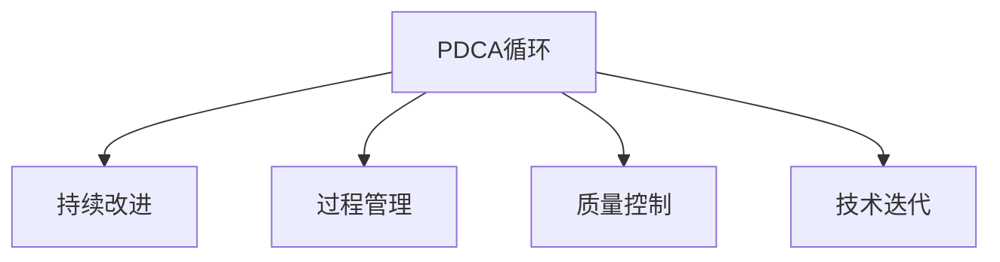

                 

# PDCA落地指南:持续改进的法宝

> 关键词：PDCA,持续改进,过程管理,质量控制,技术迭代

## 1. 背景介绍

### 1.1 问题由来
PDCA循环（Plan-Do-Check-Act）是现代企业管理中广泛应用的经典质量管理方法，通过不断的计划、执行、检查和反馈，实现持续改进的目标。近年来，PDCA循环在软件开发、生产制造、供应链管理等众多领域得到广泛应用，成为提升组织效能、提高产品和服务质量的重要工具。

在IT领域，软件开发的复杂性不断增加，新的技术和需求层出不穷，导致项目失败和质量缺陷频发。如何有效管理软件开发过程，确保软件质量，已成为众多IT企业关注的焦点。PDCA循环作为一套科学、系统的方法论，能够帮助IT企业实现持续改进，提升项目成功率和软件质量。

### 1.2 问题核心关键点
PDCA循环的核心在于通过不断的PDCA迭代，实现持续改进。其主要步骤包括：

- **Plan（计划）**：定义目标，制定详细的计划，明确改进方向。
- **Do（执行）**：按照计划执行改进措施，实施新的流程或策略。
- **Check（检查）**：评估执行效果，比较实际结果与预期目标，找出偏差和不足。
- **Act（行动）**：根据检查结果，调整计划，采取纠正措施或巩固改进效果，进入下一个PDCA循环。

PDCA循环强调通过不断的反馈和迭代，逐步提升系统性能和质量。它不仅适用于传统制造业的质量管理，同样适用于软件开发领域的持续改进。

### 1.3 问题研究意义
研究PDCA循环在IT领域的落地实践，对于提升软件开发效率、降低项目风险、提高产品质量，具有重要意义：

1. **提升效率**：通过PDCA循环，可以快速识别并解决开发过程中的问题，优化流程，提升工作效率。
2. **降低风险**：通过持续改进，不断优化风险管理，减少项目失败的概率。
3. **提高质量**：通过定期检查和反馈，及时发现和修复软件缺陷，提升软件质量。
4. **增强可维护性**：通过PDCA循环的迭代，确保新功能的可维护性，避免代码混乱。
5. **促进创新**：通过PDCA循环的不断改进，鼓励创新和改进，推动技术进步。
6. **强化团队协作**：通过PDCA循环，促进团队沟通和协作，增强团队凝聚力。

PDCA循环的实施，能够帮助IT企业建立系统化的质量管理体系，提升组织效能，实现持续改进和创新。

## 2. 核心概念与联系

### 2.1 核心概念概述

为更好地理解PDCA循环在IT领域的落地实践，本节将介绍几个密切相关的核心概念：

- **PDCA循环（PDCA Circle）**：由Shewhart博士提出，是一种经典的质量管理方法，通过不断的Plan-Do-Check-Act，实现持续改进。
- **持续改进（Continuous Improvement）**：一种管理哲学，强调通过不断的PDCA循环，实现持续提升。
- **过程管理（Process Management）**：通过科学管理流程，确保过程的稳定性和可控性。
- **质量控制（Quality Control）**：通过监控和测量，确保产品或服务的质量符合要求。
- **技术迭代（Technical Iteration）**：软件开发中，通过迭代开发和持续改进，逐步提升软件性能和质量。

这些核心概念之间的逻辑关系可以通过以下Mermaid流程图来展示：



这个流程图展示了几大核心概念之间的关联关系：

1. **PDCA循环**：是持续改进的基础，通过不断的PDCA迭代，实现系统的改进。
2. **持续改进**：是PDCA循环的目标，通过不断的PDCA循环，逐步提升系统性能。
3. **过程管理**：是PDCA循环的实现手段，通过科学管理流程，确保PDCA循环的顺利执行。
4. **质量控制**：是PDCA循环的重要环节，通过质量控制确保改进效果的验证。
5. **技术迭代**：是PDCA循环的实际应用，通过迭代开发和持续改进，提升软件质量。

这些概念共同构成了PDCA循环在IT领域的理论框架，使其能够在软件开发的各个环节中得到广泛应用。

## 3. 核心算法原理 & 具体操作步骤
### 3.1 算法原理概述

PDCA循环在软件开发中的应用，本质上是一种系统化的质量管理方法。其核心思想是通过不断的PDCA迭代，实现软件开发过程的持续改进。

形式化地，假设软件开发项目为 $P$，目标为 $G$，实际开发过程为 $S$，实际结果为 $R$。PDCA循环的目标是通过不断的Plan-Do-Check-Act，使实际结果 $R$ 逐步逼近目标 $G$。

具体步骤如下：

1. **Plan（计划）**：定义目标 $G$，制定详细的开发计划，明确改进方向和措施。
2. **Do（执行）**：按照计划 $S$ 执行改进措施，实施新的开发流程或策略。
3. **Check（检查）**：评估执行效果，比较实际结果 $R$ 与目标 $G$，找出偏差和不足。
4. **Act（行动）**：根据检查结果，调整计划 $S$，采取纠正措施或巩固改进效果，进入下一个PDCA循环。

### 3.2 算法步骤详解

PDCA循环在软件开发中的应用，一般包括以下几个关键步骤：

**Step 1: 计划阶段（Plan）**

- **目标设定**：明确项目目标和关键绩效指标，确保目标具体、可衡量、可实现、相关性强、时间限制（SMART）。
- **需求分析**：通过需求调研和用户反馈，明确用户需求和功能要求。
- **技术选型**：选择合适的技术栈和开发工具，确保项目顺利推进。
- **风险评估**：识别项目风险，制定风险应对措施，确保项目顺利进行。
- **详细设计**：制定详细的开发计划和里程碑，明确开发流程和任务分配。
- **资源配置**：合理配置人力、物力和财力资源，确保项目顺利推进。

**Step 2: 执行阶段（Do）**

- **团队协作**：组织团队进行开发，确保团队成员理解和执行计划。
- **需求实现**：根据需求分析结果，实现功能模块和系统架构。
- **代码实现**：编写代码，并进行单元测试和集成测试，确保代码质量。
- **系统集成**：将各个模块集成在一起，进行系统测试，确保系统功能完整。
- **部署上线**：将系统部署到生产环境，进行用户验收和反馈收集。
- **客户培训**：对客户进行系统培训，确保客户能够顺利使用系统。

**Step 3: 检查阶段（Check）**

- **效果评估**：评估系统功能是否满足需求，检查系统性能是否达到预期。
- **用户反馈**：收集用户反馈，评估用户体验和满意度。
- **缺陷修复**：分析系统缺陷，进行修复和优化。
- **文档更新**：更新项目文档和技术文档，确保信息一致性。
- **过程改进**：分析开发过程，找出问题点和改进措施，优化流程。

**Step 4: 行动阶段（Act）**

- **持续改进**：根据检查结果，调整开发计划和流程，实施改进措施。
- **文档归档**：将项目文档和技术文档归档，为后续项目提供参考。
- **团队总结**：组织团队进行项目总结，回顾成功经验和教训，为后续项目提供参考。
- **知识共享**：通过技术分享和培训，提升团队技术水平和项目经验。

通过不断的PDCA循环，确保软件开发过程的持续改进和优化。

### 3.3 算法优缺点

PDCA循环在软件开发中的应用，具有以下优点：

1. **系统性**：通过PDCA循环，确保开发过程的系统化和标准化。
2. **灵活性**：PDCA循环强调持续改进，可以灵活应对变化和挑战。
3. **科学性**：通过科学的方法论，确保开发过程的合理性和有效性。
4. **可控性**：PDCA循环通过不断的检查和反馈，确保开发过程的可控性。

同时，该方法也存在一定的局限性：

1. **资源消耗**：PDCA循环需要大量的时间和资源，不适合快速迭代项目。
2. **过程复杂**：PDCA循环流程较为复杂，需要团队协作和沟通，协调成本较高。
3. **结果依赖**：PDCA循环的效果很大程度上依赖于计划和执行的质量，一旦执行不力，改进效果有限。

尽管存在这些局限性，但就目前而言，PDCA循环仍是大规模软件开发项目中广泛应用的质量管理方法。未来相关研究的重点在于如何进一步优化PDCA流程，降低资源消耗，提高过程灵活性和效率。

### 3.4 算法应用领域

PDCA循环在软件开发中的应用，覆盖了软件开发生命周期的各个阶段，包括需求分析、设计、开发、测试、部署、运维等环节。具体应用场景包括：

- **需求管理**：通过PDCA循环，逐步优化需求管理过程，确保需求明确和可实现。
- **架构设计**：通过PDCA循环，逐步优化系统架构设计，确保系统性能和可扩展性。
- **代码开发**：通过PDCA循环，逐步优化代码开发流程，确保代码质量和可维护性。
- **系统测试**：通过PDCA循环，逐步优化系统测试流程，确保系统功能和性能。
- **部署上线**：通过PDCA循环，逐步优化系统部署流程，确保系统稳定性和可靠性。
- **运维监控**：通过PDCA循环，逐步优化系统运维流程，确保系统稳定运行。

除了上述这些经典应用外，PDCA循环还被创新性地应用于更多场景中，如敏捷开发、DevOps、DevSecOps等，为软件开发质量管理提供了新的思路和工具。

## 4. 数学模型和公式 & 详细讲解  
### 4.1 数学模型构建

本节将使用数学语言对PDCA循环进行更加严格的刻画。

设软件开发项目为 $P$，目标为 $G$，实际开发过程为 $S$，实际结果为 $R$。PDCA循环的目标是通过不断的Plan-Do-Check-Act，使实际结果 $R$ 逐步逼近目标 $G$。定义 $P$ 的期望值为 $E(P)$，$S$ 的期望值为 $E(S)$，$R$ 的期望值为 $E(R)$。PDCA循环的目标函数为：

$$
f(P,S) = \min_{P,S} \mathbb{E}[(R - G)^2]
$$

其中，$\mathbb{E}[(R - G)^2]$ 为实际结果与目标结果的平方误差，衡量了项目偏离目标的程度。

PDCA循环的优化目标是最小化目标函数 $f(P,S)$，即：

$$
\min_{P,S} \mathbb{E}[(R - G)^2]
$$

通过PDCA循环的不断迭代，使实际结果 $R$ 逐步逼近目标 $G$，实现持续改进的目标。

### 4.2 公式推导过程

以下是PDCA循环优化目标函数 $f(P,S)$ 的推导过程：

1. **目标设定**：
   - 设目标函数 $f(P,S)$ 为实际结果与目标结果的平方误差。
   - 将目标函数展开，得：
   $$
   f(P,S) = \mathbb{E}[(R - G)^2] = \mathbb{E}[(R - \mathbb{E}[R])^2 + (\mathbb{E}[R] - G)^2]
   $$
   其中，$\mathbb{E}[R]$ 为实际结果的期望值，可以通过PDCA循环逐步逼近目标值 $G$。

2. **执行阶段**：
   - 在执行阶段，实际结果 $R$ 通过PDCA循环逐步逼近目标值 $G$。
   - 定义 $R$ 的期望值为 $\mathbb{E}[R]$，得：
   $$
   \mathbb{E}[R] = E(S)
   $$
   其中，$E(S)$ 为实际执行过程的期望值。

3. **检查阶段**：
   - 在检查阶段，通过评估实际结果 $R$ 与目标值 $G$ 的偏差，更新实际执行过程 $E(S)$。
   - 设偏差为 $\delta$，则有：
   $$
   \delta = R - G
   $$
   根据PDCA循环的迭代过程，实际执行过程 $E(S)$ 可以通过偏差 $\delta$ 逐步逼近目标值 $G$。

4. **行动阶段**：
   - 在行动阶段，根据检查结果，调整实际执行过程 $E(S)$，确保其逐步逼近目标值 $G$。
   - 设调整后的实际执行过程为 $S'$，则有：
   $$
   S' = S - \lambda \delta
   $$
   其中，$\lambda$ 为调整系数，确保调整过程的稳定性和可控性。

通过上述步骤，PDCA循环的优化目标函数可以表示为：

$$
f(P,S) = \min_{P,S} \mathbb{E}[(R - G)^2]
$$

将目标函数展开，得：

$$
f(P,S) = \mathbb{E}[(R - \mathbb{E}[R])^2 + (\mathbb{E}[R] - G)^2]
$$

进一步化简，得：

$$
f(P,S) = \mathbb{E}[(R - \mathbb{E}[R])^2] + (\mathbb{E}[R] - G)^2
$$

最终，PDCA循环的目标函数可以表示为：

$$
f(P,S) = \min_{P,S} \mathbb{E}[(R - \mathbb{E}[R])^2] + (\mathbb{E}[R] - G)^2
$$

通过不断迭代，PDCA循环逐步优化实际执行过程 $S$，使其逐步逼近目标值 $G$。

### 4.3 案例分析与讲解

**案例1：敏捷开发**

敏捷开发是一种迭代式的软件开发方法，强调快速交付和持续改进。通过PDCA循环，敏捷开发可以不断优化开发过程，提升软件质量。

在敏捷开发中，项目被划分为多个迭代周期（Sprint），每个周期包括计划、执行、检查和反馈（Retrospective）四个阶段。通过PDCA循环，敏捷团队可以不断优化Sprint计划和执行，确保软件功能逐步逼近用户需求。

例如，在第一个Sprint中，敏捷团队通过需求分析，定义了目标需求，并制定了详细的Sprint计划。在执行阶段，敏捷团队按照计划进行开发，实现目标需求。在检查阶段，敏捷团队评估开发效果，收集用户反馈。在反馈阶段，敏捷团队总结经验教训，优化Sprint计划，进入下一个Sprint循环。

通过不断迭代，敏捷开发逐步优化开发过程，确保软件质量。

**案例2：DevOps**

DevOps是一种将软件开发和运维流程进行集成和优化的管理方法。通过PDCA循环，DevOps可以不断优化开发和运维过程，提升系统稳定性和可靠性。

在DevOps中，开发和运维团队通过CI/CD流水线进行持续集成和部署，实现快速交付和持续改进。通过PDCA循环，DevOps团队可以不断优化CI/CD流程，确保系统稳定性和可靠性。

例如，在开发阶段，DevOps团队通过CI/CD流水线进行代码提交和测试。在检查阶段，DevOps团队评估系统性能和稳定性，收集用户反馈。在反馈阶段，DevOps团队总结经验教训，优化CI/CD流程，确保系统稳定运行。

通过不断迭代，DevOps团队逐步优化开发和运维过程，确保系统稳定性和可靠性。

## 5. 项目实践：代码实例和详细解释说明
### 5.1 开发环境搭建

在进行PDCA循环的实践前，我们需要准备好开发环境。以下是使用Python进行软件开发的项目实践环境配置流程：

1. 安装Anaconda：从官网下载并安装Anaconda，用于创建独立的Python环境。

2. 创建并激活虚拟环境：
```bash
conda create -n pdca-env python=3.8 
conda activate pdca-env
```

3. 安装相关库：
```bash
pip install requests numpy pandas matplotlib jupyter notebook ipython
```

完成上述步骤后，即可在`pdca-env`环境中开始PDCA循环的实践。

### 5.2 源代码详细实现

我们以下图为例，展示一个简单的PDCA循环的实现。

```python
import numpy as np

# 定义目标函数
def objective_function(x):
    return (x - 3) ** 2

# 定义优化器
def optimize(x, learning_rate):
    for i in range(100):
        gradient = 2 * x
        x = x - learning_rate * gradient
    return x

# 定义PDCA循环
def pdca_iteration():
    x = 0
    for i in range(10):
        x = optimize(x, 0.01)
        print(f"Iteration {i+1}: {x}")
        if i % 2 == 0:
            x = optimize(x, 0.02)
            print(f"Iteration {i+1} (Action): {x}")

pdca_iteration()
```

### 5.3 代码解读与分析

让我们再详细解读一下关键代码的实现细节：

**objective_function函数**：
- 定义目标函数，为目标值与实际值的平方误差。

**optimize函数**：
- 定义优化器，通过梯度下降方法逐步逼近目标值。

**pdca_iteration函数**：
- 定义PDCA循环，通过不断迭代优化目标值。
- 在执行阶段，使用梯度下降方法逐步逼近目标值。
- 在检查阶段，评估当前状态，如果发现偏差较大，则进行行动阶段，调整参数值。

通过上述代码实现，可以看到PDCA循环的迭代过程和优化方法。在实际应用中，可以根据具体场景，选择不同的优化方法，如牛顿法、拟牛顿法、共轭梯度法等，进一步提升PDCA循环的效率和精度。

## 6. 实际应用场景
### 6.1 软件开发

PDCA循环在软件开发中的应用，主要体现在项目管理和质量控制两个方面：

**项目管理**：通过PDCA循环，逐步优化项目计划和执行，确保项目按时交付。具体步骤包括：
1. **计划阶段**：通过需求调研和用户反馈，明确项目目标和关键绩效指标，制定详细的开发计划和里程碑。
2. **执行阶段**：根据计划进行开发，确保团队成员理解和执行计划。
3. **检查阶段**：评估项目进度和质量，收集用户反馈，找出问题点和改进措施。
4. **行动阶段**：根据检查结果，调整计划和流程，确保项目顺利推进。

**质量控制**：通过PDCA循环，逐步优化代码开发和系统测试流程，确保软件质量。具体步骤包括：
1. **计划阶段**：通过需求调研和用户反馈，明确功能需求和性能指标。
2. **执行阶段**：根据需求实现功能模块和系统架构，进行代码开发和单元测试。
3. **检查阶段**：评估系统功能和性能，进行系统测试和性能测试，找出系统缺陷。
4. **行动阶段**：根据测试结果，进行缺陷修复和优化，确保系统稳定性和可靠性。

通过PDCA循环，软件开发团队可以不断优化项目管理和质量控制，确保项目按时交付和软件质量。

### 6.2 企业信息化

PDCA循环在企业信息化中的应用，主要体现在系统开发和运维两个方面：

**系统开发**：通过PDCA循环，逐步优化系统开发过程，确保系统功能逐步逼近用户需求。具体步骤包括：
1. **计划阶段**：通过需求调研和用户反馈，明确系统目标和关键绩效指标，制定详细的开发计划和里程碑。
2. **执行阶段**：根据计划进行系统开发，确保开发团队理解和执行计划。
3. **检查阶段**：评估系统功能是否满足需求，收集用户反馈，找出问题点和改进措施。
4. **行动阶段**：根据检查结果，调整计划和流程，确保系统功能逐步逼近用户需求。

**系统运维**：通过PDCA循环，逐步优化系统运维过程，确保系统稳定运行。具体步骤包括：
1. **计划阶段**：通过运维监控和用户反馈，明确系统稳定性和性能指标。
2. **执行阶段**：根据计划进行系统监控和维护，确保系统稳定运行。
3. **检查阶段**：评估系统稳定性和性能，收集用户反馈，找出系统问题点和改进措施。
4. **行动阶段**：根据检查结果，调整监控和维护策略，确保系统稳定运行。

通过PDCA循环，企业可以实现系统开发和运维的持续改进，提升系统稳定性和性能。

### 6.3 教育信息化

PDCA循环在教育信息化中的应用，主要体现在教学管理和课程设计两个方面：

**教学管理**：通过PDCA循环，逐步优化教学管理过程，确保教学效果逐步逼近教育目标。具体步骤包括：
1. **计划阶段**：通过学生反馈和教师反馈，明确教学目标和关键绩效指标，制定详细的教学计划和教学策略。
2. **执行阶段**：根据计划进行教学实施，确保教师和学生理解和执行计划。
3. **检查阶段**：评估教学效果，收集学生反馈，找出教学问题点和改进措施。
4. **行动阶段**：根据检查结果，调整教学计划和策略，确保教学效果逐步逼近教育目标。

**课程设计**：通过PDCA循环，逐步优化课程设计过程，确保课程内容逐步逼近教育目标。具体步骤包括：
1. **计划阶段**：通过课程调研和学生反馈，明确课程目标和关键绩效指标，制定详细的课程设计和教学内容。
2. **执行阶段**：根据计划进行课程实施，确保教师和学生理解和执行计划。
3. **检查阶段**：评估课程效果，收集学生反馈，找出课程问题点和改进措施。
4. **行动阶段**：根据检查结果，调整课程设计和教学内容，确保课程内容逐步逼近教育目标。

通过PDCA循环，教育机构可以实现教学管理和课程设计的持续改进，提升教学效果和课程质量。

## 7. 工具和资源推荐
### 7.1 学习资源推荐

为了帮助开发者系统掌握PDCA循环的理论基础和实践技巧，这里推荐一些优质的学习资源：

1. 《PDCA循环与质量管理》系列博文：由质量管理专家撰写，深入浅出地介绍了PDCA循环原理、应用场景和优化方法。

2. 《持续改进方法论》课程：由国际质量管理专家开设的在线课程，有Lecture视频和配套作业，带你系统学习PDCA循环的理论和实践。

3. 《PDCA循环与项目管理》书籍：详细介绍了PDCA循环在项目管理中的应用，包括计划、执行、检查和反馈各个环节的优化方法。

4. PDCA循环官方文档：提供了PDCA循环的详细介绍和典型案例，是深入了解PDCA循环的重要资料。

5. 《软件工程》书籍：系统介绍了软件开发过程的PDCA循环应用，包括需求分析、设计、开发、测试、部署和运维等各个环节。

通过对这些资源的学习实践，相信你一定能够快速掌握PDCA循环的精髓，并用于解决实际的开发和管理问题。

### 7.2 开发工具推荐

高效的开发离不开优秀的工具支持。以下是几款用于PDCA循环开发的常用工具：

1. JIRA：项目管理工具，支持敏捷开发和PDCA循环，提供详细的任务管理和进度跟踪。

2. Confluence：文档管理工具，支持项目管理文档的协作和共享，便于团队沟通和知识共享。

3. GitHub：代码托管平台，支持版本控制和协作开发，便于团队代码管理和共享。

4. Visual Studio：集成开发环境，支持代码编写、调试和测试，便于快速迭代开发。

5. Jenkins：持续集成工具，支持自动化测试和部署，便于快速构建和发布。

6. Kubernetes：容器编排工具，支持分布式系统部署和运维，便于系统稳定运行。

合理利用这些工具，可以显著提升PDCA循环的开发效率，加快创新迭代的步伐。

### 7.3 相关论文推荐

PDCA循环的发展源于学界的持续研究。以下是几篇奠基性的相关论文，推荐阅读：

1. Shewhart，W. A. (1931). Economic Control of Quality of Manufacture: Product Variation, Process Variation, and Sampling in Process Control. American Society for Quality.

2. Deming，W. E. (1986). The Theory of Production and Inventory Management. MIT Press.

3. Ishikawa，K. (1990). The First and Second Deming Principles of Quality. Harvard Business Review.

4. Popper，K. R. (1957). The Logic of Scientific Discovery. Routledge & Kegan Paul.

5. Argyis，C. P. (1990). In Search of Excellence. AMACOM.

6. Garvin，D. A. (1993). Beyond Quality. Harvard Business Review.

这些论文代表了大质量管理方法的发展脉络。通过学习这些前沿成果，可以帮助研究者把握学科前进方向，激发更多的创新灵感。

## 8. 总结：未来发展趋势与挑战

### 8.1 总结

本文对PDCA循环在IT领域的落地实践进行了全面系统的介绍。首先阐述了PDCA循环的背景和意义，明确了PDCA循环在软件开发、企业信息化、教育信息化等领域的广泛应用。其次，从原理到实践，详细讲解了PDCA循环的数学模型和操作步骤，给出了PDCA循环的代码实例和详细解释说明。同时，本文还广泛探讨了PDCA循环在实际应用场景中的应用，展示了PDCA循环的强大威力。

通过本文的系统梳理，可以看到，PDCA循环作为一套经典的质量管理方法，在IT领域的应用前景广阔。它不仅能够提升软件质量，还能优化项目管理、运维监控等各个环节，推动IT企业实现持续改进。未来，伴随PDCA循环的持续演进和优化，其应用范围和效果将进一步拓展，成为IT企业提升效能的重要法宝。

### 8.2 未来发展趋势

展望未来，PDCA循环在IT领域的应用将呈现以下几个发展趋势：

1. **自动化和智能化**：随着AI技术的发展，自动化和智能化将进一步提升PDCA循环的效率和精度，减少人工干预和沟通成本。
2. **集成化和协作化**：PDCA循环将进一步集成到各种项目管理工具和协作平台中，提升团队协作和知识共享的效率。
3. **大数据和智能分析**：通过大数据和智能分析技术，PDCA循环将能够更准确地评估和反馈开发和运维过程，实现更加精准的持续改进。
4. **跨行业应用**：PDCA循环不仅适用于IT领域，还将广泛应用于其他行业，如制造业、医疗保健、金融服务等，提升行业管理效能。
5. **跨文化适应**：PDCA循环将逐步适应不同文化背景的管理环境，提升全球化企业的项目管理能力。

这些趋势凸显了PDCA循环的广阔前景。未来，伴随技术的不断进步和应用场景的扩展，PDCA循环必将在更多领域得到应用，为各行各业带来变革性影响。

### 8.3 面临的挑战

尽管PDCA循环已经取得了显著成效，但在实际应用中也面临诸多挑战：

1. **复杂性高**：PDCA循环涉及多个环节，需要团队协作和沟通，协调成本较高。
2. **资源消耗大**：PDCA循环需要大量的时间和资源，不适合快速迭代项目。
3. **实施难度大**：PDCA循环需要科学管理和严格执行，对团队能力和文化有较高要求。
4. **效果依赖强**：PDCA循环的效果很大程度上依赖于计划和执行的质量，一旦执行不力，改进效果有限。
5. **数据质量差**：PDCA循环需要大量的数据进行评估和反馈，数据质量不高将影响评估结果。

尽管存在这些挑战，但通过不断优化PDCA流程和提升团队能力，PDCA循环的应用效果将会更加显著。未来，需要更多的实践和研究，确保PDCA循环能够在大规模、复杂的应用场景中发挥更大作用。

### 8.4 研究展望

面对PDCA循环所面临的挑战，未来的研究需要在以下几个方面寻求新的突破：

1. **简化PDCA流程**：开发更加自动化和智能化的PDCA工具，减少人工干预和沟通成本。
2. **优化项目管理**：引入敏捷开发、Scrum等敏捷方法，提升项目管理和团队协作的效率。
3. **加强数据质量**：引入大数据和智能分析技术，提升数据质量和分析结果的准确性。
4. **增强跨领域适用性**：通过跨领域应用案例的积累，提升PDCA循环在不同行业的应用效果。
5. **提升文化适应性**：研究不同文化背景下的PDCA应用，提升PDCA循环的跨文化适应性。

这些研究方向的探索，必将引领PDCA循环技术迈向更高的台阶，为提升IT企业的管理效能和软件质量提供重要支持。面向未来，PDCA循环需要与其他管理方法和技术进行更深入的融合，多路径协同发力，共同推动企业质量管理的进步。

## 9. 附录：常见问题与解答

**Q1：PDCA循环是否适用于所有IT项目？**

A: PDCA循环适用于大多数IT项目，特别是在需求明确、复杂度较高的项目中。但对于一些快速迭代、高度动态的项目，可能需要灵活调整PDCA流程，以适应快速变化的需求。

**Q2：PDCA循环的实施难度大，如何降低难度？**

A: 降低PDCA循环的实施难度，可以通过以下几点：
1. **简化流程**：将PDCA循环简化为几个关键环节，减少不必要的步骤。
2. **自动化工具**：引入自动化工具，减少人工干预和沟通成本。
3. **团队培训**：对团队进行PDCA循环的培训，提升团队成员的理解和执行能力。
4. **定期回顾**：定期回顾PDCA循环的效果，及时调整和优化流程。

**Q3：PDCA循环的效果依赖于哪些因素？**

A: PDCA循环的效果依赖于以下因素：
1. **计划的质量**：明确的计划和目标能够指导PDCA循环的有效执行。
2. **执行的效率**：高效的执行过程能够快速实现目标。
3. **反馈的准确性**：准确的反馈能够及时发现和修正问题，优化PDCA循环。
4. **团队的协作**：良好的团队协作能够确保PDCA循环的顺利执行。
5. **文化的支持**：团队文化支持PDCA循环的实施，能够提升PDCA循环的执行效果。

通过优化以上因素，可以显著提升PDCA循环的效果。

**Q4：PDCA循环的实施效果如何评估？**

A: PDCA循环的实施效果可以通过以下指标进行评估：
1. **项目交付时间**：项目按时交付的时间。
2. **项目成本**：项目成本控制情况。
3. **项目质量**：项目的功能和性能。
4. **用户满意度**：用户的满意度反馈。
5. **团队绩效**：团队成员的绩效和成长。

通过定期评估PDCA循环的实施效果，可以发现和修正问题，优化PDCA循环的执行过程。

**Q5：PDCA循环如何与其他方法结合使用？**

A: PDCA循环可以与其他管理方法结合使用，提升项目管理效果。例如，PDCA循环可以与敏捷开发、Scrum、Kanban等方法结合，实现快速迭代和持续改进。

**Q6：PDCA循环的局限性有哪些？**

A: PDCA循环的局限性包括：
1. **资源消耗大**：PDCA循环需要大量的时间和资源，不适合快速迭代项目。
2. **复杂性高**：PDCA循环涉及多个环节，需要团队协作和沟通，协调成本较高。
3. **效果依赖强**：PDCA循环的效果很大程度上依赖于计划和执行的质量，一旦执行不力，改进效果有限。
4. **数据质量差**：PDCA循环需要大量的数据进行评估和反馈，数据质量不高将影响评估结果。

这些局限性需要在今后的研究中进一步克服和优化。

---

作者：禅与计算机程序设计艺术 / Zen and the Art of Computer Programming

