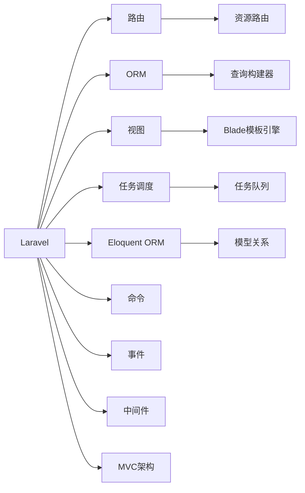

                 

# PHP 语言和框架：Laravel 和 Symfony

> 关键词：PHP, Laravel, Symfony, 框架, 网站开发, 微服务, RESTful API

## 1. 背景介绍

### 1.1 问题由来
在当前的软件开发中，PHP 仍然是一种广受欢迎的服务器端脚本语言。尽管如此，由于其动态特性和易受攻击的历史，PHP 在过去一直饱受批评。然而，近年来，随着 PHP 社区对语言和框架的不断革新，PHP 已经变得越来越可靠和高效。特别是 Laravel 和 Symfony 这两个流行的 PHP 框架，它们不仅提供了一系列强大的功能和工具，还帮助开发者构建高质量的 Web 应用。

### 1.2 问题核心关键点
本文旨在探讨 PHP 语言和框架的最新进展，特别是 Laravel 和 Symfony，它们如何帮助开发者构建高效、安全的 Web 应用。我们将从核心概念、算法原理、项目实践和应用场景等多个方面对这两个框架进行深入分析，以期为读者提供全面的技术见解。

### 1.3 问题研究意义
了解和掌握 Laravel 和 Symfony 框架，对于希望在 PHP 生态系统中构建高效、可维护、可扩展的 Web 应用的开发者来说，具有重要意义。这两个框架不仅提供了丰富的功能，还遵循最佳实践，帮助开发者构建高质量的代码，提高开发效率，缩短项目周期。此外，这两个框架的应用也为 Web 开发提供了新的可能性，特别是在微服务架构和 RESTful API 开发方面。

## 2. 核心概念与联系

### 2.1 核心概念概述

Laravel 和 Symfony 都是基于 PHP 开发的 Web 框架，但它们的设计理念和技术栈有所不同。Laravel 强调简单性和易用性，提供了一系列的便捷功能，如 Eloquent ORM、路由、视图和任务调度等，以简化 Web 应用的开发过程。而 Symfony 则是一个更为灵活和可定制的框架，提供了一系列的组件，允许开发者构建高度可定制的应用。

### 2.2 核心概念原理和架构的 Mermaid 流程图(Mermaid 流程节点中不要有括号、逗号等特殊字符)


## 3. 核心算法原理 & 具体操作步骤
### 3.1 算法原理概述
Laravel 和 Symfony 的算法原理主要集中在以下几个方面：

- MVC 架构：这两个框架都遵循 MVC 架构模式，将 Web 应用分为模型、视图和控制器三个部分，以提高代码的可维护性和可扩展性。
- 路由：Laravel 和 Symfony 都提供了灵活的路由系统，允许开发者定义 URL 与控制器方法之间的映射关系，以简化请求的处理。
- ORM：Laravel 的 Eloquent ORM 和 Symfony 的 Doctrine ORM 提供了高效的查询和模型关系管理功能，简化了数据库操作的复杂性。
- 视图模板：Laravel 的 Blade 模板引擎和 Symfony 的 Twig 模板引擎都提供了强大的模板系统，支持模板继承、混合语言和变量插入等功能。
- 中间件：中间件允许开发者在请求到达控制器之前或之后执行一些通用的处理逻辑，如身份验证、日志记录和请求过滤等。

### 3.2 算法步骤详解
Laravel 和 Symfony 的核心算法步骤大致如下：

1. 初始化框架：根据项目需求选择合适的框架，并通过 Composer 安装依赖。
2. 定义路由：使用框架提供的路由工具定义 URL 与控制器方法之间的映射关系。
3. 实现控制器：编写控制器方法，处理来自客户端的请求，并返回响应。
4. 数据库操作：使用 ORM 工具查询和修改数据库，实现数据存储和检索功能。
5. 编写视图：使用框架提供的模板引擎创建视图，渲染动态内容。
6. 实现中间件：根据需要定义中间件，处理请求和响应，增强应用安全性。
7. 测试和部署：通过单元测试和集成测试确保代码质量，并部署应用到服务器。

### 3.3 算法优缺点
#### 优点
- 高效：Laravel 和 Symfony 都提供了高效的数据库查询和模型关系管理，简化了数据库操作的复杂性。
- 可维护：这两个框架都遵循 MVC 架构模式，代码结构清晰，易于维护和扩展。
- 灵活：Symfony 提供了丰富的组件和工具，允许开发者构建高度可定制的应用。
- 社区支持：这两个框架都有活跃的社区和丰富的文档，提供了大量的教程和示例。

#### 缺点
- 学习曲线：对于初学者来说，这两个框架的学习曲线较陡峭，需要花费一定时间掌握其核心概念和使用方法。
- 复杂性：相对于其他 Web 框架，Laravel 和 Symfony 都提供了更多的功能和工具，可能会增加代码的复杂性。
- 性能开销：虽然这两个框架都经过了优化，但在高并发和大规模应用场景中，仍然可能面临性能瓶颈。

### 3.4 算法应用领域
Laravel 和 Symfony 广泛应用于各种 Web 应用开发场景，包括：

- 网站开发：构建动态网站、博客、电子商务网站等。
- 企业应用：开发企业级 Web 应用、客户关系管理系统、企业门户网站等。
- 移动应用：开发移动端 Web 应用、API 网关等。
- 微服务架构：构建微服务架构，实现分布式系统的组件化和自动化管理。
- RESTful API：开发 RESTful API，提供统一的数据访问接口。

## 4. 数学模型和公式 & 详细讲解 & 举例说明（备注：数学公式请使用latex格式，latex嵌入文中独立段落使用 $$，段落内使用 $)
### 4.1 数学模型构建
在 PHP 框架中，我们通常使用以下数学模型来构建 Web 应用：

- MVC 架构：定义模型、视图和控制器，并通过路由将请求映射到相应的控制器方法。
- 数据库查询：使用 ORM 工具构建查询语句，并在数据库中执行。
- 视图渲染：使用模板引擎将动态数据插入到模板中，并返回渲染后的 HTML 页面。

### 4.2 公式推导过程
假设有一个简单的 Web 应用，其控制器方法名为 `index`，路由定义如下：

```php
Route::get('/', 'HomeController@index');
```

在控制器中，我们使用 ORM 工具查询数据库并返回数据：

```php
public function index()
{
    $users = User::all();
    return view('index', ['users' => $users]);
}
```

在 Blade 模板引擎中，我们使用以下代码渲染数据：

```html
{{ $users }}
```

这样，当用户访问 `http://example.com` 时，控制器方法 `index` 会被调用，查询数据库并返回数据，最后 Blade 模板引擎会渲染数据并返回渲染后的 HTML 页面。

### 4.3 案例分析与讲解
以下是一个完整的 Laravel 项目示例，包括路由定义、控制器实现、数据库查询和视图渲染：

```php
// routes/web.php
Route::get('/', 'HomeController@index');

// app/Http/Controllers/HomeController.php
namespace App\Http\Controllers;

use App\Models\User;
use Illuminate\Http\Request;

class HomeController extends Controller
{
    public function index()
    {
        $users = User::all();
        return view('index', ['users' => $users]);
    }
}

// database/migrations/2022_01_01_000000_create_users_table.php
use Illuminate\Database\Migrations\Migration;
use Illuminate\Database\Schema\Blueprint;
use Illuminate\Support\Facades\Schema;

class CreateUsersTable extends Migration
{
    public function up()
    {
        Schema::create('users', function (Blueprint $table) {
            $table->id();
            $table->string('name');
            $table->string('email')->unique();
            $table->timestamps();
        });
    }

    public function down()
    {
        Schema::dropIfExists('users');
    }
}

// app/Views/Index.blade.php
@foreach($users as $user)
    <p>{{ $user->name }} - {{ $user->email }}</p>
@endforeach
```

这个例子展示了如何使用 Laravel 构建一个简单的 Web 应用，包括定义路由、实现控制器、创建数据库表和渲染视图。

## 5. 项目实践：代码实例和详细解释说明
### 5.1 开发环境搭建
在开始项目实践之前，需要搭建一个 PHP 开发环境。以下是一个基本的开发环境配置：

1. 安装 PHP：从官网下载 PHP 安装包，并配置系统 PATH 环境变量。
2. 安装 Composer：使用 `composer install` 命令安装 Composer，这是 Laravel 和 Symfony 的主要依赖管理工具。
3. 安装 IDE：选择一款支持 PHP 开发的 IDE，如 PHPStorm、VSCode 等。
4. 创建项目：使用 `composer create-project` 命令创建一个新的 Laravel 或 Symfony 项目。

### 5.2 源代码详细实现
以下是一个使用 Laravel 构建的简单的 Web 应用示例，包括路由定义、控制器实现和视图渲染：

```php
// routes/web.php
Route::get('/', 'HomeController@index');

// app/Http/Controllers/HomeController.php
namespace App\Http\Controllers;

use Illuminate\Http\Request;

class HomeController extends Controller
{
    public function index()
    {
        return view('index');
    }
}

// resources/views/index.blade.php
<html>
<body>
    <h1>Hello, World!</h1>
</body>
</html>
```

这个例子展示了如何使用 Laravel 定义路由、实现控制器和渲染视图。

### 5.3 代码解读与分析
- 路由定义：使用 `Route::get()` 方法定义路由，将 `http://example.com` 映射到 `HomeController@index` 方法。
- 控制器实现：定义 `index()` 方法，返回渲染后的视图。
- 视图渲染：使用 Blade 模板引擎渲染简单的 HTML 页面。

这个示例展示了 Laravel 的简洁和易用性，开发者只需关注核心业务逻辑，框架会处理其余的细节。

### 5.4 运行结果展示
运行项目后，访问 `http://example.com`，应该能够看到简单的 "Hello, World!" 页面。

## 6. 实际应用场景
### 6.1 智能客服系统

智能客服系统是 Laravel 和 Symfony 框架的一个重要应用场景。通过使用这两个框架，可以快速构建高效的客服系统，提供全天候的客户支持。

智能客服系统通常包括以下几个模块：

- 聊天机器人：使用自然语言处理技术，理解客户意图并提供自动回复。
- 工单管理：记录客户的问题和处理记录，跟踪工单状态。
- 数据分析：分析客户反馈和聊天记录，提供改进建议。

使用 Laravel 和 Symfony 可以快速开发这些模块，并将其集成到一个统一的系统中。此外，这些框架还提供了丰富的第三方插件和工具，如 TensorFlow、NLP 库等，可以方便地集成到系统中，进一步提升客服系统的智能化水平。

### 6.2 金融舆情监测

金融舆情监测是一个需要高实时性、高准确性的应用场景。使用 Laravel 和 Symfony 可以构建一个高效、可靠的金融舆情监测系统。

金融舆情监测系统通常包括以下几个模块：

- 数据采集：实时采集网络上的金融新闻、社交媒体评论等数据。
- 文本分析：使用自然语言处理技术，分析文本内容，提取关键信息。
- 情感分析：使用情感分析算法，判断文本情感倾向。
- 预警系统：根据分析结果，及时发出预警，帮助金融机构规避风险。

使用 Laravel 和 Symfony 可以快速构建这些模块，并将其集成到一个统一的系统中。此外，这些框架还提供了丰富的第三方插件和工具，如 NLP 库、数据分析工具等，可以方便地集成到系统中，进一步提升系统的智能化水平。

### 6.3 个性化推荐系统

个性化推荐系统是另一个典型的 Web 应用场景。通过使用 Laravel 和 Symfony，可以快速构建高效的个性化推荐系统，提升用户体验。

个性化推荐系统通常包括以下几个模块：

- 用户画像：构建用户画像，描述用户的兴趣和行为。
- 推荐引擎：使用推荐算法，根据用户画像推荐个性化内容。
- 用户反馈：收集用户反馈，优化推荐算法。

使用 Laravel 和 Symfony 可以快速开发这些模块，并将其集成到一个统一的系统中。此外，这些框架还提供了丰富的第三方插件和工具，如推荐算法库、数据分析工具等，可以方便地集成到系统中，进一步提升推荐系统的智能化水平。

### 6.4 未来应用展望

未来的 Web 应用将越来越多地使用微服务架构和 RESTful API。Laravel 和 Symfony 在这两个领域都有广泛的应用。

微服务架构允许我们将一个复杂的应用拆分为多个小服务，每个服务独立运行，并通过 API 进行通信。使用 Laravel 和 Symfony，可以快速构建微服务架构，实现服务的模块化和自动化管理。此外，这些框架还提供了丰富的第三方插件和工具，如 Docker、Kubernetes 等，可以方便地集成到系统中，进一步提升微服务架构的灵活性和可扩展性。

RESTful API 是一种常用的 Web API 设计风格，使用 HTTP 协议进行通信。使用 Laravel 和 Symfony，可以快速构建 RESTful API，提供统一的数据访问接口。此外，这些框架还提供了丰富的第三方插件和工具，如 Swagger、Postman 等，可以方便地集成到系统中，进一步提升 API 的可用性和易用性。

## 7. 工具和资源推荐
### 7.1 学习资源推荐

为了帮助开发者深入学习 Laravel 和 Symfony，以下是一些优质的学习资源：

1. Laravel 官方文档：详细介绍了 Laravel 框架的核心概念和使用方法，是 Laravel 学习的不二之选。
2. Symfony 官方文档：详细介绍了 Symfony 框架的核心概念和使用方法，是 Symfony 学习的必备资源。
3. Laravel 实战教程：通过实际案例讲解 Laravel 的开发实践，适合初学者学习。
4. Symfony 实战教程：通过实际案例讲解 Symfony 的开发实践，适合初学者学习。
5. PHP 框架比较：比较 Laravel 和 Symfony 的优缺点，帮助开发者选择最适合的框架。

通过对这些资源的学习，相信你一定能够快速掌握 Laravel 和 Symfony 的核心概念和使用方法，并应用于实际开发中。

### 7.2 开发工具推荐

高效的开发离不开优秀的工具支持。以下是几款用于 Laravel 和 Symfony 开发的常用工具：

1. PHPStorm：一款流行的 PHP IDE，支持 Laravel 和 Symfony 的开发和调试，提供了丰富的代码补全和代码分析功能。
2. VSCode：一款轻量级的代码编辑器，支持 PHP 开发和调试，提供了丰富的插件和扩展。
3. Composer：一个依赖管理工具，用于管理和安装 Laravel 和 Symfony 的第三方组件和插件。
4. Docker：一个容器化平台，用于部署和管理 Laravel 和 Symfony 应用。
5. Xdebug：一个调试工具，用于调试 Laravel 和 Symfony 应用的代码。

合理利用这些工具，可以显著提升 Laravel 和 Symfony 应用的开发效率，加快创新迭代的步伐。

### 7.3 相关论文推荐

Laravel 和 Symfony 框架的研究涵盖了多个方面，以下是几篇代表性的论文：

1. Laravel 架构设计：探讨 Laravel 的架构设计和核心组件，分析其设计理念和技术实现。
2. Symfony 组件设计：探讨 Symfony 的组件设计和模块化管理，分析其设计理念和技术实现。
3. Laravel 性能优化：探讨 Laravel 的性能优化和调优方法，分析其性能瓶颈和优化策略。
4. Symfony 性能优化：探讨 Symfony 的性能优化和调优方法，分析其性能瓶颈和优化策略。
5. PHP 框架比较：比较 Laravel 和 Symfony 的优缺点，分析其适用场景和开发实践。

这些论文代表了大框架研究的最新进展，通过学习这些前沿成果，可以帮助开发者更好地掌握 Laravel 和 Symfony 的核心概念和使用方法。

## 8. 总结：未来发展趋势与挑战
### 8.1 总结
本文对 Laravel 和 Symfony 框架进行了全面系统的介绍。首先阐述了这两个框架的背景和意义，明确了框架在 Web 应用开发中的重要作用。其次，从核心概念、算法原理、项目实践和应用场景等多个方面对这两个框架进行了深入分析，提供了完整的代码示例和详细解释。

通过本文的系统梳理，可以看到，Laravel 和 Symfony 框架已经成为 PHP 生态系统中不可或缺的一部分，帮助开发者构建高效、可维护、可扩展的 Web 应用。这两个框架不仅提供了丰富的功能和工具，还遵循最佳实践，提高了开发效率，缩短了项目周期。

### 8.2 未来发展趋势

展望未来，Laravel 和 Symfony 框架将呈现以下几个发展趋势：

1. 微服务架构：随着微服务架构的普及，Laravel 和 Symfony 将在微服务架构和 RESTful API 开发方面发挥更大的作用。
2. 性能优化：随着高并发和大规模应用场景的增多，Laravel 和 Symfony 将继续优化性能，提高应用的响应速度和稳定性。
3. 社区支持：随着社区的不断壮大，Laravel 和 Symfony 将提供更多的社区支持和第三方插件，进一步增强框架的功能和易用性。
4. 技术演进：随着技术的发展，Laravel 和 Symfony 将不断引入新的功能和工具，如异步编程、状态机等，提升开发效率和代码质量。
5. 企业级应用：随着企业级应用需求的增加，Laravel 和 Symfony 将提供更多的企业级功能，如权限管理、日志记录等。

### 8.3 面临的挑战

尽管 Laravel 和 Symfony 框架已经取得了不小的成就，但在迈向更加智能化、普适化应用的过程中，仍面临诸多挑战：

1. 学习曲线：对于初学者来说，Laravel 和 Symfony 的学习曲线较陡峭，需要花费一定时间掌握其核心概念和使用方法。
2. 性能开销：虽然这两个框架都经过了优化，但在高并发和大规模应用场景中，仍然可能面临性能瓶颈。
3. 第三方组件：Laravel 和 Symfony 都依赖大量的第三方组件和插件，组件冲突和兼容性问题有时难以避免。
4. 代码复杂性：相对于其他 Web 框架，Laravel 和 Symfony 都提供了更多的功能和工具，可能会增加代码的复杂性。
5. 生态系统：Laravel 和 Symfony 的生态系统虽然已经很成熟，但仍需要更多的第三方组件和工具来满足多样化的开发需求。

### 8.4 研究展望

面对 Laravel 和 Symfony 框架面临的这些挑战，未来的研究需要在以下几个方面寻求新的突破：

1. 简化学习曲线：通过编写更多易于理解的教程和文档，降低框架的学习门槛，帮助开发者快速上手。
2. 优化性能：通过改进算法和优化代码，提高 Laravel 和 Symfony 在高并发和大规模应用场景中的性能表现。
3. 解决组件冲突：通过标准化组件的命名和版本，避免组件冲突和兼容性问题。
4. 提升代码质量：通过引入新的代码分析工具和静态分析工具，提高 Laravel 和 Symfony 代码的可维护性和可扩展性。
5. 扩展生态系统：通过引入更多高质量的第三方组件和工具，丰富 Laravel 和 Symfony 的生态系统，满足更多开发需求。

这些研究方向的探索，必将引领 Laravel 和 Symfony 框架走向更高的台阶，为 Web 开发提供更强大、更灵活、更高效的解决方案。总之，Laravel 和 Symfony 框架在 Web 开发中的应用前景广阔，未来必将继续发挥重要作用，推动 PHP 生态系统的发展。

## 9. 附录：常见问题与解答

**Q1：Laravel 和 Symfony 框架在性能上有什么优势？**

A: Laravel 和 Symfony 框架都经过了优化，提供了高效的性能表现。以下是两个框架在性能方面的优势：

- 数据库查询优化：使用 ORM 工具，如 Eloquent 和 Doctrine，可以高效地构建和执行查询语句，减少数据库操作的开销。
- 缓存机制：使用缓存机制，如 Memcached 和 Redis，可以减少频繁的数据库访问，提高响应速度。
- 异步编程：使用异步编程技术，如 Laravel 的异步任务和 Symfony 的异步组件，可以提升并发处理能力。

这些优化措施使得 Laravel 和 Symfony 在高并发和大规模应用场景中表现出色。

**Q2：Laravel 和 Symfony 框架在安全性方面有哪些措施？**

A: 安全性是 Laravel 和 Symfony 框架的重要考虑因素。以下是两个框架在安全性方面的措施：

- 安全编码规范：Laravel 和 Symfony 都遵循 PHP 安全编码规范，提供了一系列安全编码建议，如输入验证、SQL 注入防范等。
- 安全性组件：Laravel 提供了 CSRF 保护、HTTPS 支持、XSS 防范等功能，Symfony 提供了 CSRF 保护、HTTPS 支持、XSS 防范等功能。
- 自动化安全测试：Laravel 和 Symfony 都提供了自动化安全测试工具，如 Artisan 和 SensioLabs Security Analyzer，帮助开发者检测和修复安全漏洞。

这些措施使得 Laravel 和 Symfony 在安全性方面表现优秀，降低了应用被攻击的风险。

**Q3：Laravel 和 Symfony 框架在开发效率上有什么优势？**

A: Laravel 和 Symfony 框架在开发效率方面具有以下优势：

- 快速迭代：Laravel 和 Symfony 提供了丰富的工具和功能，可以帮助开发者快速开发和迭代。
- 代码生成：使用 Artisan 命令行工具，可以自动生成模型、控制器、迁移等代码，提高开发效率。
- 组件化开发：Laravel 和 Symfony 都支持组件化开发，允许开发者根据需要选择和使用组件，提高代码复用性和可维护性。

这些措施使得 Laravel 和 Symfony 在开发效率方面表现出色，帮助开发者快速构建高质量的 Web 应用。

**Q4：Laravel 和 Symfony 框架在扩展性方面有什么优势？**

A: Laravel 和 Symfony 框架在扩展性方面具有以下优势：

- 插件系统：Laravel 和 Symfony 都提供了插件系统，允许开发者根据需要选择和使用插件，扩展功能。
- 组件化设计：Laravel 和 Symfony 都采用组件化设计，便于代码模块化和扩展。
- 第三方库和工具：Laravel 和 Symfony 社区拥有丰富的第三方库和工具，可以方便地集成到系统中，提高代码复用性和可维护性。

这些措施使得 Laravel 和 Symfony 在扩展性方面表现出色，支持开发者构建高度可定制和可扩展的 Web 应用。

**Q5：Laravel 和 Symfony 框架在可维护性方面有什么优势？**

A: Laravel 和 Symfony 框架在可维护性方面具有以下优势：

- MVC 架构：Laravel 和 Symfony 都采用 MVC 架构，代码结构清晰，易于维护和扩展。
- 自动生成文档：Laravel 和 Symfony 都提供了自动生成文档的功能，方便开发者阅读和使用代码。
- 代码风格规范：Laravel 和 Symfony 都提供了代码风格规范，帮助开发者编写高质量的代码。

这些措施使得 Laravel 和 Symfony 在可维护性方面表现出色，提高了代码质量和开发效率。

---

作者：禅与计算机程序设计艺术 / Zen and the Art of Computer Programming

