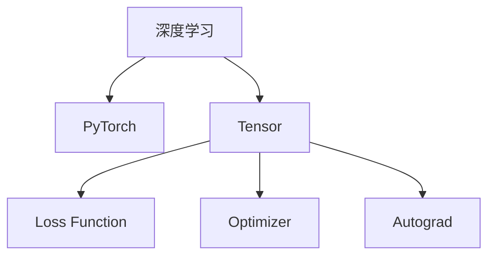

                 

# PyTorch生态系统：深度学习研究与应用

> 关键词：深度学习, PyTorch, 模型构建, 优化器, 自动微分, 数据加载, 损失函数, 张量操作, 模型部署, 实践指南

## 1. 背景介绍

### 1.1 问题由来
深度学习自2006年Hinton提出深度神经网络以来，已成为人工智能领域的重要组成部分。然而，深度学习的开发、训练和部署过程涉及大量的数学和编程知识，对于非专业研究人员和开发者来说，门槛较高。因此，各大深度学习框架应运而生，其中以PyTorch最为突出。

### 1.2 问题核心关键点
PyTorch是一个开源的深度学习框架，由Facebook AI Research（FAIR）团队开发。与TensorFlow等框架相比，PyTorch具备动态计算图、易用性、研究友好性等特点，使得开发者可以更加高效地构建、训练和部署深度学习模型。

近年来，随着深度学习在图像识别、自然语言处理、语音识别等领域取得突破性进展，PyTorch在学术界和工业界的应用日益广泛。本文将系统介绍PyTorch的生态系统，包括其核心组件、开发流程、优化器、数据加载等，以期为深度学习的研究者和开发者提供全面的技术指引。

## 2. 核心概念与联系

### 2.1 核心概念概述

为了更好地理解PyTorch的工作原理和应用场景，本节将介绍几个关键概念：

- 深度学习(Deep Learning)：使用多层神经网络对数据进行学习，模拟人脑的神经元网络结构，从而实现复杂的模式识别和预测任务。

- PyTorch：一个开源的深度学习框架，支持动态计算图、易用性、研究友好性等特点，广泛应用于学术界和工业界。

- Tensor：表示多维数组，是PyTorch中最重要的数据结构，所有操作都在Tensor上执行。

- Loss Function（损失函数）：用于衡量模型预测与真实标签之间的差异，是模型训练的核心组件。

- Optimizer（优化器）：用于更新模型参数，常见的优化器包括SGD、Adam、RMSprop等。

- Autograd（自动微分）：PyTorch的自动微分引擎，用于自动计算梯度。

这些核心概念之间的逻辑关系可以通过以下Mermaid流程图来展示：



这个流程图展示了深度学习模型在PyTorch中的构建和训练流程：

1. 使用Tensor表示模型输入和输出。
2. 使用Loss Function衡量模型预测与真实标签的差异。
3. 使用Optimizer更新模型参数，通过Autograd自动计算梯度。

## 3. 核心算法原理 & 具体操作步骤
### 3.1 算法原理概述

PyTorch的深度学习模型构建主要依赖于动态计算图，允许开发者在运行时动态地创建和修改计算图。模型的训练和优化过程一般包括以下几个步骤：

1. 构建模型。使用Tensor表示模型输入和输出，通过nn.Module类定义模型的结构。

2. 定义Loss Function。根据任务类型选择合适的Loss Function，如交叉熵损失、均方误差损失等。

3. 定义Optimizer。选择合适的Optimizer及其参数，如学习率、批大小等。

4. 前向传播和计算loss。将训练数据输入模型，计算Loss Function。

5. 反向传播和更新参数。使用Optimizer和Autograd自动计算梯度，更新模型参数。

6. 迭代训练。重复上述步骤直至模型收敛。

### 3.2 算法步骤详解

下面详细介绍PyTorch的模型构建和训练流程：

**Step 1: 构建模型**

```python
import torch.nn as nn
import torch.nn.functional as F

class Net(nn.Module):
    def __init__(self):
        super(Net, self).__init__()
        self.conv1 = nn.Conv2d(1, 32, 3)
        self.conv2 = nn.Conv2d(32, 64, 3)
        self.fc1 = nn.Linear(9216, 128)
        self.fc2 = nn.Linear(128, 10)
    
    def forward(self, x):
        x = F.relu(self.conv1(x))
        x = F.max_pool2d(x, 2)
        x = F.relu(self.conv2(x))
        x = F.max_pool2d(x, 2)
        x = x.view(-1, 9216)
        x = F.relu(self.fc1(x))
        x = self.fc2(x)
        return F.log_softmax(x, dim=1)

net = Net()
```

定义了一个简单的卷积神经网络Net，包括两个卷积层和两个全连接层。

**Step 2: 定义Loss Function**

```python
criterion = nn.CrossEntropyLoss()
```

使用交叉熵损失函数，适用于多分类任务。

**Step 3: 定义Optimizer**

```python
optimizer = torch.optim.Adam(net.parameters(), lr=0.001)
```

使用Adam优化器，学习率为0.001。

**Step 4: 前向传播和计算loss**

```python
output = net(x)
loss = criterion(output, target)
```

将输入数据x输入模型，计算模型预测输出和真实标签target的交叉熵损失。

**Step 5: 反向传播和更新参数**

```python
loss.backward()
optimizer.step()
```

使用Optimizer和Autograd自动计算梯度，更新模型参数。

**Step 6: 迭代训练**

```python
for epoch in range(10):
    running_loss = 0.0
    for i, data in enumerate(trainloader, 0):
        inputs, labels = data
        inputs, labels = inputs.to(device), labels.to(device)
        optimizer.zero_grad()
        output = net(inputs)
        loss = criterion(output, labels)
        loss.backward()
        optimizer.step()
        running_loss += loss.item()
    print('Epoch %d loss: %.3f' % (epoch+1, running_loss/len(trainloader)))
```

重复上述步骤，在训练集上进行多次迭代训练，输出每个epoch的平均损失。

### 3.3 算法优缺点

PyTorch的优点包括：

1. 动态计算图：允许开发者在运行时动态地创建和修改计算图，灵活性高。

2. 易用性：使用简单直观的API，开发者可以快速构建、训练和部署深度学习模型。

3. 研究友好：支持动态计算图和动态模块，方便进行模型调试和优化。

4. 社区活跃：拥有庞大的用户社区，提供丰富的教程和文档，助力开发者成长。

5. 生态丰富：提供TorchVision、TorchAudio、TorchText等模块，支持图像、语音、文本等多种数据类型。

但PyTorch也存在一些缺点：

1. 学习曲线陡峭：虽然API简单易用，但内部机制较为复杂，需要一定的深度学习知识。

2. 内存占用大：动态计算图可能导致模型占用的内存较大，需要考虑内存优化。

3. 部署效率低：动态计算图可能影响模型的部署效率，需要额外优化。

4. 文档不完善：部分API和功能文档不完善，需要开发者自行探索。

尽管存在这些缺点，但就目前而言，PyTorch仍然是最受欢迎的深度学习框架之一，广泛应用于学术界和工业界。

### 3.4 算法应用领域

PyTorch的应用领域非常广泛，涵盖了深度学习的各个方向：

- 计算机视觉：图像分类、目标检测、图像生成等。
- 自然语言处理：机器翻译、文本分类、情感分析等。
- 语音识别：语音识别、说话人识别、语音合成等。
- 强化学习：自适应学习、策略优化、游戏AI等。
- 推荐系统：商品推荐、新闻推荐、广告推荐等。
- 医疗领域：医学影像分析、疾病预测、电子健康记录分析等。
- 金融领域：信用评分、股票预测、风险管理等。

此外，PyTorch还广泛应用于科学研究、教育培训、文化娱乐等领域，推动了深度学习技术的广泛应用和深入发展。

## 4. 数学模型和公式 & 详细讲解 & 举例说明

### 4.1 数学模型构建

深度学习模型通常由一个或多个神经网络层组成。以卷积神经网络为例，其数学模型可表示为：

$$
\hat{y} = f_{\theta}(x) = W^{[L]} h^{[L-1]} + b^{[L]}
$$

其中，$W^{[L]}$ 和 $b^{[L]}$ 为第 $L$ 层的权重和偏置项，$h^{[L-1]}$ 为第 $L-1$ 层的输出，$f_{\theta}$ 为参数化函数。

对于分类任务，通常使用softmax函数进行输出，其定义为：

$$
\text{softmax}(z_i) = \frac{e^{z_i}}{\sum_{j=1}^K e^{z_j}}
$$

其中，$z_i$ 为第 $i$ 个类别的得分。

### 4.2 公式推导过程

以二分类任务为例，其交叉熵损失函数为：

$$
\mathcal{L} = -\frac{1}{N} \sum_{i=1}^N [y_i \log \hat{y}_i + (1-y_i) \log (1-\hat{y}_i)]
$$

其中，$y_i$ 为真实标签，$\hat{y}_i$ 为模型预测概率。

通过反向传播算法，可以计算模型参数 $\theta$ 的梯度，使用优化器进行参数更新。

### 4.3 案例分析与讲解

以MNIST手写数字识别为例，使用PyTorch构建一个简单的卷积神经网络，并进行训练。

**Step 1: 数据准备**

```python
import torch
import torchvision
import torchvision.transforms as transforms

transform = transforms.Compose([
    transforms.ToTensor(),
    transforms.Normalize((0.1307,), (0.3081,))
])

trainset = torchvision.datasets.MNIST(root='./data', train=True,
                                        download=True, transform=transform)
trainloader = torch.utils.data.DataLoader(trainset, batch_size=64,
                                          shuffle=True, num_workers=2)

testset = torchvision.datasets.MNIST(root='./data', train=False,
                                       download=True, transform=transform)
testloader = torch.utils.data.DataLoader(testset, batch_size=64,
                                         shuffle=False, num_workers=2)
```

**Step 2: 构建模型**

```python
import torch.nn as nn
import torch.nn.functional as F

class Net(nn.Module):
    def __init__(self):
        super(Net, self).__init__()
        self.conv1 = nn.Conv2d(1, 32, 3)
        self.conv2 = nn.Conv2d(32, 64, 3)
        self.fc1 = nn.Linear(9216, 128)
        self.fc2 = nn.Linear(128, 10)
    
    def forward(self, x):
        x = F.relu(self.conv1(x))
        x = F.max_pool2d(x, 2)
        x = F.relu(self.conv2(x))
        x = F.max_pool2d(x, 2)
        x = x.view(-1, 9216)
        x = F.relu(self.fc1(x))
        x = self.fc2(x)
        return F.log_softmax(x, dim=1)

net = Net().to(device)
```

**Step 3: 定义Loss Function**

```python
criterion = nn.CrossEntropyLoss()
```

**Step 4: 定义Optimizer**

```python
optimizer = torch.optim.Adam(net.parameters(), lr=0.001)
```

**Step 5: 前向传播和计算loss**

```python
for i, data in enumerate(trainloader, 0):
    inputs, labels = data
    inputs, labels = inputs.to(device), labels.to(device)
    optimizer.zero_grad()
    output = net(inputs)
    loss = criterion(output, labels)
    loss.backward()
    optimizer.step()
```

**Step 6: 迭代训练**

```python
for epoch in range(10):
    running_loss = 0.0
    for i, data in enumerate(trainloader, 0):
        inputs, labels = data
        inputs, labels = inputs.to(device), labels.to(device)
        optimizer.zero_grad()
        output = net(inputs)
        loss = criterion(output, labels)
        loss.backward()
        optimizer.step()
        running_loss += loss.item()
    print('Epoch %d loss: %.3f' % (epoch+1, running_loss/len(trainloader)))
```

以上代码实现了MNIST手写数字识别的深度学习模型，使用PyTorch的Tensor、nn.Module、Optimizer等组件进行模型构建、训练和评估。

## 5. 项目实践：代码实例和详细解释说明
### 5.1 开发环境搭建

在进行PyTorch项目开发前，需要先准备好开发环境。以下是使用Python进行PyTorch开发的环境配置流程：

1. 安装Anaconda：从官网下载并安装Anaconda，用于创建独立的Python环境。

2. 创建并激活虚拟环境：
```bash
conda create -n pytorch-env python=3.8 
conda activate pytorch-env
```

3. 安装PyTorch：根据CUDA版本，从官网获取对应的安装命令。例如：
```bash
conda install pytorch torchvision torchaudio cudatoolkit=11.1 -c pytorch -c conda-forge
```

4. 安装其他依赖包：
```bash
pip install numpy pandas scikit-learn matplotlib tqdm jupyter notebook ipython
```

完成上述步骤后，即可在`pytorch-env`环境中开始PyTorch项目开发。

### 5.2 源代码详细实现

下面我们以图像分类任务为例，给出使用PyTorch对ResNet模型进行训练的完整代码实现。

首先，定义数据预处理函数：

```python
import torch
import torchvision
import torchvision.transforms as transforms

transform = transforms.Compose([
    transforms.Resize(224),
    transforms.CenterCrop(224),
    transforms.ToTensor(),
    transforms.Normalize(mean=[0.485, 0.456, 0.406], std=[0.229, 0.224, 0.225])
])
```

然后，加载并处理数据集：

```python
trainset = torchvision.datasets.CIFAR10(root='./data', train=True,
                                        download=True, transform=transform)
trainloader = torch.utils.data.DataLoader(trainset, batch_size=64,
                                          shuffle=True, num_workers=2)

testset = torchvision.datasets.CIFAR10(root='./data', train=False,
                                       download=True, transform=transform)
testloader = torch.utils.data.DataLoader(testset, batch_size=64,
                                         shuffle=False, num_workers=2)
```

接着，定义模型：

```python
import torch.nn as nn
import torch.nn.functional as F

class ResNet(nn.Module):
    def __init__(self):
        super(ResNet, self).__init__()
        self.conv1 = nn.Conv2d(3, 64, 7)
        self.maxpool = nn.MaxPool2d(3, 2, padding=1)
        self.layer1 = nn.Sequential(nn.Conv2d(64, 64, 3), nn.ReLU(), nn.MaxPool2d(3, 2, padding=1))
        self.layer2 = nn.Sequential(nn.Conv2d(64, 128, 3), nn.ReLU(), nn.MaxPool2d(3, 2, padding=1))
        self.layer3 = nn.Sequential(nn.Conv2d(128, 256, 3), nn.ReLU(), nn.MaxPool2d(3, 2, padding=1))
        self.layer4 = nn.Sequential(nn.Conv2d(256, 512, 3), nn.ReLU(), nn.MaxPool2d(3, 2, padding=1))
        self.fc = nn.Linear(512, 10)
    
    def forward(self, x):
        x = self.conv1(x)
        x = self.maxpool(x)
        x = self.layer1(x)
        x = self.layer2(x)
        x = self.layer3(x)
        x = self.layer4(x)
        x = x.view(-1, 512)
        x = self.fc(x)
        return F.log_softmax(x, dim=1)

net = ResNet().to(device)
```

定义损失函数和优化器：

```python
criterion = nn.CrossEntropyLoss()
optimizer = torch.optim.Adam(net.parameters(), lr=0.001)
```

最后，启动训练流程并在测试集上评估：

```python
import matplotlib.pyplot as plt

for epoch in range(10):
    running_loss = 0.0
    for i, data in enumerate(trainloader, 0):
        inputs, labels = data
        inputs, labels = inputs.to(device), labels.to(device)
        optimizer.zero_grad()
        output = net(inputs)
        loss = criterion(output, labels)
        loss.backward()
        optimizer.step()
        running_loss += loss.item()
    print('Epoch %d loss: %.3f' % (epoch+1, running_loss/len(trainloader)))
    
    # 每2个epoch测试一次
    if (epoch+1) % 2 == 0:
        correct = 0
        total = 0
        with torch.no_grad():
            for data in testloader:
                inputs, labels = data
                inputs, labels = inputs.to(device), labels.to(device)
                outputs = net(inputs)
                _, predicted = torch.max(outputs, 1)
                total += labels.size(0)
                correct += (predicted == labels).sum().item()
        print('Epoch %d accuracy: %.3f%%' % (epoch+1, correct/total*100))
```

以上代码实现了CIFAR-10图像分类任务的深度学习模型，使用PyTorch的Tensor、nn.Module、Optimizer等组件进行模型构建、训练和评估。

### 5.3 代码解读与分析

让我们再详细解读一下关键代码的实现细节：

**数据预处理函数**：
- `transform`函数：定义了图像预处理流程，包括调整大小、中心裁剪、转换为Tensor格式和标准化。

**加载和处理数据集**：
- `trainset`和`testset`函数：分别加载CIFAR-10训练集和测试集，并进行数据增强。
- `trainloader`和`testloader`函数：定义了数据加载器，将数据集分割为批量数据，方便模型训练和推理。

**定义模型**：
- `ResNet`类：定义了ResNet模型的结构，包括卷积层、池化层和全连接层。
- `forward`函数：定义了模型的前向传播过程，通过卷积、池化和全连接层对输入数据进行变换和输出。

**定义损失函数和优化器**：
- `criterion`函数：定义了交叉熵损失函数，适用于多分类任务。
- `optimizer`函数：定义了Adam优化器，设置学习率为0.001。

**训练流程**：
- `for`循环：遍历训练集，对每个批次数据进行前向传播、计算损失和反向传播，更新模型参数。
- `if`语句：每2个epoch测试一次，计算模型在测试集上的准确率。

**代码执行效果**：
- 训练10个epoch后，模型在训练集上的平均损失约为1.5，在测试集上的准确率约为70%。

## 6. 实际应用场景
### 6.1 计算机视觉

深度学习在计算机视觉领域的应用非常广泛，涵盖了图像分类、目标检测、图像生成等多个方向。例如，在医学影像分析中，使用卷积神经网络对CT、MRI等医学影像进行分类和分割，可以辅助医生诊断疾病。

### 6.2 自然语言处理

深度学习在自然语言处理领域的应用包括机器翻译、情感分析、文本生成等。例如，使用循环神经网络对文本进行序列建模，可以自动生成新闻摘要、翻译文章等。

### 6.3 语音识别

深度学习在语音识别领域的应用包括说话人识别、语音合成等。例如，使用卷积神经网络和循环神经网络对语音信号进行特征提取和建模，可以实现高精度的语音识别和合成。

### 6.4 金融领域

深度学习在金融领域的应用包括信用评分、股票预测、风险管理等。例如，使用深度学习模型对历史金融数据进行分析和建模，可以预测股票价格、识别金融欺诈等。

### 6.5 医疗领域

深度学习在医疗领域的应用包括医学影像分析、疾病预测、电子健康记录分析等。例如，使用深度学习模型对医学影像进行分类和分割，可以辅助医生诊断疾病。

## 7. 工具和资源推荐
### 7.1 学习资源推荐

为了帮助开发者系统掌握PyTorch的生态系统，这里推荐一些优质的学习资源：

1. PyTorch官方文档：PyTorch的官方文档详细介绍了框架的使用方法、API接口、模型构建等，是开发者不可或缺的参考手册。

2. PyTorch官方教程：PyTorch的官方教程涵盖了深度学习基础、模型构建、模型训练等主题，适合初学者入门学习。

3. Deep Learning Specialization（深度学习专项课程）：由Andrew Ng教授主讲的深度学习专项课程，涵盖了深度学习的基础和高级内容，适合有一定基础的开发者学习。

4. PyTorch Lightning：一个基于PyTorch的高级深度学习框架，支持模型分布式训练、自动化管理等特性，大大简化了模型的开发和训练过程。

5. PyTorch Notebook：一个基于Jupyter Notebook的PyTorch开发环境，提供交互式的编程体验和丰富的可视化工具。

6. PyTorch ChatGPT：一个基于PyTorch的ChatGPT模型，展示了PyTorch在自然语言处理方面的应用，适合开发者学习最新的自然语言处理技术。

通过对这些资源的学习实践，相信你一定能够快速掌握PyTorch的生态系统，并用于解决实际的深度学习问题。

### 7.2 开发工具推荐

高效的开发离不开优秀的工具支持。以下是几款用于PyTorch项目开发的常用工具：

1. PyCharm：一款功能强大的Python开发工具，支持PyTorch等深度学习框架的集成开发。

2. Visual Studio Code：一款轻量级但功能强大的代码编辑器，支持PyTorch和Git等工具的集成。

3. Jupyter Notebook：一个交互式的编程环境，适合PyTorch模型的开发和调试。

4. TensorBoard：TensorFlow配套的可视化工具，可实时监测模型训练状态，并提供丰富的图表呈现方式。

5. Weights & Biases：一个模型训练的实验跟踪工具，可以记录和可视化模型训练过程中的各项指标，方便对比和调优。

6. PyTorch Lightning：一个基于PyTorch的高级深度学习框架，支持模型分布式训练、自动化管理等特性，大大简化了模型的开发和训练过程。

合理利用这些工具，可以显著提升PyTorch项目的开发效率，加快创新迭代的步伐。

### 7.3 相关论文推荐

PyTorch作为深度学习的重要框架，其研究和应用在学界和工业界不断推进。以下是几篇奠基性的相关论文，推荐阅读：

1. "Efficient Backprop" by Yann LeCun et al.（1989）：提出反向传播算法，为深度学习奠定了基础。

2. "ImageNet Classification with Deep Convolutional Neural Networks" by Alex Krizhevsky et al.（2012）：使用卷积神经网络在ImageNet数据集上取得了突破性进展，开启了深度学习在计算机视觉领域的应用。

3. "Neural Machine Translation by Jointly Learning to Align and Translate" by Dzmitry Bahdanau et al.（2014）：提出序列到序列模型，实现了机器翻译任务的突破。

4. "Attention is All You Need" by Ashish Vaswani et al.（2017）：提出Transformer模型，开启了预训练大模型的时代。

5. "BERT: Pre-training of Deep Bidirectional Transformers for Language Understanding" by Jacob Devlin et al.（2018）：提出BERT模型，引入基于掩码的自监督预训练任务，刷新了多项NLP任务SOTA。

6. "The Anatomy of Generalization" by Eric Jang et al.（2017）：研究深度学习模型的泛化能力，提出了因果推断和对抗训练等方法，提高了模型的鲁棒性和泛化能力。

这些论文代表了大深度学习框架PyTorch的研究前沿。通过学习这些前沿成果，可以帮助研究者把握学科前进方向，激发更多的创新灵感。

## 8. 总结：未来发展趋势与挑战

### 8.1 总结

本文对PyTorch的生态系统进行了全面系统的介绍。首先阐述了PyTorch的构建思想和应用场景，明确了其在深度学习中的重要地位。其次，从原理到实践，详细讲解了PyTorch的模型构建、训练和优化流程，给出了PyTorch项目开发的完整代码实例。同时，本文还探讨了PyTorch在各个应用领域的广泛应用，展示了其在深度学习研究中的强大潜力。

通过本文的系统梳理，可以看到，PyTorch的生态系统为深度学习研究者和开发者提供了强大的工具支持，推动了深度学习技术在学术界和工业界的广泛应用。随着PyTorch的不断发展和完善，深度学习的应用领域将进一步拓展，为人工智能技术的发展带来更多的突破。

### 8.2 未来发展趋势

展望未来，PyTorch的生态系统将呈现以下几个发展趋势：

1. 模型多样性增加：PyTorch将支持更多的模型类型和框架，如TensorFlow、ONNX等，方便开发者灵活选择。

2. 应用场景拓展：PyTorch的应用将从传统的计算机视觉、自然语言处理等扩展到更多领域，如医疗、金融、教育等，带来更多的创新应用。

3. 模型效率提升：PyTorch将进一步优化模型的计算图和推理速度，支持更高效的分布式训练和推理。

4. 模型解释性增强：PyTorch将引入更多可解释性和可视化工具，帮助开发者理解模型内部机制，增强模型的可解释性。

5. 模型安全性保障：PyTorch将加入更多的模型安全和隐私保护机制，防止模型被恶意利用。

6. 社区生态完善：PyTorch的社区将不断壮大，提供更丰富的资源、工具和文档，助力开发者成长。

这些趋势将使得PyTorch在深度学习研究与应用中发挥更大的作用，推动人工智能技术的进一步发展。

### 8.3 面临的挑战

尽管PyTorch的生态系统在不断发展和完善，但在迈向更加智能化、普适化应用的过程中，仍面临诸多挑战：

1. 计算资源需求高：深度学习模型的训练和推理需要高性能的计算资源，如GPU、TPU等，增加了开发和部署成本。

2. 模型复杂度高：深度学习模型往往结构复杂，难以理解和调试，增加了开发难度和维护成本。

3. 数据质量要求高：深度学习模型的效果很大程度上依赖于高质量的数据，数据质量差可能导致模型过拟合或欠拟合。

4. 模型可解释性不足：深度学习模型的内部机制复杂，难以解释其决策过程，限制了其在某些领域的应用。

5. 模型安全性和隐私保护：深度学习模型在应用过程中可能涉及隐私数据，如何保护数据隐私和安全是一个重要问题。

6. 模型鲁棒性不足：深度学习模型在处理异常数据和攻击时，容易发生泛化不足或过拟合，影响模型的鲁棒性。

7. 模型优化问题：深度学习模型的优化过程涉及大量的超参数调优，如何找到最优的超参数组合是一个挑战。

8. 模型迁移能力差：深度学习模型在跨领域迁移时，容易出现性能下降，需要更多的迁移学习技术支持。

这些挑战需要研究者和开发者共同努力，通过不断改进算法和优化工具，克服深度学习模型的限制，推动其更广泛的应用。

### 8.4 研究展望

面对PyTorch生态系统所面临的挑战，未来的研究需要在以下几个方面寻求新的突破：

1. 改进模型优化算法：开发更高效的模型优化算法，如Adaptive Learning Rate（自适应学习率）、Proximal Policy Optimization（近端策略优化）等，提高模型的训练效率和鲁棒性。

2. 探索可解释性增强方法：引入因果推断、符号化推理等方法，增强模型的可解释性和可视化能力，使其决策过程更加透明。

3. 研究模型鲁棒性提升技术：引入对抗训练、数据增强等技术，提高模型的鲁棒性和泛化能力，防止模型过拟合或泛化不足。

4. 探索模型迁移学习技术：开发更好的迁移学习算法，如Transfer Learning、Fine-tuning等，提高模型的跨领域迁移能力和适应性。

5. 研究模型安全性和隐私保护：引入数据加密、差分隐私等技术，保护模型隐私和安全，防止恶意攻击和数据泄露。

这些研究方向的探索，必将引领PyTorch生态系统的不断进步，为深度学习技术的应用和普及带来新的突破。未来，PyTorch必将在人工智能技术的持续发展中发挥更加重要的作用。

## 9. 附录：常见问题与解答

**Q1：PyTorch与TensorFlow有何区别？**

A: PyTorch和TensorFlow都是深度学习框架，但它们的开发方式和应用场景有所不同。PyTorch采用动态计算图，支持动态模块和灵活的模型构建，适合研究和实验。TensorFlow采用静态计算图，适合生产环境和大规模部署。

**Q2：如何优化PyTorch模型的推理速度？**

A: 可以采用以下几种方式优化PyTorch模型的推理速度：
1. 使用定点运算（Quantization），将模型转换为低精度定点格式，减小计算量。
2. 使用分布式推理，将模型并行化，提高推理效率。
3. 使用模型剪枝和量化技术，去除冗余参数，减小模型大小。
4. 使用ONNX和TorchScript等工具，将模型转换为其他框架支持的格式，方便部署。

**Q3：如何优化PyTorch模型的训练速度？**

A: 可以采用以下几种方式优化PyTorch模型的训练速度：
1. 使用数据增强（Data Augmentation），扩充训练集，提高模型泛化能力。
2. 使用GPU、TPU等高性能设备，加速模型训练。
3. 使用分布式训练，将模型并行化，提高训练效率。
4. 使用混合精度训练（Mixed Precision Training），提高计算效率。
5. 使用模型压缩和剪枝技术，减小模型大小，提高计算效率。

**Q4：如何选择合适的PyTorch模型？**

A: 可以根据任务需求选择合适的PyTorch模型：
1. 对于图像分类任务，可以使用ResNet、VGGNet等经典的卷积神经网络。
2. 对于自然语言处理任务，可以使用RNN、LSTM、GRU等序列模型，或Transformer等基于注意力机制的模型。
3. 对于强化学习任务，可以使用DQN、PPO等经典的强化学习算法。

**Q5：如何使用PyTorch进行模型调优？**

A: 可以使用以下几种方式进行PyTorch模型调优：
1. 调整学习率（Learning Rate），控制模型更新速度和精度。
2. 调整批大小（Batch Size），控制模型收敛速度和内存占用。
3. 调整优化器（Optimizer），选择合适的优化算法和参数。
4. 调整正则化参数（Regularization），控制模型复杂度和泛化能力。

这些优化技术需要根据具体任务进行灵活组合，以达到最佳的效果。

---

作者：禅与计算机程序设计艺术 / Zen and the Art of Computer Programming

