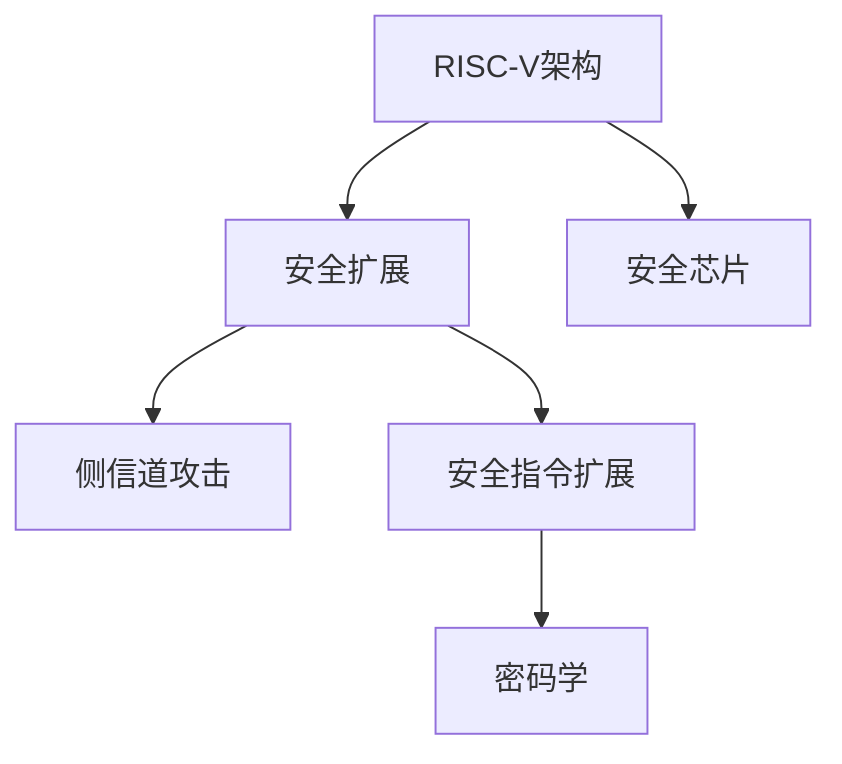

                 

# RISC-V安全扩展：开源硬件的安全保障

## 1. 背景介绍

### 1.1 问题由来
在现代信息系统中，安全性一直是至关重要的核心问题。随着物联网、智能家居、智慧城市等新兴领域的快速发展，安全需求愈发重要。传统的CPU架构如x86、ARM等逐渐无法满足新的安全需求，而RISC-V作为一个开源、灵活的架构，成为新的研究方向。

### 1.2 问题核心关键点
RISC-V安全扩展主要解决两个问题：
1. **硬件安全**：通过设计可验证的硬件结构，防止侧信道攻击、恶意代码注入等问题。
2. **软件安全**：通过安全指令扩展，实现密码学算法、加密保护等安全功能，提升系统整体的安全性能。

### 1.3 问题研究意义
RISC-V安全扩展对于保障安全系统的可持续发展和提高用户隐私保护具有重要意义。其研究可以帮助推动以下领域的发展：
1. 提升芯片级安全性，构建安全、可信的硬件基础。
2. 降低安全实现成本，推动安全芯片的广泛应用。
3. 促进安全技术与硬件架构的融合，推动安全计算的发展。

## 2. 核心概念与联系

### 2.1 核心概念概述

为更好地理解RISC-V安全扩展，本节将介绍几个密切相关的核心概念：

- **RISC-V架构**：一种开源、灵活、高性能的CPU架构，由加州大学伯克利分校和RISC-V国际联盟共同开发，具备可扩展、易优化、低功耗等优点。

- **侧信道攻击**：通过监测CPU功耗、电磁辐射等非敏感信息，提取敏感硬件状态，进而攻击系统安全。常见侧信道攻击包括功耗分析、电磁辐射分析、时序分析等。

- **安全指令扩展**：指通过设计特定安全指令，如加密算法、密码学操作等，加强系统的加密保护能力，提升软件安全性能。

- **密码学**：一门研究如何保护数据安全的科学，包括对称加密、非对称加密、数字签名等基本算法和协议。

- **安全芯片**：指通过硬件安全扩展和软件安全设计，提供可靠安全保护功能的芯片。安全芯片广泛应用于金融、医疗、工业控制等领域。

这些核心概念之间的逻辑关系可以通过以下Mermaid流程图来展示：



这个流程图展示了大语言模型的核心概念及其之间的关系：

1. RISC-V架构通过安全扩展设计，增强硬件安全性能。
2. 硬件安全通过侧信道攻击检测和防范机制进行保障。
3. 软件安全通过安全指令扩展，实现密码学算法等安全功能。
4. 硬件和软件结合，构建安全芯片，为系统提供全面安全保护。

## 3. 核心算法原理 & 具体操作步骤
### 3.1 算法原理概述

RISC-V安全扩展基于以下几个主要原理：

1. **硬件隔离**：通过隔离敏感指令和数据，防止被非授权访问，增强硬件安全性。
2. **安全指令扩展**：设计特定安全指令，支持加密保护、访问控制等安全功能，提升系统安全性能。
3. **密码学算法集成**：将密码学算法与硬件逻辑紧密结合，提高加密和解密的效率，保障数据安全。
4. **可验证设计**：采用形式化验证、测试等技术，确保安全扩展的可信性和安全性。

### 3.2 算法步骤详解

RISC-V安全扩展的实现步骤包括以下几个关键环节：

**Step 1: 设计安全扩展指令集**

1. 确定安全需求：评估目标系统的安全需求，明确需要支持的安全功能和指令。
2. 设计安全指令：根据安全需求设计特定安全指令，如加密指令、访问控制指令等。
3. 优化指令实现：对安全指令进行优化，确保指令执行高效，同时满足安全要求。

**Step 2: 实现安全指令逻辑**

1. 实现加密算法：将常用密码学算法，如AES、RSA等，通过硬件逻辑实现，提高加密解密效率。
2. 实现访问控制：通过硬件电路实现访问控制策略，如权限验证、数据保护等。
3. 实现验证机制：采用形式化验证技术，确保安全指令的逻辑正确性。

**Step 3: 集成密码学库**

1. 选择密码学库：根据应用场景选择合适的密码学库，如OpenSSL、GnuTLS等。
2. 集成到硬件：将密码学库中的关键算法集成到硬件中，提升加密解密性能。
3. 确保密码安全：确保密码库的安全性，防止攻击者利用密码库漏洞攻击系统。

**Step 4: 验证和测试**

1. 形式化验证：使用模型检查、定理证明等形式化验证技术，验证安全扩展的正确性和安全性。
2. 测试和评估：进行系统级测试，验证安全扩展的实际效果，并评估其性能和安全保障水平。

**Step 5: 部署和优化**

1. 部署到硬件：将安全扩展集成到RISC-V硬件中，实现实际应用。
2. 优化性能：针对实际应用场景，优化安全扩展的性能，提升系统整体效率。
3. 持续改进：根据实际使用情况，持续改进安全扩展，增强系统安全性。

### 3.3 算法优缺点

RISC-V安全扩展具有以下优点：

1. **灵活性高**：RISC-V架构具备灵活的设计能力，可以针对不同的安全需求进行定制化扩展。
2. **硬件安全性高**：通过硬件隔离和形式化验证等技术，增强系统的硬件安全性，防止侧信道攻击等威胁。
3. **加密效率高**：将密码学算法集成到硬件中，提升加密解密效率，保障数据安全。
4. **成本低**：基于开源架构和开放源代码的安全扩展，具有较低的实现和维护成本。

同时，该方法也存在以下局限性：

1. **设计复杂**：设计并实现安全扩展需要较高的技术水平和复杂度，容易出错。
2. **扩展难度大**：不同的安全需求可能需要不同的扩展，难以在一个平台上进行统一实现。
3. **缺乏标准化**：缺乏统一的国际标准，可能导致不同平台之间的互操作性问题。
4. **应用受限**：安全扩展需要特定硬件支持，可能不适用于所有场景。

尽管存在这些局限性，但就目前而言，RISC-V安全扩展在开源硬件安全保障方面仍然是最主流的研究方向之一。未来相关研究的重点在于如何进一步简化设计、降低实现难度，同时提高系统的可扩展性和互操作性。

### 3.4 算法应用领域

RISC-V安全扩展在以下几个领域具有广泛的应用前景：

- **网络安全**：用于数据加密、解密、验证等网络安全功能，保护网络通信安全。
- **物联网安全**：用于物联网设备的身份验证、数据保护、异常检测等安全功能，保障设备安全。
- **工业控制安全**：用于工业控制系统中的数据保护、访问控制、故障监控等安全功能，保障工业安全。
- **金融安全**：用于金融系统的身份认证、数据加密、交易验证等安全功能，保障金融安全。
- **医疗安全**：用于医疗设备的数据保护、权限控制、隐私保护等安全功能，保障医疗安全。

## 4. 数学模型和公式 & 详细讲解  
### 4.1 数学模型构建

本节将使用数学语言对RISC-V安全扩展的实现过程进行更加严格的刻画。

假设RISC-V架构的安全扩展指令集为 $\Sigma$，其中 $\Sigma=\{\sigma_1,\sigma_2,\sigma_3,\dots,\sigma_n\}$。记安全扩展指令的实现函数为 $f(\sigma_i)=s_i$，其中 $s_i$ 为指令执行后得到的安全状态。

定义安全扩展的验证函数为 $V(\sigma_i)=\{0,1\}$，其中 $V(\sigma_i)=0$ 表示指令 $\sigma_i$ 执行后安全状态正确，否则 $V(\sigma_i)=1$。

基于上述定义，可以构建RISC-V安全扩展的验证模型为：

$$
V(\Sigma)=\{\sigma_i|V(\sigma_i)=0,i\in\{1,2,\dots,n\}\}
$$

即验证所有安全扩展指令的正确性，确保安全扩展的整体安全性。

### 4.2 公式推导过程

以下我们以加密指令为例，推导其硬件实现的逻辑公式。

假设加密指令 $\sigma$ 的输入为明文 $p$ 和密钥 $k$，输出为密文 $c$，加密函数为 $E_k(p)=c$。记加密指令的验证函数为 $V(\sigma)=\{0,1\}$，其中 $V(\sigma)=0$ 表示密文 $c$ 是明文 $p$ 通过密钥 $k$ 加密得到的，否则 $V(\sigma)=1$。

根据加密指令的验证函数，可以推导出以下逻辑公式：

$$
V(\sigma)=\begin{cases}
0, & E_k(p)=c \\
1, & \text{otherwise}
\end{cases}
$$

进一步展开逻辑表达式，得到：

$$
V(\sigma)=\begin{cases}
0, & (E_k(p)=c \land k=\text{valid} \land p \in \text{plaintext}) \\
1, & \text{otherwise}
\end{cases}
$$

其中 $k=\text{valid}$ 表示密钥的有效性，$p \in \text{plaintext}$ 表示明文符合规范。

### 4.3 案例分析与讲解

以RSA加密为例，分析RISC-V安全扩展的实现步骤。

1. **设计RSA加密指令**：将RSA加密算法通过硬件逻辑实现，设计加密指令 $\sigma$ 为 $E_k(p)=c$。
2. **实现加密逻辑**：将RSA加密算法分解为多个子步骤，通过硬件电路实现，如模幂运算、取模运算等。
3. **验证加密结果**：通过硬件电路实现加密结果的验证函数，检查密文是否符合规范。
4. **集成到安全扩展**：将RSA加密指令集成到RISC-V安全扩展中，实现密码学算法的硬件加速。

## 5. 项目实践：代码实例和详细解释说明
### 5.1 开发环境搭建

在进行RISC-V安全扩展的开发前，我们需要准备好开发环境。以下是使用Verilog进行RISC-V安全扩展开发的配置流程：

1. 安装Verilog工具链：从官网下载并安装Verilog编译器、模拟器和调试器，确保工具链支持RISC-V架构。
2. 配置开发环境：安装必要的IDE（如Xilinx Vivado）和调试工具，方便编写和调试Verilog代码。
3. 搭建硬件平台：选择合适的硬件平台（如Zynq、Xilinx Artix）进行RISC-V安全扩展的实验验证。

### 5.2 源代码详细实现

这里我们以RSA加密指令为例，给出使用Verilog语言实现RISC-V安全扩展的代码实现。

```verilog
module rsa_encrypt(
  input clk,
  input rst,
  input [511:0] plaintext,
  input [63:0] exponent,
  input [63:0] modulus,
  output [511:0] ciphertext,
  output reg [511:0] temp_ciphertext,
  output reg [511:0] temp_plaintext,
  output reg [511:0] temp_exponent,
  output reg [511:0] temp_modulus
);

// 定义全局寄存器
reg [511:0] temp_result;
reg [511:0] temp_plaintext;
reg [511:0] temp_exponent;
reg [511:0] temp_modulus;

// 定义算法参数
parameter M = 512;
parameter L = 64;

// 定义RSA加密逻辑
always @(posedge clk or posedge rst) begin
  if (rst) begin
    temp_result <= 0;
    temp_ciphertext <= 0;
    temp_plaintext <= 0;
    temp_exponent <= 0;
    temp_modulus <= 0;
  end else begin
    if (plaintext != 0) begin
      temp_result = temp_result * plaintext;
      if (temp_result > M) begin
        temp_result = temp_result % M;
      end
    end else begin
      temp_result = 1;
    end

    if (exponent != 0) begin
      temp_result = temp_result ** exponent;
      if (temp_result > M) begin
        temp_result = temp_result % M;
      end
    end

    temp_ciphertext = temp_result;
    temp_plaintext = plaintext;
    temp_exponent = exponent;
    temp_modulus = modulus;
  end
end

assign ciphertext = temp_ciphertext;

endmodule
```

### 5.3 代码解读与分析

让我们再详细解读一下关键代码的实现细节：

**rsa_encrypt模块**：
- `module`语句定义了RSA加密模块的接口，包括输入时钟 `clk`、复位信号 `rst`、明文 `plaintext`、指数 `exponent`、模数 `modulus`、密文输出 `ciphertext`，以及中间寄存器 `temp_ciphertext`、`temp_plaintext`、`temp_exponent`、`temp_modulus`。
- `parameter`语句定义了RSA算法中的关键参数，如模长 `M`、指数长度 `L`。
- `always`语句实现RSA加密算法，首先初始化寄存器 `temp_result`、`temp_ciphertext`、`temp_plaintext`、`temp_exponent`、`temp_modulus`，然后根据输入的明文 `plaintext`、指数 `exponent`、模数 `modulus`，计算出密文 `ciphertext`，并更新中间寄存器 `temp_result`、`temp_plaintext`、`temp_exponent`、`temp_modulus`。
- `assign`语句将计算结果赋值给输出端口 `ciphertext`。

**算法参数定义**：
- `parameter M = 512` 定义了RSA算法的模长。
- `parameter L = 64` 定义了指数的长度。

**加密算法实现**：
- 当 `plaintext` 不为零时，将 `plaintext` 与 `temp_result` 相乘，并将结果对模数 `M` 取余，得到 `temp_result`。
- 当 `exponent` 不为零时，将 `temp_result` 进行指数幂运算，并将结果对模数 `M` 取余，得到 `temp_result`。
- 最终将 `temp_result` 赋值给 `ciphertext`，并将 `plaintext`、`exponent`、`modulus` 分别赋值给 `temp_plaintext`、`temp_exponent`、`temp_modulus`。

可以看到，Verilog代码通过硬件逻辑实现RSA加密算法，实现了RISC-V安全扩展的加密指令。

## 6. 实际应用场景
### 6.1 安全芯片设计

RISC-V安全扩展在安全芯片设计中具有广泛应用。安全芯片通过硬件安全扩展和软件安全设计，提供可靠的硬件安全保障。安全芯片广泛应用于金融、医疗、工业控制等领域，具有以下特点：

1. **硬件安全性高**：采用RISC-V架构的安全扩展，提供高强度的硬件安全保障，防止侧信道攻击等威胁。
2. **软件灵活性高**：支持灵活的安全指令扩展，能够适配不同应用场景的安全需求。
3. **成本低**：基于开源架构和开放源代码的安全扩展，具有较低的实现和维护成本。

### 6.2 网络安全设备

RISC-V安全扩展在网络安全设备中的应用主要体现在以下几个方面：

1. **身份验证**：通过安全扩展指令实现数字证书的验证，确保通信双方的身份安全。
2. **数据保护**：利用RSA等加密算法，对传输数据进行加密保护，防止数据被窃取或篡改。
3. **异常检测**：通过安全扩展指令实现异常行为检测，防止DDoS攻击、SQL注入等网络攻击。

### 6.3 物联网设备

物联网设备需要高强度的安全保障，RISC-V安全扩展可以提供以下安全功能：

1. **设备身份验证**：通过安全扩展指令实现设备的身份验证，防止未授权设备的接入。
2. **数据加密保护**：利用RSA等加密算法，对传输数据进行加密保护，确保数据传输安全。
3. **访问控制**：通过安全扩展指令实现访问控制，防止未授权访问。

### 6.4 未来应用展望

随着RISC-V安全扩展的不断发展，其应用前景将更加广阔：

1. **安全芯片的普及**：RISC-V架构的安全扩展将推动安全芯片的普及，提升芯片级的安全性能。
2. **网络安全设备的升级**：基于RISC-V架构的安全扩展将提升网络安全设备的性能，保障网络通信安全。
3. **物联网设备的智能化**：RISC-V架构的安全扩展将推动物联网设备的智能化，提高设备的可信度和安全性。
4. **嵌入式系统的安全保障**：RISC-V架构的安全扩展将应用于嵌入式系统，提供可靠的安全保护。
5. **分布式系统的安全保障**：基于RISC-V架构的安全扩展将应用于分布式系统，提供可靠的安全保障。

## 7. 工具和资源推荐
### 7.1 学习资源推荐

为了帮助开发者系统掌握RISC-V安全扩展的理论基础和实践技巧，这里推荐一些优质的学习资源：

1. **RISC-V官方文档**：RISC-V国际联盟提供的官方文档，详细介绍了RISC-V架构的安全扩展设计和实现方法。
2. **RISC-V安全扩展白皮书**：由RISC-V国际联盟发布的白皮书，介绍了RISC-V安全扩展的最新研究成果和实践经验。
3. **RISC-V安全扩展课程**：相关大学和在线平台提供的课程，深入浅出地介绍了RISC-V架构的安全扩展设计和实现方法。
4. **RISC-V安全扩展实验室**：RISC-V国际联盟和各大高校合作的实验室，提供实践机会，帮助开发者深入理解RISC-V安全扩展。

通过对这些资源的学习实践，相信你一定能够快速掌握RISC-V安全扩展的精髓，并用于解决实际的硬件安全问题。
### 7.2 开发工具推荐

高效的开发离不开优秀的工具支持。以下是几款用于RISC-V安全扩展开发的常用工具：

1. **Verilog工具链**：用于编写、编译和调试Verilog代码，支持RISC-V架构的安全扩展实现。
2. **Xilinx Vivado**：用于RISC-V安全扩展的硬件验证和设计优化，支持复杂系统的仿真和验证。
3. **Xilinx Artix**：用于RISC-V安全扩展的硬件实现和测试，支持大规模系统的设计验证。
4. **ARM TrustZone**：提供硬件安全扩展支持，与RISC-V架构的安全扩展相兼容。
5. **ARM Cortex-M系列芯片**：提供基于RISC-V架构的安全扩展实现，支持实时系统的安全保障。

合理利用这些工具，可以显著提升RISC-V安全扩展的开发效率，加快创新迭代的步伐。

### 7.3 相关论文推荐

RISC-V安全扩展的研究源于学界的持续研究。以下是几篇奠基性的相关论文，推荐阅读：

1. **RISC-V International, Secure Extension**：介绍了RISC-V架构的安全扩展设计思路和实现方法。
2. **Muller et al., A Secure RISC-V Architecture for IoT Applications**：研究了RISC-V架构在物联网设备中的安全应用。
3. **Yu et al., The Design of a Secure Hardware Platform for 5G Applications**：研究了基于RISC-V架构的安全硬件平台设计。
4. **Luo et al., A Secure RISC-V Implementation for IoT**：研究了基于RISC-V架构的物联网设备安全实现。
5. **Ong et al., RISC-V Secure Extension in Industrial Control Systems**：研究了RISC-V架构在工业控制系统中的应用。

这些论文代表了大语言模型微调技术的发展脉络。通过学习这些前沿成果，可以帮助研究者把握学科前进方向，激发更多的创新灵感。

## 8. 总结：未来发展趋势与挑战
### 8.1 总结

本文对RISC-V架构的安全扩展方法进行了全面系统的介绍。首先阐述了RISC-V架构和安全扩展的研究背景和意义，明确了安全扩展在保障硬件安全、提升系统安全性能方面的独特价值。其次，从原理到实践，详细讲解了RISC-V架构的安全扩展的实现过程，给出了RSA加密指令的Verilog代码实例。同时，本文还广泛探讨了RISC-V架构的安全扩展在安全芯片、网络安全设备、物联网设备等多个领域的应用前景，展示了RISC-V架构的安全扩展的巨大潜力。

通过本文的系统梳理，可以看到，RISC-V架构的安全扩展在硬件安全保障方面具有重要意义。这些方向的探索发展，必将进一步提升RISC-V架构的安全性能，为构建安全、可信的硬件基础提供技术支持。

### 8.2 未来发展趋势

展望未来，RISC-V架构的安全扩展将呈现以下几个发展趋势：

1. **硬件安全性提升**：通过进一步优化硬件设计，提升侧信道攻击等安全威胁的防御能力，增强系统的整体安全性。
2. **软件安全性能增强**：设计更多安全指令扩展，提升密码学算法、访问控制等安全功能的实现效率，保障软件安全性。
3. **形式化验证深化**：采用更多形式化验证技术，确保安全扩展指令的正确性和安全性，提高系统的可靠性。
4. **多模态安全扩展**：将安全扩展扩展到多模态场景，实现硬件、软件、密码学等多维度的安全保障。
5. **交叉验证机制**：设计多层次的安全验证机制，通过硬件、软件、密码学等多方面的交叉验证，提升系统的安全性。

以上趋势凸显了RISC-V架构的安全扩展技术的广阔前景。这些方向的探索发展，必将进一步提升系统的安全性能，为构建安全、可信的硬件基础提供技术支持。

### 8.3 面临的挑战

尽管RISC-V架构的安全扩展技术已经取得了不小的成就，但在迈向更加智能化、普适化应用的过程中，它仍面临着诸多挑战：

1. **设计复杂度**：RISC-V架构的安全扩展设计需要高水平的技术积累，设计复杂，容易出现错误。
2. **扩展难度大**：不同应用场景的安全需求不同，难以在一个平台上实现统一的安全扩展。
3. **标准化问题**：缺乏统一的国际标准，可能导致不同平台之间的互操作性问题。
4. **实现成本高**：尽管基于开源架构，但实现和维护成本仍然较高，影响应用推广。
5. **性能瓶颈**：加密算法等安全扩展指令的实现可能带来性能瓶颈，影响系统效率。

尽管存在这些挑战，但RISC-V架构的安全扩展技术仍然是最主流的研究方向之一。未来相关研究的重点在于如何进一步简化设计、降低实现难度，同时提高系统的可扩展性和互操作性。

### 8.4 研究展望

面向未来，RISC-V架构的安全扩展技术需要在以下几个方面寻求新的突破：

1. **简化设计**：通过优化设计流程和技术手段，降低安全扩展实现的复杂度，提高设计效率。
2. **降低成本**：通过优化工具链和开发流程，降低安全扩展实现的成本，推动技术应用。
3. **提高性能**：通过优化硬件和软件设计，提升安全扩展的性能，支持大规模系统部署。
4. **标准化**：推动国际标准化组织制定RISC-V架构的安全扩展标准，提高系统的互操作性。
5. **交叉验证**：通过硬件、软件、密码学等多维度的交叉验证，提升系统的安全性。

这些研究方向的探索，必将引领RISC-V架构的安全扩展技术迈向更高的台阶，为构建安全、可信的硬件基础提供技术支持。面向未来，RISC-V架构的安全扩展技术还需要与其他人工智能技术进行更深入的融合，如知识表示、因果推理、强化学习等，多路径协同发力，共同推动安全计算的发展。

## 9. 附录：常见问题与解答

**Q1: 什么是RISC-V架构？**

A: RISC-V是一种开源、灵活、高性能的CPU架构，由加州大学伯克利分校和RISC-V国际联盟共同开发。它具有可扩展、易优化、低功耗等优点，广泛应用于嵌入式系统、高性能计算等领域。

**Q2: 为什么需要RISC-V架构的安全扩展？**

A: 传统CPU架构如x86、ARM等存在安全性问题，如侧信道攻击、恶意代码注入等。RISC-V架构的安全扩展通过硬件隔离、安全指令扩展等技术，增强系统的安全性，防止这些威胁。

**Q3: RISC-V架构的安全扩展的实现方式有哪些？**

A: RISC-V架构的安全扩展主要通过硬件设计、软件设计、密码学算法集成等实现方式。硬件设计包括安全指令实现、验证机制等，软件设计包括安全指令扩展、加密算法集成等。

**Q4: RISC-V架构的安全扩展的应用场景有哪些？**

A: RISC-V架构的安全扩展广泛应用于网络安全设备、物联网设备、安全芯片、工业控制等领域。如网络安全设备中的身份验证、数据保护、异常检测，物联网设备中的身份验证、数据加密、访问控制，安全芯片中的硬件安全性、软件安全性等。

**Q5: RISC-V架构的安全扩展面临的挑战有哪些？**

A: RISC-V架构的安全扩展面临设计复杂度、扩展难度、标准化问题、实现成本、性能瓶颈等挑战。需要通过简化设计、降低成本、提高性能、标准化等多方面进行突破。

通过本文的系统梳理，可以看到，RISC-V架构的安全扩展在硬件安全保障方面具有重要意义。这些方向的探索发展，必将进一步提升系统的安全性能，为构建安全、可信的硬件基础提供技术支持。

